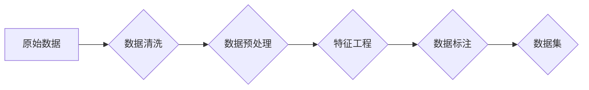

> 数据集工程、AI应用、数据质量、特征工程、数据预处理、数据标注、数据标注员、机器学习、深度学习、数据隐私、数据安全

# 数据集工程在AI应用中的重要性

数据集工程是人工智能应用开发的基础和关键环节。在机器学习和深度学习领域，高质量的数据集是构建强大模型的前提。本文将深入探讨数据集工程在AI应用中的重要性，涵盖数据质量、特征工程、数据预处理、数据标注等方面，并展望未来发展趋势与挑战。

## 1. 背景介绍

随着人工智能技术的快速发展，AI应用已经在各个领域得到了广泛应用。然而，AI应用的成功并非仅仅依赖于先进的算法和强大的计算能力，数据集的质量和工程水平同样至关重要。数据集工程是指对原始数据进行清洗、标注、预处理等操作，以提升数据质量，为机器学习模型提供更好的输入。

### 1.1 问题的由来

在AI应用开发过程中，数据集工程面临着以下问题：

- **数据质量问题**：原始数据往往存在缺失值、异常值、噪声等质量问题，直接影响模型的训练效果。
- **特征质量问题**：从原始数据中提取的特征可能存在冗余、噪声等问题，影响模型的泛化能力。
- **数据标注成本高**：高质量的数据标注需要大量人工投入，成本高昂。
- **数据隐私和安全问题**：数据集可能包含敏感信息，需要妥善处理以保障数据隐私和安全。

### 1.2 研究现状

针对数据集工程中的问题，研究者们提出了多种解决方案，包括：

- **数据清洗**：通过填充、删除、替换等方式处理缺失值和异常值。
- **特征工程**：通过特征选择、特征提取、特征组合等方法提升特征质量。
- **数据标注自动化**：利用自动标注、半自动标注等方法降低数据标注成本。
- **数据脱敏**：对敏感数据进行脱敏处理，以保护数据隐私。

### 1.3 研究意义

数据集工程在AI应用中的重要性体现在以下几个方面：

- **提升模型性能**：高质量的数据集能够帮助模型学习到更准确的特征，从而提升模型性能。
- **降低开发成本**：通过数据清洗和特征工程，可以减少模型训练时间，降低开发成本。
- **保护数据隐私**：数据脱敏技术能够有效保护数据隐私和安全。
- **推动AI发展**：数据集工程是AI应用开发的重要基石，对AI技术的进步具有重要意义。

## 2. 核心概念与联系

### 2.1 核心概念原理

数据集工程涉及以下核心概念：

- **数据清洗**：对原始数据进行清洗，处理缺失值、异常值、噪声等问题。
- **特征工程**：从原始数据中提取或构造新的特征，提升特征质量。
- **数据标注**：对数据集进行标注，为模型提供标注信息。
- **数据预处理**：对数据进行标准化、归一化、归一化等操作，为模型训练做好准备。
- **数据脱敏**：对敏感数据进行脱敏处理，以保护数据隐私。

### 2.2 架构的 Mermaid 流程图



## 3. 核心算法原理 & 具体操作步骤

### 3.1 算法原理概述

数据集工程涉及多种算法和技术，以下列举几种核心算法：

- **数据清洗**：包括填充缺失值、删除异常值、替换异常值等。
- **特征工程**：包括特征选择、特征提取、特征组合等。
- **数据标注**：包括自动标注、半自动标注、人工标注等。
- **数据预处理**：包括数据标准化、归一化、归一化等。

### 3.2 算法步骤详解

#### 3.2.1 数据清洗

数据清洗的步骤包括：

1. 数据探索：了解数据的基本特征，发现数据质量问题。
2. 缺失值处理：根据缺失值的类型和比例，选择合适的填充或删除策略。
3. 异常值处理：识别异常值，并进行处理，如删除、替换等。

#### 3.2.2 特征工程

特征工程的步骤包括：

1. 特征选择：根据特征与目标变量的相关性，选择有用的特征。
2. 特征提取：从原始数据中提取新的特征，如文本向量化、图像特征提取等。
3. 特征组合：将多个特征组合成新的特征，提升特征表达能力。

#### 3.2.3 数据标注

数据标注的步骤包括：

1. 标注方案设计：根据任务需求，设计标注方案。
2. 自动标注：利用自动标注技术进行初步标注。
3. 半自动标注：人工审核自动标注结果，进行修正。
4. 人工标注：对复杂任务进行人工标注。

#### 3.2.4 数据预处理

数据预处理的步骤包括：

1. 数据标准化：将数据缩放到相同的范围，如均值归一化、最小-最大标准化等。
2. 归一化：对数据进行线性变换，使其具有相同的尺度。
3. 特征缩放：对特征进行缩放，如PCA、t-SNE等。

### 3.3 算法优缺点

#### 3.3.1 数据清洗

优点：

- 提升数据质量，减少模型训练时间。
- 降低模型过拟合风险。

缺点：

- 可能引入偏差，影响模型泛化能力。

#### 3.3.2 特征工程

优点：

- 提升模型性能，减少模型过拟合风险。

缺点：

- 特征工程需要大量经验和专业知识。
- 特征工程结果难以解释。

#### 3.3.3 数据标注

优点：

- 提升模型性能，提高模型泛化能力。

缺点：

- 数据标注成本高，周期长。

#### 3.3.4 数据预处理

优点：

- 提升模型性能，减少模型过拟合风险。

缺点：

- 可能引入偏差，影响模型泛化能力。

### 3.4 算法应用领域

数据集工程广泛应用于以下领域：

- 机器学习：如分类、回归、聚类等。
- 深度学习：如神经网络、卷积神经网络、循环神经网络等。
- 自然语言处理：如文本分类、情感分析、机器翻译等。

## 4. 数学模型和公式 & 详细讲解 & 举例说明

### 4.1 数学模型构建

数据集工程中的数学模型主要包括：

- **缺失值处理**：使用均值、中位数、众数等统计量填充缺失值。
- **异常值处理**：使用IQR、z-score等方法识别和处理异常值。
- **特征选择**：使用卡方检验、信息增益等统计方法选择特征。
- **特征提取**：使用主成分分析(PCA)、t-SNE等方法提取特征。
- **特征组合**：使用线性组合、多项式特征等组合特征。

### 4.2 公式推导过程

以下列举几个常用的数学公式：

- **均值填充缺失值**：

$$
\hat{x} = \frac{\sum_{i \neq n} x_i}{N-1}
$$

其中，$\hat{x}$ 为填充后的值，$x_i$ 为非缺失值，$N$ 为样本数量。

- **IQR**：

$$
IQR = Q_3 - Q_1
$$

其中，$Q_3$ 和 $Q_1$ 分别为第三四分位数和第一四分位数。

- **卡方检验**：

$$
\chi^2 = \sum \frac{(O_i - E_i)^2}{E_i}
$$

其中，$O_i$ 为观测频数，$E_i$ 为期望频数。

### 4.3 案例分析与讲解

#### 4.3.1 数据清洗

假设有一个包含年龄、收入和贷款额的数据集，其中年龄和收入存在缺失值，贷款额存在异常值。

- **填充缺失值**：可以使用年龄的平均值和收入的中位数分别填充年龄和收入的缺失值。
- **处理异常值**：可以使用IQR方法识别贷款额的异常值，并进行处理。

#### 4.3.2 特征工程

假设我们需要对电影评论进行情感分析。

- **特征选择**：可以使用TF-IDF方法提取关键词，并根据关键词的相关性选择特征。
- **特征提取**：可以使用词嵌入技术将文本转换为向量表示。

## 5. 项目实践：代码实例和详细解释说明

### 5.1 开发环境搭建

以下是使用Python进行数据集工程实践的开发环境搭建步骤：

1. 安装Anaconda：从官网下载并安装Anaconda，用于创建独立的Python环境。
2. 创建并激活虚拟环境：

```bash
conda create -n data-engineering-env python=3.8
conda activate data-engineering-env
```

3. 安装必要的库：

```bash
conda install pandas numpy scikit-learn matplotlib jupyter notebook
```

### 5.2 源代码详细实现

以下是一个简单的数据清洗和特征工程的示例代码：

```python
import pandas as pd
from sklearn.feature_extraction.text import TfidfVectorizer
from sklearn.model_selection import train_test_split

# 加载数据集
data = pd.read_csv('data.csv')

# 数据清洗
data.fillna(data.mean(), inplace=True)
data.replace([np.inf, -np.inf], np.nan, inplace=True)
data.dropna(inplace=True)

# 特征工程
tfidf = TfidfVectorizer(max_features=1000)
tfidf_matrix = tfidf.fit_transform(data['review'])

# 划分训练集和测试集
X_train, X_test, y_train, y_test = train_test_split(tfidf_matrix, data['rating'], test_size=0.2, random_state=42)
```

### 5.3 代码解读与分析

以上代码展示了如何使用Python进行数据清洗和特征工程。首先，使用pandas库加载CSV格式的数据集。然后，使用pandas的fillna、replace和dropna方法对缺失值和异常值进行处理。接下来，使用TF-IDF方法提取文本数据中的关键词，并转换为向量表示。最后，使用train_test_split方法将数据集划分为训练集和测试集。

### 5.4 运行结果展示

运行上述代码后，我们得到处理后的数据集和特征矩阵。可以进一步使用机器学习或深度学习模型进行训练和预测。

## 6. 实际应用场景

数据集工程在以下应用场景中具有重要意义：

- **金融领域**：用于风险评估、欺诈检测、信用评分等。
- **医疗领域**：用于疾病诊断、药物研发、患者管理等。
- **零售领域**：用于客户细分、精准营销、库存管理等。
- **交通领域**：用于交通流量预测、智能交通管理、自动驾驶等。

### 6.4 未来应用展望

未来，数据集工程将在以下方面得到进一步发展：

- **自动化数据清洗**：开发更加自动化的数据清洗工具，降低人工成本。
- **智能特征工程**：利用机器学习或深度学习技术进行智能特征工程。
- **可解释性数据集工程**：提高数据集工程过程的可解释性，方便研究人员理解模型决策。
- **隐私保护数据集工程**：开发隐私保护的数据集工程方法，保护数据隐私。

## 7. 工具和资源推荐

### 7.1 学习资源推荐

- **书籍**：
  - 《数据科学入门：Python数据处理与机器学习》
  - 《统计学习方法》
- **在线课程**：
  - Coursera上的《数据科学专项课程》
  - edX上的《机器学习专项课程》
- **博客和论坛**：
  - Medium上的数据科学和机器学习博客
  - Stack Overflow上的数据科学和机器学习论坛

### 7.2 开发工具推荐

- **编程语言**：
  - Python
- **库**：
  - pandas
  - NumPy
  - scikit-learn
  - TensorFlow
  - PyTorch
- **工具**：
  - Jupyter Notebook
  - Anaconda

### 7.3 相关论文推荐

- **数据清洗**：
  - "Data Cleaning: Concepts and Techniques for Managing Data Quality" by Bill Cleveland
- **特征工程**：
  - "Feature Engineering and Selection: A Python Textbook" by Charles R. Holmes
- **数据标注**：
  - "Crowdsourcing and Human Computation: Motivation, Technology, and Data" by L. Ping Li

## 8. 总结：未来发展趋势与挑战

### 8.1 研究成果总结

本文深入探讨了数据集工程在AI应用中的重要性，分析了数据集工程的核心概念、算法原理和具体操作步骤，并展示了数据集工程在实际应用中的案例。数据集工程是AI应用开发的基础和关键环节，对模型性能、开发成本、数据隐私等方面具有重要影响。

### 8.2 未来发展趋势

未来，数据集工程将在以下方面得到进一步发展：

- **自动化和智能化**：开发更加自动化的数据清洗和特征工程工具。
- **可解释性和可追溯性**：提高数据集工程过程的可解释性和可追溯性。
- **隐私保护和安全性**：开发隐私保护和安全性更高的数据集工程方法。

### 8.3 面临的挑战

数据集工程在发展过程中也面临以下挑战：

- **数据质量和多样性**：如何获取高质量、多样化的数据集。
- **数据标注成本**：如何降低数据标注成本。
- **数据隐私和安全**：如何保护数据隐私和安全。

### 8.4 研究展望

未来，数据集工程将与其他人工智能技术深度融合，推动AI应用在各个领域的广泛应用。同时，研究者们需要关注数据质量和多样性、数据标注成本、数据隐私和安全等挑战，推动数据集工程技术的持续发展。

## 9. 附录：常见问题与解答

**Q1：数据集工程与特征工程有何区别？**

A：数据集工程和特征工程是数据预处理过程中的两个重要环节。数据集工程主要关注数据清洗、数据标注等操作，而特征工程主要关注特征选择、特征提取等操作。

**Q2：如何选择合适的特征工程方法？**

A：选择合适的特征工程方法需要考虑以下因素：

- 任务类型：不同的任务需要不同的特征工程方法。
- 数据特点：根据数据的特点选择合适的特征工程方法。
- 模型性能：评估不同特征工程方法对模型性能的影响。

**Q3：数据集工程对模型性能有何影响？**

A：数据集工程对模型性能具有重要影响。高质量的数据集能够帮助模型学习到更准确的特征，从而提升模型性能。

**Q4：如何保护数据隐私和安全？**

A：保护数据隐私和安全需要采取以下措施：

- 数据脱敏：对敏感数据进行脱敏处理。
- 访问控制：限制对敏感数据的访问权限。
- 数据加密：对数据进行加密处理。

**Q5：数据集工程在人工智能领域的应用前景如何？**

A：数据集工程在人工智能领域的应用前景非常广阔。随着人工智能技术的不断发展，数据集工程将在各个领域发挥越来越重要的作用。

---

作者：禅与计算机程序设计艺术 / Zen and the Art of Computer Programming