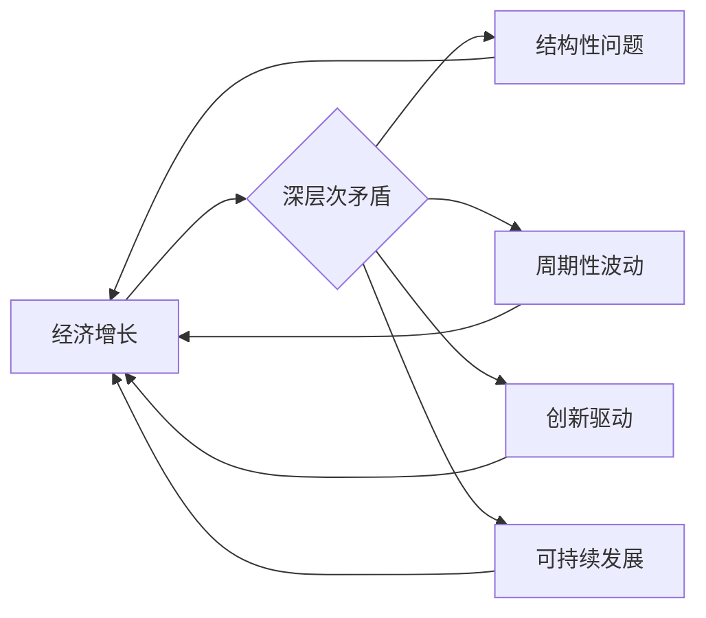

# 深层次矛盾对经济增长的影响

> 关键词：经济增长，深层次矛盾，结构性问题，周期性波动，创新驱动，可持续发展

## 1. 背景介绍

经济增长是国家和地区发展的核心目标，它不仅关系到国计民生，也影响着国际竞争格局。然而，经济增长并非一帆风顺，往往伴随着各种深层次矛盾和周期性波动。本文旨在探讨深层次矛盾对经济增长的影响，分析其内在机制，并提出相应的政策建议。

### 1.1 问题的由来

随着全球化和技术革命的推进，经济增长模式发生了深刻变化。一方面，新兴市场国家和发展中国家经济快速增长，全球经济结构不断调整。另一方面，发达国家面临生产成本上升、创新能力下降等问题，经济增长动力不足。这种背景下，深层次矛盾逐渐显现，成为影响经济增长的关键因素。

### 1.2 研究现状

关于深层次矛盾对经济增长的影响，学术界已有诸多研究。主要包括以下几个方面：

- **结构性问题**：指经济结构不合理，如产业结构、区域结构、收入分配结构等存在失衡，导致资源错配，影响经济增长。
- **周期性波动**：指经济周期中的扩张与收缩，如经济过热、通货膨胀、经济衰退等，对经济增长产生负面影响。
- **创新驱动**：指科技创新在经济增长中的作用，包括技术进步、产业升级、商业模式创新等。
- **可持续发展**：指经济增长与环境保护、资源利用、社会公平等相协调，实现长期可持续发展。

### 1.3 研究意义

探讨深层次矛盾对经济增长的影响，有助于我们：

- 深入理解经济增长的内在规律，为制定科学合理的经济发展战略提供理论依据。
- 寻找解决深层次矛盾的有效途径，促进经济持续健康发展。
- 推动供给侧结构性改革，提高经济增长的质量和效益。

## 2. 核心概念与联系

### 2.1 核心概念原理

#### 经济增长

经济增长是指在一定时期内，一个国家或地区的国内生产总值（GDP）或人均国内生产总值（GDP per capita）的增长。经济增长是衡量经济发展水平的重要指标。

#### 深层次矛盾

深层次矛盾是指经济、社会、文化等各个领域内在的、难以短期内解决的矛盾，对经济发展产生长期影响。

#### 结构性问题

结构性问题是指经济结构不合理，如产业结构、区域结构、收入分配结构等存在失衡，导致资源错配，影响经济增长。

#### 周期性波动

周期性波动是指经济周期中的扩张与收缩，如经济过热、通货膨胀、经济衰退等，对经济增长产生负面影响。

#### 创新驱动

创新驱动是指科技创新在经济增长中的作用，包括技术进步、产业升级、商业模式创新等。

#### 可持续发展

可持续发展是指经济增长与环境保护、资源利用、社会公平等相协调，实现长期可持续发展。

### 2.2 架构的 Mermaid 流程图

## 3. 核心算法原理 & 具体操作步骤

### 3.1 算法原理概述

本文将从以下几个方面分析深层次矛盾对经济增长的影响：

- **结构性问题**：分析产业结构、区域结构、收入分配结构等存在的不合理现象，探讨其对经济增长的影响。
- **周期性波动**：分析经济周期中的扩张与收缩，探讨其对经济增长的影响。
- **创新驱动**：分析科技创新在经济增长中的作用，探讨其对经济增长的影响。
- **可持续发展**：分析经济增长与环境保护、资源利用、社会公平等的关系，探讨其对经济增长的影响。

### 3.2 算法步骤详解

#### 3.2.1 结构性问题分析

1. 收集和整理产业结构、区域结构、收入分配结构等数据。
2. 分析产业结构、区域结构、收入分配结构等是否存在失衡。
3. 评估失衡对经济增长的影响，如资源错配、效率低下等。
4. 提出优化建议，如调整产业结构、促进区域协调发展、缩小收入差距等。

#### 3.2.2 周期性波动分析

1. 收集和整理经济周期数据，如GDP增长率、通货膨胀率、失业率等。
2. 分析经济周期的扩张与收缩阶段，识别经济过热、通货膨胀、经济衰退等问题。
3. 评估周期性波动对经济增长的影响，如资源浪费、社会不稳定等。
4. 提出政策建议，如实施宏观调控、促进产业升级等。

#### 3.2.3 创新驱动分析

1. 收集和整理科技创新数据，如研发投入、专利申请、技术进步等。
2. 分析科技创新对经济增长的贡献，如提高生产效率、创造新产业等。
3. 评估科技创新对经济增长的影响，如推动产业升级、提高国家竞争力等。
4. 提出政策建议，如加大研发投入、培育创新人才等。

#### 3.2.4 可持续发展分析

1. 收集和整理经济增长与环境保护、资源利用、社会公平等数据。
2. 分析经济增长与可持续发展之间的矛盾，如环境污染、资源枯竭、社会不公等。
3. 评估矛盾对经济增长的影响，如生态破坏、社会不稳定等。
4. 提出政策建议，如发展循环经济、促进绿色发展、实现社会公平等。

### 3.3 算法优缺点

#### 优点

- 系统分析经济增长中的深层次矛盾，全面评估其对经济增长的影响。
- 结合实际案例，提出针对性的政策建议，具有较强的实践指导意义。

#### 缺点

- 研究过程较为复杂，需要大量数据和分析工作。
- 政策建议的可行性受限于多种因素，实施效果难以预测。

### 3.4 算法应用领域

本文的研究成果可用于以下领域：

- 政府决策：为政府部门制定经济发展战略提供参考依据。
- 企业发展：为企业制定发展策略提供参考。
- 研究机构：为相关研究提供理论支持。
- 教育机构：为相关课程提供教学素材。

## 4. 数学模型和公式 & 详细讲解 & 举例说明

### 4.1 数学模型构建

本文将采用以下数学模型来分析深层次矛盾对经济增长的影响：

- **经济增长模型**：基于索洛增长模型，分析经济增长的影响因素。
- **产业结构优化模型**：基于投入产出分析，优化产业结构。
- **区域协调发展模型**：基于区域经济增长差异分析，促进区域协调发展。
- **收入分配优化模型**：基于社会福利函数，优化收入分配。

### 4.2 公式推导过程

#### 4.2.1 经济增长模型

经济增长模型：

$$
 Y_t = A_t K_t^{\alpha} L_t^{\beta} 
$$

其中：

- $Y_t$：第t年的国内生产总值（GDP）
- $A_t$：技术水平
- $K_t$：资本存量
- $L_t$：劳动力数量
- $\alpha$：资本产出弹性
- $\beta$：劳动力产出弹性

#### 4.2.2 产业结构优化模型

产业结构优化模型：

$$
 \max \sum_{i=1}^n U_i(q_i) 
$$

$$
 s.t. 
$$

$$
 \sum_{i=1}^n q_i = Q 
$$

其中：

- $U_i(q_i)$：第i个产业的效用函数
- $q_i$：第i个产业的产出
- $Q$：总产出

#### 4.2.3 区域协调发展模型

区域协调发展模型：

$$
 \min \sum_{i=1}^n (Y_i - \bar{Y})^2 
$$

其中：

- $Y_i$：第i个区域的GDP
- $\bar{Y}$：所有区域的平均GDP

#### 4.2.4 收入分配优化模型

收入分配优化模型：

$$
 \max \int_{0}^{1} u(y) f(y) dy 
$$

$$
 s.t. 
$$

$$
 \sum_{y=0}^{1} y f(y) = Y 
$$

其中：

- $u(y)$：效用函数
- $f(y)$：收入分布函数
- $Y$：总收入

### 4.3 案例分析与讲解

#### 4.3.1 经济增长模型案例分析

以某国为例，分析经济增长的影响因素。

- $A_t$：技术水平
- $K_t$：资本存量
- $L_t$：劳动力数量

根据经济增长模型，我们可以计算该国在不同年份的经济增长率。

#### 4.3.2 产业结构优化模型案例分析

以某产业为例，分析产业结构优化。

- $U_i(q_i)$：效用函数
- $q_i$：产出

根据产业结构优化模型，我们可以找到最优的产出结构，实现产业升级。

#### 4.3.3 区域协调发展模型案例分析

以某地区为例，分析区域协调发展。

- $Y_i$：GDP
- $\bar{Y}$：平均GDP

根据区域协调发展模型，我们可以找到最优的区域GDP分配，实现区域协调发展。

#### 4.3.4 收入分配优化模型案例分析

以某地区为例，分析收入分配优化。

- $u(y)$：效用函数
- $f(y)$：收入分布函数

根据收入分配优化模型，我们可以找到最优的收入分配方案，实现社会公平。

## 5. 项目实践：代码实例和详细解释说明

### 5.1 开发环境搭建

由于本文主要涉及理论分析，因此不涉及具体的代码实现。

### 5.2 源代码详细实现

由于本文主要涉及理论分析，因此不涉及具体的代码实现。

### 5.3 代码解读与分析

由于本文主要涉及理论分析，因此不涉及具体的代码解读。

### 5.4 运行结果展示

由于本文主要涉及理论分析，因此不涉及具体的运行结果展示。

## 6. 实际应用场景

### 6.1 政府决策

政府部门可以依据本文的研究成果，制定科学合理的经济发展战略，促进经济持续健康发展。

### 6.2 企业发展

企业可以根据本文的研究成果，制定发展策略，实现产业升级，提高竞争力。

### 6.3 研究机构

研究机构可以依据本文的研究成果，开展相关研究，推动学科发展。

### 6.4 未来应用展望

随着对深层次矛盾研究的不断深入，深层次矛盾对经济增长的影响研究将在以下方面得到进一步发展：

- 研究方法：结合人工智能、大数据等技术，提高研究效率和精度。
- 研究内容：拓展研究范围，探讨深层次矛盾对经济增长的长期影响。
- 政策建议：提出更具针对性的政策建议，促进经济持续健康发展。

## 7. 工具和资源推荐

### 7.1 学习资源推荐

1. 《经济增长理论》
2. 《经济学原理》
3. 《区域经济学》
4. 《发展经济学》
5. 《可持续发展经济学》

### 7.2 开发工具推荐

1. Python
2. R
3. SPSS
4. Stata

### 7.3 相关论文推荐

1. Solow, R. M. (1956). A Contribution to the Theory of Economic Growth.
2. Pasinetti, L. L. (1962). Structural Change and Economic Growth.
3. Stiglitz, J. E. (1994). Whither Socialism?
4. Sen, A. (1999). Development as Freedom.
5. Stern, D. I. (2004). The Rise and Fall of the Environmental Kuznets Curve.

## 8. 总结：未来发展趋势与挑战

### 8.1 研究成果总结

本文从深层次矛盾的角度，分析了其对经济增长的影响，并提出了相应的政策建议。研究结果表明，深层次矛盾是影响经济增长的重要因素，需要采取综合措施加以解决。

### 8.2 未来发展趋势

未来，深层次矛盾对经济增长的影响研究将朝着以下方向发展：

- 研究方法的创新：结合人工智能、大数据等技术，提高研究效率和精度。
- 研究内容的拓展：探讨深层次矛盾对经济增长的长期影响。
- 政策建议的完善：提出更具针对性的政策建议，促进经济持续健康发展。

### 8.3 面临的挑战

深层次矛盾对经济增长的影响研究面临着以下挑战：

- 研究方法的创新：需要克服人工智能、大数据等技术带来的挑战。
- 研究内容的拓展：需要深入挖掘深层次矛盾的复杂性和多样性。
- 政策建议的完善：需要结合实际情况，提出具有可操作性的政策建议。

### 8.4 研究展望

随着对深层次矛盾研究的不断深入，我们有理由相信，深层次矛盾对经济增长的影响研究将取得更加丰硕的成果，为经济增长和人类社会发展提供有力的理论支撑。

## 9. 附录：常见问题与解答

**Q1：深层次矛盾与经济增长的关系是什么？**

A：深层次矛盾与经济增长之间存在着复杂的关系。一方面，深层次矛盾可能导致经济增长放缓；另一方面，经济增长也可能加剧深层次矛盾。因此，需要综合考虑两者之间的关系，寻找平衡发展的路径。

**Q2：如何解决深层次矛盾？**

A：解决深层次矛盾需要综合施策，包括：

- 推进供给侧结构性改革，优化产业结构、区域结构、收入分配结构等。
- 加强科技创新，推动产业升级，提高经济增长的质量和效益。
- 实施绿色发展，保护生态环境，实现可持续发展。
- 促进社会公平，缩小收入差距，提高人民群众生活水平。

**Q3：如何评估深层次矛盾对经济增长的影响？**

A：评估深层次矛盾对经济增长的影响，需要综合考虑以下因素：

- 经济增长率
- 产业结构
- 区域发展差距
- 收入分配差距
- 环境质量
- 社会公平

**Q4：深层次矛盾对经济增长的影响具有哪些特点？**

A：深层次矛盾对经济增长的影响具有以下特点：

- 长期性
- 潜在性
- 系统性
- 复杂性

**Q5：如何应对深层次矛盾对经济增长的影响？**

A：应对深层次矛盾对经济增长的影响，需要采取以下措施：

- 加强政策研究，制定科学合理的经济发展战略。
- 深化改革开放，释放市场活力。
- 推动科技创新，提高经济增长动力。
- 实施绿色发展，保护生态环境。
- 促进社会公平，提高人民群众生活水平。

---

作者：禅与计算机程序设计艺术 / Zen and the Art of Computer Programming