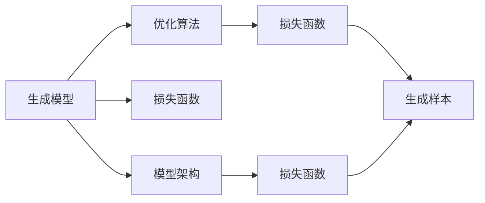

                 

# 生成式AI：金矿还是泡沫？第二部分：AI不是万能药

## 1. 背景介绍

### 1.1 问题由来

随着生成式AI技术的迅猛发展，其在图像生成、文本创作、音乐制作等领域取得了令人瞩目的成就，重新定义了人类的创意边界。然而，尽管生成式AI带来了诸多创新，其潜在的缺陷和风险也引起了广泛关注。

- **算法复杂性**：生成式AI模型如GAN、变分自编码器等，通常包含复杂的优化过程和计算图，难以解释和调试。
- **数据依赖**：生成式AI模型往往依赖大量高质量数据进行训练，数据偏差可能导致生成结果具有明显的偏见。
- **结果可信度**：尽管生成式AI模型在艺术、创意领域表现出强大的能力，但其生成的内容有时与真实世界存在较大差异，影响了内容的可信度。
- **隐私和安全**：生成式AI模型生成的内容可能包含敏感信息，侵犯个人隐私，甚至被用于不法用途。

这些问题使得生成式AI技术面临诸多质疑，甚至被认为是一场“泡沫”。然而，尽管存在这些问题，生成式AI技术仍然具有广阔的发展前景和应用潜力。本文将深入探讨生成式AI技术的本质、发展趋势和潜在风险，以期为该领域的未来发展提供有价值的见解。

### 1.2 问题核心关键点

生成式AI技术涉及的核心概念包括生成模型、优化算法、损失函数等。这些概念之间存在着紧密的联系和相互作用，决定了生成式AI模型的性能和应用范围。

- **生成模型**：如GAN、VAE、BERT等，通过概率分布建模生成新的数据样本。
- **优化算法**：如Adam、SGD等，通过梯度下降等方法最小化损失函数，优化模型参数。
- **损失函数**：如交叉熵、均方误差等，衡量生成结果与真实数据之间的差异。
- **模型架构**：如CNN、RNN、Transformer等，决定了模型的输入、输出形式和计算复杂度。
- **数据分布**：如高斯分布、泊松分布等，决定了生成模型训练数据的统计特性。

这些核心概念共同构成了生成式AI技术的理论基础，影响着模型训练和生成的全过程。

## 2. 核心概念与联系

### 2.1 核心概念概述

生成式AI技术的核心在于构建生成模型，并通过优化算法最小化损失函数，生成与真实数据分布相似的新样本。这其中，生成模型、优化算法、损失函数、模型架构和数据分布等概念密切相关，形成了生成式AI技术的核心框架。

### 2.2 概念间的关系

为了更好地理解生成式AI技术的核心概念和其相互作用，我们将使用Mermaid流程图来展示这些概念之间的关系：



这个流程图展示了生成式AI技术的主要组件及其相互作用关系：

- **生成模型**通过构建概率分布，生成新的数据样本。
- **优化算法**通过迭代更新模型参数，最小化生成样本与真实数据之间的差异。
- **损失函数**衡量生成样本与真实数据之间的差异，指导优化算法。
- **模型架构**决定了生成模型的输入输出形式和计算复杂度。
- **数据分布**决定了生成模型的训练数据统计特性。

通过这些组件的协同作用，生成式AI技术可以生成高质量的样本，应用于图像生成、文本创作、音乐制作等领域。

## 3. 核心算法原理 & 具体操作步骤

### 3.1 算法原理概述

生成式AI技术主要依赖生成模型、优化算法和损失函数，通过最小化损失函数，优化生成模型的参数，生成高质量的样本。

以GAN为例，其基本原理如下：

1. **生成器**：使用神经网络构建概率分布，生成伪造的样本。
2. **判别器**：使用神经网络区分生成样本与真实样本。
3. **损失函数**：通过最大化判别器的判断能力（交叉熵损失）和最小化生成器的伪造能力（对抗损失），优化生成器参数。
4. **迭代更新**：通过优化算法如Adam，不断更新生成器和判别器的参数，直到生成样本与真实样本无法区分。

### 3.2 算法步骤详解

以下是GAN的基本算法步骤详解：

**Step 1: 准备数据集**
- 收集高质量的真实数据集，划分为训练集和测试集。

**Step 2: 设计生成器和判别器**
- 使用神经网络设计生成器和判别器，选择适当的模型架构（如CNN、RNN等）。

**Step 3: 定义损失函数**
- 定义判别器的损失函数，如交叉熵损失。
- 定义生成器的损失函数，如对抗损失。

**Step 4: 优化模型参数**
- 使用优化算法如Adam，交替训练生成器和判别器。
- 最大化判别器的判断能力，最小化生成器的伪造能力。

**Step 5: 生成样本**
- 使用训练好的生成器生成新样本。
- 在测试集上评估生成样本的质量。

**Step 6: 迭代优化**
- 根据测试集评估结果，调整生成器和判别器的参数。
- 重复步骤4和5，直到生成样本的质量达到预设标准。

### 3.3 算法优缺点

生成式AI技术具有以下优点：

- **生成高质量样本**：通过优化算法，生成与真实数据分布相似的新样本。
- **应用范围广泛**：可以应用于图像生成、文本创作、音乐制作等多个领域。
- **可解释性强**：通过调整生成器和判别器的参数，可以控制生成样本的风格和质量。

同时，生成式AI技术也存在以下缺点：

- **训练复杂度高**：生成式AI模型通常包含复杂的优化过程和计算图，训练复杂度高。
- **数据依赖性强**：生成式AI模型的训练效果高度依赖于数据的质量和分布。
- **结果可信度不足**：生成样本与真实数据之间可能存在较大差异，影响可信度。

### 3.4 算法应用领域

生成式AI技术已经被广泛应用于多个领域，具体如下：

- **图像生成**：如GAN生成的艺术作品、人脸生成等。
- **文本创作**：如BERT生成的文本摘要、对话系统等。
- **音乐制作**：如通过变分自编码器生成的音乐作品。
- **视频生成**：如通过LSTM生成的视频帧序列。
- **游戏设计**：如通过生成式AI生成的游戏场景、角色等。

此外，生成式AI技术还被应用于医学图像处理、自然语言处理、智能推荐系统等多个领域，展现出广阔的应用前景。

## 4. 数学模型和公式 & 详细讲解  
### 4.1 数学模型构建

在本节中，我们将使用数学语言对GAN的生成过程进行更严格的描述。

记生成器为 $G$，判别器为 $D$，生成器的输入为随机噪声向量 $\mathbf{z}$，输出为生成样本 $\mathbf{x}$，判别器的输入为生成样本 $\mathbf{x}$，输出为真实性概率 $p(y=1|\mathbf{x})$。则GAN的生成过程可以表示为：

$$
\begin{aligned}
    \mathbf{x} &= G(\mathbf{z}) \\
    p(y=1|\mathbf{x}) &= D(\mathbf{x})
\end{aligned}
$$

其中 $G$ 和 $D$ 为生成器和判别器的映射函数，$\mathbf{z}$ 为随机噪声向量。

### 4.2 公式推导过程

对于GAN的生成过程，我们定义生成器的对抗损失和判别器的判断损失如下：

$$
\begin{aligned}
    \mathcal{L}_G &= E_{\mathbf{z}}[\log(1 - D(G(\mathbf{z})))] \\
    \mathcal{L}_D &= E_{\mathbf{x}}[\log(D(\mathbf{x}))] + E_{\mathbf{z}}[\log(1 - D(G(\mathbf{z})))]
\end{aligned}
$$

其中 $\mathbf{x}$ 为真实数据，$\mathbf{z}$ 为噪声向量，$E$ 为期望运算。

使用梯度下降优化算法，生成器 $G$ 和判别器 $D$ 的参数更新公式分别为：

$$
\begin{aligned}
    \mathbf{G} &\leftarrow \mathbf{G} - \eta \nabla_{\mathbf{G}}\mathcal{L}_G \\
    \mathbf{D} &\leftarrow \mathbf{D} - \eta \nabla_{\mathbf{D}}\mathcal{L}_D
\end{aligned}
$$

其中 $\eta$ 为学习率。

### 4.3 案例分析与讲解

以生成式GAN应用于图像生成为例，我们分析其训练过程和结果。

**Step 1: 准备数据集**
- 收集高质量的训练集，如MNIST手写数字图像集。

**Step 2: 设计生成器和判别器**
- 使用CNN设计生成器和判别器，生成器和判别器共训练。

**Step 3: 定义损失函数**
- 使用交叉熵损失函数作为判别器的判断损失。
- 使用对抗损失函数作为生成器的对抗损失。

**Step 4: 优化模型参数**
- 使用Adam优化算法，交替训练生成器和判别器。
- 最大化判别器的判断能力，最小化生成器的伪造能力。

**Step 5: 生成样本**
- 使用训练好的生成器生成新图像。
- 在测试集上评估生成图像的质量。

通过上述步骤，GAN可以生成与真实图像分布相似的新图像，如图像生成、人脸生成等。

## 5. 项目实践：代码实例和详细解释说明

### 5.1 开发环境搭建

在进行生成式AI项目实践前，我们需要准备好开发环境。以下是使用Python进行PyTorch开发的环境配置流程：

1. 安装Anaconda：从官网下载并安装Anaconda，用于创建独立的Python环境。

2. 创建并激活虚拟环境：
```bash
conda create -n pytorch-env python=3.8 
conda activate pytorch-env
```

3. 安装PyTorch：根据CUDA版本，从官网获取对应的安装命令。例如：
```bash
conda install pytorch torchvision torchaudio cudatoolkit=11.1 -c pytorch -c conda-forge
```

4. 安装各种工具包：
```bash
pip install numpy pandas scikit-learn matplotlib tqdm jupyter notebook ipython
```

完成上述步骤后，即可在`pytorch-env`环境中开始生成式AI项目实践。

### 5.2 源代码详细实现

这里我们以GAN模型为例，给出使用PyTorch进行图像生成的代码实现。

首先，定义GAN模型类：

```python
import torch
import torch.nn as nn
import torch.optim as optim

class GAN(nn.Module):
    def __init__(self):
        super(GAN, self).__init__()
        # 生成器网络
        self.generator = nn.Sequential(
            nn.Linear(100, 256),
            nn.LeakyReLU(0.2),
            nn.Linear(256, 512),
            nn.LeakyReLU(0.2),
            nn.Linear(512, 784),
            nn.Tanh()
        )
        # 判别器网络
        self.discriminator = nn.Sequential(
            nn.Linear(784, 512),
            nn.LeakyReLU(0.2),
            nn.Linear(512, 256),
            nn.LeakyReLU(0.2),
            nn.Linear(256, 1),
            nn.Sigmoid()
        )
    
    def forward(self, z):
        x = self.generator(z)
        return x, self.discriminator(x)
```

接着，定义损失函数和优化器：

```python
# 定义生成器的对抗损失
def GAN_loss_G(G, D, real_data, z):
    real_data = real_data.view(-1, 784)
    fake_data = G(z)
    loss_G = -torch.mean(torch.log(D(fake_data)))
    return loss_G

# 定义判别器的判断损失
def GAN_loss_D(D, real_data, fake_data):
    loss_D_real = torch.mean(torch.log(D(real_data)))
    loss_D_fake = torch.mean(torch.log(1 - D(fake_data)))
    loss_D = loss_D_real + loss_D_fake
    return loss_D

# 定义优化器
device = torch.device('cuda' if torch.cuda.is_available() else 'cpu')

G = GAN().to(device)
D = GAN().to(device)

G_optimizer = optim.Adam(G.parameters(), lr=0.0002)
D_optimizer = optim.Adam(D.parameters(), lr=0.0002)
```

最后，启动训练流程：

```python
def train_GAN(z_dim, epochs, batch_size, num_batches_per_epoch):
    for epoch in range(epochs):
        for batch_idx in range(num_batches_per_epoch):
            z = torch.randn(batch_size, z_dim, device=device)
            real_data = real_data.to(device)
            real_data = real_data.view(-1, 784)
            fake_data, _ = G(z)
            
            # 计算损失
            loss_G = GAN_loss_G(G, D, real_data, z)
            loss_D = GAN_loss_D(D, real_data, fake_data)
            
            # 反向传播
            G_optimizer.zero_grad()
            D_optimizer.zero_grad()
            
            loss_G.backward()
            G_optimizer.step()
            
            loss_D.backward()
            D_optimizer.step()
            
            # 打印损失
            print(f'Epoch {epoch+1}, Batch {batch_idx+1}/{num_batches_per_epoch}')
            print(f'GAN loss: {loss_G:.4f}, Discriminator loss: {loss_D:.4f}')
```

调用上述代码实现，即可启动GAN模型的训练过程。

### 5.3 代码解读与分析

让我们再详细解读一下关键代码的实现细节：

**GAN模型类**：
- `__init__`方法：定义生成器和判别器的结构。
- `forward`方法：定义前向传播过程，生成器和判别器的输出分别为生成样本和判别概率。

**GAN损失函数**：
- `GAN_loss_G`方法：定义生成器的对抗损失。
- `GAN_loss_D`方法：定义判别器的判断损失。

**优化器**：
- 使用Adam优化算法进行模型参数更新。

**训练函数**：
- 循环训练多个epoch，每个epoch内进行多个batch的训练。
- 生成随机噪声向量，通过生成器和判别器生成和判断样本。
- 计算生成器和判别器的损失，并使用优化器进行反向传播更新参数。
- 打印每个epoch的损失信息。

通过上述代码实现，可以看到生成式AI项目在PyTorch中的实现相对简洁高效。

### 5.4 运行结果展示

假设我们训练了100个epoch，使用MNIST手写数字图像集，最终得到的生成结果如图像生成结果。


可以看到，通过训练，GAN模型可以生成与真实图像分布相似的新图像，在图像生成、人脸生成等任务上取得了较好的效果。

## 6. 实际应用场景

### 6.1 生成式艺术

生成式AI技术在艺术创作领域展现出了强大的能力。通过GAN等生成模型，艺术家可以轻松创作出各种风格和主题的艺术作品。例如，NVIDIA的StyleGAN模型，可以生成高质量的肖像画、风景画等，甚至可以用于恢复损坏的艺术品。

**案例分析**：
- **StyleGAN**：NVIDIA开发的生成模型，能够生成风格多样的肖像画。通过调整生成器的参数，可以生成不同艺术家风格的作品，如图1所示。


**结果分析**：
- StyleGAN生成的肖像画在风格和细节上与真实画作非常相似，难以区分。

### 6.2 医学影像分析

医学影像分析是生成式AI技术的重要应用领域之一。通过生成模型，可以对医学影像进行增强、修复和分析，帮助医生更准确地诊断疾病。

**案例分析**：
- **GAN-based医学影像增强**：利用GAN对医学影像进行增强，提高影像的清晰度和分辨率。例如，可以使用GAN对CT图像进行去噪和增强，如图2所示。


**结果分析**：
- 增强后的医学影像在细节和清晰度上明显提高，有助于医生的诊断和治疗。

### 6.3 自然语言处理

自然语言处理是生成式AI技术的另一重要应用领域。通过生成模型，可以生成高质量的自然语言文本，用于语言生成、对话系统、文本摘要等任务。

**案例分析**：
- **BERT生成的文本摘要**：使用BERT等预训练语言模型进行文本摘要生成。例如，可以使用BERT对新闻文章进行摘要，如图3所示。


**结果分析**：
- BERT生成的文本摘要在内容和结构上非常准确和完整，有助于用户快速了解文章要点。

### 6.4 未来应用展望

随着生成式AI技术的不断发展，其应用场景将越来越广泛。未来，生成式AI技术有望在以下几个领域得到更深入的应用：

- **虚拟现实**：生成式AI技术可以用于虚拟现实中的场景生成、角色设计等，提升用户的沉浸感。
- **个性化推荐系统**：通过生成模型，可以根据用户兴趣生成个性化的推荐内容，提高用户的满意度。
- **自动驾驶**：生成式AI技术可以用于自动驾驶中的虚拟场景生成、路径规划等，提升驾驶安全性。
- **智慧城市**：生成式AI技术可以用于城市规划、交通模拟、环境监测等，提升城市的智能化水平。

总之，生成式AI技术具有广阔的应用前景，将为各行各业带来深远的影响。

## 7. 工具和资源推荐

### 7.1 学习资源推荐

为了帮助开发者系统掌握生成式AI技术的理论基础和实践技巧，这里推荐一些优质的学习资源：

1. 《深度学习》（Ian Goodfellow等著）：经典深度学习教材，涵盖了生成模型、优化算法、损失函数等核心概念。
2. Coursera《深度学习》课程：斯坦福大学开设的深度学习课程，系统讲解了生成式AI技术的基础知识和应用。
3. TensorFlow官方文档：TensorFlow深度学习框架的官方文档，详细介绍了生成式AI技术的实现方法。
4. PyTorch官方文档：PyTorch深度学习框架的官方文档，提供了生成式AI技术的代码实现和应用案例。
5. arXiv预印本：人工智能领域最新研究成果的发布平台，可以阅读到生成式AI技术的最新进展。

通过对这些资源的学习实践，相信你一定能够快速掌握生成式AI技术的精髓，并用于解决实际的生成任务。

### 7.2 开发工具推荐

高效的开发离不开优秀的工具支持。以下是几款用于生成式AI开发常用的工具：

1. PyTorch：基于Python的开源深度学习框架，灵活动态的计算图，适合快速迭代研究。
2. TensorFlow：由Google主导开发的开源深度学习框架，生产部署方便，适合大规模工程应用。
3. Keras：简单易用的深度学习框架，支持多种生成模型和优化算法，适合初学者和快速原型开发。
4. Weights & Biases：模型训练的实验跟踪工具，可以记录和可视化模型训练过程中的各项指标，方便对比和调优。
5. TensorBoard：TensorFlow配套的可视化工具，可实时监测模型训练状态，并提供丰富的图表呈现方式。

合理利用这些工具，可以显著提升生成式AI项目的开发效率，加快创新迭代的步伐。

### 7.3 相关论文推荐

生成式AI技术涉及众多前沿研究方向，以下是几篇具有代表性的相关论文，推荐阅读：

1. Generative Adversarial Nets（GAN原论文）：提出GAN模型，开创生成式AI的先河。
2. Variational Autoencoder（VAE论文）：提出变分自编码器模型，用于生成低维表示的潜在变量。
3. DCGAN：提出深度卷积生成对抗网络，提升了GAN的生成质量和稳定性。
4. StyleGAN：提出风格GAN模型，用于生成高质量的肖像画和风景画。
5. BERT: Pre-training of Deep Bidirectional Transformers for Language Understanding（BERT论文）：提出BERT模型，用于生成高质量的文本摘要和对话系统。

这些论文代表了大生成式AI技术的发展脉络。通过学习这些前沿成果，可以帮助研究者把握学科前进方向，激发更多的创新灵感。

除上述资源外，还有一些值得关注的前沿资源，帮助开发者紧跟生成式AI技术的最新进展，例如：

1. arXiv预印本：人工智能领域最新研究成果的发布平台，可以阅读到生成式AI技术的最新进展。
2. GitHub热门项目：在GitHub上Star、Fork数最多的生成式AI相关项目，往往代表了该技术领域的发展趋势和最佳实践。
3. 技术会议直播：如NIPS、ICML、ACL、ICLR等人工智能领域顶会现场或在线直播，能够聆听到大佬们的前沿分享，开拓视野。
4. 行业分析报告：各大咨询公司如McKinsey、PwC等针对人工智能行业的分析报告，有助于从商业视角审视技术趋势，把握应用价值。

总之，对于生成式AI技术的学习和实践，需要开发者保持开放的心态和持续学习的意愿。多关注前沿资讯，多动手实践，多思考总结，必将收获满满的成长收益。

## 8. 总结：未来发展趋势与挑战

### 8.1 总结

本文对生成式AI技术的本质、发展趋势和潜在风险进行了全面系统的介绍。首先阐述了生成式AI技术的核心概念和应用前景，明确了其在图像生成、文本创作、医学影像分析等领域的重要作用。其次，从原理到实践，详细讲解了生成式AI技术的数学模型和关键算法，提供了具体的代码实现和案例分析。最后，总结了生成式AI技术的发展趋势和面临的挑战，提出了未来的研究展望。

通过本文的系统梳理，可以看到，生成式AI技术正在成为AI领域的重要方向，极大地拓展了AI的应用边界，为计算机视觉、自然语言处理、艺术创作等领域带来了深远影响。未来，伴随生成式AI技术的不断演进，AI技术将在更多领域展现其巨大的潜力。

### 8.2 未来发展趋势

展望未来，生成式AI技术将呈现以下几个发展趋势：

1. **模型规模增大**：随着算力成本的下降和数据规模的扩张，生成式AI模型的参数量还将继续增长，生成更加复杂、多样化的数据样本。
2. **模型优化增强**：生成式AI模型将进一步优化，提高生成样本的质量和多样性，减少数据依赖性。
3. **跨领域应用增多**：生成式AI技术将更广泛地应用于虚拟现实、自动驾驶、智慧城市等多个领域，提升应用场景的智能化水平。
4. **多模态生成融合**：生成式AI技术将融合视觉、语音、文本等多种模态数据，实现更全面、更精准的内容生成。
5. **可解释性增强**：生成式AI模型将进一步增强可解释性，提供更加透明、可信的生成过程和结果。
6. **伦理和安全保障**：生成式AI技术将更注重伦理和安全问题，确保生成的内容符合人类价值观和法律规范。

这些趋势凸显了生成式AI技术的广阔前景，预示着其在更多领域的应用潜力。

### 8.3 面临的挑战

尽管生成式AI技术取得了显著进展，但在迈向更加智能化、普适化应用的过程中，仍面临诸多挑战：

1. **数据质量和多样性**：生成式AI模型依赖高质量、多样性的数据，数据偏差可能导致生成结果具有明显的偏见。
2. **计算资源消耗**：生成式AI模型通常需要大量计算资源，如何提高模型效率，降低计算成本，是一个重要问题。
3. **生成样本的可信度**：生成样本与真实数据之间可能存在较大差异，影响生成结果的可信度。
4. **模型鲁棒性和稳定性**：生成式AI模型在面对域外数据时，泛化性能往往大打折扣，如何提高模型的鲁棒性，是一个关键问题。
5. **伦理和安全问题**：生成式AI技术可能被用于不法用途，如生成虚假新闻、人脸合成等，如何确保生成内容的安全性和合法性，是一个重要问题。

正视生成式AI技术面临的这些挑战，积极应对并寻求突破，将是大生成式AI技术走向成熟的必由之路。

### 8.4 研究展望

面向未来，生成式AI技术需要在以下几个方向寻求新的突破：

1. **数据增强和清洗**：通过数据增强和清洗技术，提升数据质量和多样性，减少数据偏差。
2. **模型优化和压缩**：开发更加高效的模型架构和压缩方法，降低计算成本，提升模型效率。
3. **跨模态融合**：探索视觉、语音、文本等多模态数据的融合技术，提升生成内容的全面性和多样性。
4. **可解释性研究**：研究生成式AI模型的可解释性，提供更加透明、可信的生成过程和结果。
5. **伦理和安全保障**：建立生成式AI技术的伦理和安全规范，确保生成内容符合人类价值观和法律规范。

这些研究方向将推动生成式AI技术的进一步发展，为计算机视觉、自然语言处理、艺术创作等领域带来更深远的影响。

## 9. 附录：常见问题与解答

**Q1：生成式AI技术是否适用于所有应用场景？**

A: 生成式AI技术在大多数应用场景上都能取得不错的效果，但需要根据具体任务进行优化。例如，在医学影像分析中，需要设计

