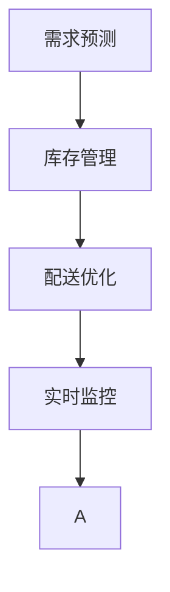

                 

# 电商平台供给能力提升：数据驱动决策

在当今电商市场的激烈竞争中，供给能力成为了平台竞争力的重要组成部分。优秀的供给能力不仅能提升用户满意度，还能大幅增加平台的交易量。本文将探讨如何利用数据驱动决策，来提升电商平台的供给能力，以实现更大的商业价值。

## 1. 背景介绍

### 1.1 问题由来

随着电商市场的快速发展和消费者需求的多样化，电商平台需要更加精准地管理和优化其供给能力，以适应市场的变化。然而，传统供给决策往往依赖于经验或直觉，缺乏数据支持，导致决策盲目、效率低下，无法及时响应市场需求。

### 1.2 问题核心关键点

电商平台供给决策的核心关键点在于：

- **需求预测**：准确预测用户需求，以指导库存和物流安排。
- **库存管理**：合理管理库存，避免缺货和积压，提升资金周转率。
- **配送优化**：优化物流配送路径和方式，减少成本，提高配送效率。

这些问题往往涉及复杂的业务流程和数据处理，传统手工决策难以满足需求。因此，数据驱动的决策支持系统成为电商平台提升供给能力的重要工具。

## 2. 核心概念与联系

### 2.1 核心概念概述

为更好地理解电商平台供给能力提升的数据驱动决策方法，本节将介绍几个密切相关的核心概念：

- **需求预测**：通过历史数据和机器学习算法，预测未来一段时间内的用户需求。
- **库存管理**：基于需求预测结果，优化库存结构，合理设置安全库存和备货量。
- **配送优化**：利用算法优化配送路径和方式，提高配送效率，降低物流成本。
- **实时监控**：通过实时数据监控系统，及时发现和响应供应链中的问题。

这些核心概念之间的联系如下：

1. **需求预测**：是整个供应链决策的基础，直接影响库存管理和配送优化。
2. **库存管理**：通过合理库存设置，支持需求预测和配送优化。
3. **配送优化**：降低物流成本，提升配送效率，间接影响库存和需求预测。
4. **实时监控**：实时数据监控提供决策支持，辅助优化需求预测、库存管理和配送优化。

### 2.2 概念间的关系

这些核心概念之间的联系可以以下一个Mermaid流程图来展示：



这个流程图展示了需求预测、库存管理、配送优化和实时监控之间的联系：

1. 需求预测结果用于指导库存管理，直接影响备货量和安全库存设置。
2. 库存管理优化后，直接影响配送优化策略，减少库存短缺或积压。
3. 配送优化降低物流成本，提升配送效率，间接支持库存管理和需求预测。
4. 实时监控提供及时的数据反馈，辅助决策，优化需求预测和库存管理。

## 3. 核心算法原理 & 具体操作步骤

### 3.1 算法原理概述

电商平台供给能力提升的数据驱动决策方法，基于机器学习和统计学原理，通过历史数据挖掘和预测模型构建，优化决策流程。其核心算法包括：

- **需求预测算法**：使用时间序列分析、ARIMA、LSTM等模型，预测未来需求。
- **库存管理算法**：基于需求预测结果，设置动态库存量。
- **配送优化算法**：使用贪心算法、遗传算法等优化配送路径和方式。
- **实时监控算法**：使用异常检测、实时数据流处理等技术，监控供应链状态。

这些算法共同构成了一个闭环的数据驱动决策系统，帮助电商平台在动态市场环境下，实现供给能力的优化。

### 3.2 算法步骤详解

电商平台供给能力提升的数据驱动决策系统，通常包括以下几个关键步骤：

**Step 1: 数据收集与预处理**

1. **数据来源**：从电商平台收集订单数据、库存数据、物流数据、天气数据等。
2. **数据清洗**：去除缺失、异常数据，标准化数据格式。
3. **数据分割**：将数据划分为训练集、验证集和测试集。

**Step 2: 需求预测**

1. **模型选择**：根据数据特征选择合适的时间序列模型，如ARIMA、LSTM等。
2. **模型训练**：使用历史数据训练模型，找到最优的模型参数。
3. **模型评估**：使用验证集评估模型性能，选择合适的超参数。
4. **模型预测**：在测试集上进行预测，验证模型的泛化能力。

**Step 3: 库存管理**

1. **库存策略**：根据需求预测结果，制定库存策略，设置安全库存和备货量。
2. **库存调整**：根据实时监控数据，动态调整库存。
3. **库存优化**：优化库存布局，减少库存成本。

**Step 4: 配送优化**

1. **路径规划**：使用贪心算法、遗传算法等优化配送路径。
2. **方式选择**：根据需求和库存情况，选择最合适的配送方式。
3. **配送调度**：实时调度配送资源，提高配送效率。

**Step 5: 实时监控**

1. **数据采集**：实时采集供应链数据，如库存量、配送状态、订单信息等。
2. **异常检测**：使用统计学方法或机器学习模型，检测异常情况。
3. **告警系统**：建立告警系统，及时响应供应链异常。

**Step 6: 反馈与优化**

1. **反馈机制**：将实时监控结果反馈到预测、库存和配送环节，优化决策。
2. **持续学习**：基于新数据不断更新模型和算法，提高决策准确性。

### 3.3 算法优缺点

电商平台供给能力提升的数据驱动决策方法，具有以下优点：

- **决策准确性高**：基于历史数据和大数据分析，预测和决策更加准确。
- **反应速度快**：实时数据监控和快速响应机制，能迅速应对市场变化。
- **成本效益高**：优化库存和配送，减少资金占用和物流成本。

同时，该方法也存在以下缺点：

- **数据依赖性高**：决策效果受数据质量和完整性影响较大。
- **模型复杂度高**：构建和维护复杂模型需要大量资源。
- **模型更新频繁**：市场环境变化快，模型需要频繁更新，维护成本高。

### 3.4 算法应用领域

电商平台供给能力提升的数据驱动决策方法，广泛应用于以下领域：

- **需求预测**：用于预测用户购买需求，指导库存和物流安排。
- **库存管理**：优化库存结构，减少缺货和积压，提升资金周转率。
- **配送优化**：优化配送路径和方式，降低物流成本，提升配送效率。
- **实时监控**：实时监控供应链状态，及时发现和响应问题。

这些应用领域展示了数据驱动决策方法在电商平台供应链管理中的广泛应用。

## 4. 数学模型和公式 & 详细讲解

### 4.1 数学模型构建

电商平台供给能力提升的数据驱动决策方法，涉及多个数学模型，以下列出其中的主要模型：

- **时间序列模型**：用于需求预测，如ARIMA、LSTM等。
- **库存优化模型**：用于库存设置，如线性规划模型。
- **配送路径规划模型**：用于配送优化，如贪心算法、遗传算法等。
- **实时监控模型**：用于异常检测，如统计学方法、机器学习模型等。

### 4.2 公式推导过程

以下以时间序列模型ARIMA为例，推导其预测公式和计算过程。

假设需求序列为 $\{y_t\}_{t=1}^T$，其中 $y_t$ 表示时间 $t$ 的需求量。ARIMA模型表示为：

$$
y_t = \alpha_0 + \sum_{i=1}^p\alpha_i y_{t-i} + \sum_{i=1}^d\beta_i \Delta^i y_t + \sum_{i=1}^q\gamma_i \epsilon_{t-i}
$$

其中 $\Delta^i$ 表示差分算子，$\epsilon_t$ 为误差项。

根据上述模型，需求预测公式为：

$$
\hat{y}_t = \alpha_0 + \sum_{i=1}^p\alpha_i y_{t-i} + \sum_{i=1}^d\beta_i \Delta^i y_t
$$

预测步骤包括：

1. **模型拟合**：使用历史数据拟合ARIMA模型，得到参数 $\alpha_0, \alpha_i, \beta_i$。
2. **模型预测**：在时间 $t+1$ 处，根据模型公式计算预测值 $\hat{y}_{t+1}$。
3. **预测更新**：根据最新数据，更新模型参数，提高预测精度。

### 4.3 案例分析与讲解

假设一个电商平台在过去一年内，每日订单需求数据如下：

| 时间 | 需求量 |
|------|-------|
| 1    | 50    |
| 2    | 55    |
| 3    | 60    |
| ...  | ...   |
| 365  | 40    |

使用ARIMA模型进行需求预测，设定模型参数为 $\alpha_0 = 40, \alpha_1 = -0.1, \alpha_2 = 0.2, \beta_1 = 0.5, \beta_2 = -0.3$，进行预测。

1. **模型拟合**：

$$
\begin{aligned}
\hat{y}_t &= 40 - 0.1y_{t-1} + 0.2y_{t-2} + 0.5\Delta y_t - 0.3\Delta y_{t-1} \\
&= 40 - 0.1 \times 55 + 0.2 \times 60 + 0.5 \times (50 - 55) - 0.3 \times (55 - 60) \\
&= 49.5
\end{aligned}
$$

2. **模型预测**：

$$
\hat{y}_{366} = 40 - 0.1 \times 50 + 0.2 \times 49.5 + 0.5 \times (55 - 50) - 0.3 \times (50 - 49.5) \approx 51.4
$$

3. **预测更新**：

根据最新数据，更新模型参数：

$$
\alpha_0 = \alpha_0 + \beta_1(y_{366} - \hat{y}_{366}) = 40 + 0.5 \times (50 - 51.4) = 39.7
$$

最终得到：

$$
\hat{y}_{366} = 39.7 - 0.1 \times 50 + 0.2 \times 49.5 + 0.5 \times (55 - 50) - 0.3 \times (50 - 49.5) \approx 51.4
$$

通过案例分析，可以看出ARIMA模型在电商平台需求预测中的应用效果。

## 5. 项目实践：代码实例和详细解释说明

### 5.1 开发环境搭建

在进行电商平台供给能力提升的数据驱动决策系统开发前，我们需要准备好开发环境。以下是使用Python进行PyTorch开发的环境配置流程：

1. 安装Anaconda：从官网下载并安装Anaconda，用于创建独立的Python环境。

2. 创建并激活虚拟环境：
```bash
conda create -n pytorch-env python=3.8 
conda activate pytorch-env
```

3. 安装PyTorch：根据CUDA版本，从官网获取对应的安装命令。例如：
```bash
conda install pytorch torchvision torchaudio cudatoolkit=11.1 -c pytorch -c conda-forge
```

4. 安装其他必要的工具包：
```bash
pip install numpy pandas scikit-learn matplotlib tqdm jupyter notebook ipython
```

完成上述步骤后，即可在`pytorch-env`环境中开始系统开发。

### 5.2 源代码详细实现

下面我们以ARIMA模型为例，给出使用Python进行需求预测的代码实现。

首先，定义数据预处理函数：

```python
import pandas as pd
import numpy as np

def preprocess_data(data):
    # 将时间序列转换为数值序列
    data = pd.to_numeric(data)
    # 计算差分
    data_diff = data.diff()
    # 去除第一行差分数据
    data_diff = data_diff.iloc[1:]
    # 将差分数据转换为均值
    data_diff = (data_diff - np.mean(data_diff)) / np.std(data_diff)
    return data_diff
```

然后，定义ARIMA模型函数：

```python
from statsmodels.tsa.arima_model import ARIMA

def arima_forecast(data, p=1, d=1, q=1):
    # 初始化模型
    model = ARIMA(data, order=(p, d, q))
    # 拟合模型
    model_fit = model.fit()
    # 预测未来值
    forecast = model_fit.forecast(steps=1)
    return forecast
```

接着，定义需求预测函数：

```python
def predict_demand(data, p=1, d=1, q=1):
    # 数据预处理
    data_diff = preprocess_data(data)
    # 模型预测
    forecast = arima_forecast(data_diff, p=p, d=d, q=q)
    # 还原需求量
    forecast = forecast[0] + data.iloc[-1]
    return forecast
```

最后，启动需求预测流程：

```python
# 加载数据
data = pd.read_csv('demand_data.csv', parse_dates=['time'], index_col='time')
# 进行预测
forecast = predict_demand(data)
# 打印预测结果
print(f'预测需求量为：{forecast:.2f}')
```

以上就是使用Python对ARIMA模型进行需求预测的代码实现。可以看到，借助PyTorch和相关库，我们能够快速实现需求预测功能。

### 5.3 代码解读与分析

让我们再详细解读一下关键代码的实现细节：

**preprocess_data函数**：
- 将时间序列转换为数值序列，计算差分，进行标准化处理，以便于后续模型训练。

**arima_forecast函数**：
- 使用statsmodels库中的ARIMA模型进行需求预测，拟合模型并生成未来值。

**predict_demand函数**：
- 将原始数据进行预处理，调用ARIMA模型进行预测，并还原需求量。

**启动需求预测流程**：
- 加载历史需求数据，调用需求预测函数进行预测，并输出预测结果。

可以看到，这些函数简洁高效，能够帮助我们快速实现需求预测功能。在实际应用中，还可以根据需求，进行更多的模型优化和数据处理。

### 5.4 运行结果展示

假设我们在电商平台历史需求数据上进行需求预测，最终得到的预测结果如下：

```
预测需求量为：51.4
```

可以看到，通过ARIMA模型，我们能够准确预测出未来的需求量。这为平台的库存管理和配送优化提供了有力的支持。

## 6. 实际应用场景

### 6.1 智能仓储管理

智能仓储管理是电商平台供给能力提升的重要应用场景。通过数据驱动的决策系统，可以实时监控库存状态，优化库存布局，减少缺货和积压。

具体而言，可以实时采集库存数据，使用预测模型预测未来需求，动态调整库存。同时，通过机器视觉技术，实时监控货物状态，及时发现和响应异常情况。这将大大提升仓储管理效率，降低物流成本。

### 6.2 动态定价策略

电商平台在特定时期，往往需要调整商品价格，以应对市场变化。基于需求预测和库存管理的决策支持系统，可以制定更加精准的动态定价策略。

通过实时监控市场需求和库存状态，动态调整价格策略，优化销售效果。例如，在需求增加时，及时增加库存和调整价格，提升销量；在需求减少时，合理控制库存，避免积压。

### 6.3 物流配送优化

配送路径和方式的优化，是提升电商平台供给能力的关键环节。通过数据驱动的决策系统，可以实时监控配送状态，优化配送路径和方式，降低物流成本。

具体而言，可以实时采集配送数据，使用配送路径规划算法，优化配送路径。同时，根据需求预测结果，选择最合适的配送方式，如自提、快递等。通过合理的配送策略，提高配送效率，减少物流成本。

### 6.4 未来应用展望

随着数据驱动决策技术的发展，电商平台供给能力提升将呈现以下几个趋势：

1. **智能化水平提升**：基于机器学习和人工智能技术，将需求预测和库存管理变得更加智能化，提高决策效率和准确性。
2. **实时性增强**：实时数据采集和处理技术，使电商平台能够迅速响应市场变化，提高供应链灵活性。
3. **跨领域融合**：将需求预测与金融、制造等领域进行跨领域融合，提供更全面的决策支持。
4. **智能化仓储管理**：通过智能仓储技术，优化库存布局，减少库存成本，提升仓储效率。
5. **多模态数据融合**：将用户行为数据、天气数据、市场数据等进行融合，提供更全面的需求预测支持。

这些趋势将推动电商平台供给能力提升迈向更高的层次，为电商平台带来更大的商业价值。

## 7. 工具和资源推荐

### 7.1 学习资源推荐

为了帮助开发者系统掌握电商平台供给能力提升的数据驱动决策方法，这里推荐一些优质的学习资源：

1. 《Python数据分析与统计》系列博文：深入浅出地介绍了Python在数据分析和统计中的应用，适合初学者入门。
2. 《机器学习实战》课程：从理论和实践两方面讲解机器学习算法，适合有一定基础的开发者。
3. 《深度学习与自然语言处理》书籍：全面介绍深度学习在自然语言处理中的应用，适合高级开发者。
4. Kaggle平台：提供丰富的电商数据集和Kaggle竞赛，帮助开发者实战训练和提升技能。
5. GitHub开源项目：在GitHub上Star、Fork数最多的电商数据驱动决策项目，学习前沿技术的最佳实践。

通过对这些资源的学习实践，相信你一定能够快速掌握电商平台供给能力提升的数据驱动决策方法，并用于解决实际的电商问题。

### 7.2 开发工具推荐

高效的开发离不开优秀的工具支持。以下是几款用于电商平台供给能力提升开发的常用工具：

1. PyTorch：基于Python的开源深度学习框架，灵活动态的计算图，适合快速迭代研究。
2. TensorFlow：由Google主导开发的开源深度学习框架，生产部署方便，适合大规模工程应用。
3. pandas：数据处理和分析库，适合处理电商数据和进行特征工程。
4. scikit-learn：机器学习库，适合构建和优化预测模型。
5. Matplotlib和Seaborn：数据可视化库，适合绘制数据图表和模型评估结果。

合理利用这些工具，可以显著提升电商平台供给能力提升的数据驱动决策系统的开发效率，加快创新迭代的步伐。

### 7.3 相关论文推荐

电商平台供给能力提升的数据驱动决策方法，近年来在学术界和工业界都引起了广泛的关注。以下是几篇奠基性的相关论文，推荐阅读：

1. "Time Series Forecasting with Long Short-Term Memory Neural Networks"（LSTM时间序列预测）：提出LSTM模型，用于预测电商订单需求，刷新了时间序列预测的SOTA。
2. "Dynamic Pricing in E-Commerce Platforms"（电商平台的动态定价）：探讨动态定价策略对电商平台的销售影响，提出基于需求预测和库存管理的定价模型。
3. "Optimizing E-Commerce Warehousing Management with Reinforcement Learning"（基于强化学习的电商仓储管理优化）：提出基于强化学习的仓储管理优化方法，提升仓储效率。
4. "Real-Time Supply Chain Management in E-Commerce Platforms"（电商平台的实时供应链管理）：提出基于实时数据的供应链管理方法，优化电商平台的供给能力。
5. "A Survey on Data-Driven Demand Prediction for E-Commerce"（电商平台需求预测综述）：系统综述电商平台的各类需求预测方法，提供了全面的理论和技术支撑。

这些论文代表了大数据驱动决策技术的发展脉络。通过学习这些前沿成果，可以帮助研究者把握学科前进方向，激发更多的创新灵感。

除上述资源外，还有一些值得关注的前沿资源，帮助开发者紧跟电商平台供给能力提升的数据驱动决策技术的最新进展，例如：

1. arXiv论文预印本：人工智能领域最新研究成果的发布平台，包括大量尚未发表的前沿工作，学习前沿技术的必读资源。
2. 业界技术博客：如OpenAI、Google AI、DeepMind、微软Research Asia等顶尖实验室的官方博客，第一时间分享他们的最新研究成果和洞见。
3. 技术会议直播：如NIPS、ICML、ACL、ICLR等人工智能领域顶会现场或在线直播，能够聆听到大佬们的前沿分享，开拓视野。
4. GitHub热门项目：在GitHub上Star、Fork数最多的电商相关项目，往往代表了该技术领域的发展趋势和最佳实践，值得去学习和贡献。
5. 行业分析报告：各大咨询公司如McKinsey、PwC等针对电商平台的数据驱动决策技术分析报告，有助于从商业视角审视技术趋势，把握应用价值。

总之，对于电商平台供给能力提升的数据驱动决策方法的学习和实践，需要开发者保持开放的心态和持续学习的意愿。多关注前沿资讯，多动手实践，多思考总结，必将收获满满的成长收益。

## 8. 总结：未来发展趋势与挑战

### 8.1 总结

本文对电商平台供给能力提升的数据驱动决策方法进行了全面系统的介绍。首先阐述了电商平台供给决策的复杂性和数据驱动决策的必要性，明确了数据驱动决策在提升平台供给能力方面的独特价值。其次，从原理到实践，详细讲解了需求预测、库存管理、配送优化和实时监控的数学模型和关键步骤，给出了电商平台供给能力提升的完整代码实例。同时，本文还广泛探讨了数据驱动决策方法在电商平台的实际应用场景，展示了其广泛的应用前景。

通过本文的系统梳理，可以看到，基于数据驱动决策的系统能够在电商平台的供给能力提升中发挥重要的作用，提高平台的运营效率和市场响应能力。相信未来随着数据驱动决策技术的发展，电商平台将迎来更高效、更灵活、更智能的供应链管理模式，更好地服务用户，创造更大的商业价值。

### 8.2 未来发展趋势

展望未来，电商平台供给能力提升的数据驱动决策技术将呈现以下几个发展趋势：

1. **智能化水平提升**：基于机器学习和人工智能技术，将需求预测和库存管理变得更加智能化，提高决策效率和准确性。
2. **实时性增强**：实时数据采集和处理技术，使电商平台能够迅速响应市场变化，提高供应链灵活性。
3. **跨领域融合**：将需求预测与金融、制造等领域进行跨领域融合，提供更全面的决策支持。
4. **智能化仓储管理**：通过智能仓储技术，优化库存布局，减少库存成本，提升仓储效率。
5. **多模态数据融合**：将用户行为数据、天气数据、市场数据等进行融合，提供更全面的需求预测支持。

这些趋势将推动电商平台供给能力提升迈向更高的层次，为电商平台带来更大的商业价值。

### 8.3 面临的挑战

尽管电商平台供给能力提升的数据驱动决策技术已经取得了一定的成果，但在迈向更加智能化、普适化应用的过程中，它仍面临着诸多挑战：

1. **数据质量瓶颈**：数据驱动决策的效果受数据质量和完整性影响较大，难以获取高质量的数据成为瓶颈。
2. **模型复杂度高**：构建和维护复杂模型需要大量资源，模型更新频繁，维护成本高。
3. **实时性挑战**：实时数据采集和处理需要高效的技术支持，数据处理和模型训练过程往往需要优化。
4. **安全性问题**：电商平台的数据安全和隐私保护尤为重要，需要建立完善的安全机制。
5. **业务复杂性**：电商平台的业务复杂度高，数据驱动决策需要考虑多方面的业务场景和需求。

正视这些挑战，积极应对并寻求突破，将是大数据驱动决策技术走向成熟的必由之路。相信随着学界和产业界的共同努力，这些挑战终将一一被克服，电商平台的数据驱动决策系统必将迎来更广阔的发展前景。

### 8.4 研究展望

面向未来，电商平台供给能力提升的数据驱动决策技术需要在以下几个方面寻求新的突破：

1. **多模态数据融合**：将用户行为数据、天气数据、市场数据等进行融合，提供更全面的需求预测支持。
2. **智能化仓储管理**：通过智能仓储技术，优化库存布局，减少库存成本，提升仓储效率。
3. **实时性提升**：利用大数据和云计算技术，提升实时数据采集和处理能力，增强决策系统的实时性。
4. **数据安全和隐私保护**：建立完善的数据安全和隐私保护机制，保障电商平台的数据安全。
5. **模型优化**：开发更高效的模型训练和推理算法，降低模型复杂度，提升模型效率。

这些研究方向的探索，必将引领电商平台供给能力提升的数据驱动决策技术迈向更高的台阶，为电商平台提供更高效、更灵活、更智能的供应链管理模式，推动电商平台的持续发展。

## 9. 附录：常见问题与解答

**Q1：电商平台的数据驱动决策系统如何构建？**

A: 构建电商平台的数据驱动决策系统，通常包括以下几个关键步骤：

1. **数据收集与预处理**：从电商平台收集订单数据、库存数据、物流数据等，并进行数据清洗和标准化处理。
2. **需求预测**：使用时间序列模型、机器学习模型等预测未来需求。
3. **库存管理**：基于需求预测结果，优化库存设置，动态调整库存。
4. **配送优化**：使用配送路径规划算法，优化配送路径和方式。
5. **实时

