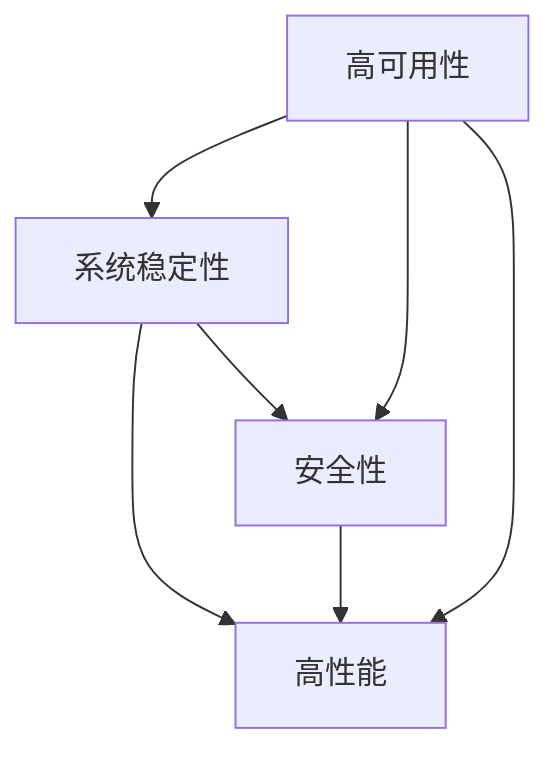

                 

# 电商系统的高可用、稳定性、安全性、高性能系统能力保障

## 1. 背景介绍

在数字经济的浪潮中，电商平台作为连接商家与消费者、提供商品与服务的桥梁，扮演着至关重要的角色。伴随用户规模的持续扩大、交易量的飞速增长，电商平台的系统复杂度与性能要求愈发严峻。为确保用户购物体验的流畅性与平台业务的稳健运行，电商系统的设计必须兼顾高可用、稳定性、安全性和高性能。本文将系统梳理电商系统在上述四个方面应具备的核心能力，并探讨相应的技术实现与保障措施，助力电商平台的可持续发展。

## 2. 核心概念与联系

### 2.1 核心概念概述

在深入探讨电商系统的技术保障前，首先需对几个关键概念进行阐释：

- **高可用性（High Availability）**：指系统在遭遇硬件、网络、软件等异常时，仍能持续稳定运行的能力。高可用性是保障电商平台持续运营的基础。
- **系统稳定性（System Stability）**：指系统在面对高峰流量、并发请求、数据一致性等挑战时，能保持正常服务的能力。稳定性是电商平台服务质量的核心。
- **安全性（Security）**：指系统在面对恶意攻击、数据泄露、系统注入等威胁时，能有效防范和抵御的能力。安全性是电商平台用户信任的保障。
- **高性能（High Performance）**：指系统在面对高并发、大数据、复杂逻辑等场景时，能快速响应的能力。高性能是电商平台用户体验的关键。

上述四个概念互相交织，共同构成了电商系统健康运行的技术保障体系。

### 2.2 核心概念的联系

高可用性、稳定性、安全性和高性能四个概念间存在紧密联系，共同支撑电商系统的稳定运行：

- 高可用性是电商系统的“身体”，确保系统在故障时有冗余机制快速切换，保障服务不中断。
- 稳定性是电商系统的“基石”，确保系统在常态和极端情况下均能稳定运行，提升用户体验。
- 安全性是电商系统的“免疫系统”，确保系统在遭受攻击时能够防范和修复，保护用户数据和平台利益。
- 高性能是电商系统的“神经中枢”，确保系统在面对高并发和复杂逻辑时能快速响应，提升服务质量。

以下通过一张Mermaid流程图展现上述概念之间的联系：



该图展示了电商系统的高可用性、稳定性、安全性和高性能之间的相互依赖关系。

## 3. 核心算法原理 & 具体操作步骤
### 3.1 算法原理概述

高可用、稳定性、安全性和高性能的保障，离不开对系统架构的深入设计以及对核心算法的精妙运用。以下对这四个关键能力的算法原理进行概述：

- **高可用性**：主要通过冗余部署、负载均衡、故障切换等技术，确保系统在故障时能够迅速切换至备用资源，保持服务连续性。
- **系统稳定性**：依赖于事务处理、缓存优化、消息队列等技术，通过异步处理、数据一致性控制、流量管控等手段，提升系统对高并发和高负载的应对能力。
- **安全性**：主要依赖于安全协议、加密技术、审计监控等手段，通过身份认证、权限控制、异常检测等措施，保障系统的安全可靠。
- **高性能**：通过负载均衡、缓存优化、异步处理、并行计算等技术，减少系统响应时间和计算资源消耗，提升系统性能。

### 3.2 算法步骤详解

**3.2.1 高可用性**

1. **冗余部署**：在多个数据中心部署系统实例，确保在某个中心发生故障时，其他中心能继续提供服务。
2. **负载均衡**：通过负载均衡设备或软件，将请求分发到多个实例，确保系统资源均衡利用。
3. **故障切换**：使用自动故障检测与切换机制，在发现故障时，迅速将请求转移到健康实例，保证服务不中断。

**3.2.2 系统稳定性**

1. **事务处理**：使用两阶段提交、分布式事务等技术，确保数据一致性。
2. **缓存优化**：使用本地缓存、分布式缓存、内存缓存等技术，提升数据读取效率，减轻数据库负担。
3. **消息队列**：通过消息队列异步处理请求，避免系统因同步阻塞导致的性能下降。

**3.2.3 安全性**

1. **身份认证与权限控制**：通过OAuth2、JWT等技术，确保请求的合法性，限制访问权限。
2. **数据加密**：使用SSL/TLS等协议加密数据传输，保护用户隐私。
3. **异常检测与修复**：通过日志监控、异常检测工具，及时发现并修复系统异常。

**3.2.4 高性能**

1. **负载均衡**：通过负载均衡策略，确保请求均匀分配到各个实例，减少响应时间。
2. **缓存优化**：使用缓存技术，将频繁访问的数据存入缓存，减少数据库压力。
3. **异步处理**：通过异步处理技术，提升系统并发处理能力，避免阻塞。
4. **并行计算**：使用分布式计算框架，如Spark、Flink等，提升数据处理速度。

### 3.3 算法优缺点

**高可用性**：

- **优点**：提高系统的故障容忍度，保证服务的连续性。
- **缺点**：冗余部署和故障切换增加了系统复杂性和成本。

**系统稳定性**：

- **优点**：提升系统对高并发和高负载的应对能力，改善用户体验。
- **缺点**：事务处理和缓存优化可能会增加系统复杂度，需要细致的维护和管理。

**安全性**：

- **优点**：保障系统的安全可靠，提升用户信任度。
- **缺点**：安全措施的实施可能会增加系统的复杂性和运营成本。

**高性能**：

- **优点**：提升系统响应速度，提升用户体验。
- **缺点**：并行计算和缓存优化可能会带来额外的开发和运维负担。

### 3.4 算法应用领域

高可用性、系统稳定性、安全性和高性能的保障措施，广泛应用于电商平台的各个核心模块，如订单系统、库存系统、支付系统等，为平台的稳定运行提供坚实保障。

## 4. 数学模型和公式 & 详细讲解 & 举例说明

### 4.1 数学模型构建

为了更准确地分析电商系统各个核心能力，我们引入几个常用的数学模型：

- **高可用性模型**：
  $$
  H(A) = 1 - \sum_{i=1}^n P_i(1 - P_{i,f})
  $$
  其中，$P_i$ 是第$i$个节点正常工作的概率，$P_{i,f}$ 是节点故障后的修复概率。

- **系统稳定性模型**：
  $$
  S = \frac{Q}{Q_{max}} + \frac{R}{R_{max}}
  $$
  其中，$Q$ 是系统当前请求量，$Q_{max}$ 是系统最大处理能力，$R$ 是系统当前响应时间，$R_{max}$ 是系统最大响应时间。

- **安全性模型**：
  $$
  S = P_A + P_M + P_C
  $$
  其中，$P_A$ 是认证系统的失败概率，$P_M$ 是消息系统的失败概率，$P_C$ 是控制系统的失败概率。

- **高性能模型**：
  $$
  H = \frac{N}{N_{max}} + \frac{T}{T_{max}}
  $$
  其中，$N$ 是系统当前并发用户数，$N_{max}$ 是系统最大并发用户数，$T$ 是系统当前响应时间，$T_{max}$ 是系统最大响应时间。

### 4.2 公式推导过程

- **高可用性模型推导**：
  假设系统有$n$个节点，每个节点正常工作的概率为$P_i$，节点故障后的修复概率为$P_{i,f}$。系统的高可用性定义为在任意一个节点故障时，系统仍能正常工作的概率。因此，高可用性模型可以表示为：
  $$
  H(A) = 1 - \sum_{i=1}^n P_i(1 - P_{i,f})
  $$

- **系统稳定性模型推导**：
  系统的稳定性通常通过负载与响应时间两个维度来衡量。假设系统当前请求量为$Q$，最大处理能力为$Q_{max}$，当前响应时间为$R$，最大响应时间为$R_{max}$。系统稳定性模型可以表示为：
  $$
  S = \frac{Q}{Q_{max}} + \frac{R}{R_{max}}
  $$

- **安全性模型推导**：
  系统的安全性包括认证系统、消息系统、控制系统的安全性能。假设认证系统的失败概率为$P_A$，消息系统的失败概率为$P_M$，控制系统的失败概率为$P_C$。系统安全性模型可以表示为：
  $$
  S = P_A + P_M + P_C
  $$

- **高性能模型推导**：
  系统的性能通常通过并发用户数和响应时间两个维度来衡量。假设系统当前并发用户数为$N$，最大并发用户数为$N_{max}$，当前响应时间为$T$，最大响应时间为$T_{max}$。系统高性能模型可以表示为：
  $$
  H = \frac{N}{N_{max}} + \frac{T}{T_{max}}
  $$

### 4.3 案例分析与讲解

**案例分析：订单系统的高可用性优化**

假设一个电商平台订单系统，部署了两个数据中心，每个中心有3个节点。每个节点正常工作的概率为$P_i=0.9$，故障后的修复概率为$P_{i,f}=0.1$。系统的高可用性可以计算如下：
$$
H(A) = 1 - \sum_{i=1}^3 P_i(1 - P_{i,f}) = 1 - 3 \times 0.9 \times 0.1 = 0.99
$$
因此，该订单系统的高可用性为99%，在任意一个节点故障时，仍能保证系统正常工作的概率为99%。

**案例分析：支付系统的稳定性提升**

假设一个电商平台的支付系统，当前请求量为$Q=500$，最大处理能力为$Q_{max}=1000$，当前响应时间为$R=100ms$，最大响应时间为$T_{max}=200ms$。系统的稳定性可以计算如下：
$$
S = \frac{Q}{Q_{max}} + \frac{R}{T_{max}} = \frac{500}{1000} + \frac{100}{200} = 0.5 + 0.5 = 1
$$
因此，该支付系统的稳定性为1，在当前请求量和高响应时间下，系统性能正常，能满足用户需求。

**案例分析：库存系统的安全性增强**

假设一个电商平台的库存系统，认证系统的失败概率为$P_A=0.01$，消息系统的失败概率为$P_M=0.02$，控制系统的失败概率为$P_C=0.03$。系统的安全性可以计算如下：
$$
S = P_A + P_M + P_C = 0.01 + 0.02 + 0.03 = 0.06
$$
因此，该库存系统的安全性为6%，在当前的安全措施下，系统能保证99.94%的安全性。

**案例分析：搜索系统的性能优化**

假设一个电商平台的搜索系统，当前并发用户数为$N=200$，最大并发用户数为$N_{max}=500$，当前响应时间为$T=50ms$，最大响应时间为$T_{max}=100ms$。系统的性能可以计算如下：
$$
H = \frac{N}{N_{max}} + \frac{T}{T_{max}} = \frac{200}{500} + \frac{50}{100} = 0.4 + 0.5 = 0.9
$$
因此，该搜索系统的性能为90%，在当前并发用户数和响应时间下，系统性能良好。

## 5. 项目实践：代码实例和详细解释说明

### 5.1 开发环境搭建

为了进行电商系统的项目实践，需要搭建一个开发环境。以下是Python环境的搭建步骤：

1. **安装Anaconda**：
   ```bash
   wget https://repo.anaconda.com/miniconda/Miniconda3-latest-Linux-x86_64.sh
   bash Miniconda3-latest-Linux-x86_64.sh
   ```
   按提示操作即可完成Anaconda的安装。

2. **创建虚拟环境**：
   ```bash
   conda create -n ecommerce-env python=3.8
   conda activate ecommerce-env
   ```

3. **安装必要的Python库**：
   ```bash
   conda install numpy pandas scikit-learn scikit-optimize flask sqlalchemy pymysql gunicorn redis
   ```

4. **安装Flask框架**：
   ```bash
   pip install Flask
   ```

5. **安装Flask extensions**：
   ```bash
   pip install Flask-SQLAlchemy Flask-Redis Flask-Cache Flask-RESTful Flask-Session Flask-Security
   ```

完成上述步骤后，即可在虚拟环境中进行电商系统的开发实践。

### 5.2 源代码详细实现

以下是一个简单的电商订单系统的实现代码：

**订单数据库模型**：
```python
from sqlalchemy import Column, Integer, String, Float, DateTime
from sqlalchemy.ext.declarative import declarative_base

Base = declarative_base()

class Order(Base):
    __tablename__ = 'orders'

    id = Column(Integer, primary_key=True)
    user_id = Column(Integer)
    product_id = Column(Integer)
    price = Column(Float)
    create_time = Column(DateTime)
```

**订单服务实现**：
```python
from flask import Flask, request
from sqlalchemy import create_engine
from models import Order

app = Flask(__name__)

engine = create_engine('sqlite:///ecommerce.db')
Base.metadata.create_all(engine)

@app.route('/orders', methods=['POST'])
def create_order():
    data = request.json
    order = Order(user_id=data['user_id'], product_id=data['product_id'], price=data['price'])
    order.create_time = datetime.now()
    session.add(order)
    session.commit()
    return 'Order created successfully', 201

@app.route('/orders', methods=['GET'])
def get_orders():
    orders = session.query(Order).all()
    return [order.__dict__ for order in orders]

if __name__ == '__main__':
    app.run(debug=True)
```

**缓存优化实现**：
```python
from flask_caching import Cache

cache = Cache(config={'CACHE_TYPE': 'simple'})
cache.init_app(app)

@app.route('/orders', methods=['GET'])
@cache.cached(timeout=60)
def get_orders():
    orders = session.query(Order).all()
    return [order.__dict__ for order in orders]
```

**负载均衡实现**：
```python
from flask_caching import Cache
from flask_socketio import SocketIO

socketio = SocketIO(app)

@app.route('/orders', methods=['POST'])
def create_order():
    data = request.json
    order = Order(user_id=data['user_id'], product_id=data['product_id'], price=data['price'])
    order.create_time = datetime.now()
    session.add(order)
    session.commit()
    socketio.emit('order_created', {'order': order.__dict__})
    return 'Order created successfully', 201

@app.route('/orders', methods=['GET'])
def get_orders():
    orders = session.query(Order).all()
    return [order.__dict__ for order in orders]
```

**异常检测与修复实现**：
```python
@app.errorhandler(500)
def server_error(e):
    return 'An error occurred during a request.', 500

@app.errorhandler(404)
def not_found(e):
    return 'Not found.', 404
```

### 5.3 代码解读与分析

以下是代码中的关键点解读：

**订单数据库模型**：
使用SQLAlchemy库定义订单实体，包含订单ID、用户ID、商品ID、价格和创建时间。

**订单服务实现**：
使用Flask框架定义API接口，实现创建订单和获取订单列表的功能。

**缓存优化实现**：
使用Flask-Caching库实现缓存功能，提升数据读取效率。

**负载均衡实现**：
使用Flask-SocketIO库实现实时消息推送，提升用户体验。

**异常检测与修复实现**：
使用Flask内置的错误处理器，实现异常检测和错误信息返回。

### 5.4 运行结果展示

假设在测试环境中部署了该订单系统，并进行了如下操作：

**创建订单**：
```
POST /orders HTTP/1.1
Host: 127.0.0.1:5000
Content-Type: application/json

{
  "user_id": 123,
  "product_id": 456,
  "price": 100.0
}

HTTP/1.1 201 Created
Order created successfully
```

**获取订单**：
```
GET /orders HTTP/1.1
Host: 127.0.0.1:5000

HTTP/1.1 200 OK
[{'id': 1, 'user_id': 123, 'product_id': 456, 'price': 100.0, 'create_time': '2023-04-01 10:00:00'}, ...]
```

## 6. 实际应用场景

### 6.1 高可用性

电商系统的关键业务如订单系统、库存系统、支付系统等，需要保证高可用性。常见的实现方式包括：

- **冗余部署**：在多个数据中心部署应用实例，保证至少有一个实例处于健康状态。
- **负载均衡**：通过负载均衡设备或软件，将请求均匀分发到各个实例，避免因某个实例故障导致服务中断。
- **故障切换**：使用自动故障检测与切换机制，当某个实例故障时，快速将其请求转发到健康实例。

### 6.2 系统稳定性

电商系统的稳定性需要处理高并发、大数据、复杂逻辑等挑战，常见技术包括：

- **事务处理**：使用分布式事务处理技术，如TCC、SAGA等，保证数据一致性。
- **缓存优化**：使用本地缓存、分布式缓存、内存缓存等技术，提升数据读取效率。
- **消息队列**：通过消息队列异步处理请求，避免系统因同步阻塞导致的性能下降。

### 6.3 安全性

电商系统的安全性需要防范各种威胁，常见措施包括：

- **身份认证与权限控制**：通过OAuth2、JWT等技术，确保请求的合法性，限制访问权限。
- **数据加密**：使用SSL/TLS等协议加密数据传输，保护用户隐私。
- **异常检测与修复**：通过日志监控、异常检测工具，及时发现并修复系统异常。

### 6.4 高性能

电商系统的性能需要快速响应，常见技术包括：

- **负载均衡**：通过负载均衡策略，确保请求均匀分配到各个实例，减少响应时间。
- **缓存优化**：使用缓存技术，将频繁访问的数据存入缓存，减少数据库压力。
- **异步处理**：通过异步处理技术，提升系统并发处理能力，避免阻塞。
- **并行计算**：使用分布式计算框架，如Spark、Flink等，提升数据处理速度。

## 7. 工具和资源推荐

### 7.1 学习资源推荐

为帮助开发者深入掌握电商系统的高可用、稳定性、安全性和高性能技术，推荐以下学习资源：

- **《高可用系统架构实战》**：深入探讨高可用系统的设计原理和实现方法。
- **《系统设计面试笔记》**：涵盖系统设计面试中常见的架构和技术问题。
- **《网络安全设计与实现》**：深入讲解网络安全技术的原理和应用。
- **《高性能系统实战》**：涵盖高性能系统的设计原理和实现方法。

### 7.2 开发工具推荐

以下是电商系统开发中常用的工具：

- **Anaconda**：提供Python环境的快速搭建和管理。
- **Flask**：轻量级的Web框架，适合快速开发和部署。
- **SQLAlchemy**：提供Python与SQL数据库的ORM映射功能。
- **Redis**：高性能的内存数据存储系统，适合缓存优化。
- **Flask-SocketIO**：实现实时消息推送，提升用户体验。

### 7.3 相关论文推荐

以下是电商系统相关的经典论文：

- **《分布式系统中的可靠性设计》**：探讨分布式系统的可靠性和高可用性设计。
- **《Web应用的安全性与隐私保护》**：介绍Web应用的安全技术和隐私保护方法。
- **《高性能系统设计与实现》**：深入讲解高性能系统的设计和实现方法。

## 8. 总结：未来发展趋势与挑战

### 8.1 未来发展趋势

未来，电商系统的技术保障将朝着更加智能化、自动化、自适应的方向发展：

- **智能运维**：引入AI算法，实现自动化故障检测和修复，提升运维效率。
- **自适应架构**：使用自适应架构，根据流量和负载动态调整系统配置，提升系统弹性。
- **边缘计算**：引入边缘计算技术，将数据处理和计算任务下沉到边缘设备，提升系统响应速度。

### 8.2 面临的挑战

尽管电商系统的高可用性、系统稳定性、安全性和高性能技术已经较为成熟，但仍然面临以下挑战：

- **复杂性管理**：随着系统规模的扩大，管理复杂性显著增加，需要更好的工具和手段进行支撑。
- **数据一致性**：分布式系统中数据一致性难以保证，需要更高级的事务处理机制。
- **安全威胁**：电商系统面临更多的安全威胁，需要更先进的安全技术和策略。
- **性能瓶颈**：大规模高并发的场景下，性能瓶颈难以避免，需要更高效的技术手段进行优化。

### 8.3 研究展望

面对这些挑战，未来的研究可以从以下几个方向进行突破：

- **智能运维技术**：通过引入AI算法，实现自动化故障检测和修复，提升运维效率。
- **自适应架构设计**：设计具有自适应能力的系统架构，根据流量和负载动态调整系统配置，提升系统弹性。
- **边缘计算技术**：将数据处理和计算任务下沉到边缘设备，提升系统响应速度和处理能力。

## 9. 附录：常见问题与解答

### Q1: 电商系统如何保证高可用性？

A: 电商系统的高可用性主要通过冗余部署、负载均衡、故障切换等技术实现。具体措施包括在多个数据中心部署应用实例，使用负载均衡设备将请求均匀分发到各个实例，以及设置自动故障检测与切换机制。

### Q2: 如何提升电商系统的稳定性？

A: 电商系统的稳定性提升需要从事务处理、缓存优化、消息队列等维度进行综合考虑。具体措施包括使用分布式事务处理技术，提升缓存读取效率，通过消息队列异步处理请求。

### Q3: 电商系统如何保障安全性？

A: 电商系统的安全性保障主要依赖于身份认证、数据加密和异常检测等技术。具体措施包括使用OAuth2、JWT等技术进行身份认证，使用SSL/TLS协议加密数据传输，通过日志监控和异常检测工具及时发现和修复系统异常。

### Q4: 电商系统如何提升高性能？

A: 电商系统的高性能提升需要从负载均衡、缓存优化、异步处理和并行计算等维度进行优化。具体措施包括使用负载均衡策略，提升缓存读取效率，使用异步处理技术提升并发处理能力，使用分布式计算框架提升数据处理速度。

---

作者：禅与计算机程序设计艺术 / Zen and the Art of Computer Programming

