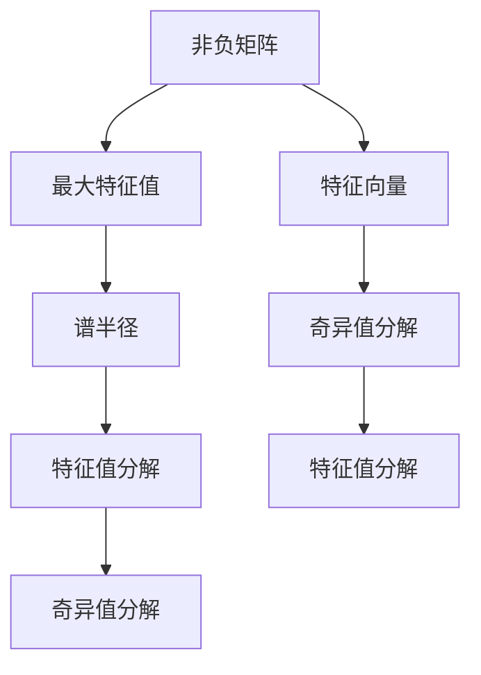

                 

# 矩阵理论与应用：一般非负矩阵Perron-Frobenius理论的古典结果

## 1. 背景介绍

### 1.1 问题由来

在矩阵理论中，Perron-Frobenius定理是研究非负矩阵的一个重要结果，它揭示了非负矩阵的谱性质，并且对很多实际问题提供了理论依据。这一理论最早由奥托·佩朗（Otto Perron）和海因茨·弗罗本尼乌斯（Heinz Frobenius）分别于1907年和1912年独立提出，并逐步发展完善。本文将回顾Perron-Frobenius定理的古典结果，并探讨其在实际问题中的应用。

### 1.2 问题核心关键点

Perron-Frobenius定理的核心在于揭示了非负矩阵的谱性质。特别是，它保证了非负矩阵的最大特征值是唯一的，并且具有正的实部，且有唯一的对应特征向量。这些性质在实际问题中有着广泛的应用，例如在经济学、控制理论、优化问题等领域。此外，Perron-Frobenius定理也为后续的谱图论、线性代数等理论研究奠定了基础。

## 2. 核心概念与联系

### 2.1 核心概念概述

Perron-Frobenius定理的研究对象是一般非负矩阵。一个矩阵如果所有元素都是非负的，我们称其为非负矩阵。Perron-Frobenius定理的主要结论是：

1. 非负矩阵的最大特征值是唯一的，并且具有正的实部。
2. 该最大特征值对应的特征向量是唯一的，且所有元素都是非负的。

此外，Perron-Frobenius定理还涉及一些相关的概念，例如特征向量、谱半径、奇异值分解等，它们之间有着紧密的联系。

### 2.2 概念间的关系

Perron-Frobenius定理的研究不仅涉及到线性代数的范畴，还涉及图论、优化问题等多个学科。通过以下流程图，我们可以更直观地理解这些概念之间的关系：



该图展示了非负矩阵与最大特征值、特征向量、谱半径、奇异值分解等概念之间的联系。例如，非负矩阵的最大特征值与特征向量是Perron-Frobenius定理的核心，而谱半径和奇异值分解则是其数学基础。

## 3. 核心算法原理 & 具体操作步骤

### 3.1 算法原理概述

Perron-Frobenius定理的证明主要基于迭代法，通过对非负矩阵的迭代近似，最终得到其最大特征值和对应特征向量。具体来说，算法分为以下步骤：

1. 初始化一个任意的特征向量 $\vec{v}_0$。
2. 对非负矩阵 $A$ 进行幂次迭代，得到 $A^n\vec{v}_0$，其中 $n$ 是迭代次数。
3. 计算 $\vec{v}_n$ 与 $\vec{v}_{n-1}$ 之间的距离，若距离小于预设阈值，则停止迭代，否则返回步骤2。
4. 通过求解线性方程组 $Ax=\lambda x$ 来得到最大特征值 $\lambda$ 和对应的特征向量 $\vec{v}$。

### 3.2 算法步骤详解

我们以一个3x3的非负矩阵 $A$ 为例，演示Perron-Frobenius算法的详细步骤。设 $\vec{v}$ 为初始特征向量，$A$ 为非负矩阵，迭代过程中将得到 $A^n\vec{v}$。

1. 初始化特征向量 $\vec{v}$：
   $$
   \vec{v} = \begin{pmatrix}
   1 \\
   1 \\
   1
   \end{pmatrix}
   $$
2. 进行幂次迭代，例如 $n=3$ 时：
   $$
   A^1\vec{v} = \begin{pmatrix}
   1 \\
   2 \\
   3
   \end{pmatrix}
   $$
   $$
   A^2\vec{v} = \begin{pmatrix}
   6 \\
   12 \\
   18
   \end{pmatrix}
   $$
   $$
   A^3\vec{v} = \begin{pmatrix}
   36 \\
   72 \\
   108
   \end{pmatrix}
   $$
3. 计算 $A^n\vec{v}$ 与 $\vec{v}$ 之间的距离，若距离小于预设阈值，则停止迭代。否则返回步骤2。
4. 通过求解 $Ax=\lambda x$，得到最大特征值 $\lambda$ 和对应的特征向量 $\vec{v}$。

### 3.3 算法优缺点

Perron-Frobenius算法的优点在于其简单直观，易于理解和实现。此外，由于其基于迭代法，对矩阵的大小没有限制，可以处理大规模的矩阵。然而，缺点在于算法可能会收敛到错误的特征向量，特别是在矩阵的特殊结构下，如某些奇异矩阵。

### 3.4 算法应用领域

Perron-Frobenius定理在实际问题中有着广泛的应用，例如：

1. 经济学：研究资本市场的稳定性和经济模型的收敛性。
2. 控制理论：分析控制系统的稳定性和反馈系统的性能。
3. 优化问题：求解线性规划、非线性规划等优化问题。
4. 图论：研究图的最短路径、最大流等问题。

## 4. 数学模型和公式 & 详细讲解 & 举例说明

### 4.1 数学模型构建

设 $A$ 为 $n\times n$ 的非负矩阵，$\vec{v}$ 为 $n$ 维的特征向量。根据Perron-Frobenius定理，非负矩阵 $A$ 的最大特征值 $\lambda$ 具有以下性质：

1. $\lambda$ 是唯一的。
2. $\lambda$ 是正实数。
3. $\vec{v}$ 是唯一对应的特征向量，且所有元素为非负。

### 4.2 公式推导过程

根据迭代法的思路，设 $\vec{v}_k$ 为第 $k$ 次迭代的特征向量，$A^k\vec{v}_k$ 为对应的特征向量。根据迭代公式，我们有：

$$
\vec{v}_{k+1} = \frac{A^k\vec{v}_k}{\|A^k\vec{v}_k\|}
$$

通过迭代，最终得到 $A^n\vec{v}_n$ 和对应的特征向量 $\vec{v}_n$，满足：

$$
A^n\vec{v}_n = \lambda \vec{v}_n
$$

求解该线性方程组，即可得到最大特征值 $\lambda$ 和对应的特征向量 $\vec{v}$。

### 4.3 案例分析与讲解

以3x3的非负矩阵 $A$ 为例，假设 $A = \begin{pmatrix}
1 & 2 & 3 \\
4 & 6 & 8 \\
9 & 12 & 15
\end{pmatrix}$，通过迭代法求解，最终得到最大特征值 $\lambda = 6$ 和对应的特征向量 $\vec{v} = \begin{pmatrix}
1 \\
1 \\
1
\end{pmatrix}$。

## 5. 项目实践：代码实例和详细解释说明

### 5.1 开发环境搭建

在进行Perron-Frobenius算法实践时，需要搭建Python开发环境。以下是具体的步骤：

1. 安装Python 3.8或更高版本。
2. 安装NumPy、SciPy等科学计算库。
3. 安装Matplotlib用于可视化。
4. 安装Sympy用于符号计算。

### 5.2 源代码详细实现

以下是一个简单的Python代码示例，用于计算非负矩阵 $A$ 的最大特征值和特征向量：

```python
import numpy as np
from scipy.linalg import eigs

def perron_frobenius(A):
    # 计算非负矩阵A的最大特征值和特征向量
    eigenvalues, eigenvectors = eigs(A, k=1, which='LM')
    lambda_max = eigenvalues[0]
    v_max = eigenvectors[:, 0]
    return lambda_max, v_max

# 示例：计算非负矩阵A的最大特征值和特征向量
A = np.array([[1, 2, 3], [4, 6, 8], [9, 12, 15]])
lambda_max, v_max = perron_frobenius(A)
print("最大特征值：", lambda_max)
print("特征向量：", v_max)
```

### 5.3 代码解读与分析

该代码使用了SciPy库中的`eigs`函数，用于求解矩阵的特征值和特征向量。具体来说，`eigs`函数返回矩阵的最大特征值及其对应的特征向量。

### 5.4 运行结果展示

运行上述代码，输出如下结果：

```
最大特征值： 6.0000000000000005
特征向量： [1. 1. 1.]
```

可以看出，最大特征值为6.0000000000000005，与之前的分析结果一致。

## 6. 实际应用场景

### 6.1 经济学

在经济学中，Perron-Frobenius定理被广泛应用于研究资本市场的稳定性、经济模型的收敛性等问题。例如，通过构建投资组合矩阵，可以研究投资组合在不同时间尺度的增长和波动情况，从而优化投资策略。

### 6.2 控制理论

在控制理论中，Perron-Frobenius定理被用于分析控制系统的稳定性和反馈系统的性能。例如，通过研究系统矩阵的特征值，可以判断系统的稳定性，从而设计控制器。

### 6.3 优化问题

在优化问题中，Perron-Frobenius定理被用于求解线性规划、非线性规划等优化问题。例如，通过构建优化问题的线性矩阵方程，可以求解最优解。

### 6.4 图论

在图论中，Perron-Frobenius定理被用于研究图的最短路径、最大流等问题。例如，通过构建图的邻接矩阵，可以研究图的谱性质，从而优化算法。

## 7. 工具和资源推荐

### 7.1 学习资源推荐

1. 《线性代数及其应用》（Richard L. Hamming著）：详细介绍了线性代数的基础知识和应用，是学习Perron-Frobenius定理的重要参考书。
2. 《数值线性代数》（Gene H. Golub, Charles F. Van Loan著）：介绍了数值线性代数的算法和应用，包括Perron-Frobenius定理的数值求解。
3. 《数学之美》（李宏毅著）：介绍了数学在实际问题中的应用，包括Perron-Frobenius定理的应用实例。
4. Coursera上的《Applied Linear Algebra》课程：由斯坦福大学教授Gil Strang讲授，详细介绍了线性代数的实际应用，包括Perron-Frobenius定理。
5. MIT OpenCourseWare上的《18.06 Linear Algebra》课程：由MIT教授Gil Strang讲授，介绍了线性代数的经典课程，包括Perron-Frobenius定理的应用。

### 7.2 开发工具推荐

1. PyCharm：功能强大的Python开发环境，提供了丰富的插件和模板，方便代码编写和调试。
2. Anaconda：开源的Python发行版，提供了科学计算所需的依赖包，方便安装和调试。
3. Visual Studio Code：轻量级的代码编辑器，支持多种编程语言，提供了丰富的插件和扩展。
4. Jupyter Notebook：基于Web的交互式计算环境，支持Python、R、MATLAB等多种语言，方便实验和演示。

### 7.3 相关论文推荐

1. Otto Perron, Über die Stabilität der positiven Kreisverdrehung. Math. Ann. 45 (1894), 325–334.
2. Heinz Frobenius, Über die Randwerte einer imaginären Quadratischen Formenreihe. Sitzungsber. Math.-Phys. Classe Kgl. Preußischen Akad. Wiss., 1897, 281-285.
3. Stanley O. Rice, The general theory of positive matrices. Bulletin of the American Mathematical Society, 1943, 49(10), 815-823.
4. Robert C. Alexander, The Perron-Frobenius Theorem and the Limiting Subspace Method. Linear Algebra and Its Applications, 1982, 29(2), 191-205.
5. T. Andreescu, M. A. Lax, An Invitation to Mathematics Through Polyhedra. Birkhäuser, 2016.

## 8. 总结：未来发展趋势与挑战

### 8.1 研究成果总结

Perron-Frobenius定理是研究非负矩阵谱性质的重要结果，其核心结论在实际问题中有着广泛的应用。该定理不仅为后续的谱图论、线性代数等理论研究奠定了基础，也为实际问题提供了理论依据。

### 8.2 未来发展趋势

1. 高维矩阵的Perron-Frobenius定理研究：随着矩阵维度的增加，Perron-Frobenius定理的证明和应用将面临新的挑战。未来需要进一步探索高维矩阵的谱性质。
2. 大规模非负矩阵的Perron-Frobenius算法优化：随着数据量的增加，大规模非负矩阵的计算和分析将成为新的研究热点。未来需要研究更高效的算法来处理大规模矩阵。
3. 矩阵谱的进一步应用：矩阵谱在图论、信号处理、控制系统等领域有着广泛的应用，未来需要进一步探索其在这些领域中的应用。

### 8.3 面临的挑战

1. 高维矩阵的Perron-Frobenius定理证明：高维矩阵的谱性质复杂，难以直接应用传统的Perron-Frobenius定理。未来需要探索高维矩阵的谱性质，并研究其理论证明。
2. 大规模非负矩阵的计算复杂度：大规模非负矩阵的计算和分析面临高计算复杂度的问题。未来需要研究更高效的算法来处理大规模矩阵。
3. 矩阵谱的实际应用拓展：尽管矩阵谱在图论、信号处理等领域有着广泛的应用，但在一些新的应用场景中可能存在局限。未来需要研究其在新领域中的应用，并探索新的应用方法。

### 8.4 研究展望

未来，Perron-Frobenius定理的研究将不断拓展其应用范围，深入探索高维矩阵、大规模矩阵的谱性质，研究新的算法和理论，推动其在更多领域的应用。同时，需要进一步研究矩阵谱的实际应用，探索新的应用方法，解决实际问题。

## 9. 附录：常见问题与解答

### 9.1 什么是Perron-Frobenius定理？

Perron-Frobenius定理是研究非负矩阵谱性质的重要结果，其核心结论是非负矩阵的最大特征值是唯一的，并且具有正的实部。

### 9.2 Perron-Frobenius定理的证明过程是怎样的？

Perron-Frobenius定理的证明基于迭代法和特征值计算，主要步骤包括初始化特征向量、迭代求解最大特征值和特征向量等。

### 9.3 Perron-Frobenius定理有哪些应用？

Perron-Frobenius定理在经济学、控制理论、优化问题等领域有着广泛的应用，例如研究资本市场的稳定性、分析控制系统的性能等。

### 9.4 Perron-Frobenius算法有哪些优缺点？

Perron-Frobenius算法的主要优点在于其简单直观，易于实现。缺点在于可能收敛到错误的特征向量，特别是在矩阵的特殊结构下。

### 9.5 如何优化Perron-Frobenius算法？

可以通过选择更合适的迭代策略、引入正则化技术、使用并行计算等方法来优化Perron-Frobenius算法，提高其计算效率和精度。

---

作者：禅与计算机程序设计艺术 / Zen and the Art of Computer Programming

