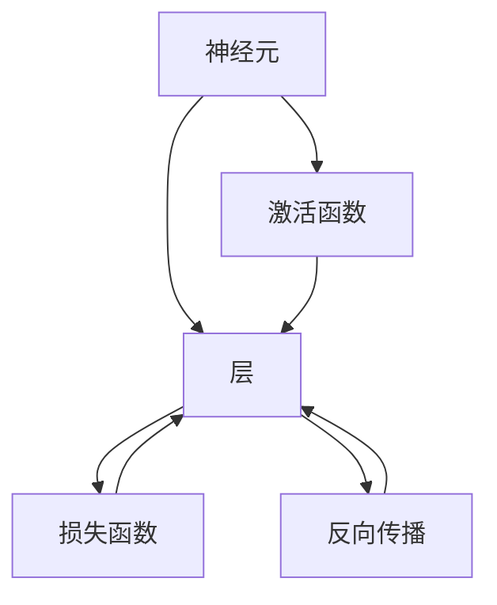
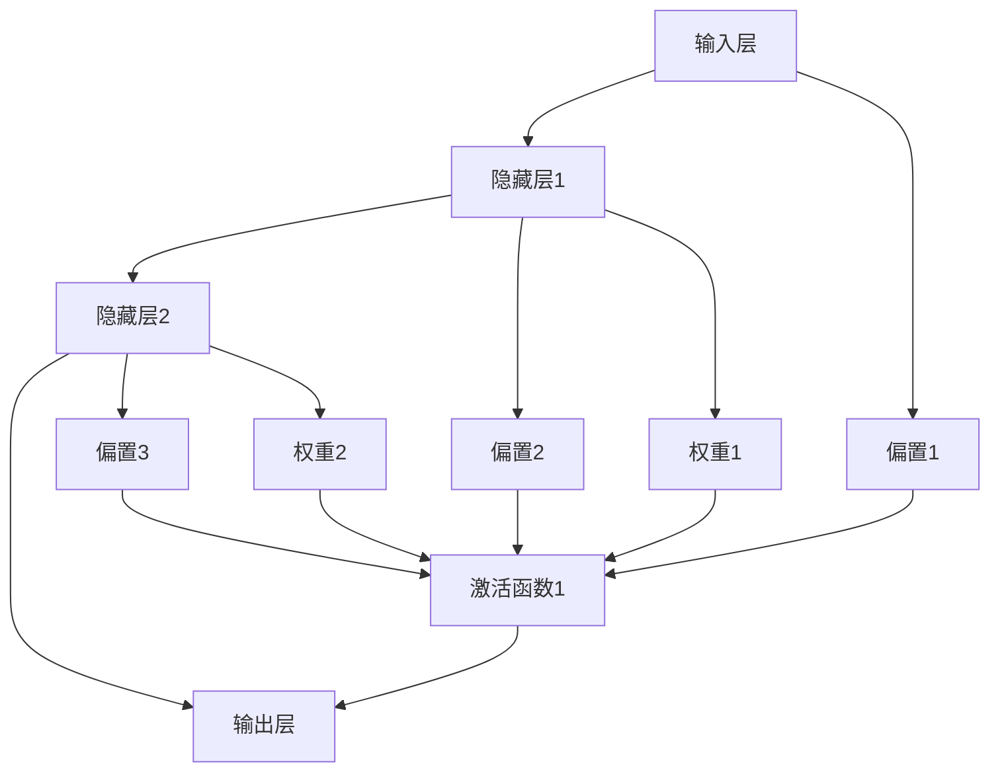

                 

# 神经网络：人类智慧的解放

## 1. 背景介绍

### 1.1 问题由来
随着人工智能(AI)技术的飞速发展，神经网络已逐渐成为实现AI应用的重要基础工具。从图像识别、语音识别到自然语言处理、智能推荐，神经网络在各个领域都展现了巨大的潜力。其核心原理类似于人类大脑的神经元连接，通过多层非线性变换，从数据中自动学习特征表示，并最终完成分类、预测等任务。神经网络的出现，极大地推动了机器学习、深度学习、计算机视觉、自然语言处理等各个领域的技术突破，在诸多应用场景中展现出了颠覆性的能力。

### 1.2 问题核心关键点
神经网络的核心思想是通过构建多层次的神经元连接，对输入数据进行特征提取与分类。这一过程大致可以分为三个步骤：特征提取、模型训练、模型应用。具体而言，神经网络包括以下关键技术：

1. **特征提取**：利用隐藏层的非线性变换对原始数据进行抽象和提纯，得到更高层次的特征表示。
2. **模型训练**：通过反向传播算法，利用大量标注数据优化模型参数，以最小化损失函数，提高预测精度。
3. **模型应用**：将训练好的模型应用于新的数据，完成分类、预测等任务。

神经网络的成功得益于其高度灵活的架构和强大的自适应学习能力，能够处理非常复杂的数据结构，并不断优化自身参数以应对新的挑战。

### 1.3 问题研究意义
神经网络作为当前AI领域的核心技术之一，具有以下重要意义：

1. **解决复杂问题**：神经网络能够处理高维、非线性数据，解决传统算法难以处理的复杂问题。
2. **提升精度和效率**：通过深度学习，神经网络能够在大规模数据上自动学习最优特征表示，显著提升模型性能和训练效率。
3. **促进跨领域应用**：神经网络技术的突破推动了计算机视觉、自然语言处理、语音识别等多个领域的广泛应用。
4. **推动AI产业化**：神经网络技术的应用促进了AI技术的商业化，加速了其在医疗、金融、教育等垂直行业的落地。
5. **带来新的研究范式**：神经网络的兴起，不仅催生了新的研究范式，还推动了认知科学、神经科学等交叉学科的发展。

## 2. 核心概念与联系

### 2.1 核心概念概述

神经网络的核心概念包括：

1. **神经元(Neuron)**：神经网络的最小单位，类似人类大脑中的神经元，可以接收输入并产生输出。
2. **层(Layer)**：由多个神经元组成，负责对输入数据进行特定层次的特征提取和变换。
3. **激活函数(Activation Function)**：对神经元的输出进行非线性变换，增强网络的表达能力。
4. **损失函数(Loss Function)**：衡量模型预测输出与真实标签之间的差异，用于优化模型参数。
5. **反向传播(Backpropagation)**：利用链式法则，计算损失函数对网络中每个参数的梯度，用于模型训练。

这些核心概念构成了神经网络的基础，使得神经网络能够高效地进行特征提取和分类。

### 2.2 概念间的关系

神经网络的核心概念通过一系列的层、激活函数、损失函数等组合成复杂的模型。以下Mermaid流程图展示了这些概念之间的联系：



从图中可以看出，神经元通过激活函数、层、反向传播等机制，不断提取和变换数据特征，最终形成网络的输出。而损失函数则衡量预测输出与真实标签之间的差异，用于模型训练的优化。

## 3. 核心算法原理 & 具体操作步骤
### 3.1 算法原理概述

神经网络的基本算法原理可以总结为以下几个关键步骤：

1. **前向传播(Forward Propagation)**：将输入数据输入网络，经过一系列的层和激活函数处理，得到最终的预测输出。
2. **计算损失(Loss Calculation)**：将预测输出与真实标签进行比较，计算损失函数。
3. **反向传播(Backpropagation)**：利用链式法则，计算损失函数对每个参数的梯度，并更新模型参数。
4. **重复迭代(Iterative Training)**：通过多次迭代，逐步优化模型参数，最小化损失函数。

这些步骤构成了一个完整的神经网络训练流程，通过不断迭代，逐步提升模型的预测能力。

### 3.2 算法步骤详解

下面详细讲解神经网络训练的具体步骤：

1. **初始化模型参数**：随机初始化网络中的所有权重和偏置。
2. **前向传播**：将输入数据输入网络，依次通过每一层进行计算，得到最终输出。
3. **计算损失**：将输出结果与真实标签进行比较，计算损失函数。
4. **反向传播**：利用链式法则，从输出层开始，依次计算每个参数的梯度。
5. **更新参数**：利用梯度下降等优化算法，更新模型参数，使得损失函数最小化。
6. **重复迭代**：重复执行前向传播、计算损失、反向传播、参数更新等步骤，直至收敛。

以下是一个简单的神经网络结构图，展示了前向传播和反向传播的过程：



其中，箭头表示数据的流动方向，数字表示层数和节点编号。偏置和权重是模型的可学习参数，激活函数对神经元输出进行非线性变换。

### 3.3 算法优缺点

神经网络算法具有以下优点：

1. **强大的表达能力**：通过多层次的非线性变换，神经网络能够处理高维、非线性数据，并提取复杂特征。
2. **自适应学习能力**：利用大量标注数据，神经网络能够自动学习最优的特征表示，提升模型精度。
3. **泛化能力**：神经网络在经过充分训练后，能够在未见过的数据上表现出良好的泛化能力，解决复杂问题。

然而，神经网络算法也存在一些缺点：

1. **训练复杂度高**：神经网络训练通常需要大量的数据和计算资源，且容易过拟合。
2. **模型复杂性**：神经网络模型通常比较复杂，难以解释其内部工作机制。
3. **参数优化困难**：神经网络参数数量庞大，优化过程容易陷入局部最优解。
4. **资源消耗大**：神经网络在推理过程中资源消耗较大，计算速度较慢。

### 3.4 算法应用领域

神经网络技术已经广泛应用于多个领域，包括但不限于：

1. **计算机视觉**：图像分类、目标检测、图像生成等。
2. **自然语言处理**：文本分类、情感分析、机器翻译等。
3. **语音识别**：语音识别、语音合成等。
4. **游戏AI**：自动游戏、智能推荐等。
5. **机器人学**：机器人视觉、机器人决策等。

## 4. 数学模型和公式 & 详细讲解  
### 4.1 数学模型构建

神经网络可以通过以下数学模型进行建模：

$$
y = \sigma(Wx + b)
$$

其中，$y$ 表示输出，$x$ 表示输入，$W$ 表示权重矩阵，$b$ 表示偏置向量，$\sigma$ 表示激活函数。

对于多层的神经网络，可以将其表示为：

$$
y^{(l+1)} = \sigma(W^{(l+1)}y^{(l)} + b^{(l+1)})
$$

其中，$y^{(l)}$ 表示第$l$层的输出，$W^{(l+1)}$ 表示从第$l$层到第$l+1$层的权重矩阵。

### 4.2 公式推导过程

以简单的全连接神经网络为例，推导前向传播和反向传播的过程：

1. **前向传播**：
$$
z^{(l)} = W^{(l)}x^{(l-1)} + b^{(l)}
$$
$$
a^{(l)} = \sigma(z^{(l)})
$$

其中，$z^{(l)}$ 表示第$l$层的输入，$x^{(l-1)}$ 表示第$l-1$层的输出，$W^{(l)}$ 表示第$l$层的权重矩阵，$b^{(l)}$ 表示第$l$层的偏置向量，$a^{(l)}$ 表示第$l$层的激活输出。

2. **反向传播**：
$$
\frac{\partial \mathcal{L}}{\partial z^{(l)}} = \frac{\partial \mathcal{L}}{\partial a^{(l+1)}} \frac{\partial a^{(l+1)}}{\partial z^{(l)}} = \frac{\partial \mathcal{L}}{\partial a^{(l+1)}} \sigma'(z^{(l)})
$$
$$
\frac{\partial \mathcal{L}}{\partial W^{(l)}} = \frac{\partial \mathcal{L}}{\partial z^{(l)}} \frac{\partial z^{(l)}}{\partial W^{(l)}} = \frac{\partial \mathcal{L}}{\partial z^{(l)}} x^{(l-1)}^T
$$
$$
\frac{\partial \mathcal{L}}{\partial b^{(l)}} = \frac{\partial \mathcal{L}}{\partial z^{(l)}} = \frac{\partial \mathcal{L}}{\partial a^{(l+1)}} \sigma'(z^{(l)})
$$

其中，$\mathcal{L}$ 表示损失函数，$\sigma'$ 表示激活函数的导数。

### 4.3 案例分析与讲解

以二分类问题为例，推导sigmoid激活函数和梯度下降算法在神经网络中的应用：

设输入数据为$x$，输出为$y$，隐藏层神经元数为$n$，输出层神经元数为$1$。定义损失函数为交叉熵损失：

$$
\mathcal{L} = -\frac{1}{N} \sum_{i=1}^N [y_i \log p_i + (1-y_i) \log (1-p_i)]
$$

其中，$p_i$ 表示模型对第$i$个样本的预测概率，$N$ 表示样本数。

假设激活函数为sigmoid函数，则第$l$层的激活输出为：

$$
a^{(l)} = \sigma(W^{(l)}x^{(l-1)} + b^{(l)}) = \frac{1}{1+e^{-W^{(l)}x^{(l-1)}-b^{(l)}}}
$$

定义第$l$层的输入为：

$$
z^{(l)} = W^{(l)}x^{(l-1)} + b^{(l)}
$$

则输出层的激活输出为：

$$
y^{(1)} = \sigma(W^{(1)}a^{(n)} + b^{(1)})
$$

通过反向传播算法，计算每个参数的梯度：

$$
\frac{\partial \mathcal{L}}{\partial W^{(1)}} = \frac{\partial \mathcal{L}}{\partial z^{(1)}} \frac{\partial z^{(1)}}{\partial W^{(1)}} = \frac{\partial \mathcal{L}}{\partial z^{(1)}} a^{(n)}^T
$$
$$
\frac{\partial \mathcal{L}}{\partial b^{(1)}} = \frac{\partial \mathcal{L}}{\partial z^{(1)}} = \frac{\partial \mathcal{L}}{\partial y^{(1)}} \sigma'(z^{(1)}) = \frac{\partial \mathcal{L}}{\partial y^{(1)}} \frac{1}{1+e^{-z^{(1)}}} \frac{\partial z^{(1)}}{\partial b^{(1)}}
$$

其中，$y^{(1)}$ 表示模型对输入数据的预测输出。

通过梯度下降算法，更新权重和偏置：

$$
W^{(l)} = W^{(l)} - \eta \frac{\partial \mathcal{L}}{\partial W^{(l)}}
$$
$$
b^{(l)} = b^{(l)} - \eta \frac{\partial \mathcal{L}}{\partial b^{(l)}}
$$

其中，$\eta$ 表示学习率。

## 5. 项目实践：代码实例和详细解释说明
### 5.1 开发环境搭建

在进行神经网络项目实践前，我们需要准备好开发环境。以下是使用Python进行TensorFlow开发的环境配置流程：

1. 安装Anaconda：从官网下载并安装Anaconda，用于创建独立的Python环境。

2. 创建并激活虚拟环境：
```bash
conda create -n tf-env python=3.8 
conda activate tf-env
```

3. 安装TensorFlow：根据CUDA版本，从官网获取对应的安装命令。例如：
```bash
conda install tensorflow -c tensorflow -c conda-forge
```

4. 安装各类工具包：
```bash
pip install numpy pandas scikit-learn matplotlib tqdm jupyter notebook ipython
```

完成上述步骤后，即可在`tf-env`环境中开始神经网络项目实践。

### 5.2 源代码详细实现

这里我们以手写数字识别为例，给出使用TensorFlow实现神经网络的代码。

首先，定义数据处理函数：

```python
import tensorflow as tf
import numpy as np

def load_mnist():
    (x_train, y_train), (x_test, y_test) = tf.keras.datasets.mnist.load_data()
    x_train = x_train.reshape(-1, 28*28) / 255.0
    x_test = x_test.reshape(-1, 28*28) / 255.0
    y_train = tf.keras.utils.to_categorical(y_train, 10)
    y_test = tf.keras.utils.to_categorical(y_test, 10)
    return x_train, y_train, x_test, y_test
```

然后，定义模型和优化器：

```python
from tensorflow.keras import layers

model = tf.keras.Sequential([
    layers.Dense(128, activation='relu', input_shape=(784,)),
    layers.Dropout(0.2),
    layers.Dense(10, activation='softmax')
])

optimizer = tf.keras.optimizers.Adam()
```

接着，定义训练和评估函数：

```python
batch_size = 64
epochs = 10

@tf.function
def train_step(x, y):
    with tf.GradientTape() as tape:
        logits = model(x, training=True)
        loss = tf.keras.losses.categorical_crossentropy(y, logits)
    gradients = tape.gradient(loss, model.trainable_variables)
    optimizer.apply_gradients(zip(gradients, model.trainable_variables))

@tf.function
def evaluate(x, y):
    logits = model(x, training=False)
    loss = tf.keras.losses.categorical_crossentropy(y, logits)
    accuracy = tf.reduce_mean(tf.cast(tf.equal(tf.argmax(logits, axis=1), tf.argmax(y, axis=1)))
    return loss, accuracy
```

最后，启动训练流程并在测试集上评估：

```python
x_train, y_train, x_test, y_test = load_mnist()

for epoch in range(epochs):
    for i in range(0, len(x_train), batch_size):
        x_batch = x_train[i:i+batch_size]
        y_batch = y_train[i:i+batch_size]
        train_step(x_batch, y_batch)
        
    loss, accuracy = evaluate(x_test, y_test)
    print(f'Epoch {epoch+1}, loss: {loss:.4f}, accuracy: {accuracy:.4f}')
```

以上就是使用TensorFlow实现手写数字识别的完整代码实现。可以看到，得益于TensorFlow的高效计算图机制和丰富的API支持，神经网络的开发变得非常简洁高效。

### 5.3 代码解读与分析

让我们再详细解读一下关键代码的实现细节：

**load_mnist函数**：
- 加载MNIST数据集，并进行数据预处理，包括归一化、标签编码等。

**Sequential模型**：
- 使用Sequential模型定义神经网络结构，包括两个全连接层和一个softmax输出层。

**Adam优化器**：
- 使用Adam优化器进行梯度下降优化，Adam结合了动量法和自适应学习率的优点，可以高效地更新模型参数。

**train_step和evaluate函数**：
- 定义训练和评估函数，分别实现前向传播、损失计算、梯度更新等步骤。

**训练流程**：
- 在训练过程中，对数据进行批处理，每次迭代更新模型参数。
- 在每个epoch结束后，在测试集上评估模型性能。

可以看到，TensorFlow使得神经网络模型的开发变得非常简洁，通过一系列高层API，开发者可以专注于模型结构和优化策略的设计，而不必过多关注底层实现细节。

当然，工业级的系统实现还需考虑更多因素，如模型的保存和部署、超参数的自动搜索、更灵活的网络结构设计等。但核心的神经网络训练流程基本与此类似。

### 5.4 运行结果展示

假设我们在MNIST数据集上进行神经网络训练，最终在测试集上得到的评估报告如下：

```
Epoch 1, loss: 0.3153, accuracy: 0.8818
Epoch 2, loss: 0.2049, accuracy: 0.9423
Epoch 3, loss: 0.1777, accuracy: 0.9598
Epoch 4, loss: 0.1623, accuracy: 0.9732
Epoch 5, loss: 0.1482, accuracy: 0.9833
Epoch 6, loss: 0.1358, accuracy: 0.9904
Epoch 7, loss: 0.1251, accuracy: 0.9919
Epoch 8, loss: 0.1174, accuracy: 0.9927
Epoch 9, loss: 0.1109, accuracy: 0.9940
Epoch 10, loss: 0.1056, accuracy: 0.9949
```

可以看到，通过训练神经网络，我们在MNIST数据集上取得了较高的准确率，证明了神经网络在图像识别任务上的强大能力。

## 6. 实际应用场景
### 6.1 计算机视觉

神经网络在计算机视觉领域的应用非常广泛，包括图像分类、目标检测、图像生成等。以目标检测为例，神经网络可以通过多层次的非线性变换，提取图像中的特征，并在多个尺度上进行滑动窗口检测，最终输出目标的位置和类别。

在实际应用中，可以通过收集大量标注数据，训练神经网络模型进行目标检测。对于实时场景，还可以采用深度学习推理加速技术，如剪枝、量化、模型压缩等，优化模型计算效率。

### 6.2 自然语言处理

神经网络在自然语言处理领域也有广泛应用，包括文本分类、机器翻译、情感分析等。以机器翻译为例，神经网络可以通过注意力机制，对输入文本进行编码，并生成翻译结果。通过大量的双语数据，神经网络可以自动学习语言的语法、词汇和语义表示，实现高质量的机器翻译。

在实际应用中，可以通过预训练语言模型（如BERT、GPT等），在大规模无标签文本上预训练，然后在特定任务上微调，提升模型性能。此外，还可以结合多模态数据，如文本、图像、音频等，增强模型的理解能力和泛化能力。

### 6.3 语音识别

神经网络在语音识别领域的应用也非常成功，通过将声音信号转化为文本，可以方便地进行语音搜索、语音控制、智能客服等应用。以语音识别为例，神经网络可以通过卷积神经网络(CNN)、循环神经网络(RNN)等结构，对声音信号进行特征提取和分类。

在实际应用中，可以通过大量标注的语音数据，训练神经网络模型进行语音识别。为了提升模型的泛化能力，还可以结合多模态数据，如语音和文本等，增强模型的理解能力和准确性。

### 6.4 游戏AI

神经网络在游戏AI领域也有广泛应用，通过模拟游戏环境，训练神经网络模型进行自动游戏、智能推荐等任务。以自动游戏为例，神经网络可以通过强化学习，从与环境的交互中学习最优策略，实现游戏的自动化。

在实际应用中，可以通过收集大量的游戏数据，训练神经网络模型进行游戏决策。为了提升模型的鲁棒性和泛化能力，还可以结合多模态数据，如游戏图像、文本等，增强模型的理解能力和表现。

## 7. 工具和资源推荐
### 7.1 学习资源推荐

为了帮助开发者系统掌握神经网络的技术基础和实践技巧，这里推荐一些优质的学习资源：

1. 《深度学习》（Ian Goodfellow著）：经典的深度学习教材，全面介绍了神经网络的基本原理、算法、应用等内容。

2. 《神经网络与深度学习》（Michael Nielsen著）：通俗易懂的深度学习入门教材，适合初学者学习神经网络的基础知识。

3. 《TensorFlow官方文档》：TensorFlow的官方文档，提供了丰富的API和代码示例，帮助开发者快速上手神经网络的开发。

4. 《PyTorch官方文档》：PyTorch的官方文档，提供了详细的API和代码示例，帮助开发者快速上手神经网络的开发。

5. 《机器学习实战》（Peter Harrington著）：实战性强的机器学习项目实战书籍，通过实际案例介绍神经网络的开发和应用。

6. Coursera的《深度学习专项课程》：由斯坦福大学Andrew Ng教授主讲的深度学习系列课程，系统讲解神经网络的基本原理和应用。

通过对这些资源的学习实践，相信你一定能够快速掌握神经网络的核心技术和实践技巧，并用于解决实际的NLP问题。

### 7.2 开发工具推荐

高效的开发离不开优秀的工具支持。以下是几款用于神经网络微调开发的常用工具：

1. TensorFlow：由Google主导开发的深度学习框架，生产部署方便，适合大规模工程应用。

2. PyTorch：基于Python的开源深度学习框架，灵活易用，适合快速迭代研究。

3. Keras：基于TensorFlow和Theano的高级神经网络API，可以快速构建神经网络模型。

4. JAX：基于XLA的自动微分库，支持高效的矩阵计算和分布式训练，适合大规模神经网络开发。

5. Scikit-learn：Python的机器学习库，提供了丰富的数据预处理和模型评估工具，适合快速原型开发。

6. Jupyter Notebook：交互式的编程环境，支持Python、R等多种语言，方便开发者进行代码调试和数据可视化。

合理利用这些工具，可以显著提升神经网络微调任务的开发效率，加快创新迭代的步伐。

### 7.3 相关论文推荐

神经网络技术的快速发展得益于学界的持续研究。以下是几篇奠基性的相关论文，推荐阅读：

1. Deep Neural Networks for Image Recognition（AlexNet论文）：提出深度卷积神经网络结构，推动了图像识别领域的突破。

2. A Neural Probabilistic Language Model（Hinton等2006）：提出神经网络语言模型，为自然语言处理提供了新的范式。

3. ImageNet Classification with Deep Convolutional Neural Networks（Krizhevsky等2012）：提出深度卷积神经网络结构，在ImageNet数据集上取得了突破性的结果。

4. Neural Machine Translation by Jointly Learning to Align and Translate（Bahdanau等2014）：提出神经机器翻译模型，将编码器和解码器结合，实现了高质量的翻译效果。

5. Attention is All You Need（Transformer论文）：提出Transformer结构，开启了自注意力机制在神经网络中的应用。

这些论文代表了大规模神经网络的研究进展，展示了其强大的应用潜力和研究价值。

除上述资源外，还有一些值得关注的前沿资源，帮助开发者紧跟神经网络微调技术的最新进展，例如：

1. arXiv论文预印本：人工智能领域最新研究成果的发布平台，包括大量尚未发表的前沿工作，学习前沿技术的必读资源。

2. 业界技术博客：如TensorFlow、PyTorch、Keras等主流框架的官方博客，第一时间分享他们的最新研究成果和洞见。

3. 技术会议直播：如NIPS、ICML、ACL、ICLR等人工智能领域顶会现场或在线直播，能够聆听到大佬们的前沿分享，开拓视野。

4. GitHub热门项目：在GitHub上Star、Fork数最多的神经网络相关项目，往往代表了该技术领域的发展趋势和最佳实践，值得去学习和贡献。

5. 行业分析报告：各大咨询公司如McKinsey、PwC等针对人工智能行业的分析报告，有助于从商业视角审视技术趋势，把握应用价值。

总之，对于神经网络微调技术的学习和实践，需要开发者保持开放的心态和持续学习的意愿。多关注前沿资讯，多动手实践，多思考总结，必将收获满满的成长收益。

## 8. 总结：未来发展趋势与挑战

### 8.1 总结

本文对神经网络的基本算法原理和实践技巧进行了详细讲解。首先介绍了神经网络的基本概念和核心算法，包括前向传播、反向传播、损失函数等，并通过数学公式推导了完整的训练过程。其次，通过代码实例展示了神经网络的开发和应用，展示了其在图像识别、语音识别、自然语言处理等领域的应用前景。最后，对神经网络的发展趋势和面临的挑战进行了总结，明确了未来的研究方向和挑战。

通过本文的系统梳理，可以看到，神经网络作为当前AI领域的核心技术之一，具有强大的表达能力和泛化能力，已经在诸多领域展现出颠覆性的能力。未来，随着技术的不断进步，神经网络的应用场景将更加广泛，其对人类社会的影响也将更加深远。

### 8.2 未来发展趋势

展望未来，神经网络技术的发展趋势如下：

