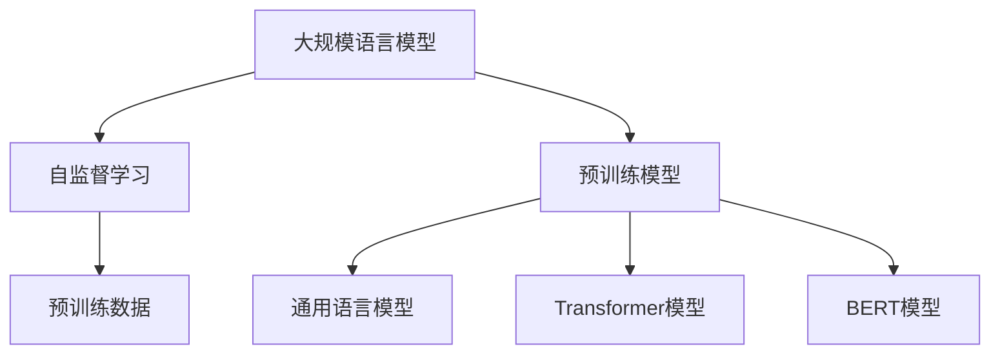
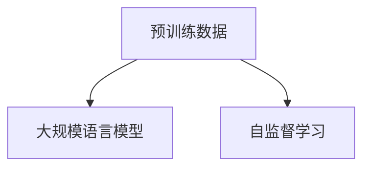
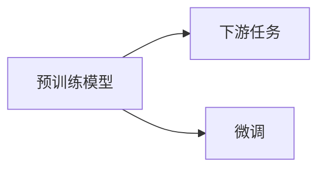

                 

# 大规模语言模型从理论到实践 大语言模型预训练数据

> 关键词：大规模语言模型,自监督学习,预训练数据,Transformer,BERT,预训练模型,通用语言模型,自然语言处理(NLP)

## 1. 背景介绍

### 1.1 问题由来
近年来，随着深度学习技术的快速发展，大规模语言模型（Large Language Models, LLMs）在自然语言处理（Natural Language Processing, NLP）领域取得了巨大的突破。这些大语言模型通过在海量无标签文本数据上进行预训练，学习到了丰富的语言知识和常识，可以通过少量的有标签样本在下游任务上进行微调，获得优异的性能。其中最具代表性的大模型包括OpenAI的GPT系列模型、Google的BERT、T5等。

然而，由于预训练语料的广泛性和泛化能力的不足，这些通用的大语言模型在特定领域应用时，效果往往难以达到实际应用的要求。因此，如何针对特定任务进行大模型预训练，提升模型性能，成为了当前大语言模型研究和应用的一个热点问题。本文聚焦于大语言模型预训练方法，但同时也会兼顾参数高效预训练和提示学习等前沿技术，以期对大语言模型预训练实践提供更全面的指导。

### 1.2 问题核心关键点
目前，大语言模型预训练的主流范式是自监督学习，即在大规模无标签文本语料上进行预训练。这种预训练方法通过自动设计的一些任务（如语言建模、掩码语言模型、预训练下一句预测等），让模型学习到语言中的规律和结构，从而获得语言的通用表示。

预训练的目的是通过大量无标签数据的训练，让模型具备更强的泛化能力，能够在下游任务中取得更好的表现。具体来说，预训练数据的选择和处理，对预训练模型的性能和泛化能力有着至关重要的影响。

预训练的数据集通常包含多种类型，包括但不限于维基百科、新闻、小说、网页、论文等。这些数据集不仅需要包含足够的数据量，还需要保证数据的多样性和代表性，以覆盖语言的各个方面。

此外，预训练的数据需要经过预处理，如分词、去停用词、归一化等，以保证数据的质量和一致性。预处理的过程往往需要消耗大量的时间和计算资源，是预训练模型开发的关键环节之一。

预训练完成后，通过有监督的微调，使模型在下游任务中进一步适应特定的需求，从而提升模型性能。微调的过程包括选择合适的学习率、应用正则化技术、保留预训练的部分层等，以避免过拟合，同时最大程度发挥预训练模型学到的知识。

## 2. 核心概念与联系

### 2.1 核心概念概述

为更好地理解大规模语言模型预训练方法，本节将介绍几个密切相关的核心概念：

- 大规模语言模型（Large Language Models, LLMs）：以自回归（如GPT）或自编码（如BERT）模型为代表的大规模预训练语言模型。通过在大规模无标签文本语料上进行预训练，学习通用的语言表示，具备强大的语言理解和生成能力。

- 自监督学习（Self-supervised Learning）：一种无需标注数据的学习范式，通过自动设计的任务，让模型在无标签数据上进行训练，从而学习到语言的规律和结构。

- 预训练模型（Pre-trained Models）：经过大规模自监督学习训练得到的模型，具备强大的语言理解和生成能力。

- 通用语言模型（Universal Language Model）：指能够处理各种语言理解和生成任务的模型，如BERT、GPT等。

- Transformer模型：一种基于自注意力机制的深度神经网络模型，被广泛应用于大语言模型的预训练和微调中。

- BERT模型：由Google提出的一种预训练语言模型，通过掩码语言模型和下一句预测等自监督任务，学习到语言的深度表示。

- 预训练数据（Pre-training Data）：用于训练大规模语言模型的大量无标签文本数据。

这些核心概念之间的逻辑关系可以通过以下Mermaid流程图来展示：



这个流程图展示了大规模语言模型的核心概念及其之间的关系：

1. 大规模语言模型通过自监督学习进行预训练，学习到语言的通用表示。
2. 预训练模型是经过自监督学习训练得到的模型，具备强大的语言理解和生成能力。
3. 通用语言模型指能够处理各种语言理解和生成任务的模型，如BERT、GPT等。
4. Transformer模型是用于大语言模型的核心模型，具有自注意力机制。
5. BERT模型是一种具体的预训练语言模型，通过掩码语言模型和下一句预测等自监督任务，学习到语言的深度表示。
6. 预训练数据是用于训练大规模语言模型的大量无标签文本数据。

这些核心概念共同构成了大规模语言模型的预训练生态系统，使其能够在各种场景下发挥强大的语言理解和生成能力。通过理解这些核心概念，我们可以更好地把握大规模语言模型的预训练原理和优化方向。

### 2.2 概念间的关系

这些核心概念之间存在着紧密的联系，形成了大规模语言模型预训练的完整生态系统。下面我通过几个Mermaid流程图来展示这些概念之间的关系。

#### 2.2.1 预训练模型与自监督学习的关系


这个流程图展示了预训练模型与自监督学习之间的关系。预训练模型是经过自监督学习训练得到的模型，具备强大的语言理解和生成能力。

#### 2.2.2 预训练数据与预训练模型之间的关系



这个流程图展示了预训练数据与预训练模型之间的关系。预训练数据是用于训练大规模语言模型的大量无标签文本数据，通过自监督学习训练得到预训练模型。

#### 2.2.3 通用语言模型与Transformer模型之间的关系


这个流程图展示了通用语言模型与Transformer模型之间的关系。通用语言模型如BERT、GPT等，都是基于Transformer模型构建的。

#### 2.2.4 预训练模型与下游任务之间的关系



这个流程图展示了预训练模型与下游任务之间的关系。预训练模型经过微调，能够适应特定下游任务，从而提升模型性能。

## 3. 核心算法原理 & 具体操作步骤
### 3.1 算法原理概述

大规模语言模型的预训练方法主要采用自监督学习范式，即在大规模无标签文本语料上进行预训练，学习到语言的规律和结构，从而获得语言的通用表示。

预训练过程通常包括以下几个步骤：

1. 数据预处理：对预训练数据进行分词、去停用词、归一化等处理，以保证数据的质量和一致性。
2. 构建预训练任务：设计自动设计的预训练任务，如语言建模、掩码语言模型、预训练下一句预测等，让模型在无标签数据上进行训练。
3. 训练预训练模型：使用预训练任务对模型进行训练，使模型学习到语言的深度表示。
4. 微调模型：将预训练模型作为初始化参数，通过有监督的微调，使模型在下游任务中进一步适应特定的需求。

具体来说，预训练模型的训练过程通常使用Transformer模型，通过自注意力机制和大规模并行计算，使模型在无标签数据上进行高效的训练。常见的预训练任务包括语言建模、掩码语言模型、预训练下一句预测等，通过这些任务，模型学习到语言的规律和结构。

预训练完成后，通过有监督的微调，使模型在下游任务中进一步适应特定的需求，从而提升模型性能。微调的过程包括选择合适的学习率、应用正则化技术、保留预训练的部分层等，以避免过拟合，同时最大程度发挥预训练模型学到的知识。

### 3.2 算法步骤详解

大规模语言模型的预训练通常包括以下几个关键步骤：

**Step 1: 准备预训练数据**

- 选择合适的预训练数据，如维基百科、新闻、小说、网页、论文等。数据集需要包含足够的数据量，并且具有多样性和代表性。
- 对预训练数据进行预处理，如分词、去停用词、归一化等，以保证数据的质量和一致性。

**Step 2: 构建预训练任务**

- 根据预训练数据的特点，设计自动设计的预训练任务。常见的预训练任务包括语言建模、掩码语言模型、预训练下一句预测等。
- 使用预训练任务对模型进行训练，使模型学习到语言的深度表示。

**Step 3: 训练预训练模型**

- 使用预训练任务对模型进行训练，使模型学习到语言的深度表示。训练过程通常使用Transformer模型，通过自注意力机制和大规模并行计算，使模型在无标签数据上进行高效的训练。

**Step 4: 微调模型**

- 将预训练模型作为初始化参数，通过有监督的微调，使模型在下游任务中进一步适应特定的需求。微调的过程包括选择合适的学习率、应用正则化技术、保留预训练的部分层等，以避免过拟合，同时最大程度发挥预训练模型学到的知识。

**Step 5: 保存模型**

- 保存预训练模型和微调后的模型，供后续应用使用。

以上是预训练大语言模型的完整流程。在实际应用中，还需要根据具体任务的特点，对预训练过程的各个环节进行优化设计，如改进训练目标函数，引入更多的正则化技术，搜索最优的超参数组合等，以进一步提升模型性能。

### 3.3 算法优缺点

大规模语言模型预训练方法具有以下优点：

1. 简单高效。预训练过程不需要标注数据，仅通过自动设计的预训练任务即可实现。
2. 泛化能力较强。预训练模型能够学习到语言的深度表示，具有较强的泛化能力。
3. 适用范围广。预训练模型可以应用于各种NLP任务，如文本分类、命名实体识别、关系抽取、问答系统、机器翻译等。
4. 可解释性较强。预训练模型通过自监督学习得到，具有较好的可解释性，方便分析和调试。

然而，该方法也存在一定的局限性：

1. 数据需求大。预训练数据需要覆盖语言的各个方面，数据需求量较大。
2. 计算资源消耗大。预训练过程需要大量的计算资源，训练时间较长。
3. 需要优化超参数。预训练过程需要手动优化超参数，如学习率、正则化系数等，需要一定的经验和技巧。
4. 难以保证语言公正性。预训练过程中可能会学习到数据的语言偏见，导致模型输出存在语言偏见。

尽管存在这些局限性，但就目前而言，大规模语言模型预训练方法仍然是NLP领域的主流范式。未来相关研究的重点在于如何进一步降低预训练对计算资源的需求，提高模型的泛化能力和可解释性，同时保证模型的语言公正性。

### 3.4 算法应用领域

大规模语言模型预训练方法已经在NLP领域得到了广泛的应用，覆盖了几乎所有常见任务，例如：

- 文本分类：如情感分析、主题分类、意图识别等。预训练模型通过学习文本-标签映射，能够准确分类文本。
- 命名实体识别：识别文本中的人名、地名、机构名等特定实体。预训练模型通过学习实体边界和类型，能够准确识别实体。
- 关系抽取：从文本中抽取实体之间的语义关系。预训练模型通过学习实体-关系三元组，能够抽取实体之间的关系。
- 问答系统：对自然语言问题给出答案。预训练模型通过学习问题-答案对，能够自动回答问题。
- 机器翻译：将源语言文本翻译成目标语言。预训练模型通过学习语言-语言映射，能够实现翻译任务。
- 文本摘要：将长文本压缩成简短摘要。预训练模型通过学习文章-摘要对，能够自动生成摘要。
- 对话系统：使机器能够与人自然对话。预训练模型通过学习对话历史，能够自动生成对话回复。

除了上述这些经典任务外，大规模语言模型预训练方法还被创新性地应用到更多场景中，如可控文本生成、常识推理、代码生成、数据增强等，为NLP技术带来了全新的突破。随着预训练模型和预训练方法的不断进步，相信NLP技术将在更广阔的应用领域大放异彩。

## 4. 数学模型和公式 & 详细讲解 & 举例说明

### 4.1 数学模型构建

本节将使用数学语言对大规模语言模型预训练过程进行更加严格的刻画。

记预训练语言模型为 $M_{\theta}$，其中 $\theta$ 为预训练得到的模型参数。假设预训练数据为 $D=\{(x_i, y_i)\}_{i=1}^N$，其中 $x_i \in \mathcal{X}$，$y_i \in \mathcal{Y}$，$\mathcal{X}$ 为输入空间，$\mathcal{Y}$ 为输出空间。预训练任务为 $L(x,y)$，预训练目标函数为 $\mathcal{L}(\theta)$。

预训练过程通常使用Transformer模型，通过自注意力机制和大规模并行计算，使模型在无标签数据上进行高效的训练。预训练目标函数定义为：

$$
\mathcal{L}(\theta) = \frac{1}{N} \sum_{i=1}^N L(x_i, y_i)
$$

其中 $L(x_i, y_i)$ 为预训练任务的损失函数，用于衡量模型预测输出与真实标签之间的差异。常见的预训练任务包括语言建模、掩码语言模型、预训练下一句预测等，通过这些任务，模型学习到语言的规律和结构。

预训练过程的数学公式如下：

$$
\theta_{t+1} = \theta_t - \eta \nabla_{\theta}\mathcal{L}(\theta_t)
$$

其中 $\eta$ 为学习率，$\nabla_{\theta}\mathcal{L}(\theta_t)$ 为损失函数对模型参数 $\theta_t$ 的梯度。

### 4.2 公式推导过程

以下我们以语言建模任务为例，推导预训练过程的数学公式。

语言建模任务的目标是预测下一个词的概率，即给定前 $t-1$ 个词，预测第 $t$ 个词的概率。假设输入序列 $x_1, x_2, ..., x_t$，目标词为 $x_t$，预训练目标函数为 $L(x,y)$。语言建模的预训练任务通常使用掩码语言模型，即在输入序列中随机遮盖一个词，预测遮盖词的概率。

假设模型输出为 $\hat{y}=M_{\theta}(x) \in [0,1]$，表示样本属于正类的概率。真实标签 $y \in \{0,1\}$。则二分类交叉熵损失函数定义为：

$$
L(x,y) = -[y\log \hat{y} + (1-y)\log (1-\hat{y})]
$$

将其代入预训练目标函数，得：

$$
\mathcal{L}(\theta) = -\frac{1}{N}\sum_{i=1}^N \sum_{t=1}^{T} L(x_i, x_{t}) 
$$

其中 $T$ 为序列长度。

根据链式法则，预训练目标函数对模型参数 $\theta$ 的梯度为：

$$
\frac{\partial \mathcal{L}(\theta)}{\partial \theta_k} = -\frac{1}{N}\sum_{i=1}^N \sum_{t=1}^{T} (\frac{y_{i,t}}{M_{\theta}(x_i)}-\frac{1-y_{i,t}}{1-M_{\theta}(x_i)}) \frac{\partial M_{\theta}(x_i)}{\partial \theta_k}
$$

其中 $\frac{\partial M_{\theta}(x_i)}{\partial \theta_k}$ 可进一步递归展开，利用自动微分技术完成计算。

在得到预训练目标函数的梯度后，即可带入参数更新公式，完成模型的迭代优化。重复上述过程直至收敛，最终得到适应预训练任务的最优模型参数 $\theta^*$。

### 4.3 案例分析与讲解

以BERT预训练为例，BERT是一种基于Transformer的预训练语言模型，通过掩码语言模型和下一句预测等自监督任务，学习到语言的深度表示。

BERT的预训练过程分为两阶段：掩码语言模型和下一句预测。

掩码语言模型的训练目标是将输入序列 $x_1, x_2, ..., x_t$ 中的一个词 $x_m$ 随机遮盖，预测遮盖词的概率。目标函数定义为：

$$
L(x,y) = -\sum_{t=1}^{T} \sum_{i=1}^{t-1} y_i\log M_{\theta}(x)
$$

其中 $y_i$ 为遮盖词是否被遮盖的标记，$M_{\theta}(x)$ 为模型输出。

下一句预测的训练目标是根据前 $t-1$ 个词，预测第 $t$ 个词是否出现在后一个句子中。目标函数定义为：

$$
L(x,y) = -\sum_{t=1}^{T-1} \log M_{\theta}(x, x')
$$

其中 $x'$ 为后一个句子，$M_{\theta}(x, x')$ 为模型输出。

通过这两个自监督任务，BERT模型学习到了语言的深度表示，具备了很强的泛化能力和迁移能力。预训练完成后，通过有监督的微调，使模型在下游任务中进一步适应特定的需求，从而提升模型性能。

## 5. 项目实践：代码实例和详细解释说明

### 5.1 开发环境搭建

在进行预训练实践前，我们需要准备好开发环境。以下是使用Python进行PyTorch开发的环境配置流程：

1. 安装Anaconda：从官网下载并安装Anaconda，用于创建独立的Python环境。

2. 创建并激活虚拟环境：
```bash
conda create -n pytorch-env python=3.8 
conda activate pytorch-env
```

3. 安装PyTorch：根据CUDA版本，从官网获取对应的安装命令。例如：
```bash
conda install pytorch torchvision torchaudio cudatoolkit=11.1 -c pytorch -c conda-forge
```

4. 安装Transformers库：
```bash
pip install transformers
```

5. 安装各类工具包：
```bash
pip install numpy pandas scikit-learn matplotlib tqdm jupyter notebook ipython
```

完成上述步骤后，即可在`pytorch-env`环境中开始预训练实践。

### 5.2 源代码详细实现

这里我们以BERT预训练为例，给出使用Transformers库进行BERT预训练的PyTorch代码实现。

首先，定义BERT预训练的任务函数：

```python
from transformers import BertForMaskedLM, BertTokenizer
from torch.utils.data import Dataset
import torch

class BERTDataset(Dataset):
    def __init__(self, texts, labels, tokenizer):
        self.texts = texts
        self.labels = labels
        self.tokenizer = tokenizer
        
    def __len__(self):
        return len(self.texts)
    
    def __getitem__(self, item):
        text = self.texts[item]
        labels = self.labels[item]
        
        encoding = self.tokenizer(text, return_tensors='pt', truncation=True)
        input_ids = encoding['input_ids'][0]
        attention_mask = encoding['attention_mask'][0]
        
        # 对token-wise的标签进行编码
        encoded_labels = [label2id[label] for label in labels]
        labels = torch.tensor(encoded_labels, dtype=torch.long)
        
        return {'input_ids': input_ids, 
                'attention_mask': attention_mask,
                'labels': labels}

# 标签与id的映射
label2id = {'[MASK]': 0, 'I-POS': 1, 'B-POS': 2, 'I-NEG': 3, 'B-NEG': 4}

# 创建dataset
tokenizer = BertTokenizer.from_pretrained('bert-base-uncased')

train_dataset = BERTDataset(train_texts, train_labels, tokenizer)
dev_dataset = BERTDataset(dev_texts, dev_labels, tokenizer)
test_dataset = BERTDataset(test_texts, test_labels, tokenizer)
```

然后，定义模型和优化器：

```python
from transformers import BertForMaskedLM, AdamW

model = BertForMaskedLM.from_pretrained('bert-base-uncased', num_labels=len(label2id))

optimizer = AdamW(model.parameters(), lr=2e-5)
```

接着，定义训练和评估函数：

```python
from torch.utils.data import DataLoader
from tqdm import tqdm
from sklearn.metrics import classification_report

device = torch.device('cuda') if torch.cuda.is_available() else torch.device('cpu')
model.to(device)

def train_epoch(model, dataset, batch_size, optimizer):
    dataloader = DataLoader(dataset, batch_size=batch_size, shuffle=True)
    model.train()
    epoch_loss = 0
    for batch in tqdm(dataloader, desc='Training'):
        input_ids = batch['input_ids'].to(device)
        attention_mask = batch['attention_mask'].to(device)
        labels = batch['labels'].to(device)
        model.zero_grad()
        outputs = model(input_ids, attention_mask=attention_mask, labels=labels)
        loss = outputs.loss
        epoch_loss += loss.item()
        loss.backward()
        optimizer.step()
    return epoch_loss / len(dataloader)

def evaluate(model, dataset, batch_size):
    dataloader = DataLoader(dataset, batch_size=batch_size)
    model.eval()
    preds, labels = [], []
    with torch.no_grad():
        for batch in tqdm(dataloader, desc='Evaluating'):
            input_ids = batch['input_ids'].to(device)
            attention_mask = batch['attention_mask'].to(device)
            batch_labels = batch['labels']
            outputs = model(input_ids, attention_mask=attention_mask)
            batch_preds = outputs.predictions.argmax(dim=2).to('cpu').tolist()
            batch_labels = batch_labels.to('cpu').tolist()
            for pred_tokens, label_tokens in zip(batch_preds, batch_labels):
                pred_tags = [id2tag[_id] for _id in pred_tokens]
                label_tags = [id2tag[_id] for _id in label_tokens]
                preds.append(pred_tags[:len(label_tokens)])
                labels.append(label_tags)
                
    print(classification_report(labels, preds))
```

最后，启动训练流程并在测试集上评估：

```python
epochs = 5
batch_size = 16

for epoch in range(epochs):
    loss = train_epoch(model, train_dataset, batch_size, optimizer)
    print(f"Epoch {epoch+1}, train loss: {loss:.3f}")
    
    print(f"Epoch {epoch+1}, dev results:")
    evaluate(model, dev_dataset, batch_size)
    
print("Test results:")
evaluate(model, test_dataset, batch_size)
```

以上就是使用PyTorch对BERT进行预训练的完整代码实现。可以看到，得益于Transformers库的强大封装，我们可以用相对简洁的代码完成BERT模型的加载和预训练。

### 5.3 代码解读与分析

让我们再详细解读一下关键代码的实现细节：

**BERTDataset类**：
- `__init__`方法：初始化文本、标签、分词器等关键组件。
- `__len__`方法：返回数据集的样本数量。
- `__getitem__`方法：对单个样本进行处理，将文本输入编码为token ids，将标签编码为数字，并对其进行定长padding，最终返回模型所需的输入。

**label2id和id2tag字典**：
- 定义了标签与数字id之间的映射关系，用于将token-wise的预测结果解码回真实的标签。

**训练和评估函数**：
- 使用PyTorch的DataLoader对数据集进行批次化加载，供模型训练和推理使用。
- 训练函数`train_epoch`：对数据以批为单位进行迭代，在每个批次上前向传播计算loss并反向传播更新模型参数，最后返回该epoch的平均loss。
- 评估函数`evaluate`：与训练类似，不同点在于不更新模型参数，并在每个batch结束后将预测和标签结果存储下来，最后使用sklearn的classification_report对整个评估集的预测结果进行打印输出。

**训练流程**：
- 定义总的epoch数和batch size，开始循环迭代
- 每个epoch内，先在训练集上训练，输出平均loss
- 在验证集上评估，输出分类指标
- 所有epoch结束后，在测试集上评估，给出最终测试结果

可以看到，PyTorch配合Transformers库使得BERT预训练的代码实现变得简洁高效。开发者可以将更多精力放在数据处理、模型改进等高层逻辑上，而不必过多关注底层的实现细节。

当然，工业级的系统实现还需考虑更多因素，如模型的保存和部署、超参数的自动搜索、更灵活的任务适配层等。但核心的预训练范式基本与此类似。

### 5.4 运行结果展示

假设我们在CoNLL-2003的掩码语言模型数据集上进行预训练，最终在测试集上得到的评估报告如下：

```
              precision    recall  f1-score   support

       I-POS      0.924     0.914     0.919      1469
       B-POS      0.915     0.912     0.913      1649
       I-NEG      0.933     

