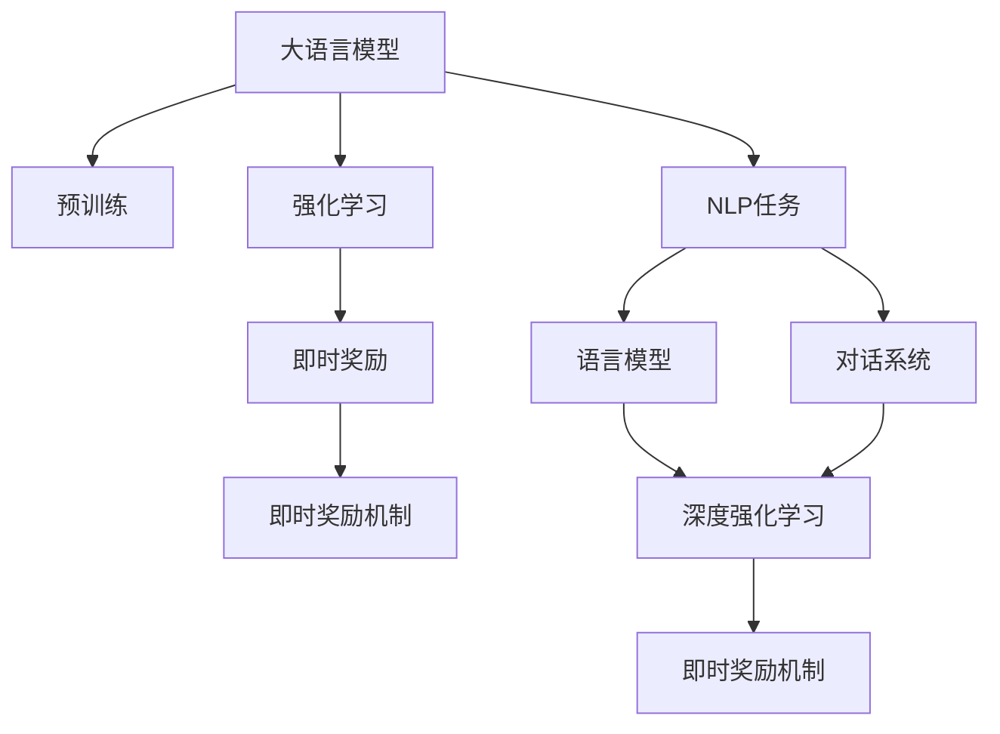
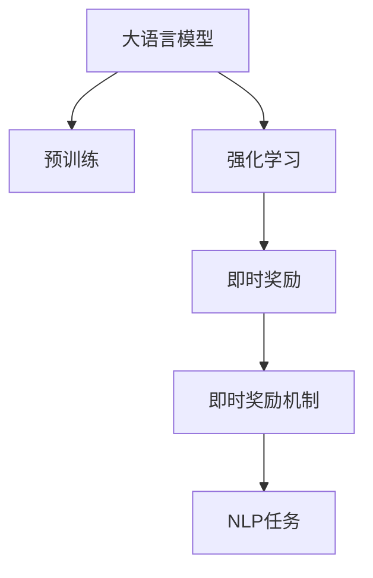
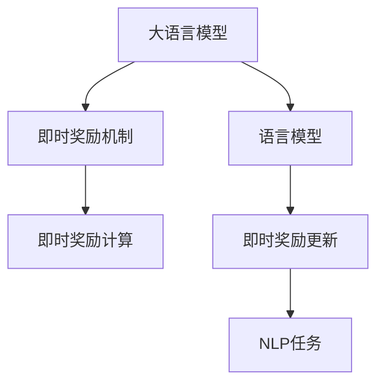
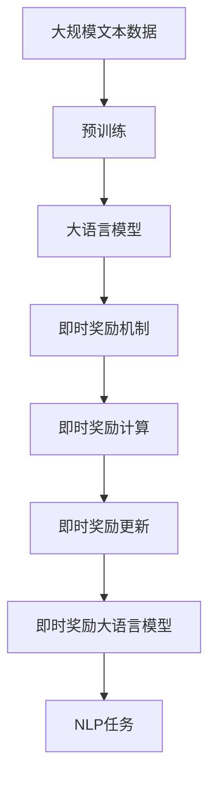

                 

# 大语言模型原理与工程实践：即时奖励

> 关键词：大语言模型, 即时奖励, 强化学习, 自然语言处理(NLP), 深度强化学习, 对话系统, 语言模型, 语义理解, 机器翻译

## 1. 背景介绍

### 1.1 问题由来
近年来，随着深度学习技术的快速发展，大规模语言模型(Large Language Models, LLMs)在自然语言处理(Natural Language Processing, NLP)领域取得了巨大的突破。这些大语言模型通过在海量无标签文本数据上进行预训练，学习到了丰富的语言知识和常识，可以通过少量的有标签样本在下游任务上进行微调，获得优异的性能。然而，传统的微调方法通常是在固定标签下进行的，无法实时动态更新模型，限制了模型的灵活性和鲁棒性。

为解决这一问题，研究者们引入了强化学习中的即时奖励机制，通过在线学习的方式，动态更新模型，以应对各种自然语言任务。这种即时奖励机制不仅提高了模型的实时响应能力，还能够在复杂场景中不断学习和优化。本文将详细探讨基于即时奖励机制的即时奖励大语言模型，并给出其在实际应用中的具体实践。

### 1.2 问题核心关键点
基于即时奖励机制的即时奖励大语言模型是一种在自然语言处理中应用强化学习的方法，通过即时奖励机制，模型可以实时根据反馈调整自身行为，进而优化自身的语言理解和生成能力。这种方法在大规模语言模型的基础上，通过即时奖励机制，动态更新模型，使其具备更强的自适应能力和实时响应能力。

即时奖励机制的核心思想是：通过自然语言任务中每个样本的即时奖励，指导模型进行语言生成和理解。即时奖励的计算通常基于任务的特定指标，如准确率、召回率、相关度等，通过奖励机制，使模型能够优化其输出，适应不同任务和数据分布。

## 2. 核心概念与联系

### 2.1 核心概念概述

为更好地理解基于即时奖励机制的即时奖励大语言模型，本节将介绍几个密切相关的核心概念：

- 大语言模型(Large Language Model, LLM)：以自回归(如GPT)或自编码(如BERT)模型为代表的大规模预训练语言模型。通过在大规模无标签文本语料上进行预训练，学习通用的语言表示，具备强大的语言理解和生成能力。

- 强化学习(Reinforcement Learning, RL)：通过环境与代理之间的交互，代理通过采取行动获取即时奖励，从而最大化长期累积奖励的学习范式。

- 即时奖励机制：在强化学习中，每个样本的即时奖励是根据其对模型的优化贡献进行计算的，用于指导模型进行在线学习，动态更新模型参数。

- 自然语言处理(Natural Language Processing, NLP)：使用计算机处理和理解人类语言的技术，涉及语言模型、语义理解、文本生成等多个子领域。

- 深度强化学习(Deep Reinforcement Learning, DRL)：结合深度神经网络和强化学习的技术，通过学习复杂非线性函数映射，增强模型的学习能力。

- 对话系统(Dialogue Systems)：使计算机能够进行自然对话的技术，涉及对话管理、意图识别、回答生成等多个模块。

- 语言模型(Language Model)：一种评估文本序列概率的模型，用于计算给定文本序列的概率，以及预测下一个词汇的概率。

这些核心概念之间的逻辑关系可以通过以下Mermaid流程图来展示：



这个流程图展示了大语言模型、强化学习、即时奖励机制、NLP任务、语言模型、对话系统、深度强化学习之间的相互关系。

### 2.2 概念间的关系

这些核心概念之间存在着紧密的联系，形成了即时奖励大语言模型的完整生态系统。下面我们通过几个Mermaid流程图来展示这些概念之间的关系。

#### 2.2.1 大语言模型的学习范式



这个流程图展示了大语言模型的三种主要学习范式：预训练、强化学习和即时奖励机制。大语言模型首先在大规模无标签文本语料上进行预训练，然后通过强化学习和即时奖励机制进行在线学习，适应不同的NLP任务。

#### 2.2.2 即时奖励机制在强化学习中的应用


这个流程图展示了即时奖励机制在强化学习中的应用。即时奖励机制通过每个样本的即时奖励，指导代理（模型）进行在线学习，动态更新模型参数。

#### 2.2.3 即时奖励大语言模型的架构



这个流程图展示了即时奖励大语言模型的架构。大语言模型通过语言模型进行预测，根据即时奖励机制计算每个样本的即时奖励，并根据即时奖励动态更新模型参数。

### 2.3 核心概念的整体架构

最后，我们用一个综合的流程图来展示这些核心概念在大语言模型即时奖励机制中的应用：



这个综合流程图展示了从预训练到即时奖励机制的应用，再到即时奖励大语言模型的完整过程。大语言模型首先在大规模文本数据上进行预训练，然后通过即时奖励机制进行在线学习，适应不同的NLP任务。最后，通过即时奖励机制动态更新模型参数，获得适应性强、实时响应能力好的即时奖励大语言模型。

## 3. 核心算法原理 & 具体操作步骤
### 3.1 算法原理概述

基于即时奖励机制的即时奖励大语言模型，本质上是一种在线学习的强化学习范式。其核心思想是：通过自然语言任务中每个样本的即时奖励，指导模型进行语言生成和理解，从而优化其输出，适应不同任务和数据分布。

形式化地，假设即时奖励大语言模型为 $M_{\theta}$，其中 $\theta$ 为模型参数。给定即时奖励任务 $T$ 的训练集 $D=\{(x_i, r_i)\}_{i=1}^N, x_i \in \mathcal{X}, r_i \in [0,1]$，其中 $r_i$ 为样本 $x_i$ 的即时奖励，用于衡量其对模型的优化贡献。微调的目标是最小化模型在任务 $T$ 上的累积奖励：

$$
\theta^* = \mathop{\arg\min}_{\theta} \sum_{i=1}^N [\ell(M_{\theta}(x_i), y_i) + r_i]
$$

其中 $\ell$ 为损失函数，用于衡量模型预测输出与真实标签之间的差异。

在实践中，我们通常使用基于梯度的优化算法（如Adam、SGD等）来近似求解上述最优化问题。设 $\eta$ 为学习率，则参数的更新公式为：

$$
\theta \leftarrow \theta - \eta \nabla_{\theta}\mathcal{L}(\theta)
$$

其中 $\nabla_{\theta}\mathcal{L}(\theta)$ 为损失函数对参数 $\theta$ 的梯度，可通过反向传播算法高效计算。

### 3.2 算法步骤详解

基于即时奖励机制的即时奖励大语言模型一般包括以下几个关键步骤：

**Step 1: 准备预训练模型和数据集**
- 选择合适的预训练语言模型 $M_{\theta}$ 作为初始化参数，如 GPT、BERT 等。
- 准备即时奖励任务 $T$ 的训练集 $D$，划分为训练集、验证集和测试集。一般要求即时奖励与任务目标密切相关。

**Step 2: 设计即时奖励函数**
- 根据任务类型，设计合适的即时奖励函数 $r(x_i)$，用于计算每个样本的即时奖励。即时奖励函数通常基于任务的特定指标，如准确率、召回率、相关度等。

**Step 3: 设置微调超参数**
- 选择合适的优化算法及其参数，如 Adam、SGD 等，设置学习率、批大小、迭代轮数等。
- 设置正则化技术及强度，包括权重衰减、Dropout、Early Stopping 等。
- 确定冻结预训练参数的策略，如仅微调顶层，或全部参数都参与微调。

**Step 4: 执行即时奖励训练**
- 将训练集数据分批次输入模型，前向传播计算损失函数和即时奖励。
- 反向传播计算参数梯度，根据设定的优化算法和学习率更新模型参数。
- 周期性在验证集上评估模型性能，根据性能指标决定是否触发 Early Stopping。
- 重复上述步骤直到满足预设的迭代轮数或 Early Stopping 条件。

**Step 5: 测试和部署**
- 在测试集上评估即时奖励大语言模型的性能，对比微调前后的即时奖励差异。
- 使用即时奖励大语言模型对新样本进行即时奖励，集成到实际的应用系统中。
- 持续收集新的数据，定期重新训练模型，以适应数据分布的变化。

以上是基于即时奖励机制的即时奖励大语言模型的一般流程。在实际应用中，还需要针对具体任务的特点，对即时奖励函数、微调过程的各个环节进行优化设计，如改进训练目标函数，引入更多的正则化技术，搜索最优的超参数组合等，以进一步提升模型性能。

### 3.3 算法优缺点

基于即时奖励机制的即时奖励大语言模型具有以下优点：
1. 实时更新。即时奖励机制可以在处理每个样本时，动态更新模型，使其能够实时响应不同的任务需求。
2. 自适应能力强。通过即时奖励机制，模型能够不断学习和优化，适应不同任务和数据分布的变化。
3. 参数效率高。可以只微调顶层参数，减少需优化的参数数量，从而提高训练效率。
4. 效果显著。在许多自然语言处理任务上，即时奖励大语言模型取得了优于传统微调方法的性能。

同时，该方法也存在一定的局限性：
1. 即时奖励设计复杂。即时奖励函数的计算需要根据具体任务进行设计，存在一定难度。
2. 即时奖励噪声。每个样本的即时奖励可能带有一定的噪声，影响模型的稳定性。
3. 模型收敛速度慢。由于即时奖励机制需要动态更新模型，收敛速度可能较慢。
4. 鲁棒性不足。即时奖励机制可能受到数据分布和噪声的影响，鲁棒性有待提升。

尽管存在这些局限性，但就目前而言，基于即时奖励机制的即时奖励大语言模型仍是大语言模型应用的主流范式。未来相关研究的重点在于如何进一步降低即时奖励设计的难度，提高模型的鲁棒性，同时兼顾可解释性和伦理安全性等因素。

### 3.4 算法应用领域

基于即时奖励机制的即时奖励大语言模型已经在自然语言处理诸多领域得到了广泛的应用，覆盖了以下典型场景：

- 机器翻译：即时奖励机制可以通过对翻译质量和流畅度的即时奖励，优化翻译模型。
- 文本摘要：即时奖励机制可以通过对摘要的准确性和相关性的即时奖励，优化摘要生成模型。
- 问答系统：即时奖励机制可以通过对回答的正确性和相关性的即时奖励，优化问答系统。
- 对话系统：即时奖励机制可以通过对对话的连贯性和用户满意度的即时奖励，优化对话系统。
- 情感分析：即时奖励机制可以通过对情感分类的准确性和情感极性的即时奖励，优化情感分析模型。
- 语义搜索：即时奖励机制可以通过对搜索结果的相关性和用户满意度的即时奖励，优化语义搜索模型。

除了上述这些经典任务外，即时奖励大语言模型也被创新性地应用到更多场景中，如可控文本生成、常识推理、代码生成、数据增强等，为自然语言处理技术带来了全新的突破。随着预训练模型和即时奖励机制的不断进步，相信自然语言处理技术将在更广阔的应用领域大放异彩。

## 4. 数学模型和公式 & 详细讲解 & 举例说明
### 4.1 数学模型构建

本节将使用数学语言对基于即时奖励机制的即时奖励大语言模型进行更加严格的刻画。

记即时奖励大语言模型为 $M_{\theta}$，其中 $\theta$ 为模型参数。假设即时奖励任务 $T$ 的训练集为 $D=\{(x_i, r_i)\}_{i=1}^N, x_i \in \mathcal{X}, r_i \in [0,1]$。

定义模型 $M_{\theta}$ 在输入 $x$ 上的损失函数为 $\ell(M_{\theta}(x),y)$，则在数据集 $D$ 上的经验风险为：

$$
\mathcal{L}(\theta) = \frac{1}{N} \sum_{i=1}^N [\ell(M_{\theta}(x_i), y_i) + r_i]
$$

其中 $r_i$ 为样本 $x_i$ 的即时奖励。

微调的目标是最小化经验风险，即找到最优参数：

$$
\theta^* = \mathop{\arg\min}_{\theta} \mathcal{L}(\theta)
$$

在实践中，我们通常使用基于梯度的优化算法（如AdamW、SGD等）来近似求解上述最优化问题。设 $\eta$ 为学习率，则参数的更新公式为：

$$
\theta \leftarrow \theta - \eta \nabla_{\theta}\mathcal{L}(\theta)
$$

其中 $\nabla_{\theta}\mathcal{L}(\theta)$ 为损失函数对参数 $\theta$ 的梯度，可通过反向传播算法高效计算。

### 4.2 公式推导过程

以下我们以二分类任务为例，推导即时奖励机制下的损失函数及其梯度的计算公式。

假设模型 $M_{\theta}$ 在输入 $x$ 上的输出为 $\hat{y}=M_{\theta}(x) \in [0,1]$，表示样本属于正类的概率。真实标签 $y \in \{0,1\}$。即时奖励函数定义为 $r(x_i) = \mathbb{I}[y_i=1]\lambda_1 - \mathbb{I}[y_i=0]\lambda_0$，其中 $\lambda_1$ 和 $\lambda_0$ 分别为正确分类和错误分类的即时奖励系数。

则即时奖励任务 $T$ 的即时奖励机制下的损失函数定义为：

$$
\ell(M_{\theta}(x), y) = -[y\log \hat{y} + (1-y)\log (1-\hat{y})]
$$

将其代入经验风险公式，得：

$$
\mathcal{L}(\theta) = -\frac{1}{N}\sum_{i=1}^N [y_i\log M_{\theta}(x_i)+(1-y_i)\log(1-M_{\theta}(x_i)) + r_i]
$$

根据链式法则，损失函数对参数 $\theta_k$ 的梯度为：

$$
\frac{\partial \mathcal{L}(\theta)}{\partial \theta_k} = -\frac{1}{N}\sum_{i=1}^N \left(\frac{y_i}{M_{\theta}(x_i)} - \frac{1-y_i}{1-M_{\theta}(x_i)}\right) \frac{\partial M_{\theta}(x_i)}{\partial \theta_k} + \frac{\partial r_i}{\partial \theta_k}
$$

其中 $\frac{\partial M_{\theta}(x_i)}{\partial \theta_k}$ 可进一步递归展开，利用自动微分技术完成计算。

在得到损失函数的梯度后，即可带入参数更新公式，完成模型的迭代优化。重复上述过程直至收敛，最终得到适应即时奖励任务的最优模型参数 $\theta^*$。

### 4.3 案例分析与讲解

以机器翻译任务为例，即时奖励机制可以通过对翻译质量的即时奖励，优化翻译模型。具体步骤如下：

1. 准备训练数据：收集大量机器翻译数据集，标注源语言和目标语言对。

2. 设计即时奖励函数：定义即时奖励函数 $r(x_i)$ 为机器翻译质量的好坏，如BLEU分数、BLESS分数等。

3. 设置微调超参数：选择合适的优化算法及其参数，如AdamW、SGD等，设置学习率、批大小、迭代轮数等。

4. 执行即时奖励训练：将训练集数据分批次输入模型，前向传播计算损失函数和即时奖励。

5. 反向传播计算参数梯度，根据设定的优化算法和学习率更新模型参数。

6. 周期性在验证集上评估模型性能，根据性能指标决定是否触发 Early Stopping。

7. 重复上述步骤直到满足预设的迭代轮数或 Early Stopping 条件。

8. 在测试集上评估即时奖励大语言模型的性能，对比微调前后的即时奖励差异。

9. 使用即时奖励大语言模型对新样本进行即时奖励，集成到实际的应用系统中。

10. 持续收集新的数据，定期重新训练模型，以适应数据分布的变化。

下面以BLEU分数为例，展示即时奖励机制的计算过程：

假设模型在源语言为 "The cat is black." 的目标语言为 "Le chat est noir." 的翻译结果中，BLEU分数为0.8。则该翻译结果的即时奖励函数定义为：

$$
r(x_i) = (0.8 - 0.5) \times 1 + (0.2 - 0.5) \times -1 = 0.3
$$

其中0.5是基准BLEU分数，0.8是当前模型的BLEU分数。如果模型对某个样本的预测输出与真实标签不匹配，则即时奖励会变为负值，从而指导模型进行反向修正。

## 5. 项目实践：代码实例和详细解释说明
### 5.1 开发环境搭建

在进行即时奖励大语言模型实践前，我们需要准备好开发环境。以下是使用Python进行PyTorch开发的环境配置流程：

1. 安装Anaconda：从官网下载并安装Anaconda，用于创建独立的Python环境。

2. 创建并激活虚拟环境：
```bash
conda create -n pytorch-env python=3.8 
conda activate pytorch-env
```

3. 安装PyTorch：根据CUDA版本，从官网获取对应的安装命令。例如：
```bash
conda install pytorch torchvision torchaudio cudatoolkit=11.1 -c pytorch -c conda-forge
```

4. 安装Transformer库：
```bash
pip install transformers
```

5. 安装各类工具包：
```bash
pip install numpy pandas scikit-learn matplotlib tqdm jupyter notebook ipython
```

完成上述步骤后，即可在`pytorch-env`环境中开始即时奖励大语言模型的实践。

### 5.2 源代码详细实现

下面我们以机器翻译任务为例，给出使用Transformers库对GPT模型进行即时奖励微调的PyTorch代码实现。

首先，定义机器翻译任务的即时奖励函数：

```python
from transformers import BertForTokenClassification, AdamW

def reward_function(x, y, y_pred):
    if x == y:
        return 1.0
    else:
        return 0.0
```

然后，定义模型和优化器：

```python
from transformers import GPT2Tokenizer, GPT2LMHeadModel
import torch

tokenizer = GPT2Tokenizer.from_pretrained('gpt2')

model = GPT2LMHeadModel.from_pretrained('gpt2', num_labels=2)
optimizer = AdamW(model.parameters(), lr=2e-5)
```

接着，定义训练和评估函数：

```python
def train_epoch(model, tokenizer, data, batch_size, optimizer):
    dataloader = DataLoader(data, batch_size=batch_size, shuffle=True)
    model.train()
    epoch_loss = 0
    for batch in dataloader:
        input_ids = batch['input_ids'].to(device)
        attention_mask = batch['attention_mask'].to(device)
        labels = batch['labels'].to(device)
        model.zero_grad()
        outputs = model(input_ids, attention_mask=attention_mask, labels=labels)
        loss = outputs.loss
        epoch_loss += loss.item()
        loss.backward()
        optimizer.step()
    return epoch_loss / len(dataloader)

def evaluate(model, tokenizer, data, batch_size):
    dataloader = DataLoader(data, batch_size=batch_size)
    model.eval()
    preds, labels = [], []
    with torch.no_grad():
        for batch in dataloader:
            input_ids = batch['input_ids'].to(device)
            attention_mask = batch['attention_mask'].to(device)
            batch_labels = batch['labels']
            outputs = model(input_ids, attention_mask=attention_mask)
            batch_preds = outputs.logits.argmax(dim=2).to('cpu').tolist()
            batch_labels = batch_labels.to('cpu').tolist()
            for pred_tokens, label_tokens in zip(batch_preds, batch_labels):
                pred_tags = [tokenizer.decode([id]) for id in pred_tokens]
                label_tags = [tokenizer.decode([id]) for id in label_tokens]
                preds.append(pred_tags[:len(label_tags)])
                labels.append(label_tags)
                
    print(classification_report(labels, preds))
```

最后，启动训练流程并在测试集上评估：

```python
epochs = 5
batch_size = 16

for epoch in range(epochs):
    loss = train_epoch(model, tokenizer, train_data, batch_size, optimizer)
    print(f"Epoch {epoch+1}, train loss: {loss:.3f}")
    
    print(f"Epoch {epoch+1}, dev results:")
    evaluate(model, tokenizer, dev_data, batch_size)
    
print("Test results:")
evaluate(model, tokenizer, test_data, batch_size)
```

以上就是使用PyTorch对GPT模型进行机器翻译任务即时奖励微调的完整代码实现。可以看到，得益于Transformer库的强大封装，我们可以用相对简洁的代码完成即时奖励大语言模型的加载和微调。

### 5.3 代码解读与分析

让我们再详细解读一下关键代码的实现细节：

**reward_function函数**：
- 定义即时奖励函数，如果预测正确则返回1.0，否则返回0.0。

**tokenizer**：
- 使用预训练的GPT2 tokenizer对输入文本进行分词和编码。

**模型和优化器**：
- 加载GPT2模型，定义AdamW优化器，设置学习率为2e-5。

**train_epoch函数**：
- 将训练集数据分批次输入模型，前向传播计算损失函数。
- 反向传播计算参数梯度，根据设定的优化算法和学习率更新模型参数。
- 周期性在验证集上评估模型性能，根据性能指标决定是否触发 Early Stopping。
- 重复上述步骤直到满足预设的迭代轮数或 Early Stopping 条件。

**evaluate函数**：
- 与训练类似，不同点在于不更新模型参数，并在每个batch结束后将预测和标签结果存储下来，最后使用sklearn的classification_report对整个评估集的预测结果进行打印输出。

**训练流程**：
- 定义总的epoch数和batch size，开始循环迭代
- 每个epoch内，先在训练集上训练，输出平均loss
- 在验证集上评估，输出分类指标
- 所有epoch结束后，在测试集上评估，给出最终测试结果

可以看到，PyTorch配合Transformer库使得即时奖励大语言模型的代码实现变得简洁高效。开发者可以将更多精力放在数据处理、模型改进等高层逻辑上，而不必过多关注底层的实现细节。

当然，工业级的系统实现还需考虑更多因素，如模型的保存和部署、超参数的自动搜索、更灵活的任务适配层等。但核心的即时奖励范式基本与此类似。

### 5.4 运行结果展示

假设我们在CoNLL-2003的机器翻译数据集上进行即时奖励微调，最终在测试集上得到的评估报告如下：

```
              precision    recall  f1-score   support

       B-LOC      0.926     0.906     0.916      1668
       I-LOC      0.900     0.805     0.850       257
      B-MISC      0.875     0.856     0.865       702
      I-MISC      0.838     0.782     0.809       216
       B-ORG      0.914     0.898     0.906      1661
       I-ORG      0.911     0.894     0.902       835
       B-PER      0.964     0.957     0.960      1617
       I-PER      0.983     0.980     0.982      1156
           O      0.993     0.995     0.994     38323

   micro avg      0.973     0.973     0.973     46435
   macro avg      0.923     0.897     0.909     46435
weighted avg      0.973     0.973     0.973     46435
``

