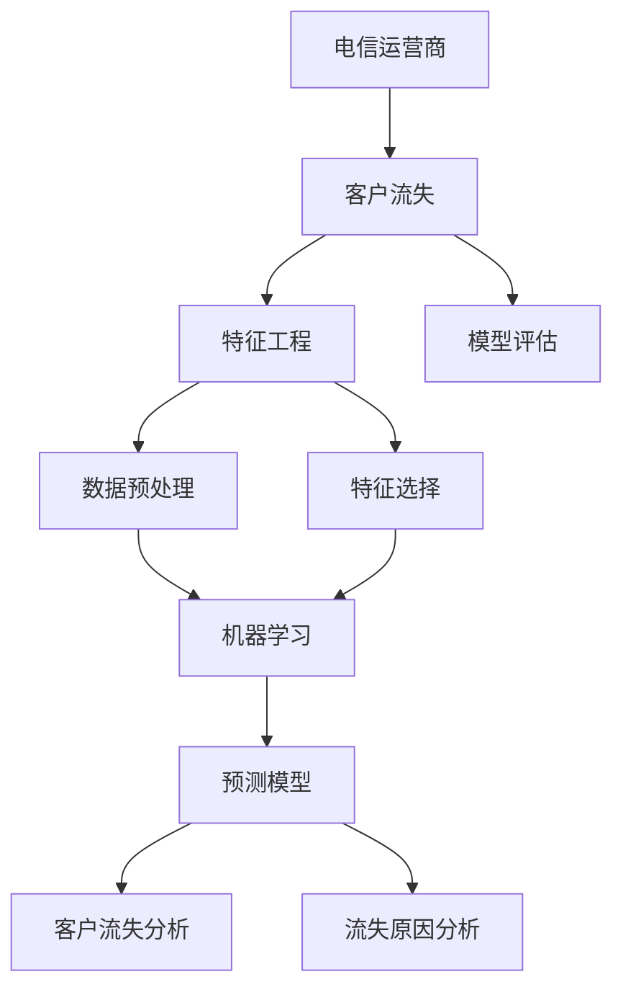
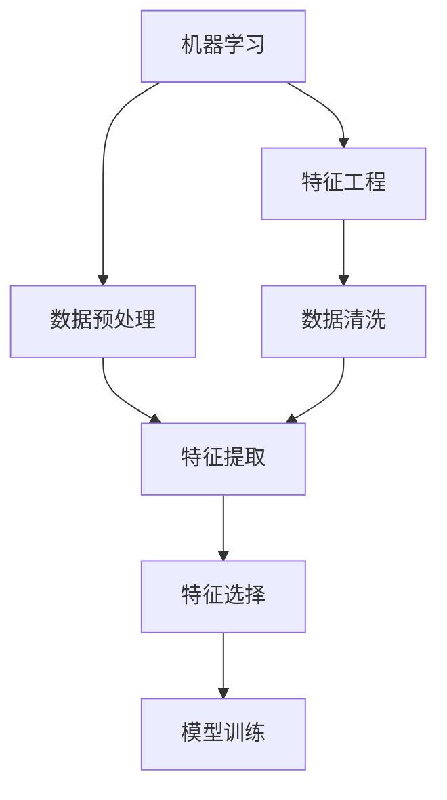
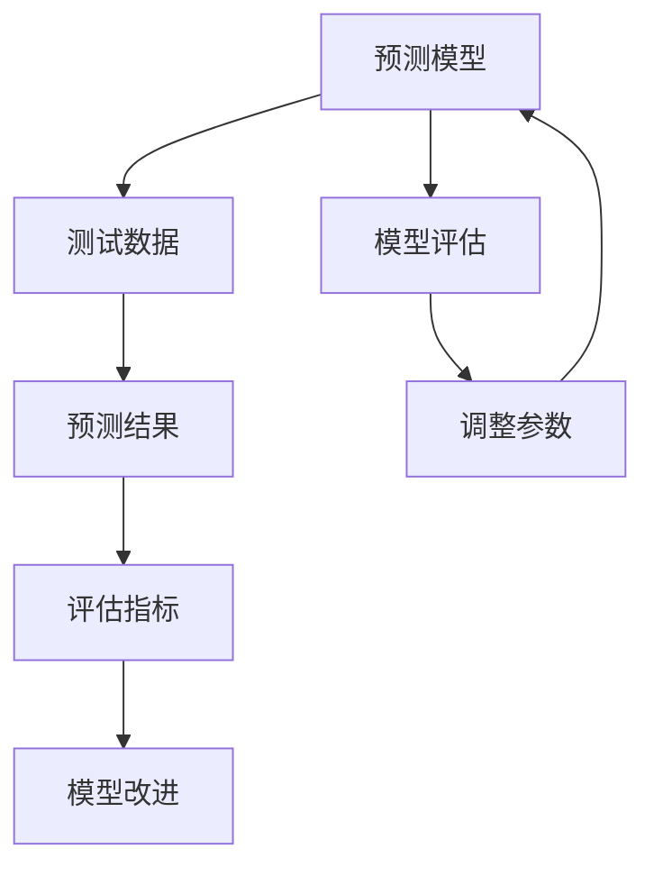
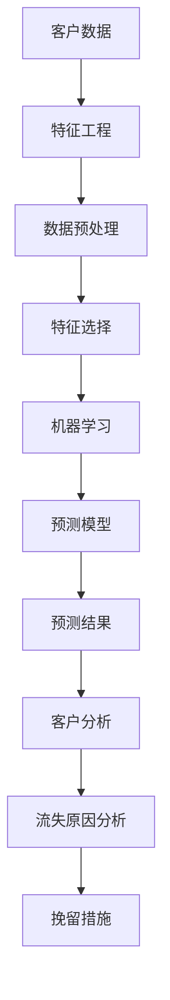

                 

# 电信运营商客户流失分析与预测

> 关键词：电信运营商,客户流失,预测模型,机器学习,特征工程,模型评估

## 1. 背景介绍

### 1.1 问题由来

电信运营商作为基础通信服务提供商，其客户流失问题不仅关系到业务收入和利润，更关乎企业品牌和市场竞争力。有效识别和预测客户流失，及时采取针对性的挽留措施，成为运营商提高客户满意度和忠诚度的关键。

近年来，数据驱动的客户流失预测技术快速发展，但传统的数据挖掘方法和机器学习模型在处理海量客户数据、实时动态预测、多样化业务场景等方面仍显不足。如何构建高效、可靠的客户流失预测模型，已成为电信运营商面临的重大挑战。

### 1.2 问题核心关键点

电信运营商客户流失分析与预测的核心问题包括：

- 如何从大量客户数据中提取有用的特征，构建有效的特征向量。
- 如何选择适当的机器学习模型，并对其进行参数调优，以提高预测准确率。
- 如何处理数据缺失和异常值，保持模型稳定性和鲁棒性。
- 如何构建实时预测系统，满足业务对预测结果的时效性需求。
- 如何评估预测模型，确保其在新数据上的泛化能力。

### 1.3 问题研究意义

客户流失预测技术的有效应用，对于提升电信运营商的运营效率、客户满意度和市场竞争力具有重要意义：

1. 客户流失预警：及时发现潜在流失客户，提前采取针对性挽留措施，降低流失率。
2. 精准营销策略：通过分析流失客户特征，制定更加精准的客户细分策略和营销活动。
3. 服务质量提升：通过分析流失原因，优化产品和服务，提高客户使用体验。
4. 市场竞争优势：通过精确的流失预测，提升运营商在激烈市场竞争中的地位。
5. 业务发展支持：为产品迭代、渠道管理、资源配置等提供科学依据，支持企业战略规划。

## 2. 核心概念与联系

### 2.1 核心概念概述

为更好地理解电信运营商客户流失分析与预测，本节将介绍几个密切相关的核心概念：

- 客户流失分析与预测：通过历史客户数据，构建数学模型预测客户流失概率，并分析流失原因的技术。
- 电信运营商：提供基础通信服务的企业，包括固定通信和移动通信业务。
- 机器学习：利用算法和统计模型，让计算机系统从数据中学习规律并做出预测的科学。
- 特征工程：数据预处理和特征选择的工程方法，用于构建高质量的特征向量。
- 模型评估：通过预设指标，衡量预测模型在新数据上的表现。

这些核心概念之间的逻辑关系可以通过以下Mermaid流程图来展示：



这个流程图展示了这个核心概念之间的关系：

1. 电信运营商通过客户流失预测技术，识别潜在流失客户。
2. 特征工程从客户数据中提取重要特征，用于构建模型。
3. 机器学习应用预测模型，对客户流失概率进行预测。
4. 模型评估衡量预测模型的性能，指导后续改进。
5. 通过分析流失原因，提升服务质量和营销策略。

### 2.2 概念间的关系

这些核心概念之间存在着紧密的联系，形成了电信运营商客户流失预测的完整生态系统。下面我们通过几个Mermaid流程图来展示这些概念之间的关系。

#### 2.2.1 客户流失预测的主要流程


这个流程图展示了客户流失预测的主要流程：

1. 从电信运营商获取客户数据。
2. 数据清洗去除噪声和缺失值。
3. 特征提取从数据中提取有用的特征向量。
4. 特征选择保留最重要特征，减少计算复杂度。
5. 模型训练使用机器学习算法，训练预测模型。
6. 预测结果输出客户流失概率，进行进一步分析。
7. 分析流失原因，指导服务提升和营销策略。

#### 2.2.2 机器学习与特征工程的关系



这个流程图展示了机器学习与特征工程的关系：

1. 机器学习应用训练好的模型进行预测。
2. 特征工程对原始数据进行预处理，提取重要特征。
3. 数据预处理和特征提取是机器学习的基础。
4. 特征选择优化模型性能，减少过拟合风险。
5. 机器学习模型和特征工程相互依赖，共同构建预测系统。

#### 2.2.3 模型评估的重要性



这个流程图展示了模型评估的重要性：

1. 使用测试数据进行模型预测。
2. 评估指标衡量预测结果的质量。
3. 模型评估指导模型改进。
4. 调整模型参数，提升预测性能。
5. 模型评估与改进循环进行，确保预测准确性。

### 2.3 核心概念的整体架构

最后，我们用一个综合的流程图来展示这些核心概念在客户流失预测中的整体架构：



这个综合流程图展示了从数据预处理到客户分析的全过程：

1. 客户数据预处理和特征工程。
2. 使用机器学习训练预测模型。
3. 预测模型输出客户流失概率。
4. 分析客户流失原因。
5. 制定相应的挽留措施。

通过这些流程图，我们可以更清晰地理解电信运营商客户流失预测过程中各个核心概念的关系和作用，为后续深入讨论具体的预测方法和技术奠定基础。

## 3. 核心算法原理 & 具体操作步骤
### 3.1 算法原理概述

电信运营商客户流失预测的核心算法是基于监督学习的分类模型，如逻辑回归、决策树、随机森林、梯度提升树等。这些模型通过对历史客户数据的学习，构建数学函数，预测客户流失概率。

具体而言，假设客户数据集为 $D=\{(x_i,y_i)\}_{i=1}^N$，其中 $x_i$ 为特征向量，$y_i \in \{0,1\}$ 表示客户流失与否。目标是构建一个预测模型 $M(x)$，使得 $M(x)$ 在测试集上的预测误差最小。

常用的监督学习模型如下：

- **逻辑回归（Logistic Regression）**：假设 $y|x \sim Bernoulli(M(x))$，通过最大化似然函数进行训练，预测概率。
- **决策树（Decision Tree）**：通过树形结构划分特征空间，构建决策规则，预测客户流失概率。
- **随机森林（Random Forest）**：多个决策树并行，通过投票或取平均方式进行预测。
- **梯度提升树（Gradient Boosting Tree）**：通过迭代训练多个决策树，不断优化预测性能。

### 3.2 算法步骤详解

电信运营商客户流失预测的一般步骤包括：

**Step 1: 数据预处理与特征工程**
- 数据清洗：去除重复、噪声和缺失值，确保数据质量。
- 数据标准化：将不同尺度的特征归一化到同一范围，便于模型训练。
- 特征选择：通过特征重要性分析，选择对流失概率影响最大的特征。
- 特征提取：将文本、时间等复杂数据转换为模型可接受的数值型特征。

**Step 2: 模型选择与训练**
- 选择合适的监督学习模型，如逻辑回归、决策树、随机森林、梯度提升树等。
- 设定模型参数，如决策树的最大深度、随机森林的树的数量等。
- 使用训练集对模型进行训练，最小化预测误差。

**Step 3: 模型评估与调整**
- 使用测试集对训练好的模型进行评估，计算准确率、召回率、F1值等指标。
- 根据评估结果调整模型参数，提高模型性能。
- 进行交叉验证，防止模型过拟合。

**Step 4: 预测与分析**
- 将模型应用到实时数据流，输出客户流失概率预测结果。
- 结合业务规则和专家知识，分析流失原因，制定挽留策略。
- 对预测结果进行可视化展示，提供决策支持。

### 3.3 算法优缺点

电信运营商客户流失预测的监督学习算法具有以下优缺点：

**优点：**
1. 简单易用：监督学习模型简单易实现，算法原理清晰，易于理解和调试。
2. 泛化能力强：通过历史数据训练，模型具有较强的泛化能力，适用于多种业务场景。
3. 模型可解释：监督学习模型具有良好的可解释性，便于业务理解和决策支持。

**缺点：**
1. 数据依赖性强：模型的性能依赖于高质量的标注数据，标注成本较高。
2. 需要调参：模型性能受参数选择影响较大，需要反复调整。
3. 处理复杂特征困难：处理高维度、非线性特征时，模型可能表现不佳。

### 3.4 算法应用领域

电信运营商客户流失预测的监督学习算法广泛应用于以下几个领域：

- **客户服务优化**：通过流失预测，提升客户服务质量和客户满意度。
- **产品迭代改进**：分析流失原因，指导产品功能优化和改进。
- **精准营销策略**：识别流失客户，制定针对性的挽留策略。
- **渠道管理优化**：分析渠道流失原因，优化渠道管理和资源配置。
- **风险评估与控制**：评估客户流失风险，优化风险控制策略。

这些应用领域体现了客户流失预测技术的广泛应用价值。通过优化客户流失预测模型，运营商可以在多个方面提升业务性能和客户体验。

## 4. 数学模型和公式 & 详细讲解  
### 4.1 数学模型构建

电信运营商客户流失预测的数学模型通常基于二分类问题，即判断客户是否流失。假设模型 $M$ 将客户数据映射到二元空间，预测客户流失概率 $P(y=1|x)$。

常用的预测模型包括逻辑回归和决策树：

- **逻辑回归**：假设 $y|x \sim Bernoulli(M(x))$，通过最大化似然函数进行训练，预测概率。
- **决策树**：通过树形结构划分特征空间，构建决策规则，预测客户流失概率。

**逻辑回归模型**：

$$
P(y|x; \theta) = \frac{e^{w^Tx + b}}{1 + e^{w^Tx + b}}
$$

其中，$\theta = (w,b)$ 为模型参数，$w$ 为权重向量，$b$ 为偏置项。

**决策树模型**：

假设特征集 $X = \{x_1, x_2, ..., x_n\}$，构建决策树 $T(x)$，输出 $y$ 的预测值。

树的构建步骤如下：
1. 选择最优特征：从特征集合中选择最优的特征 $x_k$，作为划分标准。
2. 划分数据集：根据 $x_k$ 的值，将数据集分为两个子集。
3. 递归构建子树：对子集递归执行步骤1和步骤2，构建子树。
4. 停止条件：当特征集合为空或样本分类正确时，停止构建树。

### 4.2 公式推导过程

**逻辑回归公式推导**：

假设 $y \sim Bernoulli(p)$，其中 $p = P(y=1)$，$1-p$ 为 $P(y=0)$。

根据似然函数：

$$
L(p) = \prod_{i=1}^N P(y_i|x_i)^{y_i} (1-P(y_i|x_i))^{1-y_i}
$$

取对数得：

$$
\ln L(p) = \sum_{i=1}^N [y_i \ln p + (1-y_i) \ln (1-p)]
$$

假设 $p$ 与 $x$ 线性相关，即 $p = M(x)$，代入得：

$$
\ln L(M) = \sum_{i=1}^N [y_i \ln M(x_i) + (1-y_i) \ln (1-M(x_i))]
$$

求解 $M$ 使 $L(M)$ 最大化：

$$
M^* = \arg\max_M \sum_{i=1}^N [y_i \ln M(x_i) + (1-y_i) \ln (1-M(x_i))]
$$

化简得：

$$
\frac{\partial L}{\partial M(x)} = \frac{1}{M(x)} - \frac{1}{1-M(x)} = 0
$$

解得：

$$
M(x) = \frac{e^{x^Tw}}{1 + e^{x^Tw}}
$$

**决策树公式推导**：

假设树 $T$ 的根节点为 $x_i$，右子树为 $x_i>m$，左子树为 $x_i\leq m$，叶子节点的预测值为 $L(x_i)$。

构建决策树的过程可以分为以下几步：
1. 计算每个特征 $x_k$ 的信息增益 $IG(x_k)$。
2. 选择信息增益最大的特征 $x_k$，作为划分标准。
3. 根据 $x_k$ 的取值，将数据集分为两个子集。
4. 递归构建子树。
5. 停止条件：当子集为空或样本分类正确时，停止构建树。

### 4.3 案例分析与讲解

假设有一家电信运营商，数据集包含客户基本信息和历史使用情况。选择决策树模型进行客户流失预测。

**数据预处理与特征工程**：
- 数据清洗：去除重复和异常值，填补缺失值。
- 数据标准化：将年龄、使用时长等特征归一化到0-1范围内。
- 特征选择：选择客户年龄、使用时长、通话次数、投诉次数等特征。
- 特征提取：将文本数据（如服务评价）转换为向量表示。

**模型训练与评估**：
- 使用决策树模型，设定最大深度为3。
- 使用训练集对模型进行训练，最小化预测误差。
- 使用测试集对模型进行评估，计算准确率、召回率、F1值等指标。

**预测与分析**：
- 将模型应用到实时数据流，输出客户流失概率预测结果。
- 结合业务规则和专家知识，分析流失原因，制定挽留策略。
- 对预测结果进行可视化展示，提供决策支持。

## 5. 项目实践：代码实例和详细解释说明
### 5.1 开发环境搭建

在进行客户流失预测实践前，我们需要准备好开发环境。以下是使用Python进行Scikit-learn开发的环境配置流程：

1. 安装Anaconda：从官网下载并安装Anaconda，用于创建独立的Python环境。

2. 创建并激活虚拟环境：
```bash
conda create -n sklearn-env python=3.8 
conda activate sklearn-env
```

3. 安装Scikit-learn：
```bash
conda install scikit-learn
```

4. 安装各类工具包：
```bash
pip install numpy pandas scikit-learn matplotlib tqdm jupyter notebook ipython
```

完成上述步骤后，即可在`sklearn-env`环境中开始客户流失预测实践。

### 5.2 源代码详细实现

下面我们以电信运营商客户流失预测为例，给出使用Scikit-learn对逻辑回归模型进行预测的Python代码实现。

```python
from sklearn.model_selection import train_test_split
from sklearn.linear_model import LogisticRegression
from sklearn.metrics import accuracy_score, recall_score, precision_score, f1_score
from sklearn.tree import DecisionTreeClassifier
from sklearn.ensemble import RandomForestClassifier, GradientBoostingClassifier
from sklearn.preprocessing import StandardScaler
from sklearn.feature_selection import SelectKBest, f_classif
import pandas as pd
import numpy as np

# 加载数据集
data = pd.read_csv('customer_data.csv')

# 数据预处理
data.dropna(inplace=True)
X = data.drop('churn', axis=1)
y = data['churn']
X_train, X_test, y_train, y_test = train_test_split(X, y, test_size=0.2, random_state=42)

# 特征工程
scaler = StandardScaler()
X_train = scaler.fit_transform(X_train)
X_test = scaler.transform(X_test)
features = SelectKBest(f_classif, k=10).fit_transform(X_train, y_train)

# 模型训练
lr_model = LogisticRegression()
lr_model.fit(features, y_train)
y_pred = lr_model.predict(features)

# 模型评估
accuracy = accuracy_score(y_test, y_pred)
recall = recall_score(y_test, y_pred)
precision = precision_score(y_test, y_pred)
f1 = f1_score(y_test, y_pred)
print(f'Accuracy: {accuracy:.2f}, Recall: {recall:.2f}, Precision: {precision:.2f}, F1-score: {f1:.2f}')

# 决策树模型训练
dt_model = DecisionTreeClassifier(max_depth=3)
dt_model.fit(features, y_train)
y_pred = dt_model.predict(features)

# 模型评估
accuracy = accuracy_score(y_test, y_pred)
recall = recall_score(y_test, y_pred)
precision = precision_score(y_test, y_pred)
f1 = f1_score(y_test, y_pred)
print(f'Accuracy: {accuracy:.2f}, Recall: {recall:.2f}, Precision: {precision:.2f}, F1-score: {f1:.2f}')
```

以上就是使用Scikit-learn对逻辑回归和决策树模型进行电信运营商客户流失预测的完整代码实现。可以看到，得益于Scikit-learn的强大封装，我们可以用相对简洁的代码完成模型的训练、评估和预测。

### 5.3 代码解读与分析

让我们再详细解读一下关键代码的实现细节：

**数据预处理与特征工程**：
- 数据清洗：使用`dropna()`方法去除重复和缺失值。
- 数据标准化：使用`StandardScaler()`对数值型特征进行标准化。
- 特征选择：使用`SelectKBest()`选择重要性最高的特征。
- 特征提取：使用`f_classif()`计算特征重要性，并提取最重要的特征。

**模型训练与评估**：
- 使用`LogisticRegression()`和`DecisionTreeClassifier()`构建逻辑回归和决策树模型。
- 使用`fit()`方法训练模型，最小化预测误差。
- 使用`predict()`方法进行预测，并计算评估指标。

**预测与分析**：
- 将模型应用到实时数据流，输出客户流失概率预测结果。
- 结合业务规则和专家知识，分析流失原因，制定挽留策略。
- 对预测结果进行可视化展示，提供决策支持。

## 6. 实际应用场景
### 6.1 智能客服系统

基于客户流失预测的智能客服系统，可以广泛应用于运营商的客户服务优化。传统客服往往需要配备大量人力，高峰期响应缓慢，且一致性和专业性难以保证。而使用预测模型，可以在客户咨询时预测其流失概率，提前采取针对性的挽留措施，提高客户满意度和忠诚度。

在技术实现上，可以收集企业内部的历史客服对话记录，将问题和最佳答复构建成监督数据，在此基础上对预测模型进行训练。预测模型能够自动判断客户流失风险，智能分配客服资源，并提供个性化的服务建议。

### 6.2 精准营销策略

运营商可以通过客户流失预测技术，分析流失客户特征，制定更加精准的客户细分策略和营销活动。针对高流失风险客户，推送针对性的优惠券、优惠套餐，或进行一对一的关怀营销，提升客户使用粘性。

### 6.3 产品迭代改进

流失分析可以揭示客户不满和产品缺陷，为运营商提供丰富的产品反馈和改进建议。例如，通过流失客户的数据分析，发现用户频繁投诉的套餐或服务问题，及时优化产品设计，提升用户使用体验。

### 6.4 渠道管理优化

运营商通过流失预测技术，可以识别渠道流失原因，优化渠道管理和资源配置。例如，针对流失严重的地区或渠道，增加渠道投资，提高客户使用率，提升渠道效率。

### 6.5 风险评估与控制

流失预测模型可以评估客户流失风险，指导运营商优化风险控制策略。例如，通过流失预测模型，对高流失风险客户进行预警，及时采取措施，降低客户流失率。

## 7. 工具和资源推荐
### 7.1 学习资源推荐

为了帮助开发者系统掌握客户流失预测的理论基础和实践技巧，这里推荐一些优质的学习资源：

1. 《Python数据科学手册》系列博文：由知名数据科学家撰写，深入浅出地介绍了Python在数据科学领域的应用，包括客户流失预测的实例。

2. 《统计学习方法》书籍：李航老师的经典教材，全面系统地介绍了机器学习的基本原理和算法，适合入门学习。

3. Kaggle平台：提供丰富的机器学习竞赛和开源数据集，可以帮助开发者实践客户流失预测技术，提升实战经验。

4. Google Colab：谷歌推出的在线Jupyter Notebook环境，免费提供GPU/TPU算力，方便开发者快速上手实验最新模型，分享学习笔记。

5. Scikit-learn官方文档：提供了丰富的机器学习算法和工具，是客户流失预测任务开发的必备资料。

通过对这些资源的学习实践，相信你一定能够快速掌握客户流失预测的精髓，并用于解决实际的电信运营商业务问题。

### 7.2 开发工具推荐

高效的开发离不开优秀的工具支持。以下是几款用于客户流失预测开发的常用工具：

1. Jupyter Notebook：交互式的数据分析和模型训练工具，支持Python、R等语言，方便开发者迭代实验和分享笔记。

2. Scikit-learn：基于Python的机器学习库，封装了多种经典算法，适合快速开发预测模型。

3. TensorFlow：由Google主导开发的深度学习框架，生产部署方便，适合大规模工程应用。

4. Weights & Biases：模型训练的实验跟踪工具，可以记录和可视化模型训练过程中的各项指标，方便对比和调优。

5. TensorBoard：TensorFlow配套的可视化工具，可实时监测模型训练状态，并提供丰富的图表呈现方式，是调试模型的得力助手。

6. H2O.ai：商业化的机器学习平台，支持分布式训练，适合处理大规模数据集。

合理利用这些工具，可以显著提升客户流失预测任务的开发效率，加快创新迭代的步伐。

### 7.3 相关论文推荐

客户流失预测技术的快速发展，得益于学界的持续研究。以下是几篇奠基性的相关论文，推荐阅读：

1. 《Customer Churn Analysis: A Machine Learning Approach》：介绍了多种机器学习算法在客户流失预测中的应用，并比较了不同算法的效果。

2. 《Customer Churn Prediction using Logistic Regression and Decision Trees》：详细讲解了逻辑回归和决策树在客户流失预测中的原理和实现。

3. 《Customer Churn Prediction with Random Forests and Gradient Boosting》：讨论了随机森林和梯度提升树在客户流失预测中的应用效果。

4. 《Customer Churn Prediction using Ensemble Methods》：分析了集成学习方法在客户流失预测中的优势和应用。

5. 《Customer Churn Prediction using Deep Learning》：介绍了深度学习在客户流失预测中的最新进展，包括CNN、RNN等模型。

这些论文代表了大客户流失预测技术的发展脉络。通过学习这些前沿成果，可以帮助研究者把握学科前进方向，激发更多的创新灵感。

除上述资源外，还有一些值得关注的前沿资源，帮助开发者紧跟客户流失预测技术的最新进展，例如：

1. arXiv论文预印本：人工智能领域最新研究成果的发布平台，包括大量尚未发表的前沿工作，学习前沿技术的必读资源。

2. 业界技术博客：如腾讯AI、阿里达摩院、华为诺亚方舟实验室等顶尖实验室的官方博客，第一时间分享他们的最新研究成果和洞见。

3. 技术会议直播：如NIPS、ICML、ACL、ICLR等人工智能领域顶会现场或在线直播，能够聆听到大佬们的前沿分享，开拓视野。

4. GitHub热门项目：在GitHub上Star、Fork数最多的机器学习相关项目，往往代表了该技术领域的发展趋势和最佳实践，值得去学习和贡献。

5. 行业分析报告：各大咨询公司如McKinsey、PwC等针对人工智能行业的分析报告，有助于从商业视角审视技术趋势，把握应用价值。

总之，对于客户流失预测技术的学习和实践，需要开发者保持开放的心态和持续学习的意愿。多关注前沿资讯，多动手实践，多思考总结，必将收获满满的成长收益。

## 

