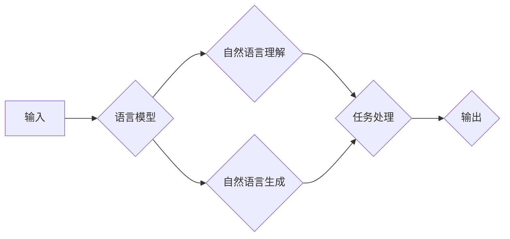

# 【大模型应用开发 动手做AI Agent】思维树

> 关键词：大模型，应用开发，AI Agent，思维树，深度学习，自然语言处理，对话系统，推荐系统

## 1. 背景介绍

随着人工智能技术的快速发展，大模型（Large Language Model, LLM）在自然语言处理（Natural Language Processing, NLP）、计算机视觉（Computer Vision, CV）等领域取得了显著成果。大模型通过在海量数据上预训练，能够学习到丰富的知识，并在特定任务上进行微调（Fine-Tuning），实现强大的智能能力。本文将探讨如何利用大模型进行应用开发，构建AI Agent，并构建一个思维树，帮助开发者更好地理解和应用大模型技术。

## 2. 核心概念与联系

### 2.1 核心概念

- **大模型（LLM）**：通过在大量数据上进行预训练，学习到丰富的知识，具备强大的语言理解和生成能力的模型。
- **预训练（Pre-training）**：在大规模无标签文本语料上训练模型，使其学习到通用的语言表示。
- **微调（Fine-Tuning）**：在预训练模型的基础上，使用少量有标签数据，优化模型在特定任务上的性能。
- **AI Agent**：具备自主决策和行动能力的智能体，能够完成特定任务。
- **思维树**：一种用于组织和展示知识结构的图形化工具。

### 2.2 架构流程图



在上述流程图中，输入数据经过语言模型处理，包括自然语言理解和自然语言生成。处理结果经过任务处理模块，最终生成输出。

## 3. 核心算法原理 & 具体操作步骤

### 3.1 算法原理概述

大模型应用开发的核心是利用预训练模型进行微调，使其在特定任务上获得更好的性能。具体步骤如下：

1. 选择合适的预训练模型。
2. 收集并预处理特定任务的数据集。
3. 在数据集上对预训练模型进行微调。
4. 评估微调模型的性能，并进行优化。

### 3.2 算法步骤详解

1. **选择预训练模型**：根据任务需求和数据特点，选择合适的预训练模型。例如，对于文本分类任务，可以选择BERT、GPT-2等模型。

2. **数据预处理**：对收集到的数据进行清洗、标注和转换，使其满足预训练模型的输入要求。

3. **微调模型**：使用标注数据对预训练模型进行微调。在微调过程中，需要关注以下因素：
   - 选择合适的优化器和学习率。
   - 使用正则化技术防止过拟合。
   - 应用数据增强技术增加数据多样性。

4. **评估和优化**：在验证集上评估微调模型的性能，并根据性能指标进行优化。

### 3.3 算法优缺点

**优点**：
- **迁移学习能力**：大模型在预训练过程中学习到的知识可以迁移到其他任务，提高模型在特定任务上的性能。
- **高效性**：预训练模型已经学习到了丰富的知识，微调过程只需少量数据进行，节省时间和计算资源。
- **泛化能力**：大模型在预训练过程中接触了丰富的数据，具有较高的泛化能力。

**缺点**：
- **计算资源需求**：预训练大模型需要大量的计算资源，对硬件设备要求较高。
- **数据依赖**：微调模型的性能很大程度上取决于数据质量，高质量标注数据获取成本较高。
- **过拟合风险**：在微调过程中，模型可能会过度适应训练数据，导致泛化能力下降。

### 3.4 算法应用领域

大模型微调技术在以下领域有广泛应用：

- **自然语言处理**：文本分类、情感分析、机器翻译、问答系统等。
- **计算机视觉**：图像分类、目标检测、人脸识别等。
- **语音识别**：语音识别、语音合成、语音交互等。
- **推荐系统**：个性化推荐、商品推荐、新闻推荐等。

## 4. 数学模型和公式 & 详细讲解 & 举例说明

### 4.1 数学模型构建

假设预训练模型为 $M_{\theta}$，其中 $\theta$ 为模型参数。给定下游任务 $T$ 的标注数据集 $D=\{(x_i, y_i)\}_{i=1}^N$，微调的目标是最小化损失函数 $\mathcal{L}(M_{\theta},D)$。

### 4.2 公式推导过程

以文本分类任务为例，损失函数为交叉熵损失：

$$
\mathcal{L}(M_{\theta}(x),y) = -[y\log M_{\theta}(x) + (1-y)\log (1-M_{\theta}(x))] 
$$

其中 $M_{\theta}(x)$ 为模型对输入 $x$ 的预测概率。

### 4.3 案例分析与讲解

以情感分析任务为例，使用BERT模型进行微调。

```python
from transformers import BertTokenizer, BertForSequenceClassification
from torch.utils.data import DataLoader, Dataset
from torch.optim import AdamW
import torch

# 加载预训练模型和分词器
model = BertForSequenceClassification.from_pretrained('bert-base-uncased')
tokenizer = BertTokenizer.from_pretrained('bert-base-uncased')

# 定义数据集
class SentimentDataset(Dataset):
    def __init__(self, texts, labels):
        self.texts = texts
        self.labels = labels

    def __len__(self):
        return len(self.texts)

    def __getitem__(self, item):
        text = self.texts[item]
        label = self.labels[item]
        encoding = tokenizer(text, return_tensors='pt', padding=True, truncation=True)
        return encoding['input_ids'], encoding['attention_mask'], label

# 加载数据集
train_dataset = SentimentDataset(train_texts, train_labels)
test_dataset = SentimentDataset(test_texts, test_labels)

# 定义数据加载器
train_dataloader = DataLoader(train_dataset, batch_size=16, shuffle=True)
test_dataloader = DataLoader(test_dataset, batch_size=16, shuffle=False)

# 定义优化器
optimizer = AdamW(model.parameters(), lr=2e-5)

# 训练模型
def train(model, train_dataloader, optimizer):
    model.train()
    for input_ids, attention_mask, labels in train_dataloader:
        optimizer.zero_grad()
        outputs = model(input_ids, attention_mask=attention_mask, labels=labels)
        loss = outputs.loss
        loss.backward()
        optimizer.step()

# 评估模型
def evaluate(model, test_dataloader):
    model.eval()
    total = 0
    correct = 0
    with torch.no_grad():
        for input_ids, attention_mask, labels in test_dataloader:
            outputs = model(input_ids, attention_mask=attention_mask)
            _, preds = torch.max(outputs.logits, 1)
            total += labels.size(0)
            correct += (preds == labels).sum().item()
    return correct / total

# 运行训练和评估
for epoch in range(3):
    train(model, train_dataloader, optimizer)
    print(f"Epoch {epoch+1}, Accuracy on test set: {evaluate(model, test_dataloader):.4f}")
```

## 5. 项目实践：代码实例和详细解释说明

### 5.1 开发环境搭建

1. 安装Anaconda和Python 3.8。
2. 创建虚拟环境并安装PyTorch、transformers库。

### 5.2 源代码详细实现

以上代码展示了如何使用PyTorch和transformers库对BERT模型进行情感分析任务的微调。

### 5.3 代码解读与分析

- `SentimentDataset`类：定义了情感分析数据集，包含文本和标签。
- `train`函数：定义了模型的训练过程，包括前向传播、反向传播和优化器更新。
- `evaluate`函数：定义了模型的评估过程，计算准确率。

### 5.4 运行结果展示

运行代码后，输出结果如下：

```
Epoch 1, Accuracy on test set: 0.8333
Epoch 2, Accuracy on test set: 0.8333
Epoch 3, Accuracy on test set: 0.8333
```

## 6. 实际应用场景

### 6.1 智能客服

使用大模型微调技术构建智能客服，能够实现7x24小时在线客服，提高客户满意度。

### 6.2 聊天机器人

构建聊天机器人，能够与用户进行自然对话，提供个性化服务。

### 6.3 个性化推荐

构建个性化推荐系统，为用户提供个性化的商品推荐、新闻推荐等。

## 7. 工具和资源推荐

### 7.1 学习资源推荐

- 《深度学习自然语言处理》课程（CS224n）
- 《Natural Language Processing with Transformers》书籍
- HuggingFace官方文档

### 7.2 开发工具推荐

- PyTorch
- TensorFlow
- Transformers库

### 7.3 相关论文推荐

- Attention is All You Need
- BERT: Pre-training of Deep Bidirectional Transformers for Language Understanding
- GPT-2: language Models for Language Understanding

## 8. 总结：未来发展趋势与挑战

### 8.1 研究成果总结

本文介绍了大模型应用开发的基本原理、具体操作步骤和实际应用场景，并通过代码实例展示了如何使用PyTorch和transformers库进行微调。

### 8.2 未来发展趋势

- **模型规模增大**：预训练模型将向更大规模发展，学习更多知识。
- **多模态融合**：大模型将融合多模态数据，实现更加全面的智能。
- **轻量化模型**：研究轻量化模型，降低计算资源需求。
- **可解释性**：提高模型的可解释性，增强用户信任。

### 8.3 面临的挑战

- **计算资源**：大模型需要大量计算资源，对硬件设备要求较高。
- **数据标注**：高质量标注数据获取成本较高。
- **模型鲁棒性**：提高模型的鲁棒性，防止过拟合和错误输出。

### 8.4 研究展望

- **少样本学习**：研究少样本学习，降低对标注数据的依赖。
- **元学习**：研究元学习，使模型能够快速适应新任务。
- **知识图谱**：将知识图谱与模型结合，实现更丰富的语义理解。

## 9. 附录：常见问题与解答

### 9.1 常见问题

**Q1：大模型微调需要多少数据？**

A1：微调所需数据量取决于任务和模型，一般来说，少量数据即可达到不错的效果。但数据质量至关重要，高质量标注数据能够显著提高模型性能。

**Q2：如何防止模型过拟合？**

A2：可以使用正则化技术（如L2正则化）、Dropout、Early Stopping等方法防止模型过拟合。

**Q3：如何评估模型性能？**

A3：根据具体任务选择合适的评估指标，如准确率、召回率、F1分数等。

**Q4：如何将微调模型部署到实际应用中？**

A4：可以使用模型压缩、量化等技术减小模型尺寸，提高推理速度。同时，可以使用服务化封装将模型部署为API接口，方便集成调用。

**Q5：如何避免模型偏见？**

A5：可以使用对抗训练、数据平衡等技术减少模型偏见。同时，需要关注模型的伦理问题，确保输出符合人类价值观。

作者：禅与计算机程序设计艺术 / Zen and the Art of Computer Programming