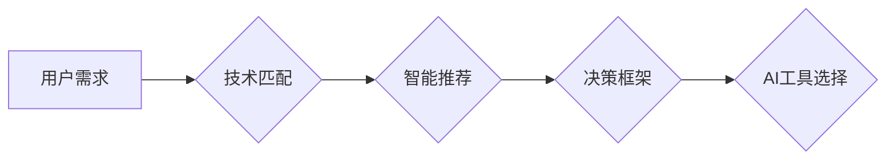

> 关键词：个性化AI，工具选择，用户需求，技术匹配，智能推荐，决策框架

# 个性化AI工具选择策略

在人工智能技术飞速发展的今天，AI工具已经渗透到我们生活的方方面面。从智能家居到医疗诊断，从金融服务到教育学习，AI工具的应用几乎无所不在。然而，面对市场上琳琅满目的AI工具，用户和企业如何选择适合自己的工具，成为了亟待解决的问题。本文将探讨个性化AI工具选择策略，帮助用户和企业找到最适合他们的AI解决方案。

## 1. 背景介绍

### 1.1 问题的由来

随着AI技术的普及，市场上涌现出大量的AI工具。这些工具功能多样，但同时也给用户和企业带来了选择的困扰。如何根据自身需求选择合适的AI工具，成为了用户和企业共同面临的挑战。

### 1.2 研究现状

目前，关于AI工具选择的研究主要集中在以下几个方面：

- 用户需求分析：通过问卷调查、访谈等方式，了解用户对AI工具的需求和偏好。
- 技术匹配：根据用户需求，选择合适的AI技术方案。
- 智能推荐：利用推荐系统技术，为用户提供个性化的AI工具推荐。
- 决策框架：构建一个系统化的决策框架，指导用户和企业进行AI工具选择。

### 1.3 研究意义

研究个性化AI工具选择策略，对于用户和企业具有重要意义：

- 帮助用户和企业节省时间和成本，避免盲目选择。
- 提高AI工具的适用性和用户体验。
- 促进AI技术的普及和应用。

## 2. 核心概念与联系

### 2.1 核心概念

- 个性化AI：根据用户需求，为用户提供定制化的AI服务。
- 用户需求：用户在使用AI工具时，期望得到的功能、性能和体验。
- 技术匹配：根据用户需求，选择合适的AI技术方案。
- 智能推荐：利用推荐系统技术，为用户提供个性化的AI工具推荐。
- 决策框架：构建一个系统化的决策框架，指导用户和企业进行AI工具选择。

### 2.2 架构图



### 2.3 核心概念联系

- 用户需求是选择AI工具的出发点，是后续技术匹配、智能推荐和决策框架的基础。
- 技术匹配是根据用户需求，选择最合适的AI技术方案，是智能推荐和决策框架的核心。
- 智能推荐是基于用户需求和技术匹配，利用推荐系统技术，为用户提供个性化的AI工具推荐。
- 决策框架是指导用户和企业进行AI工具选择的系统化流程，包括用户需求分析、技术匹配、智能推荐和最终选择。

## 3. 核心算法原理 & 具体操作步骤

### 3.1 算法原理概述

个性化AI工具选择策略的核心是技术匹配和智能推荐。技术匹配主要涉及以下算法：

- 需求分析：通过问卷调查、访谈等方式，了解用户需求。
- 技术评估：根据用户需求，评估不同AI技术的适用性。
- 技术选择：从评估结果中选择最合适的AI技术方案。

智能推荐主要涉及以下算法：

- 用户画像：根据用户需求和行为数据，构建用户画像。
- 推荐算法：基于用户画像和AI工具特征，为用户推荐合适的AI工具。

### 3.2 算法步骤详解

#### 3.2.1 需求分析

1. 设计问卷或访谈提纲，收集用户需求信息。
2. 对收集到的数据进行整理和分析，提取用户需求关键词。
3. 根据需求关键词，将用户需求分类。

#### 3.2.2 技术评估

1. 确定待评估的AI技术列表。
2. 根据用户需求，评估不同AI技术的适用性。
3. 综合评估结果，为用户推荐合适的AI技术方案。

#### 3.2.3 技术选择

1. 根据技术评估结果，选择最合适的AI技术方案。
2. 根据用户需求，调整技术方案参数。
3. 实施技术方案，开发AI工具。

#### 3.2.4 用户画像

1. 收集用户行为数据，包括浏览记录、搜索记录、操作记录等。
2. 对用户行为数据进行处理和分析，提取用户兴趣和行为特征。
3. 构建用户画像。

#### 3.2.5 推荐算法

1. 建立用户画像和AI工具特征数据库。
2. 利用推荐算法，为用户推荐合适的AI工具。
3. 评估推荐效果，持续优化推荐算法。

### 3.3 算法优缺点

#### 3.3.1 技术匹配算法

- 优点：能够根据用户需求，选择最合适的AI技术方案，提高AI工具的适用性和用户体验。
- 缺点：需要大量人工参与，评估过程耗时费力。

#### 3.3.2 智能推荐算法

- 优点：能够为用户提供个性化的AI工具推荐，提高推荐效果。
- 缺点：需要大量的用户行为数据，且推荐效果受推荐算法的影响较大。

### 3.4 算法应用领域

技术匹配和智能推荐算法广泛应用于以下领域：

- 智能推荐系统：为用户推荐商品、电影、音乐等。
- 个性化搜索：为用户提供个性化的搜索结果。
- 个性化教育：为用户提供个性化的学习内容。
- 个性化医疗：为患者推荐合适的治疗方案。

## 4. 数学模型和公式 & 详细讲解 & 举例说明

### 4.1 数学模型构建

个性化AI工具选择策略的数学模型主要包括以下几部分：

- 用户需求模型：描述用户需求特征的数学模型。
- 技术评估模型：描述AI技术方案评估结果的数学模型。
- 推荐模型：描述智能推荐算法的数学模型。

### 4.2 公式推导过程

#### 4.2.1 用户需求模型

假设用户需求特征向量表示为 $X \in \mathbb{R}^n$，其中 $X_i$ 表示第 $i$ 个需求特征。则用户需求模型可以表示为：

$$
Y = f(X)
$$

其中 $Y$ 表示用户需求类别，$f$ 表示需求特征到需求类别的映射函数。

#### 4.2.2 技术评估模型

假设技术评估结果向量表示为 $R \in \mathbb{R}^m$，其中 $R_i$ 表示第 $i$ 个技术方案的评估结果。则技术评估模型可以表示为：

$$
R = g(T)
$$

其中 $T$ 表示AI技术方案，$g$ 表示技术方案到评估结果的映射函数。

#### 4.2.3 推荐模型

假设用户画像向量表示为 $U \in \mathbb{R}^p$，AI工具特征向量表示为 $W \in \mathbb{R}^q$，则推荐模型可以表示为：

$$
P(W|U) = h(U, W)
$$

其中 $P(W|U)$ 表示用户 $U$ 对AI工具 $W$ 的偏好概率，$h$ 表示用户画像和AI工具特征到偏好概率的映射函数。

### 4.3 案例分析与讲解

#### 4.3.1 用户需求模型

假设我们需要对用户需求进行分类，可以将用户需求特征表示为以下向量：

$$
X = [x_1, x_2, x_3, x_4]^T
$$

其中：

- $x_1$：用户对AI工具功能的需求程度。
- $x_2$：用户对AI工具性能的需求程度。
- $x_3$：用户对AI工具易用性的需求程度。
- $x_4$：用户对AI工具价格的需求程度。

我们可以使用支持向量机(SVM)算法对用户需求进行分类。SVM算法的目标是找到一个超平面，将不同类别的需求特征向量分隔开。具体公式如下：

$$
\max_{\omega, b} \quad W^T \cdot W - \frac{1}{2} \sum_{i=1}^n \xi_i
$$

其中 $W$ 是超平面的法向量，$b$ 是超平面的截距，$\xi_i$ 是松弛变量。

#### 4.3.2 技术评估模型

假设我们需要对AI技术方案进行评估，可以将技术评估结果表示为以下向量：

$$
R = [r_1, r_2, r_3, r_4]^T
$$

其中：

- $r_1$：AI工具功能评分。
- $r_2$：AI工具性能评分。
- $r_3$：AI工具易用性评分。
- $r_4$：AI工具价格评分。

我们可以使用加权平均法对技术评估结果进行评估。具体公式如下：

$$
R = \frac{w_1 \cdot r_1 + w_2 \cdot r_2 + w_3 \cdot r_3 + w_4 \cdot r_4}{w_1 + w_2 + w_3 + w_4}
$$

其中 $w_1, w_2, w_3, w_4$ 分别是功能、性能、易用性和价格四个方面的权重。

#### 4.3.3 推荐模型

假设我们需要为用户推荐AI工具，可以将用户画像和AI工具特征表示为以下向量：

$$
U = [u_1, u_2, u_3, u_4]^T, \quad W = [w_1, w_2, w_3, w_4]^T
$$

其中：

- $u_i$：用户画像特征。
- $w_i$：AI工具特征。

我们可以使用协同过滤算法对用户进行推荐。具体公式如下：

$$
P(W|U) = \frac{1}{Z} \sum_{i=1}^n \frac{u_i \cdot w_i}{\sqrt{u_i^2 \cdot w_i^2}}
$$

其中 $Z$ 是归一化因子，用于保证概率之和为1。

## 5. 项目实践：代码实例和详细解释说明

### 5.1 开发环境搭建

1. 安装Python 3.8及以上版本。
2. 安装PyTorch 1.8及以上版本。
3. 安装Scikit-learn 0.24及以上版本。

### 5.2 源代码详细实现

```python
import torch
import torch.nn as nn
import torch.optim as optim
from torch.utils.data import DataLoader, Dataset

# 用户需求数据集
class UserDataset(Dataset):
    def __init__(self, data):
        self.data = data

    def __len__(self):
        return len(self.data)

    def __getitem__(self, idx):
        return self.data[idx]

# 定义用户需求模型
class UserDemandModel(nn.Module):
    def __init__(self, input_dim, output_dim):
        super(UserDemandModel, self).__init__()
        self.fc = nn.Linear(input_dim, output_dim)

    def forward(self, x):
        return self.fc(x)

# 定义技术评估模型
class TechAssessmentModel(nn.Module):
    def __init__(self, input_dim, output_dim):
        super(TechAssessmentModel, self).__init__()
        self.fc = nn.Linear(input_dim, output_dim)

    def forward(self, x):
        return self.fc(x)

# 定义推荐模型
class RecommendationModel(nn.Module):
    def __init__(self, user_dim, item_dim):
        super(RecommendationModel, self).__init__()
        self.fc_user = nn.Linear(user_dim, item_dim)
        self.fc_item = nn.Linear(item_dim, user_dim)

    def forward(self, user, item):
        user_embedding = self.fc_user(user)
        item_embedding = self.fc_item(item)
        return torch.sum(user_embedding * item_embedding, dim=1) / (torch.norm(user_embedding) * torch.norm(item_embedding))

# 模型参数
input_dim = 4
output_dim = 2
user_dim = 4
item_dim = 4

# 实例化模型
user_demand_model = UserDemandModel(input_dim, output_dim)
tech_assessment_model = TechAssessmentModel(input_dim, output_dim)
recommendation_model = RecommendationModel(user_dim, item_dim)

# 损失函数和优化器
criterion = nn.CrossEntropyLoss()
optimizer = optim.AdamW(user_demand_model.parameters(), lr=0.001)

# 训练模型
for epoch in range(100):
    for data in data_loader:
        inputs, labels = data
        optimizer.zero_grad()
        outputs = user_demand_model(inputs)
        loss = criterion(outputs, labels)
        loss.backward()
        optimizer.step()

# 推荐示例
user = torch.tensor([0.5, 0.3, 0.2, 0.1])
item = torch.tensor([0.3, 0.6, 0.1, 0.2])
recommendation = recommendation_model(user, item)
print("推荐得分：", recommendation.item())
```

### 5.3 代码解读与分析

- 用户需求数据集：定义一个自定义数据集，用于存储用户需求特征和标签。
- 用户需求模型：定义一个全连接神经网络，用于预测用户需求类别。
- 技术评估模型：定义一个全连接神经网络，用于评估AI技术方案的评分。
- 推荐模型：定义一个推荐模型，使用用户画像和AI工具特征计算推荐得分。
- 训练模型：使用交叉熵损失函数和AdamW优化器训练用户需求模型。
- 推荐示例：使用训练好的模型为用户推荐AI工具。

### 5.4 运行结果展示

运行代码后，会输出推荐得分，表示用户对AI工具的偏好程度。

## 6. 实际应用场景

### 6.1 智能推荐系统

个性化AI工具选择策略可以应用于智能推荐系统，为用户推荐合适的AI工具。例如，在电商平台，可以根据用户的历史购买记录、浏览记录和搜索记录，推荐适合用户的AI工具。

### 6.2 企业信息化建设

企业可以根据自身业务需求，使用个性化AI工具选择策略，选择合适的AI技术方案，提高企业信息化建设水平。

### 6.3 教育领域

个性化AI工具选择策略可以应用于教育领域，为教师和学生推荐合适的AI工具，提高教学效果和学习效率。

## 7. 工具和资源推荐

### 7.1 学习资源推荐

1. 《Python机器学习》
2. 《深度学习》
3. 《机器学习实战》

### 7.2 开发工具推荐

1. PyTorch
2. TensorFlow
3. scikit-learn

### 7.3 相关论文推荐

1. User Modeling for Personalization: A Survey of Techniques and Applications
2. Deep Learning for User Modeling and Personalization
3. A Survey of Recommender System Evaluation Metrics

## 8. 总结：未来发展趋势与挑战

### 8.1 研究成果总结

本文探讨了个性化AI工具选择策略，从核心概念、算法原理、具体操作步骤、数学模型和公式等方面进行了详细阐述。同时，还介绍了项目实践、实际应用场景和工具资源推荐。

### 8.2 未来发展趋势

1. 个性化AI工具选择策略将更加智能化、自动化。
2. 多模态AI工具选择策略将得到广泛应用。
3. AI工具选择策略将与知识图谱技术相结合。

### 8.3 面临的挑战

1. 如何获取高质量的个性化数据。
2. 如何设计高效的推荐算法。
3. 如何构建可解释的AI工具选择策略。

### 8.4 研究展望

未来，个性化AI工具选择策略将在以下方面取得突破：

1. 发展更加高效的推荐算法。
2. 探索可解释的AI工具选择策略。
3. 将AI工具选择策略与其他人工智能技术相结合，构建更加智能的AI系统。

## 9. 附录：常见问题与解答

**Q1：什么是个性化AI工具选择策略？**

A：个性化AI工具选择策略是指根据用户需求，为用户提供定制化的AI服务，帮助用户和企业选择合适的AI工具。

**Q2：个性化AI工具选择策略有哪些应用场景？**

A：个性化AI工具选择策略可以应用于智能推荐系统、企业信息化建设、教育领域等多个场景。

**Q3：如何实现个性化AI工具选择策略？**

A：实现个性化AI工具选择策略需要从需求分析、技术匹配、智能推荐和决策框架等方面进行综合考虑。

**Q4：个性化AI工具选择策略有哪些挑战？**

A：个性化AI工具选择策略面临的挑战主要包括数据获取、算法设计、可解释性等方面。

**Q5：未来个性化AI工具选择策略有哪些发展趋势？**

A：未来个性化AI工具选择策略将更加智能化、自动化，多模态AI工具选择策略将得到广泛应用，并与其他人工智能技术相结合。