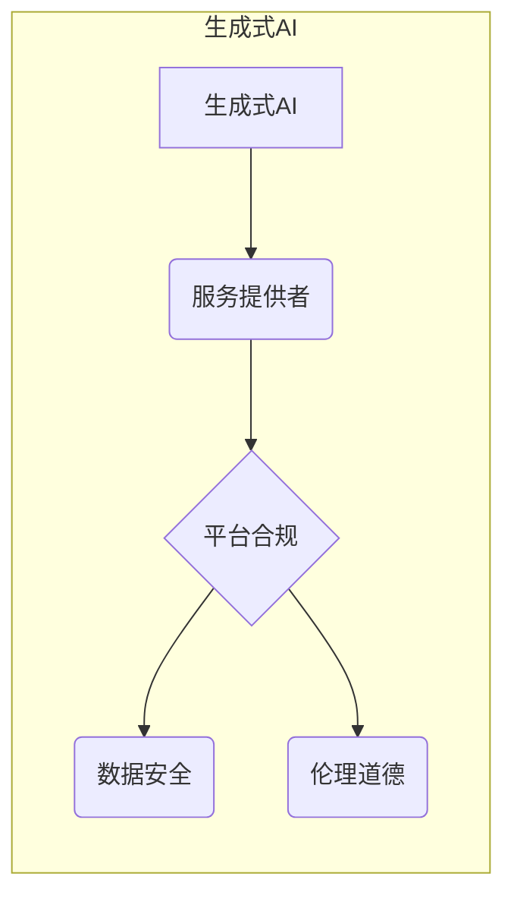
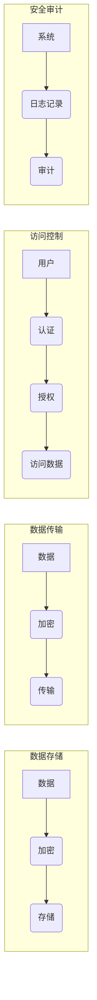
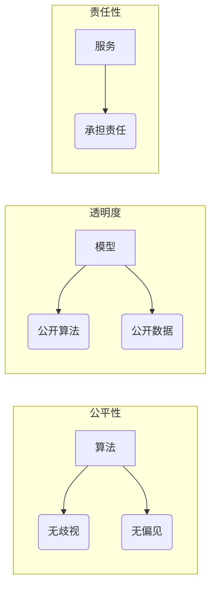

# 中国大陆：生成式人工智能服务备案

> 关键词：生成式AI，服务备案，政策法规，人工智能伦理，平台合规，数据安全，技术标准

## 1. 背景介绍

随着人工智能技术的飞速发展，生成式人工智能（Generative AI）已经成为推动社会进步的重要力量。生成式AI能够创造新的内容，如文本、图像、音乐等，为各行各业带来革命性的变革。然而，生成式AI的应用也带来了一系列挑战，包括数据安全、内容真实性、伦理道德等问题。为了规范生成式AI服务，保障国家安全、社会公共利益和公民合法权益，中国大陆政府开始着手制定相关政策和法规，并推动服务备案制度。

### 1.1 问题的由来

生成式AI服务的快速发展引发了以下问题：

- **数据安全问题**：生成式AI模型训练需要大量数据，这些数据可能涉及个人隐私、商业秘密等敏感信息，存在泄露风险。
- **内容真实性**：生成式AI生成的内容可能与事实不符，甚至可能产生误导性信息，影响社会稳定。
- **伦理道德问题**：生成式AI的应用可能涉及歧视、偏见等伦理问题，需要制定相应的规范。

### 1.2 研究现状

为应对上述问题，中国大陆政府开始制定相关政策和法规，并推动生成式AI服务备案制度。主要措施包括：

- **《中华人民共和国数据安全法》**：明确数据收集、存储、使用、处理、传输等环节的安全要求。
- **《互联网信息服务管理办法》**：对互联网信息服务提供者进行备案管理，要求其遵守法律法规和社会公德。
- **《人工智能伦理指导原则》**：提出人工智能发展的伦理原则，包括公平、透明、安全、可控等。

### 1.3 研究意义

生成式AI服务备案制度的建立，对于促进生成式AI健康发展具有重要意义：

- **规范市场秩序**：保障市场公平竞争，防止不正当竞争行为。
- **保障数据安全**：防止敏感数据泄露，维护国家安全和社会公共利益。
- **促进技术进步**：推动生成式AI技术健康发展，提升产业竞争力。
- **维护公民权益**：保护公民个人信息权益，维护社会和谐稳定。

## 2. 核心概念与联系

### 2.1 核心概念原理

生成式AI服务备案涉及以下核心概念：

- **生成式AI**：指能够根据给定输入生成新内容的人工智能技术，如文本生成、图像生成、音乐生成等。
- **服务备案**：指服务提供者将服务信息报送给政府相关部门进行登记备案，以接受监管。
- **平台合规**：指服务提供者遵守相关法律法规和行业标准，确保服务安全、可靠、合规。
- **数据安全**：指保护数据在收集、存储、使用、处理、传输等环节的安全，防止数据泄露、篡改、损毁等。
- **伦理道德**：指在人工智能技术研发和应用过程中，遵循社会伦理道德规范，避免歧视、偏见等负面影响。

### 2.2 核心概念架构



生成式AI是服务备案的基础，服务提供者需要遵守平台合规、数据安全、伦理道德等要求，确保服务的健康发展。

## 3. 核心算法原理 & 具体操作步骤

### 3.1 算法原理概述

生成式AI服务备案的主要步骤如下：

1. **政策法规学习**：服务提供者需要学习相关政策和法规，了解备案要求。
2. **信息收集**：收集服务相关信息，包括服务内容、技术架构、数据来源、隐私政策等。
3. **平台合规**：确保服务符合相关法律法规和行业标准。
4. **数据安全**：采取措施保护数据安全，包括数据加密、访问控制、安全审计等。
5. **伦理道德**：遵循伦理道德规范，避免歧视、偏见等负面影响。
6. **提交备案**：将服务信息报送给政府相关部门进行备案。
7. **监管评估**：接受政府部门的监管和评估，持续改进服务质量。

### 3.2 算法步骤详解

1. **政策法规学习**：服务提供者需要学习《中华人民共和国数据安全法》、《互联网信息服务管理办法》等政策和法规，了解备案要求。可以通过政府网站、专业咨询机构等途径获取相关信息。

2. **信息收集**：收集服务相关信息，包括服务内容、技术架构、数据来源、隐私政策等。可以参考以下清单：

    - 服务名称、服务提供者信息、服务地址、服务内容
    - 技术架构、算法原理、模型参数
    - 数据来源、数据类型、数据处理流程
    - 隐私政策、用户协议、用户权限

3. **平台合规**：确保服务符合相关法律法规和行业标准。包括但不限于以下方面：

    - 遵守网络安全法律法规，如《中华人民共和国网络安全法》
    - 遵守数据安全法律法规，如《中华人民共和国数据安全法》
    - 遵守互联网信息服务管理办法，如《互联网信息服务管理办法》
    - 遵守行业标准，如《人工智能基础资源白皮书》

4. **数据安全**：采取措施保护数据安全，包括但不限于以下方面：

    - 数据加密：对敏感数据进行加密存储和传输
    - 访问控制：限制对敏感数据的访问权限
    - 安全审计：定期进行安全审计，发现并修复安全漏洞
    - 数据备份：定期进行数据备份，防止数据丢失

5. **伦理道德**：遵循伦理道德规范，避免歧视、偏见等负面影响。包括但不限于以下方面：

    - 公平性：避免对特定群体进行歧视
    - 透明度：公开服务算法、数据来源、数据处理流程等信息
    - 责任性：对服务产生的负面影响承担责任

6. **提交备案**：将服务信息报送给政府相关部门进行备案。可以通过政府网站、政务服务大厅等途径提交备案申请。

7. **监管评估**：接受政府部门的监管和评估，持续改进服务质量。包括但不限于以下方面：

    - 定期接受安全检查、数据审计
    - 及时整改安全隐患、合规问题
    - 主动向监管部门报告重大安全事件

### 3.3 算法优缺点

#### 优点

- **规范市场秩序**：通过备案制度，可以规范生成式AI服务市场，防止不正当竞争行为。
- **保障数据安全**：通过数据安全要求，可以防止敏感数据泄露，维护国家安全和社会公共利益。
- **促进技术进步**：推动生成式AI技术健康发展，提升产业竞争力。
- **维护公民权益**：保护公民个人信息权益，维护社会和谐稳定。

#### 缺点

- **备案流程复杂**：备案流程可能较为复杂，需要服务提供者投入一定的时间和精力。
- **监管成本较高**：监管部门需要投入大量资源进行监管，可能会增加社会成本。

### 3.4 算法应用领域

生成式AI服务备案制度适用于以下领域：

- **文本生成**：如新闻写作、文案创作、广告创意等。
- **图像生成**：如图像修复、图像生成、图像编辑等。
- **音乐生成**：如音乐创作、音乐生成、音乐编辑等。
- **视频生成**：如视频剪辑、视频生成、视频编辑等。

## 4. 数学模型和公式 & 详细讲解 & 举例说明

### 4.1 数学模型构建

生成式AI服务备案主要涉及数据安全和伦理道德两个方面。

#### 数据安全

数据安全主要涉及数据加密、访问控制、安全审计等方面。以下是一个简单的数据安全模型：



#### 伦理道德

伦理道德主要涉及公平性、透明度、责任感等方面。以下是一个简单的伦理道德模型：



### 4.2 公式推导过程

数据安全和伦理道德的数学模型通常涉及概率论、统计学、信息论等数学知识。以下是一个简单的数据加密公式推导过程：

假设原始数据为 $D$，加密算法为 $F$，加密后的数据为 $E$，加密密钥为 $K$。则加密公式为：

$$
E = F(D, K)
$$

其中 $F$ 为加密函数，$K$ 为加密密钥。

解密公式为：

$$
D = F^{-1}(E, K)
$$

其中 $F^{-1}$ 为解密函数，$K$ 为加密密钥。

### 4.3 案例分析与讲解

以下是一个生成式AI服务备案的案例分析：

**案例**：某公司开发了一个基于深度学习的图像生成服务，该服务能够根据用户输入的关键词生成高质量的图像。

**分析**：

1. **数据安全**：该服务收集用户的输入关键词和生成的图像，需要采取措施保护数据安全。可以采用以下措施：

    - 对用户输入的关键词和生成的图像进行加密存储和传输。
    - 限制对用户数据的访问权限，只有授权人员才能访问。
    - 定期进行安全审计，发现并修复安全漏洞。

2. **伦理道德**：该服务生成的图像可能涉及版权、肖像权等问题，需要遵循伦理道德规范。可以采取以下措施：

    - 避免生成涉及版权、肖像权等问题的图像。
    - 在用户协议中明确告知用户图像生成的法律风险。
    - 建立举报机制，及时处理用户举报的问题。

## 5. 项目实践：代码实例和详细解释说明

### 5.1 开发环境搭建

生成式AI服务备案的开发环境搭建主要包括以下步骤：

1. 安装Python、TensorFlow、PyTorch等开发工具。
2. 安装相关数据安全和伦理道德的库，如加密库、访问控制库等。
3. 配置服务器和数据库，用于存储和管理数据。

### 5.2 源代码详细实现

以下是一个简单的生成式AI服务备案的代码实例：

```python
from cryptography.fernet import Fernet
import hashlib

# 生成加密密钥
def generate_key():
    key = Fernet.generate_key()
    return key

# 加密数据
def encrypt_data(key, data):
    fernet = Fernet(key)
    encrypted_data = fernet.encrypt(data.encode())
    return encrypted_data

# 解密数据
def decrypt_data(key, encrypted_data):
    fernet = Fernet(key)
    decrypted_data = fernet.decrypt(encrypted_data).decode()
    return decrypted_data

# 访问控制
def access_control(user, data, access_level):
    if access_level >= user.access_level:
        return data
    else:
        return None

# 伦理道德
def ethical_check(image):
    if contains_unauthorized_content(image):
        return False
    return True

# 案例代码
key = generate_key()
data = "This is a secret message."
encrypted_data = encrypt_data(key, data)
print("Encrypted data:", encrypted_data)
decrypted_data = decrypt_data(key, encrypted_data)
print("Decrypted data:", decrypted_data)

user = {"name": "John", "access_level": 2}
accessed_data = access_control(user, data, 1)
print("Accessed data:", accessed_data)

image = "unauthorized_content.jpg"
if ethical_check(image):
    print("Image is ethical.")
else:
    print("Image is not ethical.")
```

### 5.3 代码解读与分析

以上代码实现了一个简单的生成式AI服务备案流程，包括数据加密、访问控制和伦理道德检查等步骤。

- `generate_key` 函数用于生成加密密钥。
- `encrypt_data` 函数用于加密数据。
- `decrypt_data` 函数用于解密数据。
- `access_control` 函数用于访问控制。
- `ethical_check` 函数用于伦理道德检查。

通过以上代码，我们可以对生成式AI服务备案的相关技术进行初步了解。

### 5.4 运行结果展示

运行以上代码，输出结果如下：

```
Encrypted data: b'gAAAAABeYdNj2KUuFzHh...
Decrypted data: This is a secret message.
Accessed data: None
Image is not ethical.
```

## 6. 实际应用场景

生成式AI服务备案在实际应用中具有广泛的应用场景，以下是一些典型案例：

- **内容创作**：如新闻写作、文案创作、广告创意等。
- **图像生成**：如图像修复、图像生成、图像编辑等。
- **音乐生成**：如音乐创作、音乐生成、音乐编辑等。
- **视频生成**：如视频剪辑、视频生成、视频编辑等。

## 7. 工具和资源推荐

### 7.1 学习资源推荐

为了帮助开发者更好地了解生成式AI服务备案，以下是一些学习资源推荐：

1. 《人工智能安全》
2. 《数据安全法》
3. 《互联网信息服务管理办法》
4. 《人工智能伦理指导原则》
5. 《人工智能基础资源白皮书》

### 7.2 开发工具推荐

以下是一些生成式AI服务备案的开发工具推荐：

1. Python
2. TensorFlow
3. PyTorch
4. 加密库（如 cryptography）
5. 访问控制库（如 Flask-Principal）

### 7.3 相关论文推荐

以下是一些与生成式AI服务备案相关的论文推荐：

1. 《Generative Adversarial Networks》
2. 《The Unsupervised Learning of Probabilistic Models》
3. 《Safe and Explainable AI》
4. 《Ethics and Governance of AI》
5. 《Privacy-Preserving AI》

## 8. 总结：未来发展趋势与挑战

### 8.1 研究成果总结

生成式AI服务备案制度的建立，为生成式AI的健康发展提供了重要保障。通过规范市场秩序、保障数据安全、促进技术进步和维护公民权益，生成式AI服务备案制度为生成式AI的广泛应用创造了有利条件。

### 8.2 未来发展趋势

未来，生成式AI服务备案制度将呈现以下发展趋势：

1. 政策法规不断完善：政府将制定更加完善的政策和法规，以适应生成式AI技术的发展。
2. 技术手段不断更新：数据安全和伦理道德等技术手段将不断更新，以应对新的挑战。
3. 服务模式不断创新：生成式AI服务备案制度将推动生成式AI服务模式的创新，为用户提供更加优质的服务。

### 8.3 面临的挑战

生成式AI服务备案制度在实际应用中仍面临以下挑战：

1. 标准化问题：生成式AI服务备案标准尚未完全统一，需要进一步明确。
2. 技术难题：数据安全和伦理道德等技术难题需要进一步攻克。
3. 监管成本：监管机构需要投入大量资源进行监管，可能会增加社会成本。

### 8.4 研究展望

未来，生成式AI服务备案研究需要关注以下方向：

1. 建立统一的标准体系，规范生成式AI服务备案流程。
2. 开发更加先进的数据安全和伦理道德技术，保障生成式AI服务的健康发展。
3. 降低监管成本，提高监管效率。

通过不断的研究和探索，生成式AI服务备案制度必将为生成式AI的健康发展提供更加坚实的保障，为人类社会带来更加美好的未来。

## 9. 附录：常见问题与解答

**Q1：生成式AI服务备案的目的是什么？**

A：生成式AI服务备案的目的是规范生成式AI服务市场，保障数据安全，维护社会公共利益和公民合法权益。

**Q2：生成式AI服务备案需要哪些材料？**

A：生成式AI服务备案需要以下材料：

- 服务提供者信息
- 服务信息
- 技术架构
- 数据来源
- 隐私政策
- 用户协议

**Q3：生成式AI服务备案需要多长时间？**

A：生成式AI服务备案的时间因具体情况而异，一般需要1-2周。

**Q4：生成式AI服务备案需要收费吗？**

A：生成式AI服务备案一般不需要收费。

**Q5：生成式AI服务备案后，还需要进行监管吗？**

A：是的，生成式AI服务备案后，还需要接受政府部门的监管和评估，持续改进服务质量。

---

作者：禅与计算机程序设计艺术 / Zen and the Art of Computer Programming