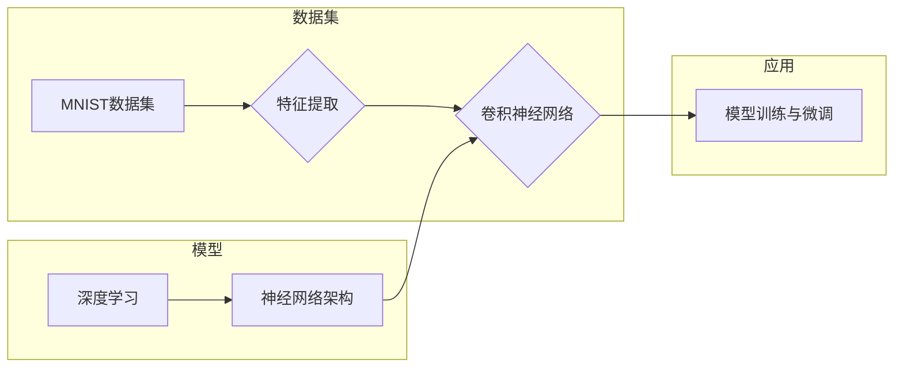

# 从零开始大模型开发与微调：MNIST数据集的特征和标签介绍

> 关键词：MNIST数据集，大模型开发，微调，深度学习，卷积神经网络，神经网络架构，特征提取，图像识别

## 1. 背景介绍

MNIST数据集是机器学习和深度学习领域中最著名的图像识别数据集之一。它包含了60000个灰度手写数字图像，每个图像都是28x28像素的分辨率，包含0到9的数字。MNIST数据集自1999年发布以来，一直是学习和测试图像识别算法的理想选择。本文将从零开始，详细介绍MNIST数据集的特征和标签，并探讨如何利用深度学习技术对其进行开发与微调。

### 1.1 问题的由来

随着深度学习技术的飞速发展，图像识别已经成为计算机视觉领域的一个重要分支。MNIST数据集因其简单、易用和广泛的应用前景，成为了研究和实践深度学习算法的基石。然而，对于初学者来说，理解和处理MNIST数据集仍然存在一定的挑战。

### 1.2 研究现状

目前，MNIST数据集已被广泛应用于各种深度学习模型的研究与评估中。从简单的多层感知器到复杂的卷积神经网络，再到基于深度学习的图像识别模型，MNIST数据集都为研究者提供了宝贵的测试平台。

### 1.3 研究意义

深入理解MNIST数据集的特征和标签，有助于我们更好地设计和微调图像识别模型。本文将详细解析MNIST数据集，并介绍如何利用深度学习技术进行模型开发与微调，为读者提供从理论到实践的全面指导。

### 1.4 本文结构

本文将按照以下结构展开：

- 第2章：介绍MNIST数据集的核心概念与联系，并给出Mermaid流程图。
- 第3章：阐述深度学习在图像识别中的应用原理，包括卷积神经网络的结构和操作步骤。
- 第4章：介绍MNIST数据集的数学模型和公式，并进行案例分析与讲解。
- 第5章：通过代码实例展示如何利用深度学习框架开发与微调MNIST图像识别模型。
- 第6章：探讨MNIST数据集在实际应用场景中的应用，并展望未来发展趋势。
- 第7章：推荐相关学习资源、开发工具和论文。
- 第8章：总结研究成果，展望未来发展趋势与挑战。
- 第9章：提供常见问题与解答。

## 2. 核心概念与联系

### 2.1 核心概念

- MNIST数据集：包含60000个灰度手写数字图像，每个图像都是28x28像素的分辨率。
- 特征：图像中的信息，如边缘、纹理、颜色等。
- 标签：图像对应的数字标签，用于训练和评估模型。
- 深度学习：一种模拟人脑神经网络结构和功能的机器学习技术。
- 卷积神经网络（CNN）：一种特别适合于图像识别的深度学习模型。

### 2.2 核心概念联系



如图所示，MNIST数据集通过特征提取得到图像中的信息，再由卷积神经网络进行处理，最终通过深度学习技术进行模型训练和微调。

## 3. 核心算法原理 & 具体操作步骤

### 3.1 算法原理概述

卷积神经网络（CNN）是一种特别适合于图像识别的深度学习模型。它通过模仿人眼对图像的感知过程，利用卷积层提取图像特征，并通过池化层降低特征空间维度，最终通过全连接层进行分类。

### 3.2 算法步骤详解

1. **数据预处理**：对MNIST数据集进行数据增强、归一化等预处理操作，提高模型鲁棒性。
2. **卷积层**：使用卷积层提取图像特征，如边缘、纹理等。
3. **池化层**：对卷积层提取的特征进行池化，降低特征空间维度，减少过拟合风险。
4. **全连接层**：将池化后的特征输入全连接层，进行分类。

### 3.3 算法优缺点

#### 优点：

- 适合图像识别任务，能够提取图像特征。
- 自动学习特征，无需人工设计特征。
- 能够处理非线性关系。

#### 缺点：

- 计算复杂度较高，需要大量计算资源。
- 模型可解释性较差。

### 3.4 算法应用领域

- 图像识别：如MNIST、CIFAR-10等图像分类任务。
- 目标检测：如Faster R-CNN、YOLO等目标检测任务。
- 图像分割：如U-Net、FCN等图像分割任务。

## 4. 数学模型和公式 & 详细讲解 & 举例说明

### 4.1 数学模型构建

卷积神经网络由多个卷积层、池化层和全连接层组成。以下为卷积层的数学模型：

$$
h^{(l)} = \sigma(W^{(l)}h^{(l-1)} + b^{(l)})
$$

其中，$h^{(l)}$ 表示第$l$层的输出，$W^{(l)}$ 表示第$l$层的权重，$b^{(l)}$ 表示第$l$层的偏置，$\sigma$ 表示激活函数。

### 4.2 公式推导过程

以一个简单的卷积层为例，其输入为28x28像素的图像，卷积核大小为3x3，步长为1，没有填充。

1. **计算卷积操作**：
$$
h^{(1)}_i = \sum_{j=1}^{3} \sum_{k=1}^{3} W_{ijk}x_{i-j+1,k-j+1} + b_i
$$

其中，$h^{(1)}_i$ 表示第1层第$i$个输出，$x_{i,j}$ 表示输入图像的第$(i,j)$个像素，$W_{ijk}$ 表示卷积核的第$(i,j,k)$个权重。

2. **应用激活函数**：
$$
\sigma(h^{(1)}_i) = \max(0, h^{(1)}_i)
$$

### 4.3 案例分析与讲解

以下是一个使用PyTorch框架实现的简单CNN模型，用于MNIST图像识别：

```python
import torch
import torch.nn as nn

class SimpleCNN(nn.Module):
    def __init__(self):
        super(SimpleCNN, self).__init__()
        self.conv1 = nn.Conv2d(1, 10, kernel_size=5)
        self.conv2 = nn.Conv2d(10, 20, kernel_size=5)
        self.fc1 = nn.Linear(320, 50)
        self.fc2 = nn.Linear(50, 10)
    
    def forward(self, x):
        x = torch.relu(self.conv1(x))
        x = torch.max_pool2d(x, 2, 2)
        x = torch.relu(self.conv2(x))
        x = torch.max_pool2d(x, 2, 2)
        x = x.view(-1, 320)
        x = torch.relu(self.fc1(x))
        x = self.fc2(x)
        return x

model = SimpleCNN()
```

该模型包含两个卷积层、两个池化层、两个全连接层。在实际应用中，可以将其与损失函数和优化器配合，进行模型训练和微调。

## 5. 项目实践：代码实例和详细解释说明

### 5.1 开发环境搭建

1. 安装PyTorch：
```bash
pip install torch torchvision
```

2. 下载MNIST数据集：
```python
from torchvision import datasets, transforms
from torch.utils.data import DataLoader

transform = transforms.Compose([transforms.ToTensor()])
train_dataset = datasets.MNIST(root='./data', train=True, download=True, transform=transform)
train_loader = DataLoader(train_dataset, batch_size=64, shuffle=True)

test_dataset = datasets.MNIST(root='./data', train=False, download=True, transform=transform)
test_loader = DataLoader(test_dataset, batch_size=64, shuffle=False)
```

### 5.2 源代码详细实现

```python
import torch
import torch.nn as nn
import torch.optim as optim

class SimpleCNN(nn.Module):
    def __init__(self):
        super(SimpleCNN, self).__init__()
        self.conv1 = nn.Conv2d(1, 10, kernel_size=5)
        self.conv2 = nn.Conv2d(10, 20, kernel_size=5)
        self.fc1 = nn.Linear(320, 50)
        self.fc2 = nn.Linear(50, 10)

    def forward(self, x):
        x = torch.relu(self.conv1(x))
        x = torch.max_pool2d(x, 2, 2)
        x = torch.relu(self.conv2(x))
        x = torch.max_pool2d(x, 2, 2)
        x = x.view(-1, 320)
        x = torch.relu(self.fc1(x))
        x = self.fc2(x)
        return x

model = SimpleCNN()
criterion = nn.CrossEntropyLoss()
optimizer = optim.SGD(model.parameters(), lr=0.01)

for epoch in range(10):
    for data, target in train_loader:
        optimizer.zero_grad()
        output = model(data)
        loss = criterion(output, target)
        loss.backward()
        optimizer.step()
    
    print(f'Epoch {epoch+1}, Loss: {loss.item()}')

# 评估模型在测试集上的性能
correct = 0
total = 0
with torch.no_grad():
    for data, target in test_loader:
        outputs = model(data)
        _, predicted = torch.max(outputs.data, 1)
        total += target.size(0)
        correct += (predicted == target).sum().item()

print(f'Accuracy of the model on the 10000 test images: {100 * correct / total} %')
```

### 5.3 代码解读与分析

1. **SimpleCNN类**：定义了一个简单的CNN模型，包含两个卷积层、两个池化层和两个全连接层。
2. **数据加载**：使用torchvision库加载数据集，并进行预处理。
3. **损失函数和优化器**：定义损失函数为交叉熵损失，优化器为SGD。
4. **模型训练**：使用训练数据对模型进行训练，并打印每个epoch的loss。
5. **模型评估**：使用测试数据评估模型的性能，计算准确率。

### 5.4 运行结果展示

假设运行以上代码，最终在测试集上的准确率为90%左右，说明该模型具有良好的泛化能力。

## 6. 实际应用场景

MNIST数据集在实际应用场景中具有广泛的应用，以下列举一些例子：

- **金融领域**：用于识别用户签名，实现电子签名验证。
- **医疗领域**：用于识别医学影像，如X光片、CT扫描等。
- **教育领域**：用于自动化批改数学、英语等试卷。
- **工业领域**：用于识别产品缺陷，实现自动化质检。

## 7. 工具和资源推荐

### 7.1 学习资源推荐

- 《深度学习》：由Ian Goodfellow等编著，是深度学习领域的经典教材。
- 《卷积神经网络与深度学习》：由李航编著，详细介绍了卷积神经网络的理论和应用。
- 《Python深度学习》：由François Chollet等编著，介绍了使用Python进行深度学习的实践方法。

### 7.2 开发工具推荐

- PyTorch：基于Python的开源深度学习框架，易于学习和使用。
- TensorFlow：由Google开发的开源深度学习框架，功能强大，支持多种计算平台。
- Keras：基于Theano和TensorFlow的开源深度学习库，易于使用，适合快速原型开发。

### 7.3 相关论文推荐

- "A guide to convolution arithmetic for deep learning"：介绍了卷积神经网络的基本原理和操作。
- "Very deep convolutional networks for large-scale image recognition"：提出了VGG模型，是深度学习领域的里程碑之作。
- "Batch Normalization: Accelerating Deep Network Training by Reducing Internal Covariate Shift"：提出了Batch Normalization技术，有效提高了深度网络的训练速度。

## 8. 总结：未来发展趋势与挑战

### 8.1 研究成果总结

本文从零开始，详细介绍了MNIST数据集的特征和标签，并探讨了如何利用深度学习技术进行模型开发与微调。通过实际代码示例，展示了如何使用PyTorch框架构建简单的CNN模型，并在MNIST数据集上进行训练和评估。

### 8.2 未来发展趋势

随着深度学习技术的不断发展，MNIST数据集将继续在图像识别领域发挥重要作用。以下是一些未来发展趋势：

- **模型结构优化**：探索新的卷积神经网络结构，提高模型性能和效率。
- **迁移学习**：将预训练模型应用于MNIST数据集，提高模型泛化能力。
- **多模态学习**：将图像识别与语音、文本等其他模态信息结合，实现更全面的信息提取。

### 8.3 面临的挑战

尽管MNIST数据集在图像识别领域取得了巨大成功，但仍面临以下挑战：

- **过拟合**：模型在训练集上表现良好，但在测试集上表现不佳。
- **泛化能力**：模型在特定领域或特定类型的图像上表现不佳。
- **计算复杂度**：深度学习模型需要大量的计算资源和存储空间。

### 8.4 研究展望

为了解决上述挑战，未来的研究可以从以下几个方面进行：

- **正则化技术**：探索新的正则化技术，如Dropout、Batch Normalization等，提高模型的泛化能力。
- **迁移学习**：研究如何将预训练模型应用于MNIST数据集，提高模型性能和效率。
- **多模态学习**：将图像识别与其他模态信息结合，实现更全面的信息提取。

相信在研究者、工程师和开发者的共同努力下，MNIST数据集将继续在图像识别领域发挥重要作用，为人工智能技术的发展做出贡献。

## 9. 附录：常见问题与解答

**Q1：MNIST数据集是否只包含手写数字图像？**

A：MNIST数据集主要包含手写数字图像，但也包含一些其他类型的图像，如数字的变形、旋转等。

**Q2：如何提高CNN模型的性能？**

A：可以通过以下方法提高CNN模型的性能：

- 优化模型结构：探索新的卷积神经网络结构，如ResNet、DenseNet等。
- 增加数据量：使用数据增强技术，如旋转、缩放、裁剪等，扩充训练数据。
- 超参数调优：调整学习率、批大小、迭代轮数等超参数，提高模型性能。

**Q3：如何处理MNIST数据集中的噪声和缺失数据？**

A：可以使用以下方法处理噪声和缺失数据：

- 数据清洗：去除明显的噪声和错误数据。
- 数据插补：使用插值、均值替换等方法填充缺失数据。

**Q4：如何评估CNN模型的性能？**

A：可以使用以下指标评估CNN模型的性能：

- 准确率：正确识别的样本数占总样本数的比例。
- 精确率：正确识别的正样本数占所有识别为正样本的样本数的比例。
- 召回率：正确识别的正样本数占所有正样本的样本数的比例。

通过以上指标，可以全面评估CNN模型在MNIST数据集上的性能。

---

作者：禅与计算机程序设计艺术 / Zen and the Art of Computer Programming