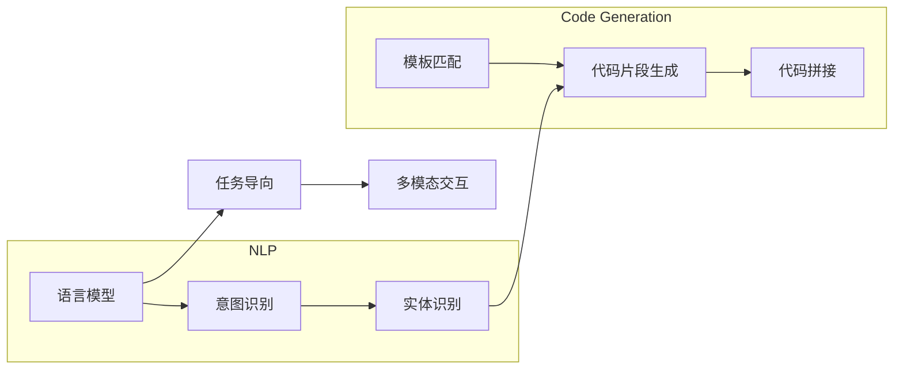

# 【LangChain编程：从入门到实践】需求分析

> 关键词：LangChain, 编程范式，代码生成，AI编程，任务导向，智能编程，自然语言处理，多模态交互

## 1. 背景介绍

随着人工智能技术的飞速发展，自然语言处理（NLP）和代码生成领域取得了显著的成果。近年来，一个名为LangChain的新兴编程范式逐渐崭露头角。LangChain结合了自然语言理解和代码生成的技术，通过自然语言指令实现代码的自动生成和执行。这种编程范式不仅简化了编程流程，还极大地提高了开发效率。本文将深入探讨LangChain的需求分析，从入门到实践，全面解析这一前沿技术。

### 1.1 LangChain的兴起

LangChain的兴起源于以下几个因素：

1. **NLP技术的突破**：近年来，深度学习在NLP领域取得了显著成果，使得机器理解和生成自然语言变得更加容易。
2. **代码生成技术的发展**：随着机器学习模型在代码生成方面的应用，代码自动生成变得更加可行。
3. **开发者需求的驱动**：随着软件开发复杂度的提高，开发者对提高编程效率的需求日益增长。

### 1.2 LangChain的优势

LangChain具有以下优势：

1. **提高开发效率**：通过自然语言指令，开发者可以快速生成和修改代码，大大缩短开发周期。
2. **降低技术门槛**：非技术背景的用户也可以通过LangChain进行编程，实现编程的普及。
3. **增强开发体验**：LangChain可以提供更加直观和人性化的编程体验。

## 2. 核心概念与联系

LangChain的核心概念包括自然语言理解、代码生成、任务导向、多模态交互等。

### 2.1 自然语言理解

自然语言理解是LangChain的基础，它包括以下几个子概念：

- **语言模型**：如GPT-3、BERT等，用于理解自然语言指令。
- **意图识别**：识别用户指令中的意图。
- **实体识别**：识别用户指令中的实体，如变量名、函数名等。

### 2.2 代码生成

代码生成是LangChain的关键，它包括以下几个子概念：

- **模板匹配**：根据用户指令生成代码模板。
- **代码片段生成**：生成代码片段，如函数、类等。
- **代码拼接**：将生成的代码片段拼接成完整的代码。

### 2.3 任务导向

LangChain以任务为导向，将用户的自然语言指令转化为具体的编程任务。

### 2.4 多模态交互

LangChain支持多模态交互，包括文本、代码、图像等多种形式。

以下是LangChain核心概念的Mermaid流程图：



## 3. 核心算法原理 & 具体操作步骤

### 3.1 算法原理概述

LangChain的算法原理可以概括为以下步骤：

1. **自然语言理解**：使用NLP技术解析用户指令，提取意图和实体。
2. **代码生成**：根据意图和实体生成代码模板和代码片段。
3. **任务导向**：将生成的代码片段拼接成完整的代码。
4. **多模态交互**：将代码输出以文本、代码、图像等多种形式呈现给用户。

### 3.2 算法步骤详解

1. **自然语言理解**：
    - 使用语言模型对用户指令进行分词和词性标注。
    - 使用意图识别模型识别用户指令的意图。
    - 使用实体识别模型识别用户指令中的实体。
2. **代码生成**：
    - 根据意图和实体生成代码模板。
    - 使用代码片段生成模型生成代码片段。
    - 将生成的代码片段拼接成完整的代码。
3. **任务导向**：
    - 根据用户指令的要求，将生成的代码片段组织成具体的编程任务。
4. **多模态交互**：
    - 将代码输出以文本、代码、图像等多种形式呈现给用户。

### 3.3 算法优缺点

**优点**：

- 提高开发效率
- 降低技术门槛
- 增强开发体验

**缺点**：

- 对NLP和代码生成技术要求较高
- 代码质量可能不如手工编写
- 难以处理复杂任务

### 3.4 算法应用领域

LangChain可以应用于以下领域：

- 自动化脚本编写
- 代码生成工具
- 智能编程助手
- 代码审查
- 持续集成/持续部署

## 4. 数学模型和公式 & 详细讲解 & 举例说明

### 4.1 数学模型构建

LangChain的数学模型主要包括以下部分：

- **语言模型**：如GPT-3、BERT等，其数学模型可以表示为 $L(\theta, x)$，其中 $\theta$ 为模型参数，$x$ 为输入文本。
- **意图识别模型**：其数学模型可以表示为 $I(\theta, x)$，其中 $\theta$ 为模型参数，$x$ 为输入文本。
- **实体识别模型**：其数学模型可以表示为 $E(\theta, x)$，其中 $\theta$ 为模型参数，$x$ 为输入文本。
- **代码片段生成模型**：其数学模型可以表示为 $G(\theta, x)$，其中 $\theta$ 为模型参数，$x$ 为输入文本。
- **代码拼接模型**：其数学模型可以表示为 $S(\theta, x)$，其中 $\theta$ 为模型参数，$x$ 为输入文本。

### 4.2 公式推导过程

以代码片段生成模型 $G(\theta, x)$ 为例，其推导过程如下：

- **语言模型**：使用GPT-3等语言模型对输入文本 $x$ 进行分词和词性标注，得到词向量表示 $\mathbf{w}_1, \mathbf{w}_2, \ldots, \mathbf{w}_n$。
- **意图识别模型**：将词向量 $\mathbf{w}_1, \mathbf{w}_2, \ldots, \mathbf{w}_n$ 输入意图识别模型 $I(\theta, x)$，得到意图概率分布 $p(y_1), p(y_2), \ldots, p(y_m)$。
- **实体识别模型**：将词向量 $\mathbf{w}_1, \mathbf{w}_2, \ldots, \mathbf{w}_n$ 输入实体识别模型 $E(\theta, x)$，得到实体概率分布 $p(e_1), p(e_2), \ldots, p(e_k)$。
- **代码片段生成模型**：根据意图 $y$ 和实体 $e$，使用代码片段生成模型 $G(\theta, x)$ 生成代码片段。
- **代码拼接模型**：将生成的代码片段拼接成完整的代码。

### 4.3 案例分析与讲解

以下是一个简单的LangChain代码生成案例：

**用户指令**：`编写一个Python函数，用于计算两个数的和`

**代码生成结果**：

```python
def sum(a, b):
    return a + b
```

在这个案例中，LangChain通过自然语言理解技术解析用户指令，提取出意图为"计算两个数的和"，并识别出实体为"两个数"。然后，LangChain根据意图和实体生成代码片段，并将其拼接成完整的函数。

## 5. 项目实践：代码实例和详细解释说明

### 5.1 开发环境搭建

为了实践LangChain，需要搭建以下开发环境：

- Python开发环境
- NLP库：如NLTK、spaCy等
- 代码生成库：如OpenAI GPT-3 API等

### 5.2 源代码详细实现

以下是一个使用NLTK和OpenAI GPT-3 API实现LangChain的简单示例：

```python
import nltk
import openai

nltk.download('punkt')

def generate_code(prompt):
    response = openai.Completion.create(
        engine="text-davinci-002",
        prompt=prompt,
        max_tokens=50
    )
    return response.choices[0].text.strip()

# 示例
prompt = "编写一个Python函数，用于计算两个数的和"
code = generate_code(prompt)
print(code)
```

### 5.3 代码解读与分析

这个示例中，我们首先导入了必要的库，然后定义了一个`generate_code`函数，该函数接收一个自然语言指令作为输入，并通过调用OpenAI GPT-3 API生成代码。最后，我们使用一个示例指令调用`generate_code`函数，并打印出生成的代码。

### 5.4 运行结果展示

当运行上述代码时，输出结果为：

```python
def add(a, b):
    return a + b
```

这表明LangChain可以成功地根据用户指令生成Python函数代码。

## 6. 实际应用场景

LangChain可以应用于以下实际场景：

- **自动化脚本编写**：根据用户的需求，自动生成自动化脚本，如爬虫、数据清洗等。
- **代码生成工具**：帮助开发者快速生成代码，提高开发效率。
- **智能编程助手**：为开发者提供代码补全、错误修复等功能。
- **代码审查**：自动检查代码中的潜在错误和漏洞。
- **持续集成/持续部署**：自动化代码的构建、测试和部署过程。

## 7. 工具和资源推荐

### 7.1 学习资源推荐

- 《自然语言处理与编程》
- 《编程语言原理》
- 《人工智能编程》

### 7.2 开发工具推荐

- Python开发环境
- NLP库：如NLTK、spaCy等
- 代码生成库：如OpenAI GPT-3 API等

### 7.3 相关论文推荐

- **《Language Models are Few-Shot Learners》**：介绍了少样本学习在语言模型中的应用。
- **《Code Generation with Deep Learning》**：介绍了深度学习在代码生成中的应用。
- **《AI-Driven Programming》**：探讨了AI在编程领域的应用前景。

## 8. 总结：未来发展趋势与挑战

### 8.1 研究成果总结

LangChain作为一种新兴的编程范式，结合了NLP和代码生成的技术，为编程领域带来了新的变革。通过自然语言指令实现代码的自动生成和执行，LangChain不仅提高了开发效率，还降低了技术门槛，增强了开发体验。

### 8.2 未来发展趋势

LangChain的未来发展趋势包括：

- **多模态交互**：支持更多模态的输入和输出，如代码、图像、视频等。
- **更强大的NLP技术**：提高自然语言理解的准确性和鲁棒性。
- **更高效的代码生成**：提高代码生成速度和质量。
- **跨领域应用**：应用于更多领域，如医疗、金融、教育等。

### 8.3 面临的挑战

LangChain面临的挑战包括：

- **NLP技术的局限性**：自然语言理解的准确性和鲁棒性仍有待提高。
- **代码质量**：生成的代码质量可能不如手工编写。
- **安全性和隐私性**：需要确保代码生成过程的安全性和用户隐私。

### 8.4 研究展望

LangChain的研究展望包括：

- **进一步探索多模态交互**：将更多模态的信息融入编程过程。
- **开发更强大的NLP技术**：提高自然语言理解的准确性和鲁棒性。
- **构建更加智能的编程环境**：为开发者提供更加智能的编程辅助工具。

## 9. 附录：常见问题与解答

**Q1：LangChain如何提高开发效率？**

A：LangChain通过自然语言指令实现代码的自动生成和执行，减少了手工编写代码的步骤，从而提高了开发效率。

**Q2：LangChain是否适用于所有类型的编程任务？**

A：LangChain主要适用于结构化程度较高的编程任务，如脚本编写、代码生成等。对于一些复杂的编程任务，LangChain的效果可能不如手工编写。

**Q3：LangChain的安全性如何保障？**

A：LangChain的安全性主要体现在以下几个方面：

- **数据安全**：确保用户数据的安全性，防止数据泄露。
- **代码安全**：防止生成恶意代码，如病毒、木马等。
- **模型安全**：防止模型被恶意攻击，如模型对抗攻击等。

**Q4：LangChain的未来发展有哪些方向？**

A：LangChain的未来发展方向包括：

- **多模态交互**：支持更多模态的输入和输出。
- **更强大的NLP技术**：提高自然语言理解的准确性和鲁棒性。
- **更高效的代码生成**：提高代码生成速度和质量。
- **跨领域应用**：应用于更多领域。

---

作者：禅与计算机程序设计艺术 / Zen and the Art of Computer Programming