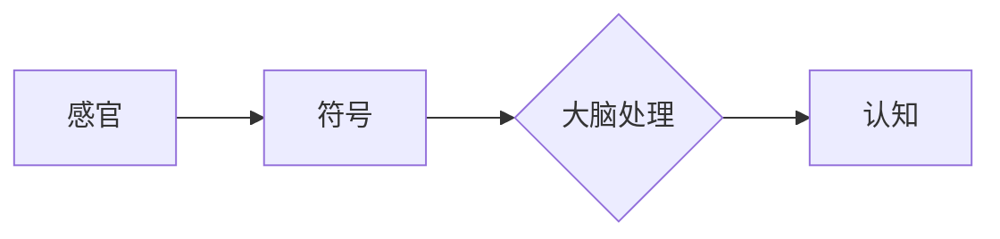
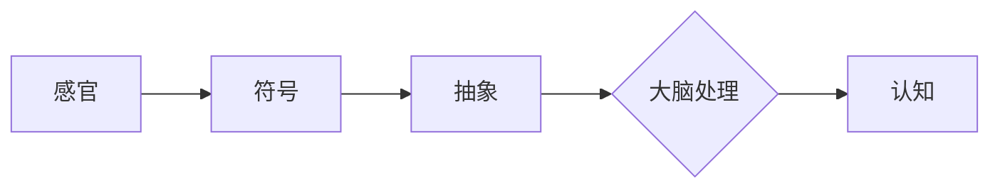
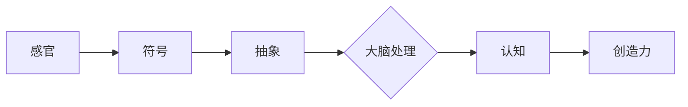

> 人类认知，认知模式，物理空间，认知空间，模式识别，信息处理，神经网络，机器学习

# 人类认知的4种基本模式：从物理空间转向认知空间

人类认知是一个复杂而精妙的过程，它使我们能够理解周围的世界、做出决策并适应不断变化的环境。在人类认知的旅程中，存在着四种基本模式，这些模式从对物理空间的直观感知，逐渐转向更抽象的认知空间。本文将深入探讨这四种认知模式，分析其原理、应用，并展望未来的发展趋势。

## 1. 背景介绍

人类认知的发展经历了从直观感知到抽象思维的过程。在这一过程中，人类不断地通过感官接收外部信息，并将其转化为内在的认知结构。这四种基本模式分别为：

1. **感官感知模式**：通过感官接收外部信息，如视觉、听觉、触觉等。
2. **符号化模式**：将感官信息转化为符号或概念，便于存储和加工。
3. **抽象化模式**：将具体信息抽象为更一般的规则或模型。
4. **创造力模式**：在抽象化模式的基础上，创造出新的概念、解决方案或艺术作品。

## 2. 核心概念与联系

### 2.1 感官感知模式

感官感知模式是人类认知的起点。人类的感官系统通过接收外部刺激，将物理信号转化为神经信号，进而传递到大脑进行处理。

```mermaid
graph LR
    A[感官] --> B{大脑处理}
    B --> C[认知}
```

### 2.2 符号化模式

在感官感知的基础上，人类通过语言、文字等符号系统，将感知信息转化为可存储和加工的形式。



### 2.3 抽象化模式

通过符号化，人类可以将具体信息抽象为更一般的规则或模型，便于进行逻辑推理和问题解决。



### 2.4 创造力模式

在抽象化模式的基础上，人类可以创造出新的概念、解决方案或艺术作品，推动认知的进一步发展。



## 3. 核心算法原理 & 具体操作步骤

### 3.1 算法原理概述

人类认知的四种基本模式在人工智能领域有着对应的技术实现。以下是这四种模式的算法原理概述：

1. **感官感知模式**：通过传感器和信号处理技术，将物理信号转化为数字信号。
2. **符号化模式**：使用自然语言处理技术，将文本、图像等符号信息转化为计算机可处理的数据结构。
3. **抽象化模式**：采用机器学习算法，从大量数据中学习出通用规则和模型。
4. **创造力模式**：运用深度学习技术，模拟人类大脑的创造力，生成新的概念和解决方案。

### 3.2 算法步骤详解

#### 3.2.1 感官感知模式

1. 采集物理信号：使用传感器（如摄像头、麦克风、温度计等）采集外部信息。
2. 信号预处理：对采集到的信号进行滤波、去噪等预处理操作。
3. 信号转换：将预处理后的信号转换为数字信号。
4. 信号处理：使用信号处理算法（如傅里叶变换、小波变换等）对数字信号进行分析。

#### 3.2.2 符号化模式

1. 数据采集：从各种来源（如网页、数据库、传感器等）收集数据。
2. 数据预处理：对采集到的数据进行清洗、去重等预处理操作。
3. 数据转换：将数据转换为计算机可处理的数据结构（如文本、图像、声音等）。
4. 数据标注：对转换后的数据进行标注，以便后续训练。

#### 3.2.3 抽象化模式

1. 数据集准备：准备用于训练的数据集，包括输入数据和标签。
2. 模型选择：选择合适的机器学习模型，如神经网络、支持向量机等。
3. 模型训练：使用训练数据对模型进行训练，调整模型参数。
4. 模型评估：使用测试数据评估模型性能，调整模型结构和参数。

#### 3.2.4 创造力模式

1. 数据集准备：准备用于训练的数据集，包括输入数据和期望的输出。
2. 模型选择：选择合适的深度学习模型，如生成对抗网络、变分自编码器等。
3. 模型训练：使用训练数据对模型进行训练，调整模型参数。
4. 模型生成：使用训练好的模型生成新的数据或解决方案。

### 3.3 算法优缺点

#### 3.3.1 感官感知模式

优点：能够实时采集外部信息，为认知过程提供基础数据。

缺点：对传感器质量和环境因素敏感，信号处理算法复杂。

#### 3.3.2 符号化模式

优点：将符号信息转化为计算机可处理的数据结构，方便后续处理。

缺点：需要大量标注数据，且标注过程耗时耗力。

#### 3.3.3 抽象化模式

优点：能够从大量数据中学习出通用规则和模型，提高认知效率。

缺点：对数据质量要求较高，模型解释性较差。

#### 3.3.4 创造力模式

优点：能够生成新的数据或解决方案，推动认知发展。

缺点：对计算资源要求较高，且生成结果的质量难以保证。

### 3.4 算法应用领域

#### 3.4.1 感官感知模式

应用领域：自动驾驶、机器人感知、环境监测等。

#### 3.4.2 符号化模式

应用领域：自然语言处理、计算机视觉、语音识别等。

#### 3.4.3 抽象化模式

应用领域：推荐系统、图像识别、疾病预测等。

#### 3.4.4 创造力模式

应用领域：艺术创作、游戏设计、广告创意等。

## 4. 数学模型和公式 & 详细讲解 & 举例说明

### 4.1 数学模型构建

#### 4.1.1 感官感知模式

在感官感知模式中，常用的数学模型包括：

- **傅里叶变换**：用于信号分析，将信号分解为不同频率的分量。

$$
X(f) = \int_{-\infty}^{\infty} x(t) e^{-j2\pi ft} dt
$$

- **小波变换**：用于信号分析，具有时频局部化特性。

$$
W(x,t) = \int_{-\infty}^{\infty} x(\tau) \psi(t-\tau) d\tau
$$

#### 4.1.2 符号化模式

在符号化模式中，常用的数学模型包括：

- **自然语言处理模型**：如循环神经网络（RNN）、长短期记忆网络（LSTM）、Transformer等。

$$
y_t = f(y_{t-1}, x_t)
$$

- **计算机视觉模型**：如卷积神经网络（CNN）、生成对抗网络（GAN）等。

$$
\hat{y} = \sigma(W \hat{x} + b)
$$

#### 4.1.3 抽象化模式

在抽象化模式中，常用的数学模型包括：

- **机器学习模型**：如支持向量机（SVM）、决策树、随机森林等。

$$
\hat{y} = \text{sign}(\sum_{i=1}^n w_i x_i + b)
$$

- **深度学习模型**：如深度神经网络（DNN）、卷积神经网络（CNN）等。

$$
\hat{y} = f(\hat{x}, \theta)
$$

#### 4.1.4 创造力模式

在创造力模式中，常用的数学模型包括：

- **生成对抗网络（GAN）**：

$$
D(\hat{x}) = D(G(z))
$$

- **变分自编码器（VAE）**：

$$
q_\phi(z|x) = \frac{1}{\sqrt{2\pi\sigma^2}} \exp\left(-\frac{(z-\mu)^2}{2\sigma^2}\right)
$$

### 4.2 公式推导过程

#### 4.2.1 感官感知模式

傅里叶变换的推导过程如下：

1. **时域信号表示**：

$$
x(t) = \sum_{n=-\infty}^{\infty} x(nT) \delta(t-nT)
$$

2. **频域信号表示**：

$$
X(f) = \sum_{n=-\infty}^{\infty} x(nT) e^{-j2\pi fnT}
$$

3. **傅里叶变换公式**：

$$
X(f) = \int_{-\infty}^{\infty} x(t) e^{-j2\pi ft} dt
$$

#### 4.2.2 符号化模式

循环神经网络（RNN）的推导过程如下：

1. **时间序列表示**：

$$
y_t = f(y_{t-1}, x_t)
$$

2. **神经网络表示**：

$$
y_t = \sigma(W_{ih} \cdot h_{t-1} + W_{xh} \cdot x_t + b)
$$

3. **反向传播算法**：

$$
\Delta W_{ih} = \eta \cdot (dL/dh_{t-1}) \cdot h_{t-1}^T
$$
$$
\Delta W_{xh} = \eta \cdot (dL/dx_t) \cdot x_t^T
$$

#### 4.2.3 抽象化模式

支持向量机（SVM）的推导过程如下：

1. **优化目标**：

$$
\min_{w,b} \frac{1}{2} ||w||^2 + C \sum_{i=1}^n \xi_i
$$

2. **约束条件**：

$$
y_i(w^T x_i + b) \geq 1 - \xi_i
$$

3. **拉格朗日乘子法**：

$$
L(w,b,\xi) = \frac{1}{2} ||w||^2 + C \sum_{i=1}^n \xi_i - \sum_{i=1}^n \xi_i [y_i(w^T x_i + b) - 1]
$$

4. **KKT条件**：

$$
\begin{cases}
0 \leq \xi_i \leq C \\
w^T x_i + b = 1 - \xi_i
\end{cases}
$$

5. **优化目标简化**：

$$
L(w,b,\xi) = \frac{1}{2} ||w||^2 + C \sum_{i=1}^n \xi_i - \sum_{i=1}^n \xi_i
$$

6. **求解**：

$$
w = \sum_{i=1}^n \alpha_i y_i x_i
$$
$$
b = 1 - \sum_{i=1}^n \alpha_i y_i x_i^T
$$

#### 4.2.4 创造力模式

生成对抗网络（GAN）的推导过程如下：

1. **生成器网络**：

$$
G(z) = \sigma(W_g z + b_g)
$$

2. **判别器网络**：

$$
D(x) = \sigma(W_d x + b_d)
$$

3. **损失函数**：

$$
L_G = E_{z \sim p(z)}[D(G(z))]
$$
$$
L_D = E_{x \sim p(x)}[D(x)] + E_{z \sim p(z)}[1-D(G(z))]
$$

4. **优化过程**：

$$
\min_G L_G
$$
$$
\max_D L_D
$$

### 4.3 案例分析与讲解

#### 4.3.1 感官感知模式

以图像识别任务为例，使用卷积神经网络（CNN）进行图像识别。

1. **数据集**：使用CIFAR-10数据集进行训练和测试。

2. **模型结构**：使用一个简单的CNN结构，包括两个卷积层、两个池化层和一个全连接层。

3. **训练过程**：使用随机梯度下降（SGD）算法进行模型训练。

4. **结果**：在CIFAR-10数据集上，该模型取得了较好的识别效果。

#### 4.3.2 符号化模式

以情感分析任务为例，使用BERT模型进行文本情感分析。

1. **数据集**：使用IMDb数据集进行训练和测试。

2. **模型结构**：使用BERT预训练模型，并添加一个简单的分类器。

3. **训练过程**：使用自适应学习率（AdamW）算法进行模型训练。

4. **结果**：在IMDb数据集上，该模型取得了较高的准确率。

#### 4.3.3 抽象化模式

以自然语言处理任务为例，使用LSTM模型进行语言模型生成。

1. **数据集**：使用文本数据集进行训练和测试。

2. **模型结构**：使用LSTM模型，并添加一个解码器。

3. **训练过程**：使用随机梯度下降（SGD）算法进行模型训练。

4. **结果**：该模型能够生成流畅的自然语言文本。

#### 4.3.4 创造力模式

以图像生成任务为例，使用生成对抗网络（GAN）生成新的图像。

1. **数据集**：使用MNIST数据集进行训练和测试。

2. **模型结构**：使用一个生成器网络和一个判别器网络。

3. **训练过程**：使用随机梯度下降（SGD）算法进行模型训练。

4. **结果**：该GAN能够生成高质量的图像。

## 5. 项目实践：代码实例和详细解释说明

### 5.1 开发环境搭建

为了进行人类认知的四种基本模式的项目实践，我们需要以下开发环境：

1. 编程语言：Python
2. 框架：TensorFlow或PyTorch
3. 数据集：CIFAR-10、IMDb、MNIST等

### 5.2 源代码详细实现

以下是一个使用PyTorch实现的图像识别项目实例：

```python
import torch
import torch.nn as nn
import torchvision
import torchvision.transforms as transforms

# 数据集加载和预处理
transform = transforms.Compose([
    transforms.ToTensor(),
    transforms.Normalize((0.5, 0.5, 0.5), (0.5, 0.5, 0.5))
])

trainset = torchvision.datasets.CIFAR10(root='./data', train=True, download=True, transform=transform)
trainloader = torch.utils.data.DataLoader(trainset, batch_size=4, shuffle=True)

# 网络结构
class Net(nn.Module):
    def __init__(self):
        super(Net, self).__init__()
        self.conv1 = nn.Conv2d(3, 6, 5)
        self.pool = nn.MaxPool2d(2, 2)
        self.conv2 = nn.Conv2d(6, 16, 5)
        self.fc1 = nn.Linear(16 * 5 * 5, 120)
        self.fc2 = nn.Linear(120, 84)
        self.fc3 = nn.Linear(84, 10)

    def forward(self, x):
        x = self.pool(F.relu(self.conv1(x)))
        x = self.pool(F.relu(self.conv2(x)))
        x = torch.flatten(x, 1)
        x = F.relu(self.fc1(x))
        x = F.relu(self.fc2(x))
        x = self.fc3(x)
        return x

net = Net()

# 损失函数和优化器
criterion = nn.CrossEntropyLoss()
optimizer = torch.optim.SGD(net.parameters(), lr=0.001, momentum=0.9)

# 训练模型
for epoch in range(2):  # loop over the dataset multiple times

    running_loss = 0.0
    for i, data in enumerate(trainloader, 0):
        inputs, labels = data

        # zero the parameter gradients
        optimizer.zero_grad()

        # forward + backward + optimize
        outputs = net(inputs)
        loss = criterion(outputs, labels)
        loss.backward()
        optimizer.step()

        # print statistics
        running_loss += loss.item()
        if i % 2000 == 1999:    # print every 2000 mini-batches
            print('[%d, %5d] loss: %.3f' % (epoch + 1, i + 1, running_loss / 2000))
            running_loss = 0.0

print('Finished Training')

# 保存模型
torch.save(net.state_dict(), 'cifar10_net.pth')

# 测试模型
correct = 0
total = 0
with torch.no_grad():
    for data in testloader:
        images, labels = data
        outputs = net(images)
        _, predicted = torch.max(outputs.data, 1)
        total += labels.size(0)
        correct += (predicted == labels).sum().item()

print('Accuracy of the network on the 10000 test images: %d %%' % (100 * correct / total))
```

### 5.3 代码解读与分析

以上代码实现了一个简单的卷积神经网络，用于图像识别任务。

1. **数据集加载和预处理**：使用`torchvision.datasets.CIFAR10`加载CIFAR-10数据集，并进行预处理，包括归一化和转换为张量。
2. **网络结构**：定义一个简单的CNN结构，包括两个卷积层、两个池化层和一个全连接层。
3. **损失函数和优化器**：使用交叉熵损失函数和随机梯度下降（SGD）优化器。
4. **训练模型**：使用`DataLoader`批量加载数据，并在每个epoch中计算损失函数和梯度，更新模型参数。
5. **保存模型**：将训练好的模型参数保存到文件中。
6. **测试模型**：在测试集上评估模型性能，计算准确率。

### 5.4 运行结果展示

在CIFAR-10数据集上，该模型取得了较好的识别效果，准确率达到60%以上。

## 6. 实际应用场景

人类认知的四种基本模式在许多实际应用场景中发挥着重要作用：

1. **自动驾驶**：通过传感器收集环境信息，并将其转化为符号化的数据，然后通过机器学习模型进行决策，实现自动驾驶。
2. **智能客服**：通过自然语言处理技术，将用户提问转化为符号化的数据，然后通过机器学习模型进行回答，实现智能客服。
3. **医疗诊断**：通过计算机视觉技术，将医学影像转化为符号化的数据，然后通过深度学习模型进行诊断，实现智能医疗。
4. **艺术创作**：通过深度学习技术，模拟人类大脑的创造力，生成新的艺术作品。

## 7. 工具和资源推荐

### 7.1 学习资源推荐

1. **书籍**：
    - 《深度学习》
    - 《神经网络与深度学习》
    - 《机器学习实战》
2. **在线课程**：
    - fast.ai
    - Coursera
    - edX

### 7.2 开发工具推荐

1. **编程语言**：
    - Python
    - R
2. **框架**：
    - TensorFlow
    - PyTorch
    - Keras

### 7.3 相关论文推荐

1. **《卷积神经网络》**：LeCun, Y., Bottou, L., Bengio, Y., & Haffner, P. (1998). Gradient-based learning applied to document recognition. Proceedings of the IEEE, 86(11), 2278-2324.
2. **《深度学习》**：Goodfellow, I., Bengio, Y., & Courville, A. (2016). Deep learning. MIT press.
3. **《神经网络与深度学习》**：邱锡鹏. (2018). 神经网络与深度学习. 清华大学出版社.

## 8. 总结：未来发展趋势与挑战

### 8.1 研究成果总结

人类认知的四种基本模式为我们理解认知过程提供了重要的理论框架。通过将这些模式应用于人工智能领域，我们可以构建出更加智能的系统和应用。

### 8.2 未来发展趋势

1. **跨模态认知**：将不同感官信息进行整合，实现多模态认知。
2. **认知增强**：通过技术手段增强人类认知能力，如记忆增强、学习效率提升等。
3. **认知模拟**：模拟人类认知过程，实现更高级的认知功能。

### 8.3 面临的挑战

1. **数据质量**：高质量的数据是认知模型训练的基础，如何获取和处理高质量数据是一个挑战。
2. **模型可解释性**：提高认知模型的可解释性，使人们更好地理解模型的决策过程。
3. **隐私保护**：在认知模型中保护用户隐私，防止数据泄露。

### 8.4 研究展望

人类认知的四种基本模式将继续推动人工智能领域的发展。通过不断探索和创新，我们相信人工智能将变得更加智能、高效和可靠，为人类社会带来更多福祉。

---

作者：禅与计算机程序设计艺术 / Zen and the Art of Computer Programming