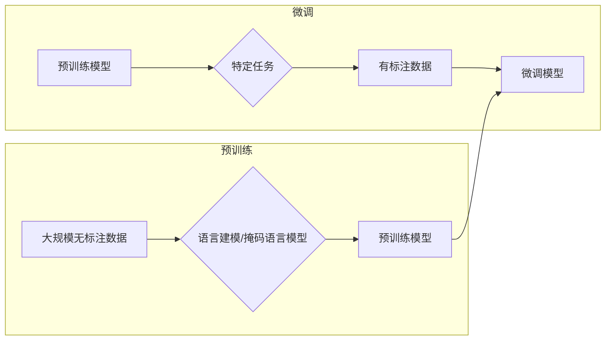

> 关键词：大规模语言模型（LLM），预训练，微调，自然语言处理（NLP），Transformer，BERT，生成式模型，对话系统

# 从关键概念到应用：深入了解大规模语言模型（LLM）

### 1. 背景介绍

随着深度学习技术的飞速发展，自然语言处理（NLP）领域也迎来了前所未有的变革。其中，大规模语言模型（LLM）的出现，极大地推动了NLP技术的进步，使得机器在语言理解和生成方面取得了显著的成果。本文将从关键概念出发，深入探讨LLM的原理、应用和实践，并展望其未来的发展趋势。

### 2. 核心概念与联系

#### 2.1 预训练与微调

**预训练**是指在大规模无标注数据上，通过特定的任务（如语言建模、掩码语言模型等）训练模型，使其学习到丰富的语言知识和通用的语言表征。

**微调**是指将预训练模型应用于特定任务，通过少量有标注数据进一步训练模型，以提升其在特定任务上的性能。

预训练与微调是LLM的两个核心概念，它们相辅相成，共同构成了LLM的强大能力。

#### 2.2 Mermaid 流程图



#### 2.3 Transformer与BERT

**Transformer**是一种基于自注意力机制的深度神经网络模型，其结构简单，参数高效，能够有效捕捉序列数据中的长期依赖关系。

**BERT（Bidirectional Encoder Representations from Transformers）**是基于Transformer的预训练语言模型，通过双向编码器结构，能够学习到更加丰富的语言表征。

Transformer和BERT是LLM中的重要技术基础，它们的出现推动了LLM的发展。

### 3. 核心算法原理 & 具体操作步骤

#### 3.1 算法原理概述

LLM的核心算法包括：

- 预训练：通过语言建模、掩码语言模型等任务，让模型在大规模无标注数据上学习到丰富的语言知识和通用的语言表征。
- 微调：将预训练模型应用于特定任务，通过少量有标注数据进一步训练模型，以提升其在特定任务上的性能。

#### 3.2 算法步骤详解

**预训练步骤**：

1. 准备大规模无标注数据。
2. 设计预训练任务（如语言建模、掩码语言模型等）。
3. 在无标注数据上训练模型，学习语言表征。

**微调步骤**：

1. 准备特定任务的有标注数据。
2. 将预训练模型应用于特定任务，设计任务适配层。
3. 在有标注数据上微调模型，提升其在特定任务上的性能。

#### 3.3 算法优缺点

**优点**：

- 能够处理长文本，捕捉语言中的长期依赖关系。
- 参数高效，计算复杂度较低。
- 能够学习到丰富的语言表征，提升下游任务的性能。

**缺点**：

- 训练数据量需求大，计算资源消耗高。
- 难以解释模型的决策过程。

#### 3.4 算法应用领域

LLM在以下领域取得了显著的应用成果：

- 文本分类
- 命名实体识别
- 机器翻译
- 问答系统
- 对话系统

### 4. 数学模型和公式 & 详细讲解 & 举例说明

#### 4.1 数学模型构建

LLM的数学模型主要基于深度神经网络，以下以BERT为例进行介绍。

**输入层**：将文本序列表示为词向量。

$$ x_t = \text{Word\_To\_Vec}(t) $$

**Transformer编码器**：由多个自注意力层和前馈神经网络层组成。

**输出层**：将编码器的输出映射到特定任务的结果。

$$ y = \text{Output\_Layer}(z) $$

#### 4.2 公式推导过程

**自注意力机制**：

$$
\text{Attention}(Q, K, V) = \frac{e^{QK^T/V}}{\sqrt{d_k}} \times V
$$

**前馈神经网络**：

$$
\text{FFN}(x) = \max(0, \text{ReLU}(W_1 \cdot x \cdot W_2) + b_2)
$$

#### 4.3 案例分析与讲解

以机器翻译任务为例，说明LLM的应用。

1. 预训练：在多语言语料库上预训练BERT模型，学习到多语言之间的语言表征。
2. 微调：收集机器翻译任务的有标注数据，将预训练模型应用于机器翻译任务，设计任务适配层，并在有标注数据上微调模型。
3. 应用：使用微调后的模型进行机器翻译。

### 5. 项目实践：代码实例和详细解释说明

#### 5.1 开发环境搭建

1. 安装PyTorch和transformers库。
2. 准备预训练语言模型和任务数据集。

#### 5.2 源代码详细实现

以下是一个简单的机器翻译任务微调的代码示例：

```python
from transformers import BertForSeq2SeqLM, BertTokenizer

# 加载预训练模型和分词器
model = BertForSeq2SeqLM.from_pretrained('bert-base-uncased')
tokenizer = BertTokenizer.from_pretrained('bert-base-uncased')

# 加载任务数据集
def load_dataset(texts, labels, tokenizer, max_len=128):
    encodings = tokenizer(texts, return_tensors='pt', max_length=max_len, padding='max_length', truncation=True)
    dataset = []
    for i in range(len(texts)):
        dataset.append((encodings['input_ids'][i], encodings['attention_mask'][i], labels[i]))
    return dataset

train_dataset = load_dataset(train_texts, train_labels, tokenizer)
dev_dataset = load_dataset(dev_texts, dev_labels, tokenizer)
test_dataset = load_dataset(test_texts, test_labels, tokenizer)

# 训练模型
def train_model(model, dataset, batch_size, epochs):
    dataloader = DataLoader(dataset, batch_size=batch_size, shuffle=True)
    optimizer = AdamW(model.parameters(), lr=5e-5)
    model.train()
    for epoch in range(epochs):
        for batch in dataloader:
            input_ids, attention_mask, labels = [t.to(device) for t in batch]
            optimizer.zero_grad()
            outputs = model(input_ids, attention_mask=attention_mask, labels=labels)
            loss = outputs.loss
            loss.backward()
            optimizer.step()
    return model

# 微调模型
model = train_model(model, train_dataset, batch_size=16, epochs=3)

# 评估模型
def evaluate_model(model, dataset):
    dataloader = DataLoader(dataset, batch_size=16)
    model.eval()
    total_loss = 0
    with torch.no_grad():
        for batch in dataloader:
            input_ids, attention_mask, labels = [t.to(device) for t in batch]
            outputs = model(input_ids, attention_mask=attention_mask)
            loss = outputs.loss
            total_loss += loss.item()
    return total_loss / len(dataloader)

evaluate_model(model, test_dataset)
```

#### 5.3 代码解读与分析

以上代码展示了如何使用transformers库对预训练模型进行微调。首先，加载预训练模型和分词器，然后加载任务数据集，并定义训练和评估函数。最后，使用训练函数对模型进行微调，并使用评估函数评估模型的性能。

### 6. 实际应用场景

LLM在以下领域取得了显著的应用成果：

- **文本分类**：对文本进行分类，如情感分析、主题分类等。
- **命名实体识别**：识别文本中的实体，如人名、地名、组织名等。
- **机器翻译**：将一种语言的文本翻译成另一种语言。
- **问答系统**：对用户提出的问题给出答案。
- **对话系统**：与用户进行自然语言对话。
- **文本摘要**：将长文本压缩成简短摘要。

### 7. 工具和资源推荐

#### 7.1 学习资源推荐

- **书籍**：
  - 《深度学习自然语言处理》
  - 《自然语言处理实战》
  - 《NLP技术全栈工程师指南》
- **在线课程**：
  - fast.ai的NLP课程
  - 吴恩达的NLP课程
  - 自然语言处理入门与进阶

#### 7.2 开发工具推荐

- **预训练模型**：
  - Hugging Face的Transformers库
  - Google的BERT模型
  - OpenAI的GPT模型
- **深度学习框架**：
  - PyTorch
  - TensorFlow
  - JAX

#### 7.3 相关论文推荐

- **预训练模型**：
  - BERT: Pre-training of Deep Bidirectional Transformers for Language Understanding
  - GPT-3: Language Models are Few-Shot Learners
  - T5: Text-to-Text Transfer Transformer
- **微调方法**：
  - adapters
  - prefix-tuning
  - LoRA

### 8. 总结：未来发展趋势与挑战

#### 8.1 研究成果总结

LLM在NLP领域取得了显著的成果，推动了NLP技术的快速发展。未来，LLM将在以下方面取得更多突破：

- **模型规模将进一步扩大**：随着算力的提升，模型规模将不断扩大，模型性能将进一步提升。
- **多模态融合**：LLM将与其他模态数据进行融合，如图像、语音等，以更好地理解复杂任务。
- **可解释性**：LLM的可解释性将成为研究重点，以提升模型的可信度和透明度。

#### 8.2 未来发展趋势

- **模型规模扩大**：随着计算能力的提升，模型规模将进一步扩大，模型性能将得到进一步提升。
- **多模态融合**：LLM将与其他模态数据进行融合，如图像、语音等，以更好地理解复杂任务。
- **可解释性**：LLM的可解释性将成为研究重点，以提升模型的可信度和透明度。

#### 8.3 面临的挑战

- **计算资源消耗**：LLM的训练和推理需要大量的计算资源，如何降低资源消耗是一个重要挑战。
- **数据隐私**：LLM的训练需要大量数据，如何保护数据隐私是一个重要挑战。
- **可解释性**：LLM的决策过程往往难以解释，如何提升模型的可解释性是一个重要挑战。

#### 8.4 研究展望

LLM的未来发展将朝着以下方向发展：

- **模型压缩**：通过模型压缩技术，降低模型的计算资源消耗。
- **联邦学习**：通过联邦学习技术，保护用户数据隐私。
- **知识增强**：通过知识增强技术，提升模型的可解释性和鲁棒性。

### 9. 附录：常见问题与解答

**Q1：LLM的优缺点是什么？**

A：LLM的优点是能够处理长文本，捕捉语言中的长期依赖关系，参数高效，能够学习到丰富的语言表征。缺点是训练数据量需求大，计算资源消耗高，难以解释模型的决策过程。

**Q2：LLM在哪些领域有应用？**

A：LLM在文本分类、命名实体识别、机器翻译、问答系统、对话系统、文本摘要等领域有广泛应用。

**Q3：如何进行LLM的微调？**

A：首先，选择合适的预训练模型和任务数据集。然后，设计任务适配层，并在有标注数据上微调模型。

**Q4：LLM的未来的发展趋势是什么？**

A：LLM的未来发展趋势包括模型规模扩大、多模态融合、可解释性提升等。

**Q5：LLM面临的挑战有哪些？**

A：LLM面临的挑战包括计算资源消耗、数据隐私、可解释性等。

---

作者：禅与计算机程序设计艺术 / Zen and the Art of Computer Programming