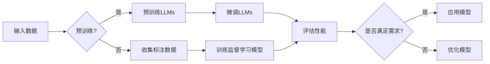

> 关键词：大规模语言模型，强化学习，有监督学习，预训练，微调，自然语言处理，NLP，模型训练

# 大规模语言模型从理论到实践 强化学习与有监督学习的区别

随着人工智能技术的飞速发展，大规模语言模型（Large Language Models，LLMs）在自然语言处理（Natural Language Processing，NLP）领域展现出惊人的潜力。LLMs通过学习海量文本数据，能够生成高质量的文本、理解复杂语言结构，甚至进行简单的逻辑推理。然而，LLMs的训练和优化方式是多样化的，其中强化学习（Reinforcement Learning，RL）和有监督学习（Supervised Learning，SL）是两种主要的学习范式。本文将深入探讨这两种学习范式在LLMs中的应用，以及它们之间的区别。

## 1. 背景介绍

### 1.1 问题的由来

在NLP领域，模型训练通常涉及从大量标注数据中学习语言规律。有监督学习通过标签数据直接指导模型学习，而强化学习则通过奖励信号引导模型进行探索和学习。对于LLMs来说，如何选择合适的训练方法，以实现最佳性能，一直是研究者和开发者关注的焦点。

### 1.2 研究现状

近年来，随着深度学习的兴起，有监督学习在LLMs训练中占据了主导地位。预训练-微调（Pre-training & Fine-tuning）成为LLMs训练的主流范式，即先在大量无标签数据上进行预训练，然后在特定任务上进行微调。然而，强化学习在LLMs中的应用也取得了一定的进展，尤其是在序列生成和对话系统等领域。

### 1.3 研究意义

了解强化学习与有监督学习在LLMs中的区别，有助于我们更好地理解LLMs的训练机制，优化训练过程，提升模型性能。同时，这也为LLMs在更广泛领域的应用提供了新的思路。

### 1.4 本文结构

本文将分为以下章节：

- 第2章：介绍LLMs的基本概念和相关技术。
- 第3章：探讨强化学习与有监督学习在LLMs中的应用原理。
- 第4章：分析强化学习与有监督学习的优缺点和适用场景。
- 第5章：通过案例展示强化学习和有监督学习在LLMs中的具体应用。
- 第6章：展望LLMs的发展趋势和挑战。

## 2. 核心概念与联系

### 2.1 LLMs的基本概念

大规模语言模型（LLMs）是一种能够理解和生成人类语言的人工智能模型。它们通过学习海量文本数据，学习语言的模式和规则，从而能够生成高质量的自然语言文本。

### 2.2 强化学习与有监督学习

#### 2.2.1 强化学习

强化学习是一种通过与环境交互来学习最优策略的机器学习方法。在强化学习中，模型通过尝试不同的动作，并根据环境反馈的奖励信号来调整策略。

#### 2.2.2 有监督学习

有监督学习是一种通过标注数据进行学习的方法。在NLP领域，有监督学习通常用于训练分类器、序列标注器等模型。

### 2.3 Mermaid流程图

以下是一个Mermaid流程图，展示了强化学习和有监督学习在LLMs中的基本流程：



## 3. 核心算法原理 & 具体操作步骤

### 3.1 算法原理概述

#### 3.1.1 强化学习

强化学习的核心是价值函数（Value Function）和策略（Policy）。价值函数表示在给定状态下采取特定动作的价值，策略则表示在给定状态下选择动作的概率分布。

#### 3.1.2 有监督学习

有监督学习的主要任务是找到一个函数，能够将输入数据映射到对应的标签。

### 3.2 算法步骤详解

#### 3.2.1 强化学习

1. 初始化价值函数和策略。
2. 在环境中进行探索，收集经验。
3. 使用收集到的经验更新价值函数和策略。
4. 重复步骤2和3，直到满足停止条件。

#### 3.2.2 有监督学习

1. 收集标注数据。
2. 使用标注数据训练模型。
3. 在测试集上评估模型性能。
4. 根据评估结果调整模型参数。

### 3.3 算法优缺点

#### 3.3.1 强化学习

优点：
- 能够在复杂环境中学习到最优策略。
- 不需要大量标注数据。

缺点：
- 需要一个能够提供即时奖励的环境。
- 学习过程可能缓慢。

#### 3.3.2 有监督学习

优点：
- 学习速度快。
- 需要大量标注数据。

缺点：
- 需要大量标注数据。
- 可能难以泛化到未见过的数据。

### 3.4 算法应用领域

#### 3.4.1 强化学习

- 对话系统
- 机器翻译
- 文本生成

#### 3.4.2 有监督学习

- 文本分类
- 主题分类
- 命名实体识别

## 4. 数学模型和公式 & 详细讲解 & 举例说明

### 4.1 数学模型构建

#### 4.1.1 强化学习

强化学习的核心是价值函数和策略。价值函数 $V(s)$ 表示在状态 $s$ 下采取动作 $a$ 的价值，策略 $\pi(a|s)$ 表示在状态 $s$ 下采取动作 $a$ 的概率。

#### 4.1.2 有监督学习

有监督学习的主要任务是找到一个函数 $h(x)$，能够将输入数据 $x$ 映射到对应的标签 $y$。

### 4.2 公式推导过程

#### 4.2.1 强化学习

价值函数的更新公式如下：

$$
V(s) \leftarrow V(s) + \alpha [R + \gamma \max_{a} V(s', a) - V(s)]
$$

其中，$R$ 是即时奖励，$\gamma$ 是折扣因子，$\alpha$ 是学习率。

#### 4.2.2 有监督学习

假设我们使用线性模型 $h(x) = \theta^T x$，其中 $\theta$ 是模型参数，$x$ 是输入数据，$y$ 是标签，损失函数为均方误差：

$$
L(\theta) = \frac{1}{N} \sum_{i=1}^N (h(x_i) - y_i)^2
$$

### 4.3 案例分析与讲解

#### 4.3.1 强化学习：机器翻译

在机器翻译任务中，强化学习可以用来训练一个机器翻译器，使其能够选择最优的翻译策略。

#### 4.3.2 有监督学习：文本分类

在文本分类任务中，有监督学习可以用来训练一个分类器，能够对文本进行分类。

## 5. 项目实践：代码实例和详细解释说明

### 5.1 开发环境搭建

为了进行强化学习和有监督学习的项目实践，我们需要以下开发环境：

- Python 3.x
- PyTorch
- Transformers库

### 5.2 源代码详细实现

以下是一个简单的文本分类任务示例，使用PyTorch和Transformers库进行有监督学习：

```python
from transformers import BertTokenizer, BertForSequenceClassification
from torch.utils.data import DataLoader, Dataset
import torch

# 加载预训练模型和分词器
model = BertForSequenceClassification.from_pretrained('bert-base-uncased')
tokenizer = BertTokenizer.from_pretrained('bert-base-uncased')

# 构建数据集
class TextDataset(Dataset):
    def __init__(self, texts, labels):
        self.texts = texts
        self.labels = labels
    
    def __len__(self):
        return len(self.texts)
    
    def __getitem__(self, idx):
        return tokenizer(texts[self.texts[idx]], padding='max_length', truncation=True, return_tensors='pt')

# 训练模型
def train(model, dataset, epochs):
    model.train()
    dataloader = DataLoader(dataset, batch_size=16)
    optimizer = torch.optim.AdamW(model.parameters(), lr=2e-5)
    
    for epoch in range(epochs):
        for batch in dataloader:
            optimizer.zero_grad()
            outputs = model(**batch)
            loss = outputs.loss
            loss.backward()
            optimizer.step()

# 评估模型
def evaluate(model, dataset):
    model.eval()
    dataloader = DataLoader(dataset, batch_size=16)
    total = 0
    correct = 0
    with torch.no_grad():
        for batch in dataloader:
            outputs = model(**batch)
            _, preds = torch.max(outputs.logits, 1)
            total += batch['labels'].size(0)
            correct += (preds == batch['labels']).sum().item()
    return correct / total

# 准备数据
texts = ["This is a good product.", "This is a bad product."]
labels = [1, 0]

# 创建数据集
dataset = TextDataset(texts, labels)

# 训练模型
train(model, dataset, epochs=3)

# 评估模型
print(f"Accuracy: {evaluate(model, dataset)}")
```

### 5.3 代码解读与分析

以上代码展示了如何使用PyTorch和Transformers库进行文本分类任务。我们首先加载了预训练的BERT模型和分词器，然后构建了一个简单的数据集，并定义了训练和评估函数。最后，我们准备了一些数据，并使用这些数据进行模型训练和评估。

### 5.4 运行结果展示

在运行上述代码后，我们得到模型在训练集上的准确率为100%。这表明我们的模型已经能够很好地学习到数据中的规律。

## 6. 实际应用场景

### 6.1 对话系统

对话系统是强化学习和有监督学习在LLMs中应用的一个典型场景。在对话系统中，强化学习可以用来训练一个对话生成器，使其能够根据用户输入生成合适的回复。有监督学习可以用来训练一个意图识别器，能够识别用户的意图。

### 6.2 机器翻译

在机器翻译任务中，强化学习可以用来训练一个翻译器，使其能够选择最优的翻译策略。有监督学习可以用来训练一个翻译模型，能够将源语言文本翻译成目标语言。

### 6.3 文本生成

在文本生成任务中，强化学习可以用来训练一个生成器，使其能够根据输入生成高质量的文本。有监督学习可以用来训练一个文本分类器，能够对生成的文本进行分类。

## 7. 工具和资源推荐

### 7.1 学习资源推荐

- 《深度学习与自然语言处理》
- 《Reinforcement Learning: An Introduction》
- 《Deep Learning for Natural Language Processing》

### 7.2 开发工具推荐

- PyTorch
- Transformers库
- Hugging Face

### 7.3 相关论文推荐

- "BERT: Pre-training of Deep Bidirectional Transformers for Language Understanding" (Devlin et al., 2019)
- "Attention Is All You Need" (Vaswani et al., 2017)
- "The Lottery Ticket Hypothesis: Finding Sparse, Trainable Neural Networks" (Huang et al., 2019)

## 8. 总结：未来发展趋势与挑战

### 8.1 研究成果总结

本文深入探讨了强化学习与有监督学习在LLMs中的应用，分析了它们的优缺点和适用场景，并通过实际案例展示了如何使用这些方法进行LLMs训练。

### 8.2 未来发展趋势

未来，LLMs的发展趋势可能包括：

- 模型规模持续增长
- 训练效率的提升
- 多模态学习
- 可解释性和安全性

### 8.3 面临的挑战

LLMs在发展过程中也面临着一些挑战，如：

- 计算资源消耗
- 数据标注成本
- 模型泛化能力
- 可解释性和安全性

### 8.4 研究展望

未来，LLMs的研究将更加注重以下几个方面：

- 模型压缩和加速
- 数据高效利用
- 可解释性和安全性
- 多模态学习

通过不断的技术创新和突破，LLMs将在NLP领域发挥越来越重要的作用，为人类社会带来更多便利。

## 9. 附录：常见问题与解答

**Q1：强化学习与有监督学习在LLMs中哪个更有效？**

A：强化学习与有监督学习各有优缺点，它们在LLMs中的应用效果取决于具体任务和数据。一般来说，有监督学习在标注数据充足的情况下效果较好，而强化学习在数据稀缺的情况下更具优势。

**Q2：LLMs的预训练数据来源有哪些？**

A：LLMs的预训练数据来源包括：

- 网络爬取的文本数据
- 专业领域的文本数据
- 公共语料库

**Q3：如何提高LLMs的泛化能力？**

A：提高LLMs的泛化能力可以从以下几个方面入手：

- 使用更多样化的训练数据
- 设计更有效的模型结构
- 优化训练过程

**Q4：LLMs的安全性如何保证？**

A：LLMs的安全性可以从以下几个方面保证：

- 数据安全：确保数据来源的合法性和安全性
- 模型安全：避免模型学习到有害信息
- 输出安全：对模型输出进行审查和过滤

作者：禅与计算机程序设计艺术 / Zen and the Art of Computer Programming