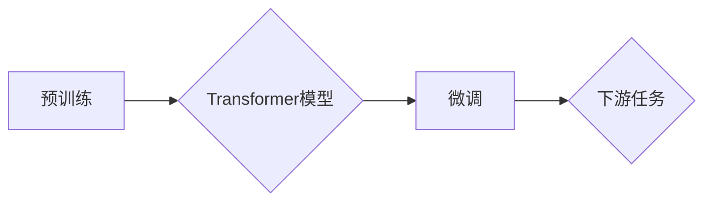

> 关键词：大语言模型，自然语言处理，预训练，Transformer，BERT，微调，代码实例

# 大语言模型 原理与代码实例讲解

大语言模型（Large Language Models，LLMs）是近年来自然语言处理（Natural Language Processing，NLP）领域的重大突破。通过在海量文本数据上预训练，大语言模型能够理解和生成人类语言，并在各种NLP任务上展现出惊人的能力。本文将深入讲解大语言模型的原理，并通过代码实例展示如何实现和使用这些模型。

## 1. 背景介绍

### 1.1 问题的由来

随着互联网和数字化的快速发展，人类产生了海量的文本数据。如何高效地处理这些数据，从文本中提取信息，一直是计算机科学领域的研究热点。传统的NLP方法往往依赖于手工设计的特征和规则，难以处理复杂和多样化的语言现象。而大语言模型的出现，为我们提供了一种全新的解决方案。

### 1.2 研究现状

近年来，以Transformer为代表的深度学习模型在NLP领域取得了突破性的进展。基于这些模型的大语言模型，如BERT、GPT-3等，在各项NLP任务上取得了优异的成绩。这些模型通过在海量无标签文本数据上预训练，学习到了丰富的语言知识，能够有效地处理各种NLP任务。

### 1.3 研究意义

大语言模型的研究对于推动NLP技术的发展具有重要意义。它不仅能够提高NLP任务的效率和准确性，还能够促进NLP技术在各个领域的应用，如智能客服、机器翻译、文本摘要等。

## 2. 核心概念与联系

### 2.1 核心概念原理

大语言模型的核心概念包括：

- **Transformer模型**：一种基于自注意力机制的深度神经网络模型，能够有效地捕捉序列数据中的长距离依赖关系。
- **预训练**：在大规模无标签文本数据上训练模型，学习丰富的语言知识。
- **微调**：在预训练模型的基础上，使用少量标注数据对模型进行优化，以适应特定的NLP任务。

### 2.2 架构的 Mermaid 流程图



## 3. 核心算法原理 & 具体操作步骤

### 3.1 算法原理概述

大语言模型的核心算法是Transformer模型。Transformer模型由编码器和解码器两部分组成，通过自注意力机制和前馈神经网络，能够有效地处理序列数据。

### 3.2 算法步骤详解

1. **预训练**：在大量无标签文本数据上训练Transformer模型，学习语言知识。
2. **微调**：在预训练模型的基础上，使用少量标注数据对模型进行优化。
3. **下游任务**：将微调后的模型应用于具体的NLP任务，如文本分类、问答系统等。

### 3.3 算法优缺点

**优点**：

- **强大的语言理解能力**：通过预训练，大语言模型能够学习到丰富的语言知识，从而在NLP任务上表现出色。
- **泛化能力强**：预训练模型能够适应各种NLP任务，无需针对每个任务重新训练。
- **参数高效**：预训练模型可以通过微调快速适应特定任务。

**缺点**：

- **计算资源需求高**：预训练和微调过程需要大量的计算资源。
- **数据依赖性强**：预训练数据的质量和数量对模型性能有重要影响。

### 3.4 算法应用领域

大语言模型在以下NLP任务上取得了显著成果：

- **文本分类**：如新闻分类、情感分析等。
- **命名实体识别**：如人名识别、地名识别等。
- **机器翻译**：如英译中、中译英等。
- **文本摘要**：如自动生成新闻摘要、摘要生成等。

## 4. 数学模型和公式 & 详细讲解 & 举例说明

### 4.1 数学模型构建

Transformer模型的核心是自注意力机制和前馈神经网络。

- **自注意力机制**：计算序列中每个元素与其他元素之间的注意力权重，并加权求和得到输出。
- **前馈神经网络**：对自注意力机制的输出进行非线性变换。

### 4.2 公式推导过程

自注意力机制的公式如下：

$$
\text{Attention}(Q, K, V) = \text{softmax}(\frac{QK^T}{\sqrt{d_k}})V
$$

其中，$Q$、$K$、$V$ 分别为查询向量、键向量、值向量，$d_k$ 为键向量的维度，$\text{softmax}$ 为softmax函数。

前馈神经网络的公式如下：

$$
\text{FeedForward}(x) = \text{ReLU}(W_1 \cdot \text{Dense}(W_2 \cdot x))
$$

其中，$x$ 为输入向量，$W_1$、$W_2$ 为权重矩阵，$\text{ReLU}$ 为ReLU激活函数，$\text{Dense}$ 为全连接层。

### 4.3 案例分析与讲解

以下是一个简单的Transformer编码器层的代码实现：

```python
import torch
import torch.nn as nn

class TransformerEncoderLayer(nn.Module):
    def __init__(self, d_model, nhead, dim_feedforward=2048, dropout=0.1):
        super(TransformerEncoderLayer, self).__init__()
        self.self_attn = nn.MultiheadAttention(d_model, nhead, dropout=dropout)
        self.linear1 = nn.Linear(d_model, dim_feedforward)
        self.dropout = nn.Dropout(dropout)
        self.linear2 = nn.Linear(dim_feedforward, d_model)
        self.norm1 = nn.LayerNorm(d_model)
        self.norm2 = nn.LayerNorm(d_model)
        self.dropout1 = nn.Dropout(dropout)
        self.dropout2 = nn.Dropout(dropout)

    def forward(self, src, src_mask=None, src_key_padding_mask=None):
        src2 = self.self_attn(src, src, src, attn_mask=src_mask, key_padding_mask=src_key_padding_mask)[0]
        src = src + self.dropout1(src2)
        src = self.norm1(src)
        src2 = self.linear2(self.dropout(nn.functional.relu(self.linear1(src))))
        src = src + self.dropout2(src2)
        src = self.norm2(src)
        return src
```

## 5. 项目实践：代码实例和详细解释说明

### 5.1 开发环境搭建

为了进行大语言模型的实践，我们需要以下开发环境：

- Python 3.6+
- PyTorch 1.8+
- Transformers库

### 5.2 源代码详细实现

以下是一个使用BERT模型进行文本分类的代码实例：

```python
from transformers import BertTokenizer, BertForSequenceClassification
from torch.utils.data import DataLoader, RandomSampler, SequentialSampler
from torch.optim import Adam
from sklearn.metrics import accuracy_score

# 加载预训练模型和分词器
tokenizer = BertTokenizer.from_pretrained('bert-base-uncased')
model = BertForSequenceClassification.from_pretrained('bert-base-uncased')

# 加载数据集
train_texts, train_labels = [...]  # 加载训练数据
dev_texts, dev_labels = [...]  # 加载验证数据

# 编码数据
train_encodings = tokenizer(train_texts, truncation=True, padding=True)
dev_encodings = tokenizer(dev_texts, truncation=True, padding=True)

# 创建DataLoader
train_dataset = torch.utils.data.TensorDataset(
    torch.tensor(train_encodings['input_ids']),
    torch.tensor(train_encodings['attention_mask']),
    torch.tensor(train_labels)
)

train_dataloader = DataLoader(
    train_dataset,
    sampler=RandomSampler(train_dataset),
    batch_size=16
)

dev_dataset = torch.utils.data.TensorDataset(
    torch.tensor(dev_encodings['input_ids']),
    torch.tensor(dev_encodings['attention_mask']),
    torch.tensor(dev_labels)
)

dev_dataloader = DataLoader(
    dev_dataset,
    sampler=SequentialSampler(dev_dataset),
    batch_size=16
)

# 定义优化器
optimizer = Adam(model.parameters(), lr=2e-5)

# 训练模型
model.train()
for epoch in range(3):
    for batch in train_dataloader:
        optimizer.zero_grad()
        inputs = {
            'input_ids': batch[0],
            'attention_mask': batch[1],
            'labels': batch[2],
        }
        outputs = model(**inputs)
        loss = outputs.loss
        loss.backward()
        optimizer.step()
    
    # 验证模型
    model.eval()
    total_correct = 0
    total_samples = 0
    for batch in dev_dataloader:
        inputs = {
            'input_ids': batch[0],
            'attention_mask': batch[1],
        }
        with torch.no_grad():
            outputs = model(**inputs)
            logits = outputs.logits
            predictions = logits.argmax(-1)
            total_correct += (predictions == batch[2]).sum().item()
            total_samples += predictions.numel()
    accuracy = total_correct / total_samples
    print(f"Epoch {epoch+1}, Accuracy: {accuracy:.4f}")
```

### 5.3 代码解读与分析

上述代码展示了如何使用BERT模型进行文本分类的完整流程：

1. 加载预训练模型和分词器。
2. 加载数据集并进行编码。
3. 创建DataLoader，用于批量加载数据。
4. 定义优化器。
5. 训练模型：在前向传播过程中计算损失函数，反向传播过程中更新模型参数。
6. 验证模型：在验证集上评估模型性能。

## 6. 实际应用场景

大语言模型在以下实际应用场景中表现出色：

- **智能客服**：通过自然语言理解，智能客服能够更好地理解用户意图，提供更加个性化的服务。
- **机器翻译**：大语言模型能够实现高质量、低成本的机器翻译，加速跨语言交流。
- **文本摘要**：大语言模型能够自动生成文本摘要，帮助用户快速了解文章的主要内容。
- **问答系统**：大语言模型能够理解用户提问，并提供准确的答案。

## 7. 工具和资源推荐

### 7.1 学习资源推荐

- **书籍**：《深度学习自然语言处理》
- **课程**：斯坦福大学CS224n NLP课程
- **博客**：Hugging Face Blog

### 7.2 开发工具推荐

- **深度学习框架**：PyTorch、TensorFlow
- **NLP库**：Transformers、spaCy

### 7.3 相关论文推荐

- **Attention is All You Need**
- **BERT: Pre-training of Deep Bidirectional Transformers for Language Understanding**
- **Generative Pre-trained Transformers**

## 8. 总结：未来发展趋势与挑战

### 8.1 研究成果总结

大语言模型在NLP领域取得了显著的成果，为各种NLP任务提供了强大的工具。预训练和微调技术使得模型能够快速适应新的任务，提高了NLP任务的效率和准确性。

### 8.2 未来发展趋势

未来，大语言模型将朝着以下方向发展：

- **模型规模将进一步扩大**：更大的模型将能够学习到更丰富的语言知识，从而在更复杂的NLP任务上表现出色。
- **微调技术将更加高效**：参数高效微调、少样本学习等技术的进步，将使得微调过程更加高效。
- **多模态融合**：大语言模型将与图像、视频等多模态信息进行融合，构建更加智能的模型。

### 8.3 面临的挑战

大语言模型的研究和应用也面临着以下挑战：

- **计算资源**：大模型需要大量的计算资源进行训练和推理。
- **数据标注**：高质量的标注数据对于模型训练至关重要。
- **可解释性**：大模型的决策过程难以解释，需要进一步研究可解释性技术。

### 8.4 研究展望

未来，大语言模型的研究将朝着以下方向发展：

- **可解释性和可控性**：研究可解释性技术，提高模型的可信度和可控性。
- **少样本学习**：研究少样本学习技术，降低对标注数据的依赖。
- **多模态融合**：将大语言模型与图像、视频等多模态信息进行融合，构建更加智能的模型。

## 9. 附录：常见问题与解答

**Q1：大语言模型是如何工作的？**

A1：大语言模型通过预训练和微调过程学习语言知识。预训练阶段，模型在大规模无标签文本数据上学习语言知识；微调阶段，模型使用少量标注数据对模型进行优化，以适应特定的NLP任务。

**Q2：大语言模型有哪些应用场景？**

A2：大语言模型在智能客服、机器翻译、文本摘要、问答系统等众多NLP任务上都有广泛应用。

**Q3：如何训练大语言模型？**

A3：训练大语言模型需要大量计算资源和标注数据。可以使用开源框架如PyTorch、TensorFlow等进行训练。

**Q4：大语言模型有哪些局限性？**

A4：大语言模型的主要局限性包括计算资源需求高、对数据标注依赖性强、可解释性差等。

**Q5：大语言模型的发展趋势是什么？**

A5：大语言模型将朝着模型规模扩大、微调技术高效、多模态融合等方向发展。

作者：禅与计算机程序设计艺术 / Zen and the Art of Computer Programming