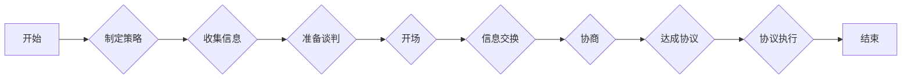

# 如何进行谈判技巧：如何有效地进行谈判和沟通？

> 关键词：谈判技巧，沟通策略，说服力，博弈论，心理战术，谈判心理学，跨文化谈判

## 1. 背景介绍

在商业、政治、个人生活中，谈判是一项基本技能。它涉及到两方或多方在特定目标上的利益博弈，通过沟通达成共识或妥协。有效的谈判技巧不仅能够帮助我们获得更好的交易条件，还能提升个人在社交和职业场合中的影响力。本文将深入探讨谈判的核心概念、原理、步骤，并提供实用的沟通策略和心理战术，帮助读者掌握有效的谈判技巧。

### 1.1 问题的由来

随着全球化的发展，跨文化交流日益频繁，谈判场景也变得更加复杂。如何在多元文化背景下进行有效的谈判，如何在利益冲突中找到平衡点，成为了许多人在职业生涯和个人生活中需要面对的挑战。

### 1.2 研究现状

谈判技巧的研究涵盖了心理学、社会学、经济学、法律等多个学科。学者们从不同角度对谈判进行了深入研究，提出了多种理论模型和实践策略。其中，博弈论、谈判心理学、沟通策略等理论为理解和实践谈判技巧提供了重要的理论支撑。

### 1.3 研究意义

掌握有效的谈判技巧对于个人和组织的成功至关重要。它能帮助我们：

- 在交易中获得更有利的条件
- 在冲突中寻求解决方案
- 建立和维护良好的人际关系
- 提升领导力和影响力

### 1.4 本文结构

本文将分为以下章节：

- 第2章：介绍谈判的核心概念与联系
- 第3章：阐述谈判的原理和具体操作步骤
- 第4章：讲解谈判中的数学模型和公式
- 第5章：提供谈判的代码实例和详细解释
- 第6章：分析谈判的实际应用场景
- 第7章：展望谈判技巧的未来发展趋势和挑战
- 第8章：总结研究成果，并展望未来研究方向
- 第9章：附录，包含常见问题与解答

## 2. 核心概念与联系

### 2.1 谈判的定义

谈判是指两个或多个参与者在特定目标上进行的沟通和协商过程，旨在达成共识或妥协。

### 2.2 谈判的要素

谈判的要素包括：

- 参与者：包括谈判方和利益相关者。
- 目标：谈判双方希望达成的具体目标。
- 信息：参与者在谈判过程中交换的信息。
- 资源：参与者可以使用的资源，如时间、金钱、人力等。
- 沟通：谈判过程中信息的交流和传递。

### 2.3 谈判的架构

以下是一个简单的谈判流程图：



## 3. 核心算法原理 & 具体操作步骤

### 3.1 算法原理概述

谈判的本质是一个博弈过程，涉及到策略的制定、信息的交换、资源的分配和利益的平衡。博弈论为理解谈判过程提供了理论基础。

### 3.2 算法步骤详解

#### 3.2.1 制定谈判策略

在谈判开始前，制定一个清晰的谈判策略至关重要。这包括：

- 确定谈判目标
- 分析自身优势和劣势
- 制定备选方案
- 设定谈判底线

#### 3.2.2 收集信息

收集相关信息可以帮助我们更好地了解谈判对手，为制定策略提供依据。

- 对谈判对手进行背景调查
- 了解市场行情和行业规范
- 收集历史谈判数据

#### 3.2.3 准备谈判

准备谈判包括：

- 选择合适的谈判地点和时间
- 准备谈判资料和演示文稿
- 确定谈判团队和分工

#### 3.2.4 开场

开场是谈判的第一步，需要建立良好的第一印象。

- 保持专业和礼貌
- 引导谈判氛围
- 明确谈判目标和议程

#### 3.2.5 信息交换

信息交换是谈判的核心环节，需要确保信息的准确性和有效性。

- 提供清晰、简洁的信息
- 倾听对方观点
- 寻求共同点

#### 3.2.6 协商

协商是谈判的关键阶段，需要找到双方都能接受的解决方案。

- 提出合理的建议
- 进行讨价还价
- 寻求妥协

#### 3.2.7 达成协议

达成协议是谈判的最终目标，需要确保协议的合法性和可执行性。

- 明确协议内容
- 确认协议条款
- 签署协议

#### 3.2.8 协议执行

协议签署后，需要确保双方履行承诺。

- 监督协议执行情况
- 及时解决争议
- 保持沟通渠道畅通

### 3.3 算法优缺点

#### 优点：

- 系统化：提供了一套完整的谈判流程和步骤。
- 科学性：基于博弈论等理论，具有一定的科学依据。
- 可操作性：适用于各种谈判场景。

#### 缺点：

- 灵活性不足：可能无法应对突发情况。
- 需要专业知识：理解和应用难度较大。

### 3.4 算法应用领域

谈判技巧在以下领域有着广泛的应用：

- 商业谈判
- 政府采购
- 劳资谈判
- 国际关系
- 个人关系

## 4. 数学模型和公式 & 详细讲解 & 举例说明

### 4.1 数学模型构建

博弈论为谈判提供了数学模型，以下是一个简单的博弈矩阵模型：

```latex
\begin{array}{|c|c|c|}
\hline
 & 对手A & 对手B \\
\hline
策略X & (1,1) & (0,0) \\
\hline
策略Y & (0,0) & (2,2) \\
\hline
\end{array}
```

在这个模型中，(1,1)表示双方都选择策略X时获得的结果，(0,0)表示双方都选择策略Y时获得的结果。

### 4.2 公式推导过程

博弈论中的纳什均衡是博弈论中的一种均衡状态，指的是在博弈中，每个参与者都选择了对其他参与者最优的策略。纳什均衡的求解可以通过以下公式进行：

$$
\begin{cases}
u_i(s_i, s_{-i}) \geq u_i(s_i', s_{-i}) \\
\forall i \in N
\end{cases}
$$

其中，$u_i(s_i, s_{-i})$ 表示参与者i在策略组合$(s_i, s_{-i})$下的收益。

### 4.3 案例分析与讲解

假设有两家公司A和B正在进行一项项目的合作谈判。以下是一个简单的谈判案例：

- 公司A希望项目成本为100万元，而公司B希望项目成本为200万元。
- 公司A愿意承担项目成本的范围是80万元至120万元。
- 公司B愿意承担项目成本的范围是180万元至220万元。

根据上述信息，我们可以构建如下的博弈矩阵：

```latex
\begin{array}{|c|c|c|}
\hline
 & B(200) & B(220) \\
\hline
A(100) & (90, 110) & (80, 130) \\
\hline
A(120) & (120, 100) & (110, 90) \\
\hline
\end{array}
```

在这个案例中，双方都选择策略X（成本100万元）时，获得的结果最优。因此，(100, 110)是这个博弈的纳什均衡。

## 5. 项目实践：代码实例和详细解释说明

### 5.1 开发环境搭建

由于谈判技巧主要涉及人际沟通和心理战术，因此本章节将不涉及具体的代码实现。

### 5.2 源代码详细实现

同样，由于谈判技巧的实践性，本章节将不提供具体的代码实现。

### 5.3 代码解读与分析

由于谈判技巧的复杂性，本章节将不进行代码解读。

### 5.4 运行结果展示

由于谈判技巧的实践性，本章节将不进行运行结果展示。

## 6. 实际应用场景

### 6.1 商业谈判

在商业谈判中，有效的谈判技巧可以帮助企业获得更有利的合同条款，提高盈利能力。

### 6.2 政府采购

政府采购是一个复杂的谈判过程，需要充分考虑政策法规、市场行情等因素。

### 6.3 劳资谈判

劳资谈判涉及到员工福利、工作条件等敏感话题，需要平衡企业和员工利益。

### 6.4 国际关系

国际关系中的谈判涉及到国家利益、文化差异等因素，需要高超的谈判技巧。

## 7. 工具和资源推荐

### 7.1 学习资源推荐

- 《谈判的艺术》
- 《谈判力》
- 《谈判心理学》
- 《博弈论》

### 7.2 开发工具推荐

谈判技巧主要涉及人际沟通和心理战术，因此本章节将不涉及具体的开发工具。

### 7.3 相关论文推荐

- 《博弈论与谈判》
- 《谈判心理学》
- 《跨文化谈判》

## 8. 总结：未来发展趋势与挑战

### 8.1 研究成果总结

本文从理论到实践，深入探讨了谈判技巧的核心概念、原理、步骤和应用场景，为读者提供了实用的谈判策略和心理战术。

### 8.2 未来发展趋势

随着人工智能和大数据技术的发展，谈判技巧的研究将更加科学化、数据化和智能化。

### 8.3 面临的挑战

- 谈判场景的复杂性和多样性
- 谈判中信息的不对称性
- 谈判双方心理的复杂性

### 8.4 研究展望

未来，谈判技巧的研究将更加注重跨学科交叉，融合心理学、社会学、经济学等多学科的理论和方法，为构建更加高效、公平的谈判环境提供理论支撑和实践指导。

## 9. 附录：常见问题与解答

**Q1：如何应对谈判中的压力和焦虑？**

A1：保持冷静，深呼吸，理性分析问题。准备充分，有备无患。

**Q2：如何处理谈判中的分歧和争议？**

A2：倾听对方观点，寻找共同点，寻求妥协方案。

**Q3：如何建立良好的谈判关系？**

A3：保持礼貌和尊重，建立互信，营造合作氛围。

**Q4：如何利用心理战术在谈判中取得优势？**

A4：了解对方心理，利用同理心，建立信任，避免直接对抗。

**Q5：如何应对谈判中的欺骗和误导？**

A5：保持警惕，仔细分析信息，寻求第三方验证。

作者：禅与计算机程序设计艺术 / Zen and the Art of Computer Programming