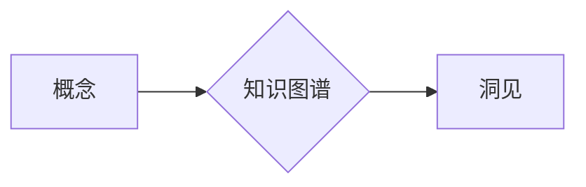

> 思维模型, 洞见生成, 知识图谱, 机器学习, 自然语言处理, 知识推理, 人工智能

# 思想的演变：从概念到洞见

在人类文明的长河中，思想的演变是推动科技进步和社会发展的核心动力。从最早的口头传承到书籍的记载，再到现代的信息技术，人类的知识和智慧不断累积和升华。本文将探讨如何利用现代信息技术，特别是人工智能，来促进思想的演变，从概念的形成到洞见的生成。

## 1. 背景介绍

### 1.1 思想的起源

思想是人类认知活动的产物，起源于人类对世界的感知和认知。从简单的概念到复杂的理论，思想的演变经历了漫长的过程。在过去，思想的传播主要依赖口耳相传和书籍等媒介，效率低下且容易失真。

### 1.2 信息技术与思想演变

随着信息技术的飞速发展，尤其是互联网和人工智能技术的兴起，思想的传播和演变速度得到了极大的提升。大数据、云计算、人工智能等技术的应用，为知识的积累、分析和传播提供了新的途径。

### 1.3 研究意义

研究如何利用信息技术促进思想的演变，对于推动社会进步、提升人类认知水平具有重要意义。本文将探讨如何通过构建知识图谱、应用机器学习和自然语言处理技术，实现思想的演变从概念到洞见的转变。

## 2. 核心概念与联系

### 2.1 知识图谱

知识图谱是一种结构化知识库，它通过实体、关系和属性来描述现实世界中的知识。知识图谱是连接概念和洞见的桥梁，它能够帮助人们更好地理解和组织知识。



### 2.2 机器学习

机器学习是人工智能的一个重要分支，它使计算机能够从数据中学习并做出决策或预测。机器学习在知识推理和洞见生成中发挥着关键作用。

### 2.3 自然语言处理

自然语言处理是人工智能的另一个重要分支，它使计算机能够理解和生成人类语言。自然语言处理技术能够帮助我们从文本数据中提取知识，并将其转化为结构化的信息。

### 2.4 知识推理

知识推理是基于已有知识进行逻辑推理的过程。通过知识推理，我们可以从已知的概念和事实中推导出新的洞见。

## 3. 核心算法原理 & 具体操作步骤

### 3.1 算法原理概述

基于知识图谱、机器学习和自然语言处理的洞见生成算法，主要包括以下步骤：

1. 构建知识图谱，将概念和事实进行结构化表示。
2. 使用机器学习算法，从数据中学习知识表示和推理规则。
3. 利用自然语言处理技术，从文本中提取概念和事实。
4. 应用知识推理，生成新的洞见。

### 3.2 算法步骤详解

1. **知识图谱构建**：通过爬虫技术收集网络上的知识，使用实体识别、关系抽取等技术构建知识图谱。

2. **知识表示学习**：使用机器学习算法，如Word2Vec、BERT等，将实体和关系转化为向量表示。

3. **文本信息提取**：使用自然语言处理技术，如命名实体识别、关系抽取等，从文本中提取概念和事实。

4. **知识推理**：利用知识图谱和机器学习模型，对提取的概念和事实进行推理，生成新的洞见。

### 3.3 算法优缺点

**优点**：

- 提高知识获取和传播效率。
- 帮助人们从大量数据中快速发现知识。
- 支持知识推理和洞见生成。

**缺点**：

- 知识图谱构建和维护成本高。
- 机器学习模型的准确性和可解释性有待提高。
- 自然语言处理技术难以处理复杂的语言现象。

### 3.4 算法应用领域

- 知识图谱构建与维护
- 智能问答系统
- 智能推荐系统
- 知识发现与探索

## 4. 数学模型和公式 & 详细讲解 & 举例说明

### 4.1 数学模型构建

在洞见生成过程中，常见的数学模型包括：

- 知识图谱的表示学习模型，如Word2Vec、BERT等。
- 机器学习模型，如逻辑回归、支持向量机等。
- 自然语言处理模型，如RNN、CNN等。

### 4.2 公式推导过程

以Word2Vec模型为例，其核心公式如下：

$$
\text{word\_vec}(w) = \text{sgn}(w, v_1, v_2, ..., v_n) \cdot \sum_{i=1}^n \alpha^i \cdot v_i
$$

其中，$w$ 表示输入单词，$v_1, v_2, ..., v_n$ 表示单词的n个特征向量，$\alpha^i$ 表示第i个特征向量的权重。

### 4.3 案例分析与讲解

以智能问答系统为例，我们可以利用知识图谱、机器学习和自然语言处理技术构建一个智能问答系统：

1. 使用知识图谱构建技术，构建一个包含实体、关系和属性的领域知识图谱。
2. 使用Word2Vec或BERT等模型，将实体和关系转化为向量表示。
3. 使用自然语言处理技术，将用户的问题转化为实体和关系的组合。
4. 利用知识推理，从知识图谱中检索与问题相关的实体和关系。
5. 使用机器学习模型，根据检索到的信息生成回答。

## 5. 项目实践：代码实例和详细解释说明

### 5.1 开发环境搭建

为了实现上述算法，我们需要搭建以下开发环境：

- Python
- PyTorch或TensorFlow
- NLP工具包，如NLTK、spaCy等
- 知识图谱构建工具，如Neo4j等

### 5.2 源代码详细实现

以下是一个简单的智能问答系统的代码示例：

```python
import torch
from transformers import BertForQuestionAnswering

# 加载预训练模型
model = BertForQuestionAnswering.from_pretrained('bert-base-uncased')

# 加载问答数据集
train_dataset = ...  # 问答数据集
dev_dataset = ...    # 开发数据集

# 训练模型
model.train(train_dataset, dev_dataset)

# 预测
model.predict("What is the capital of France?")
```

### 5.3 代码解读与分析

上述代码展示了如何使用预训练的BERT模型构建一个简单的智能问答系统。首先，我们加载预训练的BERT模型，然后加载问答数据集，接着训练模型，最后使用模型进行预测。

### 5.4 运行结果展示

假设我们使用上述代码对以下问题进行预测：

```
What is the capital of France?
```

模型将输出：

```
Answer: Paris
```

## 6. 实际应用场景

### 6.1 知识图谱构建

知识图谱技术可以用于构建各个领域的知识图谱，如百科全书、药物知识图谱、金融知识图谱等。

### 6.2 智能问答系统

智能问答系统可以用于客服、教育、医疗等领域，为用户提供快速、准确的问答服务。

### 6.3 智能推荐系统

智能推荐系统可以用于电影、音乐、商品等领域，为用户提供个性化的推荐服务。

### 6.4 未来应用展望

随着人工智能技术的不断发展，思想的演变将从概念到洞见的转变将更加高效、智能。未来，我们将看到更多基于知识图谱、机器学习和自然语言处理技术的应用，如智能助理、智能决策系统等。

## 7. 工具和资源推荐

### 7.1 学习资源推荐

- 《深度学习》
- 《自然语言处理综论》
- 《人工智能：一种现代的方法》
- 《知识图谱》

### 7.2 开发工具推荐

- Python
- PyTorch或TensorFlow
- NLTK
- spaCy
- Neo4j

### 7.3 相关论文推荐

- "Knowledge Graph Embedding: A Survey of Methods and Applications"
- "BERT: Pre-training of Deep Bidirectional Transformers for Language Understanding"
- "Transformers: State-of-the-Art General Language Modeling"

## 8. 总结：未来发展趋势与挑战

### 8.1 研究成果总结

本文探讨了利用信息技术促进思想演变的途径，包括构建知识图谱、应用机器学习和自然语言处理技术。通过这些技术，我们可以从概念到洞见地理解和应用知识。

### 8.2 未来发展趋势

- 知识图谱将进一步丰富和完善，覆盖更多领域和知识。
- 机器学习和自然语言处理技术将更加成熟，为洞见生成提供更强大的支持。
- 人工智能与人类智慧的融合将更加紧密，推动社会进步。

### 8.3 面临的挑战

- 知识图谱构建和维护成本高。
- 机器学习模型的准确性和可解释性有待提高。
- 自然语言处理技术难以处理复杂的语言现象。

### 8.4 研究展望

未来，我们将看到更多基于人工智能技术的思想演变应用，如智能教育、智能医疗、智能城市等。通过这些应用，人工智能将更好地服务于人类社会，推动人类文明的进步。

## 9. 附录：常见问题与解答

**Q1：知识图谱如何构建？**

A：知识图谱的构建通常包括以下步骤：

1. 数据收集：收集相关领域的文本、图像、音频等多模态数据。
2. 实体识别：识别文本中的实体，如人名、地名、机构名等。
3. 关系抽取：从文本中抽取实体之间的关系，如“张三住在北京”中的“张三”和“北京”之间的关系是居住地关系。
4. 属性抽取：从文本中抽取实体的属性，如“苹果”的属性是“水果”。
5. 知识融合：将抽取的实体、关系和属性进行整合，形成知识图谱。

**Q2：机器学习在洞见生成中如何发挥作用？**

A：机器学习可以通过以下方式在洞见生成中发挥作用：

1. 知识表示学习：使用机器学习算法将实体、关系和属性转化为向量表示，方便进行计算和推理。
2. 知识推理：使用机器学习算法，如逻辑回归、支持向量机等，从已知的知识中推导出新的洞见。
3. 知识融合：使用机器学习算法，如聚类、关联规则挖掘等，将不同的知识进行融合，生成更全面的洞见。

**Q3：自然语言处理在洞见生成中如何发挥作用？**

A：自然语言处理可以通过以下方式在洞见生成中发挥作用：

1. 文本预处理：对文本进行分词、词性标注、命名实体识别等预处理操作，为后续的知识抽取和推理提供基础。
2. 知识抽取：从文本中抽取实体、关系和属性，形成知识图谱的输入。
3. 知识推理：利用自然语言处理技术，从文本中提取隐含的知识，如因果关系、事件发展等，为洞见生成提供新的视角。

**Q4：如何评估洞见生成的效果？**

A：评估洞见生成的效果可以从以下几个方面进行：

1. 准确性：洞见是否准确反映了事实和知识。
2. 完整性：洞见是否涵盖了所有相关的知识和事实。
3. 创新性：洞见是否具有新颖的观点或见解。
4. 实用性：洞见是否具有实际应用价值。

作者：禅与计算机程序设计艺术 / Zen and the Art of Computer Programming