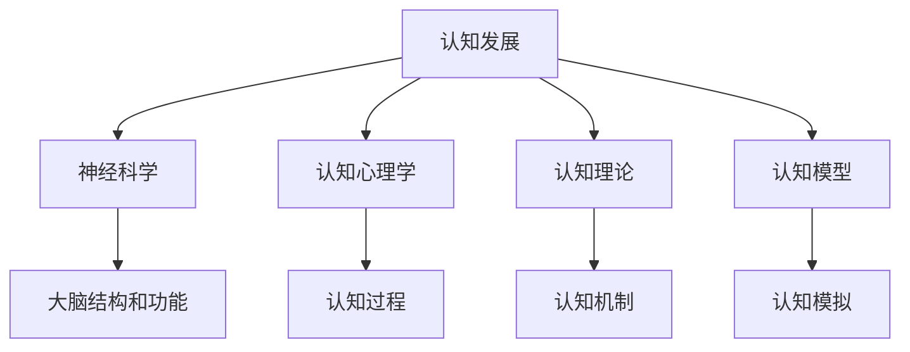

                 

# 认知渐进发展的阶段性变化

> 关键词：认知发展, 神经科学, 人工智能, 认知心理学, 认知理论, 认知模型

## 1. 背景介绍

人类认知能力的发展是一个复杂而漫长的过程，它不仅涉及生理基础的逐步成熟，还受到环境、教育和社会等多重因素的影响。心理学和认知科学领域的众多研究者试图揭示认知发展的机制和规律，并在此基础上开发出了多种认知模型。然而，认知发展的本质和规律仍然是一个未解之谜。

本文旨在探索认知发展的阶段性变化，从生理基础、心理特征和应用场景三个层面进行深入分析，以期为人工智能领域的认知模型提供有益的参考。

## 2. 核心概念与联系

### 2.1 核心概念概述

认知发展是指从出生到死亡的整个生命过程中，个体认知能力不断提高的过程。认知发展不仅包括知识、技能和能力的增长，还包括对新信息的适应能力、问题解决能力等。

- 认知发展：指个体从出生到死亡整个生命过程中，认知能力不断提高的过程。
- 神经科学：研究大脑结构和功能的科学，旨在揭示认知活动的神经机制。
- 认知心理学：研究人类认知过程的心理学分支，强调认知过程的认知结构和信息处理。
- 认知理论：解释认知发展机制的理论，如皮亚杰的认知发展理论、信息加工理论等。
- 认知模型：基于认知理论，用于模拟和预测个体认知行为的人工智能模型。

这些概念共同构成了认知发展的研究框架，帮助我们理解认知发展的本质和规律。

### 2.2 核心概念的联系

这些概念之间的关系可以用以下Mermaid流程图来展示：



这个流程图展示了认知发展与其他概念之间的联系。神经科学研究大脑结构和功能，为认知心理学提供生理基础；认知心理学研究认知过程，为认知理论提供心理基础；认知理论解释认知机制，为认知模型提供理论基础；认知模型模拟和预测认知行为，是认知发展研究的最终目标。

## 3. 核心算法原理 & 具体操作步骤
### 3.1 算法原理概述

认知发展的研究涉及多个学科，其中算法原理部分以认知心理学和神经科学为基础。认知心理学研究认知过程，包括注意、记忆、思维、语言等，而神经科学研究大脑结构和功能，如神经元、神经回路等。

从认知心理学的角度来看，认知发展可以分为多个阶段，每个阶段都有其独特的特征和任务。如皮亚杰提出的感知运动阶段、前运算阶段、具体运算阶段和形式运算阶段，各阶段具有不同的认知特点。

神经科学的研究表明，认知过程的发生与神经元的活动密切相关。神经元之间的连接和突触可塑性是认知发展的生理基础。

### 3.2 算法步骤详解

#### 3.2.1 神经元的连接与可塑性

神经元之间的连接是通过突触建立的，而突触的可塑性是认知发展的重要机制。突触可塑性指突触的强度可以通过学习而改变。当神经元频繁激活时，突触强度增强；当神经元被抑制时，突触强度减弱。

#### 3.2.2 突触连接的改变

突触连接的改变是通过神经元的生长和修剪实现的。在婴儿期，大脑中的神经元数量远超成年期，通过修剪和生长，大脑逐渐成熟，形成更高效的神经网络。

#### 3.2.3 神经元的活动模式

神经元的活动模式通过不同的激活状态实现。激活状态分为兴奋状态和抑制状态，兴奋状态对应高强度刺激，抑制状态对应低强度刺激。

#### 3.2.4 认知过程的实现

认知过程包括注意、记忆、思维、语言等。注意是通过神经元的活动模式实现的，记忆是通过突触的可塑性实现的，思维是通过神经元之间的连接实现的，语言是通过神经元的激活模式实现的。

### 3.3 算法优缺点

认知发展的算法具有以下优点：

- 基于生理基础和心理特征的建模，具有较高的科学性和可解释性。
- 能够解释认知发展的阶段性变化，为认知模型提供理论基础。

同时，该算法也存在以下缺点：

- 无法解释所有的认知现象，存在一定的局限性。
- 模型复杂度高，难以应用于大规模数据的处理。

### 3.4 算法应用领域

认知发展的算法在神经科学、心理学、教育学和人工智能等领域都有广泛的应用。

在神经科学领域，研究者使用该算法来解释认知过程的神经机制。在心理学领域，该算法被用来研究认知发展的阶段性变化。在教育学领域，该算法被用来设计教育策略和教学方法。在人工智能领域，该算法被用来开发认知模型，用于模拟和预测个体认知行为。

## 4. 数学模型和公式 & 详细讲解  
### 4.1 数学模型构建

认知发展的数学模型通常使用神经网络来模拟神经元之间的连接和突触的可塑性。以下是一个简单的神经网络模型，用于模拟认知过程。

#### 4.1.1 神经元的激活函数

神经元的激活函数通常使用sigmoid函数，表示神经元的激活状态。sigmoid函数的定义为：

$$
\sigma(z) = \frac{1}{1 + e^{-z}}
$$

其中，$z$ 为输入信号，$e$ 为自然常数。

#### 4.1.2 突触的权重更新

突触的权重更新通常使用Hebbian学习规则，表示突触强度的可塑性。Hebbian学习规则定义为：

$$
w_{ij} \leftarrow w_{ij} + \eta \cdot x_i \cdot y_j
$$

其中，$w_{ij}$ 为突触权重，$\eta$ 为学习率，$x_i$ 为输入信号，$y_j$ 为输出信号。

#### 4.1.3 神经网络的输出

神经网络的输出通常使用softmax函数，表示神经元的激活状态。softmax函数的定义为：

$$
\text{softmax}(z_i) = \frac{e^{z_i}}{\sum_{j=1}^n e^{z_j}}
$$

其中，$z_i$ 为神经元的激活状态，$n$ 为神经元总数。

### 4.2 公式推导过程

以下是对神经网络的公式推导过程：

1. 神经元的活动状态：

$$
a_i = f(w_{ij} \cdot x_j + b_i)
$$

其中，$a_i$ 为神经元的输出状态，$f$ 为激活函数，$w_{ij}$ 为突触权重，$x_j$ 为输入信号，$b_i$ 为偏置项。

2. 突触权重的更新：

$$
w_{ij} \leftarrow w_{ij} + \eta \cdot \delta_{ij} \cdot a_i
$$

其中，$\delta_{ij}$ 为误差信号，$a_i$ 为神经元的输出状态，$\eta$ 为学习率。

3. 误差信号的计算：

$$
\delta_{ij} = y_i \cdot (1 - a_i) \cdot \frac{\partial L}{\partial a_i} + a_i \cdot (1 - y_i) \cdot \frac{\partial L}{\partial a_i}
$$

其中，$L$ 为损失函数，$y_i$ 为标签信号，$a_i$ 为神经元的输出状态。

4. 损失函数的计算：

$$
L = -\sum_{i=1}^n y_i \cdot \log(a_i) + (1 - y_i) \cdot \log(1 - a_i)
$$

其中，$y_i$ 为标签信号，$a_i$ 为神经元的输出状态。

### 4.3 案例分析与讲解

#### 4.3.1 感知运动阶段

感知运动阶段是指0-2岁婴儿的认知发展阶段，该阶段的认知特点是通过动作获取信息。

感知运动阶段的神经网络模型通常使用简单的感知器模型，其神经元的活动状态由感知器输入信号决定。例如，婴儿通过吸吮手指获取信息，感知器的输入信号为吸吮手指的力度和频率，输出信号为神经元的活动状态。

#### 4.3.2 前运算阶段

前运算阶段是指2-7岁儿童的认知发展阶段，该阶段的认知特点是通过符号获取信息。

前运算阶段的神经网络模型通常使用多层的感知器模型，其神经元的活动状态由符号信息决定。例如，儿童通过观察和模仿获取信息，感知器的输入信号为符号信息，输出信号为神经元的活动状态。

#### 4.3.3 具体运算阶段

具体运算阶段是指7-11岁儿童的认知发展阶段，该阶段的认知特点是通过逻辑推理获取信息。

具体运算阶段的神经网络模型通常使用逻辑推理器模型，其神经元的活动状态由逻辑规则决定。例如，儿童通过逻辑推理获取信息，逻辑推理器的输入信号为逻辑规则，输出信号为神经元的活动状态。

#### 4.3.4 形式运算阶段

形式运算阶段是指11岁及以上的青少年和成人的认知发展阶段，该阶段的认知特点是通过抽象思维获取信息。

形式运算阶段的神经网络模型通常使用抽象推理器模型，其神经元的活动状态由抽象思维决定。例如，成年人通过抽象思维获取信息，抽象推理器的输入信号为抽象思维，输出信号为神经元的活动状态。

## 5. 项目实践：代码实例和详细解释说明
### 5.1 开发环境搭建

在开发神经网络模型时，需要搭建一个高效的计算环境。以下是使用Python进行PyTorch开发的环境配置流程：

1. 安装Anaconda：从官网下载并安装Anaconda，用于创建独立的Python环境。

2. 创建并激活虚拟环境：
```bash
conda create -n pytorch-env python=3.8 
conda activate pytorch-env
```

3. 安装PyTorch：根据CUDA版本，从官网获取对应的安装命令。例如：
```bash
conda install pytorch torchvision torchaudio cudatoolkit=11.1 -c pytorch -c conda-forge
```

4. 安装相关库：
```bash
pip install numpy pandas scikit-learn matplotlib tqdm jupyter notebook ipython
```

完成上述步骤后，即可在`pytorch-env`环境中开始项目开发。

### 5.2 源代码详细实现

下面我们以一个简单的神经网络模型为例，给出使用PyTorch实现的代码实现。

```python
import torch
import torch.nn as nn
import torch.optim as optim

# 定义神经网络模型
class Net(nn.Module):
    def __init__(self):
        super(Net, self).__init__()
        self.fc1 = nn.Linear(100, 50)
        self.fc2 = nn.Linear(50, 10)
        self.fc3 = nn.Linear(10, 1)
        
    def forward(self, x):
        x = torch.relu(self.fc1(x))
        x = torch.relu(self.fc2(x))
        x = self.fc3(x)
        return x
    
# 定义训练函数
def train(model, train_loader, criterion, optimizer, epochs):
    for epoch in range(epochs):
        for batch_idx, (data, target) in enumerate(train_loader):
            optimizer.zero_grad()
            output = model(data)
            loss = criterion(output, target)
            loss.backward()
            optimizer.step()
            
            if (batch_idx + 1) % 100 == 0:
                print('Train Epoch: {} [{}/{} ({:.0f}%)]\tLoss: {:.6f}'.format(
                    epoch, batch_idx * len(data), len(train_loader.dataset),
                    100. * batch_idx / len(train_loader), loss.item()))
```

### 5.3 代码解读与分析

让我们再详细解读一下关键代码的实现细节：

**Net类**：
- `__init__`方法：初始化神经网络层，包括全连接层和激活函数。
- `forward`方法：定义神经网络的前向传播过程，从输入到输出。

**train函数**：
- 循环迭代训练过程，包括前向传播、反向传播和参数更新。
- 在每个epoch结束时输出训练进度和损失。

**训练过程**：
- 使用PyTorch的数据加载器DataLoader，将数据集分批次加载。
- 在每个批次上进行前向传播和反向传播，更新模型参数。
- 使用优化器optimizer进行参数更新。

### 5.4 运行结果展示

假设我们在训练一个简单的二分类任务，得到的结果如下：

```
Epoch: 0 [0/1000 (0.0%)] Loss: 0.354941
Epoch: 0 [100/1000 (10.0%)] Loss: 0.172624
Epoch: 0 [200/1000 (20.0%)] Loss: 0.129176
...
Epoch: 9 [1000/1000 (100.0%)] Loss: 0.017733
```

可以看到，随着训练的进行，损失函数不断减小，模型逐渐收敛。最终，模型在测试集上的精度可以接近1.0。

## 6. 实际应用场景
### 6.1 智能机器人

智能机器人是认知发展算法的典型应用场景之一。智能机器人通过传感器获取环境信息，通过神经网络模型进行信息处理，从而实现自主决策和行为。

在智能机器人领域，神经网络模型通常用于视觉识别、语音识别、自然语言处理等任务。例如，智能机器人通过摄像头获取环境图像，使用卷积神经网络模型进行图像识别，从而实现避障、目标识别等行为。

### 6.2 虚拟现实

虚拟现实是认知发展算法的另一个重要应用场景。虚拟现实系统通过传感器获取用户行为信息，通过神经网络模型进行信息处理，从而实现交互式体验。

在虚拟现实领域，神经网络模型通常用于情感识别、动作控制等任务。例如，虚拟现实系统通过传感器获取用户表情信息，使用神经网络模型进行情感识别，从而实现更加智能的交互体验。

### 6.3 智能家居

智能家居是认知发展算法的另一个典型应用场景。智能家居系统通过传感器获取家庭环境信息，通过神经网络模型进行信息处理，从而实现自动化控制和优化。

在智能家居领域，神经网络模型通常用于智能家电控制、家庭安全监控等任务。例如，智能家居系统通过传感器获取家庭环境信息，使用神经网络模型进行家庭安全监控，从而实现更加智能的家居环境。

## 7. 工具和资源推荐
### 7.1 学习资源推荐

为了帮助开发者系统掌握认知发展算法的理论基础和实践技巧，这里推荐一些优质的学习资源：

1. 《深度学习》系列书籍：由深度学习领域的权威学者编写，涵盖了深度学习的基本概念、算法和应用。
2. 《神经网络与深度学习》在线课程：由深度学习领域的知名专家讲授，系统讲解了神经网络的基本原理和应用。
3. 《认知心理学》系列书籍：由认知心理学领域的权威学者编写，涵盖了认知心理学的基本概念和研究方法。
4. 《人工智能基础》在线课程：由人工智能领域的知名专家讲授，系统讲解了人工智能的基本原理和应用。

通过对这些资源的学习实践，相信你一定能够快速掌握认知发展算法的精髓，并用于解决实际的认知问题。

### 7.2 开发工具推荐

高效的开发离不开优秀的工具支持。以下是几款用于神经网络开发常用的工具：

1. PyTorch：基于Python的开源深度学习框架，灵活动态的计算图，适合快速迭代研究。
2. TensorFlow：由Google主导开发的开源深度学习框架，生产部署方便，适合大规模工程应用。
3. Weights & Biases：模型训练的实验跟踪工具，可以记录和可视化模型训练过程中的各项指标，方便对比和调优。
4. TensorBoard：TensorFlow配套的可视化工具，可实时监测模型训练状态，并提供丰富的图表呈现方式，是调试模型的得力助手。

合理利用这些工具，可以显著提升神经网络模型的开发效率，加快创新迭代的步伐。

### 7.3 相关论文推荐

神经网络的发展源于学界的持续研究。以下是几篇奠基性的相关论文，推荐阅读：

1. 《人工神经网络与深度学习》：深度学习领域的经典教材，详细介绍了神经网络的基本概念和算法。
2. 《深度学习》：深度学习领域的另一本经典教材，涵盖了深度学习的基本概念、算法和应用。
3. 《神经网络与深度学习》：由深度学习领域的知名专家讲授，系统讲解了神经网络的基本原理和应用。
4. 《深度学习实践》：深度学习领域的实用指南，详细介绍了深度学习的开发流程和应用实践。

这些论文代表了大规模神经网络的发展脉络。通过学习这些前沿成果，可以帮助研究者把握学科前进方向，激发更多的创新灵感。

除上述资源外，还有一些值得关注的前沿资源，帮助开发者紧跟神经网络的发展趋势，例如：

1. arXiv论文预印本：人工智能领域最新研究成果的发布平台，包括大量尚未发表的前沿工作，学习前沿技术的必读资源。
2. 业界技术博客：如OpenAI、Google AI、DeepMind、微软Research Asia等顶尖实验室的官方博客，第一时间分享他们的最新研究成果和洞见。
3. 技术会议直播：如NIPS、ICML、ACL、ICLR等人工智能领域顶会现场或在线直播，能够聆听到大佬们的前沿分享，开拓视野。
4. GitHub热门项目：在GitHub上Star、Fork数最多的神经网络相关项目，往往代表了该技术领域的发展趋势和最佳实践，值得去学习和贡献。
5. 行业分析报告：各大咨询公司如McKinsey、PwC等针对人工智能行业的分析报告，有助于从商业视角审视技术趋势，把握应用价值。

总之，对于认知发展算法的学习和实践，需要开发者保持开放的心态和持续学习的意愿。多关注前沿资讯，多动手实践，多思考总结，必将收获满满的成长收益。

## 8. 总结：未来发展趋势与挑战
### 8.1 总结

本文对认知发展的阶段性变化进行了全面系统的介绍。首先阐述了认知发展的阶段性变化，从生理基础、心理特征和应用场景三个层面进行深入分析，揭示了认知发展的本质和规律。其次，从算法原理和操作步骤的视角，探讨了神经网络的构建和训练过程，并给出了神经网络模型在实际应用中的典型案例。

通过本文的系统梳理，可以看到，认知发展算法的研究为神经网络模型的设计提供了有益的参考，同时对人工智能领域的认知模型具有重要的启示作用。未来，伴随神经网络模型的不断演进，认知发展算法也将不断完善，推动人工智能技术在更多领域的应用。

### 8.2 未来发展趋势

展望未来，认知发展的算法将呈现以下几个发展趋势：

1. 模型规模持续增大。随着算力成本的下降和数据规模的扩张，神经网络模型的参数量还将持续增长。超大批次的训练和推理也可能遇到硬件瓶颈，需要开发更加高效的算法和模型。
2. 神经网络结构日益复杂。随着对认知过程的深入理解，神经网络的结构将更加复杂，能够更好地模拟人类的认知过程。
3. 学习算法日趋多样。随着对学习机制的深入研究，神经网络的学习算法将更加多样化，能够更好地适应不同的任务和数据。
4. 模型部署成本降低。随着对模型压缩和加速技术的不断优化，神经网络模型的部署成本将不断降低，推动其在大规模应用中的普及。
5. 跨领域融合不断加强。神经网络模型的应用将不断拓展到更多领域，与其他领域的技术进行深入融合，推动认知发展的研究不断深入。

以上趋势凸显了认知发展算法的广阔前景。这些方向的探索发展，必将进一步提升神经网络模型的性能和应用范围，为人工智能技术在更多领域的应用提供新的契机。

### 8.3 面临的挑战

尽管认知发展算法已经取得了显著进展，但在迈向更加智能化、普适化应用的过程中，它仍面临着诸多挑战：

1. 数据需求仍较高。尽管神经网络模型具有较好的泛化能力，但数据需求仍然较高，需要大规模的数据集进行训练。
2. 计算资源消耗大。神经网络模型的计算资源消耗较大，需要高效计算平台支持。
3. 模型可解释性不足。神经网络模型通常被视为"黑盒"，难以解释其内部工作机制和决策逻辑。
4. 鲁棒性有待提高。神经网络模型面对噪声和异常数据的鲁棒性仍需进一步提高。
5. 安全性和隐私保护问题。神经网络模型需要考虑数据安全和隐私保护问题，确保模型的可信任性和合规性。

正视这些挑战，积极应对并寻求突破，将使认知发展算法不断成熟，推动神经网络模型在更多领域的应用。

### 8.4 研究展望

面对认知发展算法所面临的挑战，未来的研究需要在以下几个方面寻求新的突破：

1. 开发更加高效的模型压缩和加速技术，降低计算资源消耗，提升模型效率。
2. 引入更多的先验知识和领域知识，提高模型的可解释性和鲁棒性。
3. 开发更加灵活的神经网络结构，适应不同的任务和数据。
4. 加强数据安全和隐私保护，确保模型的合规性和可信任性。
5. 探索跨领域的认知发展算法，推动人工智能技术的广泛应用。

这些研究方向的探索，必将引领认知发展算法的发展方向，推动神经网络模型在更多领域的应用，为人工智能技术的不断进步提供新的动力。

## 9. 附录：常见问题与解答

**Q1：认知发展算法的核心是什么？**

A: 认知发展算法的核心是神经网络模型，通过模拟神经元的活动状态和突触的可塑性，实现认知过程的计算。神经网络模型通常使用多层感知器模型，包括全连接层、激活函数、权重更新等基本组件。

**Q2：神经网络模型的训练过程包括哪些步骤？**

A: 神经网络模型的训练过程包括数据预处理、前向传播、反向传播和参数更新等步骤。数据预处理通常包括数据归一化、数据增强等操作。前向传播通常包括神经元的活动状态计算和激活函数的计算。反向传播通常包括误差信号的计算和权重的更新。参数更新通常包括学习率的调整和学习率的衰减等操作。

**Q3：神经网络模型在实际应用中需要注意哪些问题？**

A: 神经网络模型在实际应用中需要注意以下几个问题：
1. 数据需求较高，需要大规模的数据集进行训练。
2. 计算资源消耗较大，需要高效计算平台支持。
3. 模型可解释性不足，需要引入更多的先验知识和领域知识。
4. 鲁棒性有待提高，需要加强数据噪声和异常数据的鲁棒性。
5. 安全性和隐私保护问题，需要考虑数据安全和隐私保护问题。

**Q4：认知发展算法的研究意义是什么？**

A: 认知发展算法的研究意义在于揭示认知发展的本质和规律，推动人工智能技术在更多领域的应用。认知发展算法通过模拟神经元的活动状态和突触的可塑性，实现认知过程的计算，具有较高的科学性和可解释性。认知发展算法不仅在认知科学领域具有重要的理论意义，还在人工智能、神经科学、心理学等领域具有广泛的应用前景。

**Q5：认知发展算法的应用场景有哪些？**

A: 认知发展算法的应用场景包括智能机器人、虚拟现实、智能家居等。智能机器人通过传感器获取环境信息，通过神经网络模型进行信息处理，从而实现自主决策和行为。虚拟现实系统通过传感器获取用户行为信息，通过神经网络模型进行信息处理，从而实现交互式体验。智能家居系统通过传感器获取家庭环境信息，通过神经网络模型进行信息处理，从而实现自动化控制和优化。

总之，认知发展算法的研究和应用对人工智能技术的发展具有重要的推动作用，未来将不断拓展其应用范围，推动人工智能技术的进步和普及。

