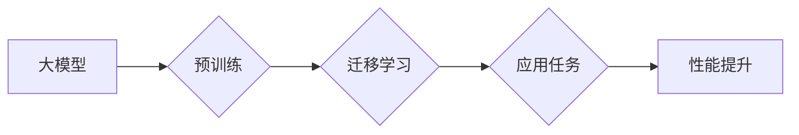

# 大模型：从概念验证到大规模应用

> 关键词：大模型，深度学习，预训练，迁移学习，应用场景，挑战与机遇

## 1. 背景介绍

近年来，随着计算能力的提升和数据量的爆炸式增长，深度学习技术取得了显著的进步。其中，大模型（Large Models）作为一种新型的深度学习模型，凭借其强大的特征提取能力和泛化能力，在自然语言处理、计算机视觉、语音识别等领域展现出巨大的潜力。本文将探讨大模型从概念验证到大规模应用的路径，分析其核心概念、算法原理、应用场景以及面临的挑战和机遇。

## 2. 核心概念与联系

### 2.1 大模型

大模型是指具有海量参数和复杂结构的深度学习模型。它们通常由多个神经网络层组成，能够从大规模数据中学习到丰富的特征和知识。大模型在多个领域展现出强大的性能，如自然语言处理（NLP）、计算机视觉（CV）和语音识别（ASR）等。

### 2.2 预训练

预训练是指在特定数据集上对模型进行训练，使得模型学习到一些通用的特征和知识。这些特征和知识可以在后续的任务中进行迁移学习，从而提升模型的性能。

### 2.3 迁移学习

迁移学习是一种利用在源任务上学习到的知识来提高目标任务性能的技术。它通过在源任务上预训练模型，然后将这些知识迁移到目标任务上，从而减少对目标任务标注数据的依赖。

### 2.4 Mermaid 流程图

以下是大模型、预训练和迁移学习之间的关系：



### 2.5 大模型的优势

大模型具有以下优势：

- **强大的特征提取能力**：大模型能够从大量数据中提取出丰富的特征，从而提高模型的性能。
- **泛化能力**：大模型能够从预训练数据中学习到通用的知识，从而在新的任务上也能取得良好的性能。
- **自适应能力**：大模型可以根据不同的任务需求进行微调，从而适应不同的应用场景。

## 3. 核心算法原理 & 具体操作步骤

### 3.1 算法原理概述

大模型的算法原理主要基于深度神经网络。深度神经网络由多个层次组成，每个层次都能够学习到数据的一些特征。在大模型中，这些层次通常由卷积神经网络（CNN）、循环神经网络（RNN）和Transformer等结构组成。

### 3.2 算法步骤详解

大模型的算法步骤主要包括以下几个阶段：

1. **数据收集**：收集大量的数据，用于预训练和后续的迁移学习。
2. **预训练**：在预训练数据上对模型进行训练，使得模型学习到通用的特征和知识。
3. **微调**：在目标任务的数据上对模型进行微调，使得模型能够适应特定的任务需求。
4. **评估**：在测试集上评估模型的性能，以确保模型能够满足实际应用的要求。

### 3.3 算法优缺点

大模型的优点包括：

- **强大的特征提取能力**：能够从大量数据中提取出丰富的特征。
- **泛化能力**：能够在新的任务上取得良好的性能。
- **自适应能力**：可以根据不同的任务需求进行微调。

大模型的缺点包括：

- **计算资源需求大**：需要大量的计算资源进行训练和推理。
- **数据隐私问题**：在预训练过程中，模型可能会学习到敏感信息。

### 3.4 算法应用领域

大模型在以下领域得到了广泛应用：

- **自然语言处理（NLP）**：如机器翻译、文本分类、情感分析等。
- **计算机视觉（CV）**：如图像分类、目标检测、图像分割等。
- **语音识别（ASR）**：如语音合成、语音翻译等。

## 4. 数学模型和公式 & 详细讲解 & 举例说明

### 4.1 数学模型构建

大模型的数学模型主要由以下几个部分组成：

- **输入层**：将原始数据输入到网络中。
- **隐藏层**：包含多个神经网络层，用于提取特征。
- **输出层**：根据输入数据生成预测结果。

### 4.2 公式推导过程

以下是一个简单的神经网络模型的前向传播公式：

$$
y = f(W \cdot x + b)
$$

其中，$W$ 是权重矩阵，$x$ 是输入向量，$b$ 是偏置项，$f$ 是激活函数。

### 4.3 案例分析与讲解

以BERT（Bidirectional Encoder Representations from Transformers）为例，BERT模型是一种基于Transformer的大规模预训练语言模型。其预训练过程主要包含两个任务：

- **掩码语言模型（Masked Language Model, MLM）**：随机遮盖输入文本中的一些词，并预测这些词的正确词性。
- **下一句预测（Next Sentence Prediction, NSP）**：预测下一句是否与当前句有关。

以下是一个MLM任务的例子：

```
input: "the [MASK] is black"
target: "the cat is black"
```

在这个例子中，模型需要预测遮盖的词是 "cat"。

## 5. 项目实践：代码实例和详细解释说明

### 5.1 开发环境搭建

为了进行大模型的实践，我们需要搭建以下开发环境：

- **操作系统**：Linux或MacOS
- **编程语言**：Python
- **深度学习框架**：TensorFlow或PyTorch
- **预训练模型库**：Hugging Face的Transformers库

### 5.2 源代码详细实现

以下是一个简单的BERT微调代码实例：

```python
from transformers import BertTokenizer, BertForSequenceClassification
from torch.utils.data import DataLoader, Dataset

# 加载预训练模型和分词器
tokenizer = BertTokenizer.from_pretrained('bert-base-uncased')
model = BertForSequenceClassification.from_pretrained('bert-base-uncased')

# 定义数据集
class MyDataset(Dataset):
    def __init__(self, texts, labels):
        self.texts = texts
        self.labels = labels

    def __len__(self):
        return len(self.labels)

    def __getitem__(self, idx):
        return tokenizer(self.texts[idx], padding='max_length', truncation=True)

# 训练模型
def train(model, train_dataloader):
    model.train()
    for batch in train_dataloader:
        inputs = {k: v.to(device) for k, v in batch.items()}
        outputs = model(**inputs)
        loss = outputs.loss
        loss.backward()
        optimizer.step()
        optimizer.zero_grad()

# 训练和评估模型
train_dataloader = DataLoader(MyDataset(train_texts, train_labels), batch_size=16)
train(model, train_dataloader)
```

### 5.3 代码解读与分析

这段代码首先加载了BERT预训练模型和分词器。然后定义了一个数据集类，用于将文本数据和标签转换为模型需要的格式。接着定义了一个训练函数，用于进行模型的训练。最后，使用训练数据和标签创建数据加载器，并调用训练函数进行模型训练。

### 5.4 运行结果展示

运行上述代码后，模型将开始训练，并在训练结束后在测试集上进行评估。我们可以通过查看模型的损失和准确率来判断模型的性能。

## 6. 实际应用场景

大模型在以下领域得到了实际应用：

- **智能客服**：利用大模型实现智能客服，能够自动回答用户的问题，提高客服效率。
- **金融风控**：利用大模型进行金融风险评估，帮助金融机构降低风险。
- **医疗诊断**：利用大模型进行医学影像分析，辅助医生进行疾病诊断。
- **自动驾驶**：利用大模型进行环境感知和决策，实现自动驾驶功能。

## 7. 工具和资源推荐

### 7.1 学习资源推荐

- 《深度学习》（Goodfellow et al.）
- 《神经网络与深度学习》（邱锡鹏）
- Hugging Face的Transformers库文档

### 7.2 开发工具推荐

- TensorFlow
- PyTorch
- Hugging Face的Transformers库

### 7.3 相关论文推荐

- "Attention is All You Need"（Vaswani et al., 2017）
- "BERT: Pre-training of Deep Bidirectional Transformers for Language Understanding"（Devlin et al., 2018）
- "Generative Language Models: A Survey and New Models"（Radford et al., 2019）

## 8. 总结：未来发展趋势与挑战

### 8.1 研究成果总结

大模型作为一种新型深度学习模型，在多个领域展现出强大的性能。随着计算能力的提升和数据量的增长，大模型将继续得到发展。

### 8.2 未来发展趋势

- **模型规模将进一步扩大**：随着计算能力的提升，大模型的规模将继续扩大。
- **多模态大模型将出现**：大模型将融合多种模态数据，实现更加全面的信息处理。
- **可解释性将得到提高**：大模型的可解释性将得到提高，使其更加可靠和安全。

### 8.3 面临的挑战

- **计算资源需求大**：大模型需要大量的计算资源进行训练和推理。
- **数据隐私问题**：在预训练过程中，模型可能会学习到敏感信息。
- **可解释性不足**：大模型的可解释性仍然不足，难以理解其决策过程。

### 8.4 研究展望

未来，大模型的研究将朝着以下方向发展：

- **更加高效的大模型训练方法**：如模型压缩、量化等技术，以降低计算资源需求。
- **更加可靠的大模型**：如对抗训练、鲁棒性增强等技术，以提高模型的可靠性和安全性。
- **更加可解释的大模型**：如可解释人工智能、因果推理等技术，以提高模型的可解释性。

## 9. 附录：常见问题与解答

### 9.1 问题1：大模型与小型模型的区别是什么？

**答案**：大模型与小型模型的区别主要在于模型规模。大模型具有更多的参数和更复杂的结构，能够从更多数据中学习到更多特征。因此，大模型在性能上通常优于小型模型。

### 9.2 问题2：如何选择合适的大模型？

**答案**：选择合适的大模型需要考虑以下因素：

- **任务类型**：不同的任务需要不同类型的大模型。
- **数据规模**：大模型需要大量数据进行预训练。
- **计算资源**：大模型的训练和推理需要大量的计算资源。

### 9.3 问题3：大模型是否容易过拟合？

**答案**：大模型同样存在过拟合的风险。为了防止过拟合，可以采用以下方法：

- **数据增强**：通过增加数据量或改变数据分布来减少过拟合。
- **正则化**：如L2正则化、Dropout等。
- **早停法**：当验证集性能不再提升时停止训练。

### 9.4 问题4：如何提高大模型的性能？

**答案**：提高大模型性能的方法包括：

- **增加数据量**：增加数据量可以提升模型的泛化能力。
- **改进模型结构**：改进模型结构可以提高模型的性能。
- **优化训练过程**：优化训练过程可以提高模型的收敛速度和最终性能。

作者：禅与计算机程序设计艺术 / Zen and the Art of Computer Programming