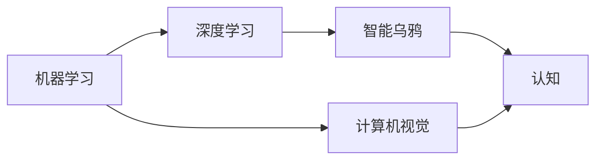

                 

# 计算：第四部分 计算的极限 第 12 章 机器能思考吗 聪明的乌鸦

> 关键词：计算极限、机器学习、智能乌鸦、人工智能、深度学习、认知

## 1. 背景介绍

### 1.1 问题由来
在《计算：第四部分 计算的极限》一书中，作者探讨了计算机的计算能力和极限，特别是当计算机的计算能力达到一定程度时，是否能超越人类智能的问题。本章将聚焦于机器能否思考，特别是通过深度学习等人工智能技术，机器是否能达到人类水平的认知能力。

### 1.2 问题核心关键点
这个问题的核心在于：
- 机器学习能否超越人类智能？
- 深度学习中的神经网络是否具有人类级别的认知能力？
- 计算机能否真正"思考"和"学习"？
- 人类与机器在认知过程中的区别和联系。

## 2. 核心概念与联系

### 2.1 核心概念概述

- **机器学习**：利用算法使计算机通过数据学习，从而能够对新数据进行预测或决策的技术。
- **深度学习**：一种特殊的机器学习方法，通过多层神经网络模拟人类大脑的认知过程，包括感知、分析和决策。
- **智能乌鸦**：一类具有高级认知能力的动物，例如乌鸦，能够进行复杂的问题解决和推理。
- **认知**：指人类对世界及其规律的感知、理解、记忆和应用过程。
- **计算机视觉**：使计算机能够理解和解释图像和视频，模拟人类视觉系统的过程。

### 2.2 概念间的关系

这些核心概念之间存在紧密的联系，形成了一个完整的认知计算框架。机器学习通过数据驱动的方式，使计算机能够模拟人类认知过程，深度学习则是机器学习中的高级形式，通过多层神经网络模拟人类大脑的认知机制。智能乌鸦作为生物学中的智能体，提供了自然界中的认知能力的范例，有助于我们理解认知的生物学基础。计算机视觉作为认知计算的重要分支，专注于图像和视频数据的理解和处理，是认知计算技术的重要组成部分。

这些概念之间的关系可以通过以下Mermaid流程图来展示：



这个流程图展示了一组核心概念之间的逻辑关系：机器学习通过数据驱动的方式，使计算机能够模拟人类认知过程，深度学习作为机器学习中的高级形式，模拟人类大脑的认知机制。智能乌鸦作为生物学中的智能体，提供了自然界中的认知能力的范例，有助于我们理解认知的生物学基础。计算机视觉作为认知计算的重要分支，专注于图像和视频数据的理解和处理，是认知计算技术的重要组成部分。

## 3. 核心算法原理 & 具体操作步骤

### 3.1 算法原理概述

深度学习中的神经网络，通过多层非线性变换，能够对复杂的数据结构进行建模。其核心思想是通过反向传播算法，最小化预测与真实标签之间的误差，从而不断优化网络参数，使得网络能够对新数据进行准确的预测。神经网络的层次结构模拟了人类大脑的认知过程，通过输入、感知、分析和决策等步骤，实现了对复杂问题的处理。

深度学习模型的训练过程，可以分为以下几个步骤：
1. 数据准备：收集和处理训练数据，分为训练集、验证集和测试集。
2. 模型初始化：选择合适的神经网络架构，如卷积神经网络(CNN)、循环神经网络(RNN)等。
3. 模型训练：通过反向传播算法，最小化损失函数，不断优化模型参数。
4. 模型评估：使用验证集和测试集对模型进行评估，选择合适的超参数，如学习率、批大小等。
5. 模型应用：将训练好的模型应用于实际问题中，进行预测或决策。

### 3.2 算法步骤详解

以下是深度学习模型训练的详细步骤：

**Step 1: 数据准备**
- 收集和处理训练数据，分为训练集、验证集和测试集。
- 将数据转换为神经网络可处理的格式，如图像数据转化为张量。

**Step 2: 模型初始化**
- 选择合适的神经网络架构，如卷积神经网络(CNN)、循环神经网络(RNN)等。
- 初始化网络参数，如权重和偏置。

**Step 3: 模型训练**
- 使用训练集进行模型训练。
- 前向传播计算预测值。
- 计算损失函数。
- 反向传播更新网络参数。
- 重复前向传播和反向传播，直至收敛。

**Step 4: 模型评估**
- 使用验证集对模型进行评估，选择最佳的超参数。
- 使用测试集对模型进行最终评估。

**Step 5: 模型应用**
- 将训练好的模型应用于实际问题中，进行预测或决策。

### 3.3 算法优缺点

深度学习的优点包括：
- 能够处理高维度数据，如图像、文本等。
- 能够自动提取数据特征，减少手动特征工程的工作量。
- 在特定任务上，取得了优于传统机器学习方法的性能。

深度学习的缺点包括：
- 需要大量的训练数据和计算资源。
- 模型复杂，难以理解和解释。
- 存在过拟合和局部极小值等问题。

### 3.4 算法应用领域

深度学习已经在计算机视觉、自然语言处理、语音识别、推荐系统等领域得到了广泛应用。其应用领域包括：

- **计算机视觉**：如图像分类、目标检测、人脸识别等。
- **自然语言处理**：如机器翻译、情感分析、文本摘要等。
- **语音识别**：如语音识别、语音合成等。
- **推荐系统**：如个性化推荐、广告推荐等。

## 4. 数学模型和公式 & 详细讲解 & 举例说明

### 4.1 数学模型构建

深度学习模型的核心是神经网络，其数学模型可以表示为：

$$
f(x; \theta) = \sum_{i=1}^n w_i \phi(z_i + b_i) + b
$$

其中，$f(x)$ 表示输入 $x$ 到输出 $y$ 的映射，$w_i$ 和 $b_i$ 表示神经元的权重和偏置，$\phi$ 表示激活函数，如ReLU、Sigmoid等。

### 4.2 公式推导过程

以多层感知器(Multilayer Perceptron, MLP)为例，其数学推导过程如下：

假设输入数据 $x \in \mathbb{R}^n$，输出 $y \in \mathbb{R}^m$，神经网络包含 $l$ 个隐藏层，每层有 $n_l$ 个神经元，激活函数为 $\phi$，权重矩阵为 $W_l$，偏置向量为 $b_l$。则神经网络的输出可以表示为：

$$
y = f(x; \theta) = \phi(W_l \phi(W_{l-1} \phi(\cdots \phi(W_1 x + b_1) + b_2) + \cdots + b_l)
$$

其中，$\theta$ 表示所有权重和偏置的集合。神经网络的损失函数通常使用交叉熵损失函数，即：

$$
\mathcal{L}(\theta) = -\frac{1}{N} \sum_{i=1}^N \sum_{j=1}^m y_{ij} \log \hat{y}_{ij}
$$

其中，$y_{ij}$ 表示真实标签，$\hat{y}_{ij}$ 表示模型预测值。

### 4.3 案例分析与讲解

以图像分类为例，假设输入是图像数据，输出是类别标签，可以使用卷积神经网络(CNN)进行建模。CNN由卷积层、池化层和全连接层组成，其中卷积层用于提取图像特征，池化层用于降低特征维度，全连接层用于分类。

在CNN中，卷积层的权重矩阵 $W$ 和偏置向量 $b$ 表示卷积核，用于提取图像的局部特征。池化层通常使用最大池化或平均池化，用于降低特征维度。全连接层用于将特征向量映射到类别空间，输出类别概率。

在训练过程中，使用交叉熵损失函数，通过反向传播算法更新卷积核、偏置和全连接层的权重。最终训练好的CNN模型可以用于新图像的分类任务。

## 5. 项目实践：代码实例和详细解释说明

### 5.1 开发环境搭建

进行深度学习项目开发，需要搭建合适的开发环境。以下是使用Python进行TensorFlow开发的环境配置流程：

1. 安装Anaconda：从官网下载并安装Anaconda，用于创建独立的Python环境。

2. 创建并激活虚拟环境：
```bash
conda create -n tf-env python=3.8 
conda activate tf-env
```

3. 安装TensorFlow：根据CUDA版本，从官网获取对应的安装命令。例如：
```bash
conda install tensorflow
```

4. 安装各类工具包：
```bash
pip install numpy pandas scikit-learn matplotlib tqdm jupyter notebook ipython
```

完成上述步骤后，即可在`tf-env`环境中开始深度学习项目开发。

### 5.2 源代码详细实现

这里以图像分类为例，使用TensorFlow实现深度学习模型的训练和测试。

```python
import tensorflow as tf
from tensorflow.keras import datasets, layers, models

# 加载数据集
(train_images, train_labels), (test_images, test_labels) = datasets.cifar10.load_data()

# 数据预处理
train_images, test_images = train_images / 255.0, test_images / 255.0

# 构建模型
model = models.Sequential([
    layers.Conv2D(32, (3, 3), activation='relu', input_shape=(32, 32, 3)),
    layers.MaxPooling2D((2, 2)),
    layers.Conv2D(64, (3, 3), activation='relu'),
    layers.MaxPooling2D((2, 2)),
    layers.Conv2D(64, (3, 3), activation='relu'),
    layers.Flatten(),
    layers.Dense(64, activation='relu'),
    layers.Dense(10)
])

# 编译模型
model.compile(optimizer='adam',
              loss=tf.keras.losses.SparseCategoricalCrossentropy(from_logits=True),
              metrics=['accuracy'])

# 训练模型
model.fit(train_images, train_labels, epochs=10, 
          validation_data=(test_images, test_labels))

# 评估模型
test_loss, test_acc = model.evaluate(test_images, test_labels, verbose=2)
print('Test accuracy:', test_acc)
```

以上代码实现了使用卷积神经网络对CIFAR-10数据集进行图像分类。具体步骤包括数据加载、数据预处理、模型构建、模型编译、模型训练和模型评估。通过这个例子，读者可以了解深度学习模型开发的基本流程。

### 5.3 代码解读与分析

让我们再详细解读一下关键代码的实现细节：

**数据加载与预处理**：
- `datasets.cifar10.load_data()`：从TensorFlow数据集中加载CIFAR-10数据集。
- `train_images, test_images = train_images / 255.0, test_images / 255.0`：将数据归一化到[0,1]范围。

**模型构建**：
- `layers.Conv2D(32, (3, 3), activation='relu', input_shape=(32, 32, 3))`：构建卷积层，使用ReLU激活函数，输入形状为(32, 32, 3)。
- `layers.MaxPooling2D((2, 2))`：构建池化层，使用最大池化，池化窗口大小为(2,2)。
- `layers.Flatten()`：将二维特征图展开成一维特征向量。
- `layers.Dense(64, activation='relu')`：构建全连接层，使用ReLU激活函数。
- `layers.Dense(10)`：构建输出层，输出类别标签。

**模型编译**：
- `model.compile(optimizer='adam', loss=tf.keras.losses.SparseCategoricalCrossentropy(from_logits=True), metrics=['accuracy'])`：编译模型，使用Adam优化器，交叉熵损失函数，准确率作为评价指标。

**模型训练**：
- `model.fit(train_images, train_labels, epochs=10, validation_data=(test_images, test_labels))`：训练模型，使用训练集进行训练，验证集进行评估。

**模型评估**：
- `test_loss, test_acc = model.evaluate(test_images, test_labels, verbose=2)`：评估模型，计算测试集的损失和准确率。

### 5.4 运行结果展示

假设我们训练的模型在测试集上的准确率为0.7，即正确分类了70%的图像，说明模型具有一定的分类能力。需要注意的是，模型的准确率可能受到超参数、模型结构、数据集等因素的影响，需要通过调整这些因素来提升模型的性能。

## 6. 实际应用场景

### 6.1 图像分类

图像分类是深度学习中最常见的应用之一。在智能监控系统中，可以使用深度学习模型对实时监控视频进行图像分类，识别出不同种类的车辆、行人等目标。在医疗影像诊断中，深度学习模型可以对医学影像进行分类，如X光片中的肺结节、CT中的肿瘤等。

### 6.2 自然语言处理

自然语言处理是深度学习的另一个重要应用领域。在智能客服系统中，可以使用深度学习模型对用户的问题进行语义分析，自动回答常见问题，提升客服系统的效率和用户体验。在机器翻译中，深度学习模型可以将一种语言翻译成另一种语言，如将英语翻译成中文。

### 6.3 推荐系统

推荐系统是深度学习在电商和内容平台中的应用之一。在电商平台中，深度学习模型可以根据用户的历史行为和兴趣，推荐最适合的商品。在内容平台中，深度学习模型可以根据用户的阅读历史和兴趣，推荐最适合的文章、视频等。

### 6.4 未来应用展望

随着深度学习技术的不断进步，深度学习的应用领域将不断扩展。未来，深度学习技术有望在智能制造、智能交通、智能家居等领域得到广泛应用，推动社会的数字化和智能化进程。同时，深度学习技术也将不断提升，解决更多的复杂问题，实现更高的性能和可解释性。

## 7. 工具和资源推荐

### 7.1 学习资源推荐

为了帮助开发者系统掌握深度学习理论基础和实践技巧，这里推荐一些优质的学习资源：

1. **《深度学习》书籍**：由Ian Goodfellow、Yoshua Bengio和Aaron Courville合著，全面介绍了深度学习的理论基础和实践方法。
2. **Coursera深度学习课程**：由Andrew Ng主讲的深度学习课程，涵盖了深度学习的各个方面，包括神经网络、卷积神经网络、循环神经网络等。
3. **Kaggle深度学习竞赛**：Kaggle平台上有很多深度学习竞赛，可以通过参加比赛来锻炼自己的深度学习技能，积累实践经验。
4. **GitHub深度学习项目**：在GitHub上Star、Fork数最多的深度学习项目，往往代表了该技术领域的发展趋势和最佳实践，值得去学习和贡献。
5. **arXiv论文预印本**：人工智能领域最新研究成果的发布平台，包括大量尚未发表的前沿工作，学习前沿技术的必读资源。

通过这些资源的学习实践，相信你一定能够快速掌握深度学习的精髓，并用于解决实际的计算机视觉、自然语言处理等问题。

### 7.2 开发工具推荐

高效的深度学习开发离不开优秀的工具支持。以下是几款用于深度学习开发的常用工具：

1. **TensorFlow**：由Google主导开发的开源深度学习框架，生产部署方便，适合大规模工程应用。
2. **PyTorch**：由Facebook主导开发的深度学习框架，灵活高效，适合研究和实验。
3. **Keras**：一个高级神经网络API，可以在TensorFlow、Theano和CNTK等后端上运行。
4. **Jupyter Notebook**：一个交互式笔记本，支持Python、R等多种编程语言，适合深度学习研究和实验。
5. **Git**：版本控制系统，用于管理代码版本，支持多人协作开发。

合理利用这些工具，可以显著提升深度学习项目开发效率，加快创新迭代的步伐。

### 7.3 相关论文推荐

深度学习技术的发展源于学界的持续研究。以下是几篇奠基性的相关论文，推荐阅读：

1. **《ImageNet Classification with Deep Convolutional Neural Networks》**：Alex Krizhevsky等人提出卷积神经网络(CNN)，用于图像分类任务，取得了当时SOTA的成绩。
2. **《Neural Machine Translation by Jointly Learning to Align and Translate》**：Ilya Sutskever等人提出序列到序列模型(Seq2Seq)，用于机器翻译任务，取得了显著的性能提升。
3. **《Generative Adversarial Networks》**：Ian Goodfellow等人提出生成对抗网络(GAN)，用于生成高质量的图像和视频等。
4. **《Attention is All You Need》**：Ashish Vaswani等人提出Transformer模型，用于自然语言处理任务，取得了SOTA的成绩。

这些论文代表了大深度学习技术的核心进展，通过学习这些前沿成果，可以帮助研究者把握学科前进方向，激发更多的创新灵感。

除上述资源外，还有一些值得关注的前沿资源，帮助开发者紧跟深度学习技术的最新进展，例如：

1. **arXiv论文预印本**：人工智能领域最新研究成果的发布平台，包括大量尚未发表的前沿工作，学习前沿技术的必读资源。
2. **顶级会议和期刊**：如NeurIPS、ICML、JMLR等顶级会议和期刊，发布最新的深度学习研究成果。
3. **深度学习开源社区**：如GitHub、Kaggle等深度学习开源社区，提供了丰富的数据集、代码和模型，方便学习和研究。

总之，深度学习技术正在快速发展，掌握深度学习理论基础和实践技巧，需要开发者保持开放的心态和持续学习的意愿。多关注前沿资讯，多动手实践，多思考总结，必将收获满满的成长收益。

## 8. 总结：未来发展趋势与挑战

### 8.1 总结

本文对深度学习技术进行了全面系统的介绍。首先阐述了深度学习的理论基础和实际应用，明确了深度学习在计算机视觉、自然语言处理、推荐系统等领域的强大能力。其次，从原理到实践，详细讲解了深度学习的数学模型和训练流程，给出了深度学习项目开发的完整代码实例。同时，本文还广泛探讨了深度学习技术在智能监控、智能客服、智能推荐等多个行业领域的应用前景，展示了深度学习技术的巨大潜力。此外，本文精选了深度学习技术的各类学习资源，力求为读者提供全方位的技术指引。

通过本文的系统梳理，可以看到，深度学习技术正在成为人工智能领域的重要范式，极大地拓展了计算机的认知能力，为人工智能技术落地应用提供了新的可能性。未来，伴随深度学习技术的持续演进，深度学习必将在更多领域得到应用，为人类认知智能的进化带来深远影响。

### 8.2 未来发展趋势

展望未来，深度学习技术将呈现以下几个发展趋势：

1. **计算能力提升**：随着计算能力的提升，深度学习模型的规模和复杂度将不断增加，模型性能也将进一步提升。
2. **自监督学习**：自监督学习将减少对标注数据的需求，利用大量无标签数据进行训练，提升模型泛化能力。
3. **多模态学习**：深度学习技术将进一步拓展到多模态数据，如图像、文本、语音等，实现跨模态数据的协同建模。
4. **模型压缩和优化**：深度学习模型规模庞大，计算资源消耗大，如何压缩和优化模型，实现高效推理，将成为重要的研究方向。
5. **模型可解释性**：深度学习模型往往被视为"黑盒"，如何提高模型的可解释性，使其决策过程更加透明，将是一个重要的研究方向。

以上趋势凸显了深度学习技术的广阔前景。这些方向的探索发展，必将进一步提升深度学习模型的性能和应用范围，为人工智能技术落地应用提供新的可能性。

### 8.3 面临的挑战

尽管深度学习技术已经取得了瞩目成就，但在迈向更加智能化、普适化应用的过程中，它仍面临着诸多挑战：

1. **数据质量和标注成本**：深度学习模型需要大量的标注数据进行训练，但高质量标注数据的获取成本高昂，如何降低对标注数据的依赖，将是一大难题。
2. **模型泛化能力**：深度学习模型在特定任务上表现优异，但在其他任务上的泛化能力较差，如何提升模型的泛化能力，减少过拟合风险，将是一个重要研究方向。
3. **模型可解释性**：深度学习模型往往被视为"黑盒"，如何提高模型的可解释性，使其决策过程更加透明，将是一个重要的研究方向。
4. **计算资源消耗**：深度学习模型规模庞大，计算资源消耗大，如何压缩和优化模型，实现高效推理，将是重要的研究方向。

### 8.4 研究展望

面对深度学习面临的挑战，未来的研究需要在以下几个方面寻求新的突破：

1. **无监督学习**：摆脱对大规模标注数据的依赖，利用自监督学习、主动学习等无监督范式，最大限度利用非结构化数据，实现更加灵活高效的深度学习模型。
2. **模型压缩和优化**：开发更加轻量级的深度学习模型，通过剪枝、量化、蒸馏等方法，实现高效推理和模型压缩。
3. **多模态学习**：将深度学习技术拓展到多模态数据，如图像、文本、语音等，实现跨模态数据的协同建模。
4. **模型可解释性**：引入符号化的先验知识，如知识图谱、逻辑规则等，与深度学习模型进行融合，增强模型的可解释性和可理解性。
5. **人机协同**：将深度学习技术与人类专家知识结合，实现人机协同的智能系统，提升系统的可靠性和可控性。

这些研究方向将引领深度学习技术迈向更高的台阶，为构建更加智能、可靠、可控的深度学习系统铺平道路。面向未来，深度学习技术还需要与其他人工智能技术进行更深入的融合，如知识表示、因果推理、强化学习等，多路径协同发力，共同推动人工智能技术的发展。只有勇于创新、敢于突破，才能不断拓展深度学习技术的边界，让智能技术更好地造福人类社会。

## 9. 附录：常见问题与解答

**Q1: 深度学习能否超越人类智能？**

A: 深度学习在特定任务上已经取得了与人类相当甚至超越人类的性能，但在通用智能、创造力、情感等方面仍存在巨大差距。深度学习模型本质上是通过大量数据和计算资源进行训练的机器，缺乏人类的生物和社会背景知识。

**Q2: 深度学习模型为何容易出现过拟合？**

A: 深度学习模型在训练过程中容易出现过拟合，主要原因包括模型复杂度过高、训练数据不足、训练时间过长等。解决过拟合问题的方法包括数据增强、正则化、模型简化等。

**Q3: 深度学习模型为何难以解释？**

A: 深度学习模型本质上是通过大量数据和计算资源进行训练的机器，缺乏人类的生物和社会背景知识。模型内部的参数和结构复杂，难以解释其决策过程。为了提高模型的可解释性，可以引入符号化的先验知识，如知识图谱、逻辑规则等，与深度学习模型进行融合。

**Q4: 深度学习模型为何需要大量计算资源？**

A: 深度学习模型通常包含大量参数和复杂的网络结构，计算量大，需要高效的计算资源和优化算法。为了提升模型训练和推理效率，可以采用模型压缩、量化、蒸馏等方法，实现模型的高效运行。

**Q5: 深度学习模型为何难以适应新任务？**

A: 深度学习模型在特定任务上训练得到的参数和结构，难以灵活适应新任务。为了提高模型的泛化能力，可以采用迁移学习、自监督学习、多任务学习等方法，减少对标注数据的依赖。

总之，深度学习技术正在快速发展，掌握深度学习理论基础和实践技巧，需要开发者保持开放的心态和持续学习的意愿。多关注前沿资讯，多动手实践，多思考总结，必将收获满满的成长收益。

---

作者：禅与计算机程序设计艺术 / Zen and the Art of Computer Programming

