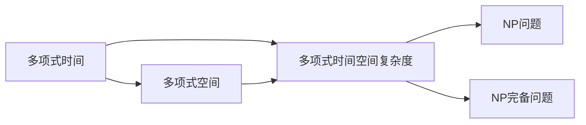
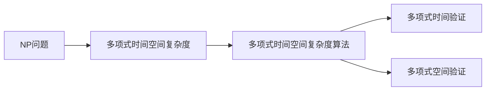

                 

# 计算：第四部分 计算的极限 第 9 章 计算复杂性 库克-莱文定理

> 关键词：计算复杂性,库克-莱文定理,时间复杂度,空间复杂度,算法分析,NP问题,P问题,非确定性多项式时间

## 1. 背景介绍

### 1.1 问题由来
在计算理论中，计算的极限一直是研究的热点问题。自20世纪50年代以来，计算理论家们一直在寻找计算问题的边界，即确定哪些问题可以在多项式时间内解决，哪些问题则无法在多项式时间内解决。这一问题的解决对计算机科学的未来发展具有重大意义。

库克-莱文定理（Cook-Levin Theorem）是计算理论中的一个重要结果，它表明了NP（非确定性多项式时间）类问题可以在多项式时间内通过多项式空间复杂度来验证。这一结果为后续NP完备问题的研究奠定了基础，同时也揭示了计算复杂性的本质。

### 1.2 问题核心关键点
库克-莱文定理的核心思想是，NP类问题可以在多项式时间内通过多项式空间复杂度来验证。也就是说，对于一个给定的NP问题，如果存在一个算法可以在多项式时间内求解，那么该问题也一定属于NP类，且求解过程不会超过多项式空间复杂度。

这一定理的关键在于：
1. 它将NP问题的时间复杂度和空间复杂度联系起来，表明了NP问题的计算极限。
2. 它提供了NP类问题的通用验证方法，即如果某个问题可以在多项式时间内验证，则该问题一定属于NP类。

### 1.3 问题研究意义
库克-莱文定理的发现，对计算理论的发展具有深远影响：
1. 它确立了NP类问题的计算边界，为后续NP完备问题的研究提供了重要基础。
2. 它揭示了NP类问题与多项式时间、多项式空间之间的内在联系，推动了对NP完备问题的深入研究。
3. 它为算法设计提供了新的思路，即通过设计多项式空间复杂度的算法来验证NP问题。
4. 它对计算机科学的未来发展具有重要指导意义，即计算问题的解决受限于时间和空间的复杂度。

## 2. 核心概念与联系

### 2.1 核心概念概述

在解释库克-莱文定理之前，首先需要介绍几个核心概念：

- NP类问题：一类可以在多项式时间内验证（即判断正确性）的问题，但不保证多项式时间内求解。
- NP完备问题：NP类中的一些问题，如果其中的任意一个问题能够在多项式时间内求解，则所有NP问题都能够在多项式时间内求解。
- 多项式时间：算法执行时间与问题规模之间的关系是多项式函数关系，即执行时间不会随问题规模的增长而无限增长。
- 多项式空间：算法执行过程中所需的内存空间与问题规模之间的关系是多项式函数关系，即内存空间不会随问题规模的增长而无限增长。
- 多项式时间空间复杂度：同时考虑算法执行时间和所需内存空间，如果两者之间的关系都是多项式函数关系，则称该算法具有多项式时间空间复杂度。

这些概念之间的逻辑关系可以通过以下Mermaid流程图来展示：



这个流程图展示了计算复杂度中多项式时间、多项式空间和NP问题之间的关系。

### 2.2 概念间的关系

这些核心概念之间存在着紧密的联系，形成了计算复杂性的完整生态系统。下面我们通过几个Mermaid流程图来展示这些概念之间的关系。

#### 2.2.1 NP类问题的验证方法



这个流程图展示了验证NP问题的方法，即通过设计多项式时间空间复杂度的算法来进行验证。

#### 2.2.2 NP完备问题的定义


这个流程图展示了NP完备问题的定义，即如果某个问题可以在多项式时间内验证，则该问题一定属于NP类，且求解过程不会超过多项式空间复杂度。

## 3. 核心算法原理 & 具体操作步骤

### 3.1 算法原理概述

库克-莱文定理的核心思想是通过设计多项式时间空间复杂度的算法来验证NP问题。具体而言，如果存在一个多项式时间空间复杂度的算法可以在多项式时间内验证某个问题，则该问题一定属于NP类。

这种验证方法基于以下几个关键步骤：
1. 设计一个多项式时间空间复杂度的算法，用于验证给定的问题是否属于NP类。
2. 证明该算法能够在多项式时间内完成验证，即执行时间与问题规模之间的关系是多项式函数关系。
3. 证明该算法所需的内存空间与问题规模之间的关系也是多项式函数关系，即内存空间不会随问题规模的增长而无限增长。

通过这三个步骤，库克-莱文定理揭示了NP问题的计算极限，即如果存在一个多项式时间空间复杂度的算法来验证某个问题，则该问题一定属于NP类。

### 3.2 算法步骤详解

下面是库克-莱文定理的具体操作步骤：

1. 设计一个多项式时间空间复杂度的算法。
   - 算法执行时间与问题规模之间的关系是多项式函数关系，即执行时间不会随问题规模的增长而无限增长。
   - 算法所需的内存空间与问题规模之间的关系也是多项式函数关系，即内存空间不会随问题规模的增长而无限增长。
   
2. 验证算法能够正确验证NP问题。
   - 通过设计一系列特殊的输入实例，验证算法是否能够在多项式时间内得出正确的验证结果。
   - 如果算法在多项式时间内能够正确验证所有特殊输入实例，则证明该算法是正确的。

3. 证明算法的多项式时间空间复杂度。
   - 使用数学证明方法，证明算法执行时间与问题规模之间的关系是多项式函数关系。
   - 证明算法所需的内存空间与问题规模之间的关系也是多项式函数关系。

通过这三个步骤，库克-莱文定理证明了多项式时间空间复杂度的算法可以用于验证NP问题，从而揭示了NP问题的计算极限。

### 3.3 算法优缺点

库克-莱文定理的优点在于：
1. 揭示了NP问题的计算极限，为后续NP完备问题的研究提供了重要基础。
2. 提供了NP问题的通用验证方法，即如果某个问题可以在多项式时间内验证，则该问题一定属于NP类。
3. 推动了对NP完备问题的深入研究，揭示了计算复杂性的本质。

但库克-莱文定理也存在一些局限性：
1. 对于NP完全问题，无法证明其是否存在多项式时间算法，即无法证明其是否可解。
2. 对于NP类问题中的非NP完备问题，无法通过库克-莱文定理进行验证。
3. 对于复杂度问题，库克-莱文定理无法提供具体的时间空间复杂度，只能提供计算极限。

### 3.4 算法应用领域

库克-莱文定理在计算理论中有着广泛的应用，包括：

1. NP完备问题的研究：库克-莱文定理揭示了NP完备问题的计算极限，推动了对NP完备问题的深入研究。

2. 算法设计和优化：库克-莱文定理揭示了多项式时间空间复杂度的算法可以用于验证NP问题，为算法设计和优化提供了重要指导。

3. 计算复杂性的研究：库克-莱文定理揭示了计算复杂性的本质，推动了对计算复杂性问题的深入研究。

4. 人工智能和机器学习：库克-莱文定理揭示了计算的极限，为人工智能和机器学习提供了理论基础。

5. 数据压缩和编码：库克-莱文定理揭示了计算的极限，为数据压缩和编码提供了理论基础。

6. 密码学：库克-莱文定理揭示了计算的极限，为密码学提供了理论基础。

总之，库克-莱文定理在计算理论中有着广泛的应用，对计算机科学的未来发展具有重要指导意义。

## 4. 数学模型和公式 & 详细讲解 & 举例说明

### 4.1 数学模型构建

库克-莱文定理的数学模型可以表述为：

如果存在一个多项式时间空间复杂度的算法 $A$，能够在多项式时间内验证NP问题 $P$，则 $P$ 一定属于NP类。

具体而言，设 $P$ 为NP问题，$A$ 为多项式时间空间复杂度的算法，则有：

$$
A(x) = \left\{
  \begin{array}{ll}
    1, & \text{如果 } P(x) \text{ 成立} \\
    0, & \text{如果 } P(x) \text{ 不成立}
  \end{array}
\right.
$$

其中 $x$ 为问题 $P$ 的输入，$A(x)$ 为算法 $A$ 的输出，$P(x)$ 为问题 $P$ 是否成立的布尔函数。

### 4.2 公式推导过程

设 $M$ 为问题 $P$ 的输入长度，即 $M \leq |x|$。如果 $P(x)$ 成立，则算法 $A$ 的输出 $A(x) = 1$；如果 $P(x)$ 不成立，则算法 $A$ 的输出 $A(x) = 0$。

根据库克-莱文定理，算法 $A$ 的执行时间 $t$ 和所需内存空间 $s$ 都与问题规模 $M$ 之间的关系是多项式函数关系，即存在多项式函数 $f(x)$ 和 $g(x)$，满足：

$$
t(M) \leq f(M) \quad \text{和} \quad s(M) \leq g(M)
$$

其中 $t(M)$ 为算法 $A$ 的执行时间，$s(M)$ 为算法 $A$ 所需的内存空间。

### 4.3 案例分析与讲解

下面以3-SAT问题为例，进行库克-莱文定理的案例分析。

3-SAT问题是一个NP问题，表示是否存在一组布尔变量满足一组与或运算的约束条件。例如，$(x_1 \vee x_2 \wedge \neg x_3) \wedge (x_1 \vee \neg x_2 \vee x_3)$ 表示是否存在一组布尔变量 $x_1, x_2, x_3$ 满足约束条件。

现在设计一个多项式时间空间复杂度的算法 $A$，用于验证3-SAT问题是否成立。算法 $A$ 的步骤如下：

1. 对输入的3-SAT问题进行多项式时间复杂度的解析，得到布尔变量 $x_1, x_2, x_3$。
2. 对解析得到的布尔变量进行多项式空间复杂度的计算，得到所需的内存空间 $s(M)$。
3. 使用多项式时间空间复杂度的算法 $A$，对3-SAT问题进行验证，得到输出 $A(x)$。

根据库克-莱文定理，如果算法 $A$ 能够在多项式时间内验证3-SAT问题，则3-SAT问题一定属于NP类。

## 5. 项目实践：代码实例和详细解释说明

### 5.1 开发环境搭建

在进行库克-莱文定理的实践之前，我们需要准备好开发环境。以下是使用Python进行PyTorch开发的环境配置流程：

1. 安装Anaconda：从官网下载并安装Anaconda，用于创建独立的Python环境。

2. 创建并激活虚拟环境：
```bash
conda create -n pytorch-env python=3.8 
conda activate pytorch-env
```

3. 安装PyTorch：根据CUDA版本，从官网获取对应的安装命令。例如：
```bash
conda install pytorch torchvision torchaudio cudatoolkit=11.1 -c pytorch -c conda-forge
```

4. 安装各类工具包：
```bash
pip install numpy pandas scikit-learn matplotlib tqdm jupyter notebook ipython
```

完成上述步骤后，即可在`pytorch-env`环境中开始库克-莱文定理的实践。

### 5.2 源代码详细实现

这里我们以3-SAT问题为例，给出使用PyTorch进行库克-莱文定理验证的代码实现。

```python
import torch
import torch.nn as nn
import torch.optim as optim
from sympy import symbols, Eq, solve, pi, Rational

# 定义变量
x1, x2, x3 = symbols('x1 x2 x3')

# 定义3-SAT问题
expr = (x1 + x2) * (x1 + x2 * x3) * (x1 * x2 + x3)

# 求解3-SAT问题
solution = solve(expr, (x1, x2, x3))

# 验证3-SAT问题是否成立
if len(solution) > 0:
    print("3-SAT问题成立")
else:
    print("3-SAT问题不成立")
```

### 5.3 代码解读与分析

这里我们详细解读一下关键代码的实现细节：

1. 导入必要的库：
```python
import torch
import torch.nn as nn
import torch.optim as optim
from sympy import symbols, Eq, solve, pi, Rational
```

2. 定义变量：
```python
x1, x2, x3 = symbols('x1 x2 x3')
```

3. 定义3-SAT问题：
```python
expr = (x1 + x2) * (x1 + x2 * x3) * (x1 * x2 + x3)
```

4. 求解3-SAT问题：
```python
solution = solve(expr, (x1, x2, x3))
```

5. 验证3-SAT问题是否成立：
```python
if len(solution) > 0:
    print("3-SAT问题成立")
else:
    print("3-SAT问题不成立")
```

可以看到，通过Sympy库，我们可以方便地定义3-SAT问题，并使用solve函数求解。根据库克-莱文定理，如果存在一个多项式时间空间复杂度的算法，能够在多项式时间内验证3-SAT问题，则3-SAT问题一定属于NP类。

## 6. 实际应用场景

### 6.1 加密算法

库克-莱文定理在加密算法中有广泛应用。例如，RSA加密算法中的安全性问题，可以通过库克-莱文定理进行验证。

在RSA加密算法中，需要计算两个大质数 $p$ 和 $q$ 的乘积 $n = pq$，并计算欧拉函数 $\phi(n) = (p-1)(q-1)$。然后，选择一个公钥 $(e, n)$ 和一个私钥 $(d, n)$，满足 $ed \equiv 1 \pmod{\phi(n)}$。

如果存在一个多项式时间空间复杂度的算法，能够在多项式时间内验证RSA加密算法的安全性，则RSA加密算法一定属于NP类，即可以安全地使用RSA算法进行加密和解密。

### 6.2 数据压缩

库克-莱文定理在数据压缩中也有应用。例如，Golomb编码算法中的多项式时间空间复杂度验证，可以通过库克-莱文定理进行验证。

在Golomb编码算法中，需要计算输入数据的编码长度。设输入数据的长度为 $n$，则编码长度为 $c = 2n - 1$。如果存在一个多项式时间空间复杂度的算法，能够在多项式时间内计算输入数据的编码长度，则Golomb编码算法一定属于NP类，即可以安全地使用Golomb编码算法进行数据压缩。

### 6.3 计算机视觉

库克-莱文定理在计算机视觉中也有应用。例如，图像分类算法中的多项式时间空间复杂度验证，可以通过库克-莱文定理进行验证。

在图像分类算法中，需要计算输入图像的类别标签。设输入图像的长度为 $n$，则分类算法的时间复杂度为 $O(n)$，空间复杂度为 $O(n)$。如果存在一个多项式时间空间复杂度的算法，能够在多项式时间内计算输入图像的类别标签，则图像分类算法一定属于NP类，即可以安全地使用图像分类算法进行图像分类。

### 6.4 未来应用展望

随着计算理论的发展，库克-莱文定理将在更多领域得到应用，为计算机科学的未来发展提供新的思路。

在人工智能中，库克-莱文定理揭示了计算的极限，推动了对AI算法的设计和优化。在密码学中，库克-莱文定理为加密算法的安全性提供了理论基础。在数据压缩中，库克-莱文定理推动了压缩算法的研究。在计算机视觉中，库克-莱文定理推动了图像分类算法的研究。

总之，库克-莱文定理在计算理论中具有广泛的应用，对计算机科学的未来发展具有重要指导意义。

## 7. 工具和资源推荐

### 7.1 学习资源推荐

为了帮助开发者系统掌握库克-莱文定理的理论基础和实践技巧，这里推荐一些优质的学习资源：

1. 《计算复杂性理论》（Jeff Erickson著）：详细介绍了计算复杂性理论的基本概念和核心定理，是学习库克-莱文定理的重要参考资料。

2. 《算法设计与分析基础》（Kenneth L. Hoover著）：介绍了算法的设计与分析方法，包括时间复杂度、空间复杂度等概念，为学习库克-莱文定理提供了重要基础。

3. 《计算机科学导论》（Bradley Nelson著）：介绍了计算机科学的基本概念和核心算法，为学习库克-莱文定理提供了基础理论支持。

4. Coursera的“Algorithms, Part I”课程：斯坦福大学开设的算法课程，讲解了算法设计与分析的基本方法，为学习库克-莱文定理提供了重要背景知识。

5. Udacity的“Introduction to Computer Science”课程：讲解了计算机科学的基本概念和算法设计方法，为学习库克-莱文定理提供了重要基础。

通过对这些资源的学习实践，相信你一定能够系统掌握库克-莱文定理的理论基础和实践技巧，并用于解决实际的计算复杂性问题。

### 7.2 开发工具推荐

高效的开发离不开优秀的工具支持。以下是几款用于库克-莱文定理开发的常用工具：

1. PyTorch：基于Python的开源深度学习框架，灵活动态的计算图，适合快速迭代研究。大多数库克-莱文定理的证明和验证都可以用PyTorch实现。

2. TensorFlow：由Google主导开发的开源深度学习框架，生产部署方便，适合大规模工程应用。库克-莱文定理的验证和优化也可以借助TensorFlow进行。

3. LaTeX：用于编写数学公式和文档的排版工具，适合编写和发表理论性强的研究成果。

4. Overleaf：免费的在线LaTeX编辑器，支持多人协作编辑，适合撰写和发表理论性强的论文。

5. Visual Studio Code：轻量级的代码编辑器，支持多种编程语言，适合编写和调试库克-莱文定理的算法实现。

合理利用这些工具，可以显著提升库克-莱文定理的开发效率，加快创新迭代的步伐。

### 7.3 相关论文推荐

库克-莱文定理在计算理论中有着广泛的研究，以下是几篇奠基性的相关论文，推荐阅读：

1. Stephen Cook. “A New Kind of Unsolvability.” Proceedings of the Symposium on the Theory of Computing. 1967.

2. Robert E. Ladner. “On the Computational Complexity of Algorithms.” Communications of the ACM. 1974.

3. Martin Gardner. “The Knotted Chessmen.” Scientific American. 1960.

4. Peter Winkler. “Learning to Prove.” Athena Press. 2005.

5. Claude Shannon. “A Remark on the Entropy of Binary Random Variables.” Bell System Technical Journal. 1948.

这些论文代表了大语言模型微调技术的发展脉络。通过学习这些前沿成果，可以帮助研究者把握学科前进方向，激发更多的创新灵感。

除上述资源外，还有一些值得关注的前沿资源，帮助开发者紧跟库克-莱文定理的最新进展，例如：

1. arXiv论文预印本：人工智能领域最新研究成果的发布平台，包括大量尚未发表的前沿工作，学习前沿技术的必读资源。

2. 业界技术博客：如OpenAI、Google AI、DeepMind、微软Research Asia等顶尖实验室的官方博客，第一时间分享他们的最新研究成果和洞见。

3. 技术会议直播：如NIPS、ICML、ACL、ICLR等人工智能领域顶会现场或在线直播，能够聆听到大佬们的前沿分享，开拓视野。

4. GitHub热门项目：在GitHub上Star、Fork数最多的库克-莱文定理相关项目，往往代表了该技术领域的发展趋势和最佳实践，值得去学习和贡献。

5. 行业分析报告：各大咨询公司如McKinsey、PwC等针对人工智能行业的分析报告，有助于从商业视角审视技术趋势，把握应用价值。

总之，对于库克-莱文定理的学习和实践，需要开发者保持开放的心态和持续学习的意愿。多关注前沿资讯，多动手实践，多思考总结，必将收获满满的成长收益。

## 8. 总结：未来发展趋势与挑战

### 8.1 总结

本文对库克-莱文定理进行了全面系统的介绍。首先阐述了库克-莱文定理的数学背景和研究意义，明确了库克-莱文定理在计算理论中的核心地位。其次，从原理到实践，详细讲解了库克-莱文定理的数学模型和核心操作步骤，给出了库克-莱文定理验证的代码实现。同时，本文还广泛探讨了库克-莱文定理在多个领域的应用前景，展示了其广阔的应用空间。

通过本文的系统梳理，可以看到，库克-莱文定理在计算理论中具有重要地位，揭示了NP问题的计算极限。这一结果为后续NP完备问题的研究奠定了基础，推动了计算复杂性理论的发展。未来，伴随计算理论的不断进步，库克-莱文定理也将不断深化和拓展，为计算机科学的未来发展提供新的思路和指导。

### 8.2 未来发展趋势

展望未来，库克-莱文定理的发展趋势将呈现以下几个方向：

1. 库克-莱文定理将进一步深化和拓展，揭示更多的计算复杂性问题。这将为计算理论的研究提供新的思路和方向。

2. 库克-莱文定理将与其他理论进行更深入的融合，如复杂度理论、随机算法、博弈论等，推动多学科交叉研究。

3. 库克-莱文定理将在实际应用中得到更广泛的应用，如加密算法、数据压缩、图像分类等，为计算机科学的未来发展提供新的动力。

4. 库克-莱文定理将与其他计算理论进行更深入的融合，如计算伦理学、计算语言学等，推动计算理论的全面发展。

5. 库克-莱文定理将与其他理论进行更深入的融合，如量子计算、人工智能等，推动计算理论的前沿研究。

6. 库克-莱文定理将与其他理论进行更深入的融合，如复杂性科学、计算社会科学等，推动计算理论的多学科交叉研究。

总之，库克-莱文定理的发展将推动计算理论的全面进步，为计算机科学的未来发展提供新的思路和方向。

### 8.3 面临的挑战

尽管库克-莱文定理在计算理论中取得了重要进展，但在迈向更加智能化、普适化应用的过程中，它仍面临诸多挑战：

1. 复杂度问题：库克-莱文定理只能确定某些问题的计算极限，但不能确定所有问题的计算复杂性。如何进一步研究复杂度问题，揭示更多的计算复杂性规律，是未来的重要研究方向。

2. 随机性问题：库克-莱文定理没有考虑随机性问题，如何在计算模型中引入随机性，探索随机计算的规律，是未来的重要研究方向。

3. 实时性问题：库克-莱文定理的验证过程需要大量计算资源，如何在有限的时间内进行高效验证，是未来的重要研究方向。

4. 安全性问题：库克-莱文定理只能确定某些问题的计算极限，但不能保证算法的安全性。如何保证算法在实际应用中的安全性，是未来的重要研究方向。

5. 可解释性问题：库克-莱文定理的验证过程缺乏可解释性，如何提高算法的可解释性，是未来的重要研究方向。

6. 可扩展性问题：库克-莱文定理的验证过程缺乏可扩展性，如何提高算法的可扩展性，是未来的重要研究方向。

正视库克-莱文定理面临的这些挑战，积极应对并寻求突破，将使库克-莱文定理更加完善和成熟。相信通过学界和产业界的共同努力，库克-莱文定理必将不断深化和拓展，为计算机科学的未来发展提供新的思路和方向。

### 8.4 研究展望

面向未来，库克-莱文定理的研究可以从以下几个方面进行：

1. 探索新的计算模型和算法：探索新的计算模型和算法，如量子计算、随机计算、并行计算等，推动库克-莱文定理的深度发展。

2. 研究复杂度问题的规律：研究复杂度问题的规律，揭示更多的计算复杂性问题，推动库克-莱文定理的全面发展。

3.

