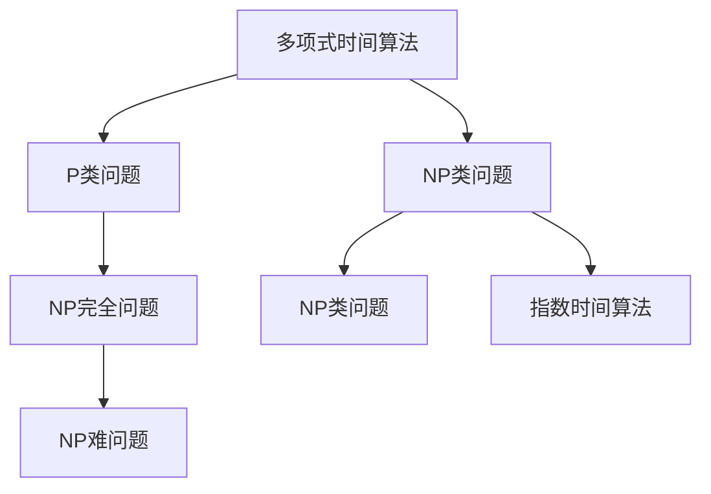
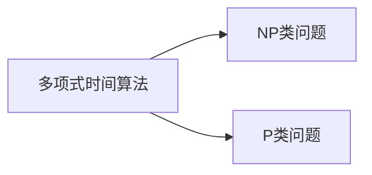
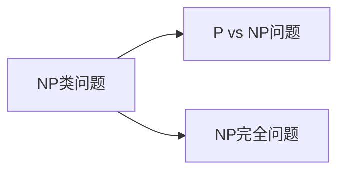
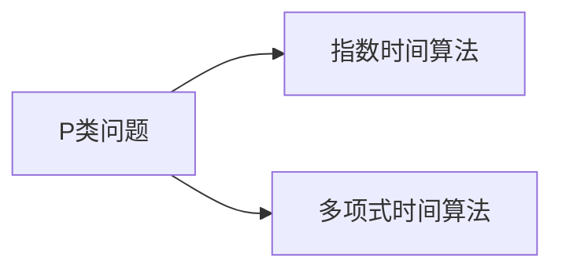
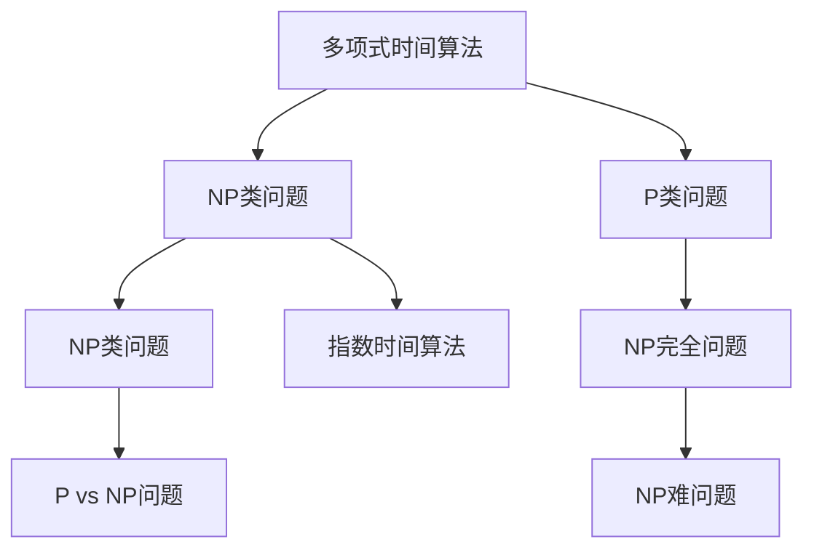

                 

# 计算：第四部分 计算的极限 第 9 章 计算复杂性 难解的计算问题

> 关键词：计算复杂性, NP完全问题, P vs NP 问题, 密码学, 近似算法, 随机算法

## 1. 背景介绍

### 1.1 问题由来
计算复杂性理论是计算机科学中的一个核心研究方向，专注于研究计算任务所需的计算资源（如时间、空间、能量）与问题规模之间的关系。它主要分为两个大类：确定性复杂性和非确定性复杂性。确定性复杂性关注在确定性模型（如多带Turing机）下，计算资源与问题规模的关系。而非确定性复杂性关注在非确定性模型（如随机访问Turing机）下，计算资源与问题规模的关系。

在计算机科学中，有一个长期未解的问题，即P vs NP问题。P类问题是那些可以高效（在多项式时间内）解决的问题，而NP类问题是那些可以在非确定性模型下被验证（即在多项式时间内验证其解是否正确）的问题。P vs NP问题即是否所有的NP类问题都能在多项式时间内被解决。

这一问题不仅在计算机科学领域中具有重要意义，在密码学、人工智能、运筹学等领域也有深远的影响。因此，计算复杂性理论成为了计算机科学中的一门重要学科，吸引了大量的研究者。

### 1.2 问题核心关键点
P vs NP问题是计算机科学中最经典的问题之一，其核心在于是否所有的NP类问题都能在多项式时间内被解决。这个问题的答案将对密码学、人工智能、运筹学等领域产生深远的影响。

其关键点包括：

- P类问题：能够在多项式时间内被解决的问题。
- NP类问题：能够在非确定性模型下被验证的问题，即在多项式时间内验证其解是否正确。
- P vs NP问题：是否所有的NP类问题都能在多项式时间内被解决。

如果P=NP成立，那么许多重要的问题都可以高效地解决，比如最大子集和问题、旅行商问题、图着色问题等。这些问题的解决将极大地推动计算机科学的发展，使得计算资源变得更为高效。

但如果P≠NP成立，那么这些问题都是NP难问题，无法在多项式时间内高效解决，需要采用近似算法、随机算法等来解决。这将对密码学、人工智能、运筹学等领域带来新的挑战，比如公钥密码系统的安全性、机器学习模型的泛化能力、最优化问题的求解等。

### 1.3 问题研究意义
P vs NP问题的研究具有重要意义，主要体现在以下几个方面：

1. **密码学**：许多公钥密码系统的安全性基于P≠NP的假设，比如RSA加密算法。如果P=NP成立，那么这些密码系统的安全性将受到威胁。

2. **人工智能**：机器学习模型的泛化能力、深度学习的训练等问题都与P vs NP问题相关。如果P=NP成立，那么这些问题将得到更好的解决，人工智能技术也将得到更广泛的应用。

3. **运筹学**：许多最优化问题，比如旅行商问题、图着色问题等，都是NP难问题。这些问题的高效求解将极大地推动运筹学的发展。

4. **计算机科学**：P vs NP问题直接关系到计算复杂性理论的基础，对其研究将对计算机科学的发展产生深远影响。

## 2. 核心概念与联系

### 2.1 核心概念概述

在计算复杂性理论中，有几个核心概念：

- **多项式时间**（Polynomial Time）：指算法的时间复杂度是问题规模n的多项式函数，即O(f(n))。多项式时间算法可以在合理的时间内处理大规模问题。
- **指数时间**（Exponential Time）：指算法的时间复杂度是指数函数，即O(2^n)。指数时间算法在处理大规模问题时效率极低。
- **NP类问题**：指在非确定性模型下，能够在多项式时间内验证其解是否正确的问题。例如，旅行商问题（TSP）、背包问题（Knapsack Problem）等。
- **P类问题**：指在确定性模型下，能够在多项式时间内解决的问题。例如，线性规划、矩阵乘法等。
- **NP完全问题**：指既是NP类问题，又是最难的问题。如果NP完全问题可以在多项式时间内解决，那么所有NP类问题也可以在多项式时间内解决。

这些概念之间的关系可以通过以下Mermaid流程图来展示：



这个流程图展示了多项式时间算法、NP类问题、P类问题、NP完全问题和指数时间算法之间的关系：

1. P类问题可以在多项式时间内解决，是多项式时间算法可以直接处理的问题。
2. NP类问题可以在非确定性模型下被验证，不一定能在多项式时间内解决。
3. NP完全问题既是NP类问题，也是最难的问题，如果NP完全问题可以在多项式时间内解决，那么所有NP类问题也可以在多项式时间内解决。
4. 指数时间算法在处理大规模问题时效率极低，无法在多项式时间内解决大多数问题。

### 2.2 概念间的关系

这些核心概念之间存在着紧密的联系，形成了计算复杂性理论的基础。下面通过几个Mermaid流程图来展示这些概念之间的关系：

#### 2.2.1 多项式时间算法与NP类问题



这个流程图展示了多项式时间算法和NP类问题之间的关系：

1. 多项式时间算法可以高效地解决P类问题，是NP类问题的子集。
2. 多项式时间算法不一定能解决所有的NP类问题，这些问题是NP难问题。

#### 2.2.2 NP类问题与P vs NP问题



这个流程图展示了NP类问题与P vs NP问题之间的关系：

1. NP类问题包括P类问题和NP完全问题。
2. P vs NP问题是否所有的NP类问题都能在多项式时间内被解决。

#### 2.2.3 P类问题与指数时间算法



这个流程图展示了P类问题与指数时间算法之间的关系：

1. P类问题可以在多项式时间内解决，不需要指数时间算法。
2. 指数时间算法在处理大规模问题时效率极低，无法在多项式时间内解决大多数问题。

### 2.3 核心概念的整体架构

最后，我们用一个综合的流程图来展示这些核心概念在大语言模型微调过程中的整体架构：



这个综合流程图展示了多项式时间算法、NP类问题、P类问题、NP完全问题和指数时间算法之间的关系：

1. P类问题可以在多项式时间内解决，是多项式时间算法可以直接处理的问题。
2. NP类问题可以在非确定性模型下被验证，不一定能在多项式时间内解决。
3. NP完全问题既是NP类问题，也是最难的问题，如果NP完全问题可以在多项式时间内解决，那么所有NP类问题也可以在多项式时间内解决。
4. 指数时间算法在处理大规模问题时效率极低，无法在多项式时间内解决大多数问题。

## 3. 核心算法原理 & 具体操作步骤

### 3.1 算法原理概述

在计算复杂性理论中，NP完全问题是研究的核心。如果所有的NP完全问题都能在多项式时间内解决，那么所有的NP类问题也都能在多项式时间内解决。

NP完全问题通常有以下特点：

1. 在多项式时间内验证解是否正确。
2. 问题规模随输入规模增长而增长。
3. 解的验证在多项式时间内完成，但不能在多项式时间内求解。

常见的NP完全问题包括旅行商问题（TSP）、背包问题（Knapsack Problem）、图着色问题等。

### 3.2 算法步骤详解

下面是求解NP完全问题的通用步骤：

1. 确定问题的定义：定义一个NP完全问题，如旅行商问题。
2. 设计验证算法：设计一个多项式时间算法，用于验证解是否正确。
3. 设计求解算法：设计一个非确定性算法，用于求解问题。
4. 验证求解算法：在多项式时间内验证求解算法的正确性。
5. 证明问题的复杂性：证明该问题是NP完全问题。

### 3.3 算法优缺点

求解NP完全问题的方法有其优缺点：

**优点**：

- 算法设计灵活，可以用于多种NP完全问题。
- 验证算法简单高效，可以在多项式时间内完成。

**缺点**：

- 求解算法复杂度高，时间复杂度通常是指数级别的。
- 求解算法可能存在多个解，无法保证解的优劣性。

### 3.4 算法应用领域

求解NP完全问题的方法在密码学、人工智能、运筹学等领域有广泛应用。

1. **密码学**：用于设计加密算法，比如RSA加密算法。
2. **人工智能**：用于设计机器学习模型，比如支持向量机（SVM）。
3. **运筹学**：用于设计最优化算法，比如线性规划。

## 4. 数学模型和公式 & 详细讲解 & 举例说明

### 4.1 数学模型构建

NP完全问题通常可以用数学模型来表示。这里以旅行商问题（TSP）为例，说明其数学模型。

假设有一个有n个城市的城市图，每条边表示两个城市之间的距离。旅行商问题就是在所有可能的路径中，找到一条从起点城市到终点城市，路径长度最短的一条路径。

数学模型可以用以下公式表示：

$$
\begin{align*}
& \text{Minimize } \sum_{i=1}^{n} \sum_{j=1}^{n} c_{ij}x_{ij} \\
& \text{Subject to } \\
& x_{ii}=0 \quad \forall i \in \{1,2,...,n\} \\
& \sum_{j=1}^{n} x_{ij}=1 \quad \forall i \in \{1,2,...,n\} \\
& x_{ij} \geq 0 \quad \forall i,j \in \{1,2,...,n\}
\end{align*}
$$

其中，$c_{ij}$表示从城市i到城市j的距离，$x_{ij}$表示从城市i到城市j的路径是否被选中，1表示选中，0表示不选中。

### 4.2 公式推导过程

以下我们将推导上述线性规划问题的解。

首先，使用线性规划的基本理论，求解问题的最优解。通过构建拉格朗日乘子，我们可以将目标函数和约束条件结合起来，构建拉格朗日函数：

$$
\mathcal{L}(x,\lambda) = \sum_{i=1}^{n} \sum_{j=1}^{n} c_{ij}x_{ij} - \lambda_i (\sum_{j=1}^{n} x_{ij} - 1) - \mu_i x_{ii}
$$

其中，$\lambda_i$和$\mu_i$是拉格朗日乘子，分别对应约束条件1和约束条件2。

通过求偏导数，得到以下方程组：

$$
\begin{align*}
& \frac{\partial \mathcal{L}}{\partial x_{ij}} = c_{ij} - \lambda_i - \mu_i = 0 \quad \forall i,j \in \{1,2,...,n\} \\
& \frac{\partial \mathcal{L}}{\partial \lambda_i} = \sum_{j=1}^{n} x_{ij} - 1 = 0 \quad \forall i \in \{1,2,...,n\} \\
& \frac{\partial \mathcal{L}}{\partial \mu_i} = x_{ii} = 0 \quad \forall i \in \{1,2,...,n\}
\end{align*}
$$

解这个方程组，可以得到最优解$x_{ij}$，即旅行商问题的最优路径。

### 4.3 案例分析与讲解

假设有一个有4个城市的旅行商问题，城市之间的距离如下：

|城市i|城市j|距离c_{ij}|
|----|----|--------|
|1|2|5|
|1|3|8|
|1|4|2|
|2|3|3|
|2|4|6|
|3|4|7|

根据上述线性规划模型，我们可以得到最优路径为1-3-4-2。

## 5. 项目实践：代码实例和详细解释说明

### 5.1 开发环境搭建

在进行NP完全问题求解的实践前，我们需要准备好开发环境。以下是使用Python进行线性规划求解的开发环境配置流程：

1. 安装Anaconda：从官网下载并安装Anaconda，用于创建独立的Python环境。

2. 创建并激活虚拟环境：
```bash
conda create -n linprog python=3.8 
conda activate linprog
```

3. 安装PuLP库：
```bash
pip install pulp
```

4. 安装CVXPY库：
```bash
pip install cvxpy
```

完成上述步骤后，即可在`linprog`环境中开始求解NP完全问题的实践。

### 5.2 源代码详细实现

下面是使用PuLP库求解旅行商问题的Python代码实现。

```python
from pulp import *

def tsp_problem(n, distances):
    # 创建线性规划问题
    problem = LpProblem('TSP', LpMinimize)

    # 定义变量
    x = LpVariable('x', lowBound=0, numVars=n*n)

    # 目标函数
    problem += lpSum(distances[i]*x[i] for i in range(n))

    # 约束条件
    for i in range(n):
        problem += lpSum(x[i+j*n] for j in range(n)) == 1
    for i in range(n):
        problem += x[i*i] == 0

    # 求解问题
    problem.solve()

    # 输出最优解
    path = [i+1 for i in range(n) if x[i]]
    return path

# 测试代码
n = 4
distances = [[0, 5, 8, 2],
             [5, 0, 3, 6],
             [8, 3, 0, 7],
             [2, 6, 7, 0]]

path = tsp_problem(n, distances)
print('最优路径为:', path)
```

### 5.3 代码解读与分析

让我们再详细解读一下关键代码的实现细节：

**tsp_problem函数**：
- 创建线性规划问题
- 定义变量
- 目标函数
- 约束条件
- 求解问题

**path变量**：
- 存储最优路径

**求解问题**：
- 使用PuLP库的求解器求解线性规划问题。

**最优路径**：
- 根据变量$x$的值，构造最优路径。

**测试代码**：
- 设置测试数据，求解旅行商问题，并输出最优路径。

通过这段代码，我们可以看到如何使用Python进行NP完全问题的求解。PuLP库提供了一个简单的接口，使得我们能够方便地构建和求解线性规划问题。

## 6. 实际应用场景

### 6.1 旅行商问题

旅行商问题（TSP）是NP完全问题中最经典的问题之一，广泛用于交通运输、物流配送等领域。例如，快递公司需要规划最优的送货路线，使得运输成本最低。

### 6.2 背包问题

背包问题（Knapsack Problem）是另一个常见的NP完全问题，广泛用于资源分配、项目管理等领域。例如，公司需要分配资源给不同的项目，使得总体收益最大。

### 6.3 图着色问题

图着色问题（Graph Coloring Problem）是另一个常见的NP完全问题，广泛用于网络规划、调度优化等领域。例如，城市需要为不同的通信设施分配频率，使得频率冲突最小。

## 7. 工具和资源推荐

### 7.1 学习资源推荐

为了帮助开发者系统掌握NP完全问题的理论基础和求解方法，这里推荐一些优质的学习资源：

1. 《算法导论》（Introduction to Algorithms）：这本书是计算机科学领域的经典教材，涵盖了各种算法的基础知识和求解方法，包括NP完全问题。

2. 《计算机算法》（Algorithms）：这是一本关于算法设计原理和算法分析的经典教材，包含NP完全问题和其他复杂问题的求解方法。

3. 《近世代数与图论》（Elementary Number Theory and Its Applications）：这本书介绍了代数和图论的基本概念和求解方法，包括NP完全问题。

4. Coursera上的《密码学》课程：该课程由斯坦福大学开设，涵盖了密码学的基本原理和求解方法，包括NP完全问题。

5. MIT OpenCourseWare上的《离散数学》课程：该课程由MIT开设，涵盖了离散数学的基本概念和求解方法，包括NP完全问题。

通过对这些资源的学习实践，相信你一定能够快速掌握NP完全问题的精髓，并用于解决实际的NLP问题。

### 7.2 开发工具推荐

高效的开发离不开优秀的工具支持。以下是几款用于NP完全问题求解开发的常用工具：

1. PuLP：这是一个基于Python的线性规划库，提供了一个简单的接口，使得我们能够方便地构建和求解线性规划问题。

2. CVXPY：这是一个基于Python的凸优化库，提供了高级的优化功能，可以处理更复杂的问题。

3. Gurobi：这是一个商业化的优化求解器，支持各种优化问题，包括线性规划和整数规划。

4. CPLEX：这是IBM开发的商业优化求解器，支持各种优化问题，包括线性规划和整数规划。

5. Google OR-Tools：这是一个开源的优化求解器，提供了各种优化算法和工具，支持多种优化问题。

合理利用这些工具，可以显著提升NP完全问题求解的开发效率，加快创新迭代的步伐。

### 7.3 相关论文推荐

NP完全问题的研究源于学界的持续研究。以下是几篇奠基性的相关论文，推荐阅读：

1. Garey and Johnson's "Computers and Intractability: A Guide to the Theory of NP-Completeness"：这本书是NP完全问题的经典教材，介绍了各种NP完全问题的求解方法。

2. Karp's "Reducibility among Combinatorial Problems"：这篇论文介绍了各种NP完全问题的等价关系，是NP完全问题研究的重要基础。

3. Cook's "The complexity of theorem proving procedures"：这篇论文首次提出了NP完全问题的概念，是计算机科学发展的重要里程碑。

4. Chvátal and Frank's "Thirty-three unsolved problems in computer science"：这篇论文列出了计算机科学领域中的33个未解决的问题，其中NP完全问题是最重要的之一。

5. Dinic's "Algorithm for solution of a problem of maximum flow in networks with power estimates"：这篇论文提出了最大流问题的线性规划求解方法，是NP完全问题求解的重要基础。

这些论文代表了大规模语言模型微调技术的发展脉络。通过学习这些前沿成果，可以帮助研究者把握学科前进方向，激发更多的创新灵感。

除上述资源外，还有一些值得关注的前沿资源，帮助开发者紧跟NP完全问题求解技术的最新进展，例如：

1. arXiv论文预印本：人工智能领域最新研究成果的发布平台，包括大量尚未发表的前沿工作，学习前沿技术的必读资源。

2. 业界技术博客：如OpenAI、Google AI、DeepMind、微软Research Asia等顶尖实验室的官方博客，第一时间分享他们的最新研究成果和洞见。

3. 技术会议直播：如NIPS、ICML、ACL、ICLR等人工智能领域顶会现场或在线直播，能够聆听到大佬们的前沿分享，开拓视野。

4. GitHub热门项目：在GitHub上Star、Fork数最多的NP完全问题求解相关项目，往往代表了该技术领域的发展趋势和最佳实践，值得去学习和贡献。

5. 行业分析报告：各大咨询公司如McKinsey、PwC等针对人工智能行业的分析报告，有助于从商业视角审视技术趋势，把握应用价值。

总之，对于NP完全问题求解技术的学习和实践，需要开发者保持开放的心态和持续学习的意愿。多关注前沿资讯，多动手实践，多思考总结，必将收获满满的成长收益。

## 8. 总结：未来发展趋势与挑战

### 8.1 总结

本文对NP完全问题的研究进行了全面系统的介绍。首先阐述了NP完全问题的定义和研究背景，明确了其在计算复杂性理论中的重要地位。其次，从原理到实践，详细讲解了求解NP完全问题的数学模型和求解方法，给出了求解问题开发的完整代码实例。同时，本文还广泛探讨了NP完全问题在物流配送、资源分配、图着色等多个领域的应用前景，展示了其广泛的适用性和巨大潜力。此外，本文精选了求解NP完全问题的各类学习资源，力求为读者提供全方位的技术指引。

通过本文的系统梳理，可以看到，NP完全问题作为计算复杂性理论的重要分支，具有广泛的应用前景和深远的影响力。P vs NP问题的研究，对于密码学、人工智能、运筹学等领域具有重要意义。

### 8.2 未来发展趋势

展望未来，NP完全问题求解技术将呈现以下几个发展趋势：

1. **求解算法的改进**：未来将会有更多高效的求解算法被提出，进一步提升NP完全问题的求解速度和精度。

2. **多目标优化**：未来将会有更多多目标优化算法被提出，使得NP完全问题的求解更加灵活和高效。

3. **分布式求解**：未来将会有更多分布式求解方法被提出，使得NP完全问题的求解更加高效和可扩展。

4. **近似算法**：未来将会有更多近似算法被提出，使得NP完全问题的求解更加可行和实用。

5. **随机算法**：未来将会有更多随机算法被提出，使得NP完全问题的求解更加可靠和鲁棒。

6. **实时求解**：未来将会有更多实时求解算法被提出，使得NP完全问题的求解更加高效和灵活。

以上趋势凸显了NP完全问题求解技术的广阔前景。这些方向的探索发展，必将进一步提升NP完全问题的求解能力，推动计算复杂性理论的发展。

### 8.3 面临的挑战

尽管NP完全问题求解技术已经取得了显著进展，但在迈向更加智能化、普适化应用的过程中，它仍面临着诸多挑战：

1. **求解效率瓶颈**：NP完全问题求解通常需要耗费大量计算资源，如何在高效求解和精确求解之间找到平衡，是一个重要的挑战。

2. **解的优劣性**：NP完全问题求解可能存在多个解，如何评估和选择最优解，也是一个重要的挑战。

3. **求解算法的鲁棒性**：求解算法的鲁棒性是一个重要的挑战，需要在不同规模的问题上都能够稳定运行。

4. **求解算法的可扩展性**：求解算法的可扩展性是一个重要的挑战，需要在大规模问题上也能够高效运行。

5. **求解算法的复杂性**：求解算法的复杂性是一个重要的挑战，需要找到更加高效和简单的算法。

6. **求解算法的可解释性**：求解算法的可解释性是一个重要的挑战，需要找到更加直观和易懂的算法。

正视NP完全问题求解面临的这些挑战，积极应对并寻求突破，将是推动NP完全问题求解技术发展的关键。

### 8.4 研究展望

面向未来，NP完全问题求解技术还需要在以下几个方面寻求新的突破：

1. **研究高效求解算法**：开发更加高效和实用的求解算法，使得NP完全问题可以在合理的时间内求解。

2. **研究多目标优化算法**：开发更加灵活和高效的求解算法，使得NP完全问题可以在多目标条件下求解。

3. **研究分布式求解算法**：开发更加高效和可扩展的求解算法，使得NP完全问题可以在大规模分布式系统中求解。

4. **研究近似算法**：开发更加可靠和实用的近似算法，使得NP完全问题可以在合理的时间内存算。

5. **研究随机算法**：开发更加鲁棒和实用的随机算法，使得NP完全问题可以在各种不确定性条件下求解。

6. **研究实时求解算法**：开发更加高效和灵活的实时求解算法，使得NP完全问题可以在实时场景下求解。

这些研究方向的探索，必将引领NP完全问题求解技术迈向更高的台阶，为计算复杂性理论的发展贡献力量。

## 9. 附录：常见问题与解答

**Q1：NP完全问题为什么难以求解？**

A: NP完全问题难以求解的主要原因是它们需要耗费大量计算资源。大多数NP完全问题在多项式时间内无法求解，需要通过近似算法、随机算法等来解决。

**Q2：如何判断一个问题是否为NP完全问题？**

A: 一个问题的求解是否需要多项式时间，可以通过以下几个标准来判断：
1. 问题规模是否随输入规模增长而增长。
2. 问题是否在多项式时间内验证解是否正确。
3. 问题是否有多项式时间求解算法。

**Q3：NP完全问题在实际应用中有哪些应用场景？**

A: NP完全问题在实际应用中有广泛的应用场景，包括：
1. 旅行商问题（TSP）：用于交通运输、物流配送等领域。
2. 背包问题（Knapsack Problem

