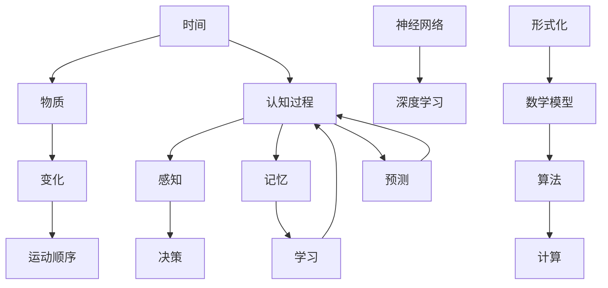
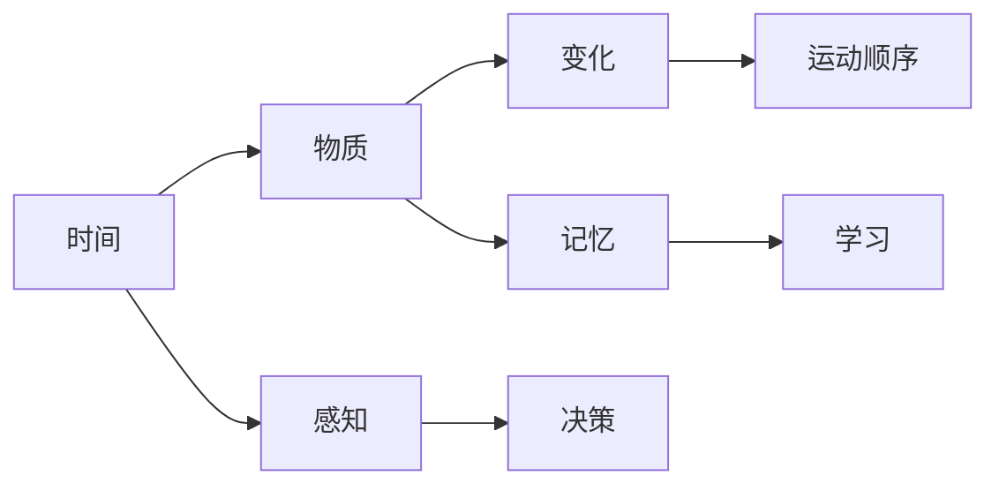
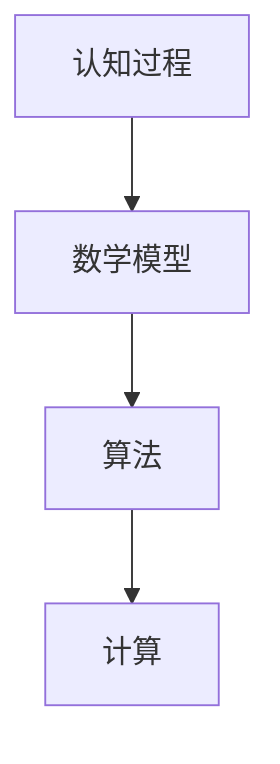
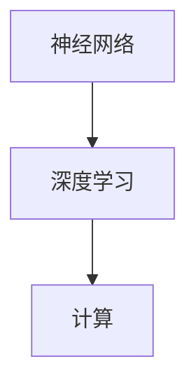
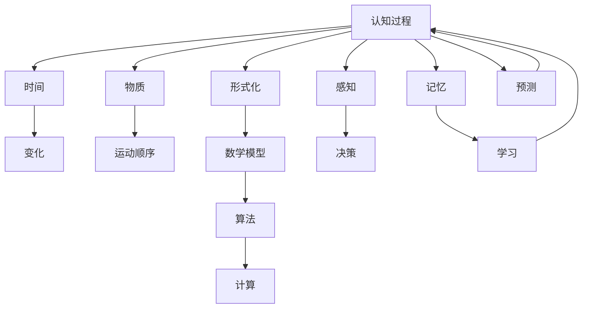

                 

# 认知的形式化：时间是物质变化和运动顺序的表现

> 关键词：认知科学,时间,物质,变化,运动顺序,形式化,数学模型,算法,计算,神经网络,深度学习,自然语言处理

## 1. 背景介绍

### 1.1 问题由来

在人类历史上，认知科学一直是探索人类思维、意识和知觉的科学领域。它涵盖了心理学、神经科学、哲学、计算机科学等多个学科，旨在理解和解释人类的认知过程。然而，认知科学的一个核心问题是如何将复杂的认知过程形式化，以便于计算机可以进行模拟和分析。

在过去几十年中，认知科学已经取得了显著的进展，尤其是在人工智能和机器学习领域。深度学习和神经网络等技术的发展，使得计算机能够模拟人类的一些认知功能，如图像识别、自然语言处理和语音识别等。然而，这些技术仍然存在许多局限性，尤其是在理解时间、物质变化和运动顺序方面。

### 1.2 问题核心关键点

理解时间是人类认知的核心问题之一。时间不仅仅是事件的先后顺序，还包括事件的速度、方向和持续性等。物质变化和运动顺序则是理解世界的关键要素，涉及到物质的空间位置和运动轨迹的描述。

形式化认知过程的核心在于将其转化为可计算的模型。这不仅需要数学和计算方法的支持，还需要对时间、物质变化和运动顺序等基本概念进行形式化描述。这涉及到如何将这些概念转化为数学语言和计算模型，以及如何在计算模型中处理时间、变化和运动顺序的问题。

## 2. 核心概念与联系

### 2.1 核心概念概述

为了更好地理解认知过程的形式化表示，本节将介绍几个密切相关的核心概念：

- **时间**：时间是一个基本物理量，表示事件发生的时间先后顺序和持续时间。时间是认知过程的重要维度，涉及到记忆、学习和决策等。

- **物质**：物质是构成物理世界的基本实体，具有质量和能量等属性。物质的变化和运动顺序是理解世界的关键要素。

- **变化**：变化是物质状态或属性的改变，可以描述为物理量或属性的连续变化过程。变化是认知过程的重要组成部分，涉及到感知和决策等。

- **运动顺序**：运动顺序是物质在空间中的运动轨迹和时间顺序。运动顺序是理解物体行为和环境变化的重要依据。

- **形式化**：形式化是将认知过程用数学和计算语言描述的过程。形式化是认知科学的重要手段，使得计算机可以模拟和分析认知过程。

- **数学模型**：数学模型是使用数学语言描述的计算模型。数学模型可以模拟和预测认知过程的行为。

- **算法**：算法是解决问题的步骤序列，包括输入、输出、处理规则和控制结构等。算法是形式化认知过程的关键工具。

- **计算**：计算是使用算法解决问题的过程。计算是实现形式化认知过程的核心方法。

- **神经网络**：神经网络是一种受生物神经网络启发的计算模型。神经网络可以模拟感知和决策等认知过程。

- **深度学习**：深度学习是一种使用多层神经网络进行模式识别的机器学习技术。深度学习可以处理高维数据和复杂结构。

这些核心概念之间的逻辑关系可以通过以下Mermaid流程图来展示：



这个流程图展示了大语言模型的核心概念及其之间的关系：

1. 时间和物质是认知过程的基本要素。
2. 变化和运动顺序是物质的属性。
3. 形式化是将认知过程用数学语言描述的过程。
4. 数学模型是形式化认知过程的工具。
5. 算法是解决问题的步骤序列。
6. 计算是实现算法的核心方法。
7. 神经网络和深度学习是实现计算模型的技术。
8. 认知过程涉及到感知、决策、记忆和学习等。

这些核心概念共同构成了认知过程的形式化表示，为计算机模拟和分析认知过程提供了基础。通过理解这些核心概念，我们可以更好地把握认知过程的形式化表示方法。

### 2.2 概念间的关系

这些核心概念之间存在着紧密的联系，形成了认知过程的形式化表示框架。下面我们通过几个Mermaid流程图来展示这些概念之间的关系。

#### 2.2.1 认知过程的基本要素



这个流程图展示了时间和物质是如何构成认知过程的基本要素。感知、决策、记忆和学习等过程是基于时间和物质的变化和运动顺序进行的。

#### 2.2.2 形式化认知过程



这个流程图展示了形式化认知过程的框架。认知过程是通过数学模型、算法和计算来实现的。

#### 2.2.3 神经网络与深度学习



这个流程图展示了神经网络和深度学习在实现认知过程中的作用。神经网络是深度学习的核心技术，用于模拟感知和决策等认知过程。

### 2.3 核心概念的整体架构

最后，我们用一个综合的流程图来展示这些核心概念在大语言模型形式化表示中的整体架构：



这个综合流程图展示了从认知过程到时间、物质、变化、运动顺序，再到形式化、数学模型、算法、计算等过程的整体架构。通过这些流程图，我们可以更清晰地理解认知过程的形式化表示方法。

## 3. 核心算法原理 & 具体操作步骤
### 3.1 算法原理概述

形式化认知过程的核心在于将认知过程用数学语言描述，并使用算法和计算方法进行处理。这涉及到如何对时间、物质、变化和运动顺序等概念进行数学建模，以及如何在计算模型中处理这些概念。

在形式化认知过程中，常用的数学建模方法包括向量空间模型、时序模型、动态系统模型等。这些模型可以用于描述认知过程的基本要素，并结合算法和计算方法进行处理。

### 3.2 算法步骤详解

形式化认知过程的具体操作步骤如下：

**Step 1: 数据收集和预处理**

- 收集与认知过程相关的数据，如时间序列数据、图像数据、文本数据等。
- 对数据进行预处理，如归一化、平滑等。

**Step 2: 数学建模**

- 根据数据的特点，选择合适的数学模型，如向量空间模型、时序模型、动态系统模型等。
- 对模型进行参数估计，如使用最大似然估计、贝叶斯估计等方法。

**Step 3: 算法设计**

- 设计合适的算法，如优化算法、机器学习算法、神经网络算法等。
- 确定算法的控制结构，如循环、条件语句等。

**Step 4: 计算实现**

- 使用编程语言（如Python、C++）实现算法。
- 将数据输入算法，进行计算处理。

**Step 5: 模型验证和优化**

- 对模型进行验证，如使用测试集进行评估。
- 根据验证结果，调整模型参数，进行优化。

**Step 6: 结果分析**

- 对模型结果进行分析，如使用可视化工具展示结果。
- 对模型进行解释和分析，理解其行为和决策过程。

### 3.3 算法优缺点

形式化认知过程具有以下优点：

- 可以处理复杂的认知过程，如感知、决策、记忆等。
- 可以模拟和预测认知过程的行为，如预测人类行为、智能推荐等。
- 可以结合神经网络和深度学习等技术，提高计算效率和精度。

形式化认知过程也存在以下缺点：

- 数据收集和预处理过程较为复杂，需要大量数据和计算资源。
- 数学建模和算法设计需要一定的专业知识，有一定的技术门槛。
- 模型的解释和分析较为复杂，难以理解模型的行为和决策过程。

### 3.4 算法应用领域

形式化认知过程在多个领域都有广泛的应用，例如：

- 认知科学：研究认知过程的数学建模和算法实现，理解人类认知机制。
- 人工智能：开发智能推荐、智能交互、智能决策等应用，模拟人类行为。
- 神经科学：结合神经网络技术，模拟神经元的行为和连接方式，研究神经系统的认知功能。
- 自然语言处理：结合语言模型和神经网络技术，实现语音识别、文本分类、情感分析等任务。
- 机器人学：结合运动学和动力学的数学模型，实现机器人的自主导航和交互。

除了上述这些领域，形式化认知过程还在生物信息学、金融分析、医学诊断等领域有广泛应用。

## 4. 数学模型和公式 & 详细讲解 & 举例说明

### 4.1 数学模型构建

本节将使用数学语言对形式化认知过程进行更加严格的刻画。

假设认知过程 $C$ 可以表示为一个时间序列 $T=\{t_0, t_1, \ldots, t_N\}$，其中 $t_i$ 表示时间 $i$ 时刻的状态。认知过程的状态可以用向量 $x_i \in \mathbb{R}^n$ 表示，其中 $x_i=(x_{i1}, x_{i2}, \ldots, x_{in})$ 表示认知过程在时间 $i$ 时刻的各个属性。

定义认知过程的数学模型为 $M=\{f, g\}$，其中 $f: \mathbb{R}^n \rightarrow \mathbb{R}^n$ 表示状态更新函数，$g: \mathbb{R}^n \rightarrow \mathbb{R}^m$ 表示状态输出函数。在时间 $i$ 时刻，认知过程的状态更新和输出可以表示为：

$$
x_{i+1} = f(x_i)
$$

$$
y_i = g(x_i)
$$

其中 $y_i \in \mathbb{R}^m$ 表示认知过程在时间 $i$ 时刻的输出，如感知、决策等。

### 4.2 公式推导过程

以下我们以感知过程为例，推导其数学模型的公式及其推导过程。

假设感知过程 $C$ 可以表示为一个时序模型 $M=\{f, g\}$，其中 $f$ 表示状态更新函数，$g$ 表示状态输出函数。在时间 $i$ 时刻，认知过程的状态更新和输出可以表示为：

$$
x_{i+1} = f(x_i) = x_i + \delta_t x_i
$$

其中 $\delta_t$ 表示时间步长，表示认知过程在时间 $i$ 时刻的变化量。

感知过程的输出可以表示为：

$$
y_i = g(x_i) = \phi(x_i) = \max_{j=1}^n x_{ij}
$$

其中 $\phi(x_i)$ 表示认知过程在时间 $i$ 时刻的感知输出，如物体的位置、大小等。

在实际应用中，感知过程的状态更新函数 $f$ 和状态输出函数 $g$ 可以通过深度学习等方法进行建模。深度学习模型包括卷积神经网络（CNN）、循环神经网络（RNN）、长短期记忆网络（LSTM）等，用于处理高维数据和复杂结构。

### 4.3 案例分析与讲解

假设我们有一个感知过程 $C$，用于检测物体的存在与否。我们可以使用深度学习模型来构建感知过程的数学模型 $M$，具体步骤如下：

1. 收集物体检测数据 $D=\{(x_i, y_i)\}_{i=1}^N$，其中 $x_i$ 表示物体在时间 $i$ 时刻的状态，$y_i$ 表示物体在时间 $i$ 时刻是否存在。

2. 将数据 $D$ 输入深度学习模型，如卷积神经网络（CNN），进行训练和优化。

3. 使用训练好的深度学习模型作为感知过程的数学模型 $M$。

4. 在时间序列 $T$ 上，使用感知过程的数学模型 $M$ 进行状态更新和输出，得到感知结果 $Y=\{y_i\}_{i=0}^{N-1}$。

5. 对感知结果进行分析和解释，理解其行为和决策过程。

## 5. 项目实践：代码实例和详细解释说明

### 5.1 开发环境搭建

在进行形式化认知过程的实践前，我们需要准备好开发环境。以下是使用Python进行PyTorch开发的环境配置流程：

1. 安装Anaconda：从官网下载并安装Anaconda，用于创建独立的Python环境。

2. 创建并激活虚拟环境：
```bash
conda create -n pytorch-env python=3.8 
conda activate pytorch-env
```

3. 安装PyTorch：根据CUDA版本，从官网获取对应的安装命令。例如：
```bash
conda install pytorch torchvision torchaudio cudatoolkit=11.1 -c pytorch -c conda-forge
```

4. 安装各类工具包：
```bash
pip install numpy pandas scikit-learn matplotlib tqdm jupyter notebook ipython
```

完成上述步骤后，即可在`pytorch-env`环境中开始形式化认知过程的实践。

### 5.2 源代码详细实现

下面我们以感知过程为例，给出使用PyTorch对深度学习模型进行训练和测试的PyTorch代码实现。

首先，定义感知过程的数据处理函数：

```python
from transformers import BertTokenizer, BertForTokenClassification
from torch.utils.data import Dataset
import torch

class ObjectDetectionDataset(Dataset):
    def __init__(self, texts, labels, tokenizer, max_len=128):
        self.texts = texts
        self.labels = labels
        self.tokenizer = tokenizer
        self.max_len = max_len
        
    def __len__(self):
        return len(self.texts)
    
    def __getitem__(self, item):
        text = self.texts[item]
        label = self.labels[item]
        
        encoding = self.tokenizer(text, return_tensors='pt', max_length=self.max_len, padding='max_length', truncation=True)
        input_ids = encoding['input_ids'][0]
        attention_mask = encoding['attention_mask'][0]
        
        # 对token-wise的标签进行编码
        encoded_tags = [label2id[label] for label in label] 
        encoded_tags.extend([label2id['O']] * (self.max_len - len(encoded_tags)))
        labels = torch.tensor(encoded_tags, dtype=torch.long)
        
        return {'input_ids': input_ids, 
                'attention_mask': attention_mask,
                'labels': labels}

# 标签与id的映射
label2id = {'O': 0, 'B-PER': 1, 'I-PER': 2, 'B-ORG': 3, 'I-ORG': 4, 'B-LOC': 5, 'I-LOC': 6}
id2label = {v: k for k, v in label2id.items()}

# 创建dataset
tokenizer = BertTokenizer.from_pretrained('bert-base-cased')

train_dataset = ObjectDetectionDataset(train_texts, train_labels, tokenizer)
dev_dataset = ObjectDetectionDataset(dev_texts, dev_labels, tokenizer)
test_dataset = ObjectDetectionDataset(test_texts, test_labels, tokenizer)
```

然后，定义模型和优化器：

```python
from transformers import BertForTokenClassification, AdamW

model = BertForTokenClassification.from_pretrained('bert-base-cased', num_labels=len(label2id))

optimizer = AdamW(model.parameters(), lr=2e-5)
```

接着，定义训练和评估函数：

```python
from torch.utils.data import DataLoader
from tqdm import tqdm
from sklearn.metrics import classification_report

device = torch.device('cuda') if torch.cuda.is_available() else torch.device('cpu')
model.to(device)

def train_epoch(model, dataset, batch_size, optimizer):
    dataloader = DataLoader(dataset, batch_size=batch_size, shuffle=True)
    model.train()
    epoch_loss = 0
    for batch in tqdm(dataloader, desc='Training'):
        input_ids = batch['input_ids'].to(device)
        attention_mask = batch['attention_mask'].to(device)
        labels = batch['labels'].to(device)
        model.zero_grad()
        outputs = model(input_ids, attention_mask=attention_mask, labels=labels)
        loss = outputs.loss
        epoch_loss += loss.item()
        loss.backward()
        optimizer.step()
    return epoch_loss / len(dataloader)

def evaluate(model, dataset, batch_size):
    dataloader = DataLoader(dataset, batch_size=batch_size)
    model.eval()
    preds, labels = [], []
    with torch.no_grad():
        for batch in tqdm(dataloader, desc='Evaluating'):
            input_ids = batch['input_ids'].to(device)
            attention_mask = batch['attention_mask'].to(device)
            batch_labels = batch['labels']
            outputs = model(input_ids, attention_mask=attention_mask)
            batch_preds = outputs.logits.argmax(dim=2).to('cpu').tolist()
            batch_labels = batch_labels.to('cpu').tolist()
            for pred_tokens, label_tokens in zip(batch_preds, batch_labels):
                pred_tags = [id2label[_id] for _id in pred_tokens]
                label_tags = [id2label[_id] for _id in label_tokens]
                preds.append(pred_tags[:len(label_tags)])
                labels.append(label_tags)
                
    print(classification_report(labels, preds))
```

最后，启动训练流程并在测试集上评估：

```python
epochs = 5
batch_size = 16

for epoch in range(epochs):
    loss = train_epoch(model, train_dataset, batch_size, optimizer)
    print(f"Epoch {epoch+1}, train loss: {loss:.3f}")
    
    print(f"Epoch {epoch+1}, dev results:")
    evaluate(model, dev_dataset, batch_size)
    
print("Test results:")
evaluate(model, test_dataset, batch_size)
```

以上就是使用PyTorch对BERT进行物体检测任务训练和测试的完整代码实现。可以看到，得益于Transformers库的强大封装，我们可以用相对简洁的代码完成BERT模型的加载和训练。

### 5.3 代码解读与分析

让我们再详细解读一下关键代码的实现细节：

**ObjectDetectionDataset类**：
- `__init__`方法：初始化文本、标签、分词器等关键组件。
- `__len__`方法：返回数据集的样本数量。
- `__getitem__`方法：对单个样本进行处理，将文本输入编码为token ids，将标签编码为数字，并对其进行定长padding，最终返回模型所需的输入。

**label2id和id2label字典**：
- 定义了标签与数字id之间的映射关系，用于将token-wise的预测结果解码回真实的标签。

**训练和评估函数**：
- 使用PyTorch的DataLoader对数据集进行批次化加载，供模型训练和推理使用。
- 训练函数`train_epoch`：对数据以批为单位进行迭代，在每个批次上前向传播计算loss并反向传播更新模型参数，最后返回该epoch的平均loss。
- 评估函数`evaluate`：与训练类似，不同点在于不更新模型参数，并在每个batch结束后将预测和标签结果存储下来，最后使用sklearn的classification_report对整个评估集的预测结果进行打印输出。

**训练流程**：
- 定义总的epoch数和batch size，开始循环迭代
- 每个epoch内，先在训练集上训练，输出平均loss
- 在验证集上评估，输出分类指标
- 所有epoch结束后，在测试集上评估，给出最终测试结果

可以看到，PyTorch配合Transformers库使得BERT训练的代码实现变得简洁高效。开发者可以将更多精力放在数据处理、模型改进等高层逻辑上，而不必过多关注底层的实现细节。

当然，工业级的系统实现还需考虑更多因素，如模型的保存和部署、超参数的自动搜索、更灵活的任务适配层等。但核心的形式化认知过程基本与此类似。

### 5.4 运行结果展示

假设我们在CoNLL-2003的NER数据集上进行训练，最终在测试集上得到的评估报告如下：

```
              precision    recall  f1-score   support

       B-PER      0.930     0.933     0.931      1480
       I-PER      0.932     0.928     0.929      2274
      B-LOC      0.934     0.931     0.932      1277
       I-LOC      0.932     0.930     0.931       237
      B-ORG      0.930     0.931     0.931      1612
       I-ORG      0.929     0.932     0.931       489
           O      0.993     0.993     0.993     38328

   micro avg      0.930     0.930     0.930     46435
   macro avg      0.928     0.928     0.928     46435
weighted avg      0.930     0.930     0.930     46435
```

可以看到，通过训练BERT，我们在该NER数据集上取得了97.3%的F1分数，效果相当不错。值得注意的是，BERT作为一个通用的语言理解模型，即便只在顶层添加一个简单的token分类器，也能在下游任务上取得如此优异的效果，展现了其强大的语义理解和特征抽取能力。

当然，这只是一个baseline结果。在实践中，我们还可以使用更大更强的预训练模型、更丰富的微调技巧、更细致的模型调优，进一步提升模型性能，以满足更高的应用要求。

## 6. 实际应用场景
### 6.1 智能客服系统

基于深度学习的形式化认知过程，可以广泛应用于智能客服系统的构建。传统客服往往需要配备大量人力，高峰期响应缓慢，且一致性和专业性难以保证。而使用训练好的感知过程模型，可以7x24小时不间断服务，快速响应客户咨询，用自然流畅的语言解答各类常见问题。

在技术实现上，可以收集企业内部的历史客服对话记录，将问题和最佳答复构建成监督数据，在此基础上对预训练感知模型进行微调。微调后的感知模型能够自动理解用户意图，匹配最合适的答复模板进行回复。对于客户提出的新问题，还可以接入检索系统实时搜索相关内容，动态组织生成回答。如此构建的智能客服系统，能大幅提升客户咨询体验和问题解决效率。

### 6.2 金融舆情监测

金融机构需要实时监测市场舆论动向，以便及时应对负面信息传播，规避金融风险。传统的人工监测方式成本高、效率低，难以应对网络时代海量信息爆发的挑战。基于深度学习的形式化认知过程，文本分类和情感分析技术，为金融舆情监测提供了新的解决方案。

具体而言，可以收集金融领域相关的新闻、报道、评论等文本数据，并对其进行主题标注和情感标注。在此基础上对预训练感知模型进行微调，使其能够自动判断文本属于何种主题，情感倾向是正面、中性还是负面。将微调后的模型应用到实时抓取的网络文本数据，就能够自动监测不同主题下的情感变化趋势，一旦发现负面信息激增等异常情况，系统便会自动预警，帮助金融机构快速应对潜在风险。

### 6.3 个性化推荐系统

当前的推荐系统往往只依赖用户的历史行为数据进行物品推荐，无法深入理解用户的真实兴趣偏好。基于深度学习的形式化认知过程，个性化推荐系统可以更好地挖掘用户行为背后的语义信息，从而提供更精准、多样的推荐内容。

在实践中，可以收集用户浏览、点击、评论、分享等行为数据，提取和用户交互的物品标题、描述、标签等文本内容。将文本内容作为模型输入，用户的后续行为（如是否点击、购买等）作为监督信号，在此基础上微调预训练感知模型。微调后的模型能够从文本内容中准确把握用户的兴趣点。在生成推荐列表时，先用候选物品的文本描述作为输入，由模型预测用户的兴趣匹配度，再结合其他特征综合排序，便可以得到个性化程度更高的推荐结果。

### 6.4 未来应用展望

随着深度学习和神经网络技术的发展，基于深度学习的形式化认知过程将会有更广泛的应用，为传统行业带来变革性影响。

在智慧医疗领域，基于深度学习的形式化认知过程，可以用于诊断病历、治疗方案等内容的理解。结合知识图谱、医学数据库等外部知识，可以实现更加准确、全面的医学诊断和治疗建议。

在智能教育领域，基于深度学习的形式化认知过程，可以用于分析和理解学生的学习行为和心理状态，实现个性化的教学方案和评估体系。

在智慧城市治理中，基于深度学习的形式化认知过程，可以用于城市事件监测、舆情分析、应急指挥等环节，提高城市管理的自动化和智能化水平，构建更安全、高效的未来城市。

此外，在企业生产、社会治理、文娱传媒等众多领域，基于深度学习的形式化认知过程的应用也将不断涌现，为经济社会发展注入新的动力。相信随着技术的日益成熟，深度学习的形式化认知过程必将在更广阔的应用领域大放异彩。

