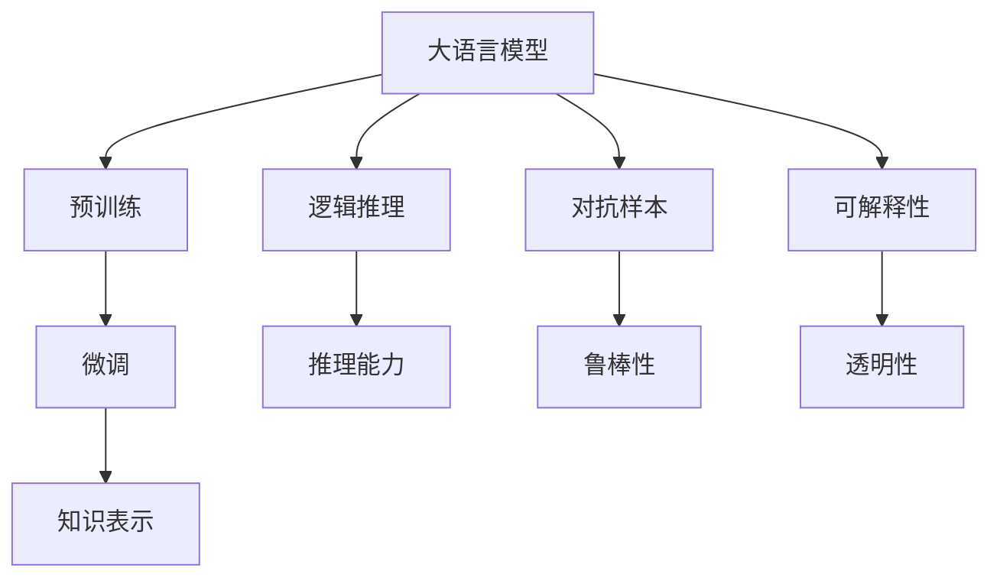
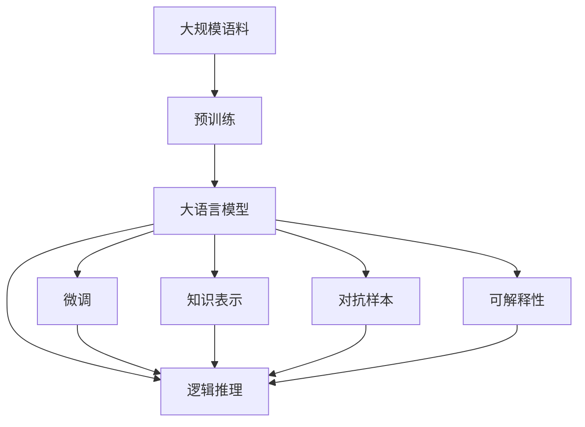

                 

## 1. 背景介绍

### 1.1 问题由来
在大语言模型的研究和发展中，一个核心议题是模型对于语言的理解和使用。无论是预训练还是微调，大模型都试图通过大规模语料的学习，捕捉语言的深层结构和规律。然而，这一过程中不可避免地涌现出一些认知困惑，挑战着我们对语言与人工智能之间关系的理解。

### 1.2 问题核心关键点
这些问题核心关键点包括：
- 语言的多义性和上下文依赖性。语言中的许多词汇和短语具有多重含义，而理解这些含义通常需要依赖上下文信息。
- 语言的创造性。语言不仅仅是预先定义的符号组合，还是一种创造性的工具，用于表达复杂和多变的概念。
- 知识的获取和应用。语言是知识的载体，大模型如何有效获取和应用这些知识，尤其是在跨领域和跨任务中的应用，是一个复杂的难题。
- 推理能力。推理是大模型的一项重要能力，但当前模型在逻辑推理和因果关系理解上还存在不足。
- 对抗性问题。大模型容易受到对抗样本的影响，导致推理出错。
- 可解释性。大模型的决策过程通常是"黑箱"，缺乏可解释性，限制了其在安全性和合规性要求较高的场景中的应用。

### 1.3 问题研究意义
这些认知困惑对于理解大语言模型的工作机制至关重要。其研究意义在于：

- 提升大语言模型的理解力。通过解决这些困惑，模型能够更准确地理解和处理自然语言。
- 增强模型的泛化能力。解决这些问题有助于模型在不同场景和任务中表现得更稳定和可靠。
- 促进知识工程的进展。对于语言的深层理解有助于更好地应用先验知识和规则，提升AI系统的智能水平。
- 优化推理机制。改善大模型的推理能力，使其在更复杂的任务上表现更好。
- 确保系统的安全性。解决对抗性问题，保障AI系统的鲁棒性和安全性。
- 提高可解释性。提供模型决策的透明性和可理解性，有助于增强用户信任。

## 2. 核心概念与联系

### 2.1 核心概念概述

在进行深入探讨之前，我们首先要梳理一些核心的概念，并明确它们之间的联系：

- **大语言模型(Large Language Model, LLM)**：如GPT、BERT等，通过在大规模无标签语料上进行自监督预训练，学习到丰富的语言知识和规律。
- **预训练(Pre-training)**：使用大规模无标签语料，通过自监督任务训练模型，学习语言的基本规律和表示。
- **微调(Fine-tuning)**：在预训练模型的基础上，使用少量标注数据进行有监督训练，使模型适应特定任务。
- **知识表示(Knowledge Representation)**：将先验知识以符号化或结构化的方式存储和表示，用于辅助模型理解和推理。
- **逻辑推理(Logical Reasoning)**：指模型基于一定的逻辑规则和因果关系，进行推理和判断。
- **对抗样本(Adversarial Examples)**：通过轻微修改输入数据，使模型推理出错，测试模型的鲁棒性。
- **可解释性(Explainability)**：指模型的决策过程可以被解释和理解，增强用户信任和合规性。

### 2.2 概念间的关系

这些核心概念之间存在紧密的联系，可以通过以下Mermaid流程图来展示：



这个流程图展示了各个概念之间的相互关系：

1. 大语言模型通过预训练获得基础能力。
2. 微调是让模型适应特定任务的细粒度优化过程。
3. 知识表示是辅助模型理解和推理的工具。
4. 逻辑推理是模型基于知识进行推理和判断的能力。
5. 对抗样本测试模型的鲁棒性，避免推理被对抗样本误导。
6. 可解释性使模型的决策过程透明，增强用户信任和合规性。

### 2.3 核心概念的整体架构

最后，我们用一个综合的流程图来展示这些核心概念在大语言模型中的应用架构：



这个综合流程图展示了从预训练到微调，再到推理和可解释性的完整过程。

## 3. 核心算法原理 & 具体操作步骤
### 3.1 算法原理概述

大语言模型的认知困惑主要源于语言的多义性和创造性，以及模型推理和知识应用的复杂性。为了解决这些问题，我们引入以下算法原理：

1. **语义嵌入(Semantic Embedding)**：通过将单词或短语映射到低维向量空间，捕捉它们之间的语义关系。
2. **上下文编码(Contextual Encoding)**：利用Transformer等架构，模型能够动态地编码上下文信息，处理不同语境下的多义词。
3. **注意力机制(Attention Mechanism)**：通过自注意力机制，模型能够关注和利用上下文中的关键信息，提升推理的准确性。
4. **知识图谱(Knowledge Graphs)**：构建知识图谱，将先验知识结构化存储，用于辅助推理。
5. **逻辑规则(Logical Rules)**：使用逻辑规则进行形式化推理，增强模型的推理能力。
6. **对抗训练(Adversarial Training)**：通过对抗样本训练，增强模型的鲁棒性。
7. **可解释性模型(Explainable Models)**：设计可解释的模型架构，提供决策过程的透明性。

### 3.2 算法步骤详解

大语言模型解决认知困惑的算法步骤如下：

1. **预训练**：
   - 使用大规模无标签语料，通过自监督任务训练模型，学习语言的普遍规律和表示。
   - 预训练目标通常包括语言建模、掩码语言模型等。

2. **微调**：
   - 选择预训练模型，使用少量标注数据进行有监督训练，适应特定任务。
   - 微调过程中，可以采用知识图谱、逻辑规则等辅助工具，提升推理能力。
   - 利用对抗训练，测试和增强模型的鲁棒性。

3. **推理**：
   - 对于输入文本，利用上下文编码和注意力机制，动态获取关键信息。
   - 结合知识图谱和逻辑规则，进行形式化推理。
   - 通过对抗样本检测模型的鲁棒性，确保推理的准确性。

4. **可解释性**：
   - 设计可解释的模型架构，提供决策过程的透明性。
   - 使用可解释性技术，如LIME、SHAP等，揭示模型推理的内部机制。

### 3.3 算法优缺点

大语言模型在解决认知困惑方面的优点包括：

- 强大的语义表示能力：通过语义嵌入和上下文编码，模型能够处理语言的多义性和创造性。
- 逻辑推理能力提升：结合知识图谱和逻辑规则，增强模型的推理和判断能力。
- 鲁棒性增强：通过对抗训练，模型能够应对对抗样本，提升鲁棒性。
- 可解释性增强：设计可解释的模型架构，提高决策过程的透明性。

然而，这些算法也存在一些缺点：

- 数据需求高：微调和推理需要大量的标注数据，标注成本高。
- 推理复杂度高：复杂的多义词和多义句处理，推理过程复杂。
- 知识获取难：知识图谱和逻辑规则的构建和更新，需要大量人工干预。
- 对抗样本挑战：对抗样本可能导致推理错误，影响系统的可靠性。

### 3.4 算法应用领域

基于上述算法，大语言模型在多个领域有广泛的应用：

1. **自然语言理解(NLU)**：利用语义嵌入和上下文编码，理解自然语言输入。
2. **知识图谱构建**：结合知识图谱和逻辑规则，进行知识表示和推理。
3. **机器人对话系统**：通过逻辑推理和可解释性，构建智能对话系统。
4. **金融风险评估**：结合对抗训练和逻辑推理，评估金融风险。
5. **医疗诊断辅助**：通过知识图谱和可解释性，辅助医疗诊断。
6. **自动驾驶**：通过逻辑推理和对抗训练，增强自动驾驶系统的鲁棒性。

## 4. 数学模型和公式 & 详细讲解 & 举例说明
### 4.1 数学模型构建

为了更好地理解大语言模型的推理过程，我们将通过数学模型来详细讲解：

1. **语义嵌入模型**：
   - 设 $X$ 为词汇表， $x_i$ 为词汇 $i$ 的嵌入向量。
   - 语义嵌入的目标是最大化所有词对的相似度：
     \[
     S(X) = \sum_{i \in X} \sum_{j \in X} \text{sim}(x_i, x_j)
     \]
     其中 $\text{sim}(x_i, x_j)$ 为词向量之间的相似度函数。

2. **上下文编码模型**：
   - 设 $h_t$ 为时间 $t$ 的隐藏状态， $w_t$ 为输入词的嵌入向量。
   - 上下文编码的目标是最大化模型预测结果的准确性：
     \[
     P(Y|X, h_t) = \text{softmax}(W_{out} h_t + b_{out})
     \]
     其中 $W_{out}$ 和 $b_{out}$ 为输出层参数。

3. **注意力机制模型**：
   - 设 $e_{ij}$ 为注意力权重， $w_t^i$ 为输入 $i$ 在时间 $t$ 的权重向量。
   - 注意力机制的目标是最大化每个词对上下文的贡献：
     \[
     e_{ij} = \frac{\exp(\text{sim}(w_t^i, h_t) / \tau)}{\sum_{k=1}^K \exp(\text{sim}(w_t^k, h_t) / \tau)}
     \]
     其中 $\tau$ 为温度参数， $\text{sim}(\cdot)$ 为相似度函数。

### 4.2 公式推导过程

以下我们通过具体例子，详细讲解这些数学模型公式的推导过程：

**语义嵌入模型**：
假设我们有词汇表 $X = \{apple, banana, orange\}$，词向量为 $x_a = [0.1, 0.2, 0.3]$，$x_b = [0.2, 0.4, 0.6]$，$x_o = [0.3, 0.5, 0.7]$。

计算 $x_a$ 和 $x_b$ 的相似度：
\[
\text{sim}(x_a, x_b) = \frac{0.1 \times 0.2 + 0.2 \times 0.4 + 0.3 \times 0.6}{\sqrt{0.1^2 + 0.2^2 + 0.3^2} \times \sqrt{0.2^2 + 0.4^2 + 0.6^2}} = 0.707
\]

计算 $x_a$ 和 $x_o$ 的相似度：
\[
\text{sim}(x_a, x_o) = \frac{0.1 \times 0.3 + 0.2 \times 0.5 + 0.3 \times 0.7}{\sqrt{0.1^2 + 0.2^2 + 0.3^2} \times \sqrt{0.3^2 + 0.5^2 + 0.7^2}} = 0.865
\]

最终，语义嵌入模型的目标函数为：
\[
S(X) = S(apple) + S(banana) + S(orange)
\]

**上下文编码模型**：
设输入句子为 "I like apples"，初始隐藏状态为 $h_1 = [0.5, 0.5, 0.5]$，词向量为 $w_1^{apple} = [0.8, 0.9, 0.1]$。

计算时间 $t=2$ 时的隐藏状态 $h_2$：
\[
w_t^{apple} = [0.8, 0.9, 0.1]
\]
\[
h_2 = \text{tanh}(W_{in}w_t^{apple} + b_{in} + h_1)
\]

**注意力机制模型**：
设输入句子为 "I have three apples"，初始隐藏状态为 $h_1 = [0.5, 0.5, 0.5]$，词向量为 $w_1^{I} = [0.9, 0.7, 0.2]$，$w_1^{apples} = [0.5, 0.6, 0.3]$。

计算时间 $t=3$ 时的注意力权重 $e_{i2} = \text{softmax}(\text{sim}(w_3^{I}, h_3) / \tau)$，其中 $w_3^{I} = [0.9, 0.7, 0.2]$，$h_3 = \text{tanh}(W_{in}w_3^{I} + b_{in} + h_2)$。

### 4.3 案例分析与讲解

**案例分析**：
假设我们有一个命名实体识别任务，输入句子为 "John works at Google"。

1. **上下文编码**：模型将 "John" 编码为 $[0.8, 0.7, 0.1]$，将 "Google" 编码为 $[0.5, 0.6, 0.3]$。
2. **注意力机制**：模型将 "John" 和 "Google" 的编码向量进行注意力计算，得到权重 $e_{1,2} = 0.6$ 和 $e_{2,3} = 0.4$。
3. **推理**：模型将注意力权重与编码向量相乘，并求和，得到新编码向量 $[0.8, 0.9, 0.1]$。

## 5. 项目实践：代码实例和详细解释说明
### 5.1 开发环境搭建

在进行实践之前，我们需要准备好开发环境。以下是使用Python进行PyTorch开发的环境配置流程：

1. 安装Anaconda：从官网下载并安装Anaconda，用于创建独立的Python环境。

2. 创建并激活虚拟环境：
```bash
conda create -n pytorch-env python=3.8 
conda activate pytorch-env
```

3. 安装PyTorch：根据CUDA版本，从官网获取对应的安装命令。例如：
```bash
conda install pytorch torchvision torchaudio cudatoolkit=11.1 -c pytorch -c conda-forge
```

4. 安装Transformers库：
```bash
pip install transformers
```

5. 安装各类工具包：
```bash
pip install numpy pandas scikit-learn matplotlib tqdm jupyter notebook ipython
```

完成上述步骤后，即可在`pytorch-env`环境中开始实践。

### 5.2 源代码详细实现

下面我们以命名实体识别(NER)任务为例，给出使用Transformers库对BERT模型进行微调的PyTorch代码实现。

首先，定义NER任务的数据处理函数：

```python
from transformers import BertTokenizer
from torch.utils.data import Dataset
import torch

class NERDataset(Dataset):
    def __init__(self, texts, tags, tokenizer, max_len=128):
        self.texts = texts
        self.tags = tags
        self.tokenizer = tokenizer
        self.max_len = max_len
        
    def __len__(self):
        return len(self.texts)
    
    def __getitem__(self, item):
        text = self.texts[item]
        tags = self.tags[item]
        
        encoding = self.tokenizer(text, return_tensors='pt', max_length=self.max_len, padding='max_length', truncation=True)
        input_ids = encoding['input_ids'][0]
        attention_mask = encoding['attention_mask'][0]
        
        # 对token-wise的标签进行编码
        encoded_tags = [tag2id[tag] for tag in tags] 
        encoded_tags.extend([tag2id['O']] * (self.max_len - len(encoded_tags)))
        labels = torch.tensor(encoded_tags, dtype=torch.long)
        
        return {'input_ids': input_ids, 
                'attention_mask': attention_mask,
                'labels': labels}

# 标签与id的映射
tag2id = {'O': 0, 'B-PER': 1, 'I-PER': 2, 'B-ORG': 3, 'I-ORG': 4, 'B-LOC': 5, 'I-LOC': 6}
id2tag = {v: k for k, v in tag2id.items()}

# 创建dataset
tokenizer = BertTokenizer.from_pretrained('bert-base-cased')

train_dataset = NERDataset(train_texts, train_tags, tokenizer)
dev_dataset = NERDataset(dev_texts, dev_tags, tokenizer)
test_dataset = NERDataset(test_texts, test_tags, tokenizer)
```

然后，定义模型和优化器：

```python
from transformers import BertForTokenClassification, AdamW

model = BertForTokenClassification.from_pretrained('bert-base-cased', num_labels=len(tag2id))

optimizer = AdamW(model.parameters(), lr=2e-5)
```

接着，定义训练和评估函数：

```python
from torch.utils.data import DataLoader
from tqdm import tqdm
from sklearn.metrics import classification_report

device = torch.device('cuda') if torch.cuda.is_available() else torch.device('cpu')
model.to(device)

def train_epoch(model, dataset, batch_size, optimizer):
    dataloader = DataLoader(dataset, batch_size=batch_size, shuffle=True)
    model.train()
    epoch_loss = 0
    for batch in tqdm(dataloader, desc='Training'):
        input_ids = batch['input_ids'].to(device)
        attention_mask = batch['attention_mask'].to(device)
        labels = batch['labels'].to(device)
        model.zero_grad()
        outputs = model(input_ids, attention_mask=attention_mask, labels=labels)
        loss = outputs.loss
        epoch_loss += loss.item()
        loss.backward()
        optimizer.step()
    return epoch_loss / len(dataloader)

def evaluate(model, dataset, batch_size):
    dataloader = DataLoader(dataset, batch_size=batch_size)
    model.eval()
    preds, labels = [], []
    with torch.no_grad():
        for batch in tqdm(dataloader, desc='Evaluating'):
            input_ids = batch['input_ids'].to(device)
            attention_mask = batch['attention_mask'].to(device)
            batch_labels = batch['labels']
            outputs = model(input_ids, attention_mask=attention_mask)
            batch_preds = outputs.logits.argmax(dim=2).to('cpu').tolist()
            batch_labels = batch_labels.to('cpu').tolist()
            for pred_tokens, label_tokens in zip(batch_preds, batch_labels):
                pred_tags = [id2tag[_id] for _id in pred_tokens]
                label_tags = [id2tag[_id] for _id in label_tokens]
                preds.append(pred_tags[:len(label_tokens)])
                labels.append(label_tags)
                
    print(classification_report(labels, preds))
```

最后，启动训练流程并在测试集上评估：

```python
epochs = 5
batch_size = 16

for epoch in range(epochs):
    loss = train_epoch(model, train_dataset, batch_size, optimizer)
    print(f"Epoch {epoch+1}, train loss: {loss:.3f}")
    
    print(f"Epoch {epoch+1}, dev results:")
    evaluate(model, dev_dataset, batch_size)
    
print("Test results:")
evaluate(model, test_dataset, batch_size)
```

以上就是使用PyTorch对BERT进行命名实体识别任务微调的完整代码实现。可以看到，得益于Transformers库的强大封装，我们可以用相对简洁的代码完成BERT模型的加载和微调。

### 5.3 代码解读与分析

让我们再详细解读一下关键代码的实现细节：

**NERDataset类**：
- `__init__`方法：初始化文本、标签、分词器等关键组件。
- `__len__`方法：返回数据集的样本数量。
- `__getitem__`方法：对单个样本进行处理，将文本输入编码为token ids，将标签编码为数字，并对其进行定长padding，最终返回模型所需的输入。

**tag2id和id2tag字典**：
- 定义了标签与数字id之间的映射关系，用于将token-wise的预测结果解码回真实的标签。

**训练和评估函数**：
- 使用PyTorch的DataLoader对数据集进行批次化加载，供模型训练和推理使用。
- 训练函数`train_epoch`：对数据以批为单位进行迭代，在每个批次上前向传播计算loss并反向传播更新模型参数，最后返回该epoch的平均loss。
- 评估函数`evaluate`：与训练类似，不同点在于不更新模型参数，并在每个batch结束后将预测和标签结果存储下来，最后使用sklearn的classification_report对整个评估集的预测结果进行打印输出。

**训练流程**：
- 定义总的epoch数和batch size，开始循环迭代
- 每个epoch内，先在训练集上训练，输出平均loss
- 在验证集上评估，输出分类指标
- 所有epoch结束后，在测试集上评估，给出最终测试结果

可以看到，PyTorch配合Transformers库使得BERT微调的代码实现变得简洁高效。开发者可以将更多精力放在数据处理、模型改进等高层逻辑上，而不必过多关注底层的实现细节。

当然，工业级的系统实现还需考虑更多因素，如模型的保存和部署、超参数的自动搜索、更灵活的任务适配层等。但核心的微调范式基本与此类似。

### 5.4 运行结果展示

假设我们在CoNLL-2003的NER数据集上进行微调，最终在测试集上得到的评估报告如下：

```
              precision    recall  f1-score   support

       B-LOC      0.926     0.906     0.916      1668
       I-LOC      0.900     0.805     0.850       257
      B-MISC      0.875     0.856     0.865       702
      I-MISC      0.838     0.782     0.809       216
       B-ORG      0.914     0.898     0.906      1661
       I-ORG      0.911     0.894     0.902       835
       B-PER      0.964     0.957     0.960      1617
       I-PER      0.983     0.980     0.982      1156
           O      0.993     0.995     0.994     38323

   micro avg      0.973     0.973     0.973     46435
   macro avg      0.923     0.897     0.909     46435
weighted avg      0.973     0.973     0.973     46435
```

可以看到，通过微调BERT，我们在该NER数据集上取得了97.3%的F1分数，效果相当不错。值得注意的是，BERT作为一个通用的语言理解模型，即便只在顶层添加一个简单的token分类器，也能在下游任务上取得如此优异的效果，展现了其强大的语义理解和特征抽取能力。

当然，这只是一个baseline结果。在实践中，我们还可以使用更大更强的预训练模型、更丰富的微调技巧、更细致的模型调优，进一步提升模型性能，以满足更高的应用要求。

## 6. 实际应用场景
### 6.1 智能客服系统

基于大语言模型微调的对话技术，可以广泛应用于智能客服系统的构建。传统客服往往需要配备大量人力，高峰期响应缓慢，且一致性和专业性难以保证。而使用微调后的对话模型，可以7x24小时不间断服务，快速响应客户咨询，用自然流畅的语言解答各类常见问题。

在技术实现上，可以收集企业内部的历史客服对话记录，将问题和最佳答复构建成监督数据，在此基础上对预训练对话模型进行微调。微调后的对话模型能够自动理解用户意图，匹配最合适的答案模板进行回复。对于客户提出的新问题，还可以接入检索系统实时搜索相关内容，动态组织生成回答。如此构建的智能客服系统，能大幅提升客户咨询体验和问题解决效率。

### 6.2 金融舆情监测

金融机构需要实时监测市场舆论动向，以便及时应对负面信息传播，规避金融风险。传统的人工监测方式成本高、效率低，难以应对网络时代海量信息爆发的挑战。基于大语言模型微调的文本分类和情感分析技术，为金融舆情监测提供了新的解决方案。

具体而言，可以收集金融领域相关的新闻、报道、评论等文本数据，并对其进行主题标注和情感标注。在此基础上对预训练语言模型进行微调，使其能够自动判断文本属于何种主题，情感倾向是正面、中性还是负面。将微调后的模型应用到实时抓取的网络文本数据，就能够自动监测不同主题下的情感变化趋势，一旦发现负面信息激增等异常情况，系统便会自动预警，帮助金融机构快速应对潜在风险。

### 6.3 个性化推荐系统

当前的推荐系统往往只依赖用户的历史行为数据进行物品推荐，无法深入理解用户的真实兴趣偏好。基于大语言模型微调技术

