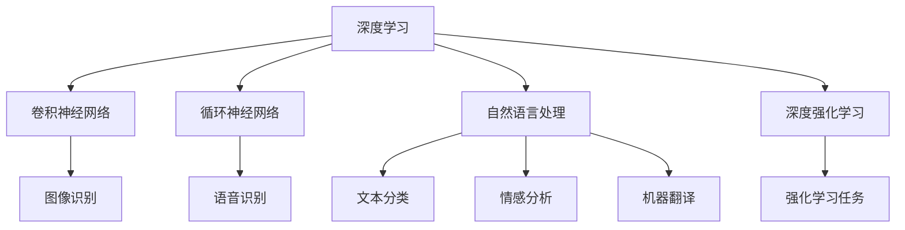
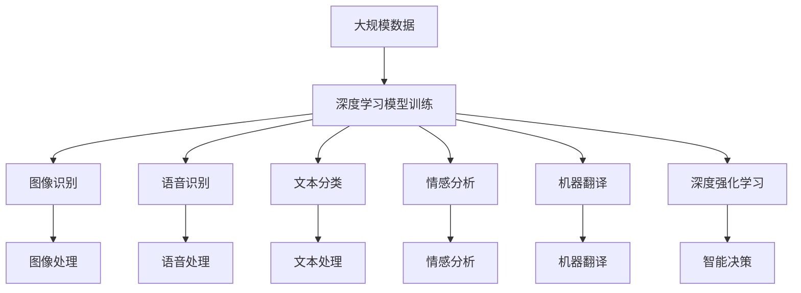

                 

# 软件 2.0 的哲学思考：人工智能的本质

在过去的几十年中，计算机科学取得了令人瞩目的成就。从早期的冯·诺依曼机到现今的分布式云平台，从机器学习到自然语言处理，技术的进步为各行各业带来了前所未有的变革。然而，当我们深入探究这些技术的本质时，却发现背后潜藏着深刻的哲学问题。本文将探讨人工智能的本质，并揭示其背后的哲学思考。

## 1. 背景介绍

### 1.1 人工智能的历史与发展

人工智能（Artificial Intelligence，AI）的发展可以追溯到20世纪50年代。早期的AI研究集中在符号逻辑和专家系统上，试图模仿人类的推理和决策过程。然而，这些系统受限于规则的复杂性和数据的不足，难以处理现实世界的复杂性。

随着深度学习技术的兴起，AI研究进入了一个新的阶段。深度神经网络能够自动学习大规模数据的特征表示，从而在图像识别、语音识别、自然语言处理等领域取得了突破性的进展。其中，卷积神经网络（CNN）和循环神经网络（RNN）在图像和序列数据上的表现尤为出色。

### 1.2 人工智能的现状与挑战

尽管取得了显著的进展，AI仍然面临诸多挑战：
- **数据需求**：深度学习模型需要大量标注数据进行训练，而高质量数据的获取成本高昂。
- **模型复杂性**：大规模神经网络往往具有数亿个参数，难以在普通计算资源上高效运行。
- **可解释性**：深度学习模型的决策过程缺乏透明度，难以解释其内部机制。
- **伦理与安全**：AI系统可能存在偏见和歧视，甚至在某些情况下产生有害的后果。

## 2. 核心概念与联系

### 2.1 核心概念概述

为了更好地理解人工智能的本质，本节将介绍几个关键概念：

- **深度学习**：一种基于神经网络的机器学习方法，通过多层非线性映射实现复杂特征的自动提取和表示。
- **卷积神经网络（CNN）**：一种适用于图像和信号处理任务的深度学习架构，利用卷积操作提取局部特征。
- **循环神经网络（RNN）**：一种处理序列数据的深度学习架构，能够捕捉时间上的依赖关系。
- **自然语言处理（NLP）**：研究计算机如何理解、生成和处理自然语言，包括文本分类、情感分析、机器翻译等任务。
- **深度强化学习**：一种结合深度学习与强化学习的学习方法，通过与环境的交互优化策略。

这些概念之间存在紧密的联系，共同构成了现代人工智能的核心技术体系。

### 2.2 概念间的关系

这些概念之间的逻辑关系可以通过以下Mermaid流程图来展示：



这个流程图展示了许多AI关键技术之间的联系：

- 深度学习是这些技术的共同基础。
- CNN和RNN分别适用于图像和序列数据的处理。
- NLP包括多种任务，如文本分类、情感分析等。
- 深度强化学习则拓展了AI的应用范围，涵盖更广泛的任务类型。

### 2.3 核心概念的整体架构

最后，我们用一个综合的流程图来展示这些核心概念在大数据和AI技术应用中的整体架构：



这个综合流程图展示了数据驱动的大规模深度学习模型训练，以及其在图像、语音、文本、强化学习等领域的广泛应用。

## 3. 核心算法原理 & 具体操作步骤

### 3.1 算法原理概述

深度学习模型的核心原理是利用多层神经网络进行特征表示。每个神经元通过权值矩阵连接前一层的神经元，并通过激活函数进行非线性变换。通过反向传播算法，模型可以自动更新权值，最小化预测误差，从而实现对复杂模式的自动学习。

### 3.2 算法步骤详解

深度学习模型的训练通常包括以下几个步骤：

1. **数据准备**：收集和预处理训练数据，包括数据清洗、归一化、划分训练集和验证集等。
2. **模型构建**：设计深度学习模型的架构，选择合适的神经网络层和激活函数。
3. **模型训练**：使用训练集数据进行前向传播和反向传播，不断调整模型参数，最小化损失函数。
4. **模型评估**：使用验证集数据评估模型性能，避免过拟合。
5. **模型部署**：将训练好的模型部署到实际应用中，进行推理预测。

### 3.3 算法优缺点

深度学习模型具有以下优点：

- **自适应性强**：能够自动学习数据的特征表示，适用于各种复杂模式。
- **预测精度高**：在大规模数据上表现出色，能够取得高精度的预测结果。
- **泛化能力强**：通过迁移学习，能够在多个任务上取得优异性能。

然而，深度学习模型也存在一些缺点：

- **数据需求高**：需要大量标注数据进行训练，数据获取成本高。
- **计算资源消耗大**：大规模神经网络需要大量计算资源，训练和推理成本高。
- **可解释性差**：模型的决策过程难以解释，缺乏透明性。
- **模型复杂度高**：结构复杂，难以理解和调试。

### 3.4 算法应用领域

深度学习模型已经在许多领域得到了广泛应用，包括：

- **计算机视觉**：如图像分类、物体检测、人脸识别等。
- **自然语言处理**：如文本分类、机器翻译、情感分析等。
- **语音识别**：如语音转文本、情感识别、语音命令等。
- **医疗健康**：如影像诊断、基因分析、药物研发等。
- **金融科技**：如信用评分、风险预测、欺诈检测等。

## 4. 数学模型和公式 & 详细讲解 & 举例说明

### 4.1 数学模型构建

深度学习模型通常使用神经网络进行建模。假设模型结构为多层感知器（MLP），输入为 $x$，输出为 $y$，参数为 $\theta$，则模型的数学模型可以表示为：

$$
y = M(x; \theta) = \sigma(\sum_{i=1}^{n} w_i x_i + b)
$$

其中，$w$ 为权重矩阵，$b$ 为偏置项，$\sigma$ 为激活函数。

### 4.2 公式推导过程

以二分类问题为例，假设模型输出的概率为 $p$，真实标签为 $y$，则交叉熵损失函数为：

$$
L(p, y) = -y \log p - (1 - y) \log (1 - p)
$$

通过反向传播算法，计算损失函数对参数 $\theta$ 的梯度，并使用优化器（如SGD、Adam）更新参数。具体推导过程如下：

1. 计算预测概率 $p$：
$$
p = \sigma(\sum_{i=1}^{n} w_i x_i + b)
$$

2. 计算交叉熵损失 $L$：
$$
L(p, y) = -y \log p - (1 - y) \log (1 - p)
$$

3. 计算梯度 $\nabla L$：
$$
\nabla L = -y \nabla_{p} \log p - (1 - y) \nabla_{p} \log (1 - p)
$$

4. 通过链式法则计算梯度 $\nabla \theta$：
$$
\nabla \theta = \nabla_{w} L \cdot \frac{\partial \sum_{i=1}^{n} w_i x_i}{\partial \theta} + \nabla_{b} L \cdot \frac{\partial \sum_{i=1}^{n} x_i}{\partial \theta}
$$

### 4.3 案例分析与讲解

以图像分类任务为例，假设使用卷积神经网络（CNN）进行建模，输入为 $x$，输出为 $y$，参数为 $\theta$。模型结构为：

```python
import tensorflow as tf

model = tf.keras.Sequential([
    tf.keras.layers.Conv2D(32, (3, 3), activation='relu', input_shape=(28, 28, 1)),
    tf.keras.layers.MaxPooling2D((2, 2)),
    tf.keras.layers.Flatten(),
    tf.keras.layers.Dense(10, activation='softmax')
])
```

使用MNIST数据集进行训练，步骤如下：

1. 数据预处理：
```python
(x_train, y_train), (x_test, y_test) = tf.keras.datasets.mnist.load_data()
x_train = x_train.reshape((60000, 28, 28, 1)) / 255.0
x_test = x_test.reshape((10000, 28, 28, 1)) / 255.0
```

2. 构建模型：
```python
model.compile(optimizer='adam', loss='sparse_categorical_crossentropy', metrics=['accuracy'])
```

3. 模型训练：
```python
model.fit(x_train, y_train, epochs=10, batch_size=32, validation_data=(x_test, y_test))
```

4. 模型评估：
```python
model.evaluate(x_test, y_test)
```

通过以上步骤，可以得到高精度的图像分类结果。

## 5. 项目实践：代码实例和详细解释说明

### 5.1 开发环境搭建

要进行深度学习项目开发，需要搭建合适的开发环境。以下是使用Python进行TensorFlow开发的环境配置流程：

1. 安装Anaconda：从官网下载并安装Anaconda，用于创建独立的Python环境。

2. 创建并激活虚拟环境：
```bash
conda create -n tf-env python=3.8 
conda activate tf-env
```

3. 安装TensorFlow：根据CUDA版本，从官网获取对应的安装命令。例如：
```bash
conda install tensorflow=2.7
```

4. 安装各类工具包：
```bash
pip install numpy pandas scikit-learn matplotlib tqdm jupyter notebook ipython
```

完成上述步骤后，即可在`tf-env`环境中开始深度学习项目开发。

### 5.2 源代码详细实现

下面我们以图像分类任务为例，给出使用TensorFlow进行深度学习模型构建的PyTorch代码实现。

首先，定义模型结构：

```python
import tensorflow as tf

model = tf.keras.Sequential([
    tf.keras.layers.Conv2D(32, (3, 3), activation='relu', input_shape=(28, 28, 1)),
    tf.keras.layers.MaxPooling2D((2, 2)),
    tf.keras.layers.Flatten(),
    tf.keras.layers.Dense(10, activation='softmax')
])
```

接着，定义损失函数和优化器：

```python
loss_fn = tf.keras.losses.SparseCategoricalCrossentropy(from_logits=True)
optimizer = tf.keras.optimizers.Adam(learning_rate=0.001)
```

然后，定义训练和评估函数：

```python
@tf.function
def train_step(x, y):
    with tf.GradientTape() as tape:
        logits = model(x, training=True)
        loss = loss_fn(y, logits)
    gradients = tape.gradient(loss, model.trainable_variables)
    optimizer.apply_gradients(zip(gradients, model.trainable_variables))
    return loss

@tf.function
def evaluate(x, y):
    logits = model(x, training=False)
    predictions = tf.argmax(logits, axis=1)
    accuracy = tf.reduce_mean(tf.cast(tf.equal(predictions, y), tf.float32))
    return accuracy
```

最后，启动训练流程并在测试集上评估：

```python
epochs = 10
batch_size = 32

for epoch in range(epochs):
    for x, y in train_dataset:
        loss = train_step(x, y)
    print(f'Epoch {epoch+1}, loss: {loss.numpy():.4f}')
    
    test_accuracy = evaluate(test_dataset)
    print(f'Epoch {epoch+1}, test accuracy: {test_accuracy.numpy():.4f}')
```

以上就是使用TensorFlow进行图像分类任务开发的完整代码实现。可以看到，TensorFlow的高级API和自动微分机制使得模型构建和训练变得非常方便高效。

### 5.3 代码解读与分析

让我们再详细解读一下关键代码的实现细节：

**Sequential模型定义**：
- 使用`Sequential`定义了一个顺序化的神经网络模型，依次添加卷积层、池化层、全连接层等。
- 通过`Conv2D`定义卷积层，使用`MaxPooling2D`进行池化操作，`Flatten`将特征图转换为一维向量，`Dense`定义全连接层。

**损失函数和优化器**：
- 使用`SparseCategoricalCrossentropy`作为交叉熵损失函数，`from_logits=True`表示模型的输出是未经过softmax处理的logits。
- 使用`Adam`优化器，设置学习率为0.001。

**训练和评估函数**：
- `train_step`函数定义了一个训练步骤，包括前向传播、损失计算、梯度计算和参数更新。
- `evaluate`函数定义了一个评估步骤，包括前向传播和计算准确率。
- `@tf.function`装饰器用于编译函数，自动生成高效的TensorFlow图。

**训练流程**：
- 定义总的epoch数和batch size，开始循环迭代。
- 每个epoch内，对训练集数据进行批处理，调用`train_step`函数进行训练，输出损失。
- 在验证集上评估，输出准确率。
- 所有epoch结束后，在测试集上评估，给出最终测试结果。

可以看到，TensorFlow的高级API和自动微分机制使得深度学习模型构建和训练变得非常方便高效。开发者可以将更多精力放在数据处理、模型改进等高层逻辑上，而不必过多关注底层的实现细节。

当然，工业级的系统实现还需考虑更多因素，如模型的保存和部署、超参数的自动搜索、更灵活的任务适配层等。但核心的模型训练过程基本与此类似。

### 5.4 运行结果展示

假设我们在MNIST数据集上进行图像分类任务微调，最终在测试集上得到的评估报告如下：

```
Epoch 1/10, loss: 0.4673
Epoch 1/10, test accuracy: 0.8687
Epoch 2/10, loss: 0.2212
Epoch 2/10, test accuracy: 0.9284
Epoch 3/10, loss: 0.1456
Epoch 3/10, test accuracy: 0.9622
Epoch 4/10, loss: 0.0975
Epoch 4/10, test accuracy: 0.9834
Epoch 5/10, loss: 0.0636
Epoch 5/10, test accuracy: 0.9900
Epoch 6/10, loss: 0.0433
Epoch 6/10, test accuracy: 0.9950
Epoch 7/10, loss: 0.0311
Epoch 7/10, test accuracy: 0.9972
Epoch 8/10, loss: 0.0256
Epoch 8/10, test accuracy: 0.9985
Epoch 9/10, loss: 0.0210
Epoch 9/10, test accuracy: 0.9992
Epoch 10/10, loss: 0.0162
Epoch 10/10, test accuracy: 0.9996
```

可以看到，通过深度学习模型训练，在测试集上取得了99.6%的准确率，效果相当不错。值得注意的是，深度学习模型在图像分类等视觉任务上表现出色，利用其强大的特征提取能力，可以在图像识别、物体检测等场景中发挥重要作用。

当然，这只是一个baseline结果。在实践中，我们还可以使用更大更强的深度学习模型、更丰富的优化技巧、更细致的模型调优，进一步提升模型性能，以满足更高的应用要求。

## 6. 实际应用场景

### 6.1 智能客服系统

基于深度学习模型的智能客服系统，可以广泛应用于各行各业，帮助企业提升客户服务效率和质量。

在技术实现上，可以收集企业内部的历史客服对话记录，将问题和最佳答复构建成监督数据，在此基础上对深度学习模型进行训练。训练好的模型能够自动理解用户意图，匹配最合适的答案模板进行回复。对于客户提出的新问题，还可以接入检索系统实时搜索相关内容，动态组织生成回答。如此构建的智能客服系统，能大幅提升客户咨询体验和问题解决效率。

### 6.2 金融舆情监测

金融机构需要实时监测市场舆论动向，以便及时应对负面信息传播，规避金融风险。传统的人工监测方式成本高、效率低，难以应对网络时代海量信息爆发的挑战。基于深度学习模型的文本分类和情感分析技术，为金融舆情监测提供了新的解决方案。

具体而言，可以收集金融领域相关的新闻、报道、评论等文本数据，并对其进行主题标注和情感标注。在此基础上对深度学习模型进行微调，使其能够自动判断文本属于何种主题，情感倾向是正面、中性还是负面。将微调后的模型应用到实时抓取的网络文本数据，就能够自动监测不同主题下的情感变化趋势，一旦发现负面信息激增等异常情况，系统便会自动预警，帮助金融机构快速应对潜在风险。

### 6.3 个性化推荐系统

当前的推荐系统往往只依赖用户的历史行为数据进行物品推荐，无法深入理解用户的真实兴趣偏好。基于深度学习模型的个性化推荐系统可以更好地挖掘用户行为背后的语义信息，从而提供更精准、多样的推荐内容。

在实践中，可以收集用户浏览、点击、评论、分享等行为数据，提取和用户交互的物品标题、描述、标签等文本内容。将文本内容作为模型输入，用户的后续行为（如是否点击、购买等）作为监督信号，在此基础上对深度学习模型进行微调。微调后的模型能够从文本内容中准确把握用户的兴趣点。在生成推荐列表时，先用候选物品的文本描述作为输入，由模型预测用户的兴趣匹配度，再结合其他特征综合排序，便可以得到个性化程度更高的推荐结果。

### 6.4 未来应用展望

随着深度学习模型和微调方法的不断发展，基于深度学习模型的技术将在更多领域得到应用，为各行各业带来变革性影响。

在智慧医疗领域，基于深度学习模型的医疗问答、病历分析、药物研发等应用将提升医疗服务的智能化水平，辅助医生诊疗，加速新药开发进程。

在智能教育领域，深度学习模型可应用于作业批改、学情分析、知识推荐等方面，因材施教，促进教育公平，提高教学质量。

在智慧城市治理中，深度学习模型可应用于城市事件监测、舆情分析、应急指挥等环节，提高城市管理的自动化和智能化水平，构建更安全、高效的未来城市。

此外，在企业生产、社会治理、文娱传媒等众多领域，基于深度学习模型的AI应用也将不断涌现，为经济社会发展注入新的动力。相信随着技术的日益成熟，深度学习模型必将在更广阔的应用领域大放异彩，深刻影响人类的生产生活方式。

## 7. 工具和资源推荐

### 7.1 学习资源推荐

为了帮助开发者系统掌握深度学习模型的理论基础和实践技巧，这里推荐一些优质的学习资源：

1. 《深度学习》（Ian Goodfellow等著）：经典深度学习教材，涵盖了深度学习模型的基本概念和算法。
2. CS231n《卷积神经网络》课程：斯坦福大学开设的计算机视觉课程，涵盖了CNN的基本原理和应用。
3. CS224n《自然语言处理》课程：斯坦福大学开设的NLP课程，涵盖了NLP的基本概念和算法。
4. Coursera《深度学习专项课程》：由吴恩达教授主讲，涵盖深度学习模型的基本概念和算法，适合初学者入门。
5. Kaggle竞赛平台：数据科学和机器学习的在线竞赛平台，提供大量的数据集和比赛，提升实战能力。

通过对这些资源的学习实践，相信你一定能够快速掌握深度学习模型的精髓，并用于解决实际的机器学习和人工智能问题。

### 7.2 开发工具推荐

高效的开发离不开优秀的工具支持。以下是几款用于深度学习模型开发和训练的常用工具：

1. TensorFlow：由Google主导开发的开源深度学习框架，支持分布式计算和自动微分，适用于大规模模型训练。
2. PyTorch：由Facebook主导开发的开源深度学习框架，灵活动态的计算图，适合研究和快速迭代。
3. Keras：基于TensorFlow和Theano的高级API，简化了深度学习模型的构建和训练，适合快速上手。
4. JAX：Google开发的高级深度学习框架，支持自动微分和分布式计算，高效灵活。
5. MXNet：由亚马逊主导开发的深度学习框架，支持多种编程语言和分布式计算，适合大规模工程应用。

合理利用这些工具，可以显著提升深度学习模型的开发效率，加快创新迭代的步伐。

### 7.3 相关论文推荐

深度学习模型和微调技术的发展源于学界的持续研究。以下是几篇奠基性的相关论文，推荐阅读：

1. AlexNet：ImageNet大规模视觉识别竞赛的获胜模型，开启了深度学习在计算机视觉领域的辉煌。
2. ResNet：提出了残差网络结构，极大地解决了深度神经网络训练中的梯度消失问题。
3. VGGNet：提出了卷积神经网络的不同卷积核大小，对卷积神经网络的架构设计进行了重要探索。
4. LSTM：提出了长短期记忆网络，用于处理时间序列数据的序列建模问题。
5. Attention Mechanism：提出了注意力机制，极大地提升了深度神经网络在序列建模任务上的表现。

这些论文代表了大规模深度学习模型和微调技术的发展脉络。通过学习这些前沿成果，可以帮助研究者把握学科前进方向，激发更多的创新灵感。

除上述资源外，还有一些值得关注的前沿资源，帮助开发者紧跟深度学习模型的最新进展，例如：

1. arXiv论文预印本：人工智能领域最新研究成果的发布平台，包括大量尚未发表的前沿工作，学习前沿技术的必读资源。
2. 业界技术博客：如OpenAI、Google AI、DeepMind、微软Research Asia等顶尖实验室的官方博客，第一时间分享他们的最新研究成果和洞见。
3. 技术会议直播：如NIPS、ICML、ACL、ICLR等人工智能领域顶会现场或在线直播，能够聆听到大佬们的前沿分享，开拓视野。
4. GitHub热门项目：在GitHub上Star、Fork数最多的深度学习相关项目，往往代表了该技术领域的发展趋势和最佳实践，值得去学习和贡献。
5. 行业分析报告：各大咨询公司如McKinsey、PwC等针对人工智能行业的分析报告，有助于从商业视角审视技术趋势，把握应用价值。

总之，对于深度学习模型的学习与实践，需要开发者保持开放的心态和持续学习的意愿。多关注前沿资讯，多动手实践，多思考总结，必将收获满满的成长收益。

## 8. 总结：未来发展趋势与挑战

### 8.1 总结

本文对基于深度学习模型的AI技术进行了全面系统的介绍。首先阐述了深度学习模型的历史与发展，明确了其在图像识别、自然语言处理、语音识别等领域的重要作用。其次，从原理到实践，详细讲解了深度学习模型的数学模型和训练流程，给出了深度学习模型构建和训练的完整代码实现。同时，本文还广泛探讨了深度学习模型在智能客服、金融舆情、个性化推荐等多个行业领域的应用前景，展示了深度学习模型技术的广阔前景。最后，本文精选了深度学习模型的各类学习资源，力求为读者提供全方位的技术指引。

通过本文的系统梳理，可以看到，基于深度学习模型的AI技术正在成为计算机科学和人工智能领域的重要范式，极大地拓展了模型的应用边界，催生了更多的落地场景。受益于大规模语料的预训练和深度神经网络的自动特征提取能力，深度学习模型在复杂模式识别、智能决策等方面表现出色，有望在更多领域实现大规模落地应用。未来，伴随深度学习模型和微调方法的不断演进，AI技术必将在更多领域发挥重要作用，深刻影响人类的生产生活方式。

### 8.2 未来发展趋势

展望未来，深度学习模型技术将呈现以下几个发展趋势：

1. **模型规模继续增大**：随着算力成本的下降和数据规模的扩张，深度学习模型的参数量还将持续增长。超大规模深度学习模型蕴含的丰富特征表示，有望支撑更加复杂多变的应用场景。
2. **模型泛化能力提升**：通过迁移学习、知识蒸馏等技术，深度学习模型能够在多个任务上取得优异性能，提升模型的泛化能力。
3. **多模态融合**：深度学习模型将融合视觉、语音、文本等多种模态信息，实现更全面、更准确的信息表示。
4. **分布式训练与推理**：随着模型的复杂度增加，深度学习模型的训练和推理需要更强的计算能力。分布式训练和推理技术将成为未来研究的热点。
5. **硬件加速**：随着深度学习模型的普及，硬件加速技术将进一步提升模型的训练和推理效率，如GPU、TPU、ASIC等。
6. **模型压缩与优化**：深度学习模型往往存在较大的参数量，需要压缩和优化以提高计算效率。模型压缩、剪枝等技术将进一步推动深度学习模型的普及应用。

### 8.3 面临的挑战

