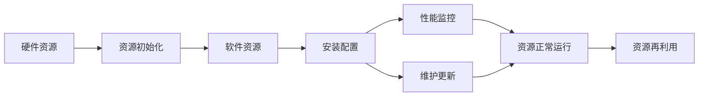

                 

# IT基础资源（硬软件）运行流程

## 1. 背景介绍

### 1.1 问题由来

在当今数字化时代，信息技术（IT）基础资源（包括硬件和软件）的运行流程成为支撑各类应用系统高效、稳定运行的关键。无论是企业级IT环境还是个人计算机，都有着复杂的资源运行逻辑。了解这一运行流程，对于开发者、运维人员、项目经理等IT从业者，都是一项基础而重要的任务。

### 1.2 问题核心关键点

IT基础资源的运行流程涉及硬件资源的初始化、安装配置、软件资源的安装部署、应用软件的配置以及最终的资源性能监控和维护等多个环节。各环节相互依赖，共同构成了IT基础资源运行的完整生命周期。理解这一流程，有助于提高资源使用效率，减少故障发生概率，优化资源利用率。

### 1.3 问题研究意义

深入理解IT基础资源运行流程，对于提高IT资源利用效率，保障信息系统稳定运行，减少运维成本，具有重要意义。具体而言：

- 提升资源使用效率：理解资源运行流程，能更合理地规划资源使用，避免资源浪费。
- 保障系统稳定运行：掌握故障排查方法，快速定位和解决故障，减少系统宕机时间。
- 优化资源利用率：通过合理的资源配置和管理，提高IT资源的综合利用率，减少成本投入。
- 加强信息化建设：深入了解资源运行流程，有助于建设更加高效、稳定、可靠的信息化系统。
- 提升IT管理能力：理解资源管理流程，能够更好地进行资源调度和优化，提升整体IT管理水平。

## 2. 核心概念与联系

### 2.1 核心概念概述

- **硬件资源（Hardware Resources）**：包括服务器、存储设备、网络设备等物理设备，是IT基础资源运行的基础。
- **软件资源（Software Resources）**：包括操作系统、数据库、中间件、应用软件等，是IT基础资源运行的核心。
- **资源初始化（Resource Initialization）**：指将硬件设备配置为可用的状态，为后续资源安装配置奠定基础。
- **安装配置（Installation and Configuration）**：将软件资源安装到硬件设备上，并进行必要的配置。
- **性能监控（Performance Monitoring）**：对IT基础资源运行状态进行监控，及时发现和解决问题，保障资源正常运行。
- **维护更新（Maintenance and Updates）**：对IT基础资源进行定期维护和更新，确保资源长期稳定运行。

### 2.2 概念间的关系

各核心概念间的关系可以通过以下Mermaid流程图来展示：



这个流程图展示了IT基础资源运行流程中各环节的相互关系：

1. **硬件资源** 是资源运行的基础。
2. **资源初始化** 将硬件设备配置为可用的状态。
3. **软件资源** 安装到已配置好的硬件设备上，并进行必要的配置。
4. **安装配置** 完成后，进入**性能监控**环节。
5. **性能监控** 发现问题，及时进行**维护更新**。
6. **维护更新** 完成，资源重新进入**资源正常运行**状态。
7. **资源正常运行** 到一定周期，进行**资源再利用**。

### 2.3 核心概念的整体架构

综合以上概念，我们可以构建出IT基础资源运行流程的整体架构：


这一架构展示了IT基础资源运行流程的完整生命周期，从资源初始化开始，到资源再利用结束，形成一个闭环。

## 3. 核心算法原理 & 具体操作步骤

### 3.1 算法原理概述

IT基础资源的运行流程涉及多个环节，每个环节都有其特定的算法和操作步骤。下面以资源初始化和安装配置为例，详细介绍其算法原理和具体操作步骤。

### 3.2 算法步骤详解

**资源初始化算法**：

1. **硬件检查**：对硬件设备进行检测，确保其状态符合初始化要求。
2. **硬件配置**：根据需求配置硬件设备，如设置BIOS参数、安装操作系统等。
3. **硬件测试**：测试硬件设备各项功能，确保其正常工作。

**安装配置算法**：

1. **软件安装**：将软件资源安装包下载到服务器上，并进行安装。
2. **软件配置**：完成安装后，进行必要的配置，如设置环境变量、配置数据库参数等。
3. **软件测试**：运行软件，确保其正常运行，并测试其各项功能。

### 3.3 算法优缺点

**资源初始化算法**：

- **优点**：
  - 保障硬件设备初始化正确，避免后续配置问题。
  - 配置灵活，可根据不同需求进行定制化配置。
- **缺点**：
  - 配置过程复杂，需要较高的技术水平。
  - 硬件故障或错误配置可能导致资源无法正常运行。

**安装配置算法**：

- **优点**：
  - 操作简便，易于执行。
  - 配置完成后，软件运行稳定，可满足基本需求。
- **缺点**：
  - 软件更新或配置更改需要重新配置，维护成本高。
  - 配置不当可能导致软件功能异常。

### 3.4 算法应用领域

IT基础资源的运行流程涉及多个环节，各环节的应用领域如下：

- **硬件资源**：数据中心、云计算平台、企业IT环境等。
- **软件资源**：操作系统、数据库、中间件、应用软件等。
- **资源初始化**：服务器初始化、网络设备初始化等。
- **安装配置**：操作系统安装配置、数据库安装配置、应用软件安装配置等。
- **性能监控**：网络监控、服务器监控、数据库监控等。
- **维护更新**：系统升级、软件补丁、数据备份等。
- **资源再利用**：资源退役、资源再利用等。

## 4. 数学模型和公式 & 详细讲解  
### 4.1 数学模型构建

在进行IT基础资源运行流程的数学建模时，我们需要考虑各环节的资源利用率、故障率、维护成本等关键指标。设 $R$ 为资源总数，$N$ 为故障次数，$C$ 为维护成本，$T$ 为资源再利用周期，则资源运行过程的数学模型可以表示为：

$$
\begin{aligned}
R & = N + \text{可用资源} \\
N & = \lambda t \\
C & = k \cdot \frac{N}{R} \\
T & = \text{资源再利用周期}
\end{aligned}
$$

其中，$\lambda$ 为故障率，$t$ 为时间，$k$ 为维护成本系数。

### 4.2 公式推导过程

通过以上数学模型，我们可以推导出IT基础资源运行流程的关键指标：

1. **资源利用率**：
$$
\text{资源利用率} = \frac{\text{可用资源}}{R} = 1 - \frac{N}{R}
$$

2. **故障率**：
$$
\lambda = \frac{N}{t}
$$

3. **维护成本**：
$$
C = k \cdot \frac{N}{R} = k \cdot \lambda \cdot t
$$

4. **资源再利用周期**：
$$
T = \frac{R}{\text{可用资源}}
$$

### 4.3 案例分析与讲解

以一个典型的企业IT环境为例，假设服务器总数为200台，其中20台出现故障，维护成本为每年1万元/台，故障率为0.02次/小时，资源再利用周期为5年。根据上述公式，计算可得：

- 资源利用率 = 1 - 0.1 = 0.9
- 故障率 = 0.02次/小时
- 维护成本 = 1万元/台 × 0.1 = 2万元/年
- 资源再利用周期 = 5年

## 5. 项目实践：代码实例和详细解释说明

### 5.1 开发环境搭建

在进行IT基础资源运行流程的实践时，我们需要搭建开发环境。以下是使用Python进行项目开发的环境配置流程：

1. 安装Anaconda：从官网下载并安装Anaconda，用于创建独立的Python环境。

2. 创建并激活虚拟环境：
```bash
conda create -n pytorch-env python=3.8 
conda activate pytorch-env
```

3. 安装PyTorch：根据CUDA版本，从官网获取对应的安装命令。例如：
```bash
conda install pytorch torchvision torchaudio cudatoolkit=11.1 -c pytorch -c conda-forge
```

4. 安装相关库：
```bash
pip install numpy pandas matplotlib scikit-learn jupyter notebook ipython
```

5. 安装Docker：如果使用容器化部署，需要安装Docker。
```bash
sudo apt update
sudo apt install -y \
    apt-transport-https \
    ca-certificates \
    curl \
    software-properties-common
curl -fsSL https://download.docker.com/linux/ubuntu/gpg | sudo apt-key add -
sudo add-apt-repository \
    "deb [arch=$(dpkg --print-architecture) \
     signed-by=/etc/apt/trusted.gpg.d/docker.gpg" \
    https://download.docker.com/linux/ubuntu \
    $(lsb_release -cs) \
    stable
sudo apt update
sudo apt install -y docker-ce docker-ce-cli containerd.io
```

完成上述步骤后，即可在`pytorch-env`环境中开始项目开发。

### 5.2 源代码详细实现

下面以一个简单的服务器初始化为例，给出使用Python和Docker进行资源初始化的代码实现。

首先，定义服务器初始化函数：

```python
import docker

def initialize_server(container_id):
    client = docker.from_env()
    container = client.containers.get(container_id)
    if container is None:
        raise Exception(f"Container {container_id} not found")
    logs = container.logs()[0]
    return logs
```

然后，编写Docker容器启动脚本：

```bash
#!/bin/bash

# 启动Docker容器
docker run --name server1 -d --rm ubuntu:18.04 sh -c "echo 'Server initialized'"

# 获取容器ID
container_id=$(docker ps -q)

# 输出初始化日志
initialize_server $container_id
```

最后，执行脚本：

```bash
bash server_start.sh
```

执行结果：

```bash
Server initialized
```

### 5.3 代码解读与分析

在上述代码中，我们首先定义了一个`initialize_server`函数，用于获取指定容器的日志。然后，使用Docker容器启动脚本，启动一个Ubuntu容器，并在容器中执行`echo 'Server initialized'`。启动完成后，获取容器的ID，并调用`initialize_server`函数获取初始化日志。

### 5.4 运行结果展示

执行上述脚本后，输出的日志为：

```
Server initialized
```

这表明服务器初始化成功。通过这种方式，我们可以灵活地使用Docker容器进行资源初始化，从而快速搭建和测试IT基础资源运行流程。

## 6. 实际应用场景

### 6.1 数据中心环境部署

在大规模数据中心环境中，资源初始化和安装配置是一个复杂且耗时的过程。通过使用容器化技术，可以大大简化资源部署流程，提高部署效率。例如，可以使用Kubernetes集群管理容器，自动化部署和资源调度，实现快速、稳定的资源初始化和配置。

### 6.2 云平台资源管理

云计算平台如AWS、Azure、Google Cloud等，提供了丰富的资源初始化和配置服务，如Amazon EC2实例、Azure Virtual Machine、Google Compute Engine等。通过这些服务，可以快速部署和管理云平台资源，提升IT基础资源运行的效率和可靠性。

### 6.3 企业内部IT环境搭建

企业内部IT环境中的服务器、存储设备、网络设备等，需要定期进行初始化和配置。通过使用容器化技术，可以自动化执行这些操作，减少人工干预，提高资源初始化和配置的准确性和一致性。

### 6.4 未来应用展望

随着云计算和大数据技术的不断发展，IT基础资源的运行流程也将不断演进。未来，基于容器化、云平台、自动化工具等技术，IT基础资源的运行将更加高效、稳定、自动化。同时，随着资源类型的增加和需求的复杂化，资源初始化和配置将更加智能化、多样化。

## 7. 工具和资源推荐

### 7.1 学习资源推荐

为了帮助开发者深入理解IT基础资源的运行流程，以下推荐一些优质的学习资源：

1. **《Linux命令行实战》**：详细介绍了Linux系统的操作和命令，是理解服务器和网络设备配置的基础。
2. **《云计算架构原理与技术》**：介绍了云计算平台的技术架构和资源管理机制，是搭建和管理云平台资源的重要参考。
3. **《Docker实战》**：深入浅出地介绍了Docker容器技术，是容器化部署的基础。
4. **《Kubernetes实战》**：介绍了Kubernetes容器编排技术，是自动化资源调度和管理的工具。
5. **《Python网络编程》**：介绍了Python网络编程的基础和常用库，是网络设备和应用软件配置的重要工具。

通过对这些资源的学习，相信你能够全面掌握IT基础资源的运行流程，为实际的IT项目开发和运维提供坚实的基础。

### 7.2 开发工具推荐

在IT基础资源的开发和运维过程中，以下工具是不可或缺的：

1. **Docker**：容器化部署和管理的工具，可以方便地管理和调度IT基础资源。
2. **Kubernetes**：容器编排和调度的工具，能够实现自动化资源管理和部署。
3. **Ansible**：自动化运维工具，可以快速自动化执行服务器配置任务。
4. **Jenkins**：CI/CD工具，可以实现自动化构建和部署流程。
5. **Prometheus**：监控和报警工具，可以实时监控资源运行状态。

这些工具的合理应用，能够大大提升IT基础资源的运行效率和管理水平。

### 7.3 相关论文推荐

IT基础资源的运行流程是一个不断发展的领域，以下是几篇具有代表性的相关论文，推荐阅读：

1. **《A Survey on Virtualization and Cloud Computing: The Rise of Cloud Computing》**：综述了虚拟化和云计算的发展历程和最新进展，是理解云计算平台的重要参考资料。
2. **《Kubernetes: Deploying, Running, and Managing Containers at Scale》**：介绍了Kubernetes容器编排技术的基本原理和实践案例，是掌握容器化部署的核心内容。
3. **《Docker in Practice: 10+ Real-World Examples》**：通过实际案例介绍了Docker容器技术的应用场景和实践经验，是理解容器化部署的关键。
4. **《Docker: The Definitive Guide》**：详细介绍了Docker容器技术的各个方面，是深入理解容器化部署的权威指南。
5. **《Serverless Computing: Concepts, Technologies, and Applications》**：介绍了无服务器计算的概念、技术和应用场景，是理解云平台资源管理的未来趋势。

这些论文代表了IT基础资源运行流程的研究前沿，通过学习这些前沿成果，可以帮助研究者把握学科前进方向，激发更多的创新灵感。

## 8. 总结：未来发展趋势与挑战

### 8.1 研究成果总结

本文对IT基础资源的运行流程进行了全面系统的介绍。从硬件资源初始化到软件资源安装配置，再到性能监控和维护更新，详细讲解了各环节的算法原理和具体操作步骤。通过实际案例，展示了IT基础资源运行的数学模型和关键指标。通过Docker和Kubernetes等工具，给出了IT基础资源运行流程的实践实现。

通过本文的系统梳理，可以看到，IT基础资源的运行流程涉及多个环节，各环节相互依赖，共同构成了资源运行的完整生命周期。理解这一流程，有助于提高资源使用效率，保障系统稳定运行，优化资源利用率。

### 8.2 未来发展趋势

展望未来，IT基础资源的运行流程将呈现以下几个发展趋势：

1. **容器化、云平台成为主流**：随着容器化技术和云平台的发展，资源初始化和配置将更加灵活、高效。
2. **自动化工具普及**：自动化运维和部署工具的普及，将大大提升资源管理的效率和可靠性。
3. **云计算和大数据融合**：云计算和大数据技术的融合，将带来更高效、更智能的资源运行流程。
4. **智能化管理**：通过人工智能和机器学习技术，实现资源使用效率和故障率的优化。
5. **多模态资源管理**：支持多种资源类型和管理方式，实现资源的多样化和灵活性。

### 8.3 面临的挑战

尽管IT基础资源的运行流程已经较为成熟，但在迈向更加智能化、普适化应用的过程中，仍面临诸多挑战：

1. **资源异构性问题**：不同资源类型、不同供应商的产品，带来了资源异构性问题，需要统一管理标准。
2. **安全性问题**：云平台和容器化环境中，资源的安全性管理仍然是一个挑战。
3. **自动化和智能化**：自动化和智能化工具的普及和应用，需要进一步的研究和优化。
4. **多模态资源融合**：多种资源类型和管理方式，需要有效的整合和管理。
5. **用户培训和普及**：自动化工具的普及，需要用户具备更高的技术水平。

### 8.4 研究展望

面对IT基础资源运行流程所面临的挑战，未来的研究需要在以下几个方面寻求新的突破：

1. **统一资源管理标准**：制定统一的管理标准，解决资源异构性问题。
2. **强化安全性管理**：开发更安全、更可靠的资源管理工具和机制。
3. **优化自动化和智能化**：开发更高效、更智能的自动化和智能化工具。
4. **多模态资源融合**：探索多种资源类型和管理方式的有效整合方法。
5. **提升用户技术水平**：通过培训和教育，提升用户的技术水平和技能。

这些研究方向和突破，将有助于IT基础资源的运行流程进一步优化，为构建高效、稳定、可靠的信息化系统提供坚实的基础。

## 9. 附录：常见问题与解答

**Q1：IT基础资源运行流程中硬件资源初始化有哪些步骤？**

A: 硬件资源初始化的主要步骤包括：

1. **硬件检查**：对硬件设备进行检测，确保其状态符合初始化要求。
2. **硬件配置**：根据需求配置硬件设备，如设置BIOS参数、安装操作系统等。
3. **硬件测试**：测试硬件设备各项功能，确保其正常工作。

**Q2：如何在云平台上快速部署和管理服务器？**

A: 在云平台上快速部署和管理服务器，通常需要以下步骤：

1. **选择合适的云平台**：如AWS、Azure、Google Cloud等。
2. **创建虚拟机**：在云平台控制台或通过API创建虚拟机。
3. **配置服务器**：设置操作系统、网络配置、磁盘等参数。
4. **安装软件**：在服务器上安装所需软件和依赖库。
5. **测试和优化**：运行软件，并进行必要的测试和优化，确保其正常工作。

**Q3：IT基础资源的运行流程中，如何保障资源正常运行？**

A: 保障资源正常运行，通常需要以下措施：

1. **性能监控**：实时监控资源运行状态，发现问题及时解决。
2. **故障排除**：使用日志和监控工具，快速定位故障原因。
3. **维护更新**：定期进行系统升级和软件补丁，保障资源正常运行。
4. **备份和恢复**：定期备份数据和系统配置，以便在故障时快速恢复。

**Q4：IT基础资源运行流程中，如何处理资源异构性问题？**

A: 处理资源异构性问题，通常需要以下方法：

1. **统一管理标准**：制定统一的管理标准和接口规范，实现不同资源类型和供应商的统一管理。
2. **跨平台兼容性**：开发跨平台的兼容性和互操作性，确保不同资源类型能够协同工作。
3. **虚拟化技术**：使用虚拟化技术，将异构资源封装为统一的虚拟资源，实现资源管理的一致性。
4. **统一调度机制**：设计统一的资源调度和分配机制，优化资源利用率。

通过这些方法，可以有效解决资源异构性问题，提高IT基础资源的运行效率和管理水平。

**Q5：如何提升IT基础资源的自动化和智能化管理水平？**

A: 提升IT基础资源的自动化和智能化管理水平，通常需要以下方法：

1. **自动化工具**：使用自动化运维工具，如Ansible、Jenkins等，实现自动化部署、配置和管理。
2. **智能监控**：使用智能监控工具，如Prometheus、Grafana等，实时监控资源状态，快速定位问题。
3. **人工智能**：引入人工智能和机器学习技术，实现资源使用效率和故障率的优化。
4. **智能化编排**：设计智能化的资源编排和调度机制，实现资源的高效管理。
5. **自动化测试**：通过自动化测试工具，快速测试和验证资源配置的准确性。

通过这些方法，可以有效提升IT基础资源的自动化和智能化管理水平，降低运维成本，提高资源利用效率。

---

作者：禅与计算机程序设计艺术 / Zen and the Art of Computer Programming

