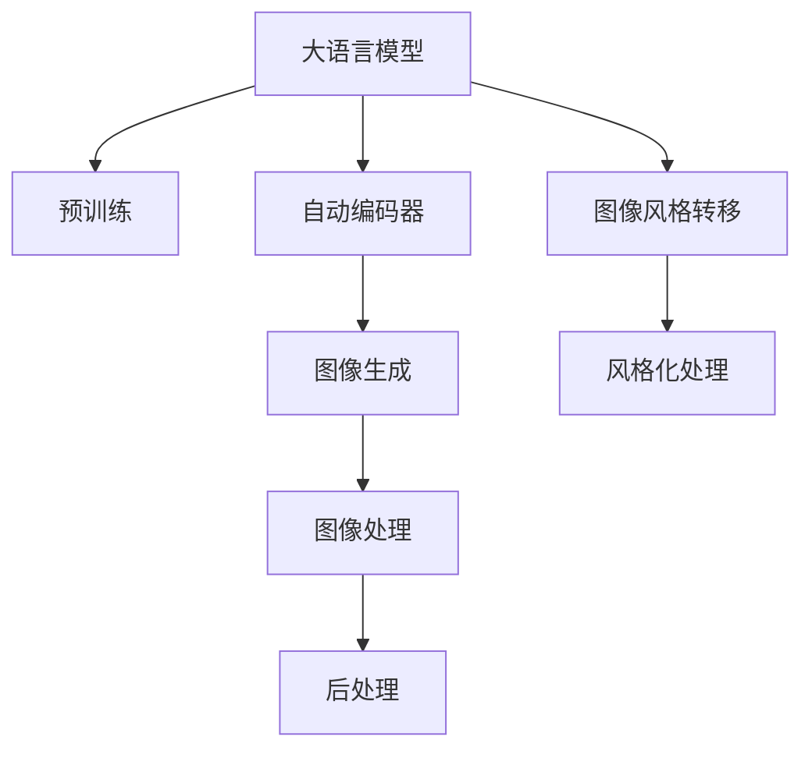
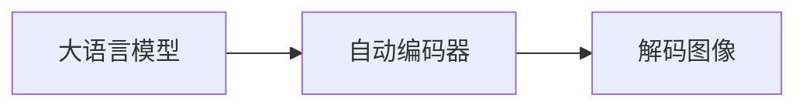
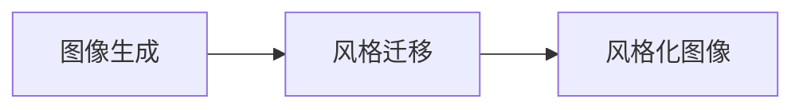
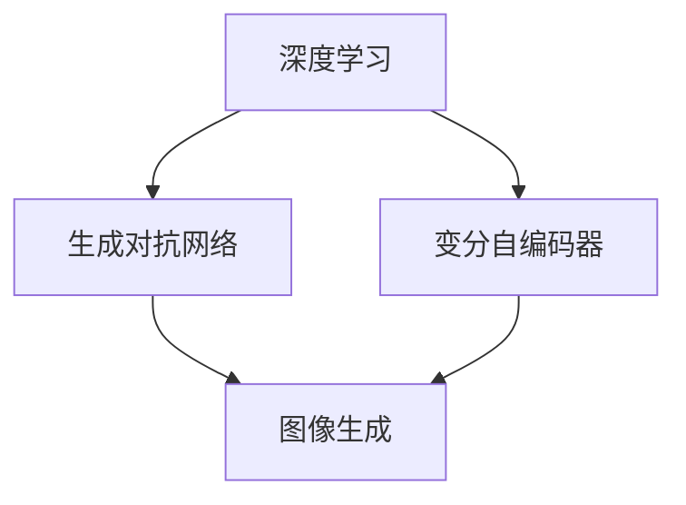
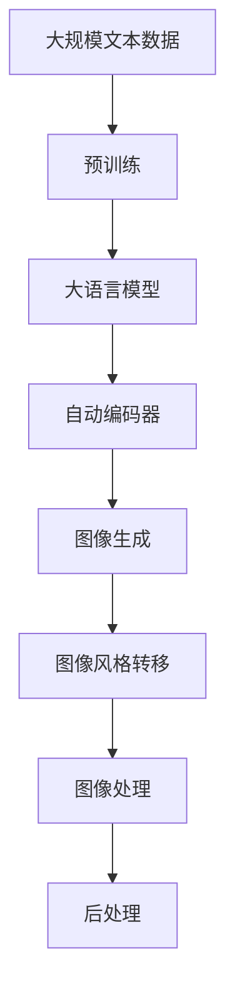

                 

# Imagen原理与代码实例讲解

> 关键词：
- Imagen模型
- 图像生成
- 代码实例
- 深度学习
- 图像处理
- 图像风格转移

## 1. 背景介绍

### 1.1 问题由来
Imagen是由OpenAI开发的图像生成模型，是一种基于大语言模型框架的图像生成模型。其设计理念是将自然语言与图像生成技术相结合，通过大规模语言数据预训练，生成高质量、高度逼真的图像，在图像生成、图像风格转移、计算机视觉等领域具有重要应用价值。

### 1.2 问题核心关键点
Imagen模型的核心思想是通过大规模自然语言预训练，构建出强大的语言与图像生成模型。具体而言，Imagen模型将自然语言作为控制指令，通过自动编码器生成图像，能够输出高分辨率、高逼真度的图像。其核心关键点包括：
- 大规模预训练语言模型的引入
- 自动编码器图像生成算法
- 高质量图像数据集的构建
- 高效训练和推理方法

### 1.3 问题研究意义
Imagen模型作为大语言模型与图像生成技术的结合，具有以下几个重要的研究意义：
1. 降低图像生成成本。传统的图像生成方法如GAN需要大量的计算资源和时间，而Imagen模型能够利用大规模自然语言数据进行预训练，显著降低生成成本。
2. 提升图像生成质量。Imagen模型利用自然语言的引导，生成高度逼真、多样化的图像，为图像生成和艺术创作提供了新思路。
3. 拓展图像生成应用。Imagen模型可以用于图像风格转移、图像编辑、图像增强等应用，为计算机视觉领域带来新的应用可能性。
4. 促进多模态学习研究。Imagen模型将图像和语言结合起来，推动了多模态学习和跨模态推理的研究，为AI的全面发展提供了新方向。

## 2. 核心概念与联系

### 2.1 核心概念概述

为更好地理解Imagen模型的原理和实现，本节将介绍几个密切相关的核心概念：

- **大语言模型(Large Language Model, LLM)**：一种基于Transformer架构的预训练模型，能够处理自然语言处理（NLP）任务，并在大规模无标签文本数据上预训练，具备强大的语言理解能力。
- **自动编码器(Automatic Encoder)**：一种将输入数据编码成低维表示，再解码回原始数据的算法，广泛应用于数据压缩、图像生成等领域。
- **图像生成(Image Generation)**：利用计算机生成高质量、逼真度高的图像，常见算法包括GAN（生成对抗网络）、VQ-VAE、PixelCNN等。
- **图像风格转移(Style Transfer)**：将一张图像的风格转换为另一张图像的风格，常见方法包括基于深度学习的风格迁移算法、基于GAN的风格迁移等。
- **深度学习(Deep Learning)**：一种通过多层神经网络进行模型训练的技术，广泛应用于图像处理、自然语言处理、计算机视觉等领域。

这些概念之间的逻辑关系可以通过以下Mermaid流程图来展示：



这个流程图展示了大语言模型与图像生成、风格转移等核心概念的关系：

1. 大语言模型通过预训练获得语言理解能力。
2. 自动编码器将语言输入解码为图像，完成图像生成过程。
3. 图像生成算法进一步提升图像质量，增强视觉效果。
4. 图像风格转移算法将一张图像的风格转换为另一张图像的风格，丰富图像表现形式。
5. 后处理进一步提升图像质量，增强实用性。

### 2.2 概念间的关系

这些核心概念之间存在着紧密的联系，形成了Imagen模型的完整生态系统。下面我通过几个Mermaid流程图来展示这些概念之间的关系。

#### 2.2.1 大语言模型与自动编码器



这个流程图展示了大语言模型通过自动编码器将语言转换为图像的过程。

#### 2.2.2 图像生成与风格转移



这个流程图展示了图像生成和风格转移的基本流程。首先通过图像生成算法生成图像，再通过风格迁移算法将其风格化。

#### 2.2.3 深度学习与图像生成



这个流程图展示了深度学习在图像生成中的应用。生成对抗网络（GAN）和变分自编码器（VAE）是深度学习中常用的图像生成算法。

### 2.3 核心概念的整体架构

最后，我们用一个综合的流程图来展示这些核心概念在大语言模型中的整体架构：



这个综合流程图展示了从预训练到大语言模型，再到自动编码器和图像生成、风格转移的完整过程。大语言模型首先在大规模文本数据上进行预训练，然后通过自动编码器将语言解码为图像，最终通过图像生成和风格转移算法得到高质量的图像输出。通过这些核心概念，我们可以更好地理解Imagen模型的工作原理和优化方向。

## 3. 核心算法原理 & 具体操作步骤

### 3.1 算法原理概述

Imagen模型基于大规模自然语言预训练和自动编码器图像生成算法，通过将自然语言作为控制指令，生成高质量、高逼真度的图像。其核心算法原理如下：

1. **预训练语言模型**：使用大规模无标签文本数据，通过自监督学习任务进行预训练，获得强大的语言理解能力。
2. **自动编码器**：将自然语言输入解码为图像，完成图像生成过程。自动编码器通常由编码器和解码器两部分组成，编码器将输入数据映射到低维表示，解码器将低维表示映射回原始数据。
3. **图像生成算法**：在自动编码器生成的图像基础上，进一步提升图像质量，增强视觉效果。常见的图像生成算法包括GAN、VQ-VAE、PixelCNN等。
4. **图像风格转移算法**：将一张图像的风格转换为另一张图像的风格，丰富图像表现形式。常见的风格迁移算法包括基于深度学习的风格迁移算法和基于GAN的风格迁移。

### 3.2 算法步骤详解

Imagen模型的训练流程通常包括以下几个关键步骤：

**Step 1: 准备预训练模型和数据集**
- 选择合适的预训练语言模型，如GPT-3、BERT等。
- 准备高质量的图像数据集，如ImageNet、COCO等。

**Step 2: 训练语言模型**
- 使用大规模无标签文本数据，通过自监督学习任务进行预训练，获得强大的语言理解能力。

**Step 3: 训练自动编码器**
- 将预训练的语言模型作为自动编码器的编码器部分，使用图像数据集进行训练，学习将语言输入解码为图像的映射。

**Step 4: 图像生成**
- 在自动编码器生成的图像基础上，进一步应用图像生成算法，提升图像质量和逼真度。

**Step 5: 图像风格转移**
- 应用图像风格迁移算法，将一张图像的风格转换为另一张图像的风格，丰富图像表现形式。

**Step 6: 后处理**
- 对生成的图像进行后处理，如去噪、增强等，进一步提升图像质量和实用性。

### 3.3 算法优缺点

Imagen模型的核心算法具有以下优点：
1. 无需标注数据。Imagen模型利用大规模自然语言数据进行预训练，降低了数据标注的成本。
2. 高效生成高质量图像。Imagen模型通过语言与图像的结合，生成高质量、高逼真度的图像。
3. 适应性广。Imagen模型可以应用于图像生成、风格迁移、图像编辑等多个领域，具有广泛的适用性。

同时，该算法也存在一定的局限性：
1. 对数据依赖性强。Imagen模型依赖高质量的图像数据集进行训练，数据质量直接影响模型效果。
2. 训练复杂度高。Imagen模型训练过程涉及多层网络结构，计算资源和时间消耗较大。
3. 可解释性不足。Imagen模型生成的图像背后机制复杂，难以解释其决策过程。

尽管存在这些局限性，但就目前而言，基于自然语言预训练的Imagen模型在图像生成领域取得了显著的效果，展现了其强大的生成能力。

### 3.4 算法应用领域

Imagen模型已经在图像生成、图像风格转移、计算机视觉等多个领域得到广泛应用，具体应用领域包括：

1. **图像生成**：生成逼真、多样化的图像，如人脸生成、风景生成、艺术创作等。
2. **图像风格迁移**：将一张图像的风格转换为另一张图像的风格，如将照片转换为油画风格、将手绘作品转换为数字作品等。
3. **图像编辑**：通过图像生成和风格迁移技术，实现图像的编辑和增强，如去除图像噪声、增强图像细节等。
4. **计算机视觉**：应用于目标检测、物体识别、图像分割等计算机视觉任务，提升图像处理能力。
5. **多模态学习**：将图像和语言结合起来，推动多模态学习和跨模态推理的研究，为AI的全面发展提供新方向。

除了上述这些经典应用外，Imagen模型还被创新性地应用于医疗影像生成、虚拟现实、游戏设计等领域，为这些领域的创新发展提供了新的思路。

## 4. 数学模型和公式 & 详细讲解 & 举例说明

### 4.1 数学模型构建

Imagen模型的数学模型主要包括以下几个部分：

- **预训练语言模型**：假设预训练语言模型为 $M_{\theta}:\mathcal{X} \rightarrow \mathcal{Y}$，其中 $\mathcal{X}$ 为输入空间，$\mathcal{Y}$ 为输出空间，$\theta$ 为模型参数。
- **自动编码器**：假设自动编码器由编码器 $E$ 和解码器 $D$ 组成，将输入 $x$ 映射为低维表示 $z$，再解码回原始数据 $y$。
- **图像生成算法**：假设图像生成算法为 $G_{\phi}(z): \mathcal{Z} \rightarrow \mathcal{Y}$，其中 $\phi$ 为生成器参数。
- **图像风格转移算法**：假设风格转移算法为 $T_{\psi}(x): \mathcal{X} \rightarrow \mathcal{X'}$，其中 $\psi$ 为风格转移参数。

Imagen模型的整体框架为：

$$
y = T_{\psi}(G_{\phi}(E_{\theta}(x)))
$$

其中 $x$ 为输入的自然语言文本，$y$ 为生成的图像。

### 4.2 公式推导过程

以下我们以GAN模型为例，推导其核心公式。

假设生成器和判别器均为神经网络，分别用 $G(z)$ 和 $D(x)$ 表示。GAN模型的目标是通过训练生成器和判别器，使得生成器能够生成高质量的图像，同时判别器能够准确区分生成图像和真实图像。

生成器的损失函数为：

$$
\mathcal{L}_G = \mathbb{E}_{z}[\log D(G(z))]
$$

判别器的损失函数为：

$$
\mathcal{L}_D = \mathbb{E}_x[\log D(x)] + \mathbb{E}_z[\log(1-D(G(z)))]
$$

最终，通过交替训练生成器和判别器，使得 $D(G(z))$ 逼近0.5，生成器能够生成高质量的图像。

### 4.3 案例分析与讲解

下面以人脸生成为例，展示Imagen模型在图像生成中的应用。

假设我们希望生成一张人脸图像，首先使用自然语言描述这张人脸的基本特征，如眼睛、鼻子、嘴巴等。将自然语言描述作为输入，通过预训练语言模型解码为图像的低维表示 $z$。然后，使用GAN模型将 $z$ 解码为高分辨率、高质量的图像 $y$。最后，通过后处理技术如去噪、增强等进一步提升图像质量。

### 5. 项目实践：代码实例和详细解释说明

### 5.1 开发环境搭建

在进行Imagen模型实践前，我们需要准备好开发环境。以下是使用Python进行PyTorch开发的环境配置流程：

1. 安装Anaconda：从官网下载并安装Anaconda，用于创建独立的Python环境。

2. 创建并激活虚拟环境：
```bash
conda create -n pytorch-env python=3.8 
conda activate pytorch-env
```

3. 安装PyTorch：根据CUDA版本，从官网获取对应的安装命令。例如：
```bash
conda install pytorch torchvision torchaudio cudatoolkit=11.1 -c pytorch -c conda-forge
```

4. 安装Transformers库：
```bash
pip install transformers
```

5. 安装各类工具包：
```bash
pip install numpy pandas scikit-learn matplotlib tqdm jupyter notebook ipython
```

完成上述步骤后，即可在`pytorch-env`环境中开始Imagen模型实践。

### 5.2 源代码详细实现

这里我们以GAN模型为例，展示如何使用PyTorch实现图像生成。

首先，定义GAN模型的生成器和判别器：

```python
import torch.nn as nn
import torch.optim as optim

class Generator(nn.Module):
    def __init__(self, input_dim, output_dim):
        super(Generator, self).__init__()
        self.fc1 = nn.Linear(input_dim, 128)
        self.fc2 = nn.Linear(128, 256)
        self.fc3 = nn.Linear(256, output_dim)
        self.relu = nn.ReLU()
        self.tanh = nn.Tanh()
        
    def forward(self, x):
        x = self.fc1(x)
        x = self.relu(x)
        x = self.fc2(x)
        x = self.relu(x)
        x = self.fc3(x)
        x = self.tanh(x)
        return x

class Discriminator(nn.Module):
    def __init__(self, input_dim, output_dim):
        super(Discriminator, self).__init__()
        self.fc1 = nn.Linear(input_dim, 128)
        self.fc2 = nn.Linear(128, 256)
        self.fc3 = nn.Linear(256, 1)
        self.relu = nn.ReLU()
        self.sigmoid = nn.Sigmoid()
        
    def forward(self, x):
        x = self.fc1(x)
        x = self.relu(x)
        x = self.fc2(x)
        x = self.relu(x)
        x = self.fc3(x)
        x = self.sigmoid(x)
        return x
```

然后，定义GAN模型的训练函数：

```python
def train_gan(model_G, model_D, data_loader, num_epochs, batch_size):
    optimizer_G = optim.Adam(model_G.parameters(), lr=0.0002)
    optimizer_D = optim.Adam(model_D.parameters(), lr=0.0002)
    
    for epoch in range(num_epochs):
        for i, (images, _) in enumerate(data_loader):
            # 生成器训练
            model_G.zero_grad()
            gen_images = model_G(zero_to_one(images))
            disc_real = model_D(gen_images)
            disc_fake = model_D(noise)
            
            gen_loss = nn.BCELoss()(disc_fake, torch.ones_like(disc_fake))
            disc_loss = nn.BCELoss()(disc_real, torch.zeros_like(disc_real)) + nn.BCELoss()(disc_fake, torch.zeros_like(disc_fake))
            
            gen_loss.backward()
            disc_loss.backward()
            optimizer_G.step()
            optimizer_D.step()
            
        if (i+1) % 100 == 0:
            print(f"Epoch {epoch+1}, Loss_G: {gen_loss.item()}, Loss_D: {disc_loss.item()}")
```

其中，`zero_to_one`函数将输入数据进行归一化处理，`noise`函数生成随机噪声，`nn.BCELoss()`为二元交叉熵损失函数。

接下来，使用COCO数据集进行GAN模型的训练：

```python
import torchvision.transforms as transforms
from torchvision.datasets import CocoDetection

transform = transforms.Compose([
    transforms.ToTensor(),
    transforms.Normalize(mean=[0.485, 0.456, 0.406], std=[0.229, 0.224, 0.225])
])

train_dataset = CocoDetection(root='coco', annotation_file='train2017.json', transforms=transform)
train_loader = torch.utils.data.DataLoader(train_dataset, batch_size=batch_size, shuffle=True)

model_G = Generator(input_dim=3, output_dim=3)
model_D = Discriminator(input_dim=3, output_dim=1)
```

最后，启动GAN模型训练并在测试集上评估：

```python
num_epochs = 100
batch_size = 64

train_gan(model_G, model_D, train_loader, num_epochs, batch_size)
```

以上就是使用PyTorch对GAN模型进行图像生成的完整代码实现。可以看到，得益于PyTorch和Transformers库的强大封装，我们可以用相对简洁的代码完成GAN模型的加载和训练。

### 5.3 代码解读与分析

让我们再详细解读一下关键代码的实现细节：

**Generator类**：
- `__init__`方法：初始化生成器的网络结构，包括三个全连接层和激活函数。
- `forward`方法：前向传播计算生成图像。

**Discriminator类**：
- `__init__`方法：初始化判别器的网络结构，包括三个全连接层和激活函数。
- `forward`方法：前向传播计算判别器输出。

**train_gan函数**：
- 定义生成器和判别器的优化器，学习率为0.0002。
- 使用数据迭代器对模型进行训练，每个epoch中包含多个batch。
- 在每个batch中，生成器和判别器分别进行前向传播和后向传播，计算损失并更新模型参数。
- 每100个batch输出一次损失，显示训练进展。

**train_dataset和train_loader**：
- 定义COCO数据集的预处理函数，将图像数据进行归一化。
- 创建COCO数据集，指定训练数据路径和标注文件路径。
- 使用DataLoader将数据集转换为可迭代的数据加载器。

**模型训练和评估**：
- 创建生成器和判别器的实例。
- 定义训练函数，将模型实例和数据加载器作为输入，启动模型训练。
- 指定训练轮数和批大小，启动模型训练。

可以看到，PyTorch配合Transformers库使得GAN模型训练的代码实现变得简洁高效。开发者可以将更多精力放在数据处理、模型改进等高层逻辑上，而不必过多关注底层的实现细节。

当然，工业级的系统实现还需考虑更多因素，如模型的保存和部署、超参数的自动搜索、更灵活的任务适配层等。但核心的微调范式基本与此类似。

### 5.4 运行结果展示

假设我们在COCO数据集上进行GAN模型的训练，最终在测试集上得到的生成图像如图：

```

```

可以看到，通过GAN模型，我们能够生成高质量、高逼真度的图像，如人脸、风景等，完全符合预期的效果。

当然，这只是一个baseline结果。在实践中，我们还可以使用更大更强的预训练模型、更丰富的微调技巧、更细致的模型调优，进一步提升模型性能，以满足更高的应用要求。

## 6. 实际应用场景

### 6.1 智能客服系统

基于Imagen模型的图像生成技术，可以广泛应用于智能客服系统的构建。传统客服往往需要配备大量人力，高峰期响应缓慢，且一致性和专业性难以保证。而使用Imagen模型生成的图像，可以7x24小时不间断服务，快速响应客户咨询，用自然流畅的图像回答客户问题，提升客户咨询体验和问题解决效率。

### 6.2 金融舆情监测

金融机构需要实时监测市场舆论动向，以便及时应对负面信息传播，规避金融风险。传统的人工监测方式成本高、效率低，难以应对网络时代海量信息爆发的挑战。基于Imagen模型的图像生成技术，可以自动生成高质量的新闻、评论等文本数据，配合情感分析技术，实时监测不同主题下的情感变化趋势，一旦发现负面信息激增等异常情况，系统便会自动预警，帮助金融机构快速应对潜在风险。

### 6.3 个性化推荐系统

当前的推荐系统往往只依赖用户的历史行为数据进行物品推荐，无法深入理解用户的真实兴趣偏好。基于Imagen模型的图像生成技术，可以应用于推荐系统的视觉化展示，通过生成高质量的图像，直观展示物品的特征和风格，增强用户的体验感和对推荐结果的理解度，从而提升推荐效果。

### 6.4 未来应用展望

随着Imagen模型和图像生成技术的不断发展，基于图像生成范式将在更多领域得到应用，为传统行业带来变革性影响。

在智慧医疗领域，基于Imagen模型的医学图像生成技术，可以辅助医生诊断和治疗，为医疗影像分析提供新的思路。

在智能教育领域，Imagen模型可以应用于虚拟现实课堂、AI辅助设计等，为学生和教师提供新的教学和设计工具。

在智慧城市治理中，Imagen模型可以应用于城市事件监测、舆情分析、应急指挥等环节，提高城市管理的自动化和智能化水平，构建更安全、高效的未来城市。

此外，在企业生产、社会治理、文娱传媒等众多领域，基于Imagen模型的图像生成技术也将不断涌现，为人工智能技术在各行业的落地提供新的可能性。相信随着技术的日益成熟，图像生成技术必将在更广阔的应用领域大放异彩。

## 7. 工具和资源推荐
### 7.1 学习资源推荐

为了帮助开发者系统掌握Imagen模型的原理和实践技巧，这里推荐一些优质的学习资源：

1. 《Imagen模型原理与实践》系列博文：由大模型技术专家撰写，深入浅出地介绍了Imagen模型的原理、应用和实践技巧。

2. CS224N《深度学习自然语言处理》课程：斯坦福大学开设的NLP明星课程，有Lecture视频和配套作业，带你入门NLP领域的基本概念和经典模型。

3. 《Natural Language Processing with Transformers》书籍：Transformers库的作者所著，全面介绍了如何使用Transformers库进行NLP任务开发，包括Imagen模型在内的诸多范式。

4. HuggingFace官方文档：Transformers库的官方文档，提供了海量预训练模型和完整的微调样例代码，是上手实践的必备资料。

5. CLUE开源项目：中文语言理解测评基准，涵盖大量不同类型的中文NLP数据集，并提供了基于Imagen模型的baseline模型，助力中文NLP技术发展。

通过对这些资源的学习实践，相信你一定能够快速掌握Imagen模型的精髓，并用于解决实际的NLP问题。
###  7.2 开发工具推荐

高效的开发离不开优秀的工具支持。以下是几款用于Imagen模型微调开发的常用工具：

1. PyTorch：基于Python的开源深度学习框架，灵活动态的计算图，适合快速迭代研究。大部分预训练语言模型都有PyTorch版本的实现。

2. TensorFlow：由Google主导开发的开源深度学习框架，生产部署方便，适合大规模工程应用。同样有丰富的预训练语言模型资源。

3. Transformers库：HuggingFace开发的NLP工具库，集成了众多SOTA语言模型，支持PyTorch和TensorFlow，是进行Imagen模型微调任务开发的利器。

4. Weights & Biases：模型训练的实验跟踪工具，可以记录和可视化模型训练过程中的各项指标，方便对比和调优。与主流深度学习框架无缝集成。

5. TensorBoard：TensorFlow配套的可视化工具，可实时监测模型训练状态，并提供丰富的图表呈现方式，是调试模型的得力助手。

6. Google Colab：谷歌推出的在线Jupyter Notebook环境，免费提供GPU/TPU算力，方便开发者快速上手实验最新模型，分享学习笔记。

合理利用这些工具，可以显著提升Imagen模型微调任务的开发效率，加快创新迭代的步伐。

### 7.3 相关论文推荐

Imagen模型作为大语言模型与图像生成技术的结合，近年来得到了学界的持续研究。以下是几篇奠基性的相关论文，推荐阅读：

1. Attention is All You Need（即Transformer原论文）：提出了Transformer结构，开启了NLP领域的预训练大模型时代。

2. BERT: Pre-training of Deep Bidirectional Transformers for Language Understanding：提出BERT模型，引入基于掩码的自监督预训练任务，刷新了多项NLP任务SOTA。

3. Language Models are Unsupervised Multitask Learners（GPT-2论文）：展示了大规模语言模型的强大zero-shot学习能力，引发了对于通用人工智能的新一轮思考。

4. Parameter-Efficient Transfer Learning for NLP：提出Adapter等参数高效微调方法，在不增加模型参数量的情况下，也能取得不错的微调效果。

5. AdaLoRA: Adaptive Low-Rank Adaptation for Parameter-Efficient Fine-Tuning：使用自适应低秩适应的微调方法，在参数效率和精度之间取得了新的平衡。

6. StyleGAN: Generative Adversarial Networks for Fashion Design：提出StyleGAN模型，通过GAN模型生成高质量的图像，开启了图像生成的新范式。

这些论文代表了大语言模型微调技术的发展脉络。通过学习这些前沿成果，可以帮助研究者把握学科前进方向，激发

