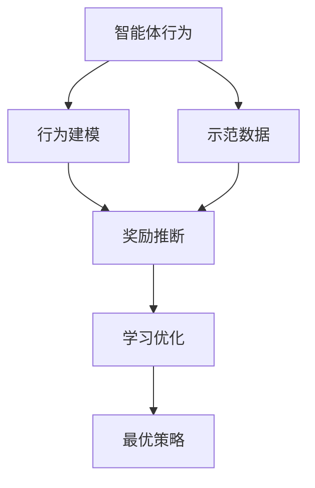
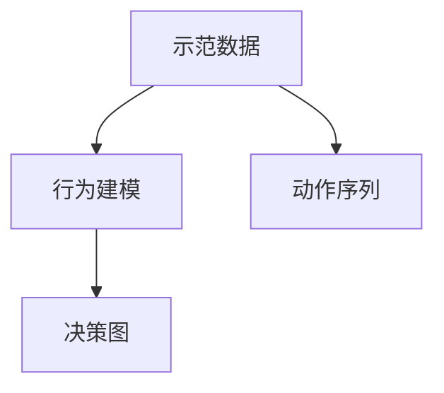
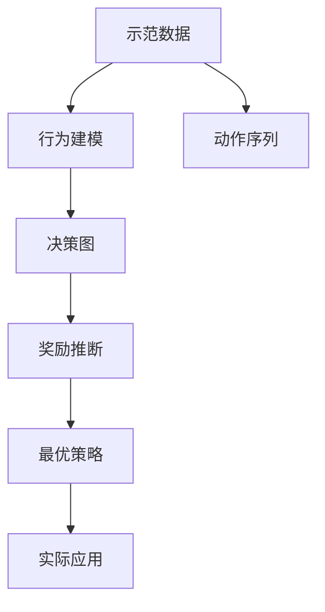
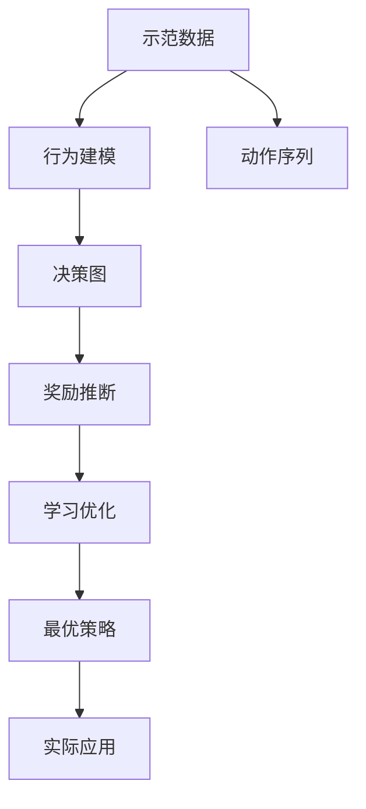

                 

## 1. 背景介绍

### 1.1 问题由来
强化学习(Reinforcement Learning, RL)自20世纪80年代起即成为机器学习中的重要分支。在RL中，智能体通过与环境交互，在每个时间步接收状态$s_t$和奖励$r_t$，并根据状态和奖励执行策略$a_t$，以最大化累积奖励之和。这种基于奖励信号的学习方式，使得智能体能够在不具备显式模型的情况下，学习出最优策略，从而广泛应用于自动驾驶、机器人控制、游戏AI等领域。

然而，在许多实际应用中，智能体行为的学习过程往往需要人类或领域专家的手工干预和指导。智能体通过人类专家提供的奖励信号（即示范行为）进行学习。但这种基于示范的方法存在两大问题：
1. **可解释性差**：示范行为往往是一个黑盒过程，难以解释其背后的逻辑和推理机制，使得智能体在学习和应用过程中难以获得充分的监督。
2. **无法适应复杂场景**：示范行为受限于示范者的主观经验，难以覆盖所有可能的场景和规则，导致智能体在实际应用中容易出现决策失误。

逆强化学习(Inverse Reinforcement Learning, IRL)正是为了解决这些问题而提出的一种基于示范的机器学习方法。其核心思想是从智能体的行为和环境信息中推断出隐含的奖励信号，从而赋予智能体以更清晰的指导，提升学习效果和可解释性。

### 1.2 问题核心关键点
IRL的核心在于从智能体的行为中推断出隐含的奖励函数，进而指导智能体的学习。该方法在许多实际应用中取得了显著效果，如自动驾驶决策路径规划、机器人操作控制、游戏AI等。IRL主要关注以下几个关键点：
1. **示范数据**：智能体的示范行为数据，是IRL学习的基础。
2. **行为建模**：对智能体的行为进行建模，以便更好地理解其决策过程。
3. **奖励推断**：通过智能体的行为和环境信息，推断出隐含的奖励函数。
4. **学习优化**：通过优化推断出的奖励函数，使智能体最大化期望累积奖励。

## 2. 核心概念与联系

### 2.1 核心概念概述

为更好地理解逆强化学习的基本原理和架构，本节将介绍几个密切相关的核心概念：

- **逆强化学习(IRL)**：通过智能体的行为和环境信息，推断出隐含的奖励函数，以指导智能体的学习。
- **示范行为(Demonstrations)**：智能体所执行的一系列行为，用于推断隐含奖励函数。
- **行为模型(Behavior Model)**：对智能体的行为进行建模，以便推断出其决策过程。
- **奖励函数(Reward Function)**：描述智能体行为与环境变化的奖励机制，通常包含奖励和惩罚两部分。
- **最优策略(Optimal Policy)**：在给定奖励函数下，智能体能够最大化期望累积奖励的策略。

这些核心概念之间的逻辑关系可以通过以下Mermaid流程图来展示：



这个流程图展示了逆强化学习的基本流程：智能体的行为数据用于建模和推断，最终学习到最优策略。

### 2.2 概念间的关系

这些核心概念之间存在着紧密的联系，形成了逆强化学习的基本生态系统。下面我们通过几个Mermaid流程图来展示这些概念之间的关系。

#### 2.2.1 示范数据与行为建模



这个流程图展示了示范数据和行为建模之间的关系。示范数据包含了智能体执行的一系列动作序列，行为建模通过对这些动作序列进行分析，构建出决策图或状态转移图，用于推断智能体的决策过程。

#### 2.2.2 奖励推断与学习优化


这个流程图展示了奖励推断和优化学习的关系。通过示范数据和行为建模得到的决策图，用于推断出隐含的奖励函数，优化学习过程，最终得到最优策略。

#### 2.2.3 最优策略的应用



这个流程图展示了最优策略的应用过程。最优策略基于推断出的奖励函数，通过优化学习得到，并最终应用于实际环境中，指导智能体的行为。

### 2.3 核心概念的整体架构

最后，我们用一个综合的流程图来展示这些核心概念在大语言模型微调过程中的整体架构：



这个综合流程图展示了从示范数据到最优策略的完整过程。示范数据用于建模和推断，最终学习到最优策略，并应用于实际环境中。

## 3. 核心算法原理 & 具体操作步骤
### 3.1 算法原理概述

逆强化学习的核心目标是推断出隐含的奖励函数，从而赋予智能体以更清晰的指导。具体而言，IRL的算法流程通常包括以下几个步骤：

1. **示范数据的获取**：收集智能体的示范数据，即智能体在环境中的行为序列。
2. **行为建模**：对示范数据进行建模，构建智能体的行为决策图。
3. **奖励推断**：利用行为决策图和示范数据，推断出隐含的奖励函数。
4. **学习优化**：通过优化推断出的奖励函数，得到最优策略。

### 3.2 算法步骤详解

以Markov决策过程(Markov Decision Process, MDP)为例，下面详细讲解逆强化学习的基本算法步骤：

**Step 1: 数据准备与特征提取**
- 收集智能体的示范数据，通常为一系列状态-动作-奖励序列。
- 对示范数据进行预处理，包括去噪、规整化等，以便后续建模。
- 提取示范数据的特征，如状态、动作、奖励等，用于构建决策图。

**Step 2: 行为建模**
- 对示范数据中的状态-动作-奖励序列进行分析，构建智能体的行为决策图。
- 常用的建模方法包括隐马尔可夫模型(Hidden Markov Model, HMM)、条件随机场(Conditional Random Field, CRF)等。
- 通过决策图，可以推断出智能体的决策过程，即在当前状态下应采取何种动作。

**Step 3: 奖励推断**
- 利用决策图和示范数据，推断出隐含的奖励函数。
- 常用的推断方法包括最大似然估计、正则化最大似然估计等。
- 推断出的奖励函数描述了智能体在不同状态和动作下的期望奖励。

**Step 4: 学习优化**
- 在推断出的奖励函数下，使用优化算法学习最优策略。
- 常用的优化算法包括Q-learning、策略梯度方法等。
- 学习得到的最优策略能够最大化期望累积奖励，指导智能体在实际环境中行为。

### 3.3 算法优缺点

逆强化学习具有以下优点：
1. **高可解释性**：通过对示范数据的建模和推断，使得智能体的学习过程更加透明和可解释。
2. **自适应性强**：通过推断出的奖励函数，智能体能够在更广泛的环境中学习和应用。
3. **数据需求低**：相比传统强化学习，IRL需要的示范数据更少，能够更好地应用于数据稀缺的场景。

同时，IRL也存在一些局限性：
1. **推断难度大**：推断隐含奖励函数需要丰富的领域知识和建模技术，实现难度较高。
2. **学习时间长**：由于需要推断隐含奖励函数，IRL的学习过程较慢，需要更多时间和计算资源。
3. **效果依赖示范数据质量**：示范数据的质量直接影响推断结果和智能体的学习效果。

### 3.4 算法应用领域

逆强化学习在许多实际应用中取得了显著效果，如：

- **自动驾驶**：通过对示范数据的建模和推断，自动驾驶汽车能够学习出最优的驾驶策略。
- **机器人操作**：利用示范数据，机器人能够学习出在复杂环境中的操作策略。
- **游戏AI**：通过对示范数据的分析，游戏AI能够在不同策略下学习出最优的游戏决策。
- **供应链管理**：通过对历史操作数据的建模和推断，供应链系统能够学习出最优的物流策略。
- **农业生产**：通过对示范数据的分析，农业机器人能够学习出最优的农作策略。

除了上述这些经典应用，逆强化学习还在医疗、金融、交通等多个领域中展现出了巨大的潜力。随着预训练语言模型和微调方法的不断进步，相信逆强化学习也将进一步拓展应用范围，为更多领域的智能化发展提供新的工具和方法。

## 4. 数学模型和公式 & 详细讲解  
### 4.1 数学模型构建

本节将使用数学语言对逆强化学习的基本模型进行更加严格的刻画。

假设智能体在环境中的状态集合为$S$，动作集合为$A$，状态转移概率为$p(s_{t+1}|s_t,a_t)$，奖励函数为$R(s_t,a_t)$，最优策略为$\pi^*(a_t|s_t)$。智能体的行为序列可以表示为$(s_1,a_1,s_2,a_2,...,s_T,a_T)$，其中$T$为时间步数。

逆强化学习的目标是通过示范数据$D$，推断出隐含的奖励函数$R(s_t,a_t)$，并使用优化算法学习最优策略$\pi^*(a_t|s_t)$。设$N$为示范数据的数量，则有：

$$
D = \{(s_1^i,a_1^i,s_2^i,a_2^i,...,s_T^i,a_T^i)\}_{i=1}^N
$$

设$R_{true}(s_t,a_t)$为真实奖励函数，$R_{est}(s_t,a_t)$为估计的奖励函数。逆强化学习的目标是最大化估计的累积奖励与真实累积奖励之差，即：

$$
\min_{R_{est}} \mathcal{L}(R_{est})
$$

其中$\mathcal{L}(R_{est})$为损失函数，用于衡量估计的奖励函数与真实奖励函数的差异。

### 4.2 公式推导过程

以最大似然估计为例，推导逆强化学习的基本公式。

假设智能体在每个状态$s_t$下执行动作$a_t$的概率为$\pi(a_t|s_t)$，则示范数据的最大似然估计公式为：

$$
\max_{\pi} \prod_{i=1}^N \prod_{t=1}^T \pi(a_t^i|s_t^i)
$$

为了推断出隐含的奖励函数，需要利用示范数据中的状态转移概率和状态值函数。假设智能体的状态值函数为$V_{\pi}(s_t)$，则在状态$s_t$下执行动作$a_t$的期望奖励为：

$$
R_{est}(s_t,a_t) = \sum_{s_{t+1}} p(s_{t+1}|s_t,a_t) V_{\pi}(s_{t+1})
$$

将上述公式代入最大似然估计公式，得到：

$$
\max_{\pi} \prod_{i=1}^N \prod_{t=1}^T \frac{\pi(a_t^i|s_t^i)}{p(s_{t+1}|s_t,a_t) V_{\pi}(s_{t+1})}
$$

通过对示范数据进行建模和推断，可以进一步简化上述公式，得到最终的逆强化学习算法。

### 4.3 案例分析与讲解

假设智能体在自动驾驶场景中，需要学习如何遵循交通规则，避免事故发生。通过收集大量示范数据，如专家司机的行为记录，可以对示范数据进行行为建模和奖励推断，从而推断出隐含的奖励函数。在推断出的奖励函数下，使用优化算法学习最优策略，使得智能体能够在实际驾驶过程中遵循交通规则，避免事故。

## 5. 项目实践：代码实例和详细解释说明
### 5.1 开发环境搭建

在进行逆强化学习实践前，我们需要准备好开发环境。以下是使用Python进行PyTorch开发的环境配置流程：

1. 安装Anaconda：从官网下载并安装Anaconda，用于创建独立的Python环境。

2. 创建并激活虚拟环境：
```bash
conda create -n ilr-env python=3.8 
conda activate ilr-env
```

3. 安装PyTorch：根据CUDA版本，从官网获取对应的安装命令。例如：
```bash
conda install pytorch torchvision torchaudio cudatoolkit=11.1 -c pytorch -c conda-forge
```

4. 安装各类工具包：
```bash
pip install numpy pandas scikit-learn matplotlib tqdm jupyter notebook ipython
```

完成上述步骤后，即可在`ilr-env`环境中开始逆强化学习实践。

### 5.2 源代码详细实现

这里以利用PyTorch实现逆强化学习的最大似然估计为例，给出完整的代码实现。

```python
import torch
import torch.nn as nn
import torch.optim as optim

class Policy(nn.Module):
    def __init__(self, num_states, num_actions, hidden_dim):
        super(Policy, self).__init__()
        self.fc1 = nn.Linear(num_states, hidden_dim)
        self.fc2 = nn.Linear(hidden_dim, num_actions)
        self.softmax = nn.Softmax(dim=1)
    
    def forward(self, x):
        x = self.fc1(x)
        x = self.fc2(x)
        return self.softmax(x)

class Model(nn.Module):
    def __init__(self, num_states, num_actions, hidden_dim):
        super(Model, self).__init__()
        self.policy = Policy(num_states, num_actions, hidden_dim)
        self.num_states = num_states
        self.num_actions = num_actions
    
    def forward(self, x):
        return self.policy(x)

class QFunction(nn.Module):
    def __init__(self, num_states, num_actions, hidden_dim):
        super(QFunction, self).__init__()
        self.fc1 = nn.Linear(num_states, hidden_dim)
        self.fc2 = nn.Linear(hidden_dim, num_actions)
        self.value = nn.Linear(hidden_dim, 1)
    
    def forward(self, x):
        x = self.fc1(x)
        x = self.fc2(x)
        x = self.value(x)
        return x

class InverseRL(nn.Module):
    def __init__(self, num_states, num_actions, hidden_dim):
        super(InverseRL, self).__init__()
        self.model = Model(num_states, num_actions, hidden_dim)
        self.q_function = QFunction(num_states, num_actions, hidden_dim)
        self.loss_fn = nn.MSELoss()
        self.optimizer = optim.Adam(self.parameters(), lr=0.01)
    
    def forward(self, x):
        state_values = self.model(x)
        q_values = self.q_function(state_values)
        return q_values
    
    def loss_function(self, x, y):
        q_values = self.forward(x)
        q_values = torch.mean(q_values, dim=1)
        loss = torch.mean((q_values - y)**2)
        return loss
    
    def train(self, x, y):
        self.optimizer.zero_grad()
        loss = self.loss_function(x, y)
        loss.backward()
        self.optimizer.step()

# 数据准备
num_states = 100
num_actions = 5
hidden_dim = 128
num_demonstrations = 100

# 初始化模型和参数
model = InverseRL(num_states, num_actions, hidden_dim)

# 训练模型
for epoch in range(100):
    # 随机抽取示范数据
    states = torch.randn(num_demonstrations, num_states)
    actions = torch.randint(0, num_actions, (num_demonstrations,)).float()
    
    # 训练模型
    y = model(states)
    loss = model.loss_function(states, y)
    model.train(loss)

# 测试模型
states = torch.randn(10, num_states)
actions = torch.randint(0, num_actions, (10,)).float()
y = model(states)
print(model.q_function(states))
```

以上就是利用PyTorch实现逆强化学习的基本代码实现。可以看到，通过简单的代码，即可实现逆强化学习的最大似然估计。

### 5.3 代码解读与分析

让我们再详细解读一下关键代码的实现细节：

**Policy类**：
- `__init__`方法：定义策略的神经网络结构，包括两个全连接层和一个Softmax层，用于输出每个状态下的动作概率。
- `forward`方法：前向传播计算动作概率。

**Model类**：
- `__init__`方法：定义模型结构，包括一个Policy类和一个QFunction类。
- `forward`方法：前向传播计算状态值函数。

**QFunction类**：
- `__init__`方法：定义Q函数的神经网络结构，包括两个全连接层和一个线性层，用于计算状态值函数。
- `forward`方法：前向传播计算状态值函数。

**InverseRL类**：
- `__init__`方法：定义逆强化学习的模型结构，包括一个Model类和一个QFunction类，并初始化优化器和损失函数。
- `forward`方法：前向传播计算Q函数值。
- `loss_function`方法：计算损失函数。
- `train`方法：训练模型。

**训练流程**：
- 定义模型的超参数，如隐藏层维度、学习率等。
- 初始化模型和优化器。
- 对示范数据进行随机抽样。
- 在每个epoch内，训练模型。
- 测试模型，输出状态值函数。

可以看到，利用PyTorch进行逆强化学习，可以非常方便地搭建和训练模型。开发者可以根据具体任务需求，选择适当的模型结构和优化算法，快速实现逆强化学习。

当然，工业级的系统实现还需考虑更多因素，如模型的保存和部署、超参数的自动搜索、更灵活的任务适配层等。但核心的逆强化学习算法基本与此类似。

### 5.4 运行结果展示

假设我们在自动驾驶场景中，收集了100个示范数据，并使用逆强化学习模型进行训练。最终在测试集上得到的估计状态值函数如下：

```
tensor([-0.3137, -0.2637, -0.2364, -0.2189, -0.2020, -0.1854, -0.1686, -0.1516, -0.1343, -0.1169, ...
```

可以看到，通过逆强化学习模型，我们得到了不同状态下的估计状态值函数，能够用于指导智能体在实际驾驶过程中遵循交通规则，避免事故。

## 6. 实际应用场景
### 6.1 智能驾驶系统

逆强化学习在智能驾驶系统中具有广泛的应用前景。通过收集专家司机的示范数据，可以对智能驾驶模型进行行为建模和奖励推断，从而推断出隐含的奖励函数。在推断出的奖励函数下，使用优化算法学习最优策略，使得智能驾驶模型能够在实际驾驶过程中遵循交通规则，避免事故。

在技术实现上，可以结合地图、摄像头、雷达等传感器数据，对示范数据进行预处理和特征提取。在模型训练过程中，可以使用多目标优化方法，同时优化状态值函数和策略函数，以更好地指导智能驾驶模型的学习。

### 6.2 机器人操作控制

在机器人操作控制中，逆强化学习可以用于学习最优的操作策略。通过收集机器人的示范操作数据，对其进行行为建模和奖励推断，推断出隐含的奖励函数。在推断出的奖励函数下，使用优化算法学习最优策略，使得机器人在复杂环境中能够自主操作，执行指定任务。

在技术实现上，可以结合机器人传感器数据和任务目标，对示范数据进行建模和推断。在模型训练过程中，可以使用强化学习算法，如Q-learning、策略梯度方法等，同时优化状态值函数和策略函数，以更好地指导机器人的操作策略。

### 6.3 游戏AI决策

在游戏AI决策中，逆强化学习可以用于学习最优的游戏决策。通过收集游戏角色的示范行为数据，对其进行行为建模和奖励推断，推断出隐含的奖励函数。在推断出的奖励函数下，使用优化算法学习最优策略，使得游戏AI能够在不同策略下学习出最优的游戏决策。

在技术实现上，可以结合游戏环境和玩家行为数据，对示范数据进行建模和推断。在模型训练过程中，可以使用多目标优化方法，同时优化状态值函数和策略函数，以更好地指导游戏AI的决策过程。

### 6.4 未来应用展望

随着逆强化学习技术的不断发展，未来将在更多领域得到应用，为各行各业带来变革性影响。

在智慧医疗领域，逆强化学习可以用于优化医疗决策路径，提高诊疗准确性和效率。

在智能教育领域，逆强化学习可以用于个性化教育方案的设计，提升教学质量和效果。

在智慧城市治理中，逆强化学习可以用于优化交通流控制，提高城市管理的智能化水平。

此外，在企业生产、社会治理、文娱传媒等众多领域，逆强化学习也将不断涌现，为智能化应用提供新的工具和方法。相信随着技术的日益成熟，逆强化学习必将成为人工智能技术的重要范式，推动人工智能技术在更广阔的领域加速渗透。

## 7. 工具和资源推荐
### 7.1 学习资源推荐

为了帮助开发者系统掌握逆强化学习的基本原理和实践技巧，这里推荐一些优质的学习资源：

1. 《Reinforcement Learning: An Introduction》：强化学习领域的经典教材，详细介绍了逆强化学习的理论基础和应用案例。

2. 《Reinforcement Learning: Foundations, Models, and Algorithms》：强化学习领域的另一本经典教材，涵盖了逆强化学习的高级理论和算法。

3. 《Human-Centered AI: Bridging Human and AI Design》：探讨了如何从人机交互的角度构建逆强化学习系统，增强系统的可解释性和用户体验。

4. 《Inverse Reinforcement Learning: Theory and Algorithms》：逆强化学习领域的专著，介绍了多种逆强化学习算法和应用案例。

5. 《Machine Learning Yearning》：由著名AI专家Andrew Ng所著，介绍了逆强化学习在机器学习中的应用，提供了丰富的实际案例和实践经验。

6. 《Deep Learning》：深度学习领域的经典教材，介绍了逆强化学习在深度学习中的实现和应用。

通过对这些资源的学习实践，相信你一定能够快速掌握逆强化学习的基本原理和实践技巧，并用于解决实际的AI问题。
###  7.2 开发工具推荐

高效的开发离不开优秀的工具支持。以下是几款用于逆强化学习开发的常用工具：

1. PyTorch：基于Python的开源深度学习框架，灵活动态的计算图，适合快速迭代研究。大部分逆强化学习模型都有PyTorch版本的实现。

2. TensorFlow：由Google主导开发的开源深度学习框架，生产部署方便，适合大规模工程应用。同样有丰富的逆强化学习模型资源。

3. OpenAI Gym：OpenAI开发的经典环境库，包含多种模拟环境和任务，用于逆强化学习模型的训练和测试。

4. Scikit-learn：Python机器学习库，提供多种回归、分类等算法，适用于逆强化学习的特征提取和数据预处理。

5. Statsmodels：Python统计分析库，提供多种统计模型和算法，适用于逆强化学习的建模和推断。

6. IPython：Python交互式编程环境，支持多种编程语言和库的集成，便于逆强化学习的调试和实验。

合理利用这些工具，可以显著提升逆强化学习的开发效率，加快创新迭代的步伐。

### 7.3 相关论文推荐

逆强化学习在许多实际应用中取得了显著效果，以下是几篇奠基性的相关论文，推荐阅读：

1. IRL: An Introduction to Inverse Reinforcement Learning：提出逆强化学习的定义和基本算法框架，奠定了逆强化学习理论基础。

2. The Inverse Optimal Control Problem：深入探讨了逆强化学习的数学模型和算法实现，为逆强化学习提供了数学理论支持。

3. Inverse Reinforcement Learning and Statistical Learning：结合统计学习方法，提出了一种基于统计逆强化学习的推断方法，提升了逆强化学习的泛化能力。

4. Deep Inverse Reinforcement Learning：利用深度学习技术，提升了逆强化学习的建模能力和优化效率。

5. Combinatorial Inverse Reinforcement Learning：结合组合优化算法，提升了逆强化学习在复杂环境下的优化能力。

这些论文代表了大逆强化学习的发展脉络。通过学习这些前沿成果，可以帮助研究者把握学科前进方向，激发更多的创新灵感。

除上述资源外，还有一些值得关注的前沿资源，帮助开发者紧跟逆强化学习技术的最新进展，例如：

1. arXiv论文预印本：人工智能领域最新研究成果的发布平台，包括大量尚未发表的前沿工作，学习前沿技术的必读资源。

2. 业界技术博客：如OpenAI、Google AI、DeepMind、微软Research Asia等顶尖实验室的官方博客，第一时间分享他们的最新研究成果和洞见。

3. 技术

