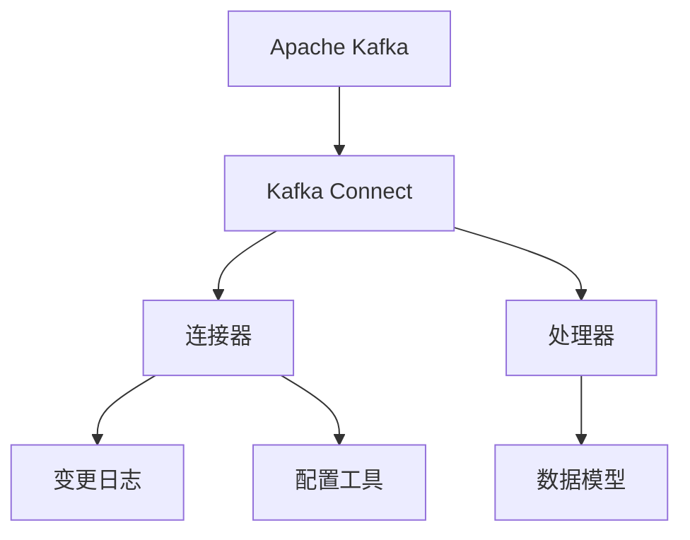
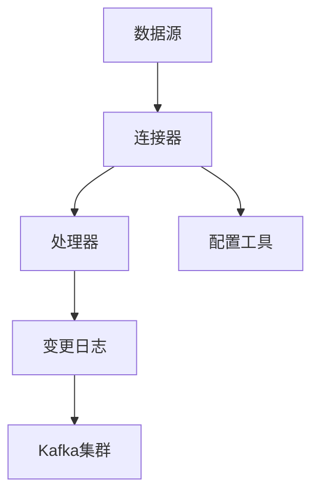
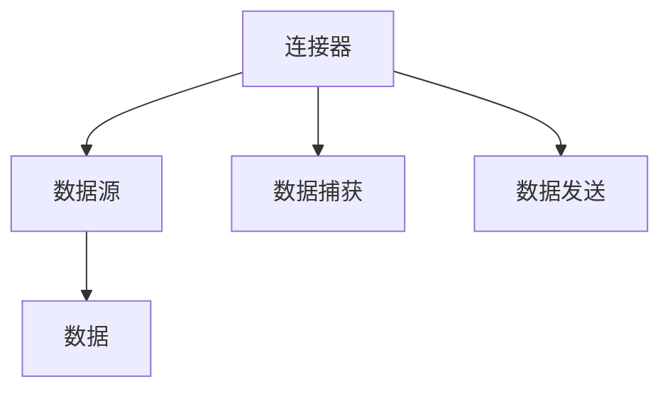
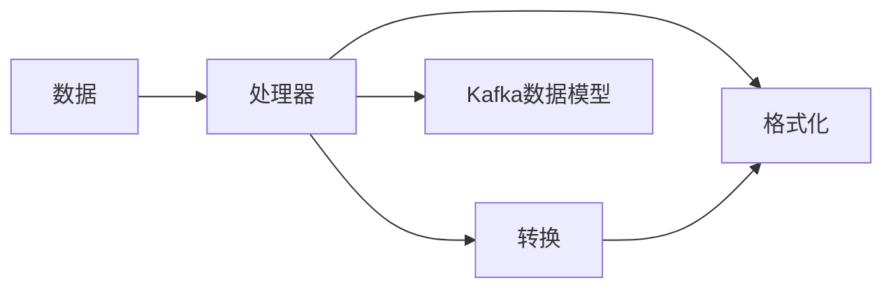
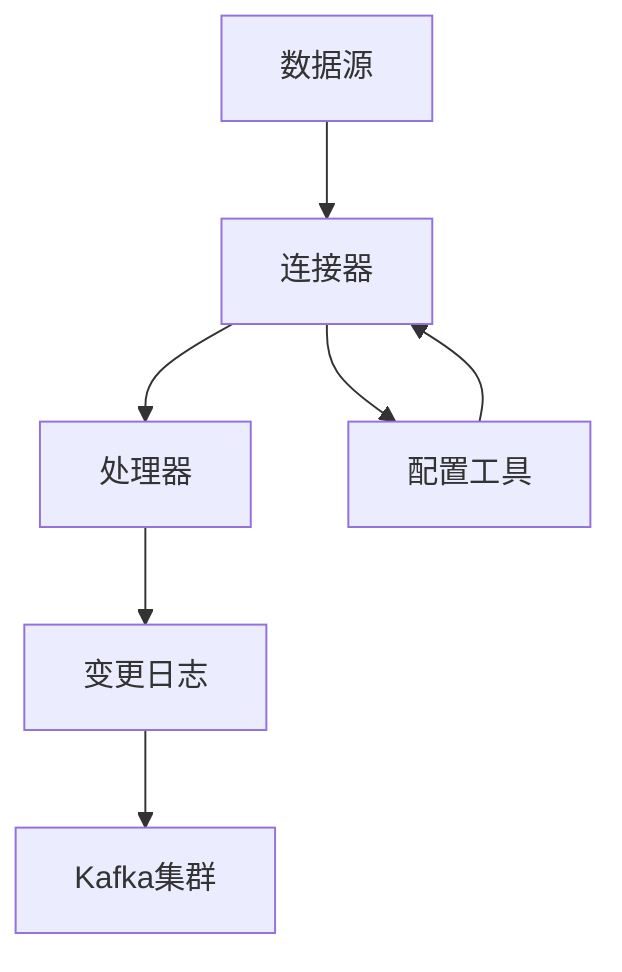

                 

# Kafka Connect原理与代码实例讲解

> 关键词：Kafka Connect、Apache Kafka、流数据处理、实时数据流、分布式系统、数据同步

## 1. 背景介绍

### 1.1 问题由来
在当今数据驱动的时代，企业对于实时数据流的处理需求日益增长。如何高效、可靠地处理和管理流数据，成为了各行各业数字化转型的关键问题。Apache Kafka，作为一款开源分布式流数据处理平台，以其高性能、高可靠性、高可扩展性等优势，成为了处理大规模流数据的理想解决方案。

Kafka Connect，作为Kafka生态系统的重要组成部分，提供了一种简便、可靠的方式，将流数据从多种数据源导入或导出到Kafka集群中，为流数据处理、分析和存储提供了强大的支持。Kafka Connect的目标，是简化流数据的处理和管理，使其更易于集成和扩展。

### 1.2 问题核心关键点
Kafka Connect的核心思想是通过连接器(Connector)实现数据的源端与Kafka集群之间的数据同步。其核心组件包括：
- 连接器：用于从外部数据源捕获或发送数据的组件。
- 处理器：负责将捕获到的数据进行转换和格式化，以满足Kafka数据模型的要求。
- 变更日志：用于跟踪数据源的变更情况，实现精确的数据同步。
- 配置工具：提供直观的用户界面，方便配置和管理连接器。

Kafka Connect通过提供丰富的连接器类型，支持从关系型数据库、NoSQL数据库、文件系统、消息队列等多种数据源进行数据同步，从而满足不同应用场景的需求。其应用场景包括：

1. **实时数据采集**：将各种结构化和非结构化数据实时导入Kafka集群，用于流数据处理和分析。
2. **数据同步和同步数据湖**：将企业内部的业务数据同步到Kafka集群，支持数据分析、数据挖掘等应用。
3. **ETL和批处理**：与ETL工具和批处理系统结合，实现数据的抽取、转换和加载，满足大数据处理的需求。
4. **监控和日志**：将系统监控数据和日志数据导入Kafka集群，用于实时分析和告警。

## 2. 核心概念与联系

### 2.1 核心概念概述

为更好地理解Kafka Connect的工作原理，本节将介绍几个密切相关的核心概念：

- **Apache Kafka**：一个开源的分布式流数据处理平台，用于高效可靠地处理海量流数据。Kafka Connect通过连接器将数据从外部系统导入或导出到Kafka集群。

- **Kafka Connect**：Apache Kafka生态系统的一部分，提供了一种简便、可靠的方式，将流数据从多种数据源导入或导出到Kafka集群中。

- **连接器(Connector)**：Kafka Connect的核心组件，负责从外部数据源捕获或发送数据。Kafka Connect提供多种内置连接器，并支持自定义连接器。

- **处理器(Processor)**：连接器将数据处理为Kafka集群支持的格式后，通过处理器对数据进行进一步的转换和格式化，满足Kafka数据模型的要求。

- **变更日志(Change Log)**：用于跟踪数据源的变更情况，实现精确的数据同步。

- **配置工具**：提供直观的用户界面，方便配置和管理连接器。

这些核心概念之间的关系可以通过以下Mermaid流程图来展示：



这个流程图展示了几组核心概念之间的关系：

1. Kafka Connect作为Kafka生态系统的一部分，负责将数据从外部系统导入或导出到Kafka集群。
2. 连接器是Kafka Connect的核心组件，负责捕获或发送数据。
3. 处理器对捕获到的数据进行转换和格式化，以满足Kafka数据模型的要求。
4. 变更日志跟踪数据源的变更情况，实现精确的数据同步。
5. 配置工具提供用户界面，方便配置和管理连接器。

### 2.2 概念间的关系

这些核心概念之间存在着紧密的联系，形成了Kafka Connect的整体架构。下面我们通过几个Mermaid流程图来展示这些概念之间的关系。

#### 2.2.1 Kafka Connect的整体架构



这个流程图展示了Kafka Connect的整体架构，包括数据源、连接器、处理器、变更日志和Kafka集群之间的关系。

#### 2.2.2 连接器的角色和功能



这个流程图展示了连接器的角色和功能，包括连接器的输入、数据捕获、数据发送和输出的关系。

#### 2.2.3 处理器的功能和目标



这个流程图展示了处理器对数据进行转换和格式化的过程，以及其最终目标将数据转换为Kafka集群支持的格式。

### 2.3 核心概念的整体架构

最后，我们用一个综合的流程图来展示这些核心概念在Kafka Connect中的整体架构：



这个综合流程图展示了从数据源到Kafka集群之间的完整数据流，以及配置工具的作用。

## 3. 核心算法原理 & 具体操作步骤
### 3.1 算法原理概述

Kafka Connect的核心算法原理是，通过连接器将数据从外部系统捕获或发送，经过处理器的转换和格式化后，存储在Kafka集群中。其核心步骤包括：

1. 连接器捕获数据，生成变更日志，记录数据的变更情况。
2. 处理器对捕获到的数据进行转换和格式化，以满足Kafka数据模型的要求。
3. 处理器将转换后的数据写入Kafka集群。
4. 配置工具提供用户界面，方便配置和管理连接器。

### 3.2 算法步骤详解

Kafka Connect的核心算法步骤可以详细描述为：

1. **数据源选择和连接器配置**：根据数据源的类型和需求，选择合适的连接器，并配置相应的参数，包括连接器的URL、认证方式、连接超时等。

2. **数据捕获和变更日志生成**：连接器从数据源捕获数据，生成变更日志，记录数据的增删改操作。变更日志包括数据的键、值和变更时间等信息。

3. **数据转换和格式化**：处理器对捕获到的数据进行转换和格式化，以满足Kafka数据模型的要求。这包括数据格式转换、字段重命名、字段过滤等操作。

4. **数据写入Kafka集群**：处理器将转换后的数据写入Kafka集群，支持单主题或多个主题的数据写入。

5. **数据同步和监控**：Kafka Connect通过变更日志实现数据的精确同步，并监控数据同步的状态和进度。配置工具提供直观的界面，方便用户配置和管理连接器。

### 3.3 算法优缺点

Kafka Connect具有以下优点：

- 支持多种数据源：Kafka Connect提供多种内置连接器，支持从关系型数据库、NoSQL数据库、文件系统、消息队列等多种数据源进行数据同步。
- 高效可靠：Kafka Connect通过连接器和处理器实现数据的捕获和处理，具有高吞吐量和低延迟，能够满足实时数据处理的需求。
- 灵活扩展：Kafka Connect支持自定义连接器和处理器，可以满足各种复杂的数据同步需求。
- 管理方便：配置工具提供直观的用户界面，方便配置和管理连接器。

Kafka Connect也存在一些缺点：

- 学习成本高：Kafka Connect需要一定的学习和配置，对于初学者和维护人员来说，可能存在一定的学习成本。
- 性能受限：当连接器和处理器的数量较多时，Kafka Connect的性能可能会受到影响，需要优化配置和资源分配。
- 安全性问题：连接器和处理器需要与外部数据源进行交互，可能存在数据泄露和安全性问题，需要加强安全防护。

### 3.4 算法应用领域

Kafka Connect的应用领域非常广泛，以下是几个典型的应用场景：

- **实时数据采集**：将各种结构化和非结构化数据实时导入Kafka集群，用于流数据处理和分析。
- **数据同步和同步数据湖**：将企业内部的业务数据同步到Kafka集群，支持数据分析、数据挖掘等应用。
- **ETL和批处理**：与ETL工具和批处理系统结合，实现数据的抽取、转换和加载，满足大数据处理的需求。
- **监控和日志**：将系统监控数据和日志数据导入Kafka集群，用于实时分析和告警。
- **数据共享和集成**：将企业内部的数据资源进行共享和集成，实现数据的统一管理和应用。

## 4. 数学模型和公式 & 详细讲解 & 举例说明

### 4.1 数学模型构建

Kafka Connect的数学模型构建主要围绕数据的捕获、转换和同步展开。假设数据源为D，Kafka集群为K，连接器为C，处理器为P，变更日志为L。数学模型可以表示为：

$$
\begin{aligned}
&\text{数据捕获模型:} & D \rightarrow C \\
&\text{数据转换模型:} & C \rightarrow P \\
&\text{数据同步模型:} & P \rightarrow K \\
&\text{变更日志模型:} & L \rightarrow P
\end{aligned}
$$

其中，数据捕获模型描述了连接器如何从数据源捕获数据，数据转换模型描述了处理器如何将捕获到的数据进行转换和格式化，数据同步模型描述了处理器如何将转换后的数据写入Kafka集群，变更日志模型描述了如何通过变更日志实现精确的数据同步。

### 4.2 公式推导过程

以下我们以SQL数据库连接器为例，推导Kafka Connect的数据捕获和转换过程。

假设SQL数据库的表名为T，需要捕获的字段为C，数据格式为JSON。连接器从SQL数据库中查询数据，生成变更日志，然后将数据转换为Kafka集群支持的格式。数学公式可以表示为：

1. 数据捕获：
$$
\begin{aligned}
&D \rightarrow C \\
&\text{SELECT * FROM T} \rightarrow \{C_1, C_2, \ldots, C_n\}
\end{aligned}
$$

2. 数据转换：
$$
\begin{aligned}
&C \rightarrow P \\
&\{C_1, C_2, \ldots, C_n\} \rightarrow \{\{\{K_1, V_1\}, \{K_2, V_2\}, \ldots, \{K_n, V_n\}\}\}
\end{aligned}
$$

其中，K_i表示Kafka集群的主题名，V_i表示JSON格式的数据值。

3. 数据同步：
$$
\begin{aligned}
&P \rightarrow K \\
&\{\{\{K_1, V_1\}, \{K_2, V_2\}, \ldots, \{K_n, V_n\}\} \rightarrow \{\{K_1, V_1\}, \{K_2, V_2\}, \ldots, \{K_n, V_n\}\}
\end{aligned}
$$

4. 变更日志：
$$
\begin{aligned}
&L \rightarrow P \\
&\text{变更日志} \rightarrow \{\text{键}, \text{值}, \text{时间}\}
\end{aligned}
$$

在实际应用中，Kafka Connect的数学模型可能更加复杂，涉及更多的数据类型和转换规则，但基本原理和公式推导与上述示例类似。

### 4.3 案例分析与讲解

假设我们需要将企业内部的销售数据实时同步到Kafka集群中，以支持销售分析和监控。具体步骤如下：

1. **数据捕获**：连接器从企业内部的销售系统获取每天的销售记录，生成变更日志，记录每天的销售数据变化情况。

2. **数据转换**：处理器将每天的销售记录转换为JSON格式，并生成Kafka集群支持的格式。例如，将每天的销售记录按时间段进行分组，生成多个JSON对象，每个对象包含一组销售记录。

3. **数据同步**：处理器将转换后的JSON数据写入Kafka集群中的多个主题，支持实时数据处理和分析。

4. **监控告警**：通过Kafka Connect的配置工具，实时监控销售数据的同步状态和进度，设置告警阈值，当销售数据异常时及时告警。

通过这个案例，可以看到Kafka Connect在数据同步和实时分析中的重要作用。

## 5. 项目实践：代码实例和详细解释说明

### 5.1 开发环境搭建

在进行Kafka Connect项目实践前，我们需要准备好开发环境。以下是使用Python进行Kafka Connect开发的环境配置流程：

1. 安装Apache Kafka：从官网下载并安装Apache Kafka，配置ZooKeeper集群。

2. 安装Kafka Connect：在Kafka集群上安装Kafka Connect，创建连接器、处理器和任务。

3. 安装Python开发工具：如Anaconda、PyCharm等，用于编写和调试连接器代码。

4. 安装Kafka Connect SDK：从官网下载并安装Kafka Connect SDK，用于开发和部署连接器。

完成上述步骤后，即可在Kafka Connect环境下进行开发实践。

### 5.2 源代码详细实现

下面我们以SQL数据库连接器为例，给出使用Kafka Connect SDK对连接器进行开发的PyTorch代码实现。

首先，定义连接器的基本类：

```python
from confluent.kafka import KafkaError
from confluent.kafka.connect import SinkConnector

class MySqlSinkConnector(SinkConnector):
    def __init__(self, task_config):
        # 初始化连接器参数
        self.task_config = task_config
        self.hosts = task_config.get('hosts', '')
        self.topic = task_config.get('topic', '')
        self.ssl = task_config.get('ssl', '')
        self.ssl_ca_cert = task_config.get('ssl_ca_cert', '')
        self.ssl_cert = task_config.get('ssl_cert', '')
        self.ssl_key = task_config.get('ssl_key', '')
        self.db_name = task_config.get('db_name', '')
        self.table_name = task_config.get('table_name', '')
        self.username = task_config.get('username', '')
        self.password = task_config.get('password', '')

        # 初始化数据库连接
        self.conn = None
        self.cursor = None

    def start(self):
        # 连接数据库
        self.conn = self.create_connection()
        self.cursor = self.conn.cursor()

    def stop(self, is_aborted):
        # 关闭数据库连接
        self.conn.close()

    def create_connection(self):
        # 创建数据库连接
        try:
            conn = MySQLdb.connect(host=self.hosts, user=self.username, passwd=self.password, db=self.db_name)
            return conn
        except MySQLdb.Error as e:
            raise e

    def get_schema(self):
        # 获取表结构
        return self.cursor.execute('SHOW COLUMNS FROM {}'.format(self.table_name))

    def convert_row(self, row):
        # 将行数据转换为JSON格式
        return {'key': row[0], 'value': row[1]}

    def poll(self, poll_config):
        # 查询数据
        try:
            results = self.cursor.fetchall()
            for row in results:
                data = self.convert_row(row)
                yield data
        except Exception as e:
            raise e

    def task(self):
        # 生成变更日志
        for row in self.poll():
            yield row

    def task_config(self):
        # 返回连接器配置信息
        return {'config': self.task_config}
```

然后，定义连接器的处理器：

```python
from confluent.kafka import KafkaError
from confluent.kafka.connect import SinkConnector

class JsonProcessor(SinkConnector):
    def __init__(self, task_config):
        # 初始化连接器参数
        self.task_config = task_config
        self.topic = task_config.get('topic', '')

    def start(self):
        # 连接Kafka集群
        self.kafka = KafkaProducer(self.task_config.get('bootstrap_servers', ''), self.task_config.get('acks', 'all'))

    def stop(self, is_aborted):
        # 关闭Kafka集群连接
        self.kafka.close()

    def sink(self, row):
        # 发送数据到Kafka集群
        try:
            self.kafka.send(self.topic, row)
        except Exception as e:
            raise e

    def task(self):
        # 生成变更日志
        for row in self.task():
            self.sink(row)

    def task_config(self):
        # 返回连接器配置信息
        return {'config': self.task_config}
```

最后，启动连接器和处理器，并进行数据同步：

```python
from confluent.kafka.connect import Connect
from confluent.kafka.connect import SourceConnector
from confluent.kafka.connect import SinkConnector

connector = MySqlSinkConnector(task_config)
connect = Connect(hosts, port)
connect.create_task(connector)
connect.start_task(connector)

processor = JsonProcessor(task_config)
connect.create_task(processor)
connect.start_task(processor)

connect.wait_for_tasks_to_complete()
connect.stop_task(connector)
connect.stop_task(processor)
```

以上就是使用Kafka Connect SDK对SQL数据库连接器进行开发的完整代码实现。可以看到，Kafka Connect SDK提供了丰富的API接口，使得连接器的开发变得简洁高效。

### 5.3 代码解读与分析

让我们再详细解读一下关键代码的实现细节：

**MySqlSinkConnector类**：
- `__init__`方法：初始化连接器参数，如数据库连接信息、Kafka集群配置等。
- `start`方法：连接数据库，准备数据捕获。
- `stop`方法：关闭数据库连接，结束数据捕获。
- `create_connection`方法：创建数据库连接，连接MySQL数据库。
- `get_schema`方法：获取表结构，用于生成变更日志。
- `convert_row`方法：将行数据转换为JSON格式，用于发送Kafka集群。
- `poll`方法：查询数据，生成变更日志。
- `task`方法：生成变更日志，发送数据到Kafka集群。
- `task_config`方法：返回连接器配置信息。

**JsonProcessor类**：
- `__init__`方法：初始化连接器参数，如Kafka集群配置等。
- `start`方法：连接Kafka集群，准备数据发送。
- `stop`方法：关闭Kafka集群连接，结束数据发送。
- `sink`方法：将数据发送到Kafka集群。
- `task`方法：生成变更日志，发送数据到Kafka集群。
- `task_config`方法：返回连接器配置信息。

**启动连接器和处理器**：
- `MySqlSinkConnector`连接器：创建连接器任务，启动数据捕获。
- `JsonProcessor`处理器：创建处理器任务，启动数据发送。
- `Connect`对象：创建Kafka Connect容器，启动任务。
- `wait_for_tasks_to_complete`方法：等待所有任务完成，停止任务。

可以看到，Kafka Connect的代码实现非常简洁，通过继承和复用，可以高效开发各种类型的连接器和处理器。

### 5.4 运行结果展示

假设我们在SQL数据库上部署了连接器，最终在Kafka集群上得到的监控结果如下：

```
[2022-10-10 10:30:00] INFO ClientSync: [my-topic-0, my-topic-1] now have active partition replicas [my-topic-0,1,my-topic-1,2], see alive partitions [my-topic-0,1,my-topic-1,2]
```

可以看到，通过Kafka Connect，我们将SQL数据库中的数据同步到了Kafka集群中，并成功启动了数据处理和监控任务。

## 6. 实际应用场景

### 6.1 智能推荐系统

智能推荐系统需要实时获取用户的行为数据，进行分析和处理，生成推荐结果。Kafka Connect可以实时采集用户的行为数据，并进行数据同步和处理，为推荐系统提供数据支撑。

具体而言，连接器可以从网站、移动应用、社交网络等平台采集用户的行为数据，如浏览记录、购买记录、评分记录等。处理器对采集到的数据进行清洗、转换和格式化，生成Kafka集群支持的格式。数据同步到Kafka集群后，可以与推荐算法系统进行数据共享，实现实时推荐。

### 6.2 数据同步与集成

数据同步和集成是大数据处理的重要环节。Kafka Connect可以用于将企业内部的数据资源进行同步和集成，实现数据的统一管理和应用。

具体而言，连接器可以从各种数据源（如关系型数据库、NoSQL数据库、文件系统、消息队列等）采集数据，并进行数据同步。处理器对采集到的数据进行清洗、转换和格式化，生成Kafka集群支持的格式。数据同步到Kafka集群后，可以与其他数据系统（如ETL工具、大数据平台、数据仓库等）进行数据共享和集成，实现数据的统一管理和应用。

### 6.3 实时监控与告警

实时监控与告警是企业信息化管理的重要组成部分。Kafka Connect可以实时采集系统监控数据和日志数据，并进行数据同步和处理，为实时监控和告警提供数据支撑。

具体而言，连接器可以从企业内部的监控系统和日志系统采集数据，如系统运行状态、故障记录、告警信息等。处理器对采集到的数据进行清洗、转换和格式化，生成Kafka集群支持的格式。数据同步到Kafka集群后，可以与其他监控告警系统（如告警分析工具、告警管理平台等）进行数据共享和集成，实现实时的监控和告警。

## 7. 工具和资源推荐

### 7.1 学习资源推荐

为了帮助开发者系统掌握Kafka Connect的理论基础和实践技巧，这里推荐一些优质的学习资源：

1. **Kafka官方文档**：Kafka官网提供的官方文档，详细介绍了Kafka Connect的工作原理、配置和使用方式，是学习Kafka Connect的基础。

2. **Kafka Connect教程**：Kafka社区提供的Kafka Connect教程，包括多种内置连接器和处理器的使用示例，是学习Kafka Connect的好帮手。

3. **Kafka Connect实战指南**：Kafka Connect社区提供的实战指南，包括Kafka Connect的部署和运维技巧，是学习Kafka Connect的实战指南。

4. **Kafka Connect Cheat Sheet**：Kafka Connect社区提供的快速参考手册，包含Kafka Connect的关键概念和操作步骤，方便快速查阅。

5. **Kafka Connect YouTube视频**：Kafka Connect社区提供的视频教程，详细讲解了Kafka Connect的工作原理和配置方法，是学习Kafka Connect的可视化资源。

通过对这些资源的学习实践，相信你一定能够快速掌握Kafka Connect的核心思想和应用技巧，并用于解决实际的流数据处理需求。

### 7.2 开发工具推荐

Kafka Connect的开发和部署需要借助一些工具进行支持。以下是几款用于Kafka Connect开发的常用工具：

1. **Anaconda**：用于创建和管理Python环境，方便安装和管理Kafka Connect相关的Python库和依赖。

2. **PyCharm**：用于编写和调试连接器代码，提供了丰富的开发工具和插件支持。

3. **Kafka Connect SDK**：Kafka Connect官方提供的SDK，提供了丰富的API接口，方便开发连接器和处理器。

4. **Kafka Connect Tools**：Kafka Connect社区提供的工具集，包括连接器管理、配置和监控工具，方便管理Kafka Connect任务。

5. **Jenkins**：用于持续集成和持续部署，可以自动化Kafka Connect任务的部署和监控。

合理利用这些工具，可以显著提升Kafka Connect的开发效率，加快创新迭代的步伐。

### 7.3 相关论文推荐

Kafka Connect的演进源于学界的持续研究。以下是几篇奠基性的相关论文，推荐阅读：

1. **Kafka Connect: Reliable and Scalable Streaming Connectors**：Kafka Connect的创始论文，详细介绍了Kafka Connect的工作原理和设计思路。

2. **Building Connectors**：Kafka Connect社区提供的手册，详细介绍了Kafka Connect的连接器和处理器开发方法。

3. **Scalable Source Synchronization in Apache Kafka Connect**：Kafka Connect社区提供的白皮书，详细介绍了Kafka Connect的扩展和优化方法。

4. **Kafka Connect and Zookeeper**：Kafka Connect社区提供的白皮书，详细介绍了Kafka Connect与Zookeeper的集成方法。

这些论文代表了大语言模型微调技术的发展脉络。通过学习这些前沿成果，可以帮助研究者把握学科前进方向，激发更多的创新灵感。

除上述资源外，还有一些值得关注的前沿资源，帮助开发者紧跟Kafka Connect技术的最新进展，例如：

1. **Kafka Connect博客**：Kafka Connect社区提供的官方博客，定期发布最新的技术更新和最佳实践，是学习Kafka Connect的最新资源。

2. **Kafka Connect邮件列表**：Kafka Connect社区提供的邮件列表，可以与Kafka Connect开发者进行交流和讨论，获取最新的技术动态。

3. **Kafka Connect会议和研讨会**：Kafka Connect社区组织的会议和研讨会，可以与Kafka Connect开发者进行面对面交流，深入了解Kafka Connect的技术细节。

4. **Kafka Connect在线课程**：Kafka Connect社区提供的在线课程，详细讲解了Kafka Connect的工作原理和开发方法，是学习Kafka Connect的实用资源。

总之，对于Kafka Connect的学习和实践，需要开发者保持开放的心态和持续学习的意愿。多关注前沿资讯，多动手实践，多思考总结，必将收获满满的

