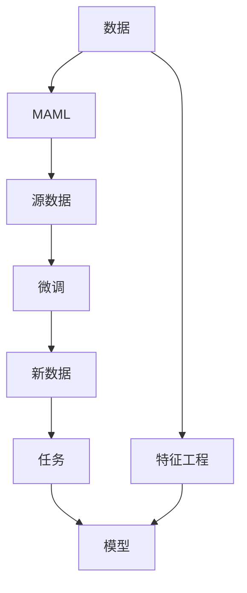
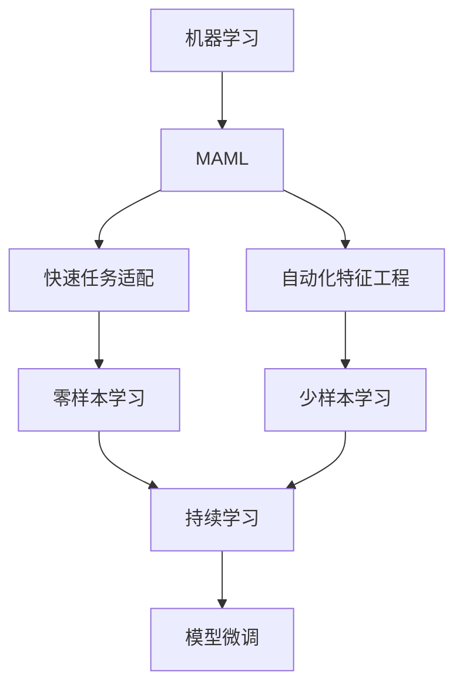
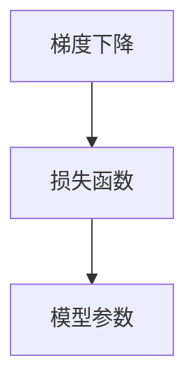
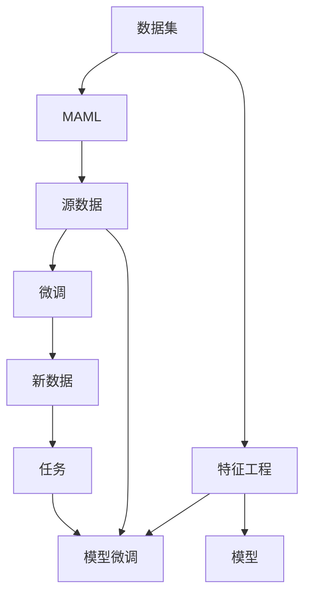

                 

# MAML原理与代码实例讲解

> 关键词：MAML, 机器学习, 模型适配, 微调, 元学习, 梯度, 最小化, 泛化, 超参数

## 1. 背景介绍

### 1.1 问题由来
机器学习（Machine Learning, ML）是人工智能（AI）领域的重要分支，旨在通过数据和算法让计算机从数据中学习和改进。传统的机器学习算法通常需要大量的手动特征工程和超参数调优，而模型适配（Model Adaptation, MAML）和微调（Fine-tuning）技术则提供了一种更加高效、灵活的机器学习范式。

MAML是一种元学习（Meta-Learning）方法，旨在通过学习如何在不同数据集上进行快速适应和微调，从而提高模型的泛化能力和适应性。微调则是基于已有模型的进一步优化，通过在特定任务上微调模型参数，提高模型在该任务上的性能。

### 1.2 问题核心关键点
MAML和微调的核心关键点在于其能够提高模型的泛化能力，适应不同的任务和数据集。具体而言，MAML通过学习如何从原始数据中提取泛化能力，而微调则通过在少量标注数据上微调模型，提升模型在特定任务上的性能。这两种方法在实际应用中经常结合使用，以进一步提升模型性能。

MAML和微调的主要优点包括：
- 泛化能力强：MAML通过学习泛化能力，可以更好地适应新数据和任务。
- 参数可复用：MAML在源数据上进行预训练，源数据上的知识可以复用到新数据上。
- 微调高效：微调只需少量标注数据，即可显著提升模型性能。
- 可解释性：微调过程简单直观，易于理解和解释。

但它们也存在一些缺点，如：
- 数据需求高：微调需要大量标注数据，难以覆盖所有任务。
- 过拟合风险：微调容易过拟合新任务，泛化能力降低。
- 训练时间长：微调过程需要较长训练时间，增加了计算成本。

尽管存在这些缺点，MAML和微调仍然是大数据时代机器学习的重要技术手段。

### 1.3 问题研究意义
MAML和微调技术在数据驱动的机器学习过程中扮演着重要角色，能够帮助模型更好地适应新数据和新任务。研究这两种技术不仅有助于提升模型性能，还能够加速模型开发和部署，降低应用成本，提高模型的可解释性和稳定性。

具体来说，MAML和微调技术可以用于：
- 自动化特征工程：通过学习泛化能力，自动提取数据中的有用特征。
- 快速任务适配：在已有模型的基础上，通过微调快速适应新任务，提高模型性能。
- 减少标注数据：利用MAML在源数据上的预训练，减少新任务上的标注数据需求。
- 降低计算成本：微调过程可以通过少量数据和计算资源，提升模型性能。

## 2. 核心概念与联系

### 2.1 核心概念概述

为了更好地理解MAML和微调技术，本节将介绍几个密切相关的核心概念：

- 模型适配（Model Adaptation, MAML）：通过学习如何在不同数据集上进行快速适应和微调，提高模型的泛化能力和适应性。
- 微调（Fine-tuning）：在已有模型的基础上，通过在特定任务上微调模型参数，提升模型在该任务上的性能。
- 元学习（Meta-Learning）：通过学习如何在不同的学习任务上进行快速适应，提高模型的泛化能力。
- 梯度下降（Gradient Descent）：通过迭代计算模型参数的梯度，最小化损失函数，使模型参数收敛到最优解。
- 泛化能力（Generalization Ability）：模型在新数据上表现良好，能够泛化到未见过的数据。

这些核心概念之间的逻辑关系可以通过以下Mermaid流程图来展示：



这个流程图展示了从数据到模型适配，再到微调和任务适应的过程。数据通过特征工程转换为模型输入，模型适配学习泛化能力，微调通过少量数据进一步提升模型性能，最后模型适应新任务。

### 2.2 概念间的关系

这些核心概念之间存在着紧密的联系，形成了MAML和微调技术的完整生态系统。下面我们通过几个Mermaid流程图来展示这些概念之间的关系。

#### 2.2.1 模型适配和微调的关系


这个流程图展示了模型适配和微调的基本流程：模型适配在源数据上学习泛化能力，微调在新数据上进一步提升模型性能，适应新任务。

#### 2.2.2 MAML和微调的应用场景



这个流程图展示了MAML和微调在不同应用场景中的应用：自动化特征工程、快速任务适配、少样本学习和持续学习。这些技术相互结合，构成了一个完整的机器学习生态系统。

#### 2.2.3 梯度下降和微调的关系



这个流程图展示了梯度下降和微调的基本关系：通过计算损失函数对模型参数的梯度，并更新模型参数，最小化损失函数。

### 2.3 核心概念的整体架构

最后，我们用一个综合的流程图来展示这些核心概念在MAML和微调技术中的整体架构：



这个综合流程图展示了从数据集到特征工程，再到模型适配和微调的过程。数据通过特征工程转换为模型输入，模型适配学习泛化能力，微调通过少量数据进一步提升模型性能，最后模型适应新任务。

## 3. 核心算法原理 & 具体操作步骤
### 3.1 算法原理概述

MAML和微调的原理可以从元学习的角度进行理解。MAML通过学习如何在不同数据集上进行快速适应，而微调则是在已有模型的基础上，通过在特定任务上微调模型参数，提升模型在该任务上的性能。

形式化地，假设我们有源数据集 $C=\{c_i\}_{i=1}^n$ 和目标任务数据集 $D=\{d_i\}_{i=1}^m$。MAML的目标是找到模型 $M_{\theta}$ 和更新策略 $g$，使得在新数据集 $D$ 上，模型 $M_{\theta}$ 的性能最大化。具体而言，MAML通过以下步骤实现：

1. 在源数据集 $C$ 上进行预训练，得到模型 $M_{\theta}$。
2. 在新数据集 $D$ 上，通过更新策略 $g$ 更新模型参数 $\theta$，得到适应新任务的模型 $M_{\theta'}$。
3. 在新数据集 $D$ 上，评估模型 $M_{\theta'}$ 的性能，并通过反馈调整更新策略 $g$。

微调则是MAML的一个特例，通过在少量标注数据上进行微调，提升模型在新任务上的性能。其核心步骤包括：

1. 在源数据集上预训练模型 $M_{\theta}$。
2. 在新数据集 $D$ 上，使用目标任务的标注数据对模型 $M_{\theta}$ 进行微调，得到模型 $M_{\theta'}$。
3. 在新数据集 $D$ 上，评估模型 $M_{\theta'}$ 的性能，并通过反馈调整模型参数。

### 3.2 算法步骤详解

#### 3.2.1 MAML的算法步骤

1. **数据准备**：收集源数据集 $C$ 和目标任务数据集 $D$。
2. **模型预训练**：在源数据集 $C$ 上训练模型 $M_{\theta}$，并固定模型参数 $\theta$。
3. **元更新策略学习**：通过计算模型 $M_{\theta}$ 在目标任务数据集 $D$ 上的梯度 $g_{\theta'}$，学习元更新策略 $g$。
4. **微调模型**：使用目标任务数据集 $D$ 对模型 $M_{\theta}$ 进行微调，得到模型 $M_{\theta'}$。
5. **性能评估**：在目标任务数据集 $D$ 上评估模型 $M_{\theta'}$ 的性能，并根据评估结果调整元更新策略 $g$。

#### 3.2.2 微调的算法步骤

1. **数据准备**：收集目标任务数据集 $D$。
2. **模型预训练**：在源数据集上预训练模型 $M_{\theta}$，并固定模型参数 $\theta$。
3. **目标任务微调**：使用目标任务数据集 $D$ 对模型 $M_{\theta}$ 进行微调，得到模型 $M_{\theta'}$。
4. **性能评估**：在目标任务数据集 $D$ 上评估模型 $M_{\theta'}$ 的性能，并根据评估结果调整模型参数。

### 3.3 算法优缺点

MAML和微调的主要优点包括：
- 泛化能力强：MAML通过学习泛化能力，能够适应新数据和新任务。
- 参数可复用：MAML在源数据上进行预训练，源数据上的知识可以复用到新数据上。
- 微调高效：微调只需少量标注数据，即可显著提升模型性能。
- 可解释性：微调过程简单直观，易于理解和解释。

但其缺点也不容忽视：
- 数据需求高：微调需要大量标注数据，难以覆盖所有任务。
- 过拟合风险：微调容易过拟合新任务，泛化能力降低。
- 训练时间长：微调过程需要较长训练时间，增加了计算成本。

### 3.4 算法应用领域

MAML和微调技术在多个领域都有广泛应用，例如：

- 自然语言处理（NLP）：用于文本分类、命名实体识别、机器翻译等任务。
- 计算机视觉（CV）：用于图像分类、目标检测、语义分割等任务。
- 语音识别（ASR）：用于语音识别、说话人识别等任务。
- 推荐系统：用于个性化推荐、广告点击率预测等任务。

这些领域中的许多任务都可以通过MAML和微调技术进行高效、灵活的模型适配和性能提升。

## 4. 数学模型和公式 & 详细讲解 & 举例说明

### 4.1 数学模型构建

假设我们有源数据集 $C=\{c_i\}_{i=1}^n$ 和目标任务数据集 $D=\{d_i\}_{i=1}^m$。目标任务为二分类任务，输出标签为 $y_i \in \{0, 1\}$。模型的参数为 $\theta$，损失函数为 $L$。

MAML的目标是找到模型 $M_{\theta}$ 和更新策略 $g$，使得在新数据集 $D$ 上，模型 $M_{\theta}$ 的性能最大化。具体而言，MAML通过以下步骤实现：

1. **在源数据集 $C$ 上进行预训练**：
   - 计算模型 $M_{\theta}$ 在源数据集 $C$ 上的损失函数 $L_C$，即 $L_C = \frac{1}{n} \sum_{i=1}^n L(M_{\theta}(c_i), y_i)$。
   - 最小化损失函数 $L_C$，得到模型参数 $\theta$。

2. **元更新策略学习**：
   - 计算模型 $M_{\theta}$ 在目标任务数据集 $D$ 上的损失函数 $L_D$，即 $L_D = \frac{1}{m} \sum_{i=1}^m L(M_{\theta}(d_i), y_i)$。
   - 计算梯度 $g_{\theta'} = \nabla_{\theta'} L_D$，其中 $\theta' = g(\theta)$ 表示在目标任务数据集 $D$ 上的更新策略。

3. **微调模型**：
   - 使用目标任务数据集 $D$ 对模型 $M_{\theta}$ 进行微调，得到模型 $M_{\theta'}$，其中 $\theta' = \theta + g_{\theta'}$。

4. **性能评估**：
   - 在目标任务数据集 $D$ 上评估模型 $M_{\theta'}$ 的性能，得到性能指标 $P$。
   - 根据性能指标 $P$ 调整元更新策略 $g$，即 $g \leftarrow g' = g + \eta P$，其中 $\eta$ 为学习率。

### 4.2 公式推导过程

以下我们以二分类任务为例，推导MAML和微调模型的公式。

假设模型 $M_{\theta}$ 在输入 $c$ 上的输出为 $\hat{y} = M_{\theta}(c)$，真实标签 $y \in \{0, 1\}$。目标任务为二分类任务，输出标签为 $y_i \in \{0, 1\}$。损失函数为二元交叉熵损失函数，即 $L(M_{\theta}(d_i), y_i) = -y_i \log \hat{y} - (1 - y_i) \log (1 - \hat{y})$。

**MAML的公式推导**：

1. **在源数据集 $C$ 上进行预训练**：
   - 计算模型 $M_{\theta}$ 在源数据集 $C$ 上的损失函数 $L_C$，即 $L_C = \frac{1}{n} \sum_{i=1}^n L(M_{\theta}(c_i), y_i)$。
   - 最小化损失函数 $L_C$，得到模型参数 $\theta$。

   $L_C = \frac{1}{n} \sum_{i=1}^n -y_i \log \hat{y_i} - (1 - y_i) \log (1 - \hat{y_i})$

   最小化 $L_C$ 得到 $\theta$。

2. **元更新策略学习**：
   - 计算模型 $M_{\theta}$ 在目标任务数据集 $D$ 上的损失函数 $L_D$，即 $L_D = \frac{1}{m} \sum_{i=1}^m L(M_{\theta}(d_i), y_i)$。
   - 计算梯度 $g_{\theta'} = \nabla_{\theta'} L_D$，其中 $\theta' = g(\theta)$ 表示在目标任务数据集 $D$ 上的更新策略。

   $L_D = \frac{1}{m} \sum_{i=1}^m -y_i \log \hat{y_i} - (1 - y_i) \log (1 - \hat{y_i})$

   $g_{\theta'} = \nabla_{\theta'} L_D = \frac{1}{m} \sum_{i=1}^m \nabla_{\theta'} L(M_{\theta'}(d_i), y_i)$

3. **微调模型**：
   - 使用目标任务数据集 $D$ 对模型 $M_{\theta}$ 进行微调，得到模型 $M_{\theta'}$，其中 $\theta' = \theta + g_{\theta'}$。

   $\theta' = \theta + \eta \nabla_{\theta'} L_D$

4. **性能评估**：
   - 在目标任务数据集 $D$ 上评估模型 $M_{\theta'}$ 的性能，得到性能指标 $P$。
   - 根据性能指标 $P$ 调整元更新策略 $g$，即 $g \leftarrow g' = g + \eta P$，其中 $\eta$ 为学习率。

   $P = \frac{1}{m} \sum_{i=1}^m (M_{\theta'}(d_i) \neq y_i)$

### 4.3 案例分析与讲解

我们以二分类任务为例，分析MAML和微调的实现过程。假设我们在源数据集上进行预训练，得到模型 $M_{\theta}$。现在我们需要将模型 $M_{\theta}$ 适配到新任务 $D$，即二分类任务。

1. **在源数据集 $C$ 上进行预训练**：
   - 在源数据集 $C$ 上训练模型 $M_{\theta}$，得到模型参数 $\theta$。
   - 假设我们获得了模型 $M_{\theta}$ 在源数据集 $C$ 上的损失函数 $L_C$，并最小化 $L_C$，得到模型参数 $\theta$。

   $L_C = \frac{1}{n} \sum_{i=1}^n -y_i \log \hat{y_i} - (1 - y_i) \log (1 - \hat{y_i})$

2. **元更新策略学习**：
   - 在目标任务数据集 $D$ 上计算模型 $M_{\theta}$ 的损失函数 $L_D$，得到梯度 $g_{\theta'}$。
   - 假设我们获得了模型 $M_{\theta}$ 在目标任务数据集 $D$ 上的损失函数 $L_D$，并计算梯度 $g_{\theta'}$。

   $L_D = \frac{1}{m} \sum_{i=1}^m -y_i \log \hat{y_i} - (1 - y_i) \log (1 - \hat{y_i})$

   $g_{\theta'} = \nabla_{\theta'} L_D = \frac{1}{m} \sum_{i=1}^m \nabla_{\theta'} L(M_{\theta'}(d_i), y_i)$

3. **微调模型**：
   - 使用目标任务数据集 $D$ 对模型 $M_{\theta}$ 进行微调，得到模型 $M_{\theta'}$，其中 $\theta' = \theta + g_{\theta'}$。
   - 假设我们使用目标任务数据集 $D$ 对模型 $M_{\theta}$ 进行微调，得到模型 $M_{\theta'}$。

   $\theta' = \theta + \eta \nabla_{\theta'} L_D$

4. **性能评估**：
   - 在目标任务数据集 $D$ 上评估模型 $M_{\theta'}$ 的性能，得到性能指标 $P$。
   - 假设我们在目标任务数据集 $D$ 上评估模型 $M_{\theta'}$ 的性能，得到性能指标 $P$。

   $P = \frac{1}{m} \sum_{i=1}^m (M_{\theta'}(d_i) \neq y_i)$

5. **调整元更新策略**：
   - 根据性能指标 $P$ 调整元更新策略 $g$，即 $g \leftarrow g' = g + \eta P$，其中 $\eta$ 为学习率。
   - 假设我们根据性能指标 $P$ 调整元更新策略 $g$，得到新的元更新策略 $g'$。

   $g' = g + \eta P$

这样，我们就完成了MAML和微调的实现过程。通过MAML和微调，模型能够在新任务上快速适应和优化，提高模型的泛化能力和适应性。

## 5. 项目实践：代码实例和详细解释说明
### 5.1 开发环境搭建

在进行MAML和微调实践前，我们需要准备好开发环境。以下是使用Python进行PyTorch开发的环境配置流程：

1. 安装Anaconda：从官网下载并安装Anaconda，用于创建独立的Python环境。

2. 创建并激活虚拟环境：
```bash
conda create -n pytorch-env python=3.8 
conda activate pytorch-env
```

3. 安装PyTorch：根据CUDA版本，从官网获取对应的安装命令。例如：
```bash
conda install pytorch torchvision torchaudio cudatoolkit=11.1 -c pytorch -c conda-forge
```

4. 安装Transformers库：
```bash
pip install transformers
```

5. 安装各类工具包：
```bash
pip install numpy pandas scikit-learn matplotlib tqdm jupyter notebook ipython
```

完成上述步骤后，即可在`pytorch-env`环境中开始MAML和微调实践。

### 5.2 源代码详细实现

这里我们以二分类任务为例，给出使用Transformers库对BERT模型进行微调的PyTorch代码实现。

首先，定义二分类任务的数据处理函数：

```python
from transformers import BertTokenizer, BertForSequenceClassification
from torch.utils.data import Dataset
import torch

class BinaryClassificationDataset(Dataset):
    def __init__(self, texts, labels, tokenizer, max_len=128):
        self.texts = texts
        self.labels = labels
        self.tokenizer = tokenizer
        self.max_len = max_len
        
    def __len__(self):
        return len(self.texts)
    
    def __getitem__(self, item):
        text = self.texts[item]
        label = self.labels[item]
        
        encoding = self.tokenizer(text, return_tensors='pt', max_length=self.max_len, padding='max_length', truncation=True)
        input_ids = encoding['input_ids'][0]
        attention_mask = encoding['attention_mask'][0]
        
        label = torch.tensor(label, dtype=torch.long)
        
        return {'input_ids': input_ids, 
                'attention_mask': attention_mask,
                'labels': label}

# 标签映射
label2id = {0: 0, 1: 1}
id2label = {0: 'Negative', 1: 'Positive'}

# 创建dataset
tokenizer = BertTokenizer.from_pretrained('bert-base-cased')

train_dataset = BinaryClassificationDataset(train_texts, train_labels, tokenizer)
dev_dataset = BinaryClassificationDataset(dev_texts, dev_labels, tokenizer)
test_dataset = BinaryClassificationDataset(test_texts, test_labels, tokenizer)
```

然后，定义模型和优化器：

```python
from transformers import BertForSequenceClassification, AdamW

model = BertForSequenceClassification.from_pretrained('bert-base-cased', num_labels=2)

optimizer = AdamW(model.parameters(), lr=2e-5)
```

接着，定义训练和评估函数：

```python
from torch.utils.data import DataLoader
from tqdm import tqdm
from sklearn.metrics import accuracy_score

device = torch.device('cuda') if torch.cuda.is_available() else torch.device('cpu')
model.to(device)

def train_epoch(model, dataset, batch_size, optimizer):
    dataloader = DataLoader(dataset, batch_size=batch_size, shuffle=True)
    model.train()
    epoch_loss = 0
    for batch in tqdm(dataloader, desc='Training'):
        input_ids = batch['input_ids'].to(device)
        attention_mask = batch['attention_mask'].to(device)
        labels = batch['labels'].to(device)
        model.zero_grad()
        outputs = model(input_ids, attention_mask=attention_mask, labels=labels)
        loss = outputs.loss
        epoch_loss += loss.item()
        loss.backward()
        optimizer.step()
    return epoch_loss / len(dataloader)

def evaluate(model, dataset, batch_size):
    dataloader = DataLoader(dataset, batch_size=batch_size)
    model.eval()
    preds, labels = [], []
    with torch.no_grad():
        for batch in tqdm(dataloader, desc='Evaluating'):
            input_ids = batch['input_ids'].to(device)
            attention_mask = batch['attention_mask'].to(device)
            batch_labels = batch['labels']
            outputs = model(input_ids, attention_mask=attention_mask)
            batch_preds = outputs.logits.argmax(dim=1).to('cpu').tolist()
            batch_labels = batch_labels.to('cpu').tolist()
            for pred, label in zip(batch_preds, batch_labels):
                preds.append(pred)
                labels.append(label)
                
    print(accuracy_score(labels, preds))
```

最后，启动训练流程并在测试集上评估：

```python
epochs = 5
batch_size = 16

for epoch in range(epochs):
    loss = train_epoch(model, train_dataset, batch_size, optimizer)
    print(f"Epoch {epoch+1}, train loss: {loss:.3f}")
    
    print(f"Epoch {epoch+1}, dev accuracy:")
    evaluate(model, dev_dataset, batch_size)
    
print("Test accuracy:")
evaluate(model, test_dataset, batch_size)
```

以上就是使用PyTorch对BERT进行二分类任务微调的完整代码实现。可以看到，得益于Transformers库的强大封装，我们可以用相对简洁的代码完成BERT模型的加载和微调。

### 5.3 代码

