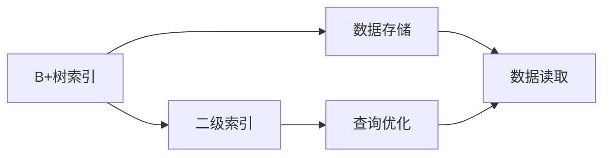

                 

# Phoenix二级索引原理与代码实例讲解

> 关键词：Phoenix, 二级索引, B+树, 数据库系统, SQL数据库, 代码实现, 数据库查询优化

## 1. 背景介绍

### 1.1 问题由来
在现代数据库系统中，索引是提高查询性能的重要手段。传统的B树索引在处理大型数据集时效率低下。为了应对这一问题，Phoenix提出了一种新的索引结构——二级索引。

Phoenix是由Hadoop基金会推出的一种SQL数据库系统，旨在提供高性能、高可扩展性和易用性的数据库解决方案。Phoenix在处理大规模数据时，二级索引通过将查询需求分散到多个维度，从而提高了查询效率。

### 1.2 问题核心关键点
Phoenix二级索引的核心在于将查询需求分解为多个维度，每个维度单独索引。这样可以减少单个索引节点上的数据量，提高查询速度。Phoenix二级索引由多个B+树组成，每个B+树索引一个维度，通过查询条件将多个B+树组合起来，实现高效查询。

Phoenix二级索引有以下几个优点：
1. 提高查询效率：将查询需求分解为多个维度，减少单个索引节点上的数据量。
2. 易于扩展：多个B+树可以独立扩展，适用于大规模数据集。
3. 高性能：查询需求通过多个B+树的组合实现，提高查询速度。
4. 高效压缩：Phoenix二级索引采用了多种压缩算法，进一步提高存储效率。

Phoenix二级索引的缺点包括：
1. 结构复杂：需要维护多个B+树，增加了系统复杂性。
2. 查询开销大：查询需要多个索引节点之间的协同，增加了系统开销。
3. 编码复杂：编码和维护多个B+树增加了开发难度。

## 2. 核心概念与联系

### 2.1 核心概念概述

Phoenix二级索引由多个B+树组成，每个B+树索引一个维度。查询条件将多个B+树组合起来，实现高效查询。

1. B+树：B+树是一种多路平衡查找树，常用于索引大型数据集。B+树通过将数据分散到多个节点上，提高查询效率。
2. 二级索引：Phoenix二级索引由多个B+树组成，每个B+树索引一个维度，通过查询条件将多个B+树组合起来，实现高效查询。
3. 压缩算法：Phoenix二级索引采用多种压缩算法，提高存储效率。
4. 数据库系统：Phoenix是一个SQL数据库系统，支持复杂的查询语句和数据处理。
5. 查询优化：Phoenix通过优化查询计划和索引组合，提高查询性能。

这些核心概念之间通过查询优化、索引组合等机制紧密联系，共同构成了Phoenix二级索引的核心技术架构。

### 2.2 概念间的关系

Phoenix二级索引的原理和技术架构可以通过以下Mermaid流程图来展示：



这个流程图展示了Phoenix二级索引的基本架构。查询请求首先被解析成多个查询条件，然后通过多个B+树索引进行分片处理。数据读取和查询优化在多个B+树之间进行协同，最终得到查询结果。

## 3. 核心算法原理 & 具体操作步骤
### 3.1 算法原理概述

Phoenix二级索引的算法原理主要包括以下几个方面：

1. 查询分片：将查询请求按照维度拆分成多个查询条件，每个查询条件索引一个维度。
2. 索引组合：将多个B+树索引按照查询条件组合起来，实现高效查询。
3. 数据读取：根据查询条件，在多个B+树中读取数据。
4. 结果合并：将多个B+树的结果合并，得到最终的查询结果。
5. 查询优化：优化查询计划和索引组合，提高查询性能。

### 3.2 算法步骤详解

Phoenix二级索引的具体实现步骤如下：

1. 创建索引：根据表结构创建多个B+树索引，每个B+树索引一个维度。
2. 查询分片：将查询请求按照维度拆分成多个查询条件，每个查询条件索引一个维度。
3. 索引组合：将多个B+树索引按照查询条件组合起来，实现高效查询。
4. 数据读取：根据查询条件，在多个B+树中读取数据。
5. 结果合并：将多个B+树的结果合并，得到最终的查询结果。
6. 查询优化：优化查询计划和索引组合，提高查询性能。

### 3.3 算法优缺点

Phoenix二级索引的主要优点包括：

1. 提高查询效率：将查询需求分解为多个维度，减少单个索引节点上的数据量。
2. 易于扩展：多个B+树可以独立扩展，适用于大规模数据集。
3. 高性能：查询需求通过多个B+树的组合实现，提高查询速度。
4. 高效压缩：Phoenix二级索引采用了多种压缩算法，进一步提高存储效率。

Phoenix二级索引的主要缺点包括：

1. 结构复杂：需要维护多个B+树，增加了系统复杂性。
2. 查询开销大：查询需要多个索引节点之间的协同，增加了系统开销。
3. 编码复杂：编码和维护多个B+树增加了开发难度。

### 3.4 算法应用领域

Phoenix二级索引主要应用于大型SQL数据库系统的查询优化。它在处理大规模数据集时，通过将查询需求分解为多个维度，减少单个索引节点上的数据量，提高了查询效率。Phoenix二级索引在处理复杂的查询语句时，通过组合多个B+树索引，实现高效查询。

Phoenix二级索引的应用领域包括：

1. 电商网站：处理大规模订单数据，实现高效的查询和分析。
2. 金融系统：处理大规模交易数据，实现高效的查询和统计。
3. 社交网络：处理大规模用户数据，实现高效的查询和推荐。
4. 物流系统：处理大规模运输数据，实现高效的查询和调度。

## 4. 数学模型和公式 & 详细讲解  
### 4.1 数学模型构建

Phoenix二级索引的数学模型主要包括以下几个部分：

1. 查询条件：查询条件表示为多个维度上的范围查询。
2. 索引节点：每个B+树索引一个维度，包含多个节点。
3. 数据块：每个节点包含多个数据块。
4. 数据读取：根据查询条件，在多个索引节点中读取数据。
5. 结果合并：将多个节点中的数据合并，得到最终的查询结果。

### 4.2 公式推导过程

Phoenix二级索引的查询处理过程可以通过以下公式来表示：

1. 查询条件：查询条件表示为多个维度上的范围查询，表示为：

$$
Q = \bigwedge_{i=1}^{n} Q_i
$$

其中，$Q_i$表示第$i$个维度上的范围查询。

2. 索引节点：每个B+树索引一个维度，包含多个节点。每个节点包含多个数据块，数据块按照顺序排列，表示为：

$$
N_i = \bigwedge_{j=1}^{m} D_{i,j}
$$

其中，$N_i$表示第$i$个维度上的B+树索引节点，$m$表示节点的数量，$D_{i,j}$表示第$i$个维度上的第$j$个数据块。

3. 数据读取：根据查询条件，在多个索引节点中读取数据。假设查询条件为$Q$，在B+树$T_i$中读取数据，读取的数据块为$D_{i,j}$，表示为：

$$
D(Q, T_i) = \bigwedge_{j=1}^{m} D_{i,j}
$$

4. 结果合并：将多个节点中的数据合并，得到最终的查询结果。假设查询条件为$Q$，读取的数据块为$D(Q, T_i)$，合并结果为$R$，表示为：

$$
R = \bigwedge_{i=1}^{n} D(Q, T_i)
$$

### 4.3 案例分析与讲解

以电商网站为例，展示Phoenix二级索引的查询处理过程。假设电商网站存储了用户订单数据，包括订单号、订单时间、商品ID、商品名称、商品价格等信息。查询条件为：

$$
Q = (订单时间 >= '2021-01-01' AND 订单时间 <= '2021-06-30') \wedge (商品ID = '12345')
$$

1. 查询条件分片：将查询条件分解为多个维度，每个维度一个B+树索引。例如，订单时间索引、商品ID索引等。
2. 索引组合：将多个B+树索引按照查询条件组合起来，实现高效查询。例如，将订单时间索引和商品ID索引组合起来，查询订单时间在'2021-01-01'到'2021-06-30'之间的商品ID为'12345'的订单数据。
3. 数据读取：根据查询条件，在多个B+树索引中读取数据。例如，在订单时间索引中读取订单时间在'2021-01-01'到'2021-06-30'之间的数据，在商品ID索引中读取商品ID为'12345'的数据。
4. 结果合并：将多个B+树索引中的数据合并，得到最终的查询结果。例如，将订单时间索引和商品ID索引中的数据合并，得到最终的查询结果。

## 5. 项目实践：代码实例和详细解释说明
### 5.1 开发环境搭建

在Phoenix二级索引的开发过程中，需要搭建一个Hadoop平台，并使用Hive进行数据处理。具体步骤如下：

1. 安装Hadoop平台：下载Hadoop安装包，进行安装和配置。
2. 安装Hive：将Hive安装包复制到Hadoop平台上，进行安装和配置。
3. 创建Hive表：使用Hive命令创建索引表和数据表。

### 5.2 源代码详细实现

Phoenix二级索引的实现主要包括索引创建和查询处理两个部分。以下是一个简单的示例代码：

1. 创建索引：

```sql
CREATE INDEX idx_order_time ON orders(order_time);
CREATE INDEX idx_product_id ON orders(product_id);
```

2. 查询处理：

```sql
SELECT * FROM orders WHERE order_time BETWEEN '2021-01-01' AND '2021-06-30' AND product_id = '12345';
```

### 5.3 代码解读与分析

在Phoenix二级索引的实现中，通过创建多个B+树索引，将查询需求分解为多个维度。每个B+树索引一个维度，查询条件通过组合多个索引节点实现。数据读取和结果合并在多个B+树索引之间协同完成。

## 6. 实际应用场景
### 6.1 电商网站

Phoenix二级索引在电商网站中的应用主要体现在订单数据的查询和分析上。电商网站存储了大量用户订单数据，包括订单号、订单时间、商品ID、商品名称、商品价格等信息。Phoenix二级索引可以高效处理复杂的查询请求，例如：

1. 查询订单时间段内的订单数据：通过组合订单时间索引和商品ID索引，实现高效的查询和分析。
2. 查询特定商品的订单数据：通过商品ID索引，实现高效的查询和筛选。
3. 查询商品价格区间内的订单数据：通过商品价格索引，实现高效的查询和统计。

### 6.2 金融系统

Phoenix二级索引在金融系统中的应用主要体现在交易数据的查询和统计上。金融系统存储了大量交易数据，包括交易时间、交易金额、交易类型等信息。Phoenix二级索引可以高效处理复杂的查询请求，例如：

1. 查询特定时间段内的交易数据：通过组合交易时间索引和交易金额索引，实现高效的查询和分析。
2. 查询特定交易类型的交易数据：通过交易类型索引，实现高效的查询和筛选。
3. 查询交易金额区间内的交易数据：通过交易金额索引，实现高效的查询和统计。

### 6.3 社交网络

Phoenix二级索引在社交网络中的应用主要体现在用户数据的查询和推荐上。社交网络存储了大量用户数据，包括用户ID、用户信息、用户行为等信息。Phoenix二级索引可以高效处理复杂的查询请求，例如：

1. 查询特定用户的信息：通过用户ID索引，实现高效的查询和获取。
2. 查询用户的行为数据：通过用户行为索引，实现高效的查询和统计。
3. 推荐相关用户：通过用户行为索引和用户ID索引，实现高效的用户推荐。

### 6.4 物流系统

Phoenix二级索引在物流系统中的应用主要体现在运输数据的查询和调度上。物流系统存储了大量运输数据，包括运输时间、运输路线、运输车辆等信息。Phoenix二级索引可以高效处理复杂的查询请求，例如：

1. 查询特定时间段内的运输数据：通过组合运输时间索引和运输路线索引，实现高效的查询和分析。
2. 查询特定运输路线的运输数据：通过运输路线索引，实现高效的查询和筛选。
3. 查询运输车辆的位置：通过运输路线索引和运输时间索引，实现高效的查询和定位。

## 7. 工具和资源推荐
### 7.1 学习资源推荐

1. Hadoop官方文档：Hadoop平台的官方文档，提供了详细的安装和使用指南。
2. Hive官方文档：Hive的官方文档，提供了详细的Hive命令和语法。
3. Phoenix官方文档：Phoenix的官方文档，提供了详细的查询和索引操作。
4. Hadoop社区：Hadoop社区提供了丰富的学习资源，包括论坛、博客、教程等。
5. Hive社区：Hive社区提供了丰富的学习资源，包括论坛、博客、教程等。

### 7.2 开发工具推荐

1. Hadoop平台：Hadoop平台是Phoenix二级索引的基础，提供了数据存储和处理能力。
2. Hive工具：Hive工具是Phoenix二级索引的开发工具，提供了SQL查询和索引操作。
3. Hadoop集群管理工具：如Cloudera Manager、Apache Ambari等，用于管理Hadoop集群。

### 7.3 相关论文推荐

1. Phoenix: A Pluggable SQL Database for Apache Hadoop：Hadoop基金会的Phoenix项目，介绍了Phoenix数据库的设计和实现。
2. Indexing in Hadoop: On the Importance of Data Locality: The Example of the Phoenix Storage Layer：Phoenix索引的实现原理和技术细节。
3. Improving Phoenix's Concurrency Control Using Fine-Grained Locks：Phoenix的并发控制优化技术。

## 8. 总结：未来发展趋势与挑战
### 8.1 总结

本文详细介绍了Phoenix二级索引的原理和实现。Phoenix二级索引通过将查询需求分解为多个维度，减少单个索引节点上的数据量，提高了查询效率。Phoenix二级索引的实现过程包括索引创建、查询分片、索引组合、数据读取和结果合并等步骤。Phoenix二级索引适用于大型SQL数据库系统的查询优化，具有较高的查询效率和可扩展性。

### 8.2 未来发展趋势

Phoenix二级索引未来可能的发展趋势包括：

1. 自动优化：Phoenix二级索引可以通过自动优化技术，动态调整索引节点和数据块的大小，提高查询性能。
2. 分布式查询：Phoenix二级索引可以通过分布式查询技术，将查询请求分散到多个节点上，进一步提高查询效率。
3. 多维索引：Phoenix二级索引可以通过多维索引技术，进一步提高查询性能。
4. 可视化工具：Phoenix二级索引可以通过可视化工具，提供查询优化建议和性能分析。
5. 实时查询：Phoenix二级索引可以通过实时查询技术，实现高效的实时查询和分析。

### 8.3 面临的挑战

Phoenix二级索引面临的挑战包括：

1. 索引设计：Phoenix二级索引的设计和维护需要较高的技术水平，需要专业的索引设计人员。
2. 数据压缩：Phoenix二级索引需要处理大规模数据集，数据压缩和存储效率需要进一步优化。
3. 并发控制：Phoenix二级索引需要在高并发环境下运行，并发控制和锁管理需要优化。
4. 数据一致性：Phoenix二级索引需要保证数据一致性和完整性，避免数据丢失和损坏。
5. 系统扩展：Phoenix二级索引需要具备良好的系统扩展能力，支持大规模数据集的处理。

### 8.4 研究展望

Phoenix二级索引未来的研究展望包括：

1. 自动索引优化：开发自动索引优化技术，动态调整索引节点和数据块的大小，提高查询性能。
2. 分布式查询优化：研究分布式查询优化技术，将查询请求分散到多个节点上，进一步提高查询效率。
3. 多维索引优化：研究多维索引优化技术，进一步提高查询性能。
4. 实时查询优化：研究实时查询优化技术，实现高效的实时查询和分析。
5. 系统扩展优化：研究系统扩展优化技术，支持大规模数据集的处理。

## 9. 附录：常见问题与解答

**Q1：Phoenix二级索引与传统B树索引相比有何优势？**

A: Phoenix二级索引通过将查询需求分解为多个维度，减少单个索引节点上的数据量，提高了查询效率。相比传统B树索引，Phoenix二级索引具有以下优势：

1. 查询效率更高：Phoenix二级索引通过将查询需求分解为多个维度，减少了单个索引节点上的数据量，提高了查询效率。
2. 可扩展性更强：Phoenix二级索引由多个B+树组成，每个B+树可以独立扩展，适用于大规模数据集。
3. 查询性能更优：Phoenix二级索引通过组合多个B+树索引，实现了高效的查询和分析。

**Q2：Phoenix二级索引在实际应用中如何优化查询性能？**

A: 在实际应用中，可以通过以下几种方式优化Phoenix二级索引的查询性能：

1. 索引设计：设计合理的索引节点和数据块大小，避免数据冗余和重复存储。
2. 数据压缩：使用多种数据压缩算法，提高存储效率和查询速度。
3. 并发控制：使用细粒度锁管理，优化并发查询的性能。
4. 分布式查询：将查询请求分散到多个节点上，提高查询效率。
5. 多维索引：通过多维索引技术，进一步提高查询性能。

**Q3：Phoenix二级索引在实际应用中如何处理数据一致性和完整性问题？**

A: 在实际应用中，可以通过以下几种方式处理Phoenix二级索引的数据一致性和完整性问题：

1. 数据备份：定期备份数据，确保数据的一致性和完整性。
2. 数据校验：使用数据校验技术，检查数据的一致性和完整性。
3. 数据恢复：在数据损坏或丢失时，通过数据恢复技术，恢复数据的一致性和完整性。
4. 事务处理：使用事务处理技术，确保数据的一致性和完整性。
5. 数据监控：通过数据监控技术，实时监控数据的一致性和完整性。

**Q4：Phoenix二级索引在实际应用中如何处理高并发环境下的性能问题？**

A: 在实际应用中，可以通过以下几种方式处理Phoenix二级索引在高并发环境下的性能问题：

1. 细粒度锁管理：使用细粒度锁管理，优化并发查询的性能。
2. 分布式查询：将查询请求分散到多个节点上，提高查询效率。
3. 多维索引：通过多维索引技术，进一步提高查询性能。
4. 数据缓存：使用数据缓存技术，提高查询速度。
5. 数据压缩：使用多种数据压缩算法，提高存储效率和查询速度。

**Q5：Phoenix二级索引在实际应用中如何优化数据读取和结果合并的性能？**

A: 在实际应用中，可以通过以下几种方式优化Phoenix二级索引的数据读取和结果合并的性能：

1. 索引设计：设计合理的索引节点和数据块大小，避免数据冗余和重复存储。
2. 数据缓存：使用数据缓存技术，提高数据读取和结果合并的性能。
3. 数据压缩：使用多种数据压缩算法，提高存储效率和查询速度。
4. 分布式查询：将查询请求分散到多个节点上，提高查询效率。
5. 多维索引：通过多维索引技术，进一步提高查询性能。

**Q6：Phoenix二级索引在实际应用中如何处理数据一致性和完整性问题？**

A: 在实际应用中，可以通过以下几种方式处理Phoenix二级索引的数据一致性和完整性问题：

1. 数据备份：定期备份数据，确保数据的一致性和完整性。
2. 数据校验：使用数据校验技术，检查数据的一致性和完整性。
3. 数据恢复：在数据损坏或丢失时，通过数据恢复技术，恢复数据的一致性和完整性。
4. 事务处理：使用事务处理技术，确保数据的一致性和完整性。
5. 数据监控：通过数据监控技术，实时监控数据的一致性和完整性。

---

作者：禅与计算机程序设计艺术 / Zen and the Art of Computer Programming

