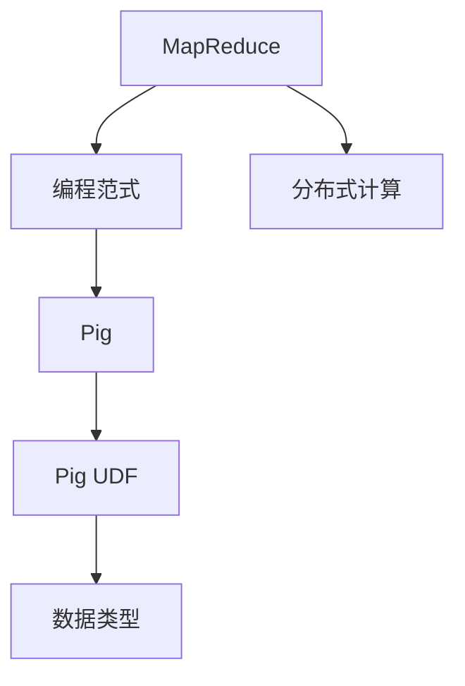
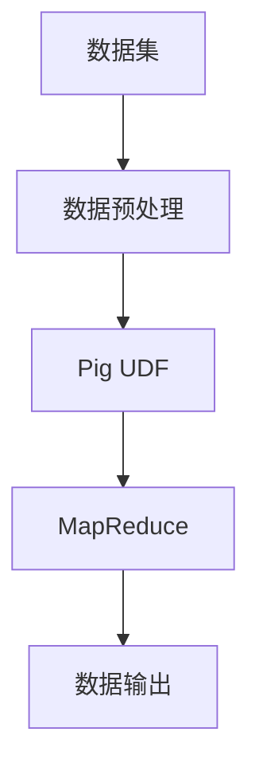

                 

# Pig UDF原理与代码实例讲解

> 关键词：Pig UDF, 用户自定义函数, 大数据, 编程范式, MapReduce, 数据处理, 分布式

## 1. 背景介绍

### 1.1 问题由来
在大数据时代，企业需要处理和分析海量数据，以驱动业务决策和优化运营。传统的SQL语言虽然简单易用，但在面对复杂数据处理需求时显得力不从心。而Pig则以其灵活的编程范式和丰富的函数库，成为大数据处理的有力工具。其中，用户自定义函数（User-Defined Functions, UDF）是Pig中一个重要特性，它允许用户自定义复杂的逻辑，以实现难以在Pig内置函数中实现的功能。

### 1.2 问题核心关键点
Pig UDF的核心理念是将复杂的算法逻辑抽象成函数，通过调用这些函数，完成数据的转换、计算和聚合等操作。UDF使得Pig能够灵活地处理各种类型的数据，支持包括但不限于SQL、MapReduce、高级统计分析等多种数据处理方式。通过UDF，用户可以构建更加个性化和高效的解决方案，满足多样化的数据处理需求。

### 1.3 问题研究意义
Pig UDF的研究和应用对于提高大数据处理的效率和灵活性具有重要意义：

1. **提升处理效率**：通过自定义函数，用户可以优化数据处理流程，提高处理速度。
2. **增强灵活性**：UDF允许用户处理各种复杂的数据类型和数据结构，提高数据的处理能力。
3. **降低开发成本**：UDF可以减少重复的代码编写，提高开发效率。
4. **实现复杂逻辑**：通过自定义函数，用户可以实现更加复杂的算法逻辑和数据分析方式。
5. **促进技术创新**：UDF的灵活应用促进了大数据处理技术的创新和发展。

## 2. 核心概念与联系

### 2.1 核心概念概述
- **Pig UDF**：Pig用户自定义函数，允许用户自定义复杂的算法逻辑，提高数据处理效率。
- **MapReduce**：一种分布式计算模型，用于大规模数据处理，Pig内置的执行引擎。
- **编程范式**：Pig提供了一种基于脚本的编程范式，与SQL类似，但更加灵活和强大。
- **数据类型**：Pig支持多种数据类型，包括基本数据类型、复杂数据类型和自定义数据类型。
- **分布式计算**：Pig能够利用多台计算机协同计算，处理海量数据。

### 2.2 概念间的关系

以下是一个Mermaid流程图，展示了Pig UDF与其他核心概念之间的关系：



这个流程图展示了Pig UDF与其他核心概念的关系：

1. Pig UDF是在Pig的编程范式下运行的。
2. Pig支持MapReduce计算模型，Pig UDF可以调用MapReduce函数。
3. Pig UDF处理的数据类型支持Pig的各种数据类型。
4. Pig UDF和MapReduce函数共同构成Pig的分布式计算能力。

### 2.3 核心概念的整体架构

最后，我们用一个综合的流程图来展示Pig UDF的整体架构：



这个综合流程图展示了从数据集到数据输出的整个Pig UDF执行过程。数据集经过预处理，然后调用Pig UDF进行复杂的计算逻辑，最后通过MapReduce进行分布式计算，最终输出结果。

## 3. 核心算法原理 & 具体操作步骤
### 3.1 算法原理概述

Pig UDF的原理是将复杂的算法逻辑封装成函数，通过调用这些函数，完成数据的转换、计算和聚合等操作。UDF可以访问Pig内置的MapReduce函数，以及用户自定义的函数和变量，实现丰富的数据处理功能。

### 3.2 算法步骤详解

以下是一个详细的Pig UDF开发步骤：

1. **定义UDF**：使用Pig Latin语法定义自定义函数。
2. **实现UDF**：编写函数代码，实现自定义功能。
3. **注册UDF**：将自定义函数注册到Pig中，供后续使用。
4. **调用UDF**：在Pig脚本中调用自定义函数，完成数据处理。

### 3.3 算法优缺点

Pig UDF的优点：

- **灵活性**：用户可以根据需要定义任意复杂的逻辑。
- **可重用性**：UDF可以复用，提高开发效率。
- **效率**：通过自定义逻辑，可以优化数据处理流程，提高效率。

Pig UDF的缺点：

- **开发复杂性**：编写UDF需要一定的编程技能和Pig知识。
- **调试困难**：UDF的调试可能比较困难，需要一定的经验和技巧。
- **维护成本**：随着数据量和处理逻辑的复杂性增加，维护成本也随之增加。

### 3.4 算法应用领域

Pig UDF在多个大数据处理领域中都有广泛应用，包括但不限于：

- **数据清洗**：通过UDF处理数据清洗需求，如去除重复、格式化、处理缺失值等。
- **数据转换**：通过UDF实现数据的转换，如从JSON到CSV的转换、数据分片等。
- **数据聚合**：通过UDF实现数据的聚合，如计算平均值、中位数、最大值等。
- **数据分析**：通过UDF实现复杂的数据分析，如统计分析、时间序列分析等。
- **机器学习**：通过UDF实现机器学习算法，如分类、回归等。

## 4. 数学模型和公式 & 详细讲解  
### 4.1 数学模型构建

Pig UDF通常不涉及复杂的数学模型，但我们可以简单地介绍一个例子来说明UDF的数学模型。

假设我们有一个数据集，包含若干个整数，我们需要计算这些整数的平均值。我们可以使用UDF来实现这个简单的数学计算：

```python
def average(data):
    sum = 0
    for i in data:
        sum += i
    return sum / len(data)
```

这个UDF通过循环计算所有数据的总和，然后除以数据个数，得到平均值。

### 4.2 公式推导过程

对于这个简单的计算任务，我们不需要进行复杂的公式推导。但为了更深入地理解Pig UDF的原理，我们可以稍微推导一下：

$$
\text{平均值为} \frac{1}{n} \sum_{i=1}^n x_i
$$

其中 $n$ 是数据个数，$x_i$ 是第 $i$ 个数据点。通过自定义函数，我们可以实现这个计算过程。

### 4.3 案例分析与讲解

以下是一个具体的Pig UDF案例，实现一个自定义的"reverse"函数，将输入的字符串反转：

```pig Latin
STRING_reverse = UDF<string, string>('
    str_rev = ""
    foreach (char in string) {
        str_rev = char + str_rev
    }
    return str_rev
');
```

这个UDF定义了一个字符串反转函数，通过循环遍历输入字符串，将其反转后返回。

## 5. 项目实践：代码实例和详细解释说明
### 5.1 开发环境搭建

为了编写Pig UDF，我们需要一个Pig平台。这里我们选择Cloudera的Pig环境，因为它包含了必要的库和工具，并且易于安装和配置。

### 5.2 源代码详细实现

以下是一个实现"reverse"函数的Pig UDF代码示例：

```pig Latin
STRING_reverse = UDF<string, string>('
    str_rev = ""
    foreach (char in string) {
        str_rev = char + str_rev
    }
    return str_rev
');
```

这个UDF定义了一个字符串反转函数，通过循环遍历输入字符串，将其反转后返回。

### 5.3 代码解读与分析

我们可以详细解读一下这个UDF的代码：

- `STRING_reverse = UDF<string, string>(' ... ')`：定义一个名为 `STRING_reverse` 的UDF，输入类型为字符串，输出类型也为字符串。
- `str_rev = ""`：定义一个空字符串，用于存储反转后的结果。
- `foreach (char in string)`：循环遍历输入字符串中的每个字符。
- `str_rev = char + str_rev`：将每个字符添加到反转后的结果字符串中。
- `return str_rev`：返回反转后的字符串。

### 5.4 运行结果展示

在Pig中调用这个UDF，可以这样写：

```pig Latin
input = LOAD 'input.txt' USING PigStorage(',') AS (input_string:chararray);
output = FOREACH input GENERATE STRING_reverse(input_string);
DUMP output;
```

这里我们先加载一个包含输入字符串的数据集，然后调用 `STRING_reverse` UDF进行反转，最后输出结果。

## 6. 实际应用场景
### 6.1 数据清洗

在大数据分析中，数据清洗是必不可少的步骤。通过自定义UDF，可以实现各种数据清洗需求，如去除重复、格式化、处理缺失值等。

### 6.2 数据转换

在数据处理中，数据转换也是一个重要环节。通过自定义UDF，可以实现各种数据格式之间的转换，如从JSON到CSV、从CSV到JSON等。

### 6.3 数据分析

数据分析是大数据分析的核心，通过自定义UDF，可以实现各种复杂的数据分析，如统计分析、时间序列分析等。

### 6.4 机器学习

机器学习算法在大数据分析中有着广泛应用。通过自定义UDF，可以实现各种机器学习算法，如分类、回归等。

## 7. 工具和资源推荐
### 7.1 学习资源推荐

为了学习Pig UDF，这里推荐一些优质的学习资源：

- Pig官方文档：包含完整的Pig UDF教程和示例代码，是学习Pig UDF的最佳入门资源。
- Pig用户社区：Pig用户社区是学习Pig UDF的宝贵资源，可以向其他Pig用户学习经验和解决方案。
- Pig UDF GitHub仓库：GitHub上有很多Pig UDF的代码示例，可以帮助你快速上手编写UDF。
- Pig UDF书籍：一些关于Pig UDF的书籍，深入讲解Pig UDF的原理和实践，如《Pig User Guide》等。

### 7.2 开发工具推荐

以下是几款用于Pig UDF开发的常用工具：

- Pig平台：Pig是一个开源的数据处理平台，提供了丰富的函数库和UDF开发环境。
- IDE：如IntelliJ IDEA、Eclipse等，提供了Pig UDF的语法高亮和代码补全功能。
- UDF测试框架：如JUnit，用于编写和测试自定义函数。
- UDF调试工具：如Pig调试工具，用于调试Pig UDF中的逻辑错误。

### 7.3 相关论文推荐

Pig UDF的相关论文主要集中在Pig平台的开发和优化上，以下是几篇重要的论文推荐：

- "Pig: A Platform for Distributed Data Analysis"：Pig平台的介绍和设计原理。
- "A Survey of Data-Intensive Text Mining Tools"：关于Pig UDF的综述，涵盖了各种UDF的实现和应用。
- "Pig UDF: A Study of User-Defined Functions for Data Analysis"：Pig UDF的实现和优化研究。
- "Efficient User-Defined Functions in Pig for Data Analysis"：关于Pig UDF的高效实现的研究。

## 8. 总结：未来发展趋势与挑战
### 8.1 研究成果总结

Pig UDF在大数据分析中具有重要的应用价值，能够帮助用户实现各种复杂的数据处理需求。通过UDF，用户可以自定义复杂的算法逻辑，提高数据处理的灵活性和效率。

### 8.2 未来发展趋势

Pig UDF未来的发展趋势包括以下几个方面：

- **扩展性**：随着大数据应用场景的不断扩展，Pig UDF将支持更多的数据类型和复杂的数据处理需求。
- **自动化**：自动生成和优化Pig UDF，提高开发效率和代码质量。
- **可扩展性**：Pig UDF将能够扩展到更多的大数据平台和云计算环境。
- **智能性**：利用人工智能技术，优化Pig UDF的实现和调优。

### 8.3 面临的挑战

Pig UDF的发展也面临一些挑战，包括：

- **开发难度**：编写Pig UDF需要一定的编程技能和Pig知识，对开发人员的要求较高。
- **调试复杂**：Pig UDF的调试和排错可能比较困难，需要一定的经验和技巧。
- **性能瓶颈**：Pig UDF的性能优化是一个重要问题，需要更多的研究和实践。
- **安全性和可靠性**：Pig UDF的编写和调用需要考虑安全性和可靠性问题，避免数据泄露和系统崩溃。

### 8.4 研究展望

Pig UDF的研究前景广阔，未来可以从以下几个方面进行探索：

- **自动化生成UDF**：利用人工智能和机器学习技术，自动生成Pig UDF，提高开发效率。
- **智能调优**：利用智能算法，优化Pig UDF的实现和调优，提升性能和效率。
- **跨平台支持**：将Pig UDF扩展到其他大数据平台和云计算环境，支持更多的数据类型和复杂的数据处理需求。
- **智能分析**：利用智能技术，实现更复杂的数据分析和大数据分析。

## 9. 附录：常见问题与解答
### 9.1 Q1: Pig UDF是否适用于所有数据处理场景？

A: Pig UDF适用于大多数数据处理场景，特别是那些需要复杂数据处理和算法逻辑的场景。对于简单的数据处理，Pig内置的函数可能更加高效和便捷。

### 9.2 Q2: Pig UDF的性能如何？

A: Pig UDF的性能主要取决于自定义函数的实现和调用方式。一般来说，如果自定义函数能够高效地利用Pig的分布式计算能力，性能将非常出色。

### 9.3 Q3: Pig UDF的调试和排错难度大吗？

A: Pig UDF的调试和排错确实有一定的难度，但可以通过日志记录和调试工具进行逐步排查。合理的使用注释和测试框架，也可以提高UDF的开发和调试效率。

### 9.4 Q4: Pig UDF的未来发展方向是什么？

A: Pig UDF的未来发展方向包括扩展性、自动化、可扩展性和智能性。随着大数据应用的不断扩展和人工智能技术的不断发展，Pig UDF也将不断进步，满足更多复杂的数据处理需求。

---

作者：禅与计算机程序设计艺术 / Zen and the Art of Computer Programming

