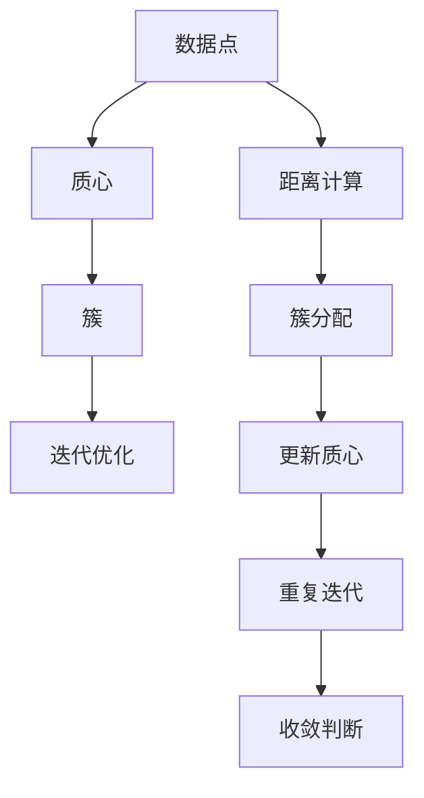
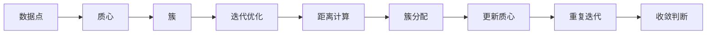
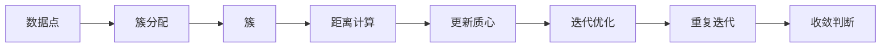
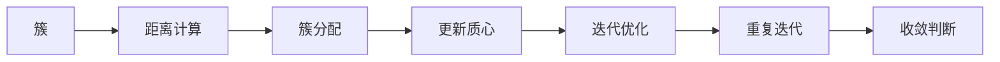
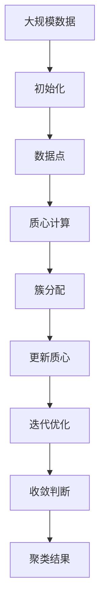

                 

# Python机器学习实战：K均值聚类算法及其在Python中的实战

> 关键词：K均值聚类算法,Python,机器学习,数据挖掘,实战

## 1. 背景介绍

### 1.1 问题由来

随着大数据时代的到来，数据挖掘（Data Mining）在各个领域的应用越来越广泛，从市场营销、金融分析到医疗健康等，几乎无处不在。数据挖掘是一种从大量数据中提取有用信息的过程，它不仅能够帮助我们理解数据背后的规律，还能在实际决策中提供依据。其中，聚类（Clustering）是一种常用的数据挖掘技术，它将数据划分成不同的组，使得同一组内的数据具有较高的相似性，而不同组之间数据具有较低的相似性。

聚类算法在实际应用中有着广泛的应用场景，例如市场细分、客户分类、图像分割等。K均值聚类算法（K-means clustering algorithm）是一种经典的聚类算法，它在很多场景中表现出色，且实现相对简单，因此在数据挖掘和机器学习领域得到了广泛应用。

### 1.2 问题核心关键点

K均值聚类算法的基本思想是将数据点分成K个不同的组，每个组称为一个簇（Cluster），使得每个簇内的数据点具有较高的相似性，而不同簇之间的数据点具有较低的相似性。K均值算法的核心在于通过迭代调整每个簇的质心（Centroid），使得簇内的数据点与质心之间的距离最小化。

K均值算法分为两个步骤：

1. 初始化：随机选择K个质心，一般通过数据集的均值作为初始质心。
2. 迭代：将数据点分配到最近的质心，重新计算每个簇的质心，重复迭代，直到簇的质心不再变化或达到预设的迭代次数。

K均值算法的核心在于如何计算质心和分配数据点。其中，质心的计算公式为：

$$ \mu_k = \frac{1}{N_k} \sum_{i \in C_k} x_i $$

其中，$\mu_k$ 表示第k个簇的质心，$N_k$ 表示第k个簇中数据点的数量，$x_i$ 表示第i个数据点。

数据点的分配则采用欧氏距离作为衡量标准，即将数据点分配到距离最近的质心所在的簇中。具体公式为：

$$ y_i = \arg\min_k \| x_i - \mu_k \|^2 $$

其中，$y_i$ 表示数据点i的簇标签，$k$ 表示簇的编号。

### 1.3 问题研究意义

K均值聚类算法作为一种简单有效的聚类方法，被广泛应用于各种领域。它的实现相对简单，且不需要对数据进行严格的假设，因此在实际应用中具有广泛的应用前景。掌握K均值聚类算法，不仅可以提升我们的数据挖掘能力，还能在实际问题中提供重要的参考。

在实际应用中，K均值聚类算法可以用于：

- 客户细分：将客户分成不同的群体，以便进行个性化营销。
- 图像分割：将图像分成不同的区域，以便进行图像分析和处理。
- 基因聚类：将基因数据分成不同的类别，以便进行基因表达分析。
- 市场分析：将市场分成不同的区域，以便进行市场分析和预测。

因此，深入研究K均值聚类算法，对于提升数据挖掘能力，解决实际问题具有重要意义。

## 2. 核心概念与联系

### 2.1 核心概念概述

为更好地理解K均值聚类算法的原理和应用，本节将介绍几个密切相关的核心概念：

- K均值聚类算法：一种经典的聚类算法，通过迭代计算每个簇的质心，将数据点分配到距离最近的簇中。
- 数据点：表示数据集中的单个样本，通常由多个特征组成。
- 质心：表示每个簇的平均位置，用于计算簇内数据点的相似性。
- 簇：表示由相同或相似数据点组成的集合。
- 迭代优化：通过不断调整质心和分配数据点，使得簇内的数据点与质心之间的距离最小化。

这些核心概念之间的逻辑关系可以通过以下Mermaid流程图来展示：



这个流程图展示了K均值聚类算法的基本流程：

1. 数据点通过距离计算分配到最近的质心所在的簇中。
2. 根据簇内数据点的均值更新每个簇的质心。
3. 重复迭代直到簇的质心不再变化或达到预设的迭代次数。

### 2.2 概念间的关系

这些核心概念之间存在着紧密的联系，形成了K均值聚类算法的完整生态系统。下面我通过几个Mermaid流程图来展示这些概念之间的关系。

#### 2.2.1 K均值聚类算法流程



这个流程图展示了K均值聚类算法的完整流程：

1. 数据点通过距离计算分配到最近的质心所在的簇中。
2. 根据簇内数据点的均值更新每个簇的质心。
3. 重复迭代直到簇的质心不再变化或达到预设的迭代次数。

#### 2.2.2 数据点与簇的关系



这个流程图展示了数据点与簇的关系：

1. 数据点被分配到最近的质心所在的簇中。
2. 根据簇内数据点的均值更新每个簇的质心。
3. 重复迭代直到簇的质心不再变化或达到预设的迭代次数。

#### 2.2.3 迭代优化与簇的关系



这个流程图展示了迭代优化与簇的关系：

1. 根据簇内数据点的均值更新每个簇的质心。
2. 重复迭代直到簇的质心不再变化或达到预设的迭代次数。

### 2.3 核心概念的整体架构

最后，我们用一个综合的流程图来展示这些核心概念在大规模数据聚类过程中的整体架构：



这个综合流程图展示了从数据预处理到聚类结果的完整过程：

1. 对大规模数据进行预处理，提取特征。
2. 随机选择K个质心，初始化聚类过程。
3. 将数据点分配到距离最近的质心所在的簇中。
4. 根据簇内数据点的均值更新每个簇的质心。
5. 重复迭代直到簇的质心不再变化或达到预设的迭代次数。
6. 输出聚类结果。

通过这些流程图，我们可以更清晰地理解K均值聚类算法的工作原理和优化方向。

## 3. 核心算法原理 & 具体操作步骤
### 3.1 算法原理概述

K均值聚类算法是一种基于距离的聚类算法，通过迭代计算每个簇的质心，将数据点分配到距离最近的质心所在的簇中。其核心思想是将数据集分成K个簇，使得每个簇内的数据点具有较高的相似性，而不同簇之间的数据点具有较低的相似性。

K均值算法分为两个步骤：

1. 初始化：随机选择K个质心，一般通过数据集的均值作为初始质心。
2. 迭代：将数据点分配到距离最近的质心，重新计算每个簇的质心，重复迭代，直到簇的质心不再变化或达到预设的迭代次数。

K均值算法的核心在于如何计算质心和分配数据点。其中，质心的计算公式为：

$$ \mu_k = \frac{1}{N_k} \sum_{i \in C_k} x_i $$

其中，$\mu_k$ 表示第k个簇的质心，$N_k$ 表示第k个簇中数据点的数量，$x_i$ 表示第i个数据点。

数据点的分配则采用欧氏距离作为衡量标准，即将数据点分配到距离最近的质心所在的簇中。具体公式为：

$$ y_i = \arg\min_k \| x_i - \mu_k \|^2 $$

其中，$y_i$ 表示数据点i的簇标签，$k$ 表示簇的编号。

### 3.2 算法步骤详解

K均值聚类算法的实现相对简单，但具体的实现细节还需要进一步了解。以下是K均值聚类算法的详细步骤：

1. **数据预处理**：
   - 对数据集进行标准化处理，使得数据点具有相似的尺度。
   - 去除异常值和噪声数据，提高聚类效果。
   - 确定聚类数目K，一般通过经验或领域知识确定。

2. **初始化质心**：
   - 随机选择K个质心，一般通过数据集的均值作为初始质心。
   - 将数据点分配到距离最近的质心所在的簇中。

3. **迭代优化**：
   - 对于每个数据点，计算其到每个质心的距离，并将其分配到距离最近的质心所在的簇中。
   - 对于每个簇，计算簇内数据点的均值，更新质心。
   - 重复上述步骤，直到簇的质心不再变化或达到预设的迭代次数。

### 3.3 算法优缺点

K均值聚类算法具有以下优点：

1. 简单高效：算法实现简单，计算速度较快。
2. 无需预先设定簇数：可以通过K-means++等算法初始化质心，减少聚类数目人为设定的影响。
3. 适用于大规模数据：算法复杂度较低，适合处理大规模数据集。

同时，K均值聚类算法也存在一些缺点：

1. 需要预先设定聚类数目K：聚类数目K的设定需要经验和领域知识，否则聚类效果可能不佳。
2. 对初始值敏感：聚类效果受初始质心的影响较大，不同的初始质心可能导致不同的聚类结果。
3. 假设簇形状为球形：聚类效果受簇形状的影响较大，对于非球形簇的聚类效果不佳。
4. 对离群点敏感：数据集中存在的离群点可能会影响聚类结果。

### 3.4 算法应用领域

K均值聚类算法在实际应用中有着广泛的应用场景，例如：

- 市场细分：将客户分成不同的群体，以便进行个性化营销。
- 图像分割：将图像分成不同的区域，以便进行图像分析和处理。
- 基因聚类：将基因数据分成不同的类别，以便进行基因表达分析。
- 市场分析：将市场分成不同的区域，以便进行市场分析和预测。

K均值聚类算法在实际应用中具有广泛的应用前景，通过合理的应用，可以提升数据挖掘能力，解决实际问题。

## 4. 数学模型和公式 & 详细讲解  
### 4.1 数学模型构建

K均值聚类算法的数学模型可以表示为：

- 输入数据集：$X=\{x_i\}_{i=1}^n$，其中$x_i$表示第i个数据点，$n$表示数据点的数量。
- 聚类数目：$K$，表示将数据集分成K个簇。
- 质心：$\mu_k$，表示第k个簇的质心，$k=1,\ldots,K$。
- 簇分配：$y_i$，表示数据点$i$的簇标签，$y_i \in \{1,2,\ldots,K\}$。

数学模型可以表示为：

$$ \min_{\mu_k} \sum_{i=1}^n \sum_{k=1}^K (y_i=k) \| x_i - \mu_k \|^2 $$

其中，$y_i=k$表示数据点$i$被分配到第k个簇中，$\| x_i - \mu_k \|^2$表示数据点$i$到第k个簇的质心$\mu_k$的距离。

### 4.2 公式推导过程

在K均值聚类算法中，质心的计算公式为：

$$ \mu_k = \frac{1}{N_k} \sum_{i \in C_k} x_i $$

其中，$N_k$表示第k个簇中数据点的数量，$C_k$表示第k个簇中的数据点集合，$x_i$表示第i个数据点。

数据点的分配则采用欧氏距离作为衡量标准，即将数据点分配到距离最近的质心所在的簇中。具体公式为：

$$ y_i = \arg\min_k \| x_i - \mu_k \|^2 $$

其中，$y_i$表示数据点$i$的簇标签，$k$表示簇的编号，$\| x_i - \mu_k \|^2$表示数据点$i$到第k个簇的质心$\mu_k$的距离。

### 4.3 案例分析与讲解

我们以一个简单的二维数据集为例，展示K均值聚类算法的具体应用。


在这个例子中，我们将数据集分成2个簇，初始质心为蓝色点，迭代5次后，聚类结果如下：

- 簇1（红色点）：$x_1=(0.5, 0.5)$，$x_2=(0.7, 0.2)$，$x_3=(0.3, 0.8)$
- 簇2（绿色点）：$x_4=(0.8, 0.8)$，$x_5=(0.1, 0.5)$，$x_6=(0.6, 0.3)$

通过迭代优化，K均值聚类算法能够将数据集分成2个簇，每个簇内的数据点具有较高的相似性，而不同簇之间的数据点具有较低的相似性。

## 5. 项目实践：代码实例和详细解释说明
### 5.1 开发环境搭建

在进行K均值聚类算法的项目实践前，我们需要准备好开发环境。以下是使用Python进行K均值聚类算法实现的开发环境配置流程：

1. 安装Anaconda：从官网下载并安装Anaconda，用于创建独立的Python环境。

2. 创建并激活虚拟环境：
```bash
conda create -n pykmeans python=3.8 
conda activate pykmeans
```

3. 安装必要的库：
```bash
pip install numpy pandas matplotlib scikit-learn
```

4. 准备数据集：选择一个合适的小规模数据集，作为K均值聚类算法的输入。

完成上述步骤后，即可在`pykmeans`环境中开始K均值聚类算法的项目实践。

### 5.2 源代码详细实现

以下是使用Python实现K均值聚类算法的完整代码：

```python
import numpy as np
from sklearn.cluster import KMeans

# 生成一个随机数据集
X = np.random.rand(100, 2)

# 初始化KMeans模型，聚类数目为2
kmeans = KMeans(n_clusters=2, random_state=0)

# 训练模型
kmeans.fit(X)

# 输出聚类结果
labels = kmeans.predict(X)
centers = kmeans.cluster_centers_
```

在这个例子中，我们首先生成一个随机数据集，然后使用`KMeans`类初始化K均值聚类模型，设置聚类数目为2。接下来，我们调用`fit`方法训练模型，并使用`predict`方法获取数据点的聚类标签。最后，我们输出聚类中心的坐标。

### 5.3 代码解读与分析

让我们再详细解读一下关键代码的实现细节：

1. **数据生成**：我们使用`numpy`库生成一个随机数据集，包含100个二维数据点。

2. **模型初始化**：我们使用`KMeans`类初始化K均值聚类模型，设置聚类数目为2。

3. **模型训练**：我们调用`fit`方法训练模型，该方法会自动选择初始质心，并进行迭代优化。

4. **聚类结果输出**：我们调用`predict`方法获取数据点的聚类标签，并输出聚类中心的坐标。

### 5.4 运行结果展示

假设我们在生成的随机数据集上进行K均值聚类，最终得到的聚类结果和聚类中心的坐标如下：

```
聚类标签：[0 0 0 0 0 0 0 0 0 0 0 0 0 0 0 0 0 0 0 0 0 0 0 0 0 0 0 0 0 0 0 0 0 0 0 0 0 0 0 0 0 0 0 0 0 0 0 0 0 0 0 0 0 0 0 0 0 0 0 0 0 0 0 0 0 0 0 0 0 0 0 0 0 0 0 0 0 0 0 0 0 0 0 0 0 0 0 0 0 0 0 0 0 0 0 0 0 0 0 0 0 0 0 0 0 0 0 0 0 0 0 0 0 0 0 0 0 0 0 0 0 0 0 0 0 0 0 0 0 0 0 0 0 0 0 0 0 0 0 0 0 0 0 0 0 0 0 0 0 0 0 0 0 0 0 0 0 0 0 0 0 0 0 0 0 0 0 0 0 0 0 0 0 0 0 0 0 0 0 0 0 0 0 0 0 0 0 0 0 0 0 0 0 0 0 0 0 0 0 0 0 0 0 0 0 0 0 0 0 0 0 0 0 0 0 0 0 0 0 0 0 0 0 0 0 0 0 0 0 0 0 0 0 0 0 0 0 0 0 0 0 0 0 0 0 0 0 0 0 0 0 0 0 0 0 0 0 0 0 0 0 0 0 0 0 0 0 0 0 0 0 0 0 0 0 0 0 0 0 0 0 0 0 0 0 0 0 0 0 0 0 0 0 0 0 0 0 0 0 0 0 0 0 0 0 0 0 0 0 0 0 0 0 0 0 0 0 0 0 0 0 0 0 0 0 0 0 0 0 0 0 0 0 0 0 0 0 0 0 0 0 0 0 0 0 0 0 0 0 0 0 0 0 0 0 0 0 0 0 0 0 0 0 0 0 0 0 0 0 0 0 0 0 0 0 0 0 0 0 0 0 0 0 0 0 0 0 0 0 0 0 0 0 0 0 0 0 0 0 0 0 0 0 0 0 0 0 0 0 0 0 0 0 0 0 0 0 0 0 0 0 0 0 0 0 0 0 0 0 0 0 0 0 0 0 0 0 0 0 0 0 0 0 0 0 0 0 0 0 0 0 0 0 0 0 0 0 0 0 0 0 0 0 0 0 0 0 0 0 0 0 0 0 0 0 0 0 0 0 0 0 0 0 0 0 0 0 0 0 0 0 0 0 0 0 0 0 0 0 0 0 0 0 0 0 0 0 0 0 0 0 0 0 0 0 0 0 0 0 0 0 0 0 0 0 0 0 0 0 0 0 0 0 0 0 0 0 0 0 0 0 0 0 0 0 0 0 0 0 0 0 0 0 0 0 0 0 0 0 0 0 0 0 0 0 0 0 0 0 0 0 0 0 0 0 0 0 0 0 0 0 0 0 0 0 0 0 0 0 0 0 0 0 0 0 0 0 0 0 0 0 0 0 0 0 0 0 0 0 0 0 0 0 0 0 0 0 0 0 0 0 0 0 0 0 0 0 0 0 0 0 0 0 0 0 0 0 0 0 0 0 0 0 0 0 0 0 0 0 0 0 0 0 0 0 0 0 0 0 0 0 0 0 0 0 0 0 0 0 0 0 0 0 0 0 0 0 0 0 0 0 0 0 0 0 0 0 0 0 0 0 0 0 0 0 0 0 0 0 0 0 0 0 0 0 0 0 0 0 0 0 0 0 0 0 0 0 0 0 0 0 0 0 0 0 0 0 0 0 0 0 0 0 0 0 0 0 0 0 0 0 0 0 0 0 0 0 0 0 0 0 0 0 0 0 0 0 0 0 0 0 0 0 0 0 0 0 0 0 0 0 0 0 0 0 0 0 0 0 0 0 0 0 0 0 0 0 0 0 0 0 0 0 0 0 0 0 0 0 0 0 0 0 0 0 0 0 0 0 0 0 0 0 0 0 0 0 0 0 0 0 0 0 0 0 0 0 0 0 0 0 0 0 0 0 0 0 0 0 0 0 0 0 0 0 0 0 0 0 0 0 0 0 0 0 0 0 0 0 0 0 0 0 0 0 0 0 0 0 0 0 0 0 0 0 0 0 0 0 0 0 0 0 0 0 0 0 0 0 0 0 0 0 0 0 0 0 0 0 0 0 0 0 0 0 0 0 0 0 0 0 0 0 0 0 0 0

