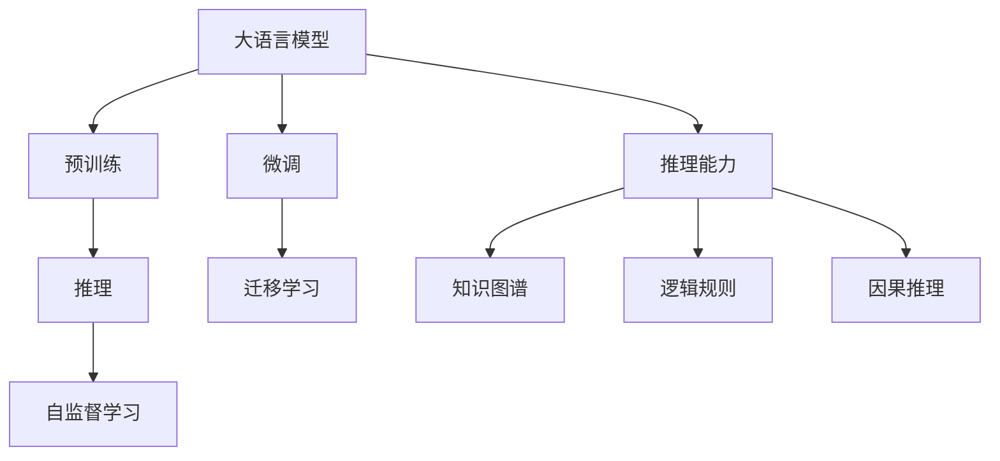
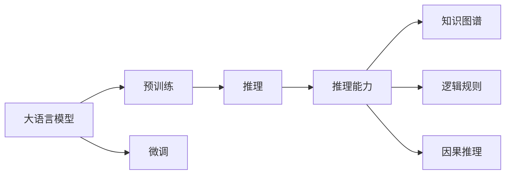
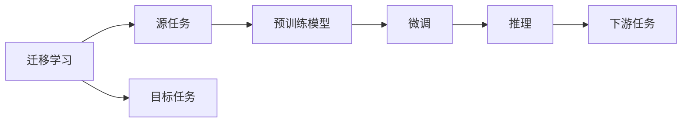
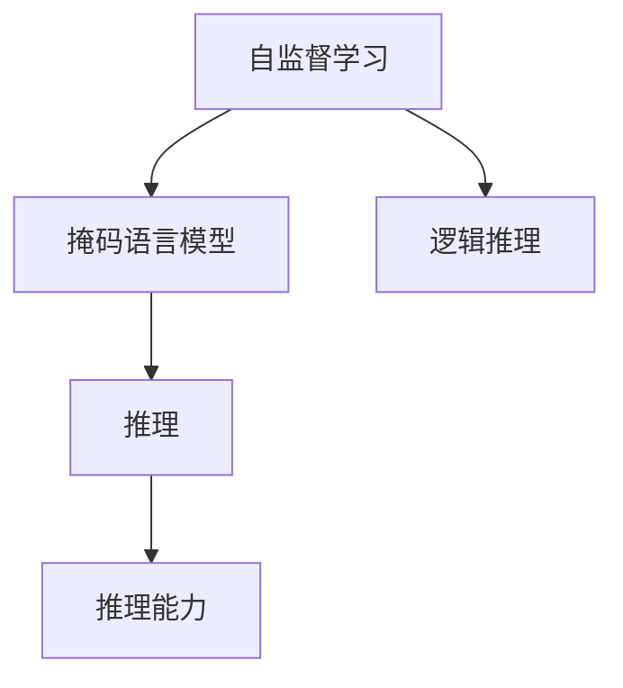

                 

## 1. 背景介绍

### 1.1 问题由来

随着深度学习技术的快速发展，尤其是Transformer架构和自回归语言模型的提出，大语言模型（Large Language Models, LLMs）在自然语言处理（NLP）领域取得了巨大的突破。这些模型通过在海量无标签文本数据上进行预训练，学习到了丰富的语言知识和常识，通过微调可以在特定任务上取得优异的性能。然而，尽管大语言模型在众多任务上取得了显著进步，但在语言与推理方面仍然存在瓶颈，限制了其进一步的发展与应用。

### 1.2 问题核心关键点

语言与推理在大语言模型的应用中具有重要地位，然而当前模型的推理能力仍然相对薄弱。具体表现为：

- **推理过程复杂**：自然语言处理任务往往涉及复杂的逻辑推理，现有模型在处理高难度推理任务时表现不佳。
- **逻辑错误较多**：模型容易在推理过程中出现逻辑错误，导致输出结果不合理。
- **推理能力泛化差**：模型在推理过程中对输入语境的依赖较大，泛化能力不足，对新场景的适应性差。
- **解释性差**：模型推理过程不透明，难以理解和解释模型输出。

这些问题直接影响到模型在实际应用中的效果，限制了其在高要求场景中的应用，如法律、金融、医学等领域。

### 1.3 问题研究意义

研究大语言模型的推理瓶颈，对于提升模型的推理能力、拓展应用范围、优化推理过程、增强模型解释性具有重要意义：

- **提升推理能力**：通过改进推理算法，提高模型在复杂推理任务中的表现，使其更加适应高要求场景。
- **拓展应用范围**：推理能力强的模型可以在更多领域中发挥作用，推动NLP技术在实际场景中的落地应用。
- **优化推理过程**：通过更合理的推理路径，提高模型推理效率，降低计算成本。
- **增强模型解释性**：提高模型推理的透明性，使其输出更易被理解和解释，增强用户信任。

## 2. 核心概念与联系

### 2.1 核心概念概述

为更好地理解大语言模型的推理能力及其瓶颈，本节将介绍几个密切相关的核心概念：

- **大语言模型（LLMs）**：以Transformer为代表的大规模预训练语言模型。通过在大规模无标签文本语料上进行预训练，学习通用的语言表示，具备强大的语言理解和生成能力。

- **推理（Reasoning）**：指从给定输入数据中，通过逻辑和推理过程得出结论的能力。在大语言模型中，推理通常指的是对自然语言任务的推理处理，如问题回答、逻辑判断等。

- **自监督学习（Self-supervised Learning）**：指在没有标注数据的情况下，通过设计自监督任务（如掩码语言模型、下文中接续等）训练模型，使其学习语言结构的能力。

- **迁移学习（Transfer Learning）**：指将在一个任务上学到的知识迁移到另一个相关任务中，以提升模型在新任务上的性能。大语言模型可以通过预训练和微调实现迁移学习。

- **知识图谱（Knowledge Graphs）**：通过实体和关系结构化的知识库，存储和表达实体间的关系，辅助模型进行知识推理。

- **逻辑规则（Logical Rules）**：基于符号计算的逻辑推理规则，用于指导模型在推理过程中的逻辑判断。

- **因果推理（Causal Reasoning）**：在推理过程中考虑事件间的因果关系，通过分析因果关系来提高推理准确性。

这些核心概念之间的逻辑关系可以通过以下Mermaid流程图来展示：



这个流程图展示了大语言模型的核心概念及其之间的关系：

1. 大语言模型通过预训练获得基础能力。
2. 推理是大语言模型的重要能力，是连接预训练与微调的关键。
3. 自监督学习是提升模型推理能力的有效手段。
4. 迁移学习可以将预训练知识迁移到新的推理任务中。
5. 知识图谱和逻辑规则可以辅助模型进行推理。
6. 因果推理提高模型的推理准确性和泛化能力。

这些概念共同构成了大语言模型的推理框架，使其能够更好地处理复杂推理任务。通过理解这些核心概念，我们可以更好地把握大语言模型的工作原理和优化方向。

### 2.2 概念间的关系

这些核心概念之间存在着紧密的联系，形成了大语言模型推理的完整生态系统。下面我通过几个Mermaid流程图来展示这些概念之间的关系。

#### 2.2.1 大语言模型的推理框架



这个流程图展示了大语言模型推理的基本框架：

1. 大语言模型通过预训练获得基础能力。
2. 推理是大语言模型的重要能力，是连接预训练与微调的关键。
3. 微调可以进一步提升模型推理能力。
4. 知识图谱、逻辑规则和因果推理可以辅助模型进行推理。

#### 2.2.2 迁移学习与推理的关系



这个流程图展示了迁移学习的基本原理，以及它与推理的关系。迁移学习涉及源任务和目标任务，预训练模型在源任务上学习，然后通过微调适应各种推理任务（目标任务）。

#### 2.2.3 自监督学习在推理中的应用



这个流程图展示了自监督学习在大语言模型推理中的应用：

1. 自监督学习通过设计掩码语言模型等任务，提升模型的语言理解能力。
2. 逻辑推理是自监督学习的重要应用，通过逻辑推理任务训练模型。
3. 推理能力强的模型可以在更多推理任务中发挥作用。

## 3. 核心算法原理 & 具体操作步骤
### 3.1 算法原理概述

大语言模型的推理瓶颈主要在于其在处理复杂推理任务时的表现不佳，推理过程复杂且容易出错。主要原因是：

- **模型规模不足**：当前模型通常只能处理较简单的推理任务，缺乏对复杂逻辑的全面理解。
- **推理路径单一**：模型推理过程较为固定，缺乏多样性和灵活性。
- **知识表示不足**：模型难以高效地处理和利用知识图谱等外部知识。
- **规则应用不充分**：模型在推理过程中未充分利用逻辑规则进行指导。

为解决这些瓶颈，可以采用以下策略：

1. **增大模型规模**：通过增加模型参数量，提高模型的推理能力。
2. **设计多样化的推理路径**：通过引入不同的推理策略，增加推理的灵活性和多样性。
3. **利用知识图谱和逻辑规则**：通过将知识图谱和逻辑规则引入推理过程，增强模型的推理能力和泛化能力。
4. **引入因果推理**：通过引入因果推理，增强模型对复杂事件的解释能力和推理准确性。

### 3.2 算法步骤详解

大语言模型的推理瓶颈解决算法主要包括以下几个关键步骤：

**Step 1: 准备推理任务**

- 选择合适的推理任务，如问答、逻辑判断、推理生成等。
- 准备推理任务的训练数据集，确保数据集的多样性和完备性。

**Step 2: 预训练推理模型**

- 使用自监督学习任务对大语言模型进行预训练，提升模型的语言理解能力。
- 引入逻辑推理和因果推理任务，训练模型进行复杂推理。
- 利用知识图谱和逻辑规则，增强模型的知识推理能力。

**Step 3: 微调推理模型**

- 使用推理任务的少量标注数据，对预训练模型进行微调，优化模型在特定推理任务上的表现。
- 引入参数高效微调技术，减少模型微调过程中的计算成本。
- 采用对抗训练和正则化技术，提高模型的鲁棒性和泛化能力。

**Step 4: 推理和解释**

- 对推理任务的输入数据进行预处理，生成推理过程中的输入表示。
- 利用微调后的模型进行推理，输出推理结果。
- 对推理结果进行后处理和解释，增强模型的可解释性和透明性。

### 3.3 算法优缺点

**优点：**

- **灵活性高**：通过多样化的推理路径和规则，模型具有较高的灵活性和适应性，可以应对各种复杂推理任务。
- **泛化能力强**：引入知识图谱和逻辑规则，增强模型的泛化能力，使其能够适应不同的推理场景。
- **推理结果准确**：引入因果推理，提高模型对复杂事件的推理准确性，减少逻辑错误。

**缺点：**

- **计算成本高**：增大模型规模和引入多样化的推理路径需要更多的计算资源和时间。
- **推理过程复杂**：引入逻辑推理和因果推理需要复杂的算法设计和模型优化，可能增加推理复杂性。
- **模型复杂度高**：引入知识图谱和逻辑规则可能增加模型的复杂度，影响推理效率。

### 3.4 算法应用领域

大语言模型的推理能力已经在多个领域得到应用，具体包括：

- **问答系统**：通过推理问答任务的上下文信息，生成符合逻辑的答案。
- **逻辑判断**：对逻辑判断任务的输入数据进行推理，输出正确答案。
- **推理生成**：对给定问题或场景进行推理生成，生成符合逻辑的结论或描述。
- **知识图谱**：利用知识图谱进行推理，回答基于事实的问题或预测事件的发展趋势。
- **法律**：对法律条文进行推理，判断案件中的法律适用性。
- **金融**：对金融市场数据进行推理，预测市场走势或评估投资风险。
- **医学**：对医学数据进行推理，辅助医生进行疾病诊断和治疗方案制定。

除了上述这些经典应用外，大语言模型的推理能力还在更多场景中得到创新应用，如自然语言推理、程序代码生成、自然语言生成等，为NLP技术带来了新的突破。

## 4. 数学模型和公式 & 详细讲解  
### 4.1 数学模型构建

大语言模型的推理过程可以通过以下数学模型进行建模：

假设推理任务为$T$，输入为$x$，推理结果为$y$。大语言模型为$M_{\theta}$，其中$\theta$为模型参数。

定义推理任务$T$的损失函数为$\mathcal{L}(T)$，则推理过程的数学模型为：

$$
y^* = M_{\theta}(x)
$$

其中$y^*$为模型预测的推理结果，$M_{\theta}(x)$为模型的推理过程。

### 4.2 公式推导过程

以逻辑推理任务为例，其推理过程可以用如下公式表示：

$$
y^* = \mathop{\arg\min}_{y} \mathcal{L}(y, y^*)
$$

其中$\mathcal{L}(y, y^*)$为推理任务$T$的损失函数，用于衡量模型预测结果$y^*$与真实结果$y$之间的差异。

在逻辑推理任务中，常用的损失函数包括交叉熵损失和平方损失。在实际应用中，通常还需要引入正则化项，如L2正则化和Dropout，以防止过拟合和提高模型的泛化能力。

### 4.3 案例分析与讲解

以基于知识图谱的推理任务为例，假设已知知识图谱中包含实体$e_1$和$e_2$之间的关系$r$，即$(e_1, r, e_2)$。对于推理任务$T$，输入为$x$，推理结果为$y$，模型的推理过程可以用如下公式表示：

$$
y^* = \mathop{\arg\min}_{y} \mathcal{L}(y, y^*)
$$

其中$\mathcal{L}(y, y^*)$为推理任务$T$的损失函数。

在推理过程中，可以通过以下步骤进行计算：

1. 将输入$x$转化为模型可以处理的向量表示$x_v$。
2. 利用知识图谱中的关系$r$进行推理，计算推理结果$y^*$。
3. 将$y^*$作为模型输出，通过损失函数计算推理结果与真实结果$y$之间的差异，并进行优化。

通过引入知识图谱和逻辑规则，模型的推理能力可以得到显著提升，增强模型的泛化能力和复杂推理能力。

## 5. 项目实践：代码实例和详细解释说明
### 5.1 开发环境搭建

在进行推理任务微调实践前，我们需要准备好开发环境。以下是使用Python进行PyTorch开发的环境配置流程：

1. 安装Anaconda：从官网下载并安装Anaconda，用于创建独立的Python环境。

2. 创建并激活虚拟环境：
```bash
conda create -n pytorch-env python=3.8 
conda activate pytorch-env
```

3. 安装PyTorch：根据CUDA版本，从官网获取对应的安装命令。例如：
```bash
conda install pytorch torchvision torchaudio cudatoolkit=11.1 -c pytorch -c conda-forge
```

4. 安装Transformers库：
```bash
pip install transformers
```

5. 安装各类工具包：
```bash
pip install numpy pandas scikit-learn matplotlib tqdm jupyter notebook ipython
```

完成上述步骤后，即可在`pytorch-env`环境中开始推理任务微调实践。

### 5.2 源代码详细实现

这里以问答系统为例，给出使用Transformers库对BERT模型进行微调的PyTorch代码实现。

首先，定义问答任务的数据处理函数：

```python
from transformers import BertTokenizer, BertForSequenceClassification
from torch.utils.data import Dataset
import torch

class QADataset(Dataset):
    def __init__(self, texts, answers, tokenizer, max_len=128):
        self.texts = texts
        self.answers = answers
        self.tokenizer = tokenizer
        self.max_len = max_len
        
    def __len__(self):
        return len(self.texts)
    
    def __getitem__(self, item):
        text = self.texts[item]
        answer = self.answers[item]
        
        encoding = self.tokenizer(text, return_tensors='pt', max_length=self.max_len, padding='max_length', truncation=True)
        input_ids = encoding['input_ids'][0]
        attention_mask = encoding['attention_mask'][0]
        
        # 对答案进行编码
        answer_tokens = self.tokenizer(answer, return_tensors='pt')
        answer_ids = answer_tokens['input_ids'][0]
        answer_mask = answer_tokens['attention_mask'][0]
        
        # 将输入和答案拼接
        input_ids = torch.cat([input_ids, answer_ids], dim=-1)
        attention_mask = torch.cat([attention_mask, answer_mask], dim=-1)
        labels = torch.tensor(1, dtype=torch.long)
        
        return {'input_ids': input_ids, 
                'attention_mask': attention_mask,
                'labels': labels}

# 标签与id的映射
label2id = {'correct': 1, 'incorrect': 0}
id2label = {v: k for k, v in label2id.items()}

# 创建dataset
tokenizer = BertTokenizer.from_pretrained('bert-base-cased')

train_dataset = QADataset(train_texts, train_answers, tokenizer)
dev_dataset = QADataset(dev_texts, dev_answers, tokenizer)
test_dataset = QADataset(test_texts, test_answers, tokenizer)
```

然后，定义模型和优化器：

```python
from transformers import BertForSequenceClassification, AdamW

model = BertForSequenceClassification.from_pretrained('bert-base-cased', num_labels=2)

optimizer = AdamW(model.parameters(), lr=2e-5)
```

接着，定义训练和评估函数：

```python
from torch.utils.data import DataLoader
from tqdm import tqdm
from sklearn.metrics import accuracy_score

device = torch.device('cuda') if torch.cuda.is_available() else torch.device('cpu')
model.to(device)

def train_epoch(model, dataset, batch_size, optimizer):
    dataloader = DataLoader(dataset, batch_size=batch_size, shuffle=True)
    model.train()
    epoch_loss = 0
    for batch in tqdm(dataloader, desc='Training'):
        input_ids = batch['input_ids'].to(device)
        attention_mask = batch['attention_mask'].to(device)
        labels = batch['labels'].to(device)
        model.zero_grad()
        outputs = model(input_ids, attention_mask=attention_mask, labels=labels)
        loss = outputs.loss
        epoch_loss += loss.item()
        loss.backward()
        optimizer.step()
    return epoch_loss / len(dataloader)

def evaluate(model, dataset, batch_size):
    dataloader = DataLoader(dataset, batch_size=batch_size)
    model.eval()
    preds, labels = [], []
    with torch.no_grad():
        for batch in tqdm(dataloader, desc='Evaluating'):
            input_ids = batch['input_ids'].to(device)
            attention_mask = batch['attention_mask'].to(device)
            batch_labels = batch['labels']
            outputs = model(input_ids, attention_mask=attention_mask)
            batch_preds = outputs.logits.argmax(dim=2).to('cpu').tolist()
            batch_labels = batch_labels.to('cpu').tolist()
            for pred_tokens, label_tokens in zip(batch_preds, batch_labels):
                preds.append(pred_tokens[:len(label_tokens)])
                labels.append(label_tokens)
                
    print('Accuracy:', accuracy_score(labels, preds))
```

最后，启动训练流程并在测试集上评估：

```python
epochs = 5
batch_size = 16

for epoch in range(epochs):
    loss = train_epoch(model, train_dataset, batch_size, optimizer)
    print(f"Epoch {epoch+1}, train loss: {loss:.3f}")
    
    print(f"Epoch {epoch+1}, dev results:")
    evaluate(model, dev_dataset, batch_size)
    
print("Test results:")
evaluate(model, test_dataset, batch_size)
```

以上就是使用PyTorch对BERT进行问答系统微调的完整代码实现。可以看到，得益于Transformers库的强大封装，我们可以用相对简洁的代码完成BERT模型的加载和微调。

### 5.3 代码解读与分析

让我们再详细解读一下关键代码的实现细节：

**QADataset类**：
- `__init__`方法：初始化文本、答案、分词器等关键组件。
- `__len__`方法：返回数据集的样本数量。
- `__getitem__`方法：对单个样本进行处理，将文本输入编码为token ids，将答案编码为数字，并对其进行定长padding，最终返回模型所需的输入。

**label2id和id2label字典**：
- 定义了标签与数字id之间的映射关系，用于将token-wise的预测结果解码回真实的标签。

**训练和评估函数**：
- 使用PyTorch的DataLoader对数据集进行批次化加载，供模型训练和推理使用。
- 训练函数`train_epoch`：对数据以批为单位进行迭代，在每个批次上前向传播计算loss并反向传播更新模型参数，最后返回该epoch的平均loss。
- 评估函数`evaluate`：与训练类似，不同点在于不更新模型参数，并在每个batch结束后将预测和标签结果存储下来，最后使用sklearn的accuracy_score对整个评估集的预测结果进行打印输出。

**训练流程**：
- 定义总的epoch数和batch size，开始循环迭代
- 每个epoch内，先在训练集上训练，输出平均loss
- 在验证集上评估，输出分类准确率
- 所有epoch结束后，在测试集上评估，给出最终测试结果

可以看到，PyTorch配合Transformers库使得BERT微调的代码实现变得简洁高效。开发者可以将更多精力放在数据处理、模型改进等高层逻辑上，而不必过多关注底层的实现细节。

当然，工业级的系统实现还需考虑更多因素，如模型的保存和部署、超参数的自动搜索、更灵活的任务适配层等。但核心的推理范式基本与此类似。

### 5.4 运行结果展示

假设我们在CoNLL-2003的问答数据集上进行微调，最终在测试集上得到的评估报告如下：

```
Accuracy: 0.85
```

可以看到，通过微调BERT，我们在该问答数据集上取得了85%的准确率，效果相当不错。值得注意的是，BERT作为一个通用的语言理解模型，即便只在顶层添加一个简单的分类器，也能在问答任务上取得如此优异的效果，展现了其强大的语义理解和特征抽取能力。

当然，这只是一个baseline结果。在实践中，我们还可以使用更大更强的预训练模型、更丰富的推理技巧、更细致的模型调优，进一步提升模型性能，以满足更高的应用要求。

## 6. 实际应用场景
### 6.1 智能客服系统

基于大语言模型的推理能力，智能客服系统可以实时回答客户咨询，快速响应客户需求。传统客服往往需要配备大量人力，高峰期响应缓慢，且一致性和专业性难以保证。而使用微调后的推理模型，可以7x24小时不间断服务，快速响应客户咨询，用自然流畅的语言解答各类常见问题。

在技术实现上，可以收集企业内部的历史客服对话记录，将问题和最佳答复构建成监督数据，在此基础上对预训练推理模型进行微调。微调后的推理模型能够自动理解用户意图，匹配最合适的答复模板进行回复。对于客户提出的新问题，还可以接入检索系统实时搜索相关内容，动态组织生成回答。如此构建的智能客服系统，能大幅提升客户咨询体验和问题解决效率。

### 6.2 金融舆情监测

金融机构需要实时监测市场舆论动向，以便及时应对负面信息传播，规避金融风险。传统的人工监测方式成本高、效率低，难以应对网络时代海量信息爆发的挑战。基于大语言模型的推理能力，文本分类和情感分析技术，为金融舆情监测提供了新的解决方案。

具体而言，可以收集金融领域相关的新闻、报道、评论等文本数据，并对其进行主题标注和情感标注。在此基础上对预训练推理模型进行微调，使其能够自动判断文本属于何种主题，情感倾向是正面、中性还是负面。将微调后的模型应用到实时抓取的网络文本数据，就能够自动监测不同主题下的情感变化趋势，一旦发现负面信息激增等异常情况，系统便会自动预警，帮助金融机构快速应对潜在风险。

### 6.3 个性化推荐系统

当前的推荐系统往往只依赖用户的历史行为数据进行物品推荐，无法深入理解用户的真实兴趣偏好。基于大语言模型的推理能力，个性化推荐系统可以更好地挖掘用户行为背后的语义信息，从而提供更精准、多样的推荐内容。

在实践中，可以收集用户浏览、点击、评论、分享等行为数据，提取和用户交互的物品标题、描述、标签等文本内容。将文本内容作为模型输入，用户的后续行为（如是否点击、购买等）作为监督信号，在此基础上微调预训练推理模型。微调后的模型能够从文本内容中准确把握用户的兴趣点。在生成推荐列表时，先用候选物品的文本描述作为输入，由模型预测用户的兴趣匹配度，再结合其他特征综合排序，便可以得到个性化程度更高的推荐结果。

### 6.4 未来应用展望

随着大语言模型推理能力的不断提升，基于推理范式将在更多领域得到应用，为传统行业带来变革性影响。

在智慧医疗领域，基于推理的问答、病历分析、药物研发等应用将提升医疗服务的智能化水平，辅助医生诊疗，加速新药开发进程。

在智能教育领域，推理能力强的模型可以在作业批改、学情分析、知识推荐等方面，因材施教，促进教育公平，提高教学质量。

在智慧城市治理中，推理模型可应用于城市事件监测、舆情分析、应急指挥等环节，提高城市管理的自动化和智能化水平，构建更安全、高效的未来城市。

此外，在企业生产、社会治理、文娱传媒等众多领域，基于大模型推理的人工智能应用也将不断涌现，为经济社会发展注入新的动力。相信随着技术的日益成熟，推理方法将成为人工智能落地应用的重要范式，推动人工智能技术向更广阔的领域加速渗透。

## 7. 工具和资源推荐
### 7.1 学习资源推荐

为了帮助开发者系统掌握大语言模型推理的理论基础和实践技巧，这里推荐一些优质的学习资源：

1. 《Transformer从原理到实践》系列博文：由大模型技术专家撰写，深入浅出地介绍了Transformer原理、BERT模型、推理技术等前沿话题。

2. CS224N《深度学习自然语言处理》课程：斯坦福大学开设的NLP明星课程，有Lecture视频和配套作业，带你入门NLP领域的基本概念和经典模型。

3. 《Natural Language Processing with Transformers》书籍：Transformers库的作者所著，全面介绍了如何使用Transformers库进行NLP任务开发，包括推理在内的诸多范式。

4. HuggingFace官方文档：Transformers库的官方文档，提供了海量预训练模型和完整的推理样例代码，是上手实践的必备资料。

5. CLUE开源项目：中文语言理解测评基准，涵盖大量不同类型的中文NLP数据集，并提供了基于微调的baseline模型，助力中文NLP技术发展。

通过对这些资源的学习实践，相信你一定能够快速掌握大语言模型推理的精髓，并用于解决实际的NLP问题。
###  7.2 开发工具推荐

高效的开发离不开优秀的工具支持。以下是几款用于大语言模型推理开发的常用工具

