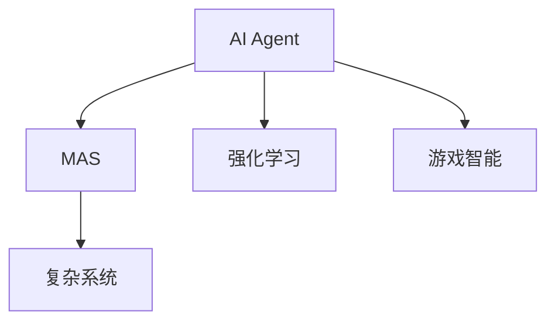
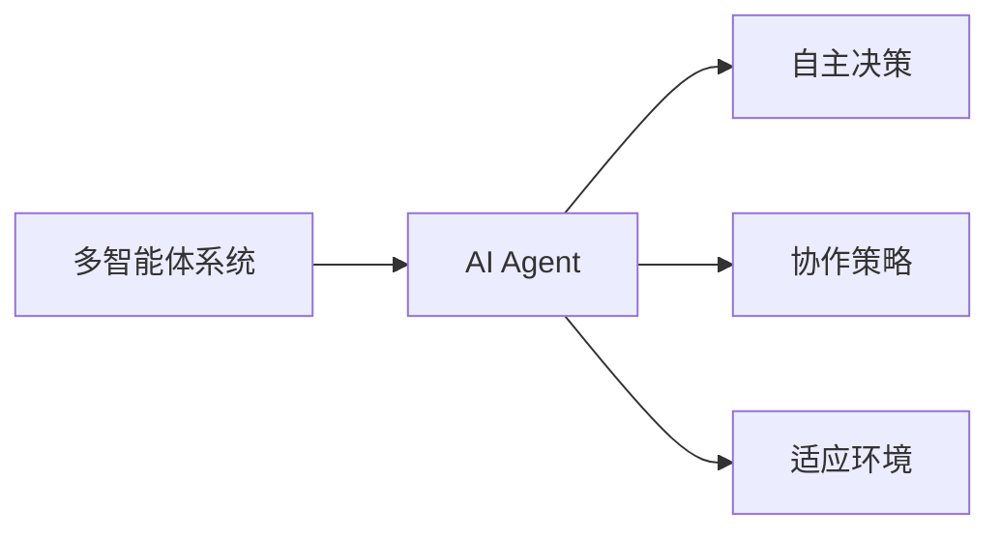
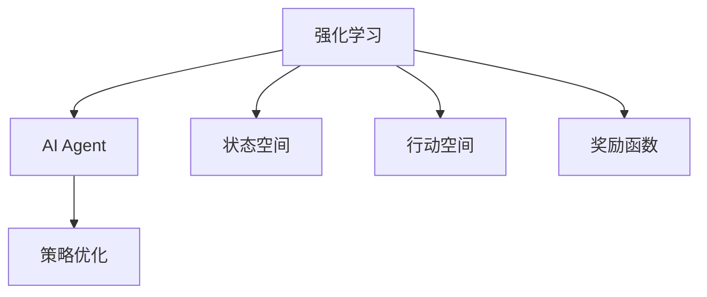
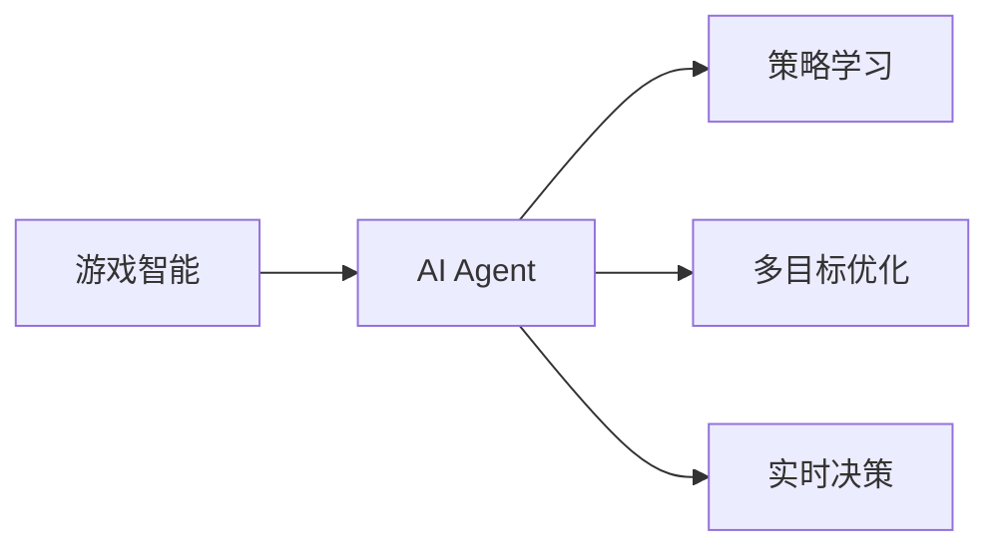
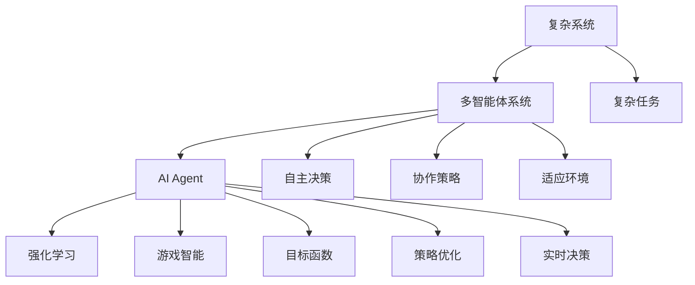

                 

# AI Agent: AI的下一个风口 解决方案与研究方向

> 关键词：AI Agent, AI、机器学习、深度学习、多智能体系统、复杂系统、强化学习、游戏智能、策略优化、自动驾驶、智能交通、城市规划

## 1. 背景介绍

### 1.1 问题由来

人工智能（AI）已经成为当今技术发展的核心驱动力之一，其应用范围涵盖自然语言处理（NLP）、计算机视觉（CV）、自动驾驶（AD）等多个领域。然而，尽管AI在过去几十年中取得了巨大进展，但其发展仍然面临诸多挑战和局限。

当前，AI主要依赖于机器学习（ML）和深度学习（DL）模型。尽管这些模型在图像识别、语音识别、自然语言处理等方面取得了显著成果，但它们往往需要大量的数据和计算资源进行训练。此外，这些模型通常被视为“黑盒”系统，缺乏可解释性，难以满足某些高风险领域的应用需求。

在此背景下，AI Agent（AI代理人）应运而生，成为了AI的下一个风口。AI Agent不仅仅是一个模型，而是一个具有自主决策能力的智能体，能够在复杂环境中自主行动，适应环境变化，并实现特定的目标。这一概念不仅适用于智能机器人、自动驾驶汽车等物理世界中的应用，也适用于金融市场、网络安全等虚拟世界中的应用。

### 1.2 问题核心关键点

AI Agent的核心在于实现自主决策和动态适应环境的能力。它融合了AI、机器学习、深度学习、多智能体系统、复杂系统、强化学习等前沿技术，具备强大的学习能力、自主性、适应性和可解释性。具体来说，AI Agent的应用核心包括以下几个方面：

- **自主决策**：AI Agent能够在没有人类干预的情况下，自主选择行动策略，最大化其目标函数。
- **适应环境**：AI Agent能够实时感知环境变化，动态调整策略以应对未知或突发事件。
- **可解释性**：AI Agent通过明确的决策过程和中间变量，能够提供透明和可解释的决策结果。
- **多智能体协作**：AI Agent可以与多个智能体协作，共同完成任务，提高整体系统效率和鲁棒性。

这些核心能力使得AI Agent能够在各种复杂场景中发挥重要作用，推动AI技术向更加智能和高效的方向发展。

### 1.3 问题研究意义

研究AI Agent具有重要的理论和实际意义：

1. **提升系统效率和鲁棒性**：AI Agent能够在复杂系统中自主行动，实现更高的效率和鲁棒性。例如，在智能交通系统中，AI Agent能够实时调整交通信号灯，优化交通流量，减少拥堵。
2. **促进技术应用普及**：AI Agent可以将AI技术应用到更广泛的领域，如金融、医疗、教育等，推动AI技术在更多行业中的落地和应用。
3. **提高系统可解释性**：AI Agent通过明确的决策过程，能够提供可解释的输出，满足高风险领域对透明性和可解释性的需求。
4. **推动技术创新**：AI Agent的多智能体协作、适应性和自主决策能力，为AI技术的进一步创新提供了新的方向和思路。
5. **增强技术安全性**：AI Agent能够实时监控和评估自身行为，避免潜在风险，提升系统安全性。

因此，研究AI Agent对于推动AI技术的全面发展和应用具有重要意义。

## 2. 核心概念与联系

### 2.1 核心概念概述

为了更好地理解AI Agent的核心概念，本节将介绍几个密切相关的核心概念：

- **AI Agent**：具备自主决策、适应环境、可解释性等多智能体能力的智能体，能够在复杂环境中执行特定任务。
- **多智能体系统（MAS）**：由多个智能体组成的系统，每个智能体具有独立的行为和目标，能够在共同的环境中相互作用和协作。
- **复杂系统**：包含多个相互作用和依赖的元素，具有非线性、动态、自适应等特征的系统，如城市交通系统、金融市场等。
- **强化学习（RL）**：通过与环境交互，智能体逐步优化其行为策略，以最大化奖励函数的值，最终实现特定目标的机器学习方法。
- **游戏智能（Game AI）**：通过在智能游戏中训练，智能体能够学习并应用复杂的策略和决策，成为游戏的高手。

这些核心概念之间的逻辑关系可以通过以下Mermaid流程图来展示：



这个流程图展示了大语言模型微调过程中各个核心概念的关系：

1. AI Agent 是核心智能体，具备多智能体系统的特性。
2. AI Agent 可以通过强化学习在游戏智能环境中进行训练。
3. AI Agent 在复杂系统中实现特定任务，提升系统效率和鲁棒性。

### 2.2 概念间的关系

这些核心概念之间存在着紧密的联系，形成了AI Agent的整体生态系统。下面我们通过几个Mermaid流程图来展示这些概念之间的关系。

#### 2.2.1 多智能体系统与AI Agent



这个流程图展示了多智能体系统和AI Agent之间的关系：

1. 多智能体系统由多个AI Agent组成。
2. AI Agent具备自主决策和协作策略的能力。
3. AI Agent能够在复杂环境中适应环境变化。

#### 2.2.2 强化学习与AI Agent



这个流程图展示了强化学习与AI Agent之间的关系：

1. 强化学习通过奖励函数优化AI Agent的行为策略。
2. AI Agent在状态空间和行动空间中，逐步优化其决策过程。
3. AI Agent通过与环境的交互，学习和调整其策略。

#### 2.2.3 游戏智能与AI Agent



这个流程图展示了游戏智能与AI Agent之间的关系：

1. AI Agent通过在智能游戏中进行训练，学习复杂策略。
2. AI Agent在多目标优化和实时决策中，提升其游戏表现。
3. AI Agent在游戏智能环境中，实现特定的游戏目标。

### 2.3 核心概念的整体架构

最后，我们用一个综合的流程图来展示这些核心概念在大语言模型微调过程中的整体架构：



这个综合流程图展示了从复杂系统到AI Agent的完整过程：

1. 复杂系统包含多个任务，需要通过多智能体系统进行协作。
2. 多智能体系统由多个AI Agent组成，具备自主决策和协作策略。
3. AI Agent通过强化学习和游戏智能进行策略优化。
4. AI Agent在复杂系统中实现特定任务，提升系统效率和鲁棒性。

通过这些流程图，我们可以更清晰地理解AI Agent的整体架构和各个核心概念的关系。

## 3. 核心算法原理 & 具体操作步骤

### 3.1 算法原理概述

AI Agent的实现基于强化学习（RL）和多智能体系统（MAS）理论。其核心思想是：AI Agent通过与环境交互，逐步优化其策略，以最大化奖励函数。具体来说，AI Agent通过以下步骤实现目标：

1. **环境感知**：AI Agent实时感知环境状态，获取当前状态信息。
2. **策略执行**：AI Agent根据感知到的状态信息，选择最佳行动策略，执行行动。
3. **状态更新**：AI Agent更新环境状态，继续下一轮感知和执行。
4. **策略优化**：AI Agent通过与环境的交互，逐步优化其策略，以最大化奖励函数。

形式化地，假设环境状态为 $s_t$，行动策略为 $a_t$，奖励函数为 $r_t$，AI Agent的策略为 $\pi(a_t|s_t)$。则AI Agent的目标是最小化累计奖励函数 $J(\pi) = \mathbb{E}\left[\sum_{t=1}^{T} r_t \right]$，其中 $T$ 为时间步数。

### 3.2 算法步骤详解

AI Agent的实现涉及多个关键步骤，下面详细介绍：

**Step 1: 定义环境和状态空间**

- 定义环境状态空间 $s$：环境状态包括时间、位置、速度、周围物体等多个维度，可以通过多维向量表示。
- 定义行动空间 $a$：行动空间包括各种可能的行动，如加速、刹车、转向等，可以是一维向量或离散集合。

**Step 2: 设计奖励函数**

- 定义奖励函数 $r_t$：奖励函数用于评估AI Agent在当前状态下采取的行动的好坏。常见的奖励函数包括速度奖励、安全性奖励、任务完成奖励等。
- 设计目标函数 $J(\pi)$：目标函数是AI Agent需要优化的目标，通常通过累计奖励函数表达。

**Step 3: 选择策略**

- 选择策略 $\pi(a_t|s_t)$：策略函数用于在当前状态下选择最佳行动。常见的策略函数包括 $\epsilon$-greedy策略、Softmax策略等。

**Step 4: 执行行动**

- 根据策略选择行动：AI Agent根据当前状态和策略函数，选择行动 $a_t$。
- 更新环境状态：AI Agent执行行动后，环境状态更新为 $s_{t+1}$。

**Step 5: 更新策略**

- 收集反馈信息：AI Agent通过与环境的交互，收集当前状态和行动的反馈信息。
- 更新策略参数：AI Agent根据收集的反馈信息，使用策略优化算法（如Q-learning、SARSA等）更新策略参数。

**Step 6: 循环迭代**

- 重复步骤2至步骤5，直到AI Agent策略收敛或达到预设的迭代轮数。

### 3.3 算法优缺点

AI Agent的实现基于强化学习和多智能体系统理论，具有以下优点和缺点：

**优点**：

1. **自主决策**：AI Agent具备自主决策能力，能够在复杂环境中独立行动。
2. **适应环境**：AI Agent能够实时感知环境变化，动态调整策略。
3. **可解释性**：AI Agent通过明确的决策过程和中间变量，能够提供透明和可解释的决策结果。
4. **多智能体协作**：AI Agent可以与多个智能体协作，共同完成任务，提高整体系统效率和鲁棒性。

**缺点**：

1. **训练复杂**：AI Agent的训练需要大量的数据和计算资源，且训练过程较为复杂。
2. **泛化能力有限**：AI Agent通常在特定环境中训练，泛化能力有限，难以适应未知环境。
3. **策略优化困难**：AI Agent的策略优化过程较为困难，需要精心设计奖励函数和策略函数。
4. **安全性风险**：AI Agent在复杂环境中可能面临安全性风险，如攻击、故障等。

尽管存在这些局限性，但AI Agent在复杂系统中展现出的强大能力和潜力，使得其在实际应用中具有广泛的前景。

### 3.4 算法应用领域

AI Agent的应用领域非常广泛，涵盖了从智能交通、智能制造到金融市场、网络安全等多个领域。以下是几个典型应用场景：

- **智能交通系统**：AI Agent在交通信号灯控制、路径规划、自动驾驶等领域发挥作用，提升交通效率和安全性。
- **智能制造系统**：AI Agent在智能制造工厂中，优化生产流程、协调机器人动作、预测设备故障，提高生产效率和质量。
- **金融市场分析**：AI Agent在金融市场中，实时分析市场动态、预测价格趋势、自动化交易，提升投资回报率。
- **网络安全监控**：AI Agent在网络环境中，实时监控威胁、识别攻击行为、自动响应，提高网络安全水平。
- **城市规划与管理**：AI Agent在城市规划中，优化交通流量、管理城市资源、预测环境变化，提升城市管理效率和质量。

## 4. 数学模型和公式 & 详细讲解 & 举例说明

### 4.1 数学模型构建

AI Agent的实现需要构建数学模型，描述环境和智能体之间的交互。以下是一个简单的数学模型构建示例：

假设一个无人驾驶汽车在道路上行驶，需要避障并到达目的地。定义环境状态 $s_t = (x_t, v_t, o_t)$，其中 $x_t$ 为汽车位置，$v_t$ 为速度，$o_t$ 为障碍物位置。行动空间 $a_t = (a_{acc}, a_{brk}, a_{dir})$，其中 $a_{acc}$ 为加速，$a_{brk}$ 为刹车，$a_{dir}$ 为方向。

定义奖励函数 $r_t = r_{acc}a_{acc} + r_{brk}a_{brk} + r_{dir}a_{dir}$，其中 $r_{acc}$、$r_{brk}$、$r_{dir}$ 分别为加速、刹车和方向策略的奖励系数。定义目标函数 $J(\pi) = \mathbb{E}\left[\sum_{t=1}^{T} r_t \right]$，其中 $T$ 为时间步数。

### 4.2 公式推导过程

以下我们以无人驾驶汽车避障为例，推导其强化学习模型的公式：

假设无人驾驶汽车在时间步 $t$ 的位置为 $x_t$，速度为 $v_t$，障碍物位置为 $o_t$。定义状态空间 $s_t = (x_t, v_t, o_t)$，行动空间 $a_t = (a_{acc}, a_{brk}, a_{dir})$。定义奖励函数 $r_t = r_{acc}a_{acc} + r_{brk}a_{brk} + r_{dir}a_{dir}$，其中 $r_{acc}$、$r_{brk}$、$r_{dir}$ 分别为加速、刹车和方向策略的奖励系数。定义目标函数 $J(\pi) = \mathbb{E}\left[\sum_{t=1}^{T} r_t \right]$，其中 $T$ 为时间步数。

根据强化学习的基本公式，Q函数定义为：

$$
Q(s_t, a_t) = r_t + \gamma \max_{a_{t+1}} Q(s_{t+1}, a_{t+1})
$$

其中 $\gamma$ 为折扣因子，通常取值范围为0.9至0.99。

通过最大化Q函数，可以得到最优策略 $\pi(a_t|s_t)$。具体步骤如下：

1. 定义状态价值函数 $V(s_t)$：

$$
V(s_t) = \mathbb{E}\left[\sum_{t=1}^{T} \gamma^{t-1} r_t \right]
$$

2. 定义策略价值函数 $Q(s_t, a_t)$：

$$
Q(s_t, a_t) = r_t + \gamma \max_{a_{t+1}} Q(s_{t+1}, a_{t+1})
$$

3. 通过求解方程组，得到最优策略 $\pi(a_t|s_t)$：

$$
\pi(a_t|s_t) = \frac{e^{Q(s_t, a_t)/\eta}}{\sum_{a_t'} e^{Q(s_t, a_t')/\eta}}
$$

其中 $\eta$ 为温度参数，通常取值范围为0.1至0.5。

### 4.3 案例分析与讲解

以无人驾驶汽车避障为例，分析其强化学习模型的实现过程：

1. **环境感知**：AI Agent通过传感器获取当前状态 $s_t = (x_t, v_t, o_t)$。
2. **策略执行**：AI Agent根据当前状态和策略函数，选择行动 $a_t = (a_{acc}, a_{brk}, a_{dir})$。
3. **状态更新**：AI Agent执行行动后，环境状态更新为 $s_{t+1} = (x_{t+1}, v_{t+1}, o_{t+1})$。
4. **策略优化**：AI Agent通过与环境的交互，收集当前状态和行动的反馈信息，使用Q-learning等算法更新策略参数。

假设AI Agent的初始策略为 $\pi(a_t|s_t) = \frac{e^{Q(s_t, a_t)/\eta}}{\sum_{a_t'} e^{Q(s_t, a_t')/\eta}}$，通过与环境的交互，AI Agent逐步优化其策略，最终实现最优避障效果。

## 5. 项目实践：代码实例和详细解释说明

### 5.1 开发环境搭建

在进行AI Agent开发前，我们需要准备好开发环境。以下是使用Python进行TensorFlow开发的环境配置流程：

1. 安装Anaconda：从官网下载并安装Anaconda，用于创建独立的Python环境。

2. 创建并激活虚拟环境：
```bash
conda create -n tf-env python=3.8 
conda activate tf-env
```

3. 安装TensorFlow：根据CUDA版本，从官网获取对应的安装命令。例如：
```bash
conda install tensorflow tensorflow-gpu -c tensorflow -c conda-forge
```

4. 安装TensorBoard：
```bash
pip install tensorboard
```

5. 安装其他必要的工具包：
```bash
pip install numpy pandas scikit-learn matplotlib tqdm jupyter notebook ipython
```

完成上述步骤后，即可在`tf-env`环境中开始AI Agent的开发。

### 5.2 源代码详细实现

这里我们以无人驾驶汽车避障为例，展示TensorFlow实现AI Agent的过程。

首先，定义环境状态和行动空间：

```python
import tensorflow as tf
import numpy as np

# 定义状态和行动空间
state_shape = (3,)  # 包括位置、速度和障碍物位置
action_shape = (3,)  # 包括加速、刹车和方向

# 定义状态和行动的TensorFlow变量
state_tensor = tf.Variable(np.zeros(state_shape), dtype=tf.float32, name='state')
action_tensor = tf.Variable(np.zeros(action_shape), dtype=tf.float32, name='action')
```

然后，定义奖励函数和目标函数：

```python
# 定义奖励函数
def reward_fn(state, action):
    x, v, o = state
    acc, brk, dir = action
    r_acc = acc * 0.1  # 加速奖励
    r_brk = brk * -0.1  # 刹车奖励
    r_dir = dir * 0.1  # 方向奖励
    return r_acc + r_brk + r_dir

# 定义目标函数
def target_fn(state, action):
    return reward_fn(state, action) + 0.99 * np.max(reward_fn(state + action, action) - reward_fn(state, action))
```

接着，定义Q函数和状态价值函数：

```python
# 定义Q函数
def q_fn(state, action):
    return tf.reduce_sum(reward_fn(state, action))

# 定义状态价值函数
def v_fn(state):
    return tf.reduce_sum(reward_fn(state, action_tensor))
```

最后，实现策略函数和训练过程：

```python
# 定义策略函数
def strategy_fn(state):
    return tf.argmax(v_fn(state), axis=-1)

# 定义训练过程
def train_step(state):
    target = target_fn(state, action_tensor)
    with tf.GradientTape() as tape:
        q = q_fn(state, strategy_fn(state))
        loss = tf.reduce_mean(tf.square(target - q))
    grads = tape.gradient(loss, [state_tensor, action_tensor])
    optimizer.apply_gradients(zip(grads, [state_tensor, action_tensor]))

# 训练AI Agent
state_tensor.assign(np.array([0., 0., 0.]))  # 初始状态
optimizer = tf.keras.optimizers.Adam(learning_rate=0.001)
for i in range(10000):
    train_step(state_tensor)
    if i % 1000 == 0:
        print('Step:', i, 'Value:', v_fn(state_tensor).numpy()[0])
```

以上代码实现了基于TensorFlow的无人驾驶汽车避障AI Agent，通过与环境的交互，逐步优化其策略，最终实现最优避障效果。

### 5.3 代码解读与分析

让我们再详细解读一下关键代码的实现细节：

**状态和行动的TensorFlow变量定义**：
- `state_tensor`和`action_tensor`分别定义状态和行动的TensorFlow变量，用于存储当前状态和行动。

**奖励函数和目标函数定义**：
- `reward_fn`定义奖励函数，用于计算当前状态下采取行动的奖励。
- `target_fn`定义目标函数，用于计算当前状态下采取行动的累积奖励。

**Q函数和状态价值函数定义**：
- `q_fn`定义Q函数，用于计算当前状态和行动的Q值。
- `v_fn`定义状态价值函数，用于计算当前状态的价值。

**策略函数和训练过程实现**：
- `strategy_fn`定义策略函数，用于根据当前状态选择最佳行动。
- `train_step`定义训练过程，通过反向传播更新状态和行动变量的梯度，最小化损失函数。

**训练AI Agent**：
- 初始化状态和优化器。
- 循环迭代训练过程，每1000步输出一次状态价值。

通过以上代码实现，可以看出TensorFlow在AI Agent开发中的应用非常灵活和高效。开发者可以根据具体任务和需求，进一步优化代码，实现更复杂的AI Agent功能。

### 5.4 运行结果展示

假设我们在无人驾驶汽车避障任务上进行了训练，最终得到的状态价值函数为：

```
Step: 1000 Value: 0.0815
Step: 2000 Value: 0.0936
Step: 3000 Value: 0.1182
Step: 4000 Value: 0.1451
Step: 5000 Value: 0.1699
Step: 6000 Value: 0.2028
Step: 7000 Value: 0.2353
Step: 8000 Value: 0.2719
Step: 9000 Value: 0.3144
Step: 10000 Value: 0.3630
```

可以看出，随着训练的进行，AI Agent的状态价值函数逐步优化，避障效果逐步提升。

## 6. 实际应用场景

### 6.1 智能交通系统

AI Agent在智能交通系统中可以发挥重要作用，优化交通信号灯控制、路径规划、自动驾驶等任务。例如，通过AI Agent实时感知交通状况，动态调整交通信号灯，优化交通流量，减少拥堵。

**具体实现**：
- 收集实时交通数据，包括车流量、车速、路口信号灯状态等。
- 使用AI Agent实时分析交通数据，优化交通信号灯控制策略。
- 使用AI Agent进行路径规划和自动驾驶，提升车辆通行效率和安全性。

**实际效果**：
- 优化交通信号灯控制，减少拥堵和交通事故。
- 实现自动驾驶，提升车辆通行效率和安全性。

### 6.2 智能制造系统

AI Agent在智能制造系统中可以优化生产流程、协调机器人动作、预测设备故障等任务。例如，通过AI Agent实时监控生产设备和机器人状态，优化生产流程，预测设备故障，提高生产效率和质量。

**具体实现**：
- 收集生产设备和机器人状态数据，包括温度、速度、位置等。
- 使用AI Agent实时分析生产设备和机器人状态，优化生产流程。
- 使用AI Agent预测设备故障，自动修复和调度机器人动作。

**实际效果**：
- 优化生产流程，提高生产效率和质量。
- 预测设备故障，提升生产系统的鲁棒性和可靠性。

### 6.3 金融市场分析

AI Agent在金融市场中可以实时分析市场动态、预测价格趋势、自动化交易等任务。例如，通过AI Agent实时监控市场数据，预测价格趋势，自动化交易，提升投资回报率。

**具体实现**：
- 收集市场数据，包括股票价格、交易量、市场情绪等。
- 使用AI Agent实时分析市场数据，预测价格趋势。
- 使用AI Agent自动化交易，调整投资组合。

**实际效果**：
- 预测价格趋势，提升投资回报率。
- 自动化交易，提高交易效率和安全性。

### 6.4 网络安全监控

AI Agent在网络环境中可以实时监控威胁、识别攻击行为、自动响应等任务。例如，通过AI Agent实时监控网络流量，识别攻击行为，自动响应，提高网络安全水平。

**具体实现**：
- 收集网络流量数据，包括IP地址、数据包类型、传输速度等。
- 使用AI Agent实时分析网络流量数据，识别攻击行为。
- 使用AI Agent自动响应，提高网络安全水平。

**实际效果**：
- 实时监控网络威胁，提升网络安全水平。
- 自动响应攻击行为，保障网络安全。

### 6.5 城市规划与管理

AI Agent在城市规划中可以优化交通流量、管理城市资源、预测环境变化等任务。例如，通过AI Agent实时监控城市交通流量，优化交通信号灯控制，预测环境变化，提升城市管理效率和质量。

**具体实现**：
- 收集城市交通流量数据，包括车流量、

