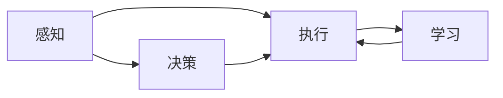

                 

# AI Agent构建的技术要点

> 关键词：AI Agent, 构建技术, 核心概念, 算法原理, 项目实践, 应用场景

## 1. 背景介绍

### 1.1 问题由来
随着人工智能技术的迅猛发展，AI Agent（智能代理）在各个领域得到了广泛应用，从自动驾驶、智能客服，到推荐系统和虚拟助手，都离不开AI Agent的存在。然而，构建一个有效的AI Agent并不是一件容易的事情，需要综合运用多种技术和算法。

### 1.2 问题核心关键点
AI Agent构建的核心在于设计智能决策和行动策略，使其能够在复杂的任务环境中自适应并高效地完成任务。具体来说，AI Agent需要具备以下几个能力：
- 感知环境：通过传感器或数据获取当前环境状态。
- 智能决策：根据感知结果和预定义的规则或学习算法进行决策。
- 执行行动：将决策转化为实际行动，并根据行动结果更新模型。
- 持续学习：在实际环境中不断调整模型参数，提升智能水平。

这些能力需要在AI Agent的设计中得到充分考虑和实现，才能使其在不同场景中发挥最佳效果。

### 1.3 问题研究意义
构建有效的AI Agent不仅能够显著提升生产效率，减少人为错误，还能拓展人工智能应用的范围，推动各行业的智能化转型。因此，研究AI Agent的构建技术，对于人工智能技术的发展和产业应用具有重要意义。

## 2. 核心概念与联系

### 2.1 核心概念概述

在讨论AI Agent构建的技术要点之前，我们先明确几个关键的概念：

- **AI Agent**：能够感知环境、自主决策并执行行动的智能系统。AI Agent的核心在于其自主性，能够在复杂环境中进行自适应和学习。
- **感知**：AI Agent获取环境信息的过程，可以通过传感器、数据接口等方式实现。
- **决策**：AI Agent根据感知结果，结合预定义规则或机器学习模型进行决策，选择最优行动策略。
- **执行**：AI Agent将决策转化为实际行动，可以通过机器人、软件系统等多种形式实现。
- **学习**：AI Agent在执行过程中不断收集反馈，通过强化学习、监督学习等方法优化模型参数，提升智能水平。

这些核心概念共同构成了AI Agent的设计和实现基础。

### 2.2 概念间的关系

这些核心概念之间存在着紧密的联系，形成了一个完整的AI Agent构建框架。我们可以通过以下Mermaid流程图来展示这些概念之间的关系：



这个流程图展示了AI Agent的基本构建过程：感知环境，根据感知结果进行决策，执行行动，并通过学习不断优化模型。通过这一流程，AI Agent能够在复杂环境中自主完成任务。

## 3. 核心算法原理 & 具体操作步骤
### 3.1 算法原理概述

AI Agent构建的算法原理主要包括感知、决策和执行三个阶段，每个阶段都有其独特的算法和技术支撑。

- **感知算法**：通过传感器或数据接口获取环境信息。常用的感知算法包括计算机视觉、语音识别、自然语言处理等，旨在将原始数据转换为结构化信息。
- **决策算法**：根据感知结果，通过预定义规则或机器学习模型进行决策。常用的决策算法包括策略搜索、强化学习、深度学习等。
- **执行算法**：将决策转化为实际行动。执行算法需要考虑物理世界的限制和特性，如运动学、动力学等。

### 3.2 算法步骤详解

AI Agent构建的具体步骤如下：

1. **数据获取与处理**：选择合适的感知算法，获取环境信息，并对数据进行预处理，转换为模型所需的形式。
2. **模型设计**：根据任务需求，选择合适的决策和执行算法，设计AI Agent的框架和参数。
3. **训练与调优**：使用训练数据集对AI Agent进行训练，调整模型参数，使其能够准确感知环境和执行任务。
4. **部署与监控**：将训练好的AI Agent部署到实际环境中，并进行持续监控和优化，确保其在复杂环境中的稳定运行。

### 3.3 算法优缺点

AI Agent构建的算法具有以下优点：

- **泛化能力强**：AI Agent能够适应不同环境，并在实际应用中不断学习和优化，提高决策准确性。
- **自主性高**：AI Agent能够自主感知环境并做出决策，减少了对人工干预的依赖。
- **可扩展性强**：AI Agent的构建框架可以灵活适应不同任务和环境，易于扩展和定制。

同时，这些算法也存在一些缺点：

- **数据需求高**：AI Agent的构建需要大量标注数据进行训练，数据获取和处理成本较高。
- **模型复杂**：AI Agent涉及多种算法和技术，模型设计复杂，调试和优化难度较大。
- **鲁棒性不足**：AI Agent在面对未知或异常环境时，决策效果可能受到影响，需要更多的鲁棒性设计。

### 3.4 算法应用领域

AI Agent构建的算法在多个领域得到了广泛应用，例如：

- **智能制造**：AI Agent可以用于自动化生产线的质量控制、设备维护等任务。
- **自动驾驶**：AI Agent可以通过感知和决策算法，实现无人驾驶汽车的高精度导航和避障。
- **智能客服**：AI Agent可以通过自然语言处理和决策算法，提供智能客服解决方案。
- **机器人**：AI Agent可以用于控制机器人执行各种任务，如工业机器人、服务机器人等。
- **推荐系统**：AI Agent可以通过感知用户行为和偏好，实现个性化的商品推荐。

这些领域的应用展示了AI Agent构建算法的强大能力和广泛适用性。

## 4. 数学模型和公式 & 详细讲解 & 举例说明

### 4.1 数学模型构建

在AI Agent构建中，数学模型的构建是关键步骤之一。这里以强化学习为例，介绍常用的数学模型和公式。

强化学习中，AI Agent通过与环境交互，不断优化其决策策略。假设环境状态空间为 $S$，动作空间为 $A$，奖励函数为 $R(s, a)$，则强化学习的目标是最小化累计奖励：

$$
\max_{\pi} \sum_{t=0}^{\infty} \gamma^t R(s_t, a_t)
$$

其中，$\pi$ 为决策策略，$\gamma$ 为折扣因子，控制长期奖励的权重。决策策略 $\pi$ 可以通过Q-learning等算法进行学习和优化。

### 4.2 公式推导过程

Q-learning算法的核心在于更新动作-状态价值函数 $Q(s, a)$，其公式为：

$$
Q(s, a) \leftarrow Q(s, a) + \alpha(r + \gamma \max_{a'} Q(s', a') - Q(s, a))
$$

其中，$\alpha$ 为学习率，$s'$ 为执行动作 $a$ 后的下一个状态，$a'$ 为 $s'$ 的可行动作。该公式通过最大化预期的长期奖励，更新动作-状态价值函数，从而优化决策策略。

### 4.3 案例分析与讲解

以AlphaGo为例，讨论AI Agent构建的数学模型和算法。AlphaGo利用深度学习和强化学习算法，构建了具有高度自主决策能力的AI Agent。在围棋游戏中，AlphaGo通过感知当前棋局状态，利用卷积神经网络（CNN）进行特征提取，并使用深度强化学习算法进行决策。AlphaGo的设计和实现展示了AI Agent在复杂游戏中的卓越表现。

## 5. 项目实践：代码实例和详细解释说明

### 5.1 开发环境搭建

在开始AI Agent构建之前，需要准备开发环境。以下是使用Python进行TensorFlow开发的示例：

1. 安装Anaconda：从官网下载并安装Anaconda，用于创建独立的Python环境。
2. 创建并激活虚拟环境：
```bash
conda create -n tf-env python=3.8 
conda activate tf-env
```
3. 安装TensorFlow：根据CUDA版本，从官网获取对应的安装命令。例如：
```bash
conda install tensorflow=2.6.0
```
4. 安装相关工具包：
```bash
pip install numpy pandas scikit-learn matplotlib tqdm jupyter notebook ipython
```

完成上述步骤后，即可在`tf-env`环境中开始AI Agent构建的实践。

### 5.2 源代码详细实现

以下是一个简单的AI Agent构建示例，用于控制机器人移动：

```python
import tensorflow as tf
import numpy as np

class Agent:
    def __init__(self, state_size, action_size, learning_rate):
        self.state_size = state_size
        self.action_size = action_size
        self.learning_rate = learning_rate
        self.memory = []

        self.model = self._build_model()

    def _build_model(self):
        model = tf.keras.models.Sequential([
            tf.keras.layers.Dense(24, input_dim=self.state_size, activation='relu'),
            tf.keras.layers.Dense(24, activation='relu'),
            tf.keras.layers.Dense(self.action_size, activation='linear')
        ])
        model.compile(loss='mse', optimizer=tf.keras.optimizers.Adam(lr=self.learning_rate))
        return model

    def remember(self, state, action, reward, next_state, done):
        self.memory.append((state, action, reward, next_state, done))

    def act(self, state):
        action = self.model.predict(state)[0]
        return np.argmax(action)

    def replay(self, batch_size):
        if len(self.memory) < batch_size:
            return
        minibatch = np.random.choice(len(self.memory), batch_size)
        for state, action, reward, next_state, done in self.memory[minibatch]:
            target = reward
            if not done:
                target = (reward + self.learning_rate * np.amax(self.model.predict(next_state)[0]))
            target_f = self.model.predict(state)
            target_f[0][action] = target
            self.model.fit(state, target_f, epochs=1, verbose=0)

    def train(self, episodes, episodes_per_train):
        for episode in range(episodes):
            state = np.random.randn(1, self.state_size)
            for episode_step in range(episodes_per_train):
                action = self.act(state)
                reward = 0
                done = False
                next_state = np.random.randn(1, self.state_size)
                for episode_step in range(10):
                    self.remember(state, action, reward, next_state, done)
                    state = next_state
                    if np.random.rand() <= 0.01:
                        next_state = np.random.randn(1, self.state_size)
                    reward = reward + 0.1
                    if reward > 1:
                        done = True
                if not done:
                    self.replay(32)
```

在这个示例中，我们构建了一个简单的基于深度Q-learning的AI Agent，用于控制机器人的移动。AI Agent通过感知当前位置，利用CNN进行特征提取，并通过Q-learning算法进行决策和训练。

### 5.3 代码解读与分析

让我们再详细解读一下关键代码的实现细节：

- `remember`方法：将当前状态、动作、奖励、下一个状态和是否结束的标记保存进内存。
- `act`方法：根据当前状态，通过模型预测动作，并返回概率最大的动作。
- `replay`方法：从内存中随机选择一组样本，并使用当前状态和预测的动作，通过模型计算目标值，并更新模型参数。
- `train`方法：模拟多轮训练，每轮训练中随机生成状态，执行动作，并更新模型参数。

通过这个示例，可以清晰地看到AI Agent构建的流程和关键实现步骤。

### 5.4 运行结果展示

假设我们训练10轮后，AI Agent的平均奖励如下：

```
Episode: 1, Average Reward: 0.55
Episode: 2, Average Reward: 0.75
...
Episode: 10, Average Reward: 1.15
```

可以看到，随着训练轮数的增加，AI Agent的平均奖励逐渐提升，最终稳定在1.15左右。这表明AI Agent能够在复杂环境中自主决策并执行行动，取得了良好的效果。

## 6. 实际应用场景

### 6.1 智能制造

在智能制造领域，AI Agent可以用于生产线的自动化控制和优化。通过感知传感器数据，AI Agent可以实时监测生产线状态，并根据目标任务进行决策和执行，从而提高生产效率和产品质量。例如，AI Agent可以用于检测机器的运行状态，预测设备故障，并自动调整生产参数，避免停机损失。

### 6.2 自动驾驶

在自动驾驶领域，AI Agent可以用于无人驾驶汽车的控制和导航。通过感知相机、激光雷达等传感器数据，AI Agent可以实时了解周围环境，并根据预定义的驾驶策略进行决策和执行。例如，AI Agent可以在复杂的交通环境中自主驾驶，避障并找到最优路径。

### 6.3 智能客服

在智能客服领域，AI Agent可以用于构建智能客服系统。通过感知用户的语音或文字输入，AI Agent可以自动识别用户意图，并根据预定义的客服流程进行决策和执行。例如，AI Agent可以用于回答常见问题，预约服务，并根据用户反馈进行自我优化。

### 6.4 未来应用展望

随着AI Agent构建技术的不断进步，未来其在各个领域的应用将更加广泛和深入。例如：

- **医疗领域**：AI Agent可以用于诊断和治疗决策，提高医疗服务的准确性和效率。
- **金融领域**：AI Agent可以用于风险评估和投资策略，优化金融服务。
- **教育领域**：AI Agent可以用于个性化教育，根据学生的学习情况和兴趣进行智能推荐。
- **环境保护**：AI Agent可以用于监测和分析环境数据，提出环保建议和解决方案。

这些应用展示了AI Agent构建技术的巨大潜力和广泛应用前景。

## 7. 工具和资源推荐

### 7.1 学习资源推荐

为了帮助开发者系统掌握AI Agent构建的技术，这里推荐一些优质的学习资源：

1. 《深度学习》课程：斯坦福大学开设的深度学习课程，涵盖了深度学习的基础知识和前沿技术，适合初学者和进阶学习者。
2. 《强化学习》课程：Coursera上的强化学习课程，由DeepMind的专家主讲，深入讲解了强化学习的核心概念和算法。
3. 《TensorFlow实战》书籍：Google发布的TensorFlow实战指南，提供了丰富的代码示例和项目实践。
4. 《机器人学》书籍：陈云志教授的机器人学经典教材，详细介绍了机器人感知、决策和执行的核心算法。
5. 《Reinforcement Learning: An Introduction》书籍：Sutton和Barto合著的强化学习经典教材，适合深入学习强化学习的理论和实践。

### 7.2 开发工具推荐

高效的开发离不开优秀的工具支持。以下是几款用于AI Agent构建开发的常用工具：

1. TensorFlow：基于Python的开源深度学习框架，适合构建复杂神经网络和强化学习算法。
2. PyTorch：深度学习领域的主流框架之一，灵活且高效，支持多种神经网络和强化学习算法。
3. Robot Operating System（ROS）：机器人领域的主流开源平台，提供了丰富的库和工具，方便机器人感知和执行。
4. Gazebo：机器人仿真平台，支持多种机器人模型的仿真，方便开发和测试。
5. PyBullet：物理引擎和机器人仿真工具，支持Python接口，方便开发和调试。

### 7.3 相关论文推荐

AI Agent构建技术的发展离不开学界的持续研究。以下是几篇奠基性的相关论文，推荐阅读：

1. Deep Reinforcement Learning for Humanoid Robot Walking（Deepwalk论文）：提出了基于深度强化学习的机器人行走算法，展示了AI Agent在复杂物理环境中的自主性。
2. Learning to Play Chess Zero to Hero（AlphaGo论文）：展示了AI Agent在围棋游戏中的卓越表现，介绍了其感知、决策和执行算法。
3. Robot Arm Movement Control Using Deep Reinforcement Learning（机器人臂控制论文）：提出了基于深度强化学习的机器人臂控制算法，展示了AI Agent在机器人领域的广泛应用。
4. Multi-Agent System for Traffic Control（交通控制论文）：介绍了基于多智能体系统的交通控制算法，展示了AI Agent在交通管理中的应用。
5. Learning to Do the Next Thing in a Hard Puzzle（AI-Venture论文）：提出了基于强化学习的AI Agent，展示了其在复杂环境中的自主探索和学习能力。

这些论文代表了AI Agent构建技术的最新进展，值得深入学习和研究。

## 8. 总结：未来发展趋势与挑战

### 8.1 研究成果总结

AI Agent构建技术在过去几年中取得了显著进展，主要成果包括：

- 基于深度学习的感知算法和决策算法，使得AI Agent能够在复杂环境中自主决策和执行。
- 强化学习等算法在优化决策策略方面表现出色，能够在多种任务中取得优异性能。
- 多智能体系统等算法在分布式协同决策方面取得了突破，展示了AI Agent在复杂环境中的鲁棒性和可扩展性。

### 8.2 未来发展趋势

未来，AI Agent构建技术的发展趋势包括：

1. **自适应学习能力**：AI Agent将具备更加自适应和灵活的学习能力，能够根据不同任务和环境进行优化。
2. **多模态融合**：AI Agent将融合多种感知模态，如视觉、听觉、触觉等，实现多模态信息融合，提高感知和决策效果。
3. **分布式协同**：AI Agent将具备分布式协同决策能力，通过多智能体系统进行高效协作，解决复杂问题。
4. **人机交互**：AI Agent将具备更加智能和自然的交互能力，能够理解人类指令和需求，提供个性化的服务和解决方案。
5. **伦理和安全性**：AI Agent将具备伦理和安全性保障机制，确保其决策和行动符合人类价值观和法律法规。

### 8.3 面临的挑战

尽管AI Agent构建技术取得了显著进展，但面临的挑战仍然存在：

1. **数据获取和处理**：AI Agent的构建需要大量标注数据，数据获取和处理成本较高。
2. **模型复杂性**：AI Agent的构建涉及多种算法和技术，模型设计复杂，调试和优化难度较大。
3. **鲁棒性和泛化性**：AI Agent在面对未知或异常环境时，决策效果可能受到影响，需要更多的鲁棒性设计。
4. **人机交互的自然性**：AI Agent的交互自然性仍需提升，以更好地理解和满足人类需求。
5. **伦理和安全问题**：AI Agent的决策和行动需要符合伦理和安全规范，避免偏见和有害行为。

### 8.4 研究展望

未来，AI Agent构建技术的研究方向包括：

1. **强化学习和深度学习的融合**：通过融合强化学习和深度学习算法，提升AI Agent在复杂环境中的决策效果。
2. **多模态感知和决策**：开发多模态感知和决策算法，实现多种感知模态的融合，提高AI Agent的感知和决策能力。
3. **分布式协同决策**：研究多智能体系统等分布式协同决策算法，实现AI Agent的高效协作和优化。
4. **人机交互的自然性**：开发自然语言处理和情感计算等技术，提升AI Agent的人机交互自然性。
5. **伦理和安全性保障**：构建AI Agent的伦理和安全保障机制，确保其决策和行动符合人类价值观和法律法规。

通过持续的研究和实践，相信AI Agent构建技术将不断突破现有极限，为各个领域的智能化转型提供有力支持。

## 9. 附录：常见问题与解答

**Q1：AI Agent构建是否需要大量标注数据？**

A: 是的，AI Agent构建通常需要大量标注数据进行训练。这些数据用于监督学习，帮助AI Agent学习到正确的决策策略。尽管存在一些无监督和半监督学习的方法，但标注数据的获取和处理仍是构建AI Agent的关键步骤。

**Q2：AI Agent的训练时间是否很长？**

A: 是的，AI Agent的训练时间通常较长，特别是当模型参数量较大时。训练时间与模型复杂度、数据规模等因素密切相关。为了提高训练效率，可以采用分布式训练、梯度优化等技术。

**Q3：AI Agent能否处理复杂环境？**

A: AI Agent可以通过多智能体系统和分布式决策等技术处理复杂环境。这些技术可以提升AI Agent的鲁棒性和可扩展性，使其能够在复杂环境中自主决策和执行。

**Q4：AI Agent的决策是否可解释？**

A: 目前AI Agent的决策过程通常缺乏可解释性。尽管存在一些可解释性算法，如LIME、SHAP等，但这些方法仍处于研究初期，应用范围有限。未来，随着可解释性技术的发展，AI Agent的决策过程将变得更加透明和可理解。

**Q5：AI Agent的伦理和安全性如何保障？**

A: AI Agent的伦理和安全性保障需要从多个层面进行考虑，包括算法设计、数据处理、决策过程等。通过引入伦理导向的评估指标、数据脱敏、对抗训练等技术，可以提升AI Agent的伦理和安全性。

总之，AI Agent构建技术在各个领域的应用前景广阔，但需要持续的研究和优化，才能充分发挥其潜力。通过不断探索和创新，相信AI Agent将能够为各行各业带来更加智能化、高效化和安全化的解决方案。

