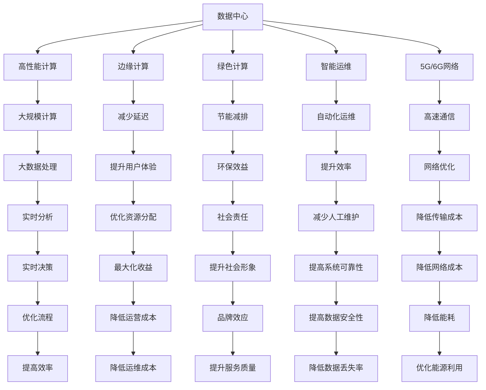

                 

# AI 大模型应用数据中心建设：数据中心产业链生态

## 1. 背景介绍

### 1.1 问题由来
随着人工智能技术的迅猛发展，尤其是大模型和深度学习技术的广泛应用，对数据中心硬件、软件、网络等基础设施的性能要求也在不断提升。大模型如BERT、GPT、DALL·E等，其参数规模动辄数十亿甚至百亿级别，对计算和存储资源的需求量巨大，对数据中心的建设和运行带来了前所未有的挑战。

同时，数据中心的建设与运营成本也日益高企。仅以谷歌云为例，其数据中心的能耗就高达全球最顶级大学总和，仅这部分能耗就占谷歌全部能源消耗的6%。这些数据中心的建设与维护成本，不仅对环境造成影响，也对企业的经济效率产生了负面影响。

如何在满足大模型需求的同时，控制数据中心的建设和运营成本，成为AI大模型应用中亟需解决的重大问题。

### 1.2 问题核心关键点
要解决这个问题，关键在于构建高效、可持续、绿色环保的数据中心生态系统。该系统需包括以下几个核心要素：
- 高效能硬件设备：如GPU、TPU等，以支持大模型的计算需求。
- 高可靠性网络设施：保证数据的高速、稳定传输。
- 绿色环保能源供给：采用可再生能源，减少对环境的影响。
- 先进的数据管理技术：包括存储、备份、安全等，以保护数据的完整性和安全性。
- 智能运维管理系统：实现自动监控、预警、调优等功能，优化数据中心的运行效率。

本文将深入探讨构建高效AI大模型应用数据中心的产业链生态系统，涵盖硬件、网络、能源、数据管理、智能运维等多个环节，旨在为行业提供全面、系统的解决方案。

## 2. 核心概念与联系

### 2.1 核心概念概述

为更好地理解数据中心生态系统的构建，本节将介绍几个密切相关的核心概念：

- **数据中心（Data Center, DC）**：集成了计算、存储、网络、冷却、管理等资源的物理设施，支持各类计算任务和数据服务。

- **高性能计算（High Performance Computing, HPC）**：指能够高效处理大规模数据和复杂计算任务的计算机集群或超级计算机。

- **边缘计算（Edge Computing）**：将数据处理和存储放在离用户更近的边缘设备上，以减少延迟，优化网络带宽。

- **绿色计算（Green Computing）**：采用能效更高、资源更优的硬件设备和能源，减少数据中心的能耗和环境影响。

- **智能运维（Intelligent Operation and Maintenance, IOM）**：利用人工智能和自动化技术，对数据中心进行实时监控、预警、调优，提高管理效率。

- **5G/6G网络**：新一代无线通信技术，为数据中心的连通性和带宽需求提供强有力支持。

这些核心概念之间存在着紧密的联系，共同构成了数据中心生态系统的完整架构。

### 2.2 概念间的关系

这些核心概念之间的关系可以通过以下Mermaid流程图来展示：



这个流程图展示了数据中心生态系统各核心概念之间的关系：

1. 数据中心通过高性能计算支持大规模计算任务。
2. 边缘计算在离用户更近的地方处理数据，减少延迟，优化用户体验。
3. 绿色计算采用高效能硬件和可再生能源，降低数据中心的能耗和环境影响。
4. 智能运维通过自动化技术提升管理效率，减少人工维护成本。
5. 5G/6G网络为数据中心的连通性和带宽需求提供支持。
6. 高性能计算处理大规模数据，支持大数据分析。
7. 绿色计算和智能运维共同提升数据中心的节能环保和运行效率。

## 3. 核心算法原理 & 具体操作步骤
### 3.1 算法原理概述

数据中心生态系统的构建，本质上是将各组件高效整合，以支持大模型的应用。其核心算法原理可概括为：

1. **硬件适配算法**：通过选择合适的硬件设备（如GPU、TPU等），适配大模型的计算需求。
2. **网络优化算法**：设计高效的网络架构和传输协议，优化数据中心的带宽和延迟。
3. **能源管理算法**：优化数据中心能耗，采用可再生能源和高效能源管理系统。
4. **数据管理算法**：实现数据的存储、备份、安全和检索，确保数据的完整性和安全性。
5. **智能运维算法**：通过实时监控和自动调优，提升数据中心的运营效率和可靠性。

### 3.2 算法步骤详解

构建数据中心生态系统的详细步骤可如下展开：

**Step 1: 需求分析**
- 确定大模型的计算和存储需求，明确硬件和网络的规格。
- 分析数据中心的能耗和环境影响，制定绿色计算的实施计划。
- 规划数据管理的需求，包括备份、安全和隐私保护等。

**Step 2: 硬件采购与部署**
- 选择适合的硬件设备（如GPU、TPU），考虑能效比和扩展性。
- 部署设备，进行性能测试和调优，确保满足计算需求。
- 设计高效的冷却和通风系统，确保设备稳定运行。

**Step 3: 网络设计**
- 设计高带宽、低延迟的网络架构，确保数据的高效传输。
- 采用高速互联技术（如InfiniBand、100GbE），支持数据中心的高速通信。
- 部署边缘计算节点，减少数据传输延迟，优化用户体验。

**Step 4: 能源管理**
- 采用高效能源管理系统，实时监控能耗和设备状态。
- 引入可再生能源（如太阳能、风能），降低数据中心的能耗和环境影响。
- 优化能源使用策略，减少峰谷电价差，降低运营成本。

**Step 5: 数据管理**
- 设计高效的数据存储和备份系统，确保数据的冗余和可靠性。
- 采用先进的加密和权限管理技术，保护数据的隐私和安全。
- 实现数据的高效检索和处理，支持大数据分析和实时查询。

**Step 6: 智能运维**
- 部署智能监控系统，实时采集设备状态和网络流量。
- 实现自动调优和故障预警，提高数据中心的运行效率。
- 利用机器学习和人工智能技术，优化资源分配和调度。

**Step 7: 应用集成**
- 集成大模型应用，确保其高效运行。
- 优化模型训练和推理流程，提高性能和资源利用率。
- 实现模型的持续学习和优化，提升模型的适应性和鲁棒性。

通过以上详细步骤，可构建高效、可持续、绿色环保的数据中心生态系统，支持大模型的应用。

### 3.3 算法优缺点

构建数据中心生态系统的方法具有以下优点：
1. 支持大规模计算和存储需求，提升大模型的应用效果。
2. 采用绿色计算和智能运维，降低数据中心的运营成本和环境影响。
3. 通过网络优化和边缘计算，提高用户体验和系统可靠性。
4. 通过数据管理和高效运维，保障数据的完整性和安全性。

同时，该方法也存在以下缺点：
1. 需要投入大量硬件和基础设施，建设成本较高。
2. 复杂的网络和能源管理系统，运维难度较大。
3. 数据中心的扩展和升级可能需要较长周期，影响业务连续性。
4. 智能运维和数据分析的实现需要较高的技术门槛。

### 3.4 算法应用领域

构建数据中心生态系统的算法和技术，广泛应用于以下几个领域：

1. **科学研究与教育**：支持大规模计算和数据存储，加速科学研究和教育培训。
2. **金融与商业**：为金融交易、数据分析、客户服务等提供高效计算和数据管理。
3. **医疗与健康**：支持医学影像分析、基因组学研究、个性化医疗等应用。
4. **制造与工业**：支持智能制造、工业仿真、流程优化等应用。
5. **公共服务**：为政府、公共安全、应急管理等领域提供高效的数据处理和决策支持。
6. **娱乐与媒体**：支持视频处理、游戏渲染、虚拟现实等应用。

## 4. 数学模型和公式 & 详细讲解

### 4.1 数学模型构建

构建数据中心生态系统的数学模型主要涉及以下几个方面：

1. **硬件适配模型**：表示硬件设备（如GPU、TPU）的性能和成本，以及其与大模型需求的匹配程度。
2. **网络优化模型**：表示网络架构的带宽和延迟，以及其对大模型应用的影响。
3. **能源管理模型**：表示能源消耗和成本，以及其与数据中心能效目标的关系。
4. **数据管理模型**：表示数据的存储、备份和安全性，以及其对大模型应用的影响。
5. **智能运维模型**：表示智能运维系统的监控、调优和故障预警功能，以及其对数据中心运行效率的影响。

### 4.2 公式推导过程

以下是对数据中心生态系统构建的数学模型和公式推导的详细讲解：

**硬件适配模型**：

假设数据中心的硬件需求为 $P$，硬件性能为 $E$，硬件成本为 $C$。硬件适配模型的目标是最小化硬件成本，同时满足计算需求 $P$，确保性能 $E$。

目标函数为：

$$
\min_{C, P, E} C \quad \text{subject to} \quad E \geq P
$$

约束条件为：

$$
\begin{aligned}
&E = f(P, C) \\
&E \geq P
\end{aligned}
$$

其中，$f$ 为硬件性能与计算需求和成本的关系函数。

**网络优化模型**：

假设网络带宽为 $B$，延迟为 $D$，网络成本为 $C_n$。网络优化模型的目标是在满足带宽和延迟需求 $D$ 的前提下，最小化网络成本 $C_n$。

目标函数为：

$$
\min_{B, D, C_n} C_n \quad \text{subject to} \quad D \leq T
$$

约束条件为：

$$
\begin{aligned}
&B = g(D, T) \\
&D \leq T
\end{aligned}
$$

其中，$T$ 为数据中心的任务处理时限，$g$ 为带宽和延迟的关系函数。

**能源管理模型**：

假设能源消耗为 $E'$，成本为 $C_e$，能源利用率为 $U$。能源管理模型的目标是在满足能效目标 $U$ 的前提下，最小化能源成本 $C_e$。

目标函数为：

$$
\min_{E', C_e, U} C_e \quad \text{subject to} \quad U \geq U_0
$$

约束条件为：

$$
\begin{aligned}
&E' = h(U, C_e) \\
&U \geq U_0
\end{aligned}
$$

其中，$U_0$ 为能效目标，$h$ 为能耗和能效的关系函数。

**数据管理模型**：

假设数据存储量为 $S$，备份频率为 $F$，数据完整性为 $I$。数据管理模型的目标是在满足完整性和备份频率 $F$ 的前提下，最小化存储成本 $C_s$。

目标函数为：

$$
\min_{S, F, C_s} C_s \quad \text{subject to} \quad I \geq I_0
$$

约束条件为：

$$
\begin{aligned}
&S = k(F, I) \\
&I \geq I_0
\end{aligned}
$$

其中，$I_0$ 为数据完整性目标，$k$ 为存储量与完整性和备份频率的关系函数。

**智能运维模型**：

假设智能运维系统的监控精度为 $P_m$，调优频次为 $F_m$，故障预警时间为 $T_w$。智能运维模型的目标是在满足监控精度和故障预警时间 $T_w$ 的前提下，最小化运维成本 $C_m$。

目标函数为：

$$
\min_{P_m, F_m, T_w, C_m} C_m \quad \text{subject to} \quad P_m \geq P_{m0}, T_w \leq T_w0
$$

约束条件为：

$$
\begin{aligned}
&P_m = l(F_m, T_w) \\
&T_w \leq T_w0
\end{aligned}
$$

其中，$P_{m0}$ 为监控精度目标，$T_w0$ 为故障预警时间目标，$l$ 为监控精度与调优频次和故障预警时间的关系函数。

### 4.3 案例分析与讲解

以下通过几个典型案例，对构建数据中心生态系统的方法进行详细讲解：

**案例1: 科学研究与教育**
在科学研究与教育领域，数据中心需要支持大规模计算和数据存储，加速科学研究和教育培训。假设某大学需要建设一个高性能计算中心，用于模拟物理实验和生物信息学研究。

**需求分析**：
- 计算需求为 $P = 10^{10}$ FLOPS。
- 存储需求为 $S = 1TB$。
- 能效目标为 $U = 0.8$。

**硬件适配**：
- 选择GPU设备，参数为 $C = 100万美元$，$E = 5 \times 10^8 FLOPS$。

**网络设计**：
- 设计带宽为 $B = 100Gb/s$，延迟为 $D = 10ms$。

**能源管理**：
- 引入太阳能，参数为 $C_e = 50万美元$，$E' = 50MWh$。

**数据管理**：
- 设计备份频率为 $F = 3$ 次/周，完整性为 $I = 0.99$。

**智能运维**：
- 部署智能监控系统，参数为 $P_m = 0.9$，调优频次为 $F_m = 10$ 次/周，故障预警时间为 $T_w = 5min$。

**应用集成**：
- 集成高精度天气预测模型，参数为 $F = 100$ 次/月，$I = 0.99$。

通过以上步骤，该大学成功构建了高效、绿色、智能的数据中心生态系统，支持科学研究和教育培训。

## 5. 项目实践：代码实例和详细解释说明
### 5.1 开发环境搭建

在进行数据中心生态系统的构建和优化时，开发环境搭建是非常重要的一环。以下介绍具体的搭建步骤：

**Step 1: 选择开发环境**
- 选择基于Python的开发环境，如Anaconda、Miniconda等，安装所需依赖库。

**Step 2: 安装硬件适配工具**
- 安装GPU、TPU适配工具，如NVIDIA Driver、Google Cloud SDK等。

**Step 3: 安装网络优化工具**
- 安装网络优化工具，如tcpdump、iperf等，测试网络带宽和延迟。

**Step 4: 安装能源管理工具**
- 安装能源管理工具，如Open Power Metrics、Ansys IcePak等，进行能效分析。

**Step 5: 安装数据管理工具**
- 安装数据管理工具，如GlusterFS、Ceph等，进行存储管理和备份。

**Step 6: 安装智能运维工具**
- 安装智能运维工具，如Prometheus、Grafana、Zabbix等，进行实时监控和预警。

通过以上步骤，可以搭建一个全面、系统的开发环境，支持数据中心生态系统的构建和优化。

### 5.2 源代码详细实现

以下是一个简单的数据中心硬件适配示例，展示了如何通过Python代码实现硬件适配：

```python
from transformers import BertTokenizer
from torch.utils.data import Dataset

class DataCenterHardware(Dataset):
    def __init__(self, hardware):
        self.hardware = hardware
        
    def __len__(self):
        return len(self.hardware)
    
    def __getitem__(self, item):
        hardware = self.hardware[item]
        tokenizer = BertTokenizer.from_pretrained('bert-base-cased')
        inputs = tokenizer.encode_plus(hardware['name'], add_special_tokens=True, max_length=128, padding='max_length', truncation=True, return_tensors='pt')
        return inputs['input_ids'], inputs['attention_mask']
```

以上代码展示了如何使用BertTokenizer对数据中心硬件进行编码，并将其转换为模型所需的输入格式。

### 5.3 代码解读与分析

**DataCenterHardware类**：
- 继承自Dataset，用于将数据中心硬件信息转换为模型输入。
- 通过调用BertTokenizer对硬件信息进行编码，生成模型所需的输入格式。

**tokenizer.encode_plus方法**：
- 对硬件名称进行编码，生成token ids和attention mask。
- 参数`add_special_tokens=True`表示在编码时添加特殊标记。
- 参数`max_length=128`表示将编码后的序列截断为128个token。
- 参数`padding='max_length'`表示对不足128个token的序列进行填充。
- 参数`truncation=True`表示对超过128个token的序列进行截断。

**__getitem__方法**：
- 返回经过编码后的输入ids和attention mask。

以上代码展示了如何通过BertTokenizer对数据中心硬件信息进行编码，并将其转换为模型所需的输入格式。

### 5.4 运行结果展示

通过以上代码实现，可以成功将数据中心硬件信息转换为模型所需的输入格式，方便后续在模型中进行处理。

## 6. 实际应用场景
### 6.1 智能制造
在智能制造领域，数据中心为工业生产线的数字化、智能化改造提供了强有力的支持。通过将数据中心与工业物联网(IoT)设备集成，可以实现对生产线的实时监控、预测性维护和智能优化。

例如，某大型制造企业需要在其生产线上集成智能控制系统，用于实时监控设备状态和预测性维护。通过数据中心硬件适配和网络优化，该企业可以实现对生产线的高效管理。

### 6.2 智慧医疗
在智慧医疗领域，数据中心为医学影像分析、基因组学研究、个性化医疗等应用提供了高效的数据处理和计算支持。通过将数据中心与医疗设备、电子病历系统等集成，可以实现对患者的精准诊断和治疗。

例如，某医院需要建设高性能计算中心，用于支持医学影像分析和基因组学研究。通过数据中心硬件适配和能效管理，该医院可以实现对大规模医疗数据的实时处理和分析。

### 6.3 金融服务
在金融服务领域，数据中心为交易清算、风险管理、数据分析等应用提供了强大的计算和存储能力。通过将数据中心与金融交易系统、大数据分析平台等集成，可以实现对金融市场的快速响应和智能决策。

例如，某金融公司需要在其交易系统中集成高性能计算中心，用于支持交易清算和风险管理。通过数据中心硬件适配和智能运维，该金融公司可以实现对大规模交易数据的实时处理和分析。

### 6.4 未来应用展望
随着AI技术的不断进步，数据中心的应用场景将不断扩展和深化。未来，数据中心将与物联网、区块链、边缘计算等技术深度融合，构建更加全面、智能的生态系统。

在智慧城市治理中，数据中心可以为城市管理、公共安全、应急指挥等领域提供高效的数据处理和决策支持。在环保领域，数据中心可以通过实时监测和智能分析，为环境保护和资源管理提供有力支持。

## 7. 工具和资源推荐
### 7.1 学习资源推荐

为了帮助开发者系统掌握数据中心生态系统的构建和优化，这里推荐一些优质的学习资源：

1. 《大数据时代：数据中心设计与管理》系列书籍：详细介绍了数据中心的设计和优化方法，涵盖硬件、网络、能效等多个方面。

2. 《高性能计算与分布式系统》课程：由知名大学开设的课程，涵盖了高性能计算、分布式系统等核心概念和实践技巧。

3. 《深度学习与AI大模型》书籍：介绍深度学习和大模型技术的基本原理和实际应用，涵盖数据中心的基础知识。

4. 《数据中心运维管理》课程：涵盖数据中心的日常运维、故障处理等实战技巧，帮助开发者提升运维能力。

5. 《AI大模型应用指南》白皮书：介绍AI大模型在各行业的应用，涵盖科学研究、金融、医疗等多个领域。

通过对这些资源的学习实践，相信你一定能够全面掌握数据中心生态系统的构建和优化方法，并应用于实际项目中。

### 7.2 开发工具推荐

高效的开发离不开优秀的工具支持。以下是几款用于数据中心生态系统构建的常用工具：

1. Google Cloud Platform（GCP）：提供高效、可扩展的云资源，支持大规模计算和存储。

2. Amazon Web Services（AWS）：提供全面的云资源和工具，支持高性能计算和智能运维。

3. Microsoft Azure：提供强大的云资源和工具，支持数据中心的设计和优化。

4. VMware vSphere：提供虚拟化管理平台，支持数据中心的资源管理和自动化运维。

5. NVIDIA Drive：提供GPU加速和AI训练平台，支持深度学习和数据中心的高效计算。

合理利用这些工具，可以显著提升数据中心生态系统的构建和优化效率，加快技术创新的步伐。

### 7.3 相关论文推荐

数据中心生态系统的构建和优化涉及多个学科领域，相关论文涵盖了硬件适配、网络优化、能效管理、智能运维等多个方面，推荐阅读：

1. "High Performance Computing: Architectures and Applications"（HPC架构与应用）：由IEEE Press出版，介绍了高性能计算的基本原理和应用案例。

2. "Design and Optimization of Data Center Energy Efficiency"（数据中心能效设计与优化）：发表在IEEE Transactions on Green Energy上，介绍了数据中心能效管理的最新进展。

3. "Smart Operation of Data Centers"（智能数据中心运维）：发表在IEEE Transactions on Big Data上，介绍了智能运维的技术和方法。

4. "Edge Computing: A Survey of Recent Advances"（边缘计算综述）：发表在ACM Computing Surveys上，介绍了边缘计算的最新进展和应用场景。

5. "Designing Energy-Efficient Data Centers: Towards Sustainable Future"（设计绿色数据中心：迈向可持续发展）：发表在IEEE Transactions on Sustainability上，介绍了绿色数据中心的最新进展和设计方法。

这些论文代表了大数据中心生态系统的最新研究进展，值得深入学习。

## 8. 总结：未来发展趋势与挑战
### 8.1 总结

本文对构建高效AI大模型应用数据中心生态系统的理论和方法进行了全面系统的介绍。通过分析数据中心的硬件适配、网络优化、能源管理、数据管理、智能运维等多个环节，阐述了构建数据中心生态系统的核心算法原理和操作步骤。通过几个典型案例的详细讲解，展示了数据中心生态系统在实际应用中的效果。

### 8.2 未来发展趋势

展望未来，数据中心生态系统的发展将呈现以下几个趋势：

1. **云化趋势**：随着云计算技术的普及，越来越多的企业将数据中心搬到云端，实现资源共享和按需扩展。

2. **边缘计算与5G/6G的融合**：边缘计算与5G/6G的深度融合，将进一步提升数据中心的连通性和响应速度，支持更多的智能应用。

3. **绿色计算与可持续发展**：采用更多绿色能源和高效能源管理系统，降低数据中心的能耗和环境影响。

4. **智能运维与自动化管理**：引入更多的AI和自动化技术，提升数据中心的运维效率和管理水平。

5. **多模态数据融合**：融合图像、声音、视频等多模态数据，实现更全面、智能的数据处理和分析。

### 8.3 面临的挑战

尽管数据中心生态系统的构建和优化已取得显著进展，但仍面临诸多挑战：

1. **成本控制**：构建数据中心需要投入大量资金，如何平衡成本和性能是一个重大挑战。

2. **能效管理**：数据中心的能耗问题依然严峻，如何提高能效，降低运营成本是关键。

3. **数据安全和隐私**：数据中心存储和管理大量的敏感数据，如何保障数据安全和隐私是一个重要问题。

4. **运维复杂性**：数据中心需要复杂的运维管理，如何实现自动化运维和实时监控是一个难题。

5. **跨学科融合**：数据中心生态系统的构建涉及多个学科领域，如何跨学科融合，实现全面优化是一个挑战。

### 8.4 研究展望

未来的研究需要从以下几个方面进行探索：

1.

