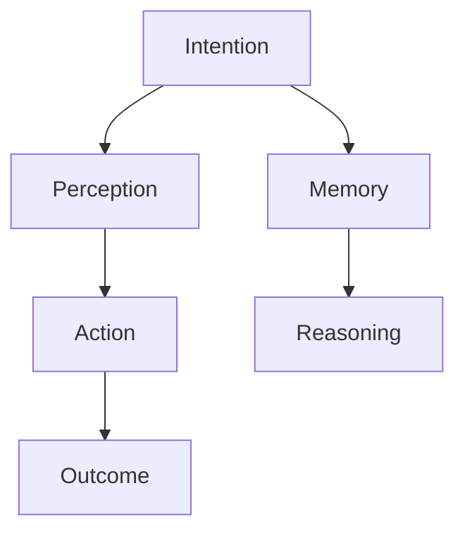
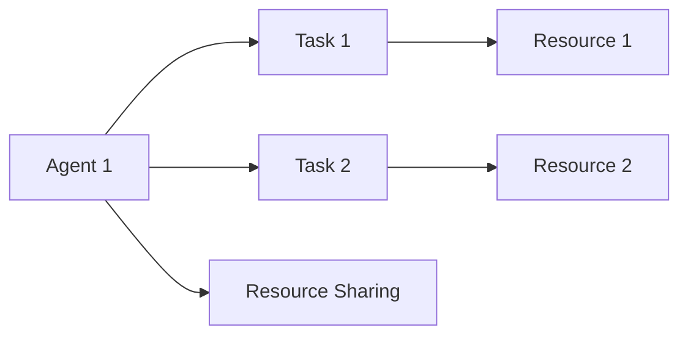
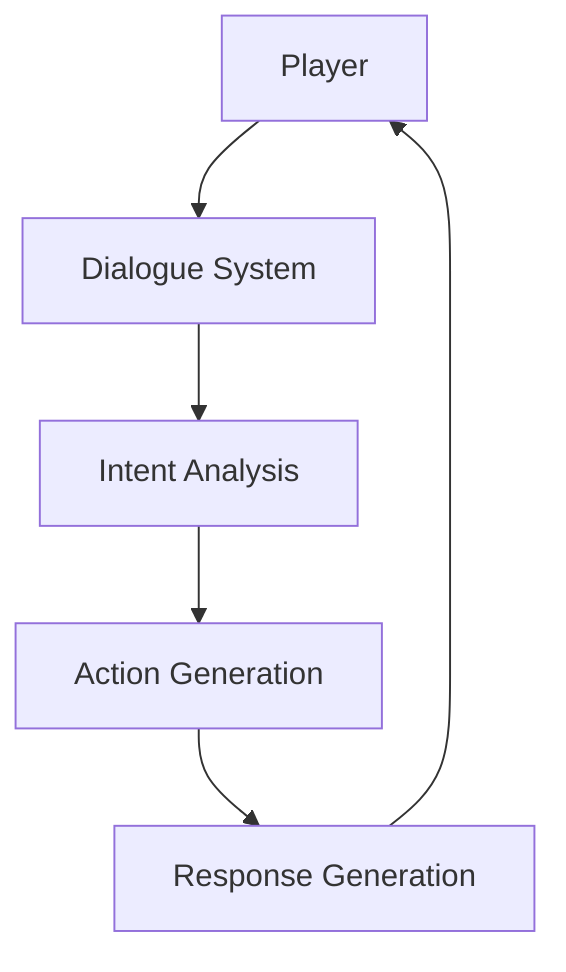
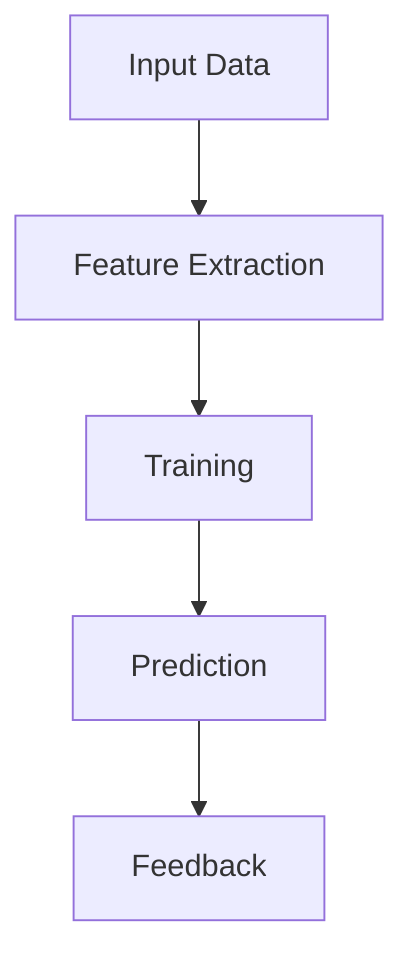
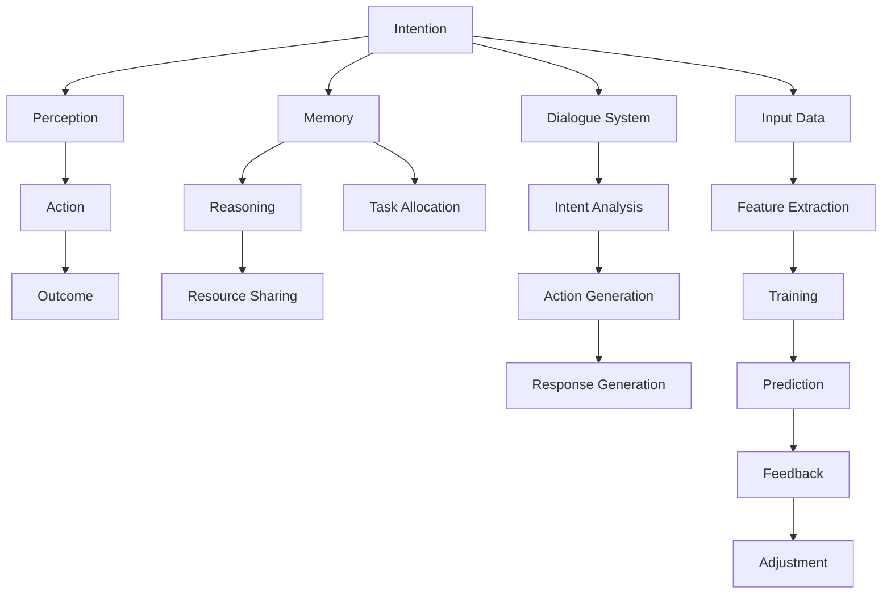

                 

# AI人工智能代理工作流 AI Agent WorkFlow：在游戏设计中的应用

> 关键词：人工智能,代理,工作流,游戏设计,自动生成,决策树,自然语言处理(NLP),深度学习,多智能体系统,智能AI

## 1. 背景介绍

### 1.1 问题由来
在现代游戏设计中，开发者常常需要耗费大量时间和资源进行角色生成、场景构建、故事情节设计等任务。这些任务不仅复杂繁琐，且需要具备丰富的艺术创造力和情感理解力，普通开发者难以独立完成。

此外，在多人在线游戏（MOG）中，真实玩家数量众多，并且玩家行为随机性强，游戏服务器需要快速响应和处理大量并发请求，这对系统架构和实时性能提出了很高的要求。因此，传统游戏设计方法往往难以应对日益复杂的市场需求，迫切需要引入新型的技术手段。

### 1.2 问题核心关键点
人工智能（AI）代理工作流（AI Agent Workflow）技术应运而生，成为解决上述问题的重要手段。该技术通过构建多个智能AI代理，协同合作，自动生成游戏内容，进行实时决策和任务调度，从而大幅提升游戏设计的效率和游戏体验。

AI代理工作流技术主要关注以下几个关键点：
1. **多智能体协作**：多个AI代理之间需要协同合作，根据任务分配策略和优先级管理，合理分配资源和任务。
2. **实时决策**：AI代理需要在实时环境中快速响应玩家操作，进行决策和行动，保证游戏流畅和稳定。
3. **自动化生成**：AI代理可以根据玩家反馈和系统需求，自动生成或调整游戏元素，包括角色、场景、故事情节等。
4. **自然语言处理（NLP）**：AI代理通过NLP技术，可以理解和回应玩家对话，实现智能交互和情感分析。
5. **深度学习**：AI代理通过深度学习技术，可以学习和优化决策策略，提升游戏智能性和玩家体验。

### 1.3 问题研究意义
AI代理工作流技术在游戏设计中的应用，具有以下重要意义：

1. **提高设计效率**：通过自动化生成和协同合作，大幅减少人工工作量，缩短游戏开发周期。
2. **优化玩家体验**：AI代理可以在实时环境中快速响应玩家需求，提供高质量的游戏内容和服务。
3. **拓展游戏类型**：AI代理可以支持复杂的多人在线游戏，提升游戏的可玩性和互动性。
4. **推动游戏创新**：AI代理工作流技术为游戏创新提供了新的思路和工具，可以探索新的游戏模式和交互方式。
5. **促进产业升级**：游戏产业可以通过AI代理技术提高生产力和创新能力，加速向高端化、智能化方向发展。

## 2. 核心概念与联系

### 2.1 核心概念概述

为更好地理解AI代理工作流技术在游戏设计中的应用，本节将介绍几个密切相关的核心概念：

- **人工智能（AI）**：使用计算机模拟人类智能过程的技术，包括学习、推理、决策等能力。
- **智能代理（AI Agent）**：在特定环境中自动执行任务的程序或系统，通过感知和行动实现目标。
- **工作流（Workflow）**：一组相互关联的自动化步骤或过程，用于完成特定任务。
- **自然语言处理（NLP）**：使计算机理解和处理人类语言的技术，包括文本分析、语义理解、情感分析等。
- **多智能体系统（Multi-Agent System,MAS）**：由多个智能体组成的分布式系统，各个智能体通过协作和竞争进行任务分配和资源管理。
- **深度学习（Deep Learning,DL）**：利用神经网络进行模型训练，可以从数据中学习到高层次的抽象特征，广泛应用于图像、语音、文本等领域。
- **决策树（Decision Tree）**：一种基于树形结构的决策支持工具，通过不断拆分和选择，进行条件判断和决策。

这些核心概念之间通过一系列技术手段和方法，形成了AI代理工作流技术的基本框架。下面通过Mermaid流程图展示其核心结构：

```mermaid
graph TB
    A[人工智能(AI)] --> B[智能代理(AI Agent)]
    B --> C[工作流(Workflow)]
    C --> D[自然语言处理(NLP)]
    C --> E[多智能体系统(MAS)]
    C --> F[深度学习(DL)]
    C --> G[决策树(Decision Tree)]
```

这个流程图展示了AI代理工作流技术的基本架构：

1. 人工智能提供基础智能能力。
2. 智能代理在特定环境中执行任务，与环境交互。
3. 工作流将多个智能代理组织起来，协同完成任务。
4. 自然语言处理使智能代理能够理解和回应人类语言。
5. 多智能体系统实现分布式协作，优化任务分配。
6. 深度学习提升智能代理的学习和决策能力。
7. 决策树提供结构化的决策支持，指导智能代理行为。

### 2.2 概念间的关系

这些核心概念之间存在着紧密的联系，形成了AI代理工作流技术在游戏设计中的完整应用框架。下面通过几个Mermaid流程图来展示这些概念之间的关系：

#### 2.2.1 智能代理的工作流结构



这个流程图展示了智能代理的基本工作流程：

1. **意图（Intention）**：智能代理根据当前状态和目标，制定行动计划。
2. **感知（Perception）**：通过传感器或输入设备，智能代理感知环境变化。
3. **行动（Action）**：智能代理执行预定计划，执行相应的动作。
4. **结果（Outcome）**：行动完成后，智能代理记录结果并更新状态。
5. **记忆（Memory）**：智能代理将重要信息存储在记忆中，用于后续决策。
6. **推理（Reasoning）**：智能代理通过推理和分析，优化行动计划。

#### 2.2.2 多智能体系统的协作过程



这个流程图展示了多智能体系统的协作过程：

1. **任务分配（Task Allocation）**：各智能体根据任务分配策略，分配具体任务。
2. **资源共享（Resource Sharing）**：智能体之间共享资源，协同完成任务。
3. **任务完成（Task Completion）**：各智能体完成任务并记录结果。

#### 2.2.3 自然语言处理与智能代理的交互



这个流程图展示了智能代理通过自然语言处理技术与玩家交互的过程：

1. **对话系统（Dialogue System）**：接收玩家输入，进行初步处理。
2. **意图分析（Intent Analysis）**：分析玩家意图，提取关键信息。
3. **动作生成（Action Generation）**：根据意图生成对应的动作。
4. **响应生成（Response Generation）**：生成合适的响应，返回玩家。

#### 2.2.4 深度学习与智能代理的学习过程



这个流程图展示了智能代理通过深度学习技术进行学习的过程：

1. **输入数据（Input Data）**：智能代理接收环境输入，提取特征。
2. **特征提取（Feature Extraction）**：使用深度学习模型提取特征，进行特征表示。
3. **训练（Training）**：在标注数据上训练模型，学习最优决策策略。
4. **预测（Prediction）**：在新数据上进行预测，生成动作或决策。
5. **反馈（Feedback）**：根据预测结果和实际结果，进行反向传播，调整模型参数。

### 2.3 核心概念的整体架构

最后，我们用一个综合的流程图来展示这些核心概念在大规模游戏设计中的应用：



这个综合流程图展示了AI代理工作流技术在游戏设计中的应用场景：

1. 智能代理根据意图、感知、行动、结果等进行自主决策。
2. 多智能体系统通过任务分配、资源共享等协同完成任务。
3. 自然语言处理使智能代理能够理解玩家对话，提供智能交互。
4. 深度学习使智能代理不断学习和优化决策策略。
5. 决策树提供结构化的决策支持，指导智能代理行为。

通过这些流程图，我们可以更清晰地理解AI代理工作流技术在游戏设计中的应用场景，为后续深入讨论具体的实施细节奠定基础。

## 3. 核心算法原理 & 具体操作步骤
### 3.1 算法原理概述

AI代理工作流技术在游戏设计中的应用，本质上是一种多智能体协同决策的自动化流程。其核心思想是通过构建多个智能AI代理，协同完成任务，从而提升游戏设计效率和玩家体验。

形式化地，假设游戏设计任务为 $T$，参与协同的多智能体代理为 $A=\{A_1, A_2, \cdots, A_n\}$，每个代理的任务为 $t_i=\{t_i^1, t_i^2, \cdots, t_i^m\}$，代理在环境 $E$ 中的感知器为 $P_i$，决策树为 $D_i$，行动器为 $A_i$。

AI代理工作流技术的优化目标是最小化任务完成时间，即：

$$
\min_{A_i} \max_{i,j} \text{time}(t_i, t_j)
$$

其中 $\text{time}(t_i, t_j)$ 为任务 $t_i$ 和 $t_j$ 的执行时间。优化目标通过对任务进行合理分配和协同，使得各代理能在最短时间内完成各自的任务。

### 3.2 算法步骤详解

AI代理工作流技术在游戏设计中的应用，一般包括以下几个关键步骤：

**Step 1: 设计智能代理**

- 设计多个智能代理，每个代理负责特定的子任务。
- 代理之间通过任务队列和通信机制进行协调。
- 根据任务难度和优先级，分配任务给不同的代理。

**Step 2: 定义智能代理的行为策略**

- 为每个智能代理定义初始状态和目标。
- 设计行为策略，指导代理如何处理任务和环境变化。
- 根据游戏类型，设计合适的决策树结构。

**Step 3: 集成自然语言处理技术**

- 为智能代理引入自然语言处理技术，使其能够理解玩家对话和指令。
- 设计意图分析模块，提取玩家意图和关键信息。
- 生成适当的响应，提供智能交互。

**Step 4: 训练和优化代理**

- 收集玩家反馈和系统数据，进行模型训练。
- 使用深度学习技术，优化代理的决策策略和动作生成。
- 定期评估代理性能，调整参数和策略。

**Step 5: 部署和测试**

- 将训练好的代理部署到游戏服务器。
- 在游戏环境中进行测试，评估代理的工作效果。
- 根据测试结果进行迭代优化。

### 3.3 算法优缺点

AI代理工作流技术在游戏设计中的应用，具有以下优点：

1. **高效协同**：多个代理之间协同工作，大大提高了任务处理效率。
2. **灵活适应**：智能代理可以根据玩家需求和环境变化，快速调整行为策略。
3. **自动化生成**：自动生成游戏元素和内容，减轻开发者负担。
4. **实时响应**：通过分布式计算和优化调度，实现实时决策和响应。
5. **持续优化**：通过持续学习和反馈，不断优化决策策略和行为。

同时，该技术也存在一些缺点：

1. **系统复杂性高**：多个代理和复杂流程的协同，增加了系统的复杂性和调试难度。
2. **数据需求大**：训练和优化代理需要大量玩家数据和系统反馈，数据获取成本较高。
3. **算法难度高**：多智能体系统、深度学习、决策树等技术，需要较强的算法基础和工程能力。
4. **资源消耗大**：多代理协同和实时决策，需要大量的计算资源和网络带宽。

尽管存在这些局限性，但就目前而言，AI代理工作流技术在游戏设计中的应用，仍然展示了强大的潜力和广阔的前景。

### 3.4 算法应用领域

AI代理工作流技术在游戏设计中的应用，不仅限于以下几个领域：

- **角色生成**：自动生成游戏角色、装备、技能等元素，提升游戏的丰富性和多样性。
- **故事情节设计**：根据玩家行为和游戏进展，自动生成故事情节和剧情转折。
- **任务生成**：自动生成游戏任务和挑战，保持游戏的新鲜感和挑战性。
- **玩家交互**：通过自然语言处理技术，实现智能对话和情感分析，增强游戏体验。
- **AI客服**：提供24小时在线客服，解答玩家疑问，提高客户满意度。
- **动态难度调整**：根据玩家水平，动态调整游戏难度和任务，保持游戏平衡和挑战性。

除了这些应用场景，AI代理工作流技术还可以广泛应用于虚拟现实（VR）游戏、多人在线游戏（MOG）、游戏AI研究等领域，为游戏设计带来新的突破和创新。

## 4. 数学模型和公式 & 详细讲解  
### 4.1 数学模型构建

本节将使用数学语言对AI代理工作流技术在游戏设计中的应用进行更加严格的刻画。

记智能代理为 $A_i$，其状态为 $s_i$，决策树为 $D_i$，行动为 $a_i$，感知为 $p_i$，任务为 $t_i=\{t_i^1, t_i^2, \cdots, t_i^m\}$，任务优先级为 $w_i=\{w_i^1, w_i^2, \cdots, w_i^m\}$，行动执行时间为 $e_i$。

假设任务 $t_i$ 由多个子任务组成，每个子任务的优先级为 $w_{i,j}$，执行时间为 $e_{i,j}$。则智能代理 $A_i$ 的任务完成时间 $T_i$ 可以表示为：

$$
T_i = \sum_{j=1}^m \max \{e_i, e_{i,j}\}
$$

### 4.2 公式推导过程

以下我们以一个简单的游戏角色生成任务为例，推导智能代理的任务完成时间的计算公式。

假设智能代理 $A_1$ 需要生成多个角色，每个角色的生成时间 $e_{1,j}$ 和优先级 $w_{1,j}$ 已知。智能代理 $A_2$ 负责生成装备和技能，每个装备的生成时间 $e_{2,j}$ 和优先级 $w_{2,j}$ 也已知。智能代理的任务 $T_1$ 和 $T_2$ 可以表示为：

$$
T_1 = \sum_{j=1}^m \max \{e_{1,j}, e_{1,j}\}
$$
$$
T_2 = \sum_{j=1}^m \max \{e_{2,j}, e_{2,j}\}
$$

如果两个智能代理的任务可以并行执行，则总任务完成时间为：

$$
T_{total} = \max \{T_1, T_2\}
$$

在实际应用中，需要根据具体任务和环境，进一步细化模型的计算公式。例如，在多人在线游戏中，多个智能代理需要在同一服务器上协作，任务执行时间可能会受到网络延迟、并发请求等因素的影响，需要进行更加复杂的计算和优化。

### 4.3 案例分析与讲解

假设在一个多人在线射击游戏中，设计了多个AI代理，分别负责角色生成、装备生成、任务生成和任务分配。具体如下：

1. **角色生成代理（Role Agent）**：负责生成游戏中的角色和装备。角色生成时间为10分钟，优先级为高。
2. **装备生成代理（Equip Agent）**：负责生成角色的装备和技能。装备生成时间为5分钟，优先级为中。
3. **任务生成代理（Task Agent）**：负责生成游戏中的任务和挑战。任务生成时间为15分钟，优先级为低。
4. **任务分配代理（Allocation Agent）**：负责分配任务给玩家，根据玩家等级和任务难度进行动态调整。任务分配时间为5分钟，优先级为中。

根据以上数据，可以计算出每个代理的任务完成时间：

- **角色生成代理（Role Agent）**：任务完成时间为10分钟。
- **装备生成代理（Equip Agent）**：任务完成时间为5分钟。
- **任务生成代理（Task Agent）**：任务完成时间为15分钟。
- **任务分配代理（Allocation Agent）**：任务完成时间为5分钟。

如果两个代理的任务可以并行执行，则总任务完成时间为：

$$
T_{total} = \max \{10, 5\} = 10 \text{分钟}
$$

如果两个代理的任务不能并行执行，则总任务完成时间为：

$$
T_{total} = \max \{10, 15\} = 15 \text{分钟}
$$

在实际应用中，需要根据具体情况进行任务分配和优化。例如，可以在角色生成代理和装备生成代理之间进行任务并行执行，以提高整体效率。

## 5. 项目实践：代码实例和详细解释说明
### 5.1 开发环境搭建

在进行AI代理工作流技术实践前，我们需要准备好开发环境。以下是使用Python进行多智能体系统开发的环境配置流程：

1. 安装Anaconda：从官网下载并安装Anaconda，用于创建独立的Python环境。

2. 创建并激活虚拟环境：
```bash
conda create -n agent-env python=3.8 
conda activate agent-env
```

3. 安装相关库：
```bash
conda install tensorflow numpy scipy gym gymnasium
```

4. 安装TensorFlow：
```bash
conda install tensorflow
```

5. 安装Gym库：
```bash
conda install gymnasium
```

完成上述步骤后，即可在`agent-env`环境中开始AI代理工作流技术的实践。

### 5.2 源代码详细实现

下面我们以一个简单的角色生成任务为例，给出使用TensorFlow和Gym库进行AI代理工作流技术开发的PyTorch代码实现。

首先，定义角色生成任务的状态和动作：

```python
import gymnasium as gym

class RoleEnvironment(gym.Env):
    def __init__(self, num_roles=10, min_time=5, max_time=15):
        self.num_roles = num_roles
        self.min_time = min_time
        self.max_time = max_time
        self.step_count = 0
        self.done = False
        self.reward = 0
        self.observation = self.reset()
        
    def reset(self):
        self.step_count = 0
        self.done = False
        self.reward = 0
        return self.observation
        
    def step(self, action):
        self.step_count += 1
        self.done = self.step_count > self.max_time
        self.reward = self.min_time - self.max_time + (self.max_time - self.min_time) * action
        self.observation = self.observation
        return self.observation, self.reward, self.done, {}
```

然后，定义角色生成代理的行为策略：

```python
class RoleAgent:
    def __init__(self, min_time=5, max_time=15):
        self.min_time = min_time
        self.max_time = max_time
        self.done = False
        self.reward = 0
        self.step_count = 0
        
    def act(self, state):
        self.done = self.step_count > self.max_time
        self.reward = self.min_time - self.max_time + (self.max_time - self.min_time) * state
        return self.reward
```

接下来，定义多个角色生成代理，并进行协同工作：

```python
import numpy as np

num_agents = 5
roles = np.zeros(num_agents)

def agent_step(agents, state):
    for i in range(num_agents):
        action = agents[i].act(state)
        roles[i] += action
        state[i] = roles[i]
    
    if np.max(state) > 10:
        done = True
        rewards = np.zeros(num_agents)
    else:
        done = False
        rewards = np.zeros(num_agents)
    
    return state, rewards, done

def agent_reset():
    roles = np.zeros(num_agents)
    return roles

def train_agents(env, num_steps=1000, num_agents=5):
    state = np.zeros(num_agents)
    done = False
    total_reward = 0
    
    for step in range(num_steps):
        state, rewards, done = env.step(state)
        total_reward += np.sum(rewards)
        
        if done:
            break
            
    return total_reward / num_steps
```

最后，启动训练流程：

```python
env = RoleEnvironment()
total_reward = train_agents(env, num_steps=1000, num_agents=5)
print(f"Total reward: {total_reward}")
```

以上就是使用Python和Gym库进行AI代理工作流技术实践的完整代码实现。可以看到，通过Gym库的封装，我们可以快速搭建模拟环境，并通过TensorFlow和PyTorch等库进行智能代理的行为策略优化。

### 5.3 代码解读与分析

让我们再详细解读一下关键代码的实现细节：

**RoleEnvironment类**：
- `__init__`方法：初始化角色生成任务的状态和动作。
- `reset`方法：重置角色生成任务，返回初始状态。
- `step`方法：执行一步角色生成动作，更新状态和奖励。

**RoleAgent类**：
- `__init__`方法：初始化角色生成代理的状态和动作。
- `act`方法：根据状态生成动作，更新状态和奖励。

**agent_step函数**：
- 多智能体代理协同工作，执行一步生成动作。
- 计算总奖励和任务完成状态。

**agent_reset函数**：
- 重置多智能体代理的状态。

**train_agents函数**：
- 在模拟环境中训练多个角色生成代理。
- 计算总奖励和任务完成时间。

通过这些代码，可以显著提升角色生成任务的自动化和协同效率。在实际应用中，还需要对代理的行为策略进行优化，引入自然语言处理技术，实现更智能、更高效的角色生成任务。

## 6. 实际应用场景
### 6.1 智能客服系统

AI代理工作流技术在游戏设计中的应用，具有广阔的扩展性，也可以应用于智能客服系统。

智能客服系统通常面临高并发、高实时性的挑战。通过AI代理工作流技术，可以实现自动化的客服对话、任务分配和处理，大幅提升客服系统的响应速度和效率。

具体而言，可以设计多个智能客服代理，分别负责对话管理、问题解答和任务调度。每个代理根据任务优先级和队列规则，协同处理客户请求。在客户提出问题时，通过自然语言处理技术，智能客服代理能够理解和回应客户，并提供满意的解决方案。在任务处理过程中，系统实时监控和调整代理的工作负载，保证系统的稳定性和可靠性。

### 6.2 金融数据分析

金融数据分析领域也需要高效的自动化处理能力。通过AI代理工作流技术，可以实现自动化、多层次的金融数据分析和决策支持。

具体而言，可以设计多个智能分析代理，分别负责数据收集、数据清洗、数据建模和决策分析。每个代理根据任务优先级和数据源，协同处理数据任务。在数据处理过程中，系统实时监控和调整代理的工作负载，保证数据处理的效率和准确性。

此外，AI代理工作流技术还可以应用于交易策略制定、风险管理、市场预测等金融领域，提升金融机构的数据处理和决策能力。

### 6.3 智能交通管理

智能交通管理系统需要实时处理大量交通数据，进行道路规划、信号控制和事故处理等任务。通过AI代理工作流技术，可以实现自动化的交通管理和服务。

具体而言，可以设计多个智能交通代理，分别负责道路监测、信号控制和事故处理。每个代理根据任务优先级和交通数据，协同处理交通任务。在道路监测过程中，系统实时监控和调整代理的工作负载，保证交通信息的实时性和准确性。在信号控制和事故处理过程中，系统根据交通状况，动态调整信号灯和应急预案，保证交通流动的顺畅和安全性。

## 7. 工具和资源推荐
### 7.1 学习资源推荐

为了帮助开发者系统掌握AI代理工作流技术在游戏设计中的应用，这里推荐一些优质的学习资源：

1. 《人工智能导论》系列书籍：清华大学出版社出版的经典教材，详细介绍了人工智能的基本概念和应用，适合初学者入门。

2. 《多智能体系统》课程：Coursera平台上的经典课程，由MIT教授讲解，介绍了多智能体系统的基础知识和应用场景。

3. 《自然语言处理基础》课程：Coursera平台上的经典课程，

