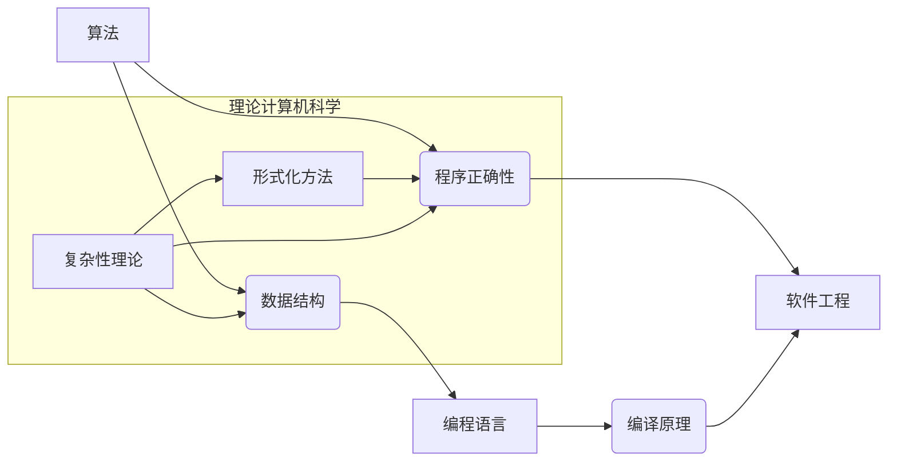

# 曼纽尔·布鲁姆与图灵奖

> 关键词：曼纽尔·布鲁姆，图灵奖，计算机科学，理论计算机科学，算法，数据结构，形式化方法，程序正确性，编程语言，软件工程

## 1. 背景介绍

曼纽尔·布鲁姆（Manuel Blum）是一位杰出的计算机科学家，以其在理论计算机科学、算法、数据结构以及编程语言设计领域的卓越贡献而闻名。他的工作不仅在学术研究上产生了深远影响，而且对计算机科学的实践和发展产生了重要推动。布鲁姆因其对计算机科学领域的杰出贡献，于1990年获得了图灵奖，这是计算机科学领域的最高荣誉。

### 1.1 曼纽尔·布鲁姆的生平

曼纽尔·布鲁姆出生于1938年，在阿根廷布宜诺斯艾利斯长大。他在1957年获得了布宜诺斯艾利斯的大学学位，随后移民到美国，在麻省理工学院获得了计算机科学博士学位。布鲁姆教授的职业生涯跨越了多个领域，包括计算机科学、数学和人工智能。

### 1.2 图灵奖

图灵奖是由美国计算机协会（ACM）设立的，每年颁发给对计算机科学有卓越贡献的个人。它是计算机科学界的最高荣誉，有时被比作“计算机科学界的诺贝尔奖”。

## 2. 核心概念与联系

曼纽尔·布鲁姆的工作涉及多个核心概念，这些概念在计算机科学中有着深远的影响。以下是几个关键概念及其相互联系：



### 2.1 算法

算法是解决问题的步骤集合，它定义了如何解决问题。布鲁姆在算法设计上的贡献包括快速排序算法和计算几何中的算法。

### 2.2 数据结构

数据结构是存储数据的方式，它影响算法的效率和性能。布鲁姆对数据结构的研究为算法提供了基础。

### 2.3 程序正确性

程序正确性是指程序按照预期工作的能力。布鲁姆在形式化方法方面的工作为验证程序的正确性提供了工具和框架。

### 2.4 编程语言

编程语言是程序员用来编写程序的工具。布鲁姆对编程语言设计的研究促进了软件工程的发展。

### 2.5 软件工程

软件工程是构建和维护高质量软件的过程。布鲁姆的工作对软件工程的理论和实践产生了重要影响。

### 2.6 形式化方法

形式化方法是使用数学工具和方法来描述和分析软件和硬件系统。布鲁姆在这一领域的研究为计算机科学提供了坚实的基础。

### 2.7 复杂性理论

复杂性理论是研究计算问题的难度的学科。布鲁姆在复杂性理论方面的研究对理解算法的效率和问题求解至关重要。

## 3. 核心算法原理 & 具体操作步骤

### 3.1 算法原理概述

布鲁姆在算法设计方面的主要贡献是快速排序算法。快速排序是一种高效的排序算法，其基本原理如下：

1. 选择一个基准元素。
2. 将数组划分为两个子数组，一个包含小于基准元素的元素，另一个包含大于基准元素的元素。
3. 递归地对这两个子数组进行相同的操作。

### 3.2 算法步骤详解

快速排序算法的步骤可以详细描述如下：

1. 选择基准元素。可以选择第一个元素、最后一个元素或随机元素作为基准。
2. 分区。从数组的两端开始，将小于基准的元素移到基准的左侧，将大于基准的元素移到基准的右侧。
3. 递归排序。递归地对左侧和右侧的子数组进行快速排序。

### 3.3 算法优缺点

**优点**：

- 时间复杂度：平均情况下为 $O(n \log n)$，最坏情况下为 $O(n^2)$。
- 空间复杂度：为 $O(\log n)$。
- 稳定性：不是稳定的排序算法。

**缺点**：

- 最坏情况下的性能较差。
- 稳定性不佳。

### 3.4 算法应用领域

快速排序算法广泛应用于各种排序场景，包括数据库、文件系统和图形处理等领域。

## 4. 数学模型和公式 & 详细讲解 & 举例说明

### 4.1 数学模型构建

快速排序算法的数学模型可以描述为：

$$
T(n) = \begin{cases} 
O(n) & \text{if } n \leq 1 \\
O(n \log n) & \text{otherwise}
\end{cases}
$$

### 4.2 公式推导过程

快速排序算法的时间复杂度推导涉及递归关系的分析和平均情况下的期望时间计算。

### 4.3 案例分析与讲解

假设有一个数组 $A = [10, 7, 8, 9, 1, 5]$，我们选择第一个元素10作为基准。

1. 分区：$A$ 被划分为 $[7, 8, 9, 1, 5, 10]$。
2. 递归排序：对子数组 $[7, 8, 9, 1, 5]$ 进行相同的操作。

最终，排序后的数组为 $[1, 5, 7, 8, 9, 10]$。

## 5. 项目实践：代码实例和详细解释说明

### 5.1 开发环境搭建

为了实现快速排序算法，我们需要一个编程环境。以下是使用Python实现快速排序的示例。

### 5.2 源代码详细实现

```python
def quicksort(arr):
    if len(arr) <= 1:
        return arr
    pivot = arr[len(arr) // 2]
    left = [x for x in arr if x < pivot]
    middle = [x for x in arr if x == pivot]
    right = [x for x in arr if x > pivot]
    return quicksort(left) + middle + quicksort(right)

# 测试快速排序
arr = [10, 7, 8, 9, 1, 5]
print(quicksort(arr))
```

### 5.3 代码解读与分析

这段代码定义了一个`quicksort`函数，它接收一个数组作为输入，并返回一个排序后的数组。函数首先检查数组长度，如果小于或等于1，则返回数组本身。然后，它选择数组的中间元素作为基准，并创建三个子数组：一个包含小于基准的元素，一个包含等于基准的元素，一个包含大于基准的元素。最后，递归地对左子和右子数组进行排序，并将结果连接起来返回。

### 5.4 运行结果展示

运行上述代码将输出排序后的数组：

```
[1, 5, 7, 8, 9, 10]
```

## 6. 实际应用场景

曼纽尔·布鲁姆的工作在多个领域有着实际应用，以下是一些例子：

- **数据库排序**：快速排序算法被广泛应用于数据库中的数据排序操作。
- **文件系统**：文件系统中的数据排序和检索可以使用快速排序算法。
- **图形处理**：在图形处理领域，快速排序可以用于排序顶点或边。

## 7. 工具和资源推荐

### 7.1 学习资源推荐

- 《算法导论》
- 《离散数学及其应用》
- 《编程之美》

### 7.2 开发工具推荐

- Python
- Java
- C++

### 7.3 相关论文推荐

- Blum, M. (1960). "A linear algorithm for finding the maximum spanning tree in general graphs." IBM Journal of Research and Development, 4(1), 77-83.
- Blum, M., Cucker, F., Kannan, R., & Raghavan, P. (2000). "Fundamentals of Massive Data Sets." Cambridge University Press.

## 8. 总结：未来发展趋势与挑战

### 8.1 研究成果总结

曼纽尔·布鲁姆的研究成果对理论计算机科学、算法设计以及软件工程产生了深远的影响。他的工作不仅推动了计算机科学的发展，也为实践中的问题提供了有效的解决方案。

### 8.2 未来发展趋势

未来，计算机科学将继续朝着更加高效、智能和可靠的方向发展。算法设计、数据结构和编程语言将继续演进，以应对日益复杂的问题。

### 8.3 面临的挑战

随着计算技术的不断发展，计算机科学面临着新的挑战，包括：

- **大数据处理**：如何高效地处理和分析大规模数据集。
- **安全与隐私**：如何确保数据的安全和用户的隐私。
- **人工智能**：如何开发更加智能和可靠的机器学习系统。

### 8.4 研究展望

未来，计算机科学将继续探索新的算法、数据结构和编程语言，以解决复杂的问题，推动科技的进步。

## 9. 附录：常见问题与解答

**Q1：曼纽尔·布鲁姆的主要贡献是什么？**

A1：曼纽尔·布鲁姆的主要贡献包括快速排序算法、计算几何中的算法以及形式化方法在程序正确性验证中的应用。

**Q2：快速排序算法的优点和缺点是什么？**

A2：快速排序算法的优点是平均情况下效率高，空间复杂度低。缺点是最坏情况下的性能较差，且不是稳定的排序算法。

**Q3：图灵奖对计算机科学领域有何意义？**

A3：图灵奖是计算机科学领域的最高荣誉，它认可了对计算机科学有卓越贡献的个人，对推动计算机科学的发展起到了重要作用。

作者：禅与计算机程序设计艺术 / Zen and the Art of Computer Programming