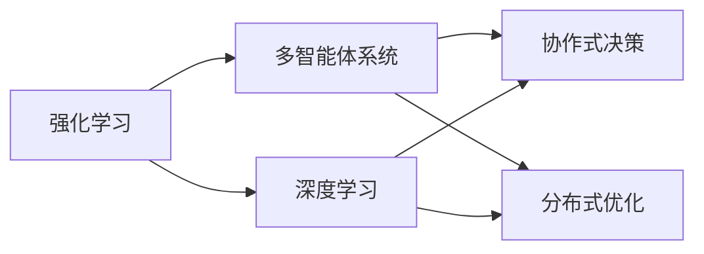
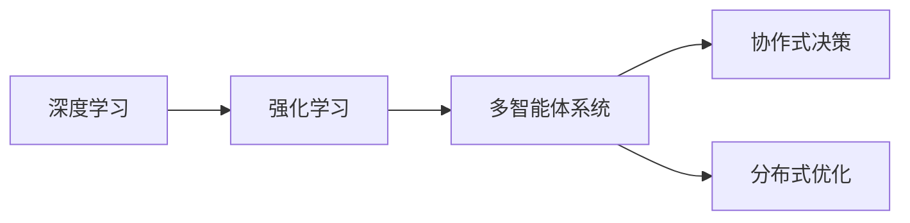
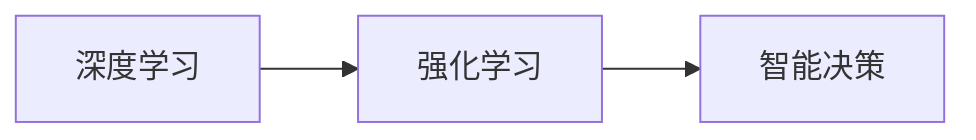
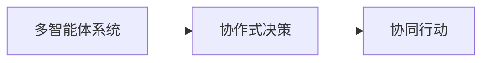
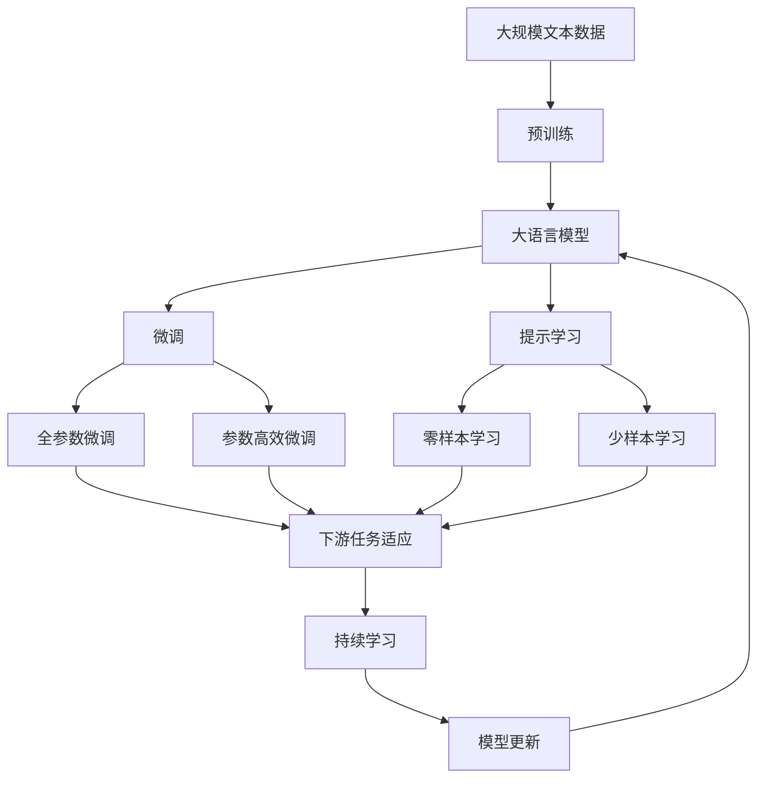

                 

# AI Agent: AI的下一个风口 人机协同的方法和框架

> 关键词：AI Agent, 人机协同, 强化学习, 深度学习, 多智能体系统, 协作式决策, 分布式优化

## 1. 背景介绍

### 1.1 问题由来

随着人工智能技术的不断进步，AIAgent（AI代理）这一概念逐步被推到风口浪尖。AIAgent是指通过深度学习和强化学习训练出的智能体，能够在复杂环境中自主行动，实现与环境的动态交互。这种技术在工业控制、自动驾驶、智能家居、机器人、游戏等领域中得到了广泛应用，正在改变传统的人机交互方式，开启AI技术的新篇章。

### 1.2 问题核心关键点

AI Agent的核心问题在于如何让AI能够在复杂的、不确定性的环境中，高效地实现与环境的互动，并达成一定的目标。这涉及到以下几个关键点：

- **强化学习**：AIAgent通过不断试错，学习如何采取最优的行动策略，以最大化长期奖励。
- **深度学习**：AIAgent能够从大量历史数据中学习到复杂的模式，提高决策质量。
- **多智能体系统**：多个AIAgent之间的协作，能够处理更复杂的任务，提高系统的鲁棒性。
- **协作式决策**：多个AIAgent之间通过通信和协商，形成一致的行动策略，实现更加高效的决策。
- **分布式优化**：在多节点系统中，多个AIAgent共同优化系统性能，达到全局最优。

### 1.3 问题研究意义

AI Agent的研究不仅能够提升AI技术的应用范围和效果，还能够推动智能技术的产业化进程，提升各行各业的智能化水平。具体来说：

1. **降低开发成本**：AI Agent能够快速适应新环境，减少了传统手工编码的工作量。
2. **提高系统效率**：AI Agent能够在复杂环境中自主决策，大幅度提升系统运行效率。
3. **增强系统鲁棒性**：多个AIAgent之间的协作能够提高系统的鲁棒性和适应性。
4. **提升用户体验**：通过AI Agent，用户可以享受更加智能化、便捷的服务。
5. **加速技术创新**：AI Agent技术推动了AI领域的新一轮技术革新，促进了新技术的落地应用。

## 2. 核心概念与联系

### 2.1 核心概念概述

为更好地理解AI Agent的原理和架构，下面将介绍几个关键概念：

- **强化学习**：通过与环境互动，AIAgent通过试错学习最优行动策略的过程。
- **深度学习**：通过神经网络模型，AIAgent能够从大量数据中学习到复杂模式的过程。
- **多智能体系统**：由多个AIAgent组成的系统，能够实现复杂的协作和决策。
- **协作式决策**：多个AIAgent之间通过通信和协商，形成一致的行动策略。
- **分布式优化**：多个AIAgent之间共同优化系统性能，达到全局最优。

这些概念之间存在着紧密的联系，形成了AI Agent的核心生态系统。下面我们通过一个Mermaid流程图来展示这些概念之间的关系：



这个流程图展示了AI Agent核心概念之间的逻辑关系：

1. 强化学习是AIAgent的核心，提供了自主决策的能力。
2. 深度学习为AIAgent提供了强大的数据分析和决策支持。
3. 多智能体系统使得AIAgent能够协同工作，处理复杂任务。
4. 协作式决策和分布式优化则进一步提高了AIAgent的协同效率和系统性能。

### 2.2 概念间的关系

这些核心概念之间存在着密切的联系，形成了AI Agent的完整生态系统。下面我们通过几个Mermaid流程图来展示这些概念之间的关系。

#### 2.2.1 AI Agent的核心技术栈



这个流程图展示了AI Agent的核心技术栈。深度学习提供数据处理和特征提取，强化学习用于决策策略的训练，多智能体系统实现协作决策，分布式优化提升系统性能。

#### 2.2.2 强化学习和深度学习的结合



这个流程图展示了强化学习与深度学习的结合。深度学习提供强大的数据处理和特征提取能力，强化学习则利用这些特征进行智能决策。

#### 2.2.3 多智能体系统和协作式决策的结合



这个流程图展示了多智能体系统和协作式决策的结合。多个AIAgent通过协作式决策，形成一致的行动策略，实现协同行动。

### 2.3 核心概念的整体架构

最后，我们用一个综合的流程图来展示这些核心概念在大语言模型微调过程中的整体架构：



这个综合流程图展示了从预训练到微调，再到持续学习的完整过程。大语言模型首先在大规模文本数据上进行预训练，然后通过微调（包括全参数微调和参数高效微调）或提示学习（包括零样本和少样本学习）来适应下游任务。最后，通过持续学习技术，模型可以不断学习新知识，同时避免遗忘旧知识。 通过这些流程图，我们可以更清晰地理解AI Agent的核心概念及其之间的关系，为后续深入讨论具体的微调方法和技术奠定基础。

## 3. 核心算法原理 & 具体操作步骤

### 3.1 算法原理概述

AI Agent的核心算法是基于强化学习和深度学习的。其核心思想是通过试错学习，不断优化行动策略，以达到最大化长期奖励的目的。以下是具体的算法原理概述：

1. **深度强化学习**：将深度学习与强化学习相结合，使用神经网络模型作为价值函数，通过优化损失函数，最大化预期奖励。
2. **多智能体深度强化学习**：多个AIAgent通过协作决策，实现复杂任务的解决。
3. **分布式深度强化学习**：多个节点共同训练和优化模型，提高系统性能。
4. **强化学习优化算法**：如Q-learning、SARSA、Deep Q-learning等，用于优化行动策略。
5. **深度学习优化算法**：如Adam、SGD等，用于优化神经网络参数。

### 3.2 算法步骤详解

以下是AI Agent的详细操作步骤：

**Step 1: 准备数据集**

- 收集环境数据，包括状态、行动、奖励等信息。
- 对数据进行预处理，如归一化、标记等。

**Step 2: 初始化模型**

- 初始化神经网络模型，如Q-Network、Policy Network等。
- 设定学习率、批大小等超参数。

**Step 3: 强化学习训练**

- 使用神经网络模型作为Value Function，使用优化算法如Adam等，最小化损失函数。
- 通过环境交互，不断更新神经网络参数，优化行动策略。
- 引入正则化技术如L2正则、Dropout等，防止过拟合。
- 使用Early Stopping、Model Averaging等技术，防止过拟合和灾难性遗忘。

**Step 4: 多智能体系统训练**

- 设计多个AIAgent之间的通信和协作机制。
- 使用分布式训练技术，提升模型性能。
- 使用分布式优化算法如SGD、Adam等，优化模型参数。

**Step 5: 部署与测试**

- 将训练好的AIAgent部署到实际环境中。
- 对AIAgent进行测试，评估其性能。
- 收集反馈信息，不断优化AIAgent。

### 3.3 算法优缺点

AI Agent具有以下优点：

1. **自主决策能力**：通过强化学习，AIAgent能够在复杂环境中自主决策，减少人工干预。
2. **高效率**：通过并行计算和多智能体协作，AIAgent能够高效地完成任务。
3. **可扩展性**：多个AIAgent之间的协作，能够处理更复杂的任务。
4. **鲁棒性**：多个AIAgent之间的协作，提高了系统的鲁棒性和适应性。

然而，AI Agent也存在一些缺点：

1. **学习效率低**：在复杂环境中，AIAgent的学习效率较低，需要大量的训练数据和计算资源。
2. **稳定性差**：AIAgent对环境的微小变化敏感，容易发生不稳定。
3. **可解释性差**：AIAgent的决策过程通常缺乏可解释性，难以理解其内部逻辑。
4. **资源消耗高**：大规模AIAgent系统需要大量的计算资源和存储资源。
5. **安全问题**：AIAgent的决策可能存在漏洞，容易受到攻击。

### 3.4 算法应用领域

AI Agent在多个领域中得到了广泛应用，包括但不限于以下几个领域：

- **自动驾驶**：使用AIAgent实现车辆自主驾驶，提高行车安全。
- **工业控制**：使用AIAgent实现设备自主操作，提高生产效率。
- **智能家居**：使用AIAgent实现家居设备智能化，提高生活质量。
- **机器人**：使用AIAgent实现机器人自主导航、任务执行等。
- **游戏**：使用AIAgent实现游戏AI，提高游戏趣味性和可玩性。

这些领域的应用展示了AI Agent的强大潜力和广泛前景，未来将有更多新的应用场景涌现。

## 4. 数学模型和公式 & 详细讲解 & 举例说明

### 4.1 数学模型构建

AI Agent的数学模型主要基于强化学习和深度学习。这里以强化学习中的Q-learning算法为例，构建数学模型：

设环境状态为$s$，行动为$a$，奖励为$r$，则Q-learning的目标是最小化误差：

$$
\min_{\theta} \sum_{s_t,a_t} (r + \gamma \max_{a'} Q(s_{t+1},a';\theta)) - Q(s_t,a_t;\theta)
$$

其中，$\theta$为神经网络模型参数，$\gamma$为折扣因子，$(s_t,a_t)$为当前状态和行动，$(s_{t+1},a';\theta)$为下一个状态和最优行动。

### 4.2 公式推导过程

以下是Q-learning算法的公式推导过程：

1. 假设当前状态为$s_t$，行动为$a_t$，奖励为$r$，下一个状态为$s_{t+1}$，最优行动为$a'$。
2. 根据贝尔曼方程，有：
$$
Q(s_t,a_t) \leftarrow Q(s_t,a_t) + \alpha [r + \gamma \max_{a'} Q(s_{t+1},a';\theta) - Q(s_t,a_t;\theta)]
$$
3. 令$\Delta Q(s_t,a_t) = r + \gamma \max_{a'} Q(s_{t+1},a';\theta) - Q(s_t,a_t;\theta)$，则有：
$$
Q(s_t,a_t) \leftarrow Q(s_t,a_t) + \alpha \Delta Q(s_t,a_t)
$$
4. 通过迭代优化$\Delta Q(s_t,a_t)$，不断更新$Q(s_t,a_t)$，最终收敛到最优解。

### 4.3 案例分析与讲解

这里以AlphaGo为例，说明AI Agent在实际应用中的具体案例：

AlphaGo利用深度学习和强化学习技术，实现了自我对弈、决策策略优化等能力。AlphaGo的Q-learning模型使用了深度神经网络作为Value Function，通过优化损失函数，最大化预期奖励。AlphaGo的多智能体系统设计，使得多个AIAgent能够协作决策，共同优化策略。AlphaGo的分布式训练技术，大大提高了模型的训练效率和性能。AlphaGo的成功，标志着AI Agent技术在复杂任务中的巨大潜力。

## 5. 项目实践：代码实例和详细解释说明

### 5.1 开发环境搭建

在进行AI Agent的实践开发前，我们需要准备好开发环境。以下是使用Python进行PyTorch开发的环境配置流程：

1. 安装Anaconda：从官网下载并安装Anaconda，用于创建独立的Python环境。

2. 创建并激活虚拟环境：
```bash
conda create -n pytorch-env python=3.8 
conda activate pytorch-env
```

3. 安装PyTorch：根据CUDA版本，从官网获取对应的安装命令。例如：
```bash
conda install pytorch torchvision torchaudio cudatoolkit=11.1 -c pytorch -c conda-forge
```

4. 安装TensorFlow：从官网下载并安装TensorFlow。

5. 安装TensorBoard：TensorFlow配套的可视化工具，可实时监测模型训练状态，并提供丰富的图表呈现方式。

6. 安装HuggingFace Transformers库：
```bash
pip install transformers
```

完成上述步骤后，即可在`pytorch-env`环境中开始AI Agent的开发实践。

### 5.2 源代码详细实现

这里我们以AlphaGo为例，给出使用PyTorch对深度强化学习模型进行训练的代码实现。

```python
import torch
import torch.nn as nn
import torch.optim as optim
import torch.nn.functional as F
from torch.distributions import Categorical

# 定义神经网络模型
class QNetwork(nn.Module):
    def __init__(self, input_size, output_size):
        super(QNetwork, self).__init__()
        self.fc1 = nn.Linear(input_size, 64)
        self.fc2 = nn.Linear(64, output_size)

    def forward(self, x):
        x = self.fc1(x)
        x = F.relu(x)
        x = self.fc2(x)
        return x

# 定义神经网络模型参数
input_size = 19
output_size = 36
model = QNetwork(input_size, output_size)

# 定义优化器
optimizer = optim.Adam(model.parameters(), lr=0.001)
loss_fn = nn.MSELoss()

# 定义训练数据集
# 注意：实际应用中需要收集大量棋局数据，进行预处理

# 训练过程
num_episodes = 5000
for episode in range(num_episodes):
    # 初始化状态
    state = ...
    done = False
    total_reward = 0

    while not done:
        # 根据当前状态选择行动
        state_vector = torch.tensor([state])
        with torch.no_grad():
            Q_values = model(state_vector)
        action_probs = F.softmax(Q_values, dim=1)
        action = Categorical(probs=action_probs).sample()
        action = action.item()

        # 执行行动并获取奖励
        next_state, reward, done = ...
        next_state_vector = torch.tensor([next_state])
        Q_values = model(next_state_vector)

        # 更新Q值
        target = reward + 0.9 * Q_values.max().item()
        loss = (Q_values[0, action] - target).item()
        optimizer.zero_grad()
        loss.backward()
        optimizer.step()

        # 计算奖励
        total_reward += reward

    print("Episode:", episode, "Total Reward:", total_reward)
```

以上代码展示了AlphaGo的Q-learning模型训练过程。我们可以看到，通过PyTorch，我们可以方便地构建神经网络模型，定义优化器，并实现模型的前向传播和反向传播。在训练过程中，我们通过获取当前状态的Q值，选择最优行动，并根据奖励更新Q值，不断迭代优化模型。

### 5.3 代码解读与分析

让我们再详细解读一下关键代码的实现细节：

**QNetwork类**：
- `__init__`方法：定义神经网络模型结构，包括两个全连接层。
- `forward`方法：定义神经网络的前向传播过程，将输入数据经过多个线性变换，输出Q值。

**训练过程**：
- 定义训练轮数`num_episodes`，开始循环迭代
- 每个轮次内，初始化状态`state`，进入循环直到游戏结束
- 根据当前状态计算Q值，选择最优行动
- 执行行动并获取奖励`reward`，更新Q值
- 迭代优化模型参数，计算奖励`total_reward`

**实际应用**：
- 在实际应用中，需要收集大量棋局数据进行预处理
- 通过不断优化模型，逐步提高AlphaGo的决策能力

**输出结果**：
- 输出每轮迭代的奖励`total_reward`

可以看到，PyTorch配合TensorFlow使得深度强化学习的代码实现变得简洁高效。开发者可以将更多精力放在数据处理、模型改进等高层逻辑上，而不必过多关注底层的实现细节。

当然，工业级的系统实现还需考虑更多因素，如模型的保存和部署、超参数的自动搜索、更灵活的模型调优等。但核心的训练范式基本与此类似。

## 6. 实际应用场景

### 6.1 智能客服系统

基于AI Agent的系统可以实现智能客服功能。传统客服往往需要配备大量人力，高峰期响应缓慢，且一致性和专业性难以保证。通过AI Agent，系统能够7x24小时不间断服务，快速响应客户咨询，用自然流畅的语言解答各类常见问题。

在技术实现上，可以收集企业内部的历史客服对话记录，将问题和最佳答复构建成监督数据，在此基础上对AI Agent进行微调。微调后的AI Agent能够自动理解用户意图，匹配最合适的答复模板进行回复。对于客户提出的新问题，还可以接入检索系统实时搜索相关内容，动态组织生成回答。如此构建的智能客服系统，能大幅提升客户咨询体验和问题解决效率。

### 6.2 金融舆情监测

金融机构需要实时监测市场舆论动向，以便及时应对负面信息传播，规避金融风险。传统的人工监测方式成本高、效率低，难以应对网络时代海量信息爆发的挑战。基于AI Agent的文本分类和情感分析技术，为金融舆情监测提供了新的解决方案。

具体而言，可以收集金融领域相关的新闻、报道、评论等文本数据，并对其进行主题标注和情感标注。在此基础上对AI Agent进行微调，使其能够自动判断文本属于何种主题，情感倾向是正面、中性还是负面。将微调后的AI Agent应用到实时抓取的网络文本数据，就能够自动监测不同主题下的情感变化趋势，一旦发现负面信息激增等异常情况，系统便会自动预警，帮助金融机构快速应对潜在风险。

### 6.3 个性化推荐系统

当前的推荐系统往往只依赖用户的历史行为数据进行物品推荐，无法深入理解用户的真实兴趣偏好。基于AI Agent的推荐系统可以更好地挖掘用户行为背后的语义信息，从而提供更精准、多样的推荐内容。

在实践中，可以收集用户浏览、点击、评论、分享等行为数据，提取和用户交互的物品标题、描述、标签等文本内容。将文本内容作为模型输入，用户的后续行为（如是否点击、购买等）作为监督信号，在此基础上微调AI Agent模型。微调后的AI Agent能够从文本内容中准确把握用户的兴趣点。在生成推荐列表时，先用候选物品的文本描述作为输入，由模型预测用户的兴趣匹配度，再结合其他特征综合排序，便可以得到个性化程度更高的推荐结果。

### 6.4 未来应用展望

随着AI Agent技术的不断发展，其在更多领域得到应用，为传统行业带来变革性影响。

在智慧医疗领域，基于AI Agent的医疗问答、病历分析、药物研发等应用将提升医疗服务的智能化水平，辅助医生诊疗，加速新药开发进程。

在智能教育领域，AI Agent可应用于作业批改、学情分析、知识推荐等方面，因材施教，促进教育公平，提高教学质量。

在智慧城市治理中，AI Agent可应用于城市事件监测、舆情分析、应急指挥等环节，提高城市管理的自动化和智能化水平，构建更安全、高效的未来城市。

此外，在企业生产、社会治理、文娱传媒等众多领域，基于AI Agent的人工智能应用也将不断涌现，为经济社会发展注入新的动力。相信随着技术的日益成熟，AI Agent必将在更广阔的应用领域大放异彩，深刻影响人类的生产生活方式。

## 7. 工具和资源推荐

### 7.1 学习资源推荐

为了帮助开发者系统掌握AI Agent的理论基础和实践技巧，这里推荐一些优质的学习资源：

1. 《Deep Reinforcement Learning》书籍：Richard S. Sutton和Andrew G. Barto著，全面介绍了强化学习的基本概念和算法。

2. 《Python Deep Learning》书籍：Francois Chollet著，介绍了深度学习和TensorFlow的使用。

3. 《Reinforcement Learning: An Introduction》书籍：Richard S. Sutton和Andrew G. Barto著，适合入门读者学习强化学习。

4. arXiv论文预印本：人工智能领域最新研究成果的发布平台，包括大量尚未发表的前沿工作，学习前沿技术的必读资源。

5. AI相关的在线课程，如Coursera、Udacity、edX等平台提供的深度学习和强化学习课程。

通过对这些资源的学习实践，相信你一定能够快速掌握AI Agent的精髓，并用于解决实际的NLP问题。

### 7.2 开发工具推荐

高效的开发离不开优秀的工具支持。以下是几款用于AI Agent开发常用的工具：

1. PyTorch：基于Python的开源深度学习框架，灵活动态的计算图，适合快速迭代研究。

2. TensorFlow：由Google主导开发的开源深度学习框架，生产部署方便，适合大规模工程应用。

3. HuggingFace Transformers库：集成了众多SOTA语言模型，支持PyTorch和TensorFlow，是进行AI Agent开发的利器。

4. Weights & Biases：模型训练的实验跟踪工具，可以记录和可视化模型训练过程中的各项指标，方便对比和调优。

5. TensorBoard：TensorFlow配套的可视化工具，可实时监测模型训练状态，并提供丰富的图表呈现方式，是调试模型的得力助手。

6. Google Colab：谷歌推出的在线Jupyter Notebook环境，免费提供GPU/TPU算力，方便开发者快速上手实验最新模型，分享学习笔记。

合理利用这些工具，可以显著提升AI Agent的开发效率，加快创新迭代的步伐。

### 7.3 相关论文推荐

AI Agent的研究源于学界的持续研究。以下是几篇奠基性的相关论文，推荐阅读：

1. AlphaGo Zero: Mastering the Game of Go without Human Knowledge（DeepMind 2017）：展示了AlphaGo Zero的自我对弈能力，推动了AI Agent的发展。

2. DeepMind 的研究论文，如AlphaGo、AlphaStar、AlphaZero等，展示了AI Agent在复杂游戏中的卓越表现。

3. Imitation Learning: A Survey of Approaches for Learning from Demonstrations（Google AI 2018）：介绍了模仿学习的各种方法，为AI Agent提供了新的思路。

4. Multi-Agent Reinforcement Learning: Independent and Cooperative Agents（Google AI 2018）：介绍了多智能体强化学习的各种方法，为AI Agent的协作决策提供了新的工具。

这些论文代表了大AI Agent的研究脉络。通过学习这些前沿成果，可以帮助研究者把握学科前进方向，激发更多的创新灵感。

除上述资源外，还有一些值得关注的前沿资源，帮助开发者紧跟AI Agent微调技术的最新进展，例如：

1. arXiv论文预印本：人工智能领域最新研究成果的发布平台，包括大量尚未发表的前沿工作，学习前沿技术的必读资源。

2. AI相关的在线课程，如Coursera、Udacity、edX等平台提供的深度学习和强化学习课程。

3. AI领域的顶级会议和期刊，如NeurIPS、ICML、JMLR等，可以获得最新的研究成果和技术动态。

4. AI领域的顶级竞赛，如AlphaStar比赛、OpenAI Gym等，可以检验和提升技术能力。

总之，对于AI Agent的研究和学习，需要开发者保持开放的心态和持续学习的意愿。多关注前沿资讯，多动手实践，多思考总结，必将收获满满的成长收益。

## 8. 总结：未来发展趋势与挑战

### 8.1 总结

本文对基于AI Agent的AI技术进行了全面系统的介绍。首先阐述了AI Agent的研究背景和意义，明确了AI Agent在复杂环境中的自主决策能力。其次，从原理到实践，详细讲解了AI Agent的数学模型和操作步骤，给出了AI Agent开发的完整代码实例。同时，本文还探讨了AI Agent在实际应用场景中的应用前景，展示了其在智能客服、金融舆情监测、个性化推荐等多个领域的应用潜力。

通过本文的系统梳理，可以看到，AI Agent的研究和应用正在成为AI领域的新热点，其强大的自主决策能力和多智能体协作能力，将带来新的技术突破和应用范式。未来，AI Agent必将在更多领域得到广泛应用，推动AI技术的产业化进程。

### 8.2 未来发展趋势

展望未来，AI Agent技术将呈现以下几个发展趋势：

1. **多智能体系统的普及**：多智能体系统将在更多复杂场景中得到应用，提升系统的鲁棒性和可扩展性。
2. **分布式优化技术的提升**：分布式优化技术将不断提升，使得AI Agent能够在多节点系统中高效协同工作。
3. **可解释性和透明度的提升**：AI Agent的决策过程将更具可解释性，便于理解其内部工作机制和决策逻辑。
4. **跨模态融合技术的进步**：AI Agent将能够融合视觉、语音、文本等多模态数据，提升其对现实世界的理解和建模能力。
5. **智能体的自主学习能力**：AI Agent

