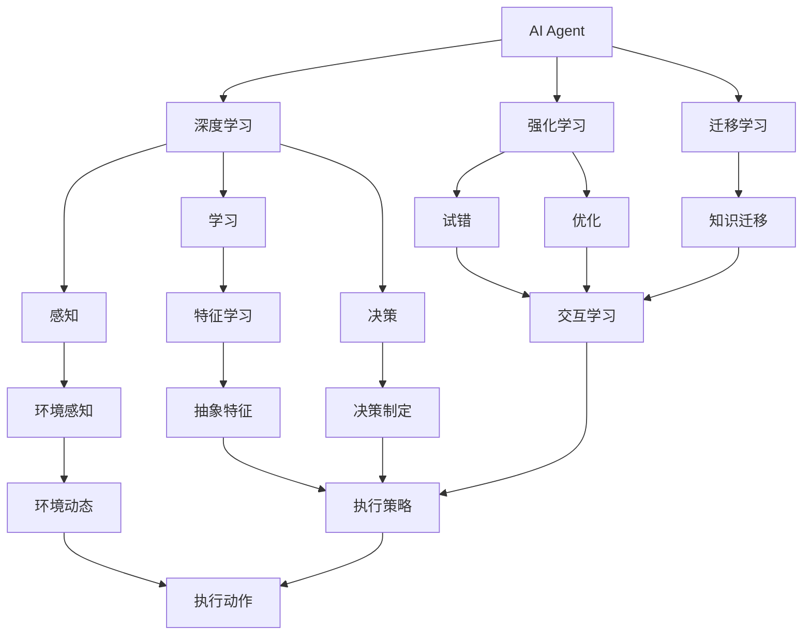
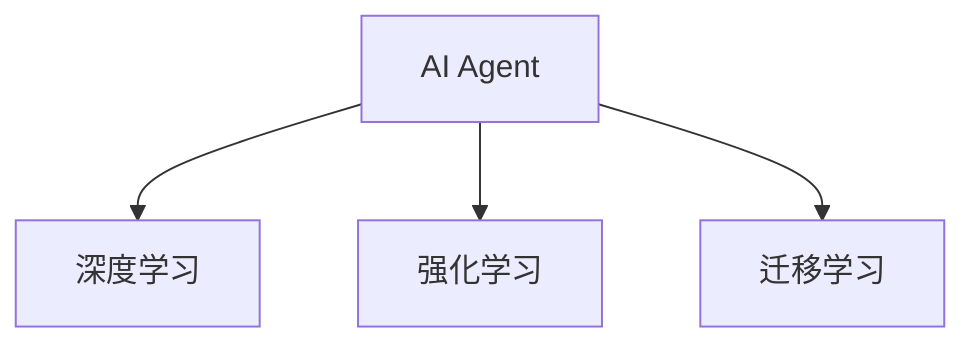
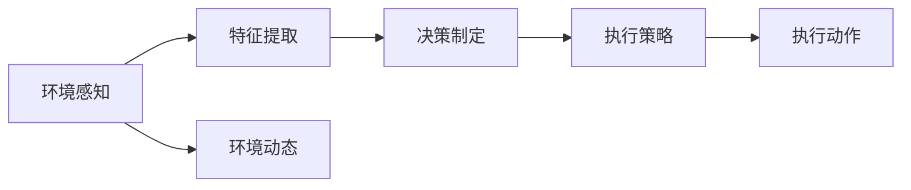
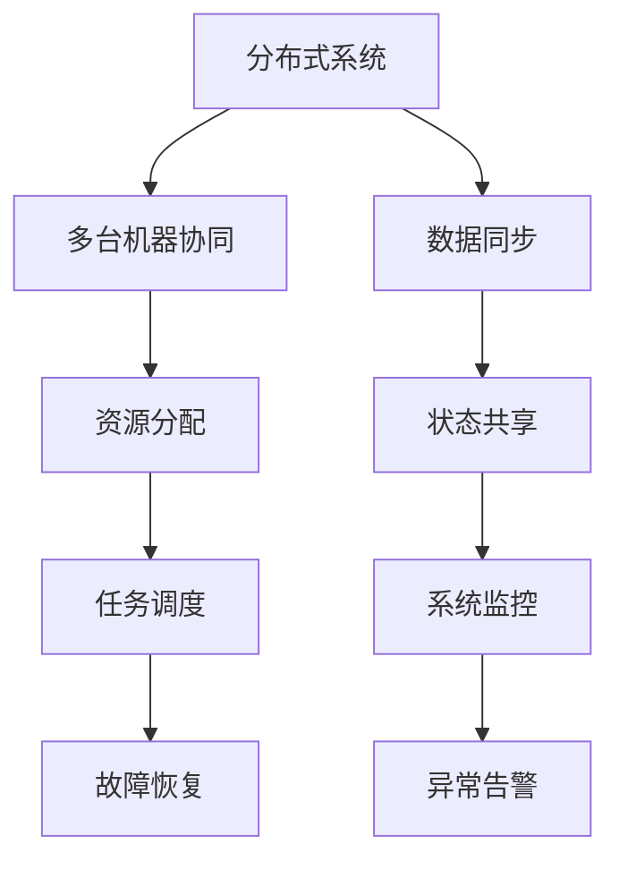
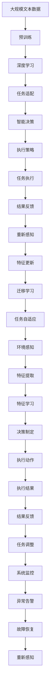

                 

# AI Agent: AI的下一个风口 对未来的启示

> 关键词：AI Agent, 深度学习, 强化学习, 自动化, 智能决策, 分布式系统

## 1. 背景介绍

### 1.1 问题由来
随着人工智能技术的快速发展，AI Agent（人工智能代理）在智能系统中扮演着越来越重要的角色。AI Agent不仅能自主学习并执行复杂任务，还能在不同的环境中自我适应和优化。其在自动驾驶、智能客服、智能运维、金融投资等领域的应用，不仅极大地提高了系统效率，也带来了全新的业务模式。

然而，AI Agent的部署和维护仍面临诸多挑战，如智能决策的鲁棒性、系统稳定性和扩展性等。AI Agent的设计和实现需要跨学科的知识和技术支持，这对AI研究人员和工程师提出了更高的要求。此外，AI Agent系统的部署和运营也需要考虑伦理、安全等方面的因素，这些都是值得深入探讨的课题。

### 1.2 问题核心关键点
本章节将深入探讨AI Agent的核心概念及其对未来的启示。

AI Agent的核心在于其自主学习和智能决策能力，能在不确定的复杂环境中自我适应和优化，并执行任务。AI Agent的学习和决策过程涉及到深度学习、强化学习、迁移学习、分布式系统等技术，是一个综合的跨学科研究领域。

AI Agent的设计和实现需要考虑多方面的因素，如任务适应性、鲁棒性、可解释性、安全性等。同时，AI Agent的部署和运营还需要考虑系统架构、分布式协同、监控告警、故障恢复等方面的问题。

### 1.3 问题研究意义
深入研究AI Agent的设计和实现，对提升人工智能技术的实用性、普适性和安全性具有重要意义：

1. **提升智能化水平**：通过自主学习和智能决策，AI Agent能执行更复杂的任务，提高系统的智能化水平。
2. **优化资源利用**：AI Agent能根据任务需求动态调整资源配置，优化系统运行效率。
3. **增强系统鲁棒性**：AI Agent的自我适应和优化能力，使其能在不同环境和条件下的复杂任务中保持稳定性和可靠性。
4. **提高可解释性**：AI Agent的智能决策过程可以通过解释性技术，使其决策逻辑更加透明和可信。
5. **保障系统安全**：AI Agent的智能决策能力可以有效避免系统故障和攻击，提高系统的安全性。
6. **推动跨领域应用**：AI Agent在多个领域的成功应用，展示了其强大的泛化能力和广泛的适用性。

## 2. 核心概念与联系

### 2.1 核心概念概述

为更好地理解AI Agent的概念和体系，本节将介绍几个密切相关的核心概念：

- **AI Agent**：能够自主学习和智能决策的系统，具备感知、学习、决策和执行能力。
- **深度学习**：通过多层神经网络模拟人脑的神经元结构，从数据中学习抽象特征，以实现自动化的任务执行。
- **强化学习**：通过与环境交互，AI Agent在不断试错中学习和优化决策策略，以达到预设的目标。
- **迁移学习**：将一个领域学到的知识迁移到另一个领域，以加速学习过程和提升系统性能。
- **分布式系统**：将AI Agent分布在多台计算机上协同工作，以提高系统的可扩展性和鲁棒性。
- **智能决策**：AI Agent在复杂环境中通过感知、学习、推理等过程，自主做出最优决策。
- **任务自适应**：AI Agent能够根据环境变化调整策略，以应对不同的任务需求。
- **系统稳定性**：AI Agent在执行任务时，能够稳定运行，不受外界干扰。
- **可解释性**：AI Agent的决策过程可以通过解释性技术，使其行为更加透明和可信。

这些核心概念之间的逻辑关系可以通过以下Mermaid流程图来展示：



这个流程图展示了大语言模型微调过程中各个核心概念的关系：

1. **深度学习**：用于提取环境特征，提供感知和推理的基础。
2. **强化学习**：通过与环境交互，优化决策策略，实现智能决策。
3. **迁移学习**：利用已有知识，加速新任务的学习过程。
4. **分布式系统**：实现多台机器的协同工作，提升系统的可扩展性和鲁棒性。
5. **智能决策**：根据感知和学习的特征，自主做出最优决策。
6. **任务自适应**：根据环境变化，调整策略以应对不同的任务需求。
7. **系统稳定性**：在复杂环境中，保持系统的稳定性和可靠性。
8. **可解释性**：通过解释性技术，使决策过程透明可信。

### 2.2 概念间的关系

这些核心概念之间存在着紧密的联系，形成了AI Agent的完整生态系统。下面我们通过几个Mermaid流程图来展示这些概念之间的关系。

#### 2.2.1 AI Agent的学习范式



这个流程图展示了AI Agent的主要学习范式：

1. **深度学习**：用于感知和特征提取。
2. **强化学习**：通过交互和优化，实现智能决策。
3. **迁移学习**：利用已有知识，加速新任务的学习。

#### 2.2.2 AI Agent的任务自适应



这个流程图展示了AI Agent的任务自适应过程：

1. **环境感知**：感知当前环境的状态。
2. **特征提取**：从感知数据中提取特征。
3. **决策制定**：根据特征和已有知识，制定决策策略。
4. **执行策略**：执行决策策略，并感知新状态。
5. **执行动作**：根据策略执行动作，调整环境状态。

#### 2.2.3 系统稳定性与分布式协同



这个流程图展示了AI Agent在分布式系统中的协同工作过程：

1. **分布式系统**：将AI Agent分布在多台机器上。
2. **多台机器协同**：协同工作，提升系统的可扩展性和鲁棒性。
3. **资源分配**：合理分配计算和存储资源。
4. **任务调度**：动态调度任务，优化资源利用。
5. **故障恢复**：快速恢复系统故障，保持服务连续性。
6. **数据同步**：同步各机器的数据状态。
7. **状态共享**：共享系统状态，实现协同决策。
8. **系统监控**：实时监控系统状态，发现异常。
9. **异常告警**：及时发出告警，防止系统故障。

### 2.3 核心概念的整体架构

最后，我们用一个综合的流程图来展示这些核心概念在大语言模型微调过程中的整体架构：



这个综合流程图展示了从预训练到智能决策的完整过程。AI Agent首先在大规模文本数据上进行预训练，然后通过任务适配进行智能决策，最后执行策略并调整任务，持续监控系统状态，及时发现和恢复故障。通过这些流程，AI Agent能够在复杂的任务环境中保持稳定性和高效性。

## 3. 核心算法原理 & 具体操作步骤
### 3.1 算法原理概述

AI Agent的核心算法原理包括深度学习、强化学习和迁移学习等。深度学习用于提取环境特征，实现感知和推理；强化学习通过试错和优化，实现智能决策；迁移学习则利用已有知识，加速新任务的学习过程。

在AI Agent的微调过程中，通常需要结合深度学习、强化学习和迁移学习的优势，通过有监督学习或无监督学习的方式进行优化。具体来说，AI Agent的微调过程包括以下几个关键步骤：

1. **数据准备**：收集和标注任务相关的数据集，准备训练样本和测试样本。
2. **模型加载**：加载预训练的AI Agent模型，作为微调任务的初始化参数。
3. **任务适配**：根据任务需求，设计合适的任务适配层，包括输出层和损失函数。
4. **模型微调**：在训练集上使用有监督学习或无监督学习的方式，优化模型参数。
5. **性能评估**：在测试集上评估微调后的AI Agent模型的性能，确保其达到任务要求。
6. **部署部署**：将微调后的AI Agent模型部署到实际应用环境中，进行大规模运行。

### 3.2 算法步骤详解

#### 3.2.1 数据准备

数据准备是AI Agent微调过程的第一步。需要收集和标注任务相关的数据集，包括训练样本和测试样本。训练样本用于训练和优化AI Agent，测试样本用于评估其性能。

数据准备包括以下几个关键步骤：

1. **数据收集**：收集任务相关的数据集，包括文本、图像、语音等。
2. **数据标注**：对收集到的数据进行标注，包括分类、匹配、生成等任务。
3. **数据预处理**：对数据进行清洗、归一化、标准化等预处理操作，使其适合输入AI Agent模型。
4. **数据分割**：将数据集划分为训练集、验证集和测试集，用于模型训练、调优和评估。

#### 3.2.2 模型加载

模型加载是AI Agent微调过程的第二步。需要加载预训练的AI Agent模型，作为微调任务的初始化参数。

模型加载包括以下几个关键步骤：

1. **模型加载**：使用深度学习框架（如TensorFlow、PyTorch等）加载预训练的AI Agent模型，作为微调任务的初始化参数。
2. **模型冻结**：将模型中的某些层冻结，保留预训练权重，只微调顶层。
3. **模型微调**：在训练集上使用有监督学习或无监督学习的方式，优化模型参数。

#### 3.2.3 任务适配

任务适配是AI Agent微调过程的第三步。需要根据任务需求，设计合适的任务适配层，包括输出层和损失函数。

任务适配包括以下几个关键步骤：

1. **输出层设计**：根据任务类型，设计合适的输出层，如线性层、RNN层、注意力机制等。
2. **损失函数设计**：根据任务需求，设计合适的损失函数，如交叉熵损失、均方误差损失等。
3. **参数初始化**：根据任务需求，对任务适配层的参数进行初始化，使其适合任务需求。

#### 3.2.4 模型微调

模型微调是AI Agent微调过程的核心步骤。需要在训练集上使用有监督学习或无监督学习的方式，优化模型参数。

模型微调包括以下几个关键步骤：

1. **优化器选择**：选择合适的优化器，如Adam、SGD等，设置学习率、批大小、迭代轮数等。
2. **损失函数计算**：在训练集上计算损失函数，评估模型预测与真实标签之间的差异。
3. **参数更新**：使用优化器更新模型参数，最小化损失函数，优化模型性能。
4. **验证集评估**：在验证集上评估模型性能，根据性能指标决定是否触发Early Stopping。
5. **测试集评估**：在测试集上评估微调后的AI Agent模型的性能，确保其达到任务要求。

#### 3.2.5 性能评估

性能评估是AI Agent微调过程的第四步。需要在测试集上评估微调后的AI Agent模型的性能，确保其达到任务要求。

性能评估包括以下几个关键步骤：

1. **性能指标**：选择合适的性能指标，如准确率、召回率、F1分数等，评估模型性能。
2. **测试集划分**：将测试集划分为多组，用于评估模型的稳定性和鲁棒性。
3. **结果统计**：统计测试集上的性能指标，生成性能评估报告。

#### 3.2.6 部署部署

部署部署是AI Agent微调过程的第五步。需要将微调后的AI Agent模型部署到实际应用环境中，进行大规模运行。

部署部署包括以下几个关键步骤：

1. **模型保存**：将微调后的AI Agent模型保存为文件，便于后续部署和应用。
2. **环境配置**：配置AI Agent的运行环境，包括CPU、GPU、内存、存储等资源。
3. **模型部署**：将微调后的AI Agent模型部署到实际应用环境中，进行大规模运行。
4. **系统监控**：实时监控AI Agent的运行状态，及时发现和修复故障。
5. **异常处理**：对系统异常进行及时处理，确保系统稳定运行。

### 3.3 算法优缺点

AI Agent的微调过程具有以下优点：

1. **简单高效**：微调过程简单高效，只需要较少的人工标注数据，可以快速构建AI Agent模型。
2. **通用性强**：AI Agent模型可以在不同的任务和场景中进行微调，具有较强的通用性。
3. **效果显著**：通过微调，AI Agent模型在特定任务上的性能提升显著，能够快速适应新任务。
4. **参数高效**：AI Agent模型可以通过参数高效微调技术，只更新部分模型参数，减少计算资源消耗。

同时，AI Agent的微调过程也存在一些缺点：

1. **数据依赖性强**：微调过程高度依赖数据集的质量和数量，需要高质量标注数据。
2. **过拟合风险高**：在数据集较小的情况下，AI Agent模型容易发生过拟合，影响模型泛化能力。
3. **可解释性不足**：AI Agent模型的决策过程缺乏可解释性，难以进行调试和优化。
4. **系统复杂度高**：AI Agent模型需要考虑分布式协同、系统监控、故障恢复等方面的问题，系统复杂度高。
5. **维护成本高**：AI Agent模型需要定期维护和更新，以适应新的任务和环境变化。

### 3.4 算法应用领域

AI Agent的微调过程已经在多个领域得到广泛应用，包括智能客服、智能运维、自动驾驶、金融投资等。

#### 3.4.1 智能客服

智能客服系统通过AI Agent模型实现自动化客户服务。AI Agent模型可以通过微调，学习常见问题和最佳答复，实现自然流畅的对话。在微调过程中，可以使用客户对话记录作为训练样本，优化模型参数，提高服务效率和客户满意度。

#### 3.4.2 智能运维

智能运维系统通过AI Agent模型实现自动化运维任务。AI Agent模型可以通过微调，学习系统监控指标和故障检测算法，实现快速响应和故障修复。在微调过程中，可以使用历史故障记录和系统日志作为训练样本，优化模型参数，提高系统可靠性和可用性。

#### 3.4.3 自动驾驶

自动驾驶系统通过AI Agent模型实现自动驾驶决策。AI Agent模型可以通过微调，学习交通规则和环境感知算法，实现安全可靠的自动驾驶。在微调过程中，可以使用模拟驾驶数据和真实驾驶数据作为训练样本，优化模型参数，提高驾驶安全性和舒适性。

#### 3.4.4 金融投资

金融投资系统通过AI Agent模型实现自动化投资决策。AI Agent模型可以通过微调，学习市场数据和投资策略，实现智能投资决策。在微调过程中，可以使用历史交易数据和市场行情作为训练样本，优化模型参数，提高投资收益和风险控制。

## 4. 数学模型和公式 & 详细讲解 & 举例说明

### 4.1 数学模型构建

AI Agent的微调过程涉及到深度学习、强化学习和迁移学习等多种算法。本文将以一个简单的情感分析任务为例，介绍AI Agent的数学模型构建。

情感分析任务的目标是识别文本中的情感倾向，如积极、消极、中性等。假设AI Agent模型的输出为$y$，其中$y=1$表示积极情感，$y=0$表示消极情感。

AI Agent模型的输入为$x$，包括文本的词向量表示、上下文信息和情感标签。AI Agent模型的输出为$y$，表示文本的情感倾向。

AI Agent模型的数学模型可以表示为：

$$y = f(x;\theta)$$

其中$f$为AI Agent模型的映射函数，$\theta$为模型参数。

### 4.2 公式推导过程

AI Agent模型的训练过程可以通过最小化损失函数来实现。假设损失函数为$L(y,\hat{y})$，其中$y$为真实标签，$\hat{y}$为模型预测的情感标签。

AI Agent模型的训练目标可以表示为：

$$\hat{\theta} = \mathop{\arg\min}_{\theta} \frac{1}{N}\sum_{i=1}^N L(y_i,\hat{y_i})$$

其中$N$为训练样本数量，$\hat{\theta}$为优化后的模型参数。

假设损失函数为二分类交叉熵损失函数，可以表示为：

$$L(y,\hat{y}) = -y\log \hat{y} - (1-y)\log (1-\hat{y})$$

在训练过程中，使用梯度下降等优化算法，最小化损失函数。假设使用Adam优化算法，则模型参数的更新公式为：

$$\theta \leftarrow \theta - \eta \nabla_{\theta}L(y,\hat{y})$$

其中$\eta$为学习率，$\nabla_{\theta}L(y,\hat{y})$为损失函数对模型参数的梯度。

### 4.3 案例分析与讲解

假设我们使用Bert模型进行情感分析任务的微调。Bert模型包含12个编码层和12个注意力机制。

首先，我们需要将文本数据进行分词和词向量表示，然后将其输入Bert模型，得到文本的表示向量。接着，我们将表示向量输入到全连接层和softmax层，得到文本的情感标签预测。

在微调过程中，我们可以使用情感分析数据集，如IMDb数据集，对Bert模型进行训练。假设我们使用Adam优化算法，设置学习率为2e-5，批大小为16，迭代轮数为10，训练过程如下：

1. 加载Bert模型，冻结部分参数，保留预训练权重。
2. 定义损失函数，使用交叉熵损失函数。
3. 使用DataLoader加载训练样本和测试样本，划分训练集、验证集和测试集。
4. 使用Adam优化算法更新模型参数，最小化损失函数。
5. 在验证集上评估模型性能，根据性能指标决定是否触发Early Stopping。
6. 在测试集上评估微调后的Bert模型性能，确保其达到任务要求。

通过微调，Bert模型的情感分析性能将显著提升，可以用于实际应用环境中的情感分析任务。

## 5. 项目实践：代码实例和详细解释说明

### 5.1 开发环境搭建

在进行AI Agent微调实践前，我们需要准备好开发环境。以下是使用Python进行PyTorch开发的环境配置流程：

1. 安装Anaconda：从官网下载并安装Anaconda，用于创建独立的Python环境。

2. 创建并激活虚拟环境：
```bash
conda create -n pytorch-env python=3.8 
conda activate pytorch-env
```

3. 安装PyTorch：根据CUDA版本，从官网获取对应的安装命令。例如：
```bash
conda install pytorch torchvision torchaudio cudatoolkit=11.1 -c pytorch -c conda-forge
```

4. 安装各类工具包：
```bash
pip install numpy pandas scikit-learn matplotlib tqdm jupyter notebook ipython
```

完成上述步骤后，即可在`pytorch-env`环境中开始微调实践。

### 5.2 源代码详细实现

下面以情感分析任务为例，给出使用Transformers库对Bert模型进行微调的PyTorch代码实现。

首先，定义情感分析任务的数据处理函数：

```python
from transformers import BertTokenizer
from torch.utils.data import Dataset
import torch

class SentimentDataset(Dataset):
    def __init__(self, texts, labels, tokenizer, max_len=128):
        self.texts = texts
        self.labels = labels
        self.tokenizer = tokenizer
        self.max_len = max_len
        
    def __len__(self):
        return len(self.texts)
    
    def __getitem__(self, item):
        text = self.texts[item]
        label = self.labels[item]
        
        encoding = self.tokenizer(text, return_tensors='pt', max_length=self.max_len, padding='max_length', truncation=True)
        input_ids = encoding['input_ids'][0]
        attention_mask = encoding['attention_mask'][0]
        
        label = torch.tensor(label, dtype=torch.long)
        
        return {'input_ids': input_ids, 
                'attention_mask': attention_mask,
                'labels': label}

# 标签与id的映射
tag2id = {'positive': 1, 'negative': 0}
id2tag = {v: k for k, v in tag2id.items()}

# 创建dataset
tokenizer = BertTokenizer.from_pretrained('bert-base-cased')

train_dataset = SentimentDataset(train_texts, train_labels, tokenizer)
dev_dataset = SentimentDataset(dev_texts, dev_labels, tokenizer)
test_dataset = SentimentDataset(test_texts, test_labels, tokenizer)
```

然后，定义模型和优化器：

```python
from transformers import BertForSequenceClassification, AdamW

model = BertForSequenceClassification.from_pretrained('bert-base-cased', num_labels=len(tag2id))

optimizer = AdamW(model.parameters(), lr=2e-5)
```

接着，定义训练和评估函数：

```python
from torch.utils.data import DataLoader
from tqdm import tqdm
from sklearn.metrics import classification_report

device = torch.device('cuda') if torch.cuda.is_available() else torch.device('cpu')
model.to(device)

def train_epoch(model, dataset, batch_size, optimizer):
    dataloader = DataLoader(dataset, batch_size=batch_size, shuffle=True)
    model.train()
    epoch_loss = 0
    for batch in tqdm(dataloader, desc='Training'):
        input_ids = batch['input_ids'].to(device)
        attention_mask = batch['attention_mask'].to(device)
        labels = batch['labels'].to(device)
        model.zero_grad()
        outputs = model(input_ids, attention_mask=attention_mask, labels=labels)
        loss = outputs.loss
        epoch_loss += loss.item()
        loss.backward()
        optimizer.step()
    return epoch_loss / len(dataloader)

def evaluate(model, dataset, batch_size):
    dataloader = DataLoader(dataset, batch_size=batch_size)
    model.eval()
    preds, labels = [], []
    with torch.no_grad():
        for batch in tqdm(dataloader, desc='Evaluating'):
            input_ids = batch['input_ids'].to(device)
            attention_mask = batch['attention_mask'].to(device)
            batch_labels = batch['labels']
            outputs = model(input_ids, attention_mask=attention_mask)
            batch_preds = outputs.logits.argmax(dim=1).to('cpu').tolist()
            batch_labels = batch_labels.to('cpu').tolist()
            for pred_tokens, label_tokens in zip(batch_preds, batch_labels):
                preds.append(pred_tokens[:len(label_tokens)])
                labels.append(label_tokens)
                
    print(classification_report(labels, preds))
```

最后，启动训练流程并在测试集上评估：

```python
epochs = 5
batch_size = 16

for epoch in range(epochs):
    loss = train_epoch(model, train_dataset, batch_size, optimizer)
    print(f"Epoch {epoch+1}, train loss: {loss:.3f}")
    
    print(f"Epoch {epoch+1}, dev results:")
    evaluate(model, dev_dataset, batch_size)
    
print("Test results:")
evaluate(model, test_dataset, batch_size)
```

以上就是使用PyTorch对Bert模型进行情感分析任务微调的完整代码实现。可以看到，得益于Transformers库的强大封装，我们可以用相对简洁的代码完成Bert模型的加载和微调。

### 5.3 代码解读与分析

让我们再详细解读一下关键代码的实现细节：

**SentimentDataset类**：
- `__init__`方法：初始化文本、

