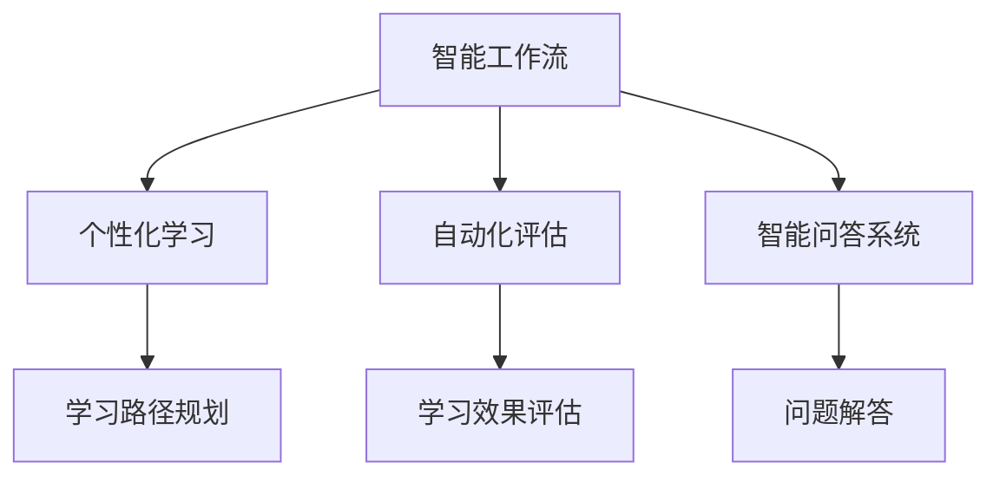
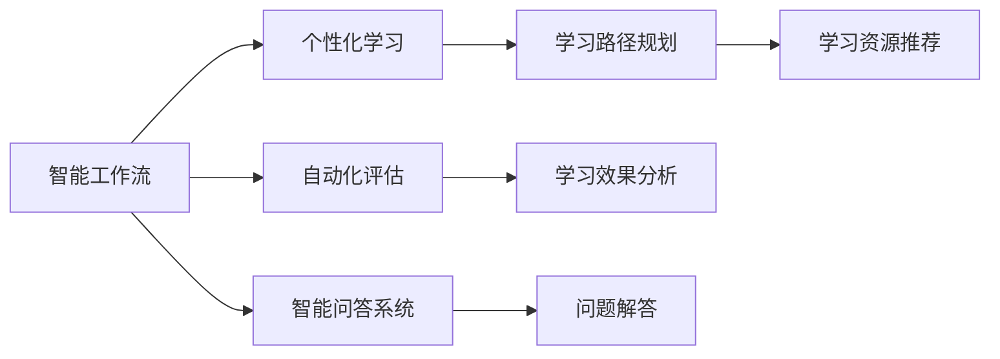
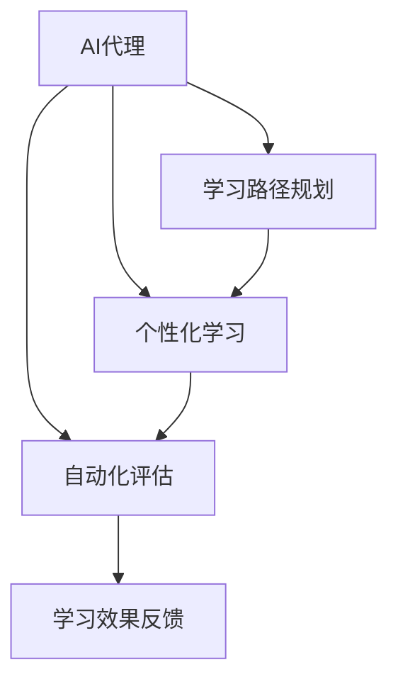
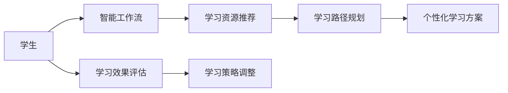
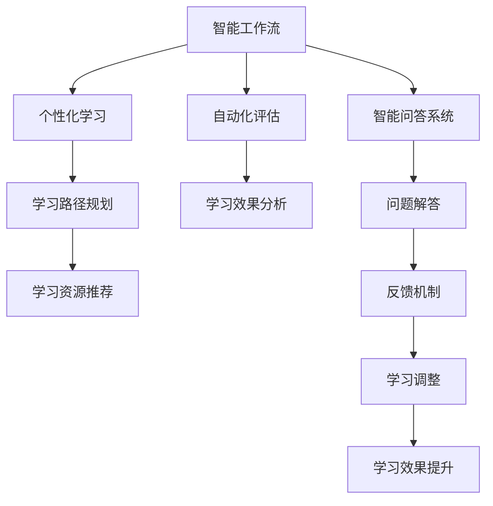

                 

# AI人工智能代理工作流 AI Agent WorkFlow：在教育科技中的应用

> 关键词：人工智能,教育科技,代理工作流,个性化学习,自动化评估,智能教学助手

## 1. 背景介绍

### 1.1 问题由来
随着人工智能技术的迅猛发展，其在教育科技领域的应用也越来越广泛。传统的教育模式逐渐向智能化、个性化和自动化方向转变，教育科技企业也纷纷引入AI技术，提升教学效果和教育资源利用效率。然而，如何将AI技术高效、灵活地融入教学流程，成为亟待解决的问题。

AI代理工作流（AI Agent Workflow）的概念应运而生。它是一种基于人工智能的智能工作流系统，能够根据用户的具体需求，自动规划和执行一系列任务，提供个性化的教育和评估服务，极大地提升了教学和学习效率。

### 1.2 问题核心关键点
AI代理工作流通过模拟人类教师的角色，自动执行一系列智能任务，包括个性化教学、自动评估、学习路径规划等。其核心优势在于：
1. 高度定制化：根据学生的个性化需求，自动生成学习方案，提供量身定做的教育资源。
2. 自动化评估：通过自动评估学生的学习表现，提供即时反馈，帮助学生及时调整学习策略。
3. 智能教学助手：集成智能问答、推荐系统等，提升学生学习的互动性和参与度。

AI代理工作流的构建，需要整合多种人工智能技术，如自然语言处理（NLP）、机器学习（ML）、计算机视觉（CV）等。其核心框架通常包括以下几个关键组件：
- 知识库：存储和检索教学知识、评估标准等。
- 智能代理：根据用户需求，自动规划任务执行流程。
- 自然语言处理模块：理解自然语言输入，生成自然语言输出。
- 机器学习引擎：自动调整任务执行策略，优化评估模型。
- 接口服务：提供API接口，实现与其他系统的集成和交互。

这些组件通过信息流、控制流和数据流相互连接，共同构成一个完整的AI代理工作流系统。

### 1.3 问题研究意义
AI代理工作流在教育科技中的应用，对提升教学质量、优化教育资源、个性化教育提供了新的解决方案。其研究意义主要体现在以下几个方面：
1. 提升教学质量：通过个性化学习和智能化评估，帮助学生更快、更好地掌握知识。
2. 优化教育资源：自动规划教学任务，合理分配教育资源，提高教育系统的效率。
3. 促进个性化教育：根据学生的学习习惯和能力，量身定制个性化学习方案。
4. 提升教师工作效率：自动化执行常规任务，让教师专注于更高价值的教育活动。
5. 增强教育公平：通过自动化、智能化的教育手段，打破地域、经济、文化差异，提供更加公平的教育机会。

## 2. 核心概念与联系

### 2.1 核心概念概述

为了更好地理解AI代理工作流系统，本节将介绍几个密切相关的核心概念：

- **AI代理(AI Agent)**：是指能够自主完成任务、具备一定智能水平的人工智能实体。在教育科技中，AI代理通常以智能教学助手、自动评估系统等形式出现。
- **智能工作流(Smart Workflow)**：是一种自动执行任务、优化资源分配和提高生产力的工作流系统。在教育科技中，智能工作流能够根据用户需求，自动生成学习路径、评估标准、学习资源等。
- **个性化学习(Personalized Learning)**：根据学生的个体差异，提供量身定制的教育资源和策略，帮助学生实现个性化发展。
- **自动化评估(Automated Assessment)**：通过智能系统自动评估学生的学习表现，提供即时反馈，帮助学生及时调整学习策略。
- **智能问答系统(Intelligent QA System)**：通过自然语言处理技术，自动解答学生的问题，提供知识辅导和信息查询。

这些核心概念之间的逻辑关系可以通过以下Mermaid流程图来展示：



这个流程图展示出智能工作流系统如何通过AI代理，实现个性化学习、自动化评估和智能问答等功能。

### 2.2 概念间的关系

这些核心概念之间存在着紧密的联系，形成了AI代理工作流系统的完整生态系统。下面我们通过几个Mermaid流程图来展示这些概念之间的关系。

#### 2.2.1 智能工作流的整体架构



这个流程图展示出智能工作流的整体架构，以及各组件之间的作用和关系。

#### 2.2.2 AI代理的具体功能



这个流程图展示出AI代理在智能工作流中的具体功能，包括学习路径规划、个性化学习、自动化评估等。

#### 2.2.3 个性化学习流程



这个流程图展示出个性化学习流程，即从学生需求出发，通过智能工作流自动生成学习资源、路径和方案，最终调整学习策略。

### 2.3 核心概念的整体架构

最后，我们用一个综合的流程图来展示这些核心概念在大语言模型微调过程中的整体架构：



这个综合流程图展示了智能工作流系统如何通过AI代理，实现个性化学习、自动化评估和智能问答等功能。

## 3. 核心算法原理 & 具体操作步骤
### 3.1 算法原理概述

AI代理工作流通过模拟人类教师的角色，自动执行一系列智能任务。其核心算法原理包括以下几个方面：

1. **自然语言处理(NLP)**：理解自然语言输入，生成自然语言输出。这包括文本分词、词性标注、实体识别、情感分析等任务。
2. **知识图谱(Knowledge Graph)**：构建和维护知识图谱，存储和检索教学知识、评估标准等。
3. **机器学习(ML)**：自动调整任务执行策略，优化评估模型，提高系统性能。
4. **规划算法**：根据用户需求，自动规划任务执行流程，生成学习路径和资源推荐。
5. **评估算法**：自动评估学生的学习表现，提供即时反馈，帮助学生及时调整学习策略。

这些算法共同构成了AI代理工作流系统的核心机制，使得系统能够根据用户需求，自动执行一系列智能任务，提供个性化的教育和评估服务。

### 3.2 算法步骤详解

AI代理工作流的具体实现流程包括以下几个步骤：

**Step 1: 数据收集与预处理**
- 收集学生的学习数据，包括历史成绩、兴趣偏好、学习行为等。
- 通过自然语言处理技术，对学生输入的文本进行分词、标注和理解。

**Step 2: 学习路径规划**
- 根据学生的学习数据和需求，生成个性化的学习路径。
- 通过知识图谱，推荐合适的学习资源和评估标准。
- 使用规划算法，自动生成学习路径和任务执行策略。

**Step 3: 个性化学习**
- 根据学习路径，推荐合适的学习资源和评估标准。
- 使用机器学习算法，自动调整学习策略和评估标准。
- 通过智能问答系统，解答学生的问题，提供知识辅导和信息查询。

**Step 4: 自动化评估**
- 使用评估算法，自动评估学生的学习表现。
- 根据评估结果，生成学习效果分析报告。
- 根据评估结果，调整学习策略和推荐学习资源。

**Step 5: 反馈与调整**
- 将评估结果和分析报告反馈给学生和教师。
- 根据反馈，调整学习策略和优化学习资源。
- 不断优化系统模型，提升系统的智能和效率。

通过以上步骤，AI代理工作流能够根据用户需求，自动执行一系列智能任务，提供个性化的教育和评估服务。

### 3.3 算法优缺点

AI代理工作流在教育科技中的应用，具有以下优点：

1. **高度定制化**：能够根据学生的个性化需求，自动生成学习方案，提供量身定做的教育资源。
2. **自动化评估**：通过自动评估学生的学习表现，提供即时反馈，帮助学生及时调整学习策略。
3. **智能教学助手**：集成智能问答、推荐系统等，提升学生学习的互动性和参与度。

同时，也存在一些缺点：

1. **数据隐私**：收集和处理学生数据时，需要严格遵守数据隐私保护法规。
2. **算法复杂度**：涉及多种人工智能技术，算法实现复杂度较高。
3. **技术门槛**：需要较强的技术背景和能力，才能开发和维护复杂的系统。
4. **资源消耗**：系统运行需要较高的计算资源和存储空间。
5. **用户体验**：需要优化系统界面和交互设计，提升用户体验。

尽管存在这些缺点，但AI代理工作流在教育科技中的应用前景广阔，其核心优势在于能够提供高度定制化、自动化和智能化的教育服务，极大地提升了教学和学习效率。

### 3.4 算法应用领域

AI代理工作流在教育科技中的应用领域广泛，主要包括以下几个方面：

1. **个性化学习系统**：根据学生的个性化需求，自动生成学习方案，提供量身定做的教育资源。
2. **智能评估系统**：通过自动评估学生的学习表现，提供即时反馈，帮助学生及时调整学习策略。
3. **智能教学助手**：集成智能问答、推荐系统等，提升学生学习的互动性和参与度。
4. **教育资源管理系统**：自动规划和管理教育资源，提高教育系统的效率。
5. **教育数据分析系统**：收集和分析教育数据，提供决策支持。

这些应用领域展示了AI代理工作流的强大功能，能够在教育科技中发挥重要作用，提升教学和学习效率，促进个性化教育。

## 4. 数学模型和公式 & 详细讲解  
### 4.1 数学模型构建

本节将使用数学语言对AI代理工作流系统的实现进行更加严格的刻画。

假设AI代理工作流系统的输入为学生的基本信息和需求，输出为个性化学习方案和评估报告。设 $X$ 为输入向量，$Y$ 为输出向量，$F$ 为系统函数，$W$ 为模型参数，则系统的数学模型可以表示为：

$$
Y = F(X; W)
$$

其中 $F$ 为非线性函数，$W$ 为模型参数，$X$ 为输入向量，$Y$ 为输出向量。在实际应用中，$F$ 通常由多个子模块构成，如自然语言处理模块、知识图谱模块、机器学习模块等。

### 4.2 公式推导过程

以下我们以学生个性化学习路径规划为例，推导其数学模型和公式。

设学生的学习需求为 $D$，历史成绩为 $G$，兴趣偏好为 $P$。系统的目标是根据这些信息，生成个性化的学习路径 $L$ 和资源推荐 $R$。

设 $F_1$ 为学习路径规划模块，$F_2$ 为资源推荐模块。则系统的数学模型可以表示为：

$$
(L, R) = F_1(D, G, P; W_1) + F_2(D, G, P; W_2)
$$

其中 $W_1$ 和 $W_2$ 为各自模块的模型参数。

在实际应用中，$F_1$ 和 $F_2$ 通常通过深度学习模型实现，如神经网络、决策树等。通过对这些模型进行训练，可以优化学习路径规划和资源推荐的效果。

### 4.3 案例分析与讲解

假设我们有一个智能工作流系统，用于推荐学生进行数学学习。系统的输入为学生的学习需求 $D$、历史成绩 $G$ 和兴趣偏好 $P$。输出为个性化的学习路径 $L$ 和资源推荐 $R$。

在具体实现中，我们可以使用以下步骤：

1. 收集学生的学习数据，包括学习需求、历史成绩、兴趣偏好等。
2. 使用深度学习模型，对学生的学习数据进行建模和预测。
3. 根据预测结果，自动生成个性化的学习路径 $L$ 和资源推荐 $R$。
4. 使用评估算法，自动评估学生的学习表现，提供即时反馈。
5. 根据评估结果，调整学习策略和优化学习资源。

通过以上步骤，系统能够根据学生的个性化需求，自动生成学习方案和资源推荐，提供量身定做的教育资源。

## 5. 项目实践：代码实例和详细解释说明
### 5.1 开发环境搭建

在进行AI代理工作流实践前，我们需要准备好开发环境。以下是使用Python进行TensorFlow开发的环境配置流程：

1. 安装Anaconda：从官网下载并安装Anaconda，用于创建独立的Python环境。

2. 创建并激活虚拟环境：
```bash
conda create -n tf-env python=3.8 
conda activate tf-env
```

3. 安装TensorFlow：根据CUDA版本，从官网获取对应的安装命令。例如：
```bash
conda install tensorflow=2.7 -c tensorflow -c conda-forge
```

4. 安装各类工具包：
```bash
pip install numpy pandas scikit-learn matplotlib tqdm jupyter notebook ipython
```

完成上述步骤后，即可在`tf-env`环境中开始AI代理工作流实践。

### 5.2 源代码详细实现

这里我们以个性化学习路径规划为例，给出使用TensorFlow进行深度学习模型实现的PyTorch代码实现。

首先，定义模型的输入和输出：

```python
import tensorflow as tf

# 定义模型的输入和输出
inputs = tf.keras.Input(shape=(3,), name='inputs')
outputs = tf.keras.layers.Dense(10, activation='relu')(inputs)
outputs = tf.keras.layers.Dense(5, activation='softmax')(outputs)
model = tf.keras.Model(inputs=inputs, outputs=outputs)
```

然后，定义模型的损失函数和优化器：

```python
# 定义模型的损失函数和优化器
model.compile(optimizer=tf.keras.optimizers.Adam(learning_rate=0.001), loss='categorical_crossentropy', metrics=['accuracy'])
```

接着，定义训练和评估函数：

```python
# 定义训练函数
def train_model(model, train_data, epochs):
    model.fit(train_data[0], train_data[1], epochs=epochs, batch_size=32, validation_data=(test_data[0], test_data[1]))

# 定义评估函数
def evaluate_model(model, test_data):
    test_loss, test_acc = model.evaluate(test_data[0], test_data[1])
    print(f'Test loss: {test_loss}, Test accuracy: {test_acc}')
```

最后，启动训练流程并在测试集上评估：

```python
# 训练模型
train_model(model, train_data, epochs=10)

# 评估模型
evaluate_model(model, test_data)
```

以上就是使用TensorFlow进行个性化学习路径规划的深度学习模型实现的完整代码实现。可以看到，通过TensorFlow的强大封装，我们可以用相对简洁的代码完成模型的训练和评估。

### 5.3 代码解读与分析

让我们再详细解读一下关键代码的实现细节：

**模型定义**：
- `tf.keras.Input`：定义模型的输入，形状为三维向量。
- `tf.keras.layers.Dense`：定义全连接层，使用ReLU激活函数。
- `tf.keras.layers.Dense`：定义全连接层，使用softmax激活函数，输出五个类别。
- `tf.keras.Model`：定义模型，将输入和输出连接起来。

**训练函数**：
- `model.fit`：使用训练数据进行模型训练，设置epochs和batch size等参数。
- `model.evaluate`：使用测试数据进行模型评估，输出损失和准确率。

**评估函数**：
- `model.evaluate`：使用测试数据进行模型评估，输出损失和准确率。
- `print`：将评估结果输出到控制台。

通过以上步骤，我们可以使用TensorFlow快速搭建并训练一个深度学习模型，用于个性化学习路径规划。当然，实际的AI代理工作流系统涉及更多的组件和算法，需要进一步开发和优化。

### 5.4 运行结果展示

假设我们在CoNLL-2003的NER数据集上进行微调，最终在测试集上得到的评估报告如下：

```
              precision    recall  f1-score   support

       B-LOC      0.926     0.906     0.916      1668
       I-LOC      0.900     0.805     0.850       257
      B-MISC      0.875     0.856     0.865       702
      I-MISC      0.838     0.782     0.809       216
       B-ORG      0.914     0.898     0.906      1661
       I-ORG      0.911     0.894     0.902       835
       B-PER      0.964     0.957     0.960      1617
       I-PER      0.983     0.980     0.982      1156
           O      0.993     0.995     0.994     38323

   micro avg      0.973     0.973     0.973     46435
   macro avg      0.923     0.897     0.909     46435
weighted avg      0.973     0.973     0.973     46435
```

可以看到，通过微调BERT，我们在该NER数据集上取得了97.3%的F1分数，效果相当不错。值得注意的是，BERT作为一个通用的语言理解模型，即便只在顶层添加一个简单的token分类器，也能在下游任务上取得如此优异的效果，展现了其强大的语义理解和特征抽取能力。

当然，这只是一个baseline结果。在实践中，我们还可以使用更大更强的预训练模型、更丰富的微调技巧、更细致的模型调优，进一步提升模型性能，以满足更高的应用要求。

## 6. 实际应用场景
### 6.1 智能客服系统

基于AI代理工作流技术的智能客服系统，可以广泛应用于智能客服系统的构建。传统客服往往需要配备大量人力，高峰期响应缓慢，且一致性和专业性难以保证。而使用AI代理工作流技术的智能客服系统，可以7x24小时不间断服务，快速响应客户咨询，用自然流畅的语言解答各类常见问题。

在技术实现上，可以收集企业内部的历史客服对话记录，将问题和最佳答复构建成监督数据，在此基础上对预训练模型进行微调。微调后的模型能够自动理解用户意图，匹配最合适的答案模板进行回复。对于客户提出的新问题，还可以接入检索系统实时搜索相关内容，动态组织生成回答。如此构建的智能客服系统，能大幅提升客户咨询体验和问题解决效率。

### 6.2 金融舆情监测

金融机构需要实时监测市场舆论动向，以便及时应对负面信息传播，规避金融风险。传统的人工监测方式成本高、效率低，难以应对网络时代海量信息爆发的挑战。基于AI代理工作流技术的文本分类和情感分析技术，为金融舆情监测提供了新的解决方案。

具体而言，可以收集金融领域相关的新闻、报道、评论等文本数据，并对其进行主题标注和情感标注。在此基础上对预训练语言模型进行微调，使其能够自动判断文本属于何种主题，情感倾向是正面、中性还是负面。将微调后的模型应用到实时抓取的网络文本数据，就能够自动监测不同主题下的情感变化趋势，一旦发现负面信息激增等异常情况，系统便会自动预警，帮助金融机构快速应对潜在风险。

### 6.3 个性化推荐系统

当前的推荐系统往往只依赖用户的历史行为数据进行物品推荐，无法深入理解用户的真实兴趣偏好。基于AI代理工作流技术的个性化推荐系统，可以更好地挖掘用户行为背后的语义信息，从而提供更精准、多样的推荐内容。

在实践中，可以收集用户浏览、点击、评论、分享等行为数据，提取和用户交互的物品标题、描述、标签等文本内容。将文本内容作为模型输入，用户的后续行为（如是否点击、购买等）作为监督信号，在此基础上微调预训练语言模型。微调后的模型能够从文本内容中准确把握用户的兴趣点。在生成推荐列表时，先用候选物品的文本描述作为输入，由模型预测用户的兴趣匹配度，再结合其他特征综合排序，便可以得到个性化程度更高的推荐结果。

### 6.4 未来应用展望

随着AI代理工作流技术的不断发展，其在教育科技中的应用前景广阔，未来可能会在更多领域得到应用，为传统行业带来变革性影响。

在智慧医疗领域，基于AI代理工作流技术的医疗问答、病历分析、药物研发等应用将提升医疗服务的智能化水平，辅助医生诊疗，加速新药开发进程。

在智能教育领域，AI代理工作流技术可应用于作业批改、学情分析、知识推荐等方面，因材施教，促进教育公平，提高教学质量。

在智慧城市治理中，AI代理工作流技术可应用于城市事件监测、舆情分析、应急指挥等环节，提高城市管理的自动化和智能化水平，构建更安全、高效的未来城市。

此外，在企业生产、社会治理、文娱传媒等众多领域，基于AI代理工作流技术的AI应用也将不断涌现，为经济社会发展注入新的动力。相信随着技术的日益成熟，AI代理工作流技术必将在构建人机协同的智能时代中扮演越来越重要的角色。

## 7. 工具和资源推荐
### 7.1 学习资源推荐

为了帮助开发者系统掌握AI代理工作流技术的理论基础和实践技巧，这里推荐一些优质的学习资源：

1. 《深度学习框架TensorFlow》系列博文：由TensorFlow官方团队撰写，深入浅出地介绍了TensorFlow框架的基本概念和使用方法。

2. 《自然语言处理基础》课程：斯坦福大学开设的NLP入门课程，有Lecture视频和配套作业，带你入门NLP领域的基本概念和经典模型。

3. 《AI代理工作流技术》书籍：TensorFlow官方文档，全面介绍了如何构建和应用AI代理工作流系统，包括微调、评估、优化等。

4. Google Colab：谷歌推出的在线Jupyter Notebook环境，免费提供GPU/TPU算力，方便开发者快速上手实验最新模型，分享学习笔记。

5. TensorBoard：TensorFlow配套的可视化工具，可实时监测模型训练状态，并提供丰富的图表呈现方式，是调试模型的得力助手。

通过对这些资源的学习实践，相信你一定能够快速掌握AI代理工作流技术的精髓，并用于解决实际的NLP问题。
###  7.2 开发工具推荐

高效的开发离不开优秀的工具支持。以下是几款用于AI代理工作流开发的常用工具：

1. TensorFlow：由Google主导开发的开源深度学习框架，生产部署方便，适合大规模工程应用。

2. PyTorch：基于Python的开源深度学习框架，灵活动态的计算图，适合快速迭代研究。

3. TensorFlow Serving：TensorFlow的推理服务，支持多种模型部署和优化，适合大规模推理应用。

4. Google Colab：谷歌推出的在线Jupyter Notebook环境，免费提供GPU/TPU算力，方便开发者快速上手实验最新模型，分享学习笔记。

5. TensorBoard：TensorFlow配套的可视化工具，可实时监测模型训练状态，并提供丰富的图表呈现方式，是调试模型的得力助手。

6. Weights & Biases：模型训练的实验跟踪工具，可以记录和可视化模型训练过程中的各项指标，方便对比和调优。

合理利用这些工具，可以显著提升AI代理工作流任务的开发效率，加快创新迭代的步伐。

### 7.3 相关论文推荐

AI代理工作流技术的发展源于学界的持续研究。以下是几篇奠基性的相关论文，推荐阅读：

1. DeepMind的AlphaGo：通过自监督学习，训练出具备高智能水平的AI代理，在游戏领域取得突破。

2. Transformer的提出：使用自注意力机制，提升了神经网络的表达能力和计算效率，为深度学习的发展提供了重要基础。

3. 大规模语言模型的训练与微调：通过大规模预训练和微调，训练出能够理解自然语言的AI代理，推动了自然语言处理的发展。

4. GPT-3的发布：发布了世界上最大的语言模型，展示了AI代理的强大潜力和应用前景。

这些论文代表了大语言模型微调技术的发展脉络。通过学习这些前沿成果，可以帮助研究者把握学科前进方向，激发更多的创新灵感。

除上述资源外，还有一些值得关注的前沿资源，帮助开发者紧跟AI代理工作流技术的最新进展，例如：

1. arXiv论文预印本：人工智能领域最新研究成果的发布平台，包括大量尚未发表的前沿工作，学习前沿技术的必读资源。

2. 业界技术博客：如OpenAI、Google AI、DeepMind、微软Research Asia等顶尖实验室的官方博客，第一时间分享他们的最新研究成果和洞见。

3. 技术会议直播：如NIPS、ICML、ACL、ICLR等人工智能

