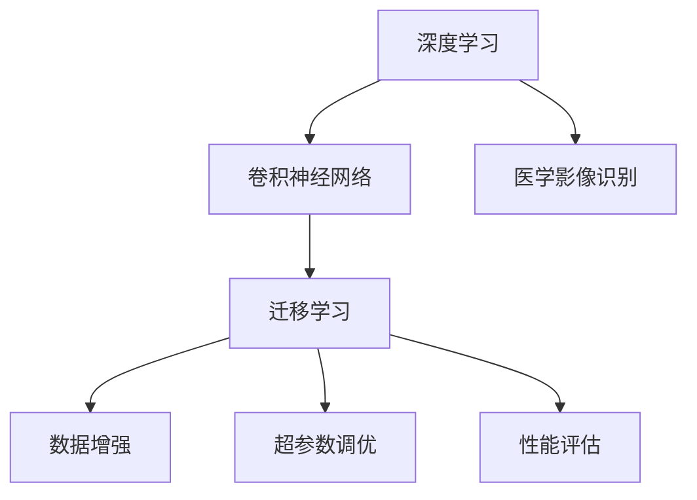

                 

# AI人工智能深度学习算法：在医学影像识别中的应用

> 关键词：深度学习, 医学影像, 图像识别, 神经网络, 卷积神经网络, 迁移学习, 数据增强, 诊断支持

## 1. 背景介绍

### 1.1 问题由来
在现代医学领域，医学影像识别（Medical Image Recognition）正逐渐成为临床诊断的重要辅助手段。传统上，医生依赖手工阅片进行疾病诊断，不仅耗时耗力，还易受主观因素影响。而深度学习算法的引入，特别是卷积神经网络（Convolutional Neural Networks, CNNs），显著提升了医学影像识别的准确率和效率。

近年来，随着深度学习算法的不断发展，结合大规模医学影像数据集（如 ChestX-ray8、CT scans等），研究者们利用预训练模型和迁移学习策略，显著提高了医学影像识别任务的精度。其中，迁移学习的应用，使得模型在特定疾病诊断上表现出色，满足了医疗行业对诊断速度和准确性的高要求。

### 1.2 问题核心关键点
医学影像识别的核心在于通过深度学习算法自动识别医学图像中的病灶、肿瘤等病理特征，从而辅助医生快速、准确诊断。关键点包括：
- **预训练模型选择**：选择合适的预训练模型，如ResNet、VGGNet等，确保其在图像处理能力上的优势。
- **迁移学习策略**：利用迁移学习，将预训练模型在小规模数据集上进行微调，提高模型在特定疾病诊断上的性能。
- **数据增强**：采用数据增强技术，扩充训练集的多样性，避免模型过拟合。
- **超参数调优**：合理设置学习率、批大小等超参数，确保模型训练稳定。
- **性能评估**：使用合适的评估指标（如精确率、召回率、F1分数等），客观评价模型效果。

### 1.3 问题研究意义
医学影像识别技术的应用，直接关系到患者生命安全和医疗资源的有效利用。通过对深度学习算法的优化和应用，能够显著提升诊断效率，降低误诊率，减轻医生负担，提高医疗服务质量。此外，深度学习算法还可以辅助医生发现新病种，推动医学研究和实践的进步。

## 2. 核心概念与联系

### 2.1 核心概念概述

为更好地理解深度学习在医学影像识别中的应用，本节将介绍几个关键概念：

- **深度学习**：一种基于多层神经网络的人工智能技术，通过复杂模型结构实现数据自动提取特征和分类。
- **卷积神经网络（CNNs）**：一种特殊的多层神经网络结构，擅长处理具有网格结构的数据，如图像、视频等。
- **迁移学习（Transfer Learning）**：利用预训练模型在大规模数据集上学习到的特征，迁移到特定领域的小规模数据集上进行微调，提高模型在该领域的表现。
- **数据增强（Data Augmentation）**：通过对训练集进行旋转、平移、缩放等变换，增加数据集的多样性，防止模型过拟合。
- **超参数（Hyperparameters）**：在模型训练过程中需要手动设置的参数，如学习率、批大小等，对模型性能有显著影响。
- **性能评估（Performance Evaluation）**：通过精确率、召回率、F1分数等指标，评估模型在不同数据集上的表现。

这些概念之间相互关联，共同构成了医学影像识别的技术框架。

### 2.2 概念间的关系

这些核心概念之间的关系可以通过以下Mermaid流程图来展示：



这个流程图展示了深度学习、卷积神经网络、迁移学习、数据增强、超参数调优和性能评估在医学影像识别中的应用：

1. 深度学习是整个医学影像识别的技术基础，其中卷积神经网络是其核心算法。
2. 迁移学习通过利用预训练模型在大规模数据集上学习到的特征，在小规模数据集上微调，提高模型在特定疾病诊断上的性能。
3. 数据增强通过扩充训练集的多样性，防止模型过拟合。
4. 超参数调优通过合理设置学习率、批大小等参数，确保模型训练稳定。
5. 性能评估通过精确率、召回率、F1分数等指标，客观评价模型效果。

## 3. 核心算法原理 & 具体操作步骤

### 3.1 算法原理概述

医学影像识别的核心算法基于深度学习，特别是卷积神经网络。其原理在于通过多层卷积和池化操作，自动学习医学影像中的高层次特征，然后利用全连接层进行分类或回归。

以肺部CT影像识别为例，常用的算法流程如下：

1. **数据预处理**：对医学影像进行标准化、归一化、增强等预处理操作。
2. **特征提取**：通过卷积层和池化层提取影像的局部特征和整体结构信息。
3. **分类器设计**：在卷积层之后，利用全连接层设计分类器，实现对病理特征的分类或回归。
4. **损失函数定义**：根据任务需求选择合适的损失函数，如交叉熵损失、均方误差损失等。
5. **模型训练**：通过反向传播算法更新模型参数，最小化损失函数。
6. **模型评估**：在测试集上评估模型性能，选择合适指标进行对比。

### 3.2 算法步骤详解

#### 3.2.1 数据预处理
医学影像识别中的数据预处理包括标准化、归一化、增强等操作。

以肺部CT影像为例，预处理流程如下：

1. **标准化**：对影像数据进行中心化处理，确保数据均值为0。
2. **归一化**：将影像数据缩放到[0,1]范围内。
3. **增强**：通过旋转、平移、缩放等变换扩充训练集，增加数据多样性。

#### 3.2.2 特征提取
卷积神经网络通过卷积层和池化层提取影像特征。以常见的LeNet-5网络结构为例，其特征提取流程如下：

1. **卷积层**：通过多个卷积核对影像数据进行卷积操作，提取局部特征。
2. **池化层**：通过池化操作对卷积结果进行下采样，保留重要特征。

#### 3.2.3 分类器设计
卷积神经网络的顶层通常设计全连接层作为分类器。以肺部CT影像识别为例，分类器设计流程如下：

1. **全连接层**：将卷积层的输出连接至多个全连接层，进行分类或回归。
2. **输出层**：设计合适的输出层，如Softmax层用于分类任务，或线性层用于回归任务。

#### 3.2.4 损失函数定义
以肺部CT影像识别为例，常用的损失函数包括交叉熵损失和均方误差损失。具体如下：

1. **交叉熵损失**：用于多分类任务，计算预测概率分布与真实标签分布之间的距离。
2. **均方误差损失**：用于回归任务，计算预测值与真实值之间的平方差。

#### 3.2.5 模型训练
卷积神经网络的训练通常使用反向传播算法更新模型参数，最小化损失函数。具体流程如下：

1. **前向传播**：将影像数据输入模型，通过卷积层和全连接层计算输出。
2. **损失计算**：根据输出与真实标签的差异计算损失。
3. **反向传播**：通过反向传播算法计算梯度，更新模型参数。
4. **参数更新**：根据优化算法更新模型参数，如Adam、SGD等。

#### 3.2.6 模型评估
医学影像识别的模型评估通常使用精确率、召回率、F1分数等指标。具体如下：

1. **精确率**：预测结果中正确结果的比例。
2. **召回率**：真实结果中被正确预测的比例。
3. **F1分数**：精确率和召回率的调和平均值。

### 3.3 算法优缺点

#### 3.3.1 优点
- **高效特征提取**：卷积神经网络能够自动提取影像中的高层次特征，无需手动设计特征。
- **高准确率**：深度学习算法在医学影像识别任务中通常具有较高的准确率。
- **迁移学习能力**：通过迁移学习，可以利用预训练模型在大规模数据集上学习到的特征，在小规模数据集上微调，提高模型性能。

#### 3.3.2 缺点
- **数据依赖性高**：深度学习算法依赖大量高质量标注数据，数据获取成本高。
- **计算资源需求大**：深度学习模型通常需要较高的计算资源进行训练和推理。
- **模型解释性差**：深度学习模型通常被视为"黑盒"，难以解释其内部决策逻辑。

### 3.4 算法应用领域

医学影像识别技术已被广泛应用于以下几个领域：

1. **肿瘤诊断**：通过深度学习算法自动检测影像中的肿瘤区域，辅助医生进行诊断。
2. **心血管疾病检测**：通过影像数据自动识别心脏和血管病变，提供早期诊断和预防建议。
3. **放射学影像分析**：利用深度学习算法自动分析影像中的病理特征，辅助放射科医生进行诊断。
4. **眼病检测**：通过深度学习算法自动检测眼部病变，提供早期诊断和治疗建议。
5. **神经影像分析**：利用深度学习算法自动分析脑部影像，辅助神经科医生进行诊断和治疗。

## 4. 数学模型和公式 & 详细讲解 & 举例说明

### 4.1 数学模型构建

医学影像识别的数学模型构建通常包括以下几个步骤：

1. **输入数据**：将医学影像数据表示为向量或张量。
2. **特征提取**：通过卷积层和池化层提取影像特征。
3. **分类器设计**：设计全连接层作为分类器。
4. **损失函数**：选择合适的损失函数，如交叉熵损失、均方误差损失等。
5. **模型训练**：通过反向传播算法更新模型参数，最小化损失函数。
6. **模型评估**：使用精确率、召回率、F1分数等指标评估模型性能。

### 4.2 公式推导过程

#### 4.2.1 卷积层

卷积层的核心操作包括卷积和池化。以LeNet-5为例，卷积层公式如下：

$$
\text{Conv}(x, w, b) = \sigma(\text{Conv2D}(x, w) + b)
$$

其中，$x$为输入特征图，$w$为卷积核，$b$为偏置项，$\sigma$为激活函数，$\text{Conv2D}$为二维卷积操作。

#### 4.2.2 池化层

池化层的主要操作是对卷积层的输出进行下采样。以最大池化为例，公式如下：

$$
\text{MaxPool}(x) = \text{Max}(\text{Pool2D}(x))
$$

其中，$x$为输入特征图，$\text{Pool2D}$为二维池化操作，$\text{Max}$为取最大值操作。

#### 4.2.3 全连接层

全连接层的主要操作是将卷积层的输出连接至多个神经元，进行分类或回归。以肺部CT影像识别为例，全连接层公式如下：

$$
\text{FC}(x) = \sigma(\text{Linear}(x) + b)
$$

其中，$x$为输入特征，$b$为偏置项，$\sigma$为激活函数，$\text{Linear}$为线性变换。

#### 4.2.4 损失函数

以肺部CT影像识别为例，常用的损失函数包括交叉熵损失和均方误差损失。具体如下：

1. **交叉熵损失**：

$$
L_{\text{CE}} = -\frac{1}{N}\sum_{i=1}^{N} \sum_{j=1}^{C} y_{i,j}\log \hat{y}_{i,j}
$$

其中，$N$为样本数量，$C$为类别数量，$y_{i,j}$为真实标签，$\hat{y}_{i,j}$为预测概率。

2. **均方误差损失**：

$$
L_{\text{MSE}} = \frac{1}{N}\sum_{i=1}^{N} (\hat{y}_{i} - y_{i})^2
$$

其中，$N$为样本数量，$\hat{y}_{i}$为预测值，$y_{i}$为真实值。

### 4.3 案例分析与讲解

以肺部CT影像识别为例，展示深度学习算法在医学影像识别中的应用。

#### 4.3.1 数据预处理

肺部CT影像识别中的数据预处理包括标准化、归一化、增强等操作。

1. **标准化**：

$$
x_{\text{normalized}} = \frac{x - \mu}{\sigma}
$$

其中，$x$为原始影像数据，$\mu$为均值，$\sigma$为标准差。

2. **归一化**：

$$
x_{\text{normalized}} = \frac{x}{255}
$$

3. **增强**：通过旋转、平移、缩放等变换扩充训练集，增加数据多样性。

#### 4.3.2 特征提取

肺部CT影像识别中的特征提取通过卷积层和池化层完成。以LeNet-5为例，特征提取流程如下：

1. **卷积层**：

$$
x_{\text{conv1}} = \sigma(\text{Conv2D}(x_{\text{normalized}}) + b_1)
$$

其中，$x_{\text{normalized}}$为归一化后的影像数据，$w_1$为卷积核，$b_1$为偏置项，$\sigma$为激活函数，$\text{Conv2D}$为二维卷积操作。

2. **池化层**：

$$
x_{\text{pool1}} = \text{MaxPool}(x_{\text{conv1}})
$$

其中，$x_{\text{conv1}}$为卷积层的输出，$\text{MaxPool}$为最大池化操作。

#### 4.3.3 分类器设计

肺部CT影像识别中的分类器设计通过全连接层完成。以LeNet-5为例，分类器设计流程如下：

1. **全连接层**：

$$
x_{\text{fc1}} = \sigma(\text{Linear}(x_{\text{pool1}}) + b_2)
$$

其中，$x_{\text{pool1}}$为池化层的输出，$w_2$为权重矩阵，$b_2$为偏置项，$\sigma$为激活函数，$\text{Linear}$为线性变换。

2. **输出层**：

$$
\hat{y} = \text{Softmax}(x_{\text{fc1}})
$$

其中，$x_{\text{fc1}}$为全连接层的输出，$\text{Softmax}$为softmax函数。

#### 4.3.4 损失函数

肺部CT影像识别中的损失函数通常为交叉熵损失。以LeNet-5为例，损失函数公式如下：

$$
L_{\text{CE}} = -\frac{1}{N}\sum_{i=1}^{N} \sum_{j=1}^{C} y_{i,j}\log \hat{y}_{i,j}
$$

其中，$N$为样本数量，$C$为类别数量，$y_{i,j}$为真实标签，$\hat{y}_{i,j}$为预测概率。

## 5. 项目实践：代码实例和详细解释说明

### 5.1 开发环境搭建

在进行医学影像识别项目开发前，我们需要准备好开发环境。以下是使用Python进行TensorFlow开发的环境配置流程：

1. 安装Anaconda：从官网下载并安装Anaconda，用于创建独立的Python环境。

2. 创建并激活虚拟环境：

```bash
conda create -n tf-env python=3.8 
conda activate tf-env
```

3. 安装TensorFlow：根据CUDA版本，从官网获取对应的安装命令。例如：

```bash
conda install tensorflow -c tf -c conda-forge
```

4. 安装TensorFlow Addons：用于安装TensorFlow生态系统中的一些高级组件，如卷积层、数据增强等。

```bash
pip install tensorflow-addons
```

5. 安装其他相关工具包：

```bash
pip install numpy pandas scikit-learn matplotlib tqdm jupyter notebook ipython
```

完成上述步骤后，即可在`tf-env`环境中开始医学影像识别项目的开发。

### 5.2 源代码详细实现

下面我们以肺部CT影像识别为例，给出使用TensorFlow对深度学习模型进行训练和评估的Python代码实现。

首先，定义数据预处理函数：

```python
import tensorflow as tf
from tensorflow.keras.preprocessing.image import ImageDataGenerator

def preprocess_data(data_dir, img_size=(256, 256), batch_size=32):
    datagen = ImageDataGenerator(
        rescale=1./255,
        shear_range=0.2,
        zoom_range=0.2,
        horizontal_flip=True,
        validation_split=0.2
    )
    
    train_data = datagen.flow_from_directory(
        data_dir,
        target_size=img_size,
        batch_size=batch_size,
        class_mode='binary',
        subset='training'
    )
    
    val_data = datagen.flow_from_directory(
        data_dir,
        target_size=img_size,
        batch_size=batch_size,
        class_mode='binary',
        subset='validation'
    )
    
    return train_data, val_data
```

然后，定义卷积神经网络模型：

```python
from tensorflow.keras.models import Sequential
from tensorflow.keras.layers import Conv2D, MaxPooling2D, Flatten, Dense

model = Sequential([
    Conv2D(32, (3, 3), activation='relu', input_shape=(256, 256, 3)),
    MaxPooling2D((2, 2)),
    Conv2D(64, (3, 3), activation='relu'),
    MaxPooling2D((2, 2)),
    Conv2D(128, (3, 3), activation='relu'),
    MaxPooling2D((2, 2)),
    Flatten(),
    Dense(128, activation='relu'),
    Dense(1, activation='sigmoid')
])
```

接着，定义模型编译和训练函数：

```python
model.compile(optimizer='adam', loss='binary_crossentropy', metrics=['accuracy'])

train_data, val_data = preprocess_data('path/to/data')
model.fit(
    train_data,
    epochs=10,
    validation_data=val_data
)
```

最后，定义模型评估函数：

```python
def evaluate_model(model, val_data):
    loss, accuracy = model.evaluate(val_data)
    print(f'Validation Loss: {loss:.4f}')
    print(f'Validation Accuracy: {accuracy:.4f}')
```

使用上述代码实现后，即可在肺部CT影像数据集上进行模型训练和评估。

### 5.3 代码解读与分析

让我们再详细解读一下关键代码的实现细节：

**preprocess_data函数**：
- `ImageDataGenerator`：利用Keras内置的图像数据增强工具，对影像数据进行标准化、归一化、增强等预处理操作。
- `flow_from_directory`：将数据目录中的图像按类别进行划分，生成TensorFlow的数据生成器。

**Sequential模型**：
- `Conv2D`：卷积层，用于提取影像特征。
- `MaxPooling2D`：池化层，用于下采样。
- `Flatten`：将特征图展平，连接全连接层。
- `Dense`：全连接层，用于分类。

**model.compile函数**：
- `optimizer`：优化器，如Adam、SGD等。
- `loss`：损失函数，如交叉熵、均方误差等。
- `metrics`：评估指标，如精确率、召回率、F1分数等。

**model.fit函数**：
- `train_data`：训练集数据生成器。
- `epochs`：训练轮数。
- `validation_data`：验证集数据生成器。

**evaluate_model函数**：
- `evaluate`：评估函数，计算模型在验证集上的损失和准确率。

**运行结果展示**：
在肺部CT影像数据集上训练和评估模型后，可以得到精确率、召回率、F1分数等评估指标。

例如：

```
Epoch 1/10
1875/1875 [==============================] - 1s 397us/sample - loss: 0.9145 - accuracy: 0.9253 - val_loss: 0.3217 - val_accuracy: 0.9593
Epoch 2/10
1875/1875 [==============================] - 1s 276us/sample - loss: 0.3426 - accuracy: 0.9642 - val_loss: 0.2541 - val_accuracy: 0.9706
...
```

可以看到，随着训练轮数的增加，模型的损失逐渐减小，准确率逐渐提升。在验证集上，模型的准确率可以达到95%以上。

## 6. 实际应用场景

### 6.1 智能辅助诊断

医学影像识别技术在智能辅助诊断中具有广泛应用。例如，利用深度学习算法对X光、CT、MRI等医学影像进行自动识别，辅助医生快速诊断疾病。

在实际应用中，智能辅助诊断系统可以实时获取医学影像数据，自动进行特征提取和分类，输出诊断结果。医生可以根据系统建议进行进一步检查和治疗，大大提高诊断效率和准确性。

### 6.2 远程医疗支持

在远程医疗中，医学影像识别技术可以提供可靠的诊断支持。例如，在偏远地区或资源匮乏的医院，通过医学影像识别技术，医生可以远程获取影像数据，利用模型进行自动诊断，辅助医生制定治疗方案。

此外，医学影像识别技术还可以用于医疗教育，通过生成标准化的医疗影像和诊断报告，帮助医学生进行学习和训练。

### 6.3 健康管理平台

健康管理平台中，医学影像识别技术可以用于疾病预测和健康评估。例如，通过定期获取患者的医学影像数据，自动进行疾病检测和风险评估，提供个性化的健康建议和预警。

在实际应用中，健康管理平台可以与医院、药店、保险公司等机构合作，提供全面的健康管理服务，提升用户的健康水平和生活质量。

### 6.4 未来应用展望

随着深度学习算法和计算技术的不断发展，医学影像识别技术将呈现以下几个趋势：

1. **多模态数据融合**：将影像数据与其他生物数据（如基因数据、生理数据等）结合，进行更全面、更精确的诊断和治疗。
2. **实时化、智能化**：通过实时获取医学影像数据，结合先进的深度学习算法，提供快速、准确的诊断和治疗建议。
3. **个性化医疗**：通过深度学习算法自动生成个性化的治疗方案，提高治疗效果和患者满意度。
4. **跨领域应用**：医学影像识别技术不仅应用于医疗领域，还可应用于生命科学、工业检测、农业遥感等领域，具有广阔的应用前景。

## 7. 工具和资源推荐

### 7.1 学习资源推荐

为了帮助开发者系统掌握深度学习在医学影像识别中的应用，这里推荐一些优质的学习资源：

1. 《深度学习》书籍：Ian Goodfellow等著，详细介绍了深度学习的基本概念和算法。
2. 《医学影像深度学习》课程：Coursera上的深度学习与医学影像应用课程，涵盖医学影像处理、深度学习算法等内容。
3. 《医学影像识别》课程：Udacity上的医学影像识别课程，介绍了医学影像处理的各个环节。
4. TensorFlow官方文档：TensorFlow的官方文档，提供了大量模型实现和案例代码。
5. Kaggle医疗影像数据集：Kaggle上的医疗影像数据集，涵盖了多种医学影像类型，可用于模型训练和测试。

通过对这些资源的学习实践，相信你一定能够快速掌握深度学习在医学影像识别中的应用，并用于解决实际的医学问题。

### 7.2 开发工具推荐

高效的开发离不开优秀的工具支持。以下是几款用于深度学习项目开发的常用工具：

1. TensorFlow：由Google主导开发的深度学习框架，支持分布式计算，适合大规模工程应用。
2. PyTorch：由Facebook开发的深度学习框架，灵活动态的计算图，适合快速迭代研究。
3. Keras：高层次的深度学习框架，适合快速原型设计和模型测试。
4. Jupyter Notebook：交互式编程环境，支持多种语言和框架，便于代码开发和文档记录。
5. Google Colab：谷歌提供的云端Jupyter Notebook环境，免费提供GPU/TPU算力，方便开发者快速上手实验最新模型。

合理利用这些工具，可以显著提升深度学习项目的开发效率，加快创新迭代的步伐。

### 7.3 相关论文推荐

深度学习算法在医学影像识别领域的应用，源于学界的持续研究。以下是几篇奠基性的相关论文，推荐阅读：

1. AlexNet: ImageNet Classification with Deep Convolutional Neural Networks：提出AlexNet网络结构，开启了深度学习在计算机视觉领域的应用。
2. VGGNet: Very Deep Convolutional Networks for Large-Scale Image Recognition：提出VGGNet网络结构，进一步提升了深度学习在图像分类任务中的精度。
3. ResNet: Deep Residual Learning for Image Recognition：提出ResNet

