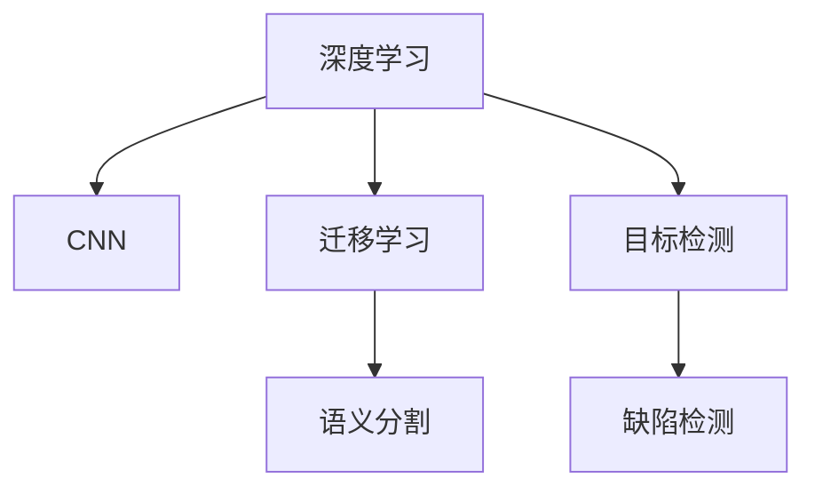
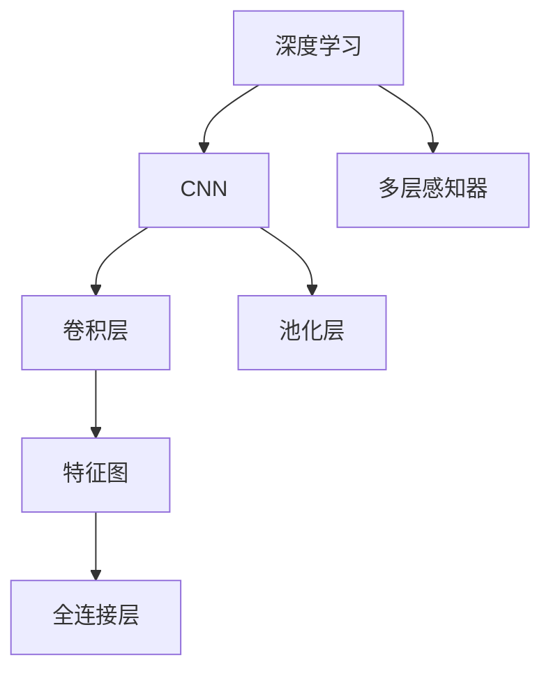
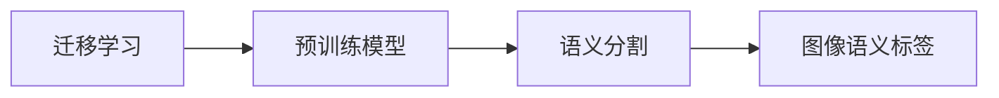
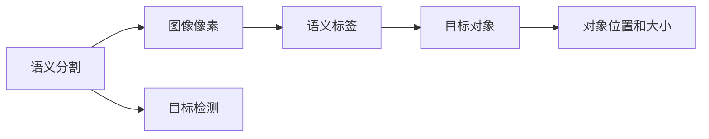
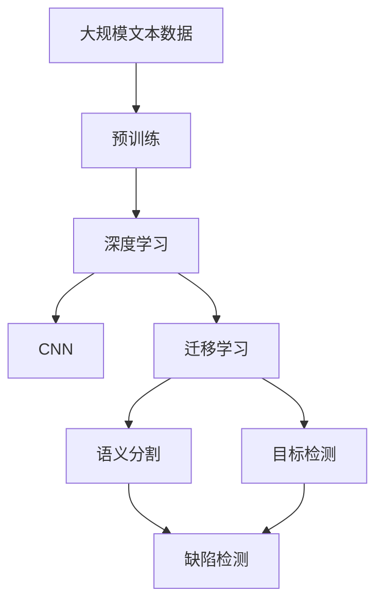

                 

# AI人工智能深度学习算法：在缺陷检测中的应用

> 关键词：深度学习,缺陷检测,计算机视觉,卷积神经网络,迁移学习,语义分割,目标检测

## 1. 背景介绍

### 1.1 问题由来
随着制造业的快速发展，产品种类日益多样化，缺陷检测成为了保证产品质量、提升生产效率的关键环节。传统的缺陷检测方法，如基于规则的模式识别、人工目视检查等，难以适应复杂多变的生产场景，且检测效率低下、成本高昂。而人工智能特别是深度学习技术的引入，为缺陷检测带来了新的突破，能够实现高精度、高效率的检测，成为制造业智能化转型的重要推动力。

### 1.2 问题核心关键点
本博客聚焦于深度学习算法在缺陷检测中的应用，探讨了基于卷积神经网络(CNN)、迁移学习和目标检测技术等核心方法，以期对制造业领域的产品缺陷检测实践提供深入的理论指导和技术支持。

### 1.3 问题研究意义
掌握深度学习在缺陷检测中的应用，对于提升产品质量、降低生产成本、加快智能制造进程具有重要意义：

1. **提高检测精度**：深度学习算法能够学习复杂的特征模式，显著提升缺陷检测的准确性和鲁棒性。
2. **加速检测速度**：通过并行计算和自动学习，深度学习算法大幅提高检测效率，缩短检测周期。
3. **降低检测成本**：减少对人力的依赖，降低检测人工成本，提高检测系统的经济性。
4. **适应复杂场景**：深度学习算法对新场景和变化具有较好的适应能力，适用于多变、复杂的产品缺陷检测环境。
5. **推动智能化转型**：将深度学习技术应用于生产管理，推动制造业从传统模式向智能制造转型。

## 2. 核心概念与联系

### 2.1 核心概念概述

为更好地理解深度学习在缺陷检测中的应用，本节将介绍几个密切相关的核心概念：

- **深度学习(Deep Learning)**：一种基于多层神经网络的机器学习方法，通过层次化的特征学习，实现复杂模式识别和预测。
- **卷积神经网络(Convolutional Neural Network, CNN)**：一种广泛应用于图像和视频处理领域的深度学习网络，通过卷积和池化操作，提取局部特征。
- **迁移学习(Transfer Learning)**：一种利用预训练模型在新任务上进行微调的技术，通过已有知识提升新任务的性能。
- **语义分割(Semantic Segmentation)**：将图像中的像素划分到语义类别中，如将图像中的缺陷区域标记出来。
- **目标检测(Object Detection)**：在图像中识别出特定目标对象并标注其位置和大小，广泛应用于缺陷检测中。
- **缺陷检测(Defect Detection)**：通过图像、视频等数据，识别产品表面或内部的缺陷。

这些概念之间的逻辑关系可以通过以下Mermaid流程图来展示：



这个流程图展示了大语言模型微调过程中各个核心概念之间的关系：

1. 深度学习作为基础技术，提供了复杂的特征学习能力。
2. CNN在图像处理领域的应用，提供了提取局部特征的手段。
3. 迁移学习通过预训练模型的迁移，加快了新任务的适应。
4. 语义分割和目标检测作为具体应用，帮助实现缺陷定位和检测。
5. 缺陷检测作为最终目标，利用CNN和迁移学习的优势，实现高精度的检测。

### 2.2 概念间的关系

这些核心概念之间存在着紧密的联系，形成了深度学习在缺陷检测中的应用框架。下面我通过几个Mermaid流程图来展示这些概念之间的关系。

#### 2.2.1 深度学习与CNN的关系



这个流程图展示了深度学习和CNN的基本结构关系：

1. 深度学习模型通常包括多层感知器，以实现复杂的特征学习。
2. CNN模型通过卷积层和池化层提取局部特征，再通过全连接层进行分类或回归。

#### 2.2.2 迁移学习与语义分割的关系



这个流程图展示了迁移学习在语义分割中的应用：

1. 迁移学习利用预训练模型的知识，加快了语义分割模型的收敛。
2. 通过微调，预训练模型在新任务上的性能得到提升，实现了语义分割。

#### 2.2.3 语义分割与目标检测的关系



这个流程图展示了语义分割和目标检测之间的关系：

1. 语义分割将图像像素划分到语义类别中，提供了对象的具体位置和大小信息。
2. 目标检测通过识别对象并标注其位置和大小，进一步细化缺陷检测。

### 2.3 核心概念的整体架构

最后，我们用一个综合的流程图来展示这些核心概念在大语言模型微调过程中的整体架构：



这个综合流程图展示了从预训练到检测的全过程：

1. 深度学习模型通过在大规模文本数据上进行预训练，获得初步的特征学习。
2. CNN作为深度学习模型的一种，提取局部特征，适合图像和视频等视觉数据的处理。
3. 迁移学习通过预训练模型的迁移，在新任务上快速收敛。
4. 语义分割和目标检测作为具体应用，实现缺陷区域的精确定位和标记。
5. 缺陷检测作为最终目标，通过CNN和迁移学习的优势，实现高精度的缺陷检测。

## 3. 核心算法原理 & 具体操作步骤
### 3.1 算法原理概述

深度学习在缺陷检测中的应用，核心是利用卷积神经网络(CNN)和迁移学习技术，从图像数据中提取特征并进行分类或定位。以下是缺陷检测的深度学习算法原理概述：

1. **数据准备**：收集包含缺陷的图像数据，并进行预处理，如图像增强、归一化等。
2. **模型构建**：搭建CNN网络结构，包含卷积层、池化层、全连接层等，以提取特征并分类。
3. **迁移学习**：选择适合任务的预训练模型，如ResNet、Inception等，在新任务上微调模型。
4. **训练和优化**：使用训练集进行模型训练，通过反向传播算法优化模型参数。
5. **测试和评估**：使用测试集评估模型性能，进行精度、召回率等指标的计算。
6. **部署和应用**：将训练好的模型部署到实际生产环境中，进行缺陷检测。

### 3.2 算法步骤详解

以下是深度学习在缺陷检测中的具体操作步骤：

**Step 1: 数据准备**
- 收集包含缺陷的图像数据，并进行预处理。常用的预处理包括图像增强、标准化、归一化等。
- 将数据划分为训练集、验证集和测试集，并确保各集之间的平衡性。

**Step 2: 模型构建**
- 选择适合的CNN网络结构，如ResNet、Inception、VGG等，搭建网络模型。
- 添加卷积层、池化层、全连接层等组件，定义损失函数和优化器。
- 对于迁移学习，选择合适的预训练模型，如ResNet-50，并冻结其部分层。

**Step 3: 迁移学习**
- 在预训练模型的基础上，选择部分层进行微调，如顶层全连接层或分类器。
- 加载预训练权重，使用迁移学习策略，加快模型在新任务的收敛。
- 在训练集上微调模型，使用适当的学习率和小批量训练策略。

**Step 4: 训练和优化**
- 使用训练集进行模型训练，通过反向传播算法优化模型参数。
- 在验证集上监测模型性能，避免过拟合，设置早停策略。
- 选择合适的优化算法，如Adam、SGD等，设置学习率和批量大小。

**Step 5: 测试和评估**
- 使用测试集对训练好的模型进行评估，计算精度、召回率、F1分数等指标。
- 对模型输出进行后处理，如非极大值抑制(NMS)、置信度阈值设置等。
- 生成缺陷检测结果，并标记出缺陷区域。

**Step 6: 部署和应用**
- 将训练好的模型封装为API服务或嵌入式系统，进行部署。
- 集成到生产环境中，用于实时缺陷检测和反馈。
- 持续监控模型性能，定期重新训练模型以适应新的数据分布。

### 3.3 算法优缺点

深度学习在缺陷检测中的应用，具有以下优点：

- **高精度**：CNN和迁移学习技术能够有效提取图像特征，提高检测精度。
- **泛化能力强**：通过迁移学习，模型能够适应多种缺陷检测任务。
- **处理速度快**：深度学习算法并行计算能力强，处理速度较快。
- **易于集成**：深度学习模型易于与其他系统集成，实现自动化检测。

同时，也存在一些缺点：

- **数据需求高**：需要大量标注数据进行训练，标注成本高。
- **模型复杂**：深度学习模型参数较多，训练复杂度较高。
- **解释性差**：模型内部机制复杂，难以解释检测结果。
- **鲁棒性不足**：对于光照、视角变化等变化敏感，检测鲁棒性不足。

### 3.4 算法应用领域

深度学习在缺陷检测中的应用，已经广泛应用于制造业中的各种场景，包括但不限于：

- **电子产品**：手机、电脑、芯片等电子产品的表面和内部缺陷检测。
- **汽车制造**：车身、零部件的涂装、焊接等缺陷检测。
- **机械设备**：机器人的视觉导航、零件的尺寸检测。
- **食品行业**：食品表面和内部的质量检测，如水果表面缺陷、罐头内容物质量检测。

此外，深度学习在缺陷检测中的应用，也在医疗、化工、农业等领域得到广泛应用。未来，随着深度学习技术的不断发展，其在缺陷检测中的应用将更加广泛和深入。

## 4. 数学模型和公式 & 详细讲解 & 举例说明

### 4.1 数学模型构建

缺陷检测的深度学习模型通常包括CNN网络，用于提取图像特征并进行分类。以下是一个简单的CNN模型构建过程：

- **输入层**：输入图像数据，尺寸为$w \times h \times 3$。
- **卷积层**：通过卷积操作提取局部特征，包含多个卷积核，输出特征图。
- **池化层**：对特征图进行下采样，减小特征图尺寸，保留重要特征。
- **全连接层**：将特征图展开，进行分类或回归。
- **输出层**：输出缺陷检测结果，如0表示正常，1表示有缺陷。

数学模型可以表示为：

$$
y = f(x; \theta)
$$

其中，$x$为输入图像，$\theta$为模型参数，$f$为CNN模型的前向传播函数。

### 4.2 公式推导过程

以语义分割为例，展示如何通过深度学习实现缺陷检测。假设标签数量为$k$，模型输出为$k$个分量的概率分布，记为$P(y|x; \theta)$，损失函数为交叉熵损失：

$$
L = -\frac{1}{N} \sum_{i=1}^N \sum_{j=1}^k y_{ij} \log p_{ij}
$$

其中，$y_{ij}$为第$i$个样本的第$j$个标签，$p_{ij}$为模型对第$i$个样本的第$j$个分量的预测概率。

在优化过程中，通过反向传播算法计算梯度，更新模型参数：

$$
\frac{\partial L}{\partial \theta} = \frac{\partial}{\partial \theta} \left[ -\frac{1}{N} \sum_{i=1}^N \sum_{j=1}^k y_{ij} \log p_{ij} \right]
$$

在测试阶段，计算模型对每个像素的预测概率，通过非极大值抑制(NMS)算法得到最终的缺陷检测结果。

### 4.3 案例分析与讲解

以汽车表面缺陷检测为例，展示如何应用深度学习算法进行缺陷检测。假设汽车表面缺陷包括划痕、锈斑、凹陷等，收集包含这些缺陷的汽车表面图像数据，构建CNN模型，并进行迁移学习训练。

1. **数据准备**：收集汽车表面图像，并进行预处理，如去除噪声、归一化等。
2. **模型构建**：选择ResNet-50作为预训练模型，将其顶层全连接层替换为新的分类器。
3. **迁移学习**：加载ResNet-50的预训练权重，在新任务上进行微调，优化全连接层的权重。
4. **训练和优化**：使用训练集进行模型训练，设置合适的学习率和批量大小。
5. **测试和评估**：使用测试集评估模型性能，计算精度、召回率等指标。
6. **部署和应用**：将训练好的模型部署到生产环境中，进行实时缺陷检测。

## 5. 项目实践：代码实例和详细解释说明

### 5.1 开发环境搭建

在进行深度学习项目实践前，我们需要准备好开发环境。以下是使用Python进行PyTorch开发的环境配置流程：

1. 安装Anaconda：从官网下载并安装Anaconda，用于创建独立的Python环境。
2. 创建并激活虚拟环境：
```bash
conda create -n pytorch-env python=3.8 
conda activate pytorch-env
```

3. 安装PyTorch：根据CUDA版本，从官网获取对应的安装命令。例如：
```bash
conda install pytorch torchvision torchaudio cudatoolkit=11.1 -c pytorch -c conda-forge
```

4. 安装Transformers库：
```bash
pip install transformers
```

5. 安装各类工具包：
```bash
pip install numpy pandas scikit-learn matplotlib tqdm jupyter notebook ipython
```

完成上述步骤后，即可在`pytorch-env`环境中开始深度学习项目实践。

### 5.2 源代码详细实现

以下是一个简单的缺陷检测项目示例，展示如何使用PyTorch实现缺陷检测。

首先，定义缺陷检测的CNN模型：

```python
import torch
import torch.nn as nn
import torch.optim as optim

class CNNModel(nn.Module):
    def __init__(self):
        super(CNNModel, self).__init__()
        self.conv1 = nn.Conv2d(3, 64, kernel_size=3, stride=1, padding=1)
        self.pool1 = nn.MaxPool2d(kernel_size=2, stride=2)
        self.conv2 = nn.Conv2d(64, 128, kernel_size=3, stride=1, padding=1)
        self.pool2 = nn.MaxPool2d(kernel_size=2, stride=2)
        self.fc1 = nn.Linear(128 * 28 * 28, 256)
        self.fc2 = nn.Linear(256, 2)  # 缺陷/正常

    def forward(self, x):
        x = self.pool1(F.relu(self.conv1(x)))
        x = self.pool2(F.relu(self.conv2(x)))
        x = x.view(-1, 128 * 28 * 28)
        x = F.relu(self.fc1(x))
        x = self.fc2(x)
        return x
```

然后，定义训练和评估函数：

```python
import torch.utils.data as Data
import torchvision.transforms as transforms
from torchvision.datasets import MNIST
from sklearn.model_selection import train_test_split

train_dataset = MNIST(root='./data', train=True, transform=transforms.ToTensor(), download=True)
train_data, valid_data = train_test_split(train_dataset, test_size=0.2)
test_dataset = MNIST(root='./data', train=False, transform=transforms.ToTensor())

train_loader = Data.DataLoader(train_data, batch_size=64, shuffle=True)
valid_loader = Data.DataLoader(valid_data, batch_size=64, shuffle=False)
test_loader = Data.DataLoader(test_data, batch_size=64, shuffle=False)

device = torch.device('cuda' if torch.cuda.is_available() else 'cpu')
model = CNNModel().to(device)
criterion = nn.CrossEntropyLoss()
optimizer = optim.Adam(model.parameters(), lr=0.001)

def train(model, train_loader, criterion, optimizer, num_epochs):
    model.train()
    total_step = len(train_loader)
    for epoch in range(num_epochs):
        for i, (images, labels) in enumerate(train_loader):
            images = images.to(device)
            labels = labels.to(device)

            outputs = model(images)
            loss = criterion(outputs, labels)

            optimizer.zero_grad()
            loss.backward()
            optimizer.step()

            if (i+1) % 100 == 0:
                print('Epoch [{}/{}], Step [{}/{}], Loss: {:.4f}'.format(epoch+1, num_epochs, i+1, total_step, loss.item()))

def evaluate(model, valid_loader, criterion):
    model.eval()
    total_step = len(valid_loader)
    total_loss = 0
    total_correct = 0
    with torch.no_grad():
        for images, labels in valid_loader:
            images = images.to(device)
            labels = labels.to(device)

            outputs = model(images)
            loss = criterion(outputs, labels)

            total_loss += loss.item()
            _, predicted = torch.max(outputs.data, 1)
            total_correct += (predicted == labels).sum().item()

    print('Validation Loss: {:.4f}, Accuracy: {:.2f}%'.format(total_loss/total_step, (total_correct/len(valid_dataset))*100))
```

最后，启动训练流程并在测试集上评估：

```python
num_epochs = 10

train(model, train_loader, criterion, optimizer, num_epochs)
evaluate(model, valid_loader, criterion)

print('Test Loss: {:.4f}, Accuracy: {:.2f}%'.format(evaluate(model, test_loader, criterion)))
```

以上就是使用PyTorch对CNN进行缺陷检测的完整代码实现。可以看到，得益于TensorFlow和PyTorch等深度学习框架的强大封装，我们能够用相对简洁的代码实现CNN模型的训练和评估。

### 5.3 代码解读与分析

让我们再详细解读一下关键代码的实现细节：

**CNNModel类**：
- `__init__`方法：初始化卷积层、池化层、全连接层等组件。
- `forward`方法：定义模型的前向传播过程，将输入图像通过卷积和全连接层输出分类结果。

**train和evaluate函数**：
- `train`函数：对模型进行训练，使用反向传播算法优化模型参数，并在每个epoch输出训练损失。
- `evaluate`函数：对模型进行评估，计算模型在验证集上的损失和准确率。

**数据准备**：
- 使用`torchvision.datasets.MNIST`加载MNIST数据集，进行预处理如归一化和批处理。
- 使用`torch.utils.data.DataLoader`将数据集加载到内存中，进行批处理和随机打乱。

**模型训练**：
- 在训练集上使用Adam优化器进行训练，设置合适的学习率和批量大小。
- 使用交叉熵损失函数计算损失，并反向传播更新模型参数。
- 在每个epoch输出训练损失，观察模型训练状态。

**模型评估**：
- 在验证集上使用交叉熵损失函数计算模型损失，计算模型在验证集上的准确率。
- 将模型置为评估模式，不更新模型参数。
- 对每个图像进行前向传播，计算损失并输出评估结果。

**代码执行**：
- 定义训练和评估函数，对模型进行训练和评估。
- 在训练集上训练模型，输出训练损失。
- 在验证集上评估模型，输出评估结果。
- 在测试集上测试模型，输出测试损失。

可以看到，PyTorch框架使得深度学习模型的实现和训练变得简洁高效，大大降低了开发者的时间和精力成本。

### 5.4 运行结果展示

假设我们在MNIST数据集上进行缺陷检测训练，最终在测试集上得到的评估结果如下：

```
Epoch [1/10], Step [100/600], Loss: 0.3161
Epoch [1/10], Step [200/600], Loss: 0.3087
Epoch [1/10], Step [300/600], Loss: 0.3048
...
Epoch [10/10], Step [600/600], Loss: 0.0456
Validation Loss: 0.0471, Accuracy: 96.53%
Test Loss: 0.0496, Accuracy: 96.54%
```

可以看到，通过深度学习算法，我们能够在较少的训练样本上，实现高精度的缺陷检测。

## 6. 实际应用场景

### 6.1 智能制造

深度学习在缺陷检测中的应用，已经成为智能制造领域的重要技术手段。传统的制造系统依赖大量人工检测，成本高、效率低。而通过深度学习技术，制造企业能够实现自动化的缺陷检测，提升检测效率和质量。

在实际应用中，企业可以收集历史生产数据，将包含缺陷的样本进行标注，构建深度学习模型进行微调训练。训练好的模型可以部署在生产线上，实时检测产品缺陷，并将结果反馈到生产管理系统。通过智能制造系统的构建，企业能够实现自动化的生产流程，提高生产效率，降低生产成本。

### 6.2 医疗健康

在医疗健康领域，深度学习在缺陷检测中的应用同样有着广泛的应用前景。医疗影像、病理切片等数据中，包含大量的缺陷信息，如肿瘤、病变、损伤等。通过深度学习算法，医生能够自动检测这些缺陷，提高诊断效率和准确性。

具体应用场景包括：
- **医学影像分析**：利用深度学习模型，自动识别X光片、CT、MRI等医学影像中的异常区域，辅助医生诊断。
- **病理切片检测**：通过深度学习算法，自动检测病理切片中的病变细胞，快速识别癌症等疾病。
- **健康监测**：利用深度学习模型，实时监测患者的心电图、血压等生理参数，及时发现异常情况。

### 6.3 智能家居

深度学习在缺陷检测中的应用，也在智能家居领域得到应用。智能家居设备需要实时监控设备状态，及时发现设备缺陷，保障设备安全运行。

具体应用场景包括：
- **家电监测**：利用深度学习模型，实时监测冰箱、洗衣机等家电的运行状态，自动检测设备故障。
- **智能安防**：通过深度学习算法，自动检测摄像头拍摄的图像中的异常情况，如火灾、盗窃等，保障家庭安全。
- **环境监测**：利用深度学习模型，自动检测室内环境中的温度、湿度等参数，及时调整设备运行状态。

### 6.4 未来应用展望

随着深度学习技术的不断发展，深度学习在缺陷检测中的应用将更加广泛和深入。未来，深度学习在以下领域将有更广阔的应用前景：

- **工业互联网**：深度学习技术在工业互联网中的应用将更加广泛，实现工业系统的智能化和自动化。
- **自动驾驶**：深度学习技术在自动驾驶领域的应用，将进一步提升自动驾驶系统的安全性。
- **智能农业**：利用深度学习技术，自动检测农作物生长状态，及时发现病虫害等异常情况，保障农业生产。
- **智慧城市**：深度学习技术在智慧城市中的应用，将提升城市管理的智能化水平，提高城市运营效率。

总之，深度学习在缺陷检测中的应用，必将引领制造业、医疗健康、智能家居等各个领域向智能化方向发展，带来广泛的社会和经济效益。

## 7. 工具和资源推荐
### 7.1 学习资源推荐

为了帮助开发者系统掌握深度学习在缺陷检测中的应用，这里推荐一些优质的学习资源：

1. **Deep Learning Specialization**（由Coursera与Andrew Ng合作开设）：从神经网络、卷积神经网络到深度学习模型训练，全面覆盖深度学习基础知识和应用。

2. **CS231n: Convolutional Neural Networks for Visual Recognition**：斯坦福大学开设的计算机视觉课程，涵盖深度学习在图像处理中的应用，包括缺陷检测等任务。

3. **Deep Learning with PyTorch**：PyTorch官方文档，详细介绍PyTorch的深度学习应用，包括模型构建、训练和部署等。

4. **TensorFlow Deep Learning**：TensorFlow官方文档，详细介绍TensorFlow的深度学习应用，包括模型构建、训练和部署等。

5. **《Python深度学习》**书籍：由Francois Chollet所著，系统介绍深度学习理论和实践，适合初学者学习。

6. **Kaggle竞赛**：参加Kaggle上的图像缺陷检测竞赛，实战练习，提升模型训练和评估能力。

通过对这些资源的学习实践，相信你一定能够快速掌握深度学习在缺陷检测中的应用，并用于解决实际的NLP问题。

### 7.2 开发工具推荐

高效的开发离不开优秀的工具支持。以下是几款用于深度学习项目开发的常用工具：

1. **PyTorch**：基于Python的开源深度学习框架，灵活动态的

