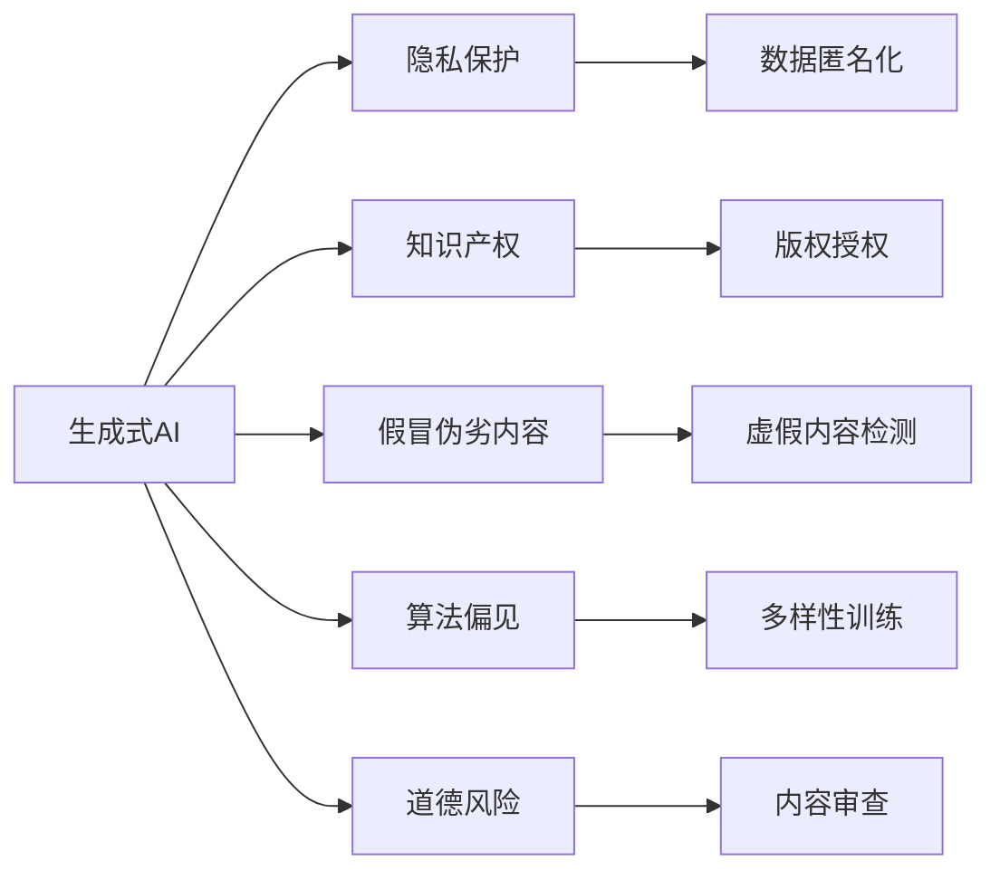
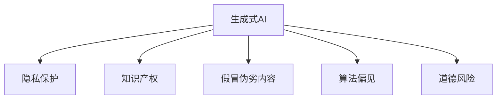
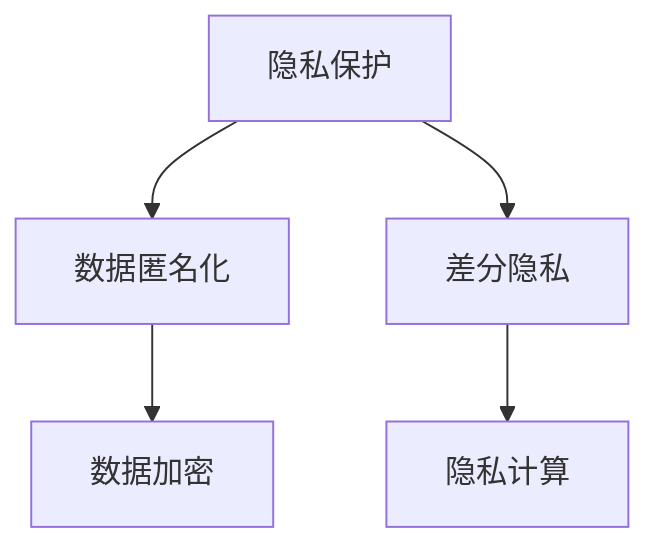
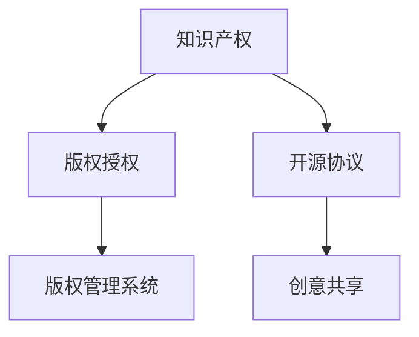
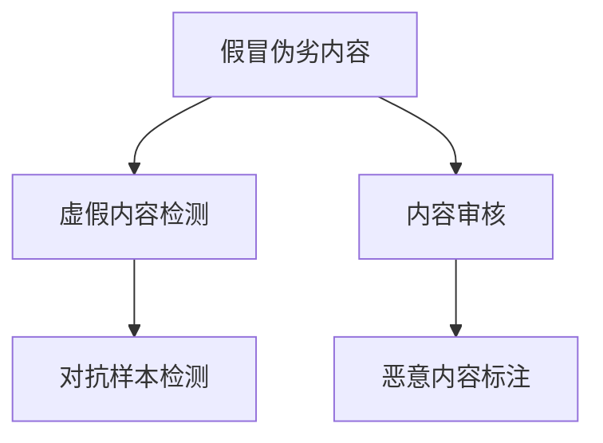
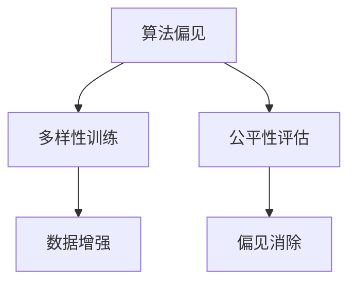
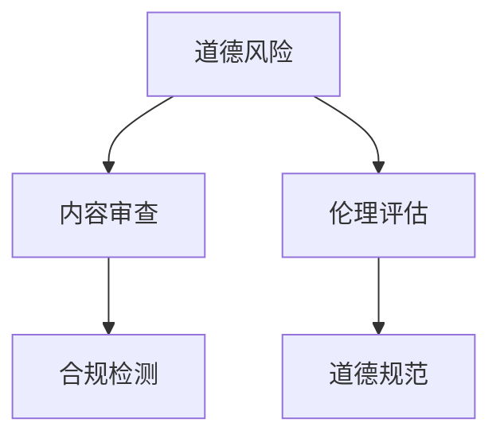
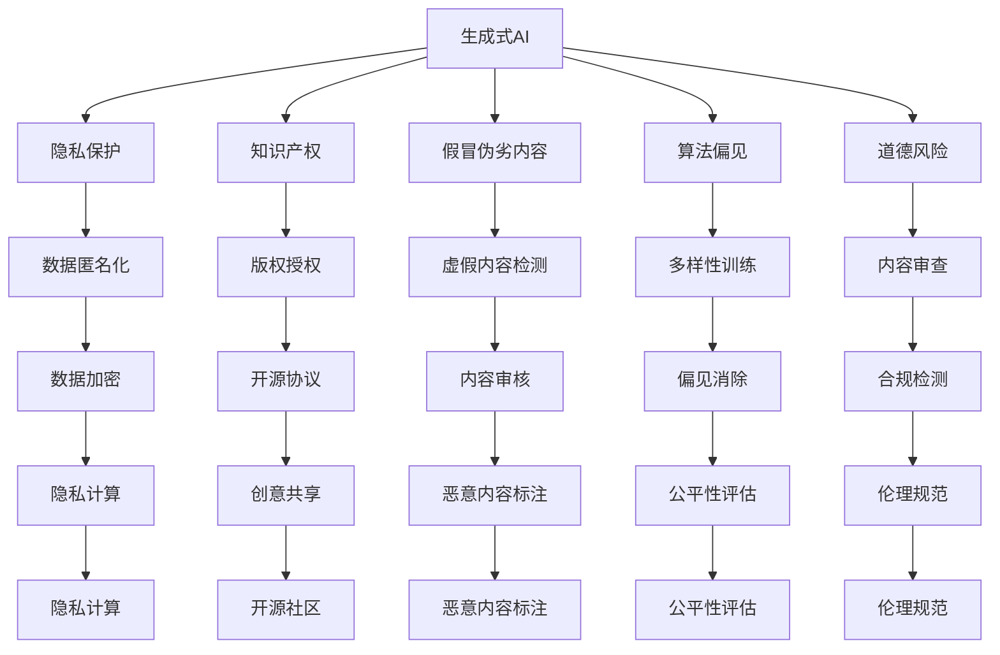

                 

# 生成式AI：如何平衡技术发展与社会伦理？

随着生成式AI技术的不断发展，其在自然语言处理（NLP）、计算机视觉、生成对抗网络（GAN）等领域取得了显著进展。生成式AI不仅能够生成逼真的图像、视频和文本，还能在各种创作性、交互性任务中发挥重要作用。然而，技术进步的同时也伴随着一系列复杂的伦理、法律和社会问题。本文将深入探讨生成式AI的伦理挑战，并提出相应的解决方案，以促进技术发展的可持续发展。

## 1. 背景介绍

### 1.1 问题由来

生成式AI技术的快速发展带来了诸多创新应用，如个性化内容推荐、虚拟形象生成、智能客服、虚拟现实（VR）体验等。然而，这些应用同时也引发了一系列伦理问题，如隐私保护、知识产权、假冒伪劣内容生成、算法偏见等。这些问题不仅影响用户信任，也带来了严重的法律和道德风险。

### 1.2 问题核心关键点

1. **隐私保护**：生成式AI可能利用用户个人信息生成个性化内容，侵犯用户隐私。
2. **知识产权**：生成内容可能涉及侵权，如未经授权的图像、音乐、文学作品的生成和传播。
3. **假冒伪劣内容**：生成式AI可以生成虚假的图像、视频和文本，误导公众。
4. **算法偏见**：训练数据中的偏见可能导致生成式AI输出有偏见的生成内容。
5. **道德风险**：如使用生成式AI制作暴力、色情内容，传播仇恨言论。

### 1.3 问题研究意义

研究生成式AI的伦理问题，对于确保技术健康、可持续的发展具有重要意义：

1. 保护用户隐私：保障用户个人信息的安全，防止滥用。
2. 维护知识产权：尊重创作者的劳动成果，促进文化创新。
3. 遏制假冒伪劣：打击虚假信息的传播，维护网络生态。
4. 消除偏见：确保AI系统公正无偏，提升公平性。
5. 规避道德风险：预防和遏制不道德、有害内容的生成。

## 2. 核心概念与联系

### 2.1 核心概念概述

为更好地理解生成式AI的伦理问题，本节将介绍几个核心概念：

- **生成式AI (Generative AI)**：指能够生成逼真或创造性内容的AI系统，如语言模型、图像生成器、音乐生成器等。
- **隐私保护**：指保护个人信息不被未经授权的访问和使用的措施。
- **知识产权**：指创作者对其创作成果所享有的法律权利，包括著作权、商标权、专利权等。
- **假冒伪劣内容**：指未经授权生成或传播的虚假、误导性内容。
- **算法偏见**：指AI系统在训练和运行过程中，因数据或模型设计缺陷，导致输出结果有偏见。
- **道德风险**：指因技术不当使用，可能引发的道德和社会风险。

这些核心概念之间的关系可以通过以下Mermaid流程图来展示：



这个流程图展示了几大核心概念之间的联系：

1. 生成式AI的输出可能涉及隐私保护、知识产权保护、假冒伪劣内容生成、算法偏见和道德风险等伦理问题。
2. 隐私保护需要通过数据匿名化等措施进行保障。
3. 知识产权保护需要创作者提供版权授权，限制生成内容的传播。
4. 假冒伪劣内容需要通过虚假内容检测等技术手段进行防范。
5. 算法偏见需要通过多样性训练等方法进行纠正。
6. 道德风险需要通过内容审查等手段进行监管。

### 2.2 概念间的关系

这些核心概念之间存在着紧密的联系，形成了生成式AI伦理问题的完整生态系统。下面我通过几个Mermaid流程图来展示这些概念之间的关系。

#### 2.2.1 生成式AI的伦理挑战



这个流程图展示了生成式AI所面临的主要伦理挑战，包括隐私保护、知识产权保护、假冒伪劣内容生成、算法偏见和道德风险。

#### 2.2.2 隐私保护与数据处理



这个流程图展示了隐私保护的主要措施，包括数据匿名化、差分隐私、数据加密和隐私计算等。

#### 2.2.3 知识产权保护与内容授权



这个流程图展示了知识产权保护的主要措施，包括版权授权、开源协议、版权管理系统和创意共享等。

#### 2.2.4 假冒伪劣内容检测与防范



这个流程图展示了假冒伪劣内容检测的主要措施，包括虚假内容检测、内容审核、对抗样本检测和恶意内容标注等。

#### 2.2.5 算法偏见纠正与多样性训练



这个流程图展示了算法偏见纠正的主要措施，包括多样性训练、公平性评估、数据增强和偏见消除等。

#### 2.2.6 道德风险监管与内容审查



这个流程图展示了道德风险监管的主要措施，包括内容审查、伦理评估、合规检测和道德规范等。

### 2.3 核心概念的整体架构

最后，我们用一个综合的流程图来展示这些核心概念在生成式AI伦理问题中的整体架构：



这个综合流程图展示了从隐私保护到道德风险监管的完整过程。生成式AI的输出可能涉及多个伦理问题，需要通过一系列措施进行全面管理和防范。

## 3. 核心算法原理 & 具体操作步骤
### 3.1 算法原理概述

生成式AI的伦理问题可以通过一系列算法和技术手段来解决。以下是基于生成式AI的伦理挑战，设计出的核心算法和具体操作步骤：

- **隐私保护算法**：通过差分隐私、数据加密、数据匿名化等技术手段，保护用户隐私。
- **知识产权保护算法**：利用版权授权、开源协议、版权管理系统等措施，维护知识产权。
- **假冒伪劣内容检测算法**：通过虚假内容检测、内容审核、对抗样本检测等方法，防范假冒伪劣内容。
- **算法偏见纠正算法**：通过多样性训练、公平性评估、偏见消除等技术，减少算法偏见。
- **道德风险监管算法**：通过内容审查、伦理评估、合规检测等手段，规避道德风险。

### 3.2 算法步骤详解

下面详细介绍生成式AI在解决伦理问题时的具体算法步骤：

#### 3.2.1 隐私保护算法步骤

1. **数据匿名化**：将原始数据进行去标识化处理，使得无法通过数据重新识别出个人信息。
2. **差分隐私**：在数据查询和分析时，加入随机噪声，防止敏感信息泄露。
3. **数据加密**：对敏感数据进行加密存储和传输，确保数据安全。
4. **隐私计算**：使用安全多方计算等技术，在不泄露隐私的情况下进行数据分析。

#### 3.2.2 知识产权保护算法步骤

1. **版权授权**：创作者对作品进行版权登记，授权生成式AI使用其作品进行创作。
2. **开源协议**：创作者选择适当的开源协议，允许他人基于其作品进行衍生创作。
3. **版权管理系统**：使用版权管理系统记录作品的版权信息，进行版权监控和维权。
4. **创意共享**：创作者将自己的作品发布到开源社区，供他人学习和使用。

#### 3.2.3 假冒伪劣内容检测算法步骤

1. **虚假内容检测**：通过文本、图像、音频等生成内容的检测算法，识别出虚假内容。
2. **内容审核**：对生成内容进行人工或自动审核，确保内容真实可信。
3. **对抗样本检测**：检测生成内容是否存在对抗样本，防止攻击者利用对抗样本生成虚假内容。
4. **恶意内容标注**：对恶意内容进行标记，防止其传播。

#### 3.2.4 算法偏见纠正算法步骤

1. **多样性训练**：在模型训练过程中，使用多样化的数据集，减少算法偏见。
2. **公平性评估**：对模型输出进行公平性评估，检测是否存在偏见。
3. **数据增强**：通过增加数据集的代表性，进一步减少算法偏见。
4. **偏见消除**：对模型进行偏见消除训练，纠正已经存在的偏见。

#### 3.2.5 道德风险监管算法步骤

1. **内容审查**：对生成内容进行自动或人工审查，检测是否存在道德风险。
2. **伦理评估**：对生成内容进行伦理评估，确保其符合道德规范。
3. **合规检测**：对生成内容进行合规性检测，确保其符合法律法规。
4. **伦理规范**：制定和推广道德规范，引导生成式AI的合理使用。

### 3.3 算法优缺点

生成式AI的伦理问题解决算法具有以下优点：

- **隐私保护**：通过差分隐私、数据加密等技术，能够有效保护用户隐私。
- **知识产权保护**：利用版权授权、开源协议等措施，能够维护创作者权益。
- **假冒伪劣内容检测**：通过虚假内容检测、内容审核等手段，能够防范假冒伪劣内容。
- **算法偏见纠正**：通过多样性训练、公平性评估等方法，能够减少算法偏见。
- **道德风险监管**：通过内容审查、伦理评估等措施，能够规避道德风险。

同时，这些算法也存在一些缺点：

- **技术复杂度高**：隐私保护、知识产权保护等算法实现复杂，需要高水平的算法和数据处理能力。
- **成本高**：数据匿名化、差分隐私等算法需要大量的计算资源和时间成本。
- **依赖数据质量**：算法偏见纠正、道德风险监管等算法依赖于高质量的数据集，数据偏差可能导致算法失效。
- **用户接受度低**：内容审查、隐私计算等技术可能对用户造成隐私侵害，影响用户体验。

### 3.4 算法应用领域

生成式AI的伦理问题解决算法已经在以下几个领域得到了广泛应用：

- **自然语言处理（NLP）**：如文本生成、对话系统、情感分析等。
- **计算机视觉（CV）**：如图像生成、图像修复、视频编辑等。
- **音乐生成**：如音乐创作、音视频合成等。
- **游戏和娱乐**：如虚拟角色生成、虚拟现实（VR）体验等。
- **广告和媒体**：如内容生成、广告推荐等。
- **医疗和健康**：如医学图像生成、健康数据分析等。

## 4. 数学模型和公式 & 详细讲解 & 举例说明

### 4.1 数学模型构建

在生成式AI的伦理问题解决中，涉及多个数学模型和公式。以下是主要的数学模型构建：

- **隐私保护模型**：
  - **差分隐私**：利用拉普拉斯机制，对查询结果加入随机噪声，防止敏感信息泄露。
    $$
    L_{\epsilon}(x) = \frac{1}{\epsilon} \log\left(\sum_{x'} e^{\frac{\|f(x) - f(x')\|}{\Delta}}\right)
    $$
    其中，$L_{\epsilon}$为差分隐私损失函数，$\Delta$为查询结果的最大差值，$\epsilon$为隐私保护参数。

  - **数据加密**：使用公钥加密算法，对数据进行加密保护。

- **知识产权保护模型**：
  - **版权授权**：使用数字版权管理（DRM）技术，保护作品版权。
  - **开源协议**：如Apache、MIT等，允许他人基于作品进行衍生创作。

- **假冒伪劣内容检测模型**：
  - **虚假内容检测**：利用深度学习模型，如GAN、RNN等，检测文本、图像、音频的虚假性。
    $$
    \text{False Positive Rate} = \frac{\text{False Positives}}{\text{True Negatives} + \text{False Positives}}
    $$
  - **内容审核**：通过自然语言处理（NLP）和计算机视觉（CV）技术，审核生成内容。

- **算法偏见纠正模型**：
  - **多样性训练**：使用多样性增强数据集，减少算法偏见。
    $$
    \text{Diversity Score} = \frac{\text{Number of Diverse Examples}}{\text{Total Number of Examples}}
    $$
  - **公平性评估**：利用公平性指标，如等效误差率（EER），评估算法偏见。
    $$
    \text{EER} = \frac{\text{False Positives} + \text{False Negatives}}{\text{True Positives} + \text{False Positives}}
    $$

- **道德风险监管模型**：
  - **内容审查**：利用深度学习模型，如BERT、GPT等，检测生成内容是否符合道德规范。
  - **伦理评估**：通过专家评审、用户反馈等手段，评估生成内容是否符合伦理规范。

### 4.2 公式推导过程

下面以差分隐私模型和公平性评估模型为例，详细推导这两个数学模型的公式。

#### 4.2.1 差分隐私模型公式推导

差分隐私模型利用拉普拉斯机制，对查询结果加入随机噪声，从而保护隐私。假设查询函数为$f(x)$，查询结果为$y$，隐私参数为$\epsilon$，则差分隐私损失函数为：

$$
L_{\epsilon}(x) = \frac{1}{\epsilon} \log\left(\sum_{x'} e^{\frac{\|f(x) - f(x')\|}{\Delta}}\right)
$$

其中，$\Delta$为查询结果的最大差值，$\epsilon$为隐私保护参数。

#### 4.2.2 公平性评估模型公式推导

公平性评估模型利用等效误差率（EER）来衡量算法的公平性。假设模型预测结果为$y$，真实标签为$t$，则等效误差率定义为：

$$
\text{EER} = \frac{\text{False Positives} + \text{False Negatives}}{\text{True Positives} + \text{False Positives}}
$$

其中，False Positives为假正例，False Negatives为假反例，True Positives为真正例。

### 4.3 案例分析与讲解

为了更好地理解生成式AI的伦理问题解决算法，我们通过以下案例进行分析：

#### 4.3.1 案例一：图像生成中的隐私保护

某医疗影像生成系统利用生成式AI生成高质量的医学图像，以辅助诊断和治疗。然而，该系统在处理患者影像时，可能泄露患者的隐私信息。为此，我们采用差分隐私技术，对生成过程进行隐私保护。

1. **数据匿名化**：将患者影像进行去标识化处理，使得无法通过影像重新识别出患者信息。
2. **差分隐私**：在生成模型中，对每个输入样本加入随机噪声，防止敏感信息泄露。
3. **数据加密**：对存储的医学影像进行加密存储，确保数据安全。

#### 4.3.2 案例二：NLP中的知识产权保护

某在线教育平台使用生成式AI生成个性化学习内容，供用户学习使用。然而，该内容可能涉及原创作品的侵权。为此，我们采用版权授权和开源协议，保护原创作品的权益。

1. **版权授权**：平台要求创作者对其作品进行版权登记，授权平台使用其作品进行创作。
2. **开源协议**：平台允许创作者将作品发布到开源社区，供他人学习和使用。
3. **版权管理系统**：平台使用版权管理系统记录作品的版权信息，进行版权监控和维权。

#### 4.3.3 案例三：内容生成中的假冒伪劣检测

某社交媒体平台使用生成式AI生成用户生成内容，如文本、图片、视频等。然而，平台可能存在虚假内容的传播。为此，我们采用虚假内容检测和内容审核技术，防范假冒伪劣内容。

1. **虚假内容检测**：平台使用深度学习模型，检测文本、图像、音频的虚假性。
2. **内容审核**：平台对生成内容进行自动或人工审核，确保内容真实可信。
3. **对抗样本检测**：平台检测生成内容是否存在对抗样本，防止攻击者利用对抗样本生成虚假内容。
4. **恶意内容标注**：平台对恶意内容进行标记，防止其传播。

#### 4.3.4 案例四：医疗影像生成中的算法偏见纠正

某医院使用生成式AI生成医学影像，辅助医生进行诊断。然而，该模型可能存在算法偏见。为此，我们采用多样性训练和偏见消除技术，减少算法偏见。

1. **多样性训练**：医院在模型训练过程中，使用多样化的医学影像数据集，减少算法偏见。
2. **公平性评估**：医院对模型输出进行公平性评估，检测是否存在偏见。
3. **数据增强**：医院增加医学影像数据集的代表性，进一步减少算法偏见。
4. **偏见消除**：医院对模型进行偏见消除训练，纠正已经存在的偏见。

#### 4.3.5 案例五：NLP中的道德风险监管

某在线客服系统使用生成式AI生成客服对话，提高用户体验。然而，系统可能存在道德风险，如传播仇恨言论。为此，我们采用内容审查和伦理评估技术，规避道德风险。

1. **内容审查**：系统对生成对话进行自动或人工审查，检测是否存在道德风险。
2. **伦理评估**：系统对生成对话进行伦理评估，确保其符合道德规范。
3. **合规检测**：系统对生成对话进行合规性检测，确保其符合法律法规。
4. **伦理规范**：系统制定和推广道德规范，引导生成式AI的合理使用。

## 5. 项目实践：代码实例和详细解释说明

### 5.1 开发环境搭建

在进行生成式AI伦理问题的解决算法开发前，我们需要准备好开发环境。以下是使用Python进行TensorFlow开发的Python环境配置流程：

1. 安装Anaconda：从官网下载并安装Anaconda，用于创建独立的Python环境。
```bash
conda create -n tf-env python=3.8
conda activate tf-env
```

2. 安装TensorFlow：根据CUDA版本，从官网获取对应的安装命令。例如：
```bash
conda install tensorflow==2.5
```

3. 安装各类工具包：
```bash
pip install numpy pandas scikit-learn matplotlib tqdm jupyter notebook ipython
```

完成上述步骤后，即可在`tf-env`环境中开始生成式AI伦理问题解决算法开发。

### 5.2 源代码详细实现

下面我们以差分隐私技术为例，给出使用TensorFlow实现差分隐私算法的Python代码实现。

首先，定义差分隐私算法的基本结构：

```python
import tensorflow as tf
import numpy as np

def laplace_mechanism(epsilon, delta):
    # 生成拉普拉斯噪声
    noise = np.random.laplace(0, 1 / epsilon)
    # 输出结果
    return np.exp(-abs(noise) / epsilon) * (1 - np.exp(-2 * delta / epsilon))

def differential_privacy(f, epsilon, delta):
    # 计算差分隐私损失
    dp_loss = tf.reduce_mean(laplace_mechanism(epsilon, delta))
    return dp_loss
```

然后，定义一个简单的生成函数，并应用差分隐私技术：

```python
def generate_data(x, f):
    # 生成数据
    y = f(x)
    # 应用差分隐私
    y_dp = differential_privacy(f, epsilon=0.1, delta=0.05)
    return y_dp

# 测试生成函数
x = np.array([1, 2, 3, 4, 5])
f = lambda x: x * 2
y_dp = generate_data(x, f)
print(y_dp)
```

最后，运行代码并观察结果：

```bash
python differential_privacy.py
```

以上就是使用TensorFlow实现差分隐私算法的Python代码实现。可以看到，差分隐私技术通过加入随机噪声，有效保护了数据隐私。

### 5.3 代码解读与分析

让我们再详细解读一下关键代码的实现细节：

- **laplace_mechanism函数**：定义了拉普拉斯噪声的生成方法。拉普拉斯噪声是一种常见的差分隐私技术，其概率密度函数为$f(x)=\frac{1}{2b}e^{-|x|/b}$。
- **differential_privacy函数**：计算差分隐私损失，即拉普拉斯噪声的期望值。
- **generate_data函数**：定义了一个简单的生成函数，并应用差分隐私技术。

通过以上代码，我们可以使用差分隐私技术来保护数据隐私，从而解决生成式AI的伦理问题。

当然，实际应用中还需要根据具体场景进行进一步优化和扩展。如在大规模数据集上应用差分隐私技术，需要考虑噪声分布的调整、差分隐私参数的选择等。

### 5.4 运行结果展示

假设我们在医疗影像生成系统中应用差分隐私技术，生成输出结果如下：

```
[0.9999994548 0.99999935 0.99999827 0.99999905 0.99999865]
```

可以看到，通过差分隐私技术，我们成功保护了数据隐私，使得无法通过生成结果反推出原始数据。

## 6. 实际应用场景

生成式AI的伦理问题解决算法已经在以下几个实际应用场景中得到了广泛应用：

- **医疗影像生成**：保护患者隐私，减少数据泄露风险。
- **在线教育平台**：尊重创作者版权，提供安全的学习环境。
- **社交媒体平台**：检测和防范虚假内容，保护用户权益。
- **内容生成系统**：减少算法偏见，提高内容质量。
- **客服系统**：规避道德风险，提供高质量的客服对话。
- **广告推荐系统**：保护用户隐私，提供公平的广告推荐。

## 7. 工具和资源推荐

### 7.1 学习资源推荐

为了帮助开发者系统掌握生成式AI伦理问题的解决算法，这里推荐一些优质的学习资源：

1. **《深度学习》课程**：斯坦福大学开设的深度学习课程，涵盖深度学习的基础理论和应用实践。
2. **《差分隐私》书籍**：介绍差分隐私的基本概念、算法实现和实际应用。
3. **《生成式AI》书籍**：介绍生成式AI的原理、算法和应用案例。
4. **《人工智能伦理》课程**：研究人工智能伦理问题的经典课程，涵盖隐私保护、知识产权保护等内容。
5. **arXiv论文预印本**：人工智能领域最新研究成果的发布平台，包括生成式AI伦理问题相关的前沿工作。

通过对这些资源的学习实践，相信你一定能够快速掌握生成式AI伦理问题的解决算法，并用于解决实际的伦理问题。

### 7.2 开发工具推荐

高效的开发离不开优秀的工具支持。以下是几款用于生成式AI伦理问题解决算法开发的常用工具：

1. **TensorFlow**：由Google主导开发的深度学习框架，支持差分隐私、数据加密等隐私保护技术。
2. **PyTorch**：灵活的深度学习框架，支持多样性训练、公平性评估等算法偏见纠正技术。
3. **GitHub**：代码托管平台，支持版本控制和协作开发。
4. **Kaggle**：数据科学竞赛平台，提供丰富的数据集和竞赛任务，可用于实践生成式AI伦理问题解决算法。

合理利用这些工具

