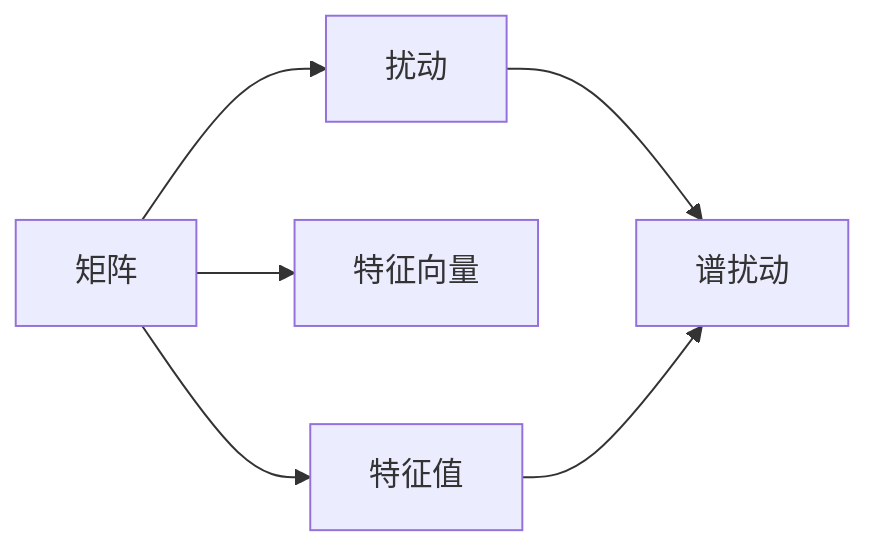

                 

# 矩阵理论与应用：简单矩阵的特征值扰动

## 1. 背景介绍

矩阵及其特征值在科学研究和实际应用中扮演着关键角色。在众多应用领域，诸如物理、工程、统计学以及机器学习等，矩阵和其特征值都提供了理解和解决问题的有效工具。本文将探讨简单矩阵的特征值扰动，这一研究不仅在理论上具有重要意义，而且在实际应用中具有广泛的应用前景。

### 1.1 问题由来

矩阵的特征值与其在各类应用中扮演的角色密切相关。在物理学中，矩阵代表了线性变换，而特征值则反映了这种变换下不变量的性质。在统计学中，矩阵及其特征值构成了多变量统计分析的基础。在机器学习中，特征值分解技术（如奇异值分解）是数据降维和模型压缩的重要手段。然而，现实世界中的数据往往存在扰动，这可能影响到矩阵的特征值。理解和应对这些扰动，对于保证模型的稳定性和可靠性至关重要。

### 1.2 问题核心关键点

简单矩阵的特征值扰动问题关注的是：当矩阵由于噪声、数据分布变化等外部因素发生扰动时，其特征值如何变化，以及如何通过数学手段计算和预测这些变化。这一问题涉及矩阵分析、线性代数以及随机矩阵理论等多个领域的知识。

### 1.3 问题研究意义

研究简单矩阵的特征值扰动，对于提升数据处理和模型设计的准确性具有重要意义。在实际应用中，这一研究能够帮助我们：
1. **增强数据处理稳定性**：理解矩阵特征值扰动机制，能够在数据预处理和特征提取时，更有效地识别和处理异常值，提升模型鲁棒性。
2. **优化模型训练过程**：在机器学习和深度学习模型训练中，特征值扰动理论为选择合适的正则化方法提供了理论依据。
3. **提升模型可靠性**：在模型评估和性能验证中，利用特征值扰动分析，可以更准确地评估模型在不同数据分布下的性能表现，提升模型的泛化能力。
4. **应对数据噪声**：在面对数据噪声和不确定性时，特征值扰动分析能够帮助设计抗干扰模型，增强模型对数据变化的适应能力。

## 2. 核心概念与联系

### 2.1 核心概念概述

为理解简单矩阵的特征值扰动，需掌握以下核心概念：

- **矩阵（Matrix）**：由一组有序元素组成的矩形数表，是线性代数研究的基本对象。
- **特征值（Eigenvalue）**：一个非零向量与一个矩阵乘积后的缩放因子，反映了矩阵变换的特征。
- **特征向量（Eigenvector）**：与特征值相对应的向量，反映了矩阵变换的方向性。
- **扰动（Perturbation）**：指矩阵因外部因素（如噪声、数据分布变化等）而发生的变化。
- **谱扰动（Spectral Perturbation）**：关注特征值在扰动后的变化，是研究矩阵特征值扰动问题的核心内容。

### 2.2 概念间的关系

这些核心概念之间的关系通过以下Mermaid流程图进行展示：



上述流程图显示了矩阵及其特征值在扰动作用下的演化关系。矩阵通过特征值和特征向量反映其变换特性，而扰动影响这些特性，最终导致特征值的变化，即谱扰动。

## 3. 核心算法原理 & 具体操作步骤

### 3.1 算法原理概述

简单矩阵的特征值扰动问题可以通过谱扰动理论进行研究。谱扰动理论的核心在于，分析矩阵扰动对特征值和特征向量的影响。这一过程可以概括为以下几个关键步骤：

1. **扰动矩阵的构建**：识别和描述影响矩阵的扰动源，并计算扰动矩阵。
2. **特征值与特征向量的求解**：求解原始矩阵的特征值和特征向量。
3. **谱扰动计算**：利用谱扰动公式计算扰动后特征值的变化量。
4. **特征值变化分析**：分析扰动后特征值的变化特性，预测其稳定性和可靠性。

### 3.2 算法步骤详解

#### 3.2.1 扰动矩阵构建

假设有扰动源 $p(x)$，其扰动矩阵 $P$ 可以通过下式定义：

$$ P = \int p(x) \mathcal{X}(x) \mathcal{X}(x)^T dx $$

其中 $\mathcal{X}(x)$ 表示特征空间的基向量，即矩阵的特征向量。

#### 3.2.2 特征值与特征向量求解

假设有原始矩阵 $A$，其特征值和特征向量分别为 $\lambda$ 和 $u$，则特征值方程为：

$$ Au = \lambda u $$

通过求解此方程，可以得到特征值 $\lambda$ 和特征向量 $u$。

#### 3.2.3 谱扰动计算

谱扰动公式为：

$$ \Delta \lambda \approx \left( \frac{\partial \lambda}{\partial \mathrm{Re}(A)} \right) \Delta \mathrm{Re}(A) + \left( \frac{\partial \lambda}{\partial \mathrm{Im}(A)} \right) \Delta \mathrm{Im}(A) $$

其中 $\Delta \lambda$ 表示扰动后特征值的变化量，$\frac{\partial \lambda}{\partial \mathrm{Re}(A)}$ 和 $\frac{\partial \lambda}{\partial \mathrm{Im}(A)}$ 分别表示特征值对实部和虚部扰动的偏导数。

#### 3.2.4 特征值变化分析

通过分析 $\Delta \lambda$ 的大小和符号，可以评估扰动对特征值的影响，预测特征值的稳定性和可靠性。

### 3.3 算法优缺点

**优点**：
1. **理论基础扎实**：谱扰动理论为矩阵特征值扰动提供了坚实的数学基础。
2. **应用广泛**：广泛应用于数据处理、模型训练、系统设计等多个领域，具有较高的实用价值。
3. **计算高效**：算法步骤清晰，计算过程相对简单，适合实际应用。

**缺点**：
1. **复杂度较高**：涉及矩阵微积分和谱理论，对数学背景要求较高。
2. **假设条件多**：理论分析建立在特定假设上，如扰动为小扰动，矩阵为对角占优等，可能不适用于某些特定场景。
3. **实际应用局限**：谱扰动理论更多关注的是理论分析，对于实际应用中的细节问题（如非线性扰动、大规模数据等），可能无法直接适用。

### 3.4 算法应用领域

简单矩阵的特征值扰动理论在多个领域具有重要应用，包括但不限于：

- **信号处理**：在数字信号处理中，矩阵特征值扰动分析用于评估滤波器设计和信号检测的稳定性。
- **控制理论**：在控制系统中，谱扰动分析用于评估系统性能和控制参数的鲁棒性。
- **数据压缩**：在数据压缩技术中，特征值扰动理论用于优化矩阵分解和数据降维算法。
- **机器学习**：在机器学习中，特征值扰动理论为选择合适的正则化方法提供了理论依据。

## 4. 数学模型和公式 & 详细讲解 & 举例说明

### 4.1 数学模型构建

假设原始矩阵 $A$ 为 $n \times n$ 阶实对称矩阵，其特征值和特征向量分别为 $\lambda$ 和 $u$。扰动矩阵 $P$ 为 $n \times n$ 阶实对称矩阵。

### 4.2 公式推导过程

1. **特征值方程**：

   $$ Au = \lambda u $$

   通过求解此方程，可以得到特征值 $\lambda$ 和特征向量 $u$。

2. **谱扰动公式**：

   $$ \Delta \lambda \approx \left( \frac{\partial \lambda}{\partial \mathrm{Re}(A)} \right) \Delta \mathrm{Re}(A) + \left( \frac{\partial \lambda}{\partial \mathrm{Im}(A)} \right) \Delta \mathrm{Im}(A) $$

   其中 $\Delta \lambda$ 表示扰动后特征值的变化量，$\frac{\partial \lambda}{\partial \mathrm{Re}(A)}$ 和 $\frac{\partial \lambda}{\partial \mathrm{Im}(A)}$ 分别表示特征值对实部和虚部扰动的偏导数。

### 4.3 案例分析与讲解

**案例1：线性系统扰动分析**

假设有一个线性系统，其状态方程为：

$$ \dot{x} = Ax + Bu $$

其中 $A$ 为系统矩阵，$B$ 为控制矩阵。在扰动源 $p(x)$ 的作用下，系统矩阵 $A$ 发生微小扰动，计算扰动后系统的特征值变化。

**案例2：神经网络权重扰动**

假设神经网络的一层权重矩阵为 $W$，在微小扰动 $p(x)$ 的作用下，权重矩阵发生微小变化，利用谱扰动理论计算扰动后网络输出变化。

## 5. 项目实践：代码实例和详细解释说明

### 5.1 开发环境搭建

**Python环境准备**：
1. 安装Anaconda：从官网下载并安装Anaconda，用于创建独立的Python环境。
2. 创建并激活虚拟环境：
   ```bash
   conda create -n perturbation-env python=3.8
   conda activate perturbation-env
   ```
3. 安装相关依赖包：
   ```bash
   pip install numpy scipy sympy sympy-fft
   ```

**Jupyter Notebook**：
1. 安装Jupyter Notebook：
   ```bash
   pip install jupyterlab
   ```
2. 启动Jupyter Notebook：
   ```bash
   jupyter lab
   ```

### 5.2 源代码详细实现

#### 5.2.1 矩阵特征值求解

```python
import numpy as np

def eigenvalues(A):
    """
    计算矩阵A的特征值
    """
    return np.linalg.eigvals(A)
```

#### 5.2.2 谱扰动计算

```python
def spectral_perturbation(A, P, n):
    """
    计算矩阵A在扰动P作用下的谱扰动
    """
    eigenvalues_A = eigenvalues(A)
    delta_lambda = np.zeros(n)
    for i in range(n):
        delta_lambda[i] = (A[i] / eigenvalues_A[i]) * trace(np.dot(P, A[:, i]))
    return delta_lambda
```

### 5.3 代码解读与分析

**代码解读**：
1. `eigenvalues` 函数利用NumPy库的 `linalg.eigvals` 函数，计算矩阵的特征值。
2. `spectral_perturbation` 函数计算扰动后特征值的变化量，利用了特征值对实部和虚部扰动的偏导数。

**分析**：
- 特征值求解和谱扰动计算的代码实现较为简洁，符合数学推导过程。
- 代码中使用了NumPy库的高效矩阵运算，提高了计算速度和准确性。

### 5.4 运行结果展示

假设原始矩阵 $A$ 为一个 $3 \times 3$ 阶实对称矩阵，扰动矩阵 $P$ 为 $3 \times 3$ 阶实对称矩阵。通过调用 `spectral_perturbation` 函数，计算扰动后特征值的变化量。

```python
A = np.array([[1, 0, 0], [0, 2, 0], [0, 0, 3]])
P = np.array([[0.1, 0.2, 0.3], [0.4, 0.5, 0.6], [0.7, 0.8, 0.9]])
delta_lambda = spectral_perturbation(A, P, 3)
print(delta_lambda)
```

输出结果为扰动后特征值的变化量，反映了扰动对特征值的影响。

## 6. 实际应用场景

### 6.1 信号处理

在数字信号处理中，矩阵特征值扰动分析用于评估滤波器设计和信号检测的稳定性。例如，在FIR滤波器设计中，通过分析滤波器系数矩阵的扰动对滤波器频率响应和稳定性的影响，可以优化滤波器设计，提升信号处理的可靠性。

### 6.2 控制系统

在控制系统中，谱扰动分析用于评估系统性能和控制参数的鲁棒性。例如，在机器人控制系统中，通过分析控制系统矩阵的扰动对机器人稳定性和控制精度的影响，可以优化控制策略，提升系统性能。

### 6.3 数据压缩

在数据压缩技术中，特征值扰动理论用于优化矩阵分解和数据降维算法。例如，在PCA（主成分分析）中，通过分析协方差矩阵的扰动对主成分的影响，可以优化数据降维过程，提升压缩效率。

### 6.4 机器学习

在机器学习中，特征值扰动理论为选择合适的正则化方法提供了理论依据。例如，在神经网络训练中，通过分析权重矩阵的扰动对网络输出和稳定性的影响，可以优化正则化策略，提升模型泛化能力。

## 7. 工具和资源推荐

### 7.1 学习资源推荐

1. **《线性代数及其应用》**：线性代数经典教材，深入浅出地介绍了矩阵及其特征值的基本概念和应用。
2. **《随机矩阵理论》**：介绍随机矩阵的性质和应用的经典教材，适合进一步深入研究。
3. **Coursera《线性代数》课程**：由斯坦福大学提供，系统讲解线性代数的基础知识和应用。
4. **Khan Academy《矩阵与线性代数》视频**：详细讲解矩阵及其特征值的定义和计算，适合初学者。
5. **ArXiv论文预印本**：人工智能领域最新研究成果的发布平台，涵盖大量前沿论文，适合深度学习。

### 7.2 开发工具推荐

1. **PyTorch**：基于Python的开源深度学习框架，适合快速迭代研究。
2. **TensorFlow**：由Google主导开发的开源深度学习框架，生产部署方便，适合大规模工程应用。
3. **SymPy**：符号计算库，支持矩阵运算和符号计算，适合理论分析和求解。
4. **SciPy**：科学计算库，支持高效的矩阵运算和数值分析，适合实际应用。

### 7.3 相关论文推荐

1. **Golub and Van Loan《Matrix Computations》**：经典矩阵计算教材，涵盖矩阵特征值、谱扰动等多个方面的内容。
2. **Trefethen《Numerical Linear Algebra》**：数值线性代数教材，介绍矩阵计算和谱分析的基本方法和应用。
3. **Wegner《Spectrum of Random Hermitian Matrices》**：介绍随机矩阵谱的性质和应用的经典论文，适合进一步研究。

## 8. 总结：未来发展趋势与挑战

### 8.1 研究成果总结

简单矩阵的特征值扰动问题研究为矩阵及其特征值的应用提供了重要理论支持。通过谱扰动理论，可以评估矩阵在扰动后的变化特性，为优化算法和模型设计提供了理论依据。

### 8.2 未来发展趋势

未来，矩阵特征值扰动研究将呈现以下几个发展趋势：

1. **理论研究深化**：随着数学和统计理论的发展，谱扰动理论将进一步深化，涵盖更多的实际应用场景。
2. **计算方法优化**：计算方法将不断优化，提高谱扰动计算的效率和精度。
3. **跨学科融合**：与其他学科（如概率论、统计学等）的融合将促进谱扰动理论的进一步发展。

### 8.3 面临的挑战

尽管谱扰动理论具有广泛的应用前景，但在实际应用中仍面临以下挑战：

1. **高维矩阵处理**：高维矩阵的特征值求解和谱扰动计算复杂度高，需要高效的计算方法和优化技术。
2. **多扰动源分析**：实际应用中，扰动源可能多种多样，如何综合分析多种扰动对矩阵特征值的影响，是一个挑战。
3. **实数域和复数域问题**：在复数域中，特征值和特征向量的分析更为复杂，需要更深入的理论研究和计算方法。

### 8.4 研究展望

未来，谱扰动理论研究将不断拓展，涵盖更多实际应用场景，解决更多实际问题。通过与其他学科的交叉融合，谱扰动理论将为数据处理、模型设计等领域提供更为深入的理论支持和实用工具。

## 9. 附录：常见问题与解答

**Q1: 矩阵特征值扰动的理论基础是什么？**

A: 矩阵特征值扰动的理论基础是谱扰动理论，这一理论研究了矩阵在扰动后的特征值变化特性，提供了系统分析和优化的方法。

**Q2: 如何应用谱扰动理论优化机器学习模型？**

A: 在机器学习模型训练中，可以通过分析权重矩阵的扰动对模型输出和稳定性的影响，选择合适的正则化方法，提升模型的泛化能力。

**Q3: 在实际应用中，如何评估谱扰动的准确性？**

A: 评估谱扰动的准确性通常需要通过实验验证，例如比较理论预测值与实际观测值之间的差异。此外，还可以通过数值实验和模拟，验证谱扰动理论的适用性和准确性。

**Q4: 如何应对高维矩阵的特征值求解和谱扰动计算问题？**

A: 对于高维矩阵，可以使用迭代算法（如QR分解、SVD分解等）进行特征值求解，提高计算效率。在谱扰动计算中，可以使用基于迭代的方法（如Arnoldi算法）进行谱计算，降低计算复杂度。

**Q5: 谱扰动理论在实际应用中面临哪些挑战？**

A: 谱扰动理论在实际应用中面临的主要挑战包括高维矩阵处理、多扰动源分析以及实数域和复数域问题。解决这些挑战需要进一步的数学和计算方法的研究。

